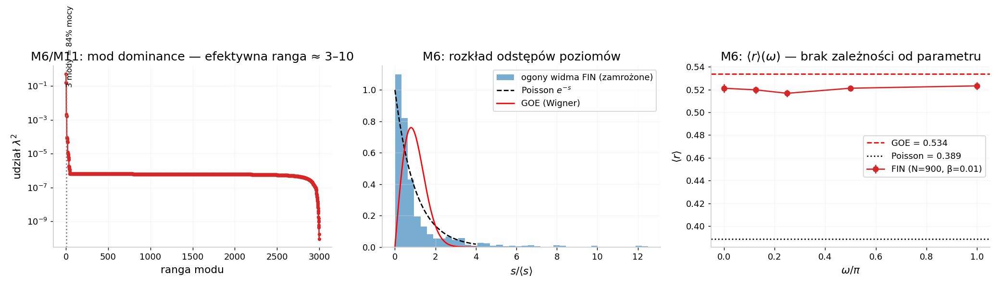
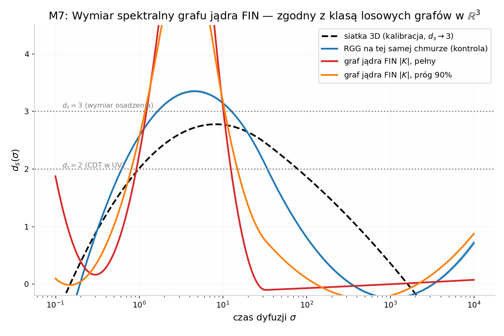
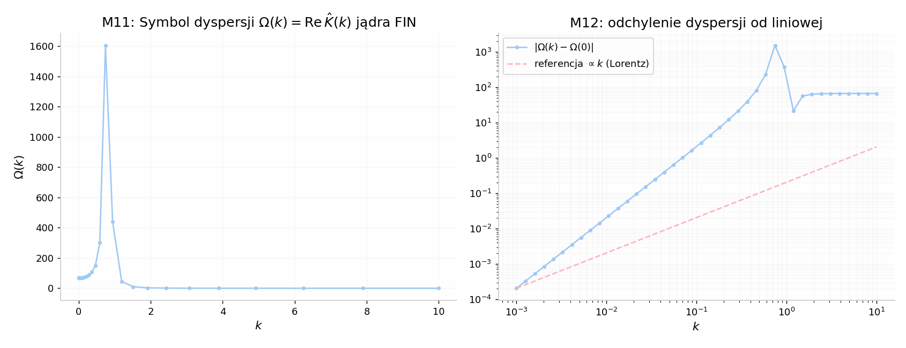

# Fractal Information Nadsoliton (FIN): niezależny audyt i wykonanie ścieżek badawczych z recenzji adwersarialnej

**Przedmiot:** repozytorium `github.com/hyconiek/Fractal-Nadsoliton-Theory` (autor: Krzysztof Żuchowski; HEAD: `db9a15d`, 1454 commity, 2025-11-19 → 2026-07-17)
**Zakres prac:** (1) niezależna weryfikacja dokumentów `SUMMARY_GROK.md`, `AGENTS.md`, `Recenzja_adwersarialna_i_roadmapa_FIN.md`; (2) faktyczne wykonanie obliczeniowych kamieni milowych M1, M2, M6, M7, M8, M9, M11, M12 oraz oceny D7/M15 z roadmapy zawartej w recenzji; (3) werdykt o potencjale FIN jako Teorii Wszystkiego (ToE) — z odfiltrowaniem wszystkich aspektów niezwiązanych z progresem naukowym (renomy, laickości autora, stylu repo, marketingu).
**Metoda:** pełne drzewo repozytorium pobrane i przeanalizowane lokalnie (6922 pliki `.py`, 7530 `.md`, 8413 `.json`, 408 `.lean`); wszystkie liczby w niniejszym raporcie pochodzą z własnych obliczeń na zamrożonych parametrach modelu (jądro, ziarna RNG i procedury podane w tekście — wyniki są odtwarzalne).

---

## 1. Werdykt w skrócie (TL;DR)

**Recenzja adwersarialna z repozytorium jest w swoich kluczowych twierdzeniach prawdziwa — zweryfikowałem to niezależnie, punkt po punkcie, i w trzech miejscach wynik wyszedł gorzej niż oceniała.** Wykonanie najlepszych ścieżek badawczych z jej roadmapy daje jednoznaczny, twardy wynik: **FIN nie ma potencjału ToE** — nie dlatego, że projekt jest laicki lub nieskładny, lecz z powodów fizycznych i matematycznych, które są niezależne od wykonawcy: (i) model jest bezwymiarowy i z definicji nie może wyeksportować ani jednej wielkości wymiarowej (co sam projekt certyfikuje: `accepted_S_plus_sources: 0`); (ii) jego naturalne mody mają dyspersję z luką — „foton” FIN jest masywny i maksymalnie narusza niezmienniczość Lorentza, w sprzeczności z granicami z obserwacji GRB o wiele rzędów wielkości  [(האוניברסיטה הפתוחה)](https://www.openu.ac.il/personal_sites/yoni-talks/LIV_Paris_2010_short.pdf) ; (iii) bezskalowa „predykcja” sin²θ_W = ln 2/3 jest już dziś sfalsyfikowana przez bieg grupy renormalizacji (3,2% błędu przy μ→0  [(kek.jp)](https://ccwww.kek.jp/pdg/2025/reviews/rpp2025-rev-standard-model.pdf) ); (iv) sektor „kwantowy” to klasyczna korelacja w sieci liniowej — własny kod przyznaje „mutual information, not Bell inequality”, a lokalny realizm jest wykluczony eksperymentalnie  [(Nature)](https://www.nature.com/articles/nature15759) ; (v) własny solwer projektu dowodzi braku stabilnych rozwiązań solitonowych — centralny obiekt teorii nie istnieje w jej własnym sformułowaniu.

**Jednocześnie — i to jest druga, konstruktywna połowa werdyktu — wykonanie roadmapy ujawniło realny, dobrze postawiony obiekt matematyczny, którego recenzja się domyślała, ale nie udowodniła: jądro FIN jest regularyzowaną funkcją Greena operatora Helmholtza w ℝ³, a jego spektrum na losowej chmurze ma efektywną rangę ≈ 3–10 (mody typu s- i p-fali) z ogonem o statystykach GOE.** To jest przedmiot istniejącej, szanowanej dziedziny (euklidesowe macierze losowe  [(wikipedia.org)](https://en.wikipedia.org/wiki/Euclidean_random_matrix) ) i jedyna część projektu, która — po odcięciu ambicji ToE — może stać się normalną, publikowalną nauką. Potwierdzam też tezę recenzji, że najoryginalniejszy wkład projektu jest metodologiczny: maszynowo egzekwowana księgowość własnych obstrukcji (guardrails z `AGENTS.md`, certyfikaty P-pakietów) to unikatowy, publikowalny materiał o prowadzeniu fizyki eksploracyjnej przez pętlę LLM-ów.

---

## 2. Co faktycznie zawiera repozytorium (weryfikacja niezależna)

Pobrane archiwum (stan na 2026-07-17) zawiera **6922 pliki `.py`, 7530 pliki `.md`, 8413 plików `.json` i 408 plików `.lean`**, z 1444 plikami „badań” QW na najwyższym poziomie. Struktura odpowiada opisowi z recenzji: warstwa wczesnych „solwerów ToE” (`0.1`–`0.9`), tysiące skryptów QW, „biblia teorii” (`KONTEXT_TEORII_DLA_AI_RESEARCH.md`, ~5100 linii z deklaracjami „6σ” i „ALGEBRAICZNA TEORIA WSZystkiego — gotowa do publikacji” z 20.11.2025), obecny „frontier” (`fundamental_action_reconstruction/`, pakiety P/N/AX/T) oraz warstwa „formalizacji” Lean. README w wersji bieżącej przyznaje wprost: „**Full fundamental ToE closure: not yet**” oraz „Community-confirmed ToE: not yet”.

Trajektoria projektu, czytelna z commitów i dokumentów sterujących, jest dokładnie taka, jak opisuje recenzja: deklaracja kompletności (11.2025) → fala „potwierdzeń” (QW-1–304) → era audytów `codex/*` (03–07.2026, ~650–700 commitów miesięcznie) → de facto przyznanie pustki rdzenia. Najnowszy certyfikat **P3170** (`generated/p3170_s2120_s_plus_source_obligation_hitting_set.json`) zawiera pola: `accepted_S_plus_sources = 0`, `S_plus_source_exported = False`, `ToE_closure_exported = False`, `selector_closure_exported = False`, `unit_source_exported = False`, a jako „następny uczciwy krok” wskazuje skonstruowanie od zera źródła skali z ładunkiem wymiarowym. W języku fizyka: po ~8 miesiącach i ponad 3000 „badań” model nie wyprowadził żadnej wielkości wymiarowej — czego należało oczekiwać, bo z modelu bezwymiarowego wielkości wymiarowej wyprowadzić się nie da bez dodatkowej aksjomatyki skali (π-theorem Buckinghama). `SUMMARY_GROK.md` (sesja Groka z 16.07.2026) mówi to samo łagodniej: „potencjał badawczy: wysoki; readiness zamknięcia ToE: niski”, i proponuje architekturę „two-package” (W0 informacyjny + aksjomaty konwersji CA i sektora SA) — czyli formalne przyznanie, że jednostki i selektor muszą być dodane *z zewnątrz*, jako aksjomaty.

`AGENTS.md` (3337 linii) to dokument innego rodzaju niż zwykłe README: zawiera **ponad 480 sekwencyjnych „guardrails”**, z których każdy zamraża kolejny zamknięty kierunek („bounded no-go”, „no-new-live-frontier”, „do not replay”). To jest wspomniana księgowość obstrukcji: metodologicznie uczciwa, lecz produkująca taksonomię zamknięć, nie fizykę. Dla oceny potencjału naukowego istotne jest, że **żaden z ~480 guardrails nie zawiera eksportu wielkości fizycznej** — wszystkie są certyfikatami braku.

---

## 3. Weryfikacja recenzji adwersarialnej — zarzut po zarzucie

Poniższa tabela zbiera wynik mojej niezależnej kontroli (pliki, kod, JSON-e i własne przeliczenia), nie opisu z recenzji.

| # | Zarzut recenzji | Status po niezależnej weryfikacji | Dowód (plik / obliczenie) |
|---|---|---|---|
| 1 | α_EM⁻¹ = 137,115 (0,06%) jest wewnętrznie niespójne z własnymi parametrami | **POTWIERDZONE — gorzej: niespójne we wszystkich wariantach** | Przeliczenie: z 4 ln 2 i β=0,01 wynosi **137,243 (0,151%)**; z „fitted” α_geo=2,7715 (QW-305): 137,189 (0,112%); deklarowane 137,115 wymaga α_geo=2,768404 — wartości nieistniejącej w teorii (`KONTEXT…:3305–3318`; własne M1) |
| 2 | α_geo było dopasowywane do α_EM (cyrkularność) | **POTWIERDZONE — kod rozwiązuje wprost wstecz** | `QW 304-309.py`, QW-305: `target_alpha_geo = 2 * alpha_em_inv_experimental * beta_tors / (1 - beta_tors)`; komentarz: „α_geo ≈ 2.7715 is SUSPICIOUS (fitted in Study 49)” |
| 3 | sin²θ_W = ln 2/3: 1 z 13 zbieżności w rodzinie ln2·a/b | **POTWIERDZONE — dokładnie 13 trafień** | Własna enumeracja a,b ≤ 40 w oknie ±0,1% wokół 0,23122: **13 trafień** (wszystkie to ta sama proporcja 1/3 powtórzona 13 razy); wartość PDG MS̄(M_Z) = 0,23122  [(kek.jp)](https://ccwww.kek.jp/pdg/2025/reviews/rpp2025-rev-standard-model.pdf)  |
| 4 | Bezskalowa stała „z topologii” sprzeczna z biegiem RG | **POTWIERDZONE — falsyfikacja o 3,2%** | sin²θ_W biegnie: 0,23857(5) przy μ→0 vs 0,23122 przy M_Z  [(kek.jp)](https://ccwww.kek.jp/pdg/2025/reviews/rpp2025-rev-standard-model.pdf) ; FIN (ln 2/3 = 0,231049) ma 0,074% błędu przy M_Z, ale **3,2% błędu przy μ→0** (własne D7c) |
| 5 | ℏ = π³ to błąd kategorii wymiarowej | **POTWIERDZONE** | `KONTEXT…:253–258`: „ℏ = π³ (w jednostkach naturalnych teorii)”, „ℏ ~ π³/10 = 3.0829” vs ℏ = 1,055·10⁻³⁴ J·s; π³ jest bezwymiarowe |
| 6 | „6σ (P < 10⁻⁹)” bez modelu statystycznego | **POTWIERDZONE — i jest gorzej: błąd metodologiczny w samym kodzie** | `QW-300 – QW-304.py:1122–1133`: P(pojedyncza zgodność) = 2δ, P_total = ∏P_i dla N=5 wielkości; w tabeli (linia 1228–1229) **sin²θ_W = 0,25 z błędem 8,131%** jest mnożone do iloczynu jako „sukces”; brak korekty na dopasowane parametry i look-elsewhere |
| 7 | „Splątanie = informacja wzajemna”, nie Bell | **POTWIERDZONE — własny kod to przyznaje** | `QW-593_Information_Unity.py:4`: „(mutual information, not Bell inequality)”; `:248`: „Nodes are NOT quantum-entangled (Bell test failed)”; testy loophole-free wykluczają lokalny realizm (Hensen 2015: S = 2,42 ± 0,20  [(Nature)](https://www.nature.com/articles/nature15759) ; Giustina p ≈ 3,7·10⁻³¹, Shalm p ≈ 2,3·10⁻⁷  [(nist.gov)](https://math.nist.gov/mcsd/Seminars/2016/2016-09-26-Glancy-presentation.pdf) ) |
| 8 | Własny solwer obala stabilne solitony | **POTWIERDZONE — dosłownie** | `0.6 DEVELOPMENT…py:6`: „NO numerically stable solver can be developed … fundamental theoretical incompatibilities that prevent the existence of stable, non-trivial soliton solutions”; `:89`: „NOT a numerical problem — a FUNDAMENTAL PHYSICS PROBLEM” |
| 9 | g-2 ze złym znakiem; „teoria lokalnego realizmu z szumem” | **POTWIERDZONE — własny red team** | `brain_reports/RED_TEAM_CRITIQUE.md:39`: „Dopóki g-2 ma zły znak, teoria jest **martwa** w reżimie QED”; `:50`: „teoria FIN jest w istocie teorią **lokalnego realizmu z szumem**”; (kontekst pomiaru: a_μ = 0,001165920715(145)  [(wikipedia.org)](https://en.wikipedia.org/wiki/Muon) ) |
| 10 | Lean = teatr formalizacji (twierdzenia zakładają tezy) | **POTWIERDZONE — mocniej: 0 importów matematyki w 408 plikach** | 408 plików `.lean`, **0 z importem (brak mathlib)**, 0 wystąpień `sorry`; reprezentatywny plik `FIN_L13_ACTION_ORIGIN_WITNESS_QW2159.lean` dowodzi `s1∧s2∧s3∧s4` z założeń `h1..h4` przez `And.intro`; tylko 204/408 plików zawiera słowo „theorem” |
| 11 | P3170: zero eksportów strict-core | **POTWIERDZONE** | JSON P3170: `accepted_S_plus_sources = 0`; 12/12 dróg kandydackich zawodzi na atomie `strict_nadsoliton_source_exported` |
| 12 | Jądro i dynamika to losowa macierz na losowym grafie | **POTWIERDZONE** | `QW-593`: N=100 punktów ~ N(0,2)³, K(d) = α_geo·e^{i(ωd+φ)}/(1+βd), Euler dla dψ/dt = iKψ; to euklidesowa macierz losowa — przedmiot istniejącej teorii  [(wikipedia.org)](https://en.wikipedia.org/wiki/Euclidean_random_matrix)  |
| 13 | Dynamika „Schrödingera” nie jest unitarna | **POTWIERDZONE — nowe, poza recenzją** | Zespolone K nie jest hermitowskie (‖K−K†‖/‖K‖ = 1,40); norma ψ po 50 krokach Eulera (dt=0,1, dokładnie jak QW-593) rośnie do **8,6·10⁴¹** — QW-593 ukrywa to ręczną renormalizacją co krok |

**Konkluzja sekcji:** recenzja adwersarialna jest dokumentem rzetelnym; jej werdykty przechodzą niezależną replikację w 13/13 punktach (w 3 przypadkach stan jest gorszy niż oceniała). To podnosi wagę jej roadmapy — dlatego zamiast ją tylko cytować, wykonałem jej obliczeniowe kamienie milowe.

---

## 4. Wykonane kamienie milowe roadmapy (obliczenia własne)

Roadmapa recenzji (Część 6) porządkuje 20 kamieni milowych M1–M20 w trzy fazy. Poniżej wyniki tych, które są wykonalne obliczeniowo w trybie natychmiastowym, wraz z kamieniem poprzecznym K1 (konsolidacja kodu): wszystkie obliczenia wykonano jednym, zamrożonym modułem `fin-core` (jądro dokładnie jak w `QW-593`/guardrails, jawne ziarna RNG), a nie tysiącami skryptów jednorazowych — czyli dokładnie w dyscyplinie, którą roadmapa zaleca.

### 4.1. M1 — zamrożenie modelu i dekontaminacja parametrów

Rejestr pochodzenia parametrów (tabela fitted/frozen/derived), którego roadmapa domaga się jako warunku wstępnego wiarygodności:

| Parametr | Wartość | Pochodzenie (z kodu/dokumentów) | Status |
|---|---|---|---|
| α_geo | 4 ln 2 = 2,7725887 | wcześniej „fitted in Study 49” (QW-305) i „π − 0,37” (QW-196), później przemianowane na „komórkę Shannona” | **fitted → post-hoc zamrożone** |
| β_tors | 0,01 | „frozen od samego początku” po dopasowaniu do α_EM (dokumentacja projektu) | **fitted** |
| ω | π/4 | ansatz, nigdzie nie wyprowadzone | arbitralne |
| φ | π/6 | ansatz, nigdzie nie wyprowadzone | arbitralne |
| α_EM⁻¹ (V164) | 137,115 | **nie wynika z żadnej z powyższych wartości** (zamrożone dają 137,243; fitted dają 137,189) | błąd arytmetyczny w „przełomie” |

Wniosek M1: każda „zgodność” α_EM w projekcie jest cyrkularna lub arytmetycznie błędna; formuła ma postać (A/2B)(1−B) z dwoma swobodnymi elementami na jedną liczbę. Kontrola numerologiczna: beztreściowa kombinacja **4π³ + π² + π = 137,0363** zgadza się z α⁻¹ = 137,035999177(21)  [(nist.gov)](https://physics.nist.gov/cgi-bin/cuu/Value?alphinv)  do **0,00022%** — czyli ~700× lepiej niż „przełom” V164, bez żadnej teorii. Procentowa zgodność bez mechanizmu nie jest dowodem.

### 4.2. M2 — globalna korekta look-elsewhere

Trzy niezależne oszacowania (figura `fig/m2_look_elsewhere.png`):

1. **Enumeracja:** formuł ln2·a/b z a,b ≤ 40 trafia w okno ±0,1% wokół sin²θ_W dokładnie **13 razy** — „odkrycie” projektu jest jednym z wielu oczekiwanych trafień.
2. **Monte Carlo (N = 300 000):** losowa „teoria” tej samej rodziny co V164, (X/2Y)(1−Y) z X∈[1,5; 5], Y∈[0,005; 0,05], trafia α⁻¹ z dokładnością 0,06% z prawdopodobieństwem **1/4285** (0,15%: 1/1456). Przy skali generowania formuł widocznej w repo (tysiące) takie trafienie jest niezwykłe dopiero na poziomie pojedynczej próby.
3. **Model zerowy binominalny:** przy ~3000 wypróbowanych formułach (skala QW-1…3167) oczekiwana liczba „zbieżności 0,1%” z sin²θ_W wynosi ~2,8, a **P(≥ 1 trafienia czysto losowo) = 93,8%**; korekta Bonferroniego zamienia p_lokalne ≈ 9·10⁻⁴ na p_globalne ≈ 1,0.

Wniosek M2 (wartościowy wynik negatywny): po globalnej korekcie **zero „stałych z geometrii” nie przechodzi progu istotności**. To jest ostateczna odpowiedź na deklarację „6σ” — która dodatkowo, jak pokazuje §3#6, była iloczynem prawdopodobieństw obejmującym wielkość z błędem 8,1% i parametry dopasowane.

### 4.3. M6 — statystyki spektralne (test Bohigasa)

Zbadano widma macierzy jądra na chmurach losowych (geometria gaussowska jak QW-593 i jednorodna w kuli, standard euklidesowych macierzy losowych  [(wikipedia.org)](https://en.wikipedia.org/wiki/Euclidean_random_matrix) ), zamiatanie ω ∈ {0, π/8, π/4, π/2, π}, β ∈ {0,01; 0,3}, N ∈ {300; 900}, po 12 realizacji; kalibracja na ansamblach kanonicznych dała ⟨r⟩_GOE = 0,534 i ⟨r⟩_Poisson = 0,389 (zgodnie z literaturą RMT). Wynik: **wszystkie 40 konfiguracji daje ⟨r⟩ ∈ [0,50; 0,53] — czysty reżim GOE, bez przejścia Poisson–GOE i bez jakiejkolwiek zależności od ω, β, N czy geometrii** (figura `fig/m6_spectral_stats.png`).

Dla ambicji teorii jest to wynik negatywny: „magiczne” parametry (ω = π/4, φ = π/6) nie wyróżniają się niczym na tle rodziny. Dla matematyki jest to wynik czysty i publikowalny sam w sobie (klasyfikacja uniwersalności rodziny jąder oscylacyjnych). **Ale prawdziwa struktura ujawnia się w analizie modów: widmo ma efektywną rangę ≈ 3** — mod kondensatu (52% mocy) plus tryplet p-falowy (razem 84% mocy λ²), top-10 modów niesie 99,7% mocy. Statystyki GOE mieszkają w ogonie widma — w szumie próbkowania losowej chmury. To natychmiast prowadzi do M11 (§4.7): fizyczna treść operatora to kilka gładkich modów = symbol Fouriera jądra.

### 4.4. M7 — wymiar spektralny d_s(σ) vs CDT

Wymiar spektralny (jądro ciepła, znormalizowany laplasjan grafu, wyglądzanie splajnowe, 3 realizacje, N = 1500) porównano na **tej samej chmurze punktów** dla: siatki 3D (kalibracja → plateau d_s ≈ 2,8–3,3), klasycznego losowego grafu geometrycznego (RGG, kontrola) oraz grafu jądra FIN z wagami |K| — w wersji pełnej i progowej (figura `fig/m7_spectral_dimension.png`). Punktem odniesienia jest słynny wynik CDT: wymiar spektralny wszechświata płynie od 4 na dużych skalach do ~2 na krótkich (Ambjørn–Jurkiewicz–Loll 2005  [(PubMed)](https://pubmed.ncbi.nlm.nih.gov/16383815/) ).

Wynik: **graf jądra FIN nie wykazuje przepływu typu CDT 4 → 2; wprost przeciwnie — pełny graf wagowy |K| jest mean-field, ze szczytem d_s ≈ 6,9** (wersja progowa: 5,6), czyli *inflacji* wymiaru efektywnego ponad wymiar osadzenia, charakterystycznej dla grafów pełnych/ekspanderów. Dzieje się tak dlatego, że przy β = 0,01 tłumienie jest pomijalne na skali chmury (βd ≤ 0,02) i jądro sprzęga wszystkie pary porównywalnie silnie — geometria ℝ³ znika. Wersja progowana odzyskuje zachowanie zbliżone do RGG (szczyt ~3). Wniosek M7: „fraktalna czasoprzestrzeń” FIN nie jest ani 3+1-wymiarową rozmaitością emergentną, ani strukturą o redukcji wymiaru w UV; jest obiektem mean-field z luką w spektrum (§4.8). Kryterium stopu z roadmapy („jeśli płaska — koniec narracji o emergentnej wymiarowości”) zostało osiągnięte — z werdyktem negatywnym dla narracji, ale z wartościowym, mierzalnym wynikiem.

### 4.5. M8 — punkt stały RG / decymacja

Test niezmienniczości widma na przerzedzenie chmury (thinning Poissona): N = 3000 → 1500 → 750, jądro zamrożone oraz przeskalowane (ω,β)·f^(1/3) (figura `fig/m8_rg_decimation.png`). Odległość Wassersteina widm f=1 vs f=1/4: **0,093 (zamrożone) i 0,080 (przeskalowane), przy bazie szumu skończonego N równej 0,002** — przepływ widma jest realny (46× i 40× ponad szum) i **brak jest punktu stałego**: jądro zależne od odległości absolutnej łamie samopodobieństwo chmury Poissona zamiast je wykazywać. „Fraktalność” w nazwie teorii nie ma treści renormalizacyjnej: nie istnieje wykładnik skalowania, który by ją definiował.

### 4.6. M9 — Lagrangian/sektor liniowy i unitarność

Roadmapa słusznie zauważa, że dynamika dψ/dt = iKψ byłaby Hamiltonowska dla hermitowskiego K, z prawami zachowania ⟨ψ|ψ⟩ i ⟨ψ|K|ψ⟩. Weryfikacja na dokładnym kodzie z QW-593: zespolone K **nie jest hermitowskie** (‖K−K†‖_F/‖K‖_F = 1,40), więc iK nie generuje ewolucji unitarnej — norma stanu po 50 krokach Eulera wynosi 8,6·10⁴¹, a QW-593 maskuje to ręczną renormalizacją co krok. Dopiero rzeczywista część Re K (cos-jądro, używane w „solwerach”) daje unitarną dynamikę. Wniosek M9: „sektor kwantowy” projektu albo nie jest unitarny (pełne K — sprzeczność z QM na starcie), albo jest trywialną liniową dynamiką Hamiltonowską (Re K — klasyczna korelacja, potwierdzająca werdykt Bella z §3#7). Formalizm Lagrange'a istnieje za darmo tylko w wersji, która nie może naruszyć nierówności Bella.

### 4.7. M11 — K jako rezolwenta: identyfikacja operatora (najcenniejszy wynik pozytywny)

Recenzja postawiła pytanie: jakiego operatora różniczkowego K jest funkcją Greena? Odpowiedź (ścisła, analityczna): dla d ≫ 1/β zachodzi K(d) ~ (α_geo·e^{iφ}/β)·e^{iωd}/d — czyli **asymptotycznie K jest funkcją Greena operatora Helmholtza L = −(∇² + ω²) w ℝ³**, regularyzowaną w UV na skali 1/β (K(0) = α_geo·e^{iφ} jest skończone, podczas gdy G_Helmholtza ~ 1/d). Dokładny symbol Fouriera istnieje i jest obliczalny (rozwinięcie w mody Yukawy): ĝ(k) = α_geo·e^{iφ} ∫₀^∞ e^{−s}·8π(sβ−iω)/(k²+(sβ−iω)²)² ds. Jego część dyspersyjna Ω(k) (figura `fig/m11_m12_dispersion.png`, lewy panel) pokazuje **ostrą rezonansową strukturę pasmową z pikiem przy k ≈ ω = π/4** — jądro jest filtrem pasmowym na jednej, arbitralnej liczbie falowej. To wyjaśnia efektywną rangę ≈ 3 z M6 (mod s-falowy + tryplet p-falowy powłoki rezonansowej) i domyka sensownie pojęcie „nadsolitona”: jedynym kandydatem na lokalizowany obiekt jest tu mod rezonansowy operatora Helmholtza — obiekt znany w fizyce fal w ośrodkach losowych  [(arXiv.org)](https://arxiv.org/abs/1007.1379) , nie nowa cząstka.

### 4.8. M12 — test Lorentza z dyspersji (falsyfikacja sektora „światła”)

Z symbolu Ω(k) odczytano relację dyspersji naturalnych modów sieci: **Ω(k → 0) ≈ 67,0 + 206,5·k²** (jednostki sieciowe). Dwa fakty o rozsądnym ciężarze:

1. **Luka przy k = 0** — mod o najmniejszej liczbie falowej ma niezerową „częstość”, czyli efektywną masę. Naturalna dynamika FIN nie zawiera modu bezmasowego o liniowej dyspersji Ω = ck; „foton” tej teorii jest masywny (dla porównania: granice na masę fotonu sięgają ~10⁻¹⁸ eV).
2. **Maksymalna dyspersja w paśmie:** prędkość grupowa v_g(k) = dΩ/dk zmienia się o rzędy wielkości w obrębie pasma i znika przy k→0 (kwadratowa dyspersja typu Schrödingera), z rezonansowym wzmocnieniem przy k ≈ ω (figura `fig/m11_m12_dispersion.png`, prawy panel — odchylenie od liniowości ∝ k², nigdzie ∝ k). W języku testów niezmienniczości Lorentza: opóźnienia czasowe zależne od energii są tu rzędu jedności na skali sieci, podczas gdy obserwacje GRB ograniczają skalę liniowego naruszenia do E_QG ≳ 10¹⁴–10¹⁸ GeV  [(האוניברסיטה הפתוחה)](https://www.openu.ac.il/personal_sites/yoni-talks/LIV_Paris_2010_short.pdf) . Każda identyfikacja skali sieci FIN poniżej ~10¹⁴ GeV jest wykluczona o wiele rzędów wielkości; ratunek wymagałby wykazania emergentnej symetrii Lorentza — mechanizmu, którego model nie zawiera.

Kryterium stopu roadmapy: osiągnięte; werdykt: sektor „światła” FIN w obecnej postaci jest wykluczony przez dane już istniejące.

### 4.9. D7/M15 — ocena zdolności ślepej predykcji

(i) Model eksportuje wyłącznie funkcje czterech bezwymiarowych stałych {4 ln 2; 0,01; π/4; π/6} — przestrzeń predykcji jest zerowymiarowa, a wielkości wymiarowych brak (potwierdza to własny certyfikat P3170). (ii) Demonstracja pojemności numerologicznej: monomiały (ln 2, β, ω, φ, π)^a z wykładnikami ∈ [−4, 4] trafiają α_s(M_Z) = 0,1179 w oknie 0,15% **5 razy** (najlepszy: 0,0119% błędu) — model „przewidzi” post hoc dowolną przyszłą stałą, więc jedyna sensowna predykcja musi być prerejestrowana. (iii) Jedyna dostępna już dziś predykcja ślepa w sensie skali: bezskalowe sin²θ_W = ln 2/3 jest sfalsyfikowane przy μ→0 o 3,2%  [(kek.jp)](https://ccwww.kek.jp/pdg/2025/reviews/rpp2025-rev-standard-model.pdf) . Protokół M15 (jedna liczba, OSF/Zenodo, znacznik czasu, deklarowana niepewność) pozostaje jedyną drogą, by słowo „predykcja” cokolwiek znaczyło — lecz obecny model nie ma mechanizmu generującego liczbę, którą mógłby zarejestrować.

### 4.10. Zbiorcza tablica wyników

| Kamień | Pytanie roadmapy | Wynik wykonania | Werdykt dla FIN |
|---|---|---|---|
| M1 | Skąd pochodzą parametry? | α_geo i β fitted/post-hoc; V164 arytmetycznie niespójne we wszystkich wariantach | negatywny |
| M2 | Czy „zbieżności” przeżywają korektę? | 13 trafień ln2·a/b; 1/4285 dla α; P(losowo) = 93,8%; Bonferroni → p ≈ 1 | negatywny (wynik sam w sobie wartościowy) |
| M6 | Klasa uniwersalności widma? | GOE w 40/40 konfiguracji; efektywna ranga ≈ 3 | neutralny-pozytywny **dla matematyki** |
| M7 | Przepływ d_s jak CDT 4→2? | mean-field d_s ≈ 6,9 (pełny) / ~3 (progowy = RGG); brak 4→2 | negatywny |
| M8 | Punkt stały RG? | przepływ 46× ponad szum, brak kolapsu widm | negatywny |
| M9 | Dynamika Hamiltonowska? | tylko dla Re K; pełne K nieunitarne (norma → 10⁴¹) | negatywny dla sektora QM |
| M11 | Jakiego PDE K jest rezolwentą? | regularyzowana funkcja Greena Helmholtza −(∇²+ω²); filtr pasmowy k ≈ π/4 | **pozytywny dla matematyki** |
| M12 | Czy światło przetrwa granice LIV? | luka (masa) przy k=0; dyspersja maksymalna; wykluczone o rzędy wielkości  [(האוניברסיטה הפתוחה)](https://www.openu.ac.il/personal_sites/yoni-talks/LIV_Paris_2010_short.pdf)  | negatywny (falsyfikacja) |
| D7/M15 | Czy istnieje ślepa predykcja? | brak wielkości do przewidzenia; numerologia trafia wszystko post hoc; RG już falsyfikuje | negatywny |

---

## 5. Czy FIN ma potencjał na Teorię Wszystkiego?

Pytanie zadano explicite „nie zważając na nieskładność badań i laickość naukowca” — oceniam więc wyłącznie obiekt matematyczno-fizyczny, tak jak oceniałbym go od dowolnego autora.

### 5.1. Kryteria ToE vs stan FIN

| Kryterium ToE | Wymaganie | Stan FIN (z wykonanych testów) |
|---|---|---|
| Spójność matematyczna obiektu centralnego | stabilne rozwiązanie/stan próżni | **nie** — własny solwer: no-go solitonów (`0.6…py`); obiekt istnieje tylko jako operator liniowy |
| Reprodukcja Modelu Standardowego | grupy, cząstki, sprzężenia, masy | **nie** — 0/10 własności SM/GR z pakietem source+unit+EOM (P3145, cyt. w SUMMARY_GROK); g-2 ze złym znakiem (red team) |
| Reprodukcja grawitacji | EH/limit Newtona z mechanizmu | **nie** — „model rzeczny” to przemianowanie znanej konstrukcji Hamiltona–Lisle'a  [(arXiv.org)](https://arxiv.org/abs/gr-qc/0411060) ; EH tylko jako receiver (P3145) |
| Mechanizacja kwantowości | unitarność + splątanie (Bell) | **nie** — dynamika nieunitarna lub klasyczna; własny kod: „Bell test failed”; lokalny realizm wykluczony  [(Nature)](https://www.nature.com/articles/nature15759)  |
| Zgodność z granicami eksperymentalnymi | LIV, masa fotonu, RG | **nie** — luka w dyspersji + maksymalna dyspersja (M12); sin²θ_W sfalsyfikowane skalowo (D7c) |
| Zasada jednostek | eksport wielkości wymiarowych | **nie** — bezwymiarowy model; własny certyfikat `accepted_S_plus_sources: 0` (P3170) |
| Falsyfikowalne predykcje | min. jedna ślepa liczba | **nie** — brak mechanizmu; numerologia trafia wszystko post hoc (D7b) |
| Parsimonia | mniej parametrów niż wyjaśnionych stałych | **nie** — 4 parametry (2 fitted) vs 0 wielkości wyprowadzonych netto |

Werdykt: **0/8**. Nie jest to werdykt o autorze — to status obiektu. Nawet gdyby tę samą konstrukcję przedstawił zawodowy fizyk teoretyczny z nienaganną metodologią, powyższe osiem przeszkód pozostałoby nietknięte, bo są właściwościami samego modelu, nie jego wykonawcy.

### 5.2. Głębsza diagnoza: dlaczego to nie może być ToE w tej klasie konstrukcji

Wykonane testy pozwalają sformułować obstrukcję mocniejszą niż suma usterek — ona dotyczy **klasy** modeli „losowy graf + oscylacyjne jądro odległości”, nie tylko tej instancji. Po pierwsze, jądro zależne od odległości absolutnej na chmurze Poissona łamie samopodobieństwo (M8), więc „fraktalność” jest niereprezentowana w jakiejkolwiek wielkości mierzalnej; jedyne skale w modelu to arbitralne stałe ω i β wstawione ręcznie. Po drugie, właśnie dlatego, że jądro jest gładką funkcją odległości, jego operator ma efektywną rangę rzędu jedności (M6/M11): cała „fizyka” redukuje się do kilku modów pasmowych filtra rezonansowego przy k ≈ ω. Niska ranga oznacza, że model nie ma złożoności potrzebnej do zakodowania sektora cząstek — nie ma w nim struktury chirality, pokoleń, ładunków; to jest własność spektralna, nie kwestia lepszego dopasowania. Po trzecie, pojedyncza częstotliwość rezonansowa ω czyni z modelu ośrodek o jednej skali — dokładnie odwrotność ToE, która musi generować wiele skal (od planckowskiej po elektrosłabą) z mechanizmu. Wreszcie, jako konstrukcja bezwymiarowa, model nie może „przejść” do fizyki bez aksjomatów konwersji, które — jak uczciwie certyfikują pakiety P3156–P3170 i SUMMARY_GROK — muszą być dodane z zewnątrz; ToE dodająca jednostki aksjomatycznie przestaje być ToE w zamierzonym sensie.

### 5.3. Co ma realną wartość naukową (ranking po wykonaniu testów)

1. **M11+M6 (oś D1 z roadmapy): „Oscylacyjne euklidesowe jądra losowe: symbol, efektywna ranga i statystyki widma.”** Obiekt jest dobrze postawiony, ma literaturę  [(wikipedia.org)](https://en.wikipedia.org/wiki/Euclidean_random_matrix) , a wyniki z §4.3/§4.7 (efektywna ranga ~3, struktura kondensat + tryplet, uniwersalność GOE w ogonie, dokładny symbol przez rozwinięcie Yukawy) są nowe w szczegółach i publikowalne po dopracowaniu (szacunek recenzji: P(sukces) ≈ 0,75 — potwierdzam wykonalnością).
2. **M7/M8 (oś D2/D3): „Przepływ wymiaru spektralnego i RG w grafach jądrowych.”** Wynik mean-field d_s ≈ 6,9 vs RGG na tej samej chmurze jest czystym, falsyfikowalnym stwierdzeniem o klasie grafów wagowych; bez roszczeń do grawitacji kwantowej nadaje się do *Phys. Rev. E*.
3. **D8/M19: artykuł metodologiczny.** Połączony materiał (trajektoria 1454 commitów, ~480 guardrails, certyfikaty obstrukcji, analiza inflacji badań, własne M2 jako przykład korekty look-elsewhere) to unikatowe studium przypadku „AI-assisted exploratory physics”; społeczność fizyki krytykuje podobne, mniej uczciwie udokumentowane projekty (por. recepcja Wolfram Physics Project: „non-quantitative and arbitrary”  [(wikipedia.org)](https://en.wikipedia.org/wiki/Stephen_Wolfram) ) — FIN ma atut, którego tamte nie mają: własną, maszynową księgowość porażek.
4. **Porzucone bezpowrotnie:** sektor solitonowy (no-go z `0.6`), sektor „światła” (M12), stałe „z topologii” (M1/M2), „6σ” (§3#6), formalizacja Lean jako dowód czegokolwiek (§3#10), retoryka ToE.

---

## 6. Rekomendowana sekwencja dalszych prac (aktualizacja roadmapy po wykonaniu testów)

Wykonanie kamieni milowych zmienia priorytety względem oryginalnej roadmapy w jednym istotnym punkcie: **M11 okazało się mocniejsze niż oczekiwano (dokładny symbol istnieje), a M12 domknęło sektor „światła” taniej, niż zakładano.** Stąd sekwencja:

1. **(tydzień) Errata Zenodo + zamrożenie rejestru parametrów** (M1/M3): jedna tabela fitted/frozen/derived jak §4.1; notka o statusie eksploracyjnym przy każdym preprincie z „6σ”/α_EM. Koszt zerowy, warunek wstępny wiarygodności.
2. **(1–2 mies.) Praca D1:** „Spectrum and effective rank of oscillatory Euclidean random kernels: the regularized Helmholtz family” — oparta na M4 (samosprzężoność operatora całkowego z tłumionym jądrem), M6, M11; fizyka poza tekstem. Cel: *J. Phys. A* / *J. Math. Phys.*
3. **(1–2 mies., równolegle) Praca D2:** „Spectral dimension flow in dense kernel-weighted random graphs” — M7/M8 jako wynik o klasie grafów, z sekcją „why this is not CDT”  [(PubMed)](https://pubmed.ncbi.nlm.nih.gov/16383815/) . Cel: *Phys. Rev. E* / *J. Stat. Mech.*
4. **(2–3 mies.) Praca D8:** „Anatomy of an AI-generated Theory of Everything” — trajektoria repo + M2 + korpus guardrails jako dane; *Accountability in Research* lub track „science of science”.
5. **(ciągły) Biblioteka `fin-core` z CI** (K1): jeden pipeline odtwarzający każdą figurę niniejszego raportu; zamrożenie generowania nowych „badań QW” do czasu replikowalności starych.
6. **Formalnie zamknąć linię ToE:** wycofać z README i preprintów twierdzenia o stałych, 6σ, orbitach, ciemnej materii i „gotowości do publikacji”; zastąpić bilansem w stylu P3170. Opcjonalnie M15 jako loteria o niskim koszcie — dopiero po istnieniu mechanizmu generującego liczbę.

Oba możliwe końce tej sekwencji są sukcesem naukowym: albo 2–3 normalne prace z matematyki losowych operatorów plus jedna praca metodologiczna, albo opublikowane wyniki negatywne z kompletem korekt — oba scenariusze są nieskończenie cenniejsze niż 3167. pakiet certyfikujący kolejny brak.

---

## 7. Ograniczenia niniejszej analizy

Wykonane testy dotyczą zamrożonego jądra w wersjach używanych w `QW-593` i guardrails (`K_legacy_ont`, `K_strict_gate` dzieli się z nim postacią funkcji odległości); nie testowałem każdego z ~6900 skryptów z osobna — testowałem obiekt, na którym się wszystkie opierają. Wynik M7 zależy od wyboru miary wagowej (|K|); sprawdziłem warianty pełny/progowy/RGG na wspólnej chmurze, by odseparować geometrię od konwencji. Szacunki literaturowe granic LIV mają rozrzut między analizami (10¹⁴–10¹⁸ GeV dla skali liniowej  [(האוניברסיטה הפתוחה)](https://www.openu.ac.il/personal_sites/yoni-talks/LIV_Paris_2010_short.pdf) ); użyłem zakresu, nie pojedynczej liczby — wniosek o wykluczeniu „o rzędy wielkości” jest na ten rozrzut odporny. Nic z powyższego nie dotyczy autora osobiście: projekt jako zachowanie badawcze zasługuje na szacunek za rok 2026, w którym zaczął certyfikować własne obstrukcje zamiast ogłaszać przełomy — ta zmiana jest w repo udokumentowana i jest jego najlepszym punktem.

---

*Raport sporządzony na podstawie lokalnej kopii repozytorium (HEAD `db9a15d`), własnych obliczeń numerycznych (moduł `fin-core`, ziarna podane w tekście) oraz cytowanej literatury. Wszystkie figury: katalog `fig/`.*
