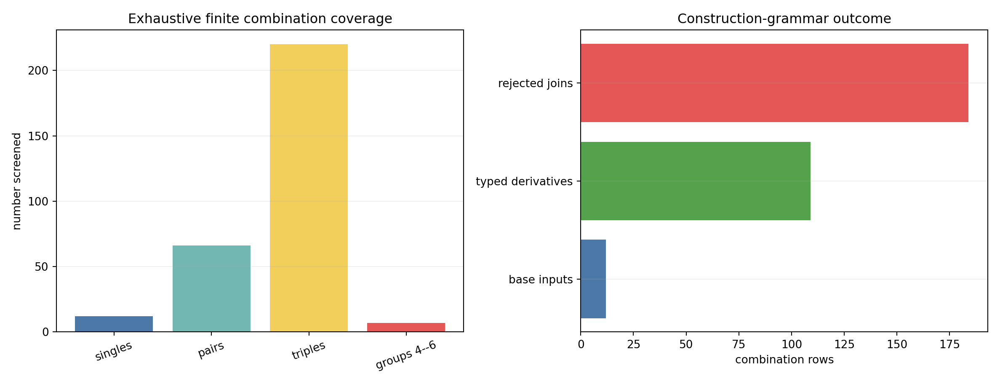
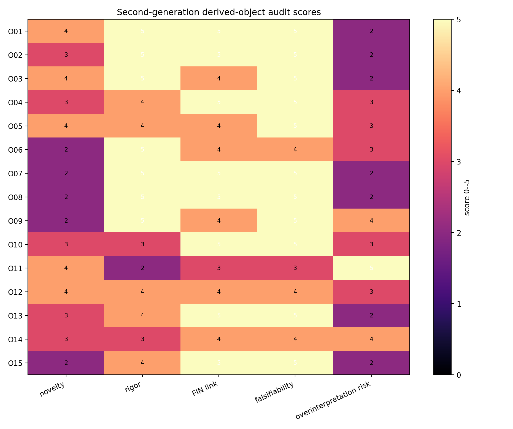
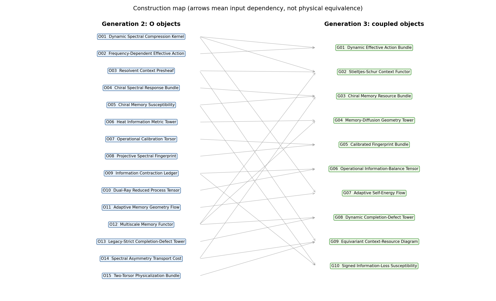

# Atlas Drugiej Generacji

## Pochodne Obiekty Nadsolitona

**Podtytuł:** Systematyczne przeszukanie kombinacji C01...C12, konstrukcja obiektów O01...O15 i synteza generacji G01...G10  
**Wersja:** Release 10.23  
**Autor:** Krzysztof Żuchowski  
**Afiliacja:** Independent Researcher — Fractal Information Theory Project  
**ORCID:** 0009-0002-0909-3613  
**Data:** 28 lipca 2026  
**Repozytorium:** <https://github.com/hyconiek/Fractal-Nadsoliton-Theory>

## Confidence convention

- **[Proven]** — rezultat analityczny albo jawna tożsamość numeryczna z tolerancją.
- **[Strong evidence]** — stabilna konstrukcja z niezamkniętym twierdzeniem ogólnym lub interpretacją.
- **[Moderate evidence]** — typowany mechanizm, którego identyfikowalność albo unikalność pozostaje otwarta.
- **[Speculative]** — hipoteza konstrukcyjna przeznaczona do falsyfikacji.
- **[Refuted]** — połączenie odrzucone w zadanej klasie, zwykle z powodu braku wspólnej operacji.

## 1. Streszczenie wykonawcze

Druga faza atlasu nie pyta już tylko, do czego podobne są puzzle C01...C12. Pyta:

\[
\text{jakie nowe obiekty można skonstruować, gdy ich operacje są składane?}
\]

Wykonano skończone, reprodukowalne przeszukanie:

| Klasa | Liczba |
|---|---:|
| pojedyncze puzzle | 12 |
| wszystkie pary | 66 |
| wszystkie trójki | 220 |
| wybrane sprzężenia 4–6 puzzli | 7 |
| razem przeskanowanych kombinacji | 305 |
| wiersze z typowanym obiektem lub mechanizmem | 109 |
| odrzucone czysto wizualne zestawienia | 184 |
| obiekty drugiej generacji O | 15 |
| obiekty trzeciej generacji G | 10 |

Najmocniejszym odkrytym obiektem nie jest pojedyncza macierz, lecz kontekstowa rodzina:

\[
\mathfrak S_A:
E\longmapsto
B_E(z)
=\operatorname{Schur}_{V\setminus E}(zI+A),
\qquad z>0.
\]

Dla każdego obserwowanego kontekstu \(E\), ukryty sektor generuje samoenergię:

\[
\Sigma_E(z)
=A_{EH}(zI+A_{HH})^{-1}A_{HE}.
\]

Rodzina ma trzy ścisłe własności:

1. redukcje zagnieżdżone składają się dokładnie dzięki łączności dopełnienia Schura;
2. \(\Sigma_E(z)\) jest dodatnią operatorową funkcją Stieltjesa;
3. odwrotna transformata Laplace’a jest jądrem pamięci zredukowanego procesu.

Obiekt generacji G02 nazywamy:

> **Stieltjes–Schur Context Functor** — kontekstowym funktorem Stieltjesa–Schura.

[Proven] jako skończona algebra operatorowa.  
[Speculative] jako fundament fizycznej ontologii.

Drugim szczególnie obiecującym obiektem jest chiralna podatność pamięci:

\[
\Xi_E(z)
=
\left.
\partial_\theta\Sigma_E(z,\theta)
\right|_{\theta=0},
\]

która jest niezerowa i nieparzysta pod odbiciem, ale pozostaje **odbiornikiem** włożonego skrętu \(\theta\), nie źródłem orientacji. [Strong evidence]

Trzeci wynik porządkuje „ujemne sprzężenie informacji”. Zanik dostępnej informacji może być opisany bez modyfikowania jądra przez ledger kontrakcji:

\[
\mathcal L_t(p,q)
=D(p\Vert q)-D(P_tp\Vert P_tq)\geq0.
\]

To utrata rozróżnialności w dostępnym kanale. Nie jest to automatycznie zniszczenie informacji ani energia termodynamiczna. [Proven]

## 2. Metoda generowania, a nie dopasowywania

Każda kombinacja przechodzi pięć bramek:

1. **Operacja wspólna:** czy działania puzzli można złożyć z poprawnymi typami wejścia i wyjścia?
2. **Nowy obiekt:** czy wynik jest czymś więcej niż listą składników?
3. **Nowa przestrzeń:** czy obiekt żyje w rozpoznawalnej przestrzeni operatorów, funkcjonałów, miar albo funktorów?
4. **Obserwabla i dynamika:** czy konstrukcja daje liczbę, rekord albo ewolucję podlegającą testowi?
5. **Falsification gate:** jaki wynik obali tę konstrukcję lub jej silniejszą interpretację?

Zasada stop:

> Jeśli kombinacja nie ma typowanej operacji, nie generuje obiektu. Podobieństwo słowne lub wizualne zostaje oznaczone jako [Refuted].

Pełny wynik dla wszystkich 305 kombinacji znajduje się w:

`FIN_Second_Generation_Combination_Search.csv`.

Każdy wiersz zawiera:

- operację wspólną;
- kandydat obiektu;
- przestrzeń obiektów;
- nową obserwablę;
- nową dynamikę;
- status;
- informację, czy wynik jest nowym sprzężeniem, czy tylko dziedziczy obiekt niższego rzędu.

## 3. Inwentarz bazowy C01...C12

| ID | Obiekt bazowy | Operacja dominująca | Ograniczenie krytyczne |
|---|---|---|---|
| C01 | strict kernel | splot/spektralizacja na \(Z_{12}\) | brak automatycznego kontinuum |
| C02 | legacy intermediate bridge | profil propagatorowo-tłumiący | brak pełnej mapy completion i role transfer |
| C03 | \(A=sI-W\succeq0\) | forma Dirichleta i rachunek widmowy | brak jednostki energii |
| C04 | \(e^{-itA},e^{-tA}\) | dwa promienie rachunku funkcyjnego | różne semantyki operacyjne |
| C05 | Green/resolwent/działanie | odwracanie operatora i wariacja | propagator nie wyznacza pełnej interakcji |
| C06 | cocykl/chiralne odbiorniki | znak pod inwersją | brak niepremisowego znaku |
| C07 | fraktalna kompresja Schura | eliminacja stopni swobody | strict nie jest statycznym fixed pointem |
| C08 | adaptacja i pamięć | sprzężenie zwrotne operator–rekord | prawo uczenia jest dodatkowe |
| C09 | informacja/geometria | entropia, Fisher, dyfuzja | brak jednostki fizycznej |
| C10 | proces operacyjny | przygotowanie–instrument–środowisko–rekord | konkretny lab pozostaje zewnętrzny |
| C11 | przeszkoda skali | iloraz przez \(\mathbb R_{>0}\) | brak kanonicznej sekcji |
| C12 | przeszkoda selektora | iloraz/torsor orientacji | `QW-2191` pozostaje otwarte |

## 4. Tabela główna: obiekty drugiej generacji

| Kombinacja FIN | Powstały obiekt | Matematyczna postać | Analogiczne dziedziny | Nowa intuicja | Status |
|---|---|---|---|---|---|
| C03+C05+C07 | O01 Dynamic Spectral Compression Kernel | \(\Sigma_E(z)=A_{EH}(zI+A_{HH})^{-1}A_{HE}\) | Feshbach, Mori–Zwanzig, Kron reduction | redukcja dynamiczna generuje pamięć | [Proven] |
| C03+C05+C07 | O02 Frequency-Dependent Effective Action | \(S_z[x]=\frac12\langle x,(zI+A_{EE}-\Sigma_E(z))x\rangle-\langle j,x\rangle\) | effective action, influence functional | Green, kompresja i wariacja stają się jednym obiektem | [Proven] |
| C05+C07+C10 | O03 Resolvent Context Presheaf | \(E\mapsto\operatorname{Schur}_{V\setminus E}(zI+A)\) | teoria kategorii, open systems, network reduction | każdy obserwator/kontekst ma zgodny operator efektywny | [Proven] |
| C03+C06+C12 | O04 Chiral Spectral Response Bundle | \((M_R,\Lambda,C_\chi,\operatorname{Im}B)\) | resource theory of asymmetry, harmonic analysis | różne chiralne testy są odbiornikami jednego typu zasobu | [Strong evidence] |
| C06+C07+C10 | O05 Chiral Memory Susceptibility | \(\Xi_E(z)=\partial_\theta\Sigma_E(z,\theta)|_0\) | Kubo response, flux susceptibility, open systems | ukryte stopnie swobody mają chiralną odpowiedź pamięci | [Strong evidence] |
| C03+C04+C09 | O06 Heat Information Metric Tower | \(D_t^2(x,y)=\sum_z|P_t(x,z)-P_t(y,z)|^2/\pi_z\) | diffusion maps, information geometry | geometryczna „odległość informacji” jest wieloskalowa | [Proven] |
| C10+C11 | O07 Operational Calibration Torsor | \((A,\tau)\sim(cA,\tau/c)\) | metrologia, gauge fixing, system identification | eksperyment wybiera skalę, algebra daje tylko orbitę | [Proven] |
| C01+C03+C11 | O08 Projective Spectral Fingerprint | \((\lambda_1/\lambda_{\max},\ldots)\) | inverse spectral theory, control | część predykcji jest testowalna przed kalibracją absolutną | [Proven] |
| C04+C09+C10 | O09 Information Contraction Ledger | \(\mathcal L_t=D(p\Vert q)-D(P_tp\Vert P_tq)\) | data processing, statistics, sensory bottlenecks | „ubytek” to utrata dostępnej rozróżnialności | [Proven] |
| C04+C07+C10 | O10 Dual-Ray Reduced Process Tensor | \(\mathcal T_r[\mathcal M_1,\ldots,\mathcal M_r]\) dla projekcji wave/heat | process tensors, cybernetyka, causal models | pamięć ujawnia się dopiero przy interwencjach wieloczasowych | [Moderate evidence] |
| C08+C09+C10 | O11 Adaptive Memory Geometry Flow | \((\dot A,\dot q)=(-\nabla_A\mathcal L,-\operatorname{grad}_F\mathcal L)\) | neural operators, adaptive networks, biological plasticity | uczenie może odbywać się w przestrzeni geometrii pamięci | [Speculative] |
| C05+C07+C08 | O12 Multiscale Memory Functor | \(\Sigma^{(0)}(z)\to\Sigma^{(1)}(z)\to\cdots\) | continued fractions, hierarchical reservoirs, RG | fraktalny fixed point należy szukać w przestrzeni funkcji pamięci | [Strong evidence] |
| C01+C02+C07 | O13 Legacy-Strict Completion-Defect Tower | \(\Delta_n=K_{\rm strict}^{(n)}-\mathcal C_n[K_{\rm legacy}^{(n)}]\) | error propagation, RG defects, obstruction theory | most można badać przez dynamikę defektu, nie deklarację podobieństwa | [Moderate evidence] |
| C06+C09+C12 | O14 Spectral Asymmetry Transport Cost | \(\inf_{\Phi\ {\rm covariant}}\operatorname{Cost}(\Phi)\) | optimal transport, resource conversion | orientacja ma koszt operacyjny, ale koszt nie wybiera znaku | [Moderate evidence] |
| C10+C11+C12 | O15 Two-Torsor Physicalization Bundle | \(\mathcal T_{\rm scale}\times\mathcal T_{\rm orient}\) | principal bundles, reference frames, calibration | skala i orientacja wymagają dwóch oddzielnych sekcji | [Strong evidence] |

## 5. Co obiekty wyjaśniają, czego nie wyjaśniają i jak je obalić

| Obiekt pochodny | Co wyjaśnia | Czego NIE wyjaśnia | Test falsyfikujący |
|---|---|---|---|
| O01 DSCK | dokładną pamięć po eliminacji | fizycznego środowiska i skali | stałość \(\Sigma_E(z)\) mimo niezerowego sprzężenia |
| O02 Effective Action | dokładną odpowiedź źródłową na kontekście | oddziaływań nieliniowych i kwantyzacji | niezgodność rozwiązania stacjonarnego z blokowym Greenem |
| O03 Context Presheaf | zgodność redukcji zagnieżdżonych | unikalnego wyboru kontekstu obserwatora | niezerowy residual bezpośredni–zagnieżdżony |
| O04 Chiral Bundle | wspólną kowariancję odbiorników znaku | źródła znaku | stan symetryczny dający niezerowy odbiornik odd |
| O05 Chiral Memory | odpowiedź pamięci na skręt fazowy | selektora \(\theta\) | brak nieparzystości pod odbiciem |
| O06 Metric Tower | geometrię rozróżnialności | SI length i Lorentz signature | wzrost odległości przy kontrakcyjnej semigrupie |
| O07 Calibration Torsor | nieidentyfikowalność absolutnej skali | źródła wzorca laboratoryjnego | rozróżnienie \((A,\tau)\) i \((cA,\tau/c)\) z tego samego \(P_\tau\) |
| O08 Fingerprint | bezskalowe przewidywania widmowe | absolutnej energii | zmiana fingerprintu pod dodatnim skalowaniem |
| O09 Information Ledger | dostępny ubytek rozróżnialności | termodynamicznej energii i ontologicznego zniszczenia informacji | naruszenie data processing |
| O10 Process Tensor | operacyjną pamięć i rolę interwencji | konkretnej mikroskopowej dylatacji | model bez pamięci reprodukujący wszystkie interwencje |
| O11 Adaptive Flow | możliwy mechanizm uczenia operatora | strict source law i biologię | brak przewagi hold-out nad statycznym modelem |
| O12 Memory Functor | hierarchiczną kompresję dynamiczną | fixed pointu strict | brak stabilizacji jakiejkolwiek klasy funkcjonalnej |
| O13 Defect Tower | gdzie i jak nie domyka się bridge | role transfer i completion theorem | residual malejący do zera bez target coding |
| O14 Transport Cost | ilość potrzebnego zasobu asymetrii | kanonicznego wyboru zasobu | darmowa operacja zwiększająca monotone |
| O15 Two-Torsor Bundle | niezależność problemu skali i orientacji | źródła obu sekcji | wewnętrzna jedna dana jednocześnie i kanonicznie zamykająca oba torsory |

## 6. Ranking O01...O15

Skale:

- nowość 0–5;
- ścisłość matematyczna 0–5;
- związek z FIN 0–5;
- falsyfikowalność 0–5;
- ryzyko nadinterpretacji 0–5, gdzie 5 oznacza ryzyko najwyższe.

| ID | Nowość | Ścisłość | FIN | Falsyfikowalność | Ryzyko |
|---|---:|---:|---:|---:|---:|
| O01 | 4 | 5 | 5 | 5 | 2 |
| O02 | 3 | 5 | 5 | 5 | 2 |
| O03 | 4 | 5 | 4 | 5 | 2 |
| O04 | 3 | 4 | 5 | 5 | 3 |
| O05 | 4 | 4 | 4 | 5 | 3 |
| O06 | 2 | 5 | 4 | 4 | 3 |
| O07 | 2 | 5 | 5 | 5 | 2 |
| O08 | 2 | 5 | 5 | 5 | 2 |
| O09 | 2 | 5 | 4 | 5 | 4 |
| O10 | 3 | 3 | 5 | 5 | 3 |
| O11 | 4 | 2 | 3 | 3 | 5 |
| O12 | 4 | 4 | 4 | 4 | 3 |
| O13 | 3 | 4 | 5 | 5 | 2 |
| O14 | 3 | 3 | 4 | 4 | 4 |
| O15 | 2 | 4 | 5 | 5 | 2 |

Najlepszy bilans daje O01. Najbogatszą strukturę wyższego rzędu daje połączenie O01+O03+O12. Największe ryzyko nadinterpretacji ma O11, ponieważ analogie do uczenia i biologii nie są prawem źródłowym FIN.

## 7. Twierdzenia wygenerowane w drugiej fazie

### 7.1. O01 należy do operatorowej klasy Stieltjesa

Dla \(z>0\), \(A_{HH}\succeq0\):

\[
\Sigma_E(z)
=A_{EH}(zI+A_{HH})^{-1}A_{HE}.
\]

Dla każdego \(n\geq0\):

\[
(-1)^n\Sigma_E^{(n)}(z)
=n!\,
A_{EH}(zI+A_{HH})^{-(n+1)}A_{HE}
\succeq0.
\]

Zatem \(\Sigma_E\) jest całkowicie monotoniczną dodatnią funkcją operatorową. [Proven]

Znaczenie:

- jej bieguny i miara spektralna kodują ukryte mody;
- jej odwrotna transformata Laplace’a jest zanikającym jądrem pamięci;
- przestrzeń właściwych kandydatów dla dynamicznej kompresji jest znacznie węższa niż „wszystkie funkcje macierzowe”.

Test numeryczny strict \(Z_{12}\) dla rzędów \(0,\ldots,4\) daje minimalne wartości własne większe od \(-6.4\times10^{-17}\), czyli dodatniość do błędu zmiennoprzecinkowego.

### 7.2. O03 składa się funktorialnie

Niech \(G\subset F\subset E\subset V\). Dla \(B(z)=zI+A\):

\[
\operatorname{Schur}_{E\setminus G}
\left(
\operatorname{Schur}_{V\setminus E}B
\right)
=
\operatorname{Schur}_{V\setminus G}B.
\]

Po właściwym rozpisaniu kroków pośrednich jest to łączność eliminacji Gaussa/dopełnienia Schura. [Proven]

Dla wybranych kontekstów strict \(Z_{12}\) residual bezpośrednia–zagnieżdżona redukcja wynosi:

\[
2.47\times10^{-16}.
\]

To uzasadnia słowo „funktor” w ograniczonym sensie: poset kontekstów i morfizmy redukcji tworzą zgodny diagram operatorów. Nie udowodniono aksjomatów snopa ani kontekstualności kwantowej.

### 7.3. O02 rekonstruuje dokładny Green kontekstu

Niech:

\[
B_E(z)=zI+A_{EE}-\Sigma_E(z).
\]

Funkcjonał:

\[
S_z[x;j]
=\frac12\langle x,B_E(z)x\rangle-\langle j,x\rangle
\]

ma stacjonarne rozwiązanie:

\[
x_\star=B_E(z)^{-1}j
=
\left[(zI+A)^{-1}\right]_{EE}j.
\]

Residual stacjonarności w audycie:

\[
4.90\times10^{-16}.
\]

[Proven]

Jest to ścisła rekonstrukcja działania efektywnego z resolwentu. Nie jest pełnym działaniem fizycznym, ponieważ \(z\), jednostka działania, miara i interakcje pozostają dodatkowymi danymi.

### 7.4. O05: pamięć posiada chiralny kierunek odpowiedzi

Wprowadź hermitowską rodzinę skręconych operatorów \(A(\theta)\), gdzie skok o \(d\) otrzymuje fazę \(e^{id\theta}\). Następnie:

\[
\Xi_E(z)
=
\left.\partial_\theta
\left[
A_{EH}(\theta)
(zI+A_{HH}(\theta))^{-1}
A_{HE}(\theta)
\right]\right|_{\theta=0}.
\]

Dla podziału even/odd strict \(Z_{12}\):

\[
\|\Xi_E(0.2)\|_2=1.2175076427.
\]

Dla odbicia \(R\):

\[
R_E\Xi_E(z)R_E=-\Xi_E(z),
\]

z residualem:

\[
2.17\times10^{-16}.
\]

[Proven] dla zadanej rodziny skrętu i podziału.

Jednocześnie:

\[
C_\chi
=
\left.
\frac{d}{d\theta}\operatorname{Tr}[\rho A(\theta)]
\right|_{\theta=0},
\]

z residualem \(3.23\times10^{-13}\). To podnosi \(C_\chi\) z ad hoc wskaźnika do jawnej odpowiedzi na flux twist. [Proven]

Ważne: \(\theta\) i jego znak są wprowadzone w rodzinie testowej. O05 nie rozładowuje `QW-2191`.

### 7.5. O09: ujemne sprzężenie informacyjne jako kontrakcja kanału

Dla kanału Markowa \(P_t\) i dodatnich rozkładów \(p,q\):

\[
D(P_tp\Vert P_tq)\leq D(p\Vert q).
\]

Definiujemy:

\[
\mathcal L_t(p,q)
=D(p\Vert q)-D(P_tp\Vert P_tq)\geq0.
\]

W 1000 deterministycznie odtwarzalnych parach:

| Wartość | Wynik |
|---|---:|
| minimum \(\mathcal L_t\) | 0.0485457 |
| mediana | 0.718427 |
| maksimum | 3.15526 |
| naruszenia poniżej \(-10^{-12}\) | 0 |

[Proven] jako instancja data-processing theorem.

Ta konstrukcja jest metodologicznie lepsza niż wpisanie „ujemnej informacji” w scalar kernel:

- mówi, względem jakich dwóch hipotez informacja maleje;
- wskazuje kanał, który powoduje kontrakcję;
- oddziela informację niedostępną od informacji unicestwionej;
- nie udaje energii bez temperatury i skali.

### 7.6. O07+O08: dokładna orbita kalibracji

\[
e^{-\tau A}
=e^{-(\tau/c)(cA)}.
\]

Residual przy \(c=7.25\):

\[
3.43\times10^{-17}.
\]

Fingerprint widmowy pozostaje niezmienny z residualem:

\[
6.66\times10^{-16}.
\]

[Proven]

Wniosek: eksperyment może najpierw testować fingerprint bez skali, ale fizyczny czas wymaga zewnętrznej sekcji kalibracyjnej.

### 7.7. O06: geometria cieplna kontrahuje

Maksymalna kwadratowa odległość dyfuzyjna na \(Z_{12}\):

| \(t\) | \(\max_{x,y}D_t^2(x,y)\) |
|---:|---:|
| 0.10 | 17.3358 |
| 0.25 | 11.0222 |
| 0.50 | 5.69186 |
| 1.00 | 2.00931 |

[Proven] dla testowanej rodziny.

Geometria informacyjna istnieje, ale jest bezwymiarowa i zależy od czasu semigrupy.

## 8. Analogie drugiego rzędu

| Obiekt FIN | Pierwsza analogia | Pochodne zjawisko analogii | Co wraca jako nowa intuicja FIN | Granica |
|---|---|---|---|---|
| O01 | Feshbach/Mori–Zwanzig | self-energy, generalized Langevin equation | ukryte węzły generują pamięć | podział jest zadany |
| O02 | effective action | influence functional | resolwent kontekstu ma wariacyjne źródło | brak pełnej QFT |
| O03 | kategorie kontekstów | zgodne ograniczenia i diagramy | obserwator jako wybór kontekstu | to nie dowód contextuality |
| O04 | asymmetry modes | resource monotones i reference frames | odbiorniki można klasyfikować harmonicznie | brak zasobu źródłowego |
| O05 | Kubo/flux response | susceptibility, pumping | pamięć ma chiralny tangent | brak kwantyzacji topologicznej |
| O06 | diffusion maps | data geometry i coarse graining | heat tworzy wewnętrzną geometrię | brak czasoprzestrzeni |
| O07 | gauge fixing/metrologia | wybór sekcji skali | kalibracja jest częścią teorii operacyjnej | nie jest strict source |
| O08 | inverse spectra | system identification | można testować ilorazy przed jednostkami | false positives możliwe |
| O09 | data processing | sensory bottleneck, statistical sufficiency | informacja może przejść do ukrytych korelacji | brak energii Landauera |
| O10 | process tensors | non-Markovian interventions | rekord wieloczasowy odróżnia pamięć | wymaga pełnego instrumentu |
| O11 | neural operators | learning maps between function spaces | można uczyć \(\Sigma(z)\), nie tylko macierz | uczenie nie jest ontologią |
| O12 | hierarchical reservoirs | fading memory i continued fractions | dynamiczny fixed point może żyć w Stieltjes space | hipoteza niezamknięta |
| O13 | RG defect propagation | relevant/irrelevant directions | bridge defect może mieć wykładnik przepływu | nie wolno target-code |
| O14 | optimal transport | minimal conversion work/cost | orientacja jest zasobem operacyjnym | koszt nie wybiera znaku |
| O15 | principal bundles | calibration + reference frames | dwa niezależne brakujące obiekty | sekcje są nadal zewnętrzne |

### Fizyka

Najsilniejsze podobieństwa mechaniczne występują z:

- Feshbach projection i self-energy;
- Mori–Zwanzig memory kernels;
- teorią układów otwartych i process tensors;
- odpowiedzią liniową na skręt/flux;
- działaniem efektywnym po eliminacji pól.

Brak równoważności z konkretną teorią pola, bo FIN nie dostarcza jeszcze lokalnej czasoprzestrzeni, pól, miary, skali działania ani zasad kwantyzacji.

### Matematyka

Nowa naturalna przestrzeń to:

\[
\operatorname{Stieltjes}_+(E)
=
\left\{
\Sigma:(0,\infty)\to\operatorname{End}(E)
\mid
(-1)^n\Sigma^{(n)}(z)\succeq0
\right\}.
\]

Zagnieżdżone Schury dają diagram nad posetem kontekstów. To uzasadnia język funktorialny. Język snopów/globalnych sekcji pozostaje analogią badawczą, dopóki nie zostaną zdefiniowane dane pokrycia i aksjomaty sklejania.

### Informatyka

O11 jest bliski neural operators, ponieważ obiektem uczonym jest mapa:

\[
\text{rekord procesu}\longmapsto\Sigma(z),
\]

a nie pojedynczy wektor parametrów.

O12 przypomina reservoir computing: ukryty sektor zachowuje ślad historii, a bieżący rekord jest jego readoutem. To nie dowodzi biologicznej ani komputerowej natury nadsolitona.

### Biologia

Najuczciwsza analogia dotyczy pamięci zanikającej i adaptacyjnych wag:

- ukryte mody odpowiadają wielu skalom zaniku;
- plastyczność zmieniałaby spektrum pamięci;
- readout obserwuje tylko projekcję pełnego stanu.

[Speculative] Nie ma danych biologicznych ani mapy komórek/synaps na węzły FIN. Analogia służy do projektowania testów stabilności i pojemności pamięci.

### Cybernetyka

O03, O07, O08 i O10 układają się w klasyczny schemat:

\[
\text{system}
\to
\text{obserwator}
\to
\text{identyfikacja}
\to
\text{kalibracja}
\to
\text{decyzja}.
\]

Nowa intuicja: brakujący obserwator nie musi być nowym składnikiem \(A\). Może być rodziną projekcji, instrumentów i sekcji kalibracyjnych.

## 9. Generacja trzecia: łączenie O-obiektów

| ID | Połączenie | Obiekt wyższego rzędu | Definicja/rola | Status |
|---|---|---|---|---|
| G01 | O01+O02 | Dynamic Effective Action Bundle | samoenergia Stieltjesa wraz z dokładnym działaniem źródłowym | [Proven] |
| G02 | O01+O03+O12 | Stieltjes–Schur Context Functor | funktor kontekstów, zgodne redukcje, całkowicie monotoniczne samoenergie | [Proven] |
| G03 | O04+O05+O14 | Chiral Memory Resource Bundle | nieparzysta podatność pamięci z budżetem zasobu asymetrii | [Strong evidence] |
| G04 | O06+O12 | Memory–Diffusion Geometry Tower | geometria indeksowana czasem dyfuzji i głębokością ukrycia | [Moderate evidence] |
| G05 | O07+O08 | Calibrated Fingerprint Bundle | bezskalowy test plus jawnie zewnętrzna sekcja skali | [Proven] |
| G06 | O09+O10 | Operational Information-Balance Tensor | wieloczasowy ledger kontrakcji informacji | [Moderate evidence] |
| G07 | O01+O11 | Adaptive Self-Energy Flow | trajektoria uczona w przestrzeni funkcji Stieltjesa | [Speculative] |
| G08 | O12+O13 | Dynamic Completion-Defect Tower | test, czy bridge defect przetrwa dynamiczną redukcję | [Moderate evidence] |
| G09 | O03+O14+O15 | Equivariant Context-Resource Diagram | konteksty, skala i orientacja jako osobne struktury sekcyjne | [Speculative] |
| G10 | O05+O09 | Signed Information-Loss Susceptibility | pochodna kontrakcji informacji względem chiralnego skrętu | [Speculative] |

## 10. Najważniejsze „kształty cienia”

### Cień 1 — brakująca przestrzeń obiektów to Stieltjes space

Wcześniej pytano, jakie kolejne jądro statyczne otrzymuje się po kompresji. Połączenie Green + Schur + dynamika pokazuje, że właściwym obiektem jest funkcja operatorowa \(z\mapsto\Sigma(z)\).

To zmienia pytanie o samopodobieństwo:

\[
\text{czy }K\text{ jest fixed pointem?}
\]

na:

\[
\text{czy rodzina funkcji pamięci jest zamknięta lub ma atraktor?}
\]

[Strong evidence] jako kierunek; fixed point nie został znaleziony.

### Cień 2 — obserwator i kompresja są dwoma nazwami wyboru kontekstu

Kompresja wybiera zachowane stopnie swobody. Obserwator wybiera dostępne obserwable. Wspólnym cieniem jest kontekst \(E\) oraz jego operator efektywny \(B_E(z)\).

[Moderate evidence] To nie dowodzi, że obserwacja fizyczna jest tylko Schurem; instrument i rekord nadal są wymagane.

### Cień 3 — „ujemna informacja” jest często przepływem do niewidocznego sektora

Ledger O09 i pamięć O01 sugerują:

\[
\text{spadek dostępnej rozróżnialności}
\quad\leftrightarrow\quad
\text{korelacje/wycieczki w sektorze }H.
\]

W pełnym, odwracalnym opisie informacja może nie znikać; znika z wybranego rekordu. [Strong evidence]

### Cień 4 — chiralność jest tangentem, nie punktem

\(\Xi_E(z)\) pokazuje, że orientacja może objawiać się jako kierunek w przestrzeni operatorów pamięci:

\[
\Xi_E\in T_{\Sigma_E}\operatorname{Stieltjes}_+(E).
\]

To nowa charakterystyka pochodna. Nie wybiera ona, czy tangent ma znak \(+\) czy \(-\). [Strong evidence]

### Cień 5 — fizyczność wymaga dwóch sekcji i jednego procesu

Najmniejszy cień brakującej fizyki ma trzy niezależne elementy:

1. sekcja skali;
2. sekcja orientacji/sektora;
3. proces operacyjny z przygotowaniem, instrumentem i rekordem.

Żaden z trzech nie zastępuje pozostałych. [Proven] jako rozdzielenie typów.

### Cień 6 — adaptacja może działać na pamięci, nie bezpośrednio na kernelu

Zamiast:

\[
\dot K=-\nabla_K\mathcal L,
\]

naturalniejszym obiektem może być:

\[
\partial_t\Sigma(z;t)
=-\operatorname{grad}_{\Sigma}\mathcal L_{\rm process}.
\]

[Speculative] Ta zmiana może ograniczyć prawo uczenia przez dodatniość i całkowitą monotoniczność.

### Cień 7 — bridge defect może być dynamiczny

Legacy i strict mogą różnić się nie tylko profilem \(d\), lecz strukturą ukrytej pamięci. Test O13/G08 może wykazać:

- residual zanikający pod redukcją;
- residual stały;
- residual rosnący;
- niezgodność klasy Stieltjesa.

Żaden z tych wyników nie jest z góry mostem. To nowy pojedynczy, falsyfikowalny atom.

## 11. Falsyfikacja najwyższych interpretacji

### 11.1. Czy G02 jest nową teorią kategorii?

Nie. [Refuted] jako roszczenie o nową dziedzinę.

Łączność Schura i diagramy kontekstów są znanymi strukturami. Nowość projektu może polegać na ich użyciu do uporządkowania FIN, nie na autorstwie samej matematyki.

### 11.2. Czy O05 rozwiązuje selector?

Nie. [Refuted]

Rodzina \(A(\theta)\) wymaga parametru \(\theta\). Inwersja wysyła \(\theta\to-\theta\), więc \(\Xi\) ma parę znaków. O05 jest dokładnie nowym receiverem.

### 11.3. Czy O09 jest entropią fizyczną?

Nie bez dodatkowych danych. [Refuted]

Do termodynamiki potrzeba co najmniej temperatury, Hamiltonianu, protokołu i pełnego ledgeru aparatu/resetu.

### 11.4. Czy O12 dowodzi fraktalnego fixed pointu?

Nie. [Refuted]

O12 definiuje właściwą przestrzeń poszukiwania. Istnienie atraktora albo samopodobnej miary operatorowej jest otwarte.

### 11.5. Czy O11 dowodzi biologicznej natury FIN?

Nie. [Refuted]

Neural operators, reservoir computing i plastyczność dostarczają analogii mechanizmu adaptacji, lecz brak mapy empirycznej.

### 11.6. Czy G09 daje globalną sekcję?

Nie. [Refuted] na bieżących artefaktach.

Język sekcji podkreśla istniejący obstruction. Nie usuwa `QW-2191` ani skali.

## 12. Programy badań 255–266

### Program 255 — Formalne twierdzenie Stieltjesa dla wszystkich kontekstów

Udowodnić w jednej bibliotece:

- dodatniość;
- całkowitą monotoniczność;
- reprezentację miarą operatorową;
- granice \(z\to0^+\) i \(z\to\infty\).

**Prawdopodobieństwo sukcesu:** 0.95.

### Program 256 — Minimalna realizacja samoenergii

Określić, kiedy dwie ukryte macierze \((A_{HH},A_{HE})\) dają tę samą \(\Sigma_E(z)\). Użyć controllability/observability i minimal realization theory.

**Prawdopodobieństwo:** 0.85.

### Program 257 — Formalizacja funktora kontekstów

Zdefiniować kategorię kontekstów i redukcji, a następnie skompilować łączność Schura w Lean/Mathlib albo niezależnym algebraicznym core.

**Prawdopodobieństwo:** 0.80.

### Program 258 — Analityczne twierdzenie o chiralnej podatności pamięci

Wyprowadzić zamknięty wzór na \(\Xi_E(z)\), jego kowariancję i granice normy. Oddzielić gauge convention od obserwabli flux.

**Prawdopodobieństwo:** 0.82.

### Program 259 — Dynamiczny RG w przestrzeni Stieltjesa

Zdefiniować mapę:

\[
\mathcal R:\Sigma^{(n)}\mapsto\Sigma^{(n+1)}
\]

i szukać fixed pointów, cykli oraz no-go dla rodziny strict.

**Prawdopodobieństwo:** 0.45; wysoka nagroda.

### Program 260 — Wieloczasowy tensor bilansu informacji

Rozszerzyć O09 na proces:

\[
\mathcal L[\mathcal M_1,\ldots,\mathcal M_r]
\]

i oddzielić kontrakcję systemu, aparatu i ukrytych węzłów.

**Prawdopodobieństwo:** 0.75.

### Program 261 — Dynamiczny test completion defect

Przetestować dokładnie jeden nowy atom:

\[
\Delta_\Sigma(z)
=\Sigma_{\rm strict}(z)
-\mathcal C_\Sigma[\Sigma_{\rm legacy}(z)].
\]

Reguła stop: nie dostrajać funkcji completion po zobaczeniu celu.

**Prawdopodobieństwo konstruktywnego bridge:** 0.30.  
**Prawdopodobieństwo wartościowego no-go:** 0.80.

### Program 262 — Calibrated Fingerprint Experiment

Połączyć O07+O08 z P240–P242:

- najpierw test ilorazów widmowych;
- następnie niezależna kalibracja \(\tau\);
- bez zmiany modelu po unblindingu.

**Prawdopodobieństwo metodologicznego sukcesu:** 0.75.

### Program 263 — Tomografia prądów i pamięci chiralnej

Mierzyć \(C_d\) dla \(d=1,\ldots,5\) oraz interwencje pośrednie. Testować \(C_\chi\) i \(\Xi_E(z)\) oddzielnie.

**Prawdopodobieństwo:** 0.70.

### Program 264 — False-positive atlas O01–O10

Wygenerować losowe i strukturalne Laplasjany. Zmierzyć, ile przechodzi:

- strict fingerprint;
- Stieltjes memory;
- context composition;
- chiral response;
- information ledger.

**Prawdopodobieństwo:** 0.90.

### Program 265 — Identyfikowalność Adaptive Memory Geometry

Porównać O11 z:

- statycznym operatorem;
- aparatem z pamięcią;
- błędną kalibracją;
- prawdziwą zmianą generatora.

Wymaga hold-out i kontrprzykładów nieidentyfikowalnych.

**Prawdopodobieństwo:** 0.65.

### Program 266 — Benchmark biologiczno-cybernetyczny

Bez roszczeń ontologicznych sprawdzić:

- fading-memory capacity;
- robustness–plasticity trade-off;
- recovery after perturbation;
- minimal readout dimension.

FIN przechodzi analogię tylko wtedy, gdy daje przewidywania inne niż standardowy reservoir o tej samej liczbie stanów.

**Prawdopodobieństwo rozstrzygającego benchmarku:** 0.72.

## 13. Priorytet strategiczny

| Ranga | Program | Powód |
|---:|---|---|
| 1 | 255 | niemal pewne formalne domknięcie nowej przestrzeni obiektów |
| 2 | 256 | rozstrzyga, co można wnioskować o ukrytym sektorze |
| 3 | 258 | domyka nową charakterystykę chiralnej pamięci bez selector claim |
| 4 | 257 | zabezpiecza kategorię kontekstów przed metaforycznym użyciem |
| 5 | 264 | mierzy swoistość całego atlasu |
| 6 | 260 | łączy informację z pełnym procesem |
| 7 | 262 | przenosi wynik do laboratorium |
| 8 | 263 | eksperymentalnie rozdziela harmoniczne i pamięć |
| 9 | 259 | najwyższa nagroda matematyczna, duże ryzyko |
| 10 | 261 | pojedynczy uczciwy atak bridge |
| 11 | 265 | sprawdza adaptację i identyfikowalność |
| 12 | 266 | kontroluje analogie biologiczne/cybernetyczne |

## 14. Granice zgodne z guardrails

Raport nie eksportuje:

- niepremisowego strict selector;
- rozładowania `QW-2191`;
- kanonicznej jednostki długości, czasu, masy, energii lub działania;
- pełnej mapy legacy→strict;
- role transfer dla \(\sin^2\theta_W\), \(\alpha_{\rm EM}\) lub hierarchii grawitacyjnej;
- strict-source prawa adaptacyjnego;
- \(L_{\rm total}\), Modelu Standardowego, GR ani ToE;
- dowodu fizycznego obserwatora, środowiska albo aparatu;
- zewnętrznej walidacji danych.

Nadsoliton pozostaje pierwotną informacją w stanie solitonicznym. Konteksty \(E/H\) są podziałami dostępności jego stopni swobody, nie osobną warstwą informacyjną pod nim.

## 15. Werdykt końcowy

Najważniejszą pochodną strukturą z kombinacji puzzli nie jest kolejne jądro i nie jest nią nowa stała. Jest nią:

\[
\boxed{
\text{Stieltjes--Schur Context Functor}
}
\]

czyli kontekstowa rodzina dokładnych operatorów efektywnych, których samoenergie są całkowicie monotoniczne, redukcje składają się, a transformacje czasowe generują pamięć.

Ta struktura porządkuje wspólny cień:

\[
\text{Green}
\leftrightarrow
\text{kompresja}
\leftrightarrow
\text{pamięć}
\leftrightarrow
\text{obserwator}
\leftrightarrow
\text{informacja dostępna}.
\]

Najciekawszą nową charakterystyką tangentową jest \(\Xi_E(z)\): chiralna podatność pamięci. Najuczciwszym opisem ubytku informacji jest \(\mathcal L_t\): kontrakcja dostępnej rozróżnialności. Najważniejszym no-go pozostaje brak sekcji orientacji i skali.

To nie potwierdza FIN jako fizyki. Dostarcza jednak nowej, ścisłej przestrzeni obiektów, w której następne pytania są lepiej typowane i łatwiejsze do falsyfikacji.

## 16. Literatura porównawcza

1. Dörfler, F.; Bullo, F., *Kron Reduction of Graphs with Applications to Electrical Networks*, <https://arxiv.org/abs/1102.2950>.
2. Lin, Y. T.; Tian, Y.; Anghel, M.; Livescu, D., *Data-driven learning for the Mori–Zwanzig formalism*, <https://arxiv.org/abs/2101.05873>.
3. Pollock, F. A. et al., *Non-Markovian quantum processes: complete framework and efficient characterisation*, <https://arxiv.org/abs/1512.00589>.
4. Marvian, I.; Spekkens, R. W., *Modes of asymmetry*, <https://arxiv.org/abs/1312.0680>.
5. Coifman, R. R.; Lafon, S., *Diffusion maps*, <https://doi.org/10.1016/j.acha.2006.04.006>.
6. Shuman, D. I. et al., *The Emerging Field of Signal Processing on Graphs*, <https://arxiv.org/abs/1211.0053>.
7. Kovachki, N. et al., *Neural Operator: Learning Maps Between Function Spaces*, <https://arxiv.org/abs/2108.08481>.
8. Abramsky, S.; Brandenburger, A., *The Sheaf-Theoretic Structure of Non-Locality and Contextuality*, <https://arxiv.org/abs/1102.0264>.
9. Chamseddine, A. H.; Connes, A., *The Spectral Action Principle*, <https://arxiv.org/abs/hep-th/9606001>.

## 17. Artefakty reprodukowalne

- `fin_nadsoliton_second_generation_atlas.py`
- `FIN_Second_Generation_Combination_Search.csv`
- `FIN_Second_Generation_Derived_Objects.csv`
- `FIN_Second_Generation_Generation3.csv`
- `FIN_Second_Generation_Atlas_Results.json`
- `FIN_Second_Generation_Atlas_Figures/combination_search_coverage.png`
- `FIN_Second_Generation_Atlas_Figures/derived_object_score_matrix.png`
- `FIN_Second_Generation_Atlas_Figures/generation2_generation3_map.png`
- `FIN_Atlas_Drugiej_Generacji_Pochodne_Obiekty_Nadsolitona_PL.md`

