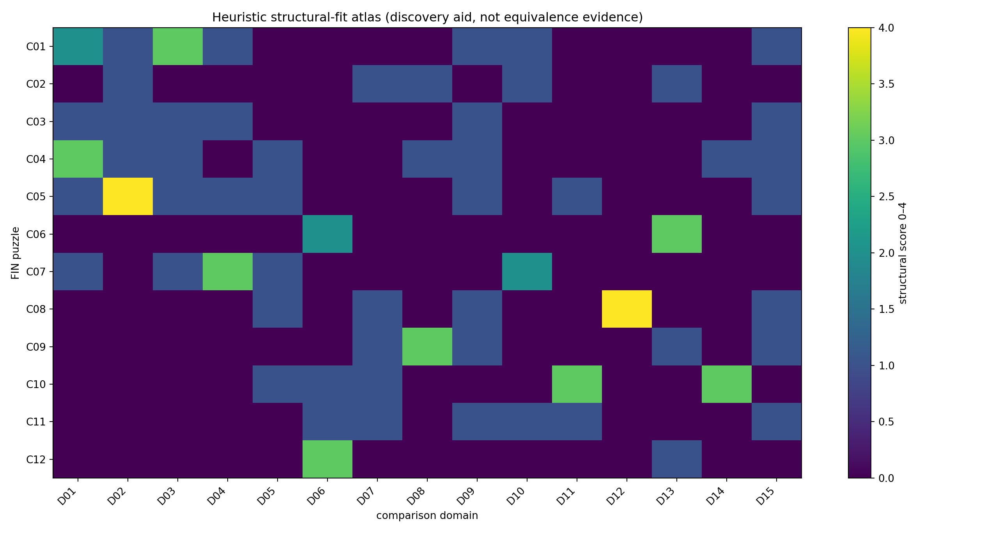
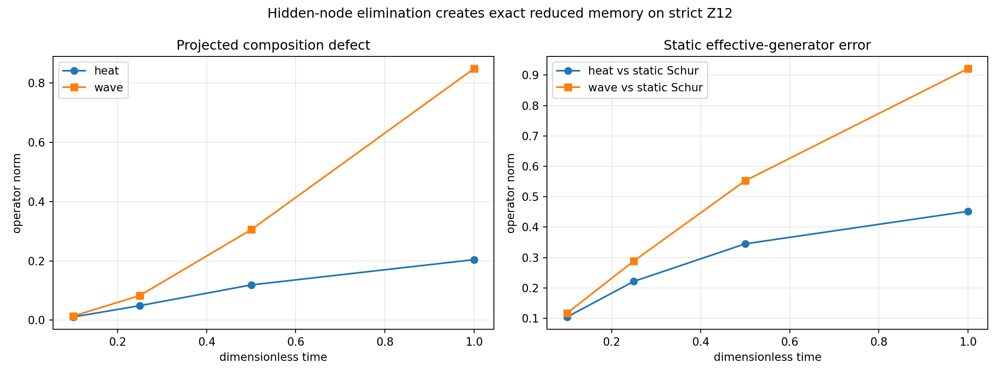

# Atlas puzzli nadsolitona

## Audyt symulatora Z12, kontrolowana intuicja międzydziedzinowa i nowy obiekt pamięci po redukcji

**Wersja:** Release 10.22 — raport badawczy  
**Autor:** Krzysztof Żuchowski  
**Afiliacja:** Independent Researcher — Fractal Information Theory Project  
**ORCID:** 0009-0002-0909-3613  
**Data:** 28 lipca 2026  
**Repozytorium:** <https://github.com/hyconiek/Fractal-Nadsoliton-Theory>

## Confidence convention

- **[Proven]** — wynik algebraiczny albo numeryczny z jawnym testem i tolerancją.
- **[Strong evidence]** — stabilny w zadanej klasie testów, lecz nie jest twierdzeniem ogólnym.
- **[Moderate evidence]** — sensowny mechanizm z niezamkniętą identyfikowalnością.
- **[Speculative]** — hipoteza badawcza, nie wniosek o naturze.
- **[Refuted]** — teza sfalsyfikowana w zadanym modelu.

## 1. Werdykt wykonawczy

Najbardziej produktywne „ułożenie puzzli” nie prowadzi do nowego skalarnego parametru ani do ukrytego selektora. Prowadzi do obiektu operatorowego:

\[
\Sigma_E(z)=A_{EH}(zI+A_{HH})^{-1}A_{HE},
\]

czyli zależnej od częstotliwości **samoenergii zredukowanego procesu**, powstającej po rozdzieleniu węzłów na obserwowane \(E\) i ukryte \(H\). [Proven]

Ten obiekt łączy pięć wcześniej rozdzielonych obrazów:

1. Green/resolwent — przez dokładną formułę blokowego resolwentu;
2. kompresję Schura — jako granicę statyczną \(\Sigma_E(0)\);
3. dynamikę falową i dyfuzyjną — przez tę samą analityczną rodzinę resolwentową;
4. pamięć i środowisko — przez dokładne jądro pamięci w czasie;
5. obserwatora — jako jawnie zadany podział dostępne/ukryte, a nie jako metafizyczny składnik równania.

Nie rozwiązuje to jednak trzech głównych braków FIN: nie wybiera orientacji, nie generuje jednostki fizycznej i nie dostarcza eksperymentalnego przygotowania ani aparatu. [Proven]

Najgłębsza intuicja z atlasu brzmi więc:

> Fraktalna redukcja nie powinna być modelowana wyłącznie jako statyczne przekształcenie jednego jądra w drugie. Dokładna eliminacja poziomu informacji generuje proces z pamięcią. Statyczny Schur jest tylko jego cieniem przy zerowej częstotliwości.

Jest to dobrze znany mechanizm redukcji w matematyce fizycznej, ale jego konkretna postać dla ścisłego operatora FIN oraz połączenie z dualnością fala–dyfuzja stanowią nowy, testowalny kierunek wewnątrz projektu. Nie jest to dowód nowej fizyki.

## 2. Metoda: intuicja z bezpiecznikami

„Intuicyjne” porównanie może łatwo zamienić podobieństwo obrazka w fałszywą równoważność. Dlatego atlas został wykonany w czterech warstwach:

1. **Warstwa kształtu:** rozpoznanie podobnych wykresów, symetrii, przepływów i diagramów.
2. **Warstwa mechanizmu:** pytanie, czy obie struktury mają tę samą operację algebraiczną.
3. **Warstwa predykcji:** pytanie, czy analogia daje nową wielkość obliczalną i falsyfikowalną.
4. **Warstwa długu założeń:** wypisanie wszystkiego, co trzeba dodać, aby analogia stała się modelem fizycznym.

Każde dopasowanie otrzymuje jeden ze statusów:

- **równoważność ścisła** — istnieje jawna mapa zachowująca działania;
- **wspólny mechanizm** — ta sama operacja, ale inne obiekty lub interpretacje;
- **analogia strukturalna** — podobna geometria albo widmo bez twierdzenia o równoważności;
- **metafora** — pomocna wizualnie, bez mocy dowodowej;
- **antyanalogia** — podobieństwo ujawnia dokładnie miejsce, w którym FIN różni się od znanej teorii.

Skrypt `fin_nadsoliton_puzzle_atlas.py` przeskanował:

- 12 pojedynczych charakterystyk przeciw 15 dziedzinom: **180 porównań**;
- wszystkie nieuporządkowane pary charakterystyk: \(\binom{12}{2}=66\);
- każdą parę przeciw 15 dziedzinom: **990 porównań**.

Łącznie wykonano **1170 jawnych indeksów podobieństwa**. Punktacja tagowa jest tylko narzędziem wyszukiwania kandydatów. Nie stanowi dowodu i nie jest używana do podnoszenia statusu hipotez.

## 3. Co naprawdę robi kod `Z12 sim.html`

Kod realizuje skończony eksperyment myślowy na \(Z_{12}\):

\[
W_{xy}=K(d(x,y)),\qquad
A=sI-W,\qquad
U_t=e^{-itA}.
\]

Stan początkowy jest częściowo koherentnym przygotowaniem dwóch węzłów:

\[
\rho_0(\phi,\eta)
=\frac12\Big(
|a\rangle\langle a|+|b\rangle\langle b|
+\eta e^{-i\phi}|a\rangle\langle b|
+\eta e^{i\phi}|b\rangle\langle a|
\Big).
\]

Po ewolucji \(\rho_t=U_t\rho_0U_t^\dagger\) kod oblicza:

\[
p_x(t)=(\rho_t)_{xx},
\qquad
J(x\to y)=2W_{xy}\operatorname{Im}(\rho_{yx}),
\]

oraz dwa różne sumaryczne obserwable prądu:

\[
C_1=\sum_xJ(x\to x+1),
\]

\[
C_\chi=\sum_x\sum_{d=1}^{5}d\,J(x\to x+d).
\]

\(C_1\) widzi wyłącznie pierwszą harmoniczną skoków. \(C_\chi\) jest zorientowanym prądem grupowym pełnego jądra z pominięciem krawędzi antypodalnej \(d=6\), której nie można nadać znaku najkrótszego przesunięcia bez dodatkowej konwencji.

Zamysł kodu jest dobry: odróżnić **odbiornik znaku** od **źródła znaku**. Radialny operator może przenieść przygotowaną chiralność do mierzalnego prądu, ale nie wybiera sam znaku fazy.

## 4. Błędy metodologiczne i wykonane poprawki

### 4.1. Niespójny znak prądu

W dwóch składnikach diagonalnych kod obliczał przeciwny znak części urojonej niż w składnikach interferencyjnych. To łamało jedną wspólną definicję \(J(x\to y)\).

**Poprawka:** wszystkie składniki są obecnie liczone jako

\[
2W_{xy}\operatorname{Im}(\rho_{yx}).
\]

[Proven]

### 4.2. Fałszywe twierdzenie o \(\eta=0\)

Wygaszenie koherencji usuwa człony krzyżowe, lecz nie musi usuwać lokalnych prądów każdego z dwóch osobno propagowanych pakietów.

W teście:

\[
\max_{x,y}|J_{xy}|_{\eta=0}=0.0995050916,
\qquad
C_\chi|_{\eta=0}\approx0.
\]

**Poprawka:** interfejs mówi teraz, że znika interferencyjna cyrkulacja, a nie wszystkie lokalne prądy. [Proven]

### 4.3. Mylenie lokalnej harmonicznej z pełnym prądem

Dla przygotowania \(a=10,b=2\):

\[
C_1(\phi)\approx0
\]

dla wszystkich badanych faz, chociaż pełny operator zawiera skoki dalekiego zasięgu. Dla \(\phi=0.7\):

\[
C_\chi=+0.1211880893,\qquad
C_\chi(-0.7)=-0.1211880893,
\]

podczas gdy

\[
C_1(0.7)=-2.36\times10^{-16}.
\]

**Poprawka:** symulator pokazuje \(C_\chi\) jako główny licznik i \(C_1\) jako kontrolę ślepej harmonicznej. [Proven]

### 4.4. Niekanoniczna „cyrkulacja wszystkich krawędzi”

Pierwotna suma ważyła dalekie krawędzie przez arbitralnie zakodowane przesunięcie cykliczne, nie wyjaśniając wyboru gałęzi ani krawędzi antypodalnej.

**Poprawka:** obserwabla została zdefiniowana jawnie jako \(C_\chi\), wraz z informacją, że zależy od wybranej orientacji i podniesienia odległości. Jest detektorem chiralności, nie jej źródłem.

### 4.5. Fałszywa „asymetria” przez zmianę rozstawu

Para \(a=10,b=3\) nadal posiada odbicie zamieniające dwa jednakowe źródła. Przy \(\phi=0\) test daje \(C_\chi\approx0\).

**Poprawka:** przełącznik nazywa się „inna separacja”, a nie łamanie symetrii. [Proven]

### 4.6. Fałszywa monotoniczność w \(|\phi|\)

\(C_\chi\) jest funkcją nieparzystą i okresową:

\[
C_\chi(-\phi)=-C_\chi(\phi),\qquad
C_\chi(0)=C_\chi(\pi)=0.
\]

Może rosnąć liniowo blisko zera, lecz nie globalnie w \(|\phi|\).

**Poprawka:** narracja i wykres opisują zachowanie okresowe. [Proven]

### 4.7. Rozjazd widma i jądra

Widmo \(A\) było wklejoną tablicą, więc zmiana \(K\) mogła pozostawić stare wartości własne.

**Poprawka:** widmo jest obecnie obliczane z jądra metodą Fouriera, a strona testuje:

\[
s=1.660307278766099,\qquad
\lambda_{\min}(A)\approx0,\qquad A\succeq0.
\]

### 4.8. Brak kontroli równania ciągłości

**Poprawka:** strona kontroluje normalizację i

\[
\dot p_x+\sum_yJ(x\to y)=0.
\]

Niezależny audyt NumPy daje maksymalny residual \(5.55\times10^{-17}\).

### 4.9. Mylące elementy wizualne

Środkowa strzałka obracała się nawet dla zerowego prądu, a skala licznika zależała od historii interakcji.

**Poprawka:** zero jest statyczne, a skala pochodzi deterministycznie z bieżącej krzywej \(C_\chi(\phi)\).

### 4.10. Werdykt audytu

`audit_z12_sim.py` przechodzi **15/15 testów**. [Proven]

Nie oznacza to, że symulator dowodzi fizyczności FIN. Dowodzi tylko spójności zadeklarowanego skończonego modelu.

## 5. Dwanaście pojedynczych puzzli

| ID | Charakterystyka FIN | Najbliższe znane schematy | Co jest wspólne | Najważniejsza różnica |
|---|---|---|---|---|
| C01 | ścisłe jądro oscylacyjno-tłumione | spectral graph theory, graph signal processing, band-pass kernels | radialny filtr i widmo Fouriera | brak samodzielnego kontinuum i interpretacji fizycznej |
| C02 | legacy jako pośredni profil mostu | ekranowane funkcje Greena, propagatory oscylacyjne | oscylacja, tłumienie, amplituda | nie wolno przenosić ról legacy na strict bez twierdzenia |
| C03 | dodatni Laplasjan \(A\) | sieci przewodzące, procesy Markowa, Dirichlet forms | dodatniość, zachowanie stałej, energia gradientowa | czas i jednostki są bezwymiarowe |
| C04 | dualność \(e^{-itA}\) i \(e^{-tA}\) | quantum walks, heat kernels, Wick-like analytic continuation | wspólny rachunek funkcyjny | wspólny generator nie czyni procesów operacyjnie identycznymi |
| C05 | Green, resolwent i działanie | Gaussian fields, inverse field theory, Yukawa-type propagation | odwrotność operatora i działanie kwadratowe | interakcje, miara i skala działania są dodatkowymi danymi |
| C06 | cocykl orientacji i chiralne odbiorniki | cohomology, holonomy, topological phases, asymmetry resources | nośnik znaku i transformacja pod odbiciem | istnieją pary \(\pm\), lecz brak wybranego znaku |
| C07 | fraktalna kompresja Schura | Kron reduction, multigrid, RG, tensor networks | eliminacja stopni swobody | rodzina strict nie jest zamknięta pod audytowanym Schurem |
| C08 | adaptacyjny operator i pamięć | neural operators, reservoir computing, adaptive control | sprzężenie zwrotne i stan pamięci | prawo uczenia i cel nie są wyprowadzone z strict |
| C09 | informacja i geometria | diffusion maps, Fisher geometry, optimal transport | metryki z rozkładów i semigrup | metryka wewnętrzna nie jest metrem SI |
| C10 | stan–zegar–instrument–rekord | process tensors, causal models, system identification | interwencje i wieloczasowe rekordy | konkretna aparatura pozostaje zewnętrzna |
| C11 | brak skali wymiarowej | dimensional analysis, renormalization, calibration theory | orbita skalowa i potrzeba standardu | bez kotwicy wymiarowej nie ma masy, energii ani czasu SI |
| C12 | brak selektora | spontaneous symmetry breaking, reference frames, resource theory | wielość gałęzi i koszt asymetrii | bifurkacja daje wiele gałęzi, nie kanoniczny wybór jednej |

## 6. Układy kilku puzzli

### 6.1. Rdzeń widmowy: C01 + C03 + C04

To układ najbliższy skończonej teorii transportu na grafie. [Proven]

- \(W\) definiuje geometrię połączeń.
- \(A=sI-W\) definiuje energię Dirichleta.
- \(e^{-itA}\) daje propagację koherentną.
- \(e^{-tA}\) daje relaksację/dyfuzję.

Równoważność jest ścisła na poziomie rachunku funkcyjnego, ale nie na poziomie eksperymentalnych rekordów.

### 6.2. Propagator odwrócony w działanie: C01 + C03 + C05

Jeśli \(G=(L+m^2I)^{-1}\), to minimalne działanie kwadratowe

\[
S[\phi]=\frac12\phi^\top(L+m^2I)\phi-J^\top\phi
\]

ma równanie stacjonarne \((L+m^2I)\phi=J\) i odpowiedź \(\phi=GJ\). [Proven]

To jest poprawna rekonstrukcja działania z propagatora. Nie jest unikalnym prawem fundamentalnym, ponieważ można dodać interakcje, miary i sektory niewidoczne w dwupunktowym Greenie.

### 6.3. Chiralność jako zasób: C06 + C12

Najbliższą dziedziną jest teoria zasobów asymetrii. Operacje kowariantne względem odbicia nie tworzą asymetrii ze stanu odbiciowo symetrycznego. Przygotowana faza \(\phi\) jest zasobem; \(C_\chi\) jest odbiornikiem. [Proven]

To wyjaśnia, dlaczego symulator może odczytać znak, lecz nie może rozładować `QW-2191`.

### 6.4. Informacja jako geometria: C04 + C09

Semigrupa cieplna definiuje odległości dyfuzyjne i wieloskalowe współrzędne spektralne. To bliskie diffusion maps. [Strong evidence]

Antyanalogia jest kluczowa: z \(P_t\) można otrzymać geometrię **bezwymiarową**, lecz nie metr, sekundę ani energię bez kalibracji.

### 6.5. Operacyjny obserwator: C04 + C10

Ten sam \(A\) nie wystarcza do określenia obserwowanego procesu. Potrzebne są:

\[
(\mathcal H,\rho,\mathcal E_t,\tau,\mathcal P,\mathcal I,\mathcal E,
\mathcal A,\mathcal R,\mathcal C,\mathcal D).
\]

Stan, interwencja, środowisko i zapis rozstrzygają, czy rekord wygląda falowo, dyfuzyjnie czy jak proces z pamięcią. [Proven]

### 6.6. Statyczna kompresja: C05 + C07

Schur/Kron daje dokładną odpowiedź brzegową przy ustalonym parametrze resolwentu. Jest to równoważność blokowej algebry, nie dowód samopodobieństwa strict. [Proven]

Audytowane wcześniej niezamknięcie rodziny strict pod Schurem pozostaje w mocy.

### 6.7. Dynamiczna kompresja: C04 + C05 + C07 + C10

To najbogatsze nowe zestawienie. Gdy część węzłów jest niewidoczna, dokładny proces obserwowany nie jest generowany przez jeden statyczny Schur. Zamiast niego pojawia się \(\Sigma_E(z)\) i pamięć. [Proven]

### 6.8. Fraktalność plus pamięć: C07 + C08

Jeżeli kolejne warstwy są eliminowane, każda warstwa wnosi własną samoenergię i jądro pamięci. Powstaje hierarchia:

\[
\Sigma^{(1)}(z),\Sigma^{(2)}(z),\ldots
\]

Może ona przypominać continued fractions, multiscale impedance albo hierarchiczne modele pamięci. [Moderate evidence]

Nie udowodniono, że hierarchia odtwarza strict kernel ani wykładnik \(9/5\).

### 6.9. Adaptacja plus proces z pamięcią: C08 + C10

Adaptacyjny operator uczący się z rekordów procesu jest bliski identyfikacji układów z pamięcią i neural operators. [Moderate evidence]

Ryzyko: model może dopasować aparat zamiast FIN. Konieczne są kontrole permutacyjne, hold-out i identyfikowalność.

### 6.10. Dwie niezależne przeszkody: C11 + C12

Brak skali i brak orientacji są różnymi torsorami:

- skala: działanie \(\mathbb R_{>0}\);
- orientacja: działanie \(\mathbb Z_2\) albo odpowiedniej grupy automorfizmów.

Skalar dodatni nie wybierze znaku, a pseudoskalar nie wygeneruje jednostki długości. [Proven]

To wyklucza częsty skrót myślowy, w którym jedna „stała informacyjna” miałaby jednocześnie tworzyć jednostki i selektor.

### 6.11. Legacy + Green + strict: C02 + C05 + C01

Legacy może być oglądane jako pośredni profil propagatorowy, a strict jako późniejsze wzbogacenie. [Moderate evidence]

Nie istnieje jednak licencja na:

- ciche zastąpienie legacy przez strict;
- przeniesienie ról fizycznych legacy;
- uznanie amplitudy albo tłumienia za pełną mapę ukończenia.

### 6.12. Widmowe działanie: C03 + C05 + C09

Ślad \(f(A/\Lambda)\) przypomina zasadę działania spektralnego, ale sama macierz \(A\) nie jest pełnym tripletem spektralnym i FIN nie generuje \(\Lambda\). [Moderate evidence]

To cenna antyanalogia: znana teoria pokazuje dokładnie, jakie dodatkowe obiekty są potrzebne — algebra, reprezentacja, operator typu Diraca, grading/real structure oraz skala.

## 7. Nowe twierdzenie robocze: dynamiczny Schur generuje pamięć

Podzielmy przestrzeń na węzły obserwowane \(E\) i ukryte \(H\):

\[
A=
\begin{pmatrix}
A_{EE}&A_{EH}\\
A_{HE}&A_{HH}
\end{pmatrix}.
\]

### Twierdzenie 1 — dokładny blok resolwentu

Dla \(z>0\):

\[
\left[(zI+A)^{-1}\right]_{EE}
=
\left[
zI+A_{EE}
-A_{EH}(zI+A_{HH})^{-1}A_{HE}
\right]^{-1}.
\]

Zatem:

\[
\Sigma_E(z)=A_{EH}(zI+A_{HH})^{-1}A_{HE}.
\]

**Dowód.** Jest to formuła odwrotności macierzy blokowej przez dopełnienie Schura. [Proven]

### Twierdzenie 2 — brak jednego dokładnego statycznego generatora redukcji

Dla \(z>0\):

\[
\Sigma_E'(z)
=
-A_{EH}(zI+A_{HH})^{-2}A_{HE}\preceq0.
\]

Jeśli sprzężenie z ukrytym sektorem jest niezerowe w aktywnym kierunku, \(\Sigma_E'(z)\neq0\). Wtedy nie istnieje stała macierz \(B\), dla której

\[
\left[(zI+A)^{-1}\right]_{EE}=(zI+B)^{-1}
\]

dla wszystkich \(z>0\).

**Dowód.** Prawa strona wymagałaby

\[
B=A_{EE}-\Sigma_E(z)
\]

niezależnego od \(z\), co przeczy \(\Sigma_E'(z)\neq0\). [Proven]

### Twierdzenie 3 — dokładny defekt składania po projekcji

Niech \(P\) wybiera sektor \(E\), \(Q=I-P^\ast P\), a \(T(t)\) będzie albo \(e^{-tA}\), albo \(e^{-itA}\). Wtedy:

\[
PT(t+s)P^\ast
-PT(t)P^\ast PT(s)P^\ast
=
PT(t)QT(s)P^\ast.
\]

Prawa strona jest amplitudą albo masą trajektorii, które opuściły sektor obserwowany i wróciły. [Proven]

### Postać czasowa

Dla dynamiki cieplnej:

\[
\dot x=-A_{EE}x-A_{EH}h,\qquad
\dot h=-A_{HE}x-A_{HH}h.
\]

Po dokładnym wyeliminowaniu \(h\):

\[
\dot x(t)
=-A_{EE}x(t)
+\int_0^t
M_E(t-s)x(s)\,ds
-A_{EH}e^{-tA_{HH}}h(0),
\]

\[
M_E(t)=A_{EH}e^{-tA_{HH}}A_{HE}.
\]

To jest równanie z pamięcią. „Środowisko” nie zostało dopisane — powstało matematycznie z zadeklarowanego podziału na widoczne i ukryte stopnie swobody. [Proven]

### Wynik dla strict \(Z_{12}\)

Wybrano:

\[
E=\{0,2,4,6,8,10\},\qquad
H=\{1,3,5,7,9,11\}.
\]

| Test | Wynik |
|---|---:|
| residual sum wierszy statycznego Schura | \(2.78\times10^{-16}\) |
| maksymalny residual tożsamości resolwentowej | \(3.83\times10^{-15}\) |
| \(\|\Sigma'(0.05)\|_2\) | \(0.919783\) |
| \(\|\Sigma'(1)\|_2\) | \(0.290955\) |
| defekt składania heat przy \(t=0.5\) | \(0.119015\) |
| defekt składania wave przy \(t=0.5\) | \(0.305427\) |
| błąd statycznego Schura dla heat przy \(t=1\) | \(0.451941\) |
| błąd statycznego Schura dla wave przy \(t=1\) | \(0.921176\) |
| residual dokładnej tożsamości ukrytych wycieczek | \(<6.3\times10^{-16}\) |

### Znaczenie

- [Proven] Fraktalna eliminacja stopni swobody generuje pamięć nawet wtedy, gdy pełna dynamika jest jednorodną semigrupą albo grupą.
- [Proven] Fala i dyfuzja dzielą ten sam blokowy obiekt resolwentowy, lecz mają różne rekordy czasowe.
- [Moderate evidence] \(\Sigma_E(z)\) jest dobrym kandydatem na brakujący matematyczny interfejs między kompresją, środowiskiem i aparatem.
- [Refuted] Statyczne \(A_{\mathrm{Schur}}\) nie jest dokładnym generatorem całej zredukowanej dynamiki dla testowanego podziału.
- [Refuted] Pamięć po redukcji nie dowodzi fundamentalnego kierunku czasu ani świadomego obserwatora.

## 8. „Kształty cieni” — nowe intuicje

### 8.1. Brakujący obiekt może być defektem przemienności

Wiele niezamkniętych elementów ma wspólną postać:

\[
\text{najpierw redukuj, potem ewoluuj}
\neq
\text{najpierw ewoluuj, potem redukuj}.
\]

Defekt tej przemienności jest obserwowalnym cieniem ukrytych stopni swobody. [Strong evidence]

### 8.2. Obserwator jest sekcją procesu, nie dodatkową substancją

Matematycznie obserwator może oznaczać:

- wybór podalgebry dostępnych obserwabli;
- wybór projekcji \(P\);
- zbiór dozwolonych instrumentów;
- sposób zapisu wieloczasowego rekordu.

To nie dodaje „warstwy informacji pod nadsolitonem”. Jest operacyjnym przekrojem stanów nadsolitona. [Moderate evidence]

### 8.3. \(C_\chi\) i chiralny bispectrum są odbiornikami tego samego typu zasobu

Oba są nieparzyste pod inwersją i zmieniają znak wraz z przygotowaniem. Mogą należeć do wspólnej klasy monotonicznych odbiorników asymetrii. [Moderate evidence]

Nie wynika z tego, że którykolwiek z nich wybiera znak.

### 8.4. Różne obserwable widzą różne harmoniczne

Ślepotę \(C_1\) przy niezerowym \(C_\chi\) należy potraktować jako ogólną lekcję tomograficzną. Pojedynczy prąd albo pojedynczy obraz interferencyjny nie identyfikuje pełnego operatora. [Proven]

### 8.5. Statyczna samopodobność i dynamiczna samopodobność to różne hipotezy

Brak zamknięcia strict pod statycznym Schurem nie wyklucza prostszej struktury dla rodziny \(\Sigma^{(n)}(z)\). To nowa, dobrze typowana hipoteza. [Speculative]

### 8.6. Skala może być względna, ale eksperyment wymaga kotwicy

Stosunki widmowe są identyfikowalne bez absolutnego zegara. Absolutne energie i czasy nie są. [Proven]

Dlatego najpierw można testować projective fingerprint, lecz fizyczna teoria nadal potrzebuje kalibracji.

### 8.7. Informacyjna geometria może być prawdziwa bez bycia czasoprzestrzenią

Heat kernel daje metrykę dyfuzyjną i hierarchię skal, ale nie dowodzi sygnatury Lorentza ani geometrii czasoprzestrzeni. [Proven]

### 8.8. Najuczciwsza architektura pozostaje dwupakietowa

- \(W_0\): ścisły, bezwymiarowy rdzeń informacyjno-operatorowy;
- pakiet operacyjno-konwersyjny: przygotowanie, skala, instrument, środowisko, rekord;
- pakiet sektorowy: jawny zasób orientacji/gałęzi.

Dynamiczna samoenergia może wzbogacić pierwszy interfejs, ale nie usuwa dwóch pozostałych pakietów.

## 9. Falsyfikacja analogii

| Kusząca analogia | Próba zniszczenia | Werdykt |
|---|---|---|
| strict = Yukawa propagator | sprawdzenie, czy odwrotność i lokalny operator są wyprowadzone, a nie dopasowane | tylko warunkowa rekonstrukcja |
| dualność = paradoks obserwatora | ten sam generator, ale różne instrumenty i rekordy | paradoks nie jest matematyczny |
| Schur = RG fixed point | test zamknięcia rodziny strict | [Refuted] w audytowanej realizacji |
| chiralny prąd = selektor | odwrócenie fazy daje równorzędny znak przeciwny | [Refuted] jako źródło |
| bifurkacja = unikalny wybór | symetryczne prawo daje parę gałęzi | [Refuted] bez biasu |
| entropy = energia | brak temperatury, Hamiltonianu i resetu aparatu | [Refuted] bez dodatkowych aksjomatów |
| diffusion distance = długość fizyczna | reskalowanie generatora zmienia kalibrację | [Refuted] jako metr SI |
| process tensor = ontologia | zależy od dostępnych interwencji i podziału system/środowisko | tylko opis operacyjny |
| \(\Sigma(z)\) = nowe pole fundamentalne | zmiana projekcji zmienia \(\Sigma\) | [Refuted] jako obiekt projekcyjnie niezależny |
| podobieństwo wykresów = równoważność teorii | brak map zachowujących działania i obserwable | [Refuted] metodologicznie |

## 10. Dwanaście kolejnych programów badawczych

### Program 243 — Twierdzenie dynamicznego Schura dla dowolnej partycji

Udowodnić warunki:

- dodatniości i całkowitej monotoniczności \(\Sigma_E(z)\);
- minimalności realizacji pamięci;
- kryterium, kiedy redukcja jest dokładnie Markowowska.

**Szansa wartościowego wyniku:** 0.90.  
**Kryterium sukcesu:** twierdzenie „wtedy i tylko wtedy” plus testy wszystkich nieizomorficznych partycji \(Z_{12}\).

### Program 244 — Wspólna analityczna samoenergia fali i dyfuzji

Zbudować jeden pakiet resolwentowy i wyprowadzić jego granice:

\[
z>0\quad\text{(heat)},\qquad z=\epsilon-i\omega\quad\text{(wave)}.
\]

**Szansa:** 0.82.  
**Ryzyko:** utożsamienie analitycznej kontynuacji z fizycznym Wick rotation bez aksjomatów.

### Program 245 — Identyfikowalność partycji obserwowane/ukryte

Sprawdzić, czy różne podziały \(E/H\) mogą dać ten sam proces na \(E\). Skonstruować klasy równoważności minimalnych realizacji.

**Szansa:** 0.80.

### Program 246 — Twierdzenie o \(C_\chi\) jako odpowiedzi na skręt

Zdefiniować rodzinę operatorów z flux twist \(A(\theta)\) i sprawdzić:

\[
C_\chi\stackrel{?}{=}
\left.\frac{d}{d\theta}
\operatorname{Tr}[\rho A(\theta)]
\right|_{\theta=0}
\]

z poprawną obsługą krawędzi \(d=6\), gauge covariance i zmianą orientacji.

**Szansa:** 0.86.

### Program 247 — Tomografia harmonicznych prądu

Zamiast jednego \(C_1\) mierzyć:

\[
C_d=\sum_xJ(x\to x+d),\qquad d=1,\ldots,5.
\]

Określić minimalny zestaw przygotowań i obserwabli identyfikujący chiralną część stanu.

**Szansa:** 0.84.

### Program 248 — Budżet zasobu asymetrii

Porównać \(C_\chi\), chiralny bispectrum i wcześniejszy \(\Lambda(\rho,A)\) jako odbiorniki jednego zasobu. Udowodnić granice:

\[
|\langle C\rangle_\rho|
\leq M_R(\rho)\|C\|_\infty.
\]

**Szansa:** 0.78.  
**Granica:** to klasyfikacja odbiorników, nie nowy selektor.

### Program 249 — Fraktalna kaskada pamięci

Iterować eliminację warstw i badać:

\[
\Sigma^{(n+1)}(z)=\mathcal F(\Sigma^{(n)}(z)).
\]

Szukać fixed pointu w przestrzeni funkcji operatorowych, nie w dotychczasowej rodzinie statycznych jąder.

**Szansa:** 0.62.  
**Nagroda:** wysoka; byłaby to właściwa dynamiczna wersja kompresji fraktalnej.

### Program 250 — Test pamięci procesowej z pełnym rejestrem

Rozszerzyć P240–P242 o interwencję w czasie pośrednim. Odróżnić:

- jedną semigrupę na 12 stanach;
- statyczny model 6-stanowy;
- dokładny 6-stanowy proces z pamięcią.

**Szansa:** 0.75, zależna od laboratorium.

### Program 251 — Fałszywie dodatnie widmowego fingerprintu

Wygenerować szerokie klasy Laplasjanów i zbadać, ile nie-FIN operatorów przechodzi:

- test widma projektowego;
- test semigrupy;
- test prądów harmonicznych;
- test pamięci po zadanej redukcji.

**Szansa:** 0.88.

### Program 252 — Stabilność geometrii heat/Fisher pod redukcją

Porównać odległości dyfuzyjne i metrykę Fishera przed i po Schurze oraz po redukcji dynamicznej.

**Szansa:** 0.73.  
**Granica:** wynik pozostanie bezwymiarowy.

### Program 253 — Czy dynamiczna samoenergia może wygenerować tłumienie strict

To jest pojedynczy nowy atom mostu, a nie powtórzenie ogólnego audytu legacy→strict. Sprawdzić, czy eliminacja zadanej samopodobnej warstwy może wygenerować:

\[
(1+\beta d^{9/5})^{-1}
\]

bez zakodowania \(9/5\) w wejściu.

**Szansa:** 0.38.  
**Reguła stop:** jeden jawny ansatz; brak eskalacji rodziny po no-go.

### Program 254 — Ślepy test „ukrytych wycieczek”

Preregisterować tożsamość:

\[
T_E(2\tau)-T_E(\tau)^2
=PT(\tau)QT(\tau)P^\ast
\]

i zmierzyć obie strony z niezależnych rekordów.

**Szansa:** 0.70.  
**Wartość:** bezpośrednio rozróżnia statyczną redukcję od procesu z pamięcią.

## 11. Priorytet badań

| Priorytet | Program | Powód |
|---:|---|---|
| 1 | 243 | najwyższa pewność twierdzenia i natychmiastowe uporządkowanie redukcji |
| 2 | 246 | domyka metodologię symulatora i definicję prądu |
| 3 | 247 | zapobiega ślepocie pojedynczej harmonicznej |
| 4 | 244 | formalnie łączy falę i dyfuzję po redukcji |
| 5 | 251 | mierzy swoistość całego fingerprintu FIN |
| 6 | 245 | określa, co naprawdę można wywnioskować o „środowisku” |
| 7 | 250 | przenosi wynik do operacyjnego procesu wieloczasowego |
| 8 | 248 | porządkuje chiralne odbiorniki bez udawania źródła |
| 9 | 252 | testuje informacyjną geometrię |
| 10 | 254 | daje falsyfikowalny eksperyment pamięci |
| 11 | 249 | wysoka nagroda, większe ryzyko |
| 12 | 253 | najtrudniejszy i łatwy do target-codingu |

## 12. Czego raport nie twierdzi

Raport nie eksportuje:

- strict selector ani rozładowania `QW-2191`;
- kanonicznej skali długości, czasu, masy, energii lub działania;
- zamknięcia mostu legacy→strict;
- przeniesienia fizycznych ról legacy;
- \(L_{\mathrm{total}}\), Modelu Standardowego, GR ani ToE;
- dowodu, że jakiekolwiek laboratorium realizuje FIN;
- dowodu, że pamięć z projekcji jest pamięcią fundamentalną natury.

## 13. Najkrótsza interpretacja, która przetrwała falsyfikację

Ścisły rdzeń FIN jest skończonym dodatnim generatorem spektralnym, którego różne funkcje dają koherentną propagację, dyfuzję, Green i działanie kwadratowe. Chiralność należy do zasobów stanu lub operacji, nie do radialnego generatora. Gdy część stopni swobody zostaje ukryta — co jest naturalne zarówno dla kompresji fraktalnej, jak i dla obserwatora — dokładnym cieniem pełnej teorii nie jest kolejne statyczne jądro, lecz zależna od częstotliwości samoenergia i proces z pamięcią.

To jest obecnie najbogatszy matematyczny obraz wynikający z zestawienia puzzli. Jest prawdziwszy i bardziej testowalny niż twierdzenie, że jeden wykres „wygląda jak” znane zjawisko.

## 14. Literatura porównawcza

1. Dörfler, F.; Bullo, F., *Kron Reduction of Graphs with Applications to Electrical Networks*, <https://arxiv.org/abs/1102.2950>.
2. Lin, Y. T.; Tian, Y.; Anghel, M.; Livescu, D., *Data-driven learning for the Mori–Zwanzig formalism*, <https://arxiv.org/abs/2101.05873>.
3. Pollock, F. A. et al., *Non-Markovian quantum processes: complete framework and efficient characterisation*, <https://arxiv.org/abs/1512.00589>.
4. Marvian, I.; Spekkens, R. W., *Modes of asymmetry*, <https://arxiv.org/abs/1312.0680>.
5. Shuman, D. I. et al., *The Emerging Field of Signal Processing on Graphs*, <https://arxiv.org/abs/1211.0053>.
6. Coifman, R. R.; Lafon, S., *Diffusion maps*, DOI: <https://doi.org/10.1016/j.acha.2006.04.006>.
7. Chamseddine, A. H.; Connes, A., *The Spectral Action Principle*, <https://arxiv.org/abs/hep-th/9606001>.

## 15. Artefakty reprodukowalne

- `Z12 sim.html` — poprawiony interaktywny symulator.
- `audit_z12_sim.py` — niezależny audyt matematyczny.
- `Z12_sim_methodological_audit.json` — wyniki 15 testów.
- `fin_nadsoliton_puzzle_atlas.py` — atlas i badanie dynamicznego Schura.
- `FIN_Nadsoliton_Puzzle_Atlas_All_Singles.csv` — 180 porównań.
- `FIN_Nadsoliton_Puzzle_Atlas_All_Pairs.csv` — 990 porównań.
- `FIN_Nadsoliton_Puzzle_Atlas_Results.json` — liczby i ranking kandydatów.
- `FIN_Nadsoliton_Puzzle_Atlas_Figures/` — figury.

