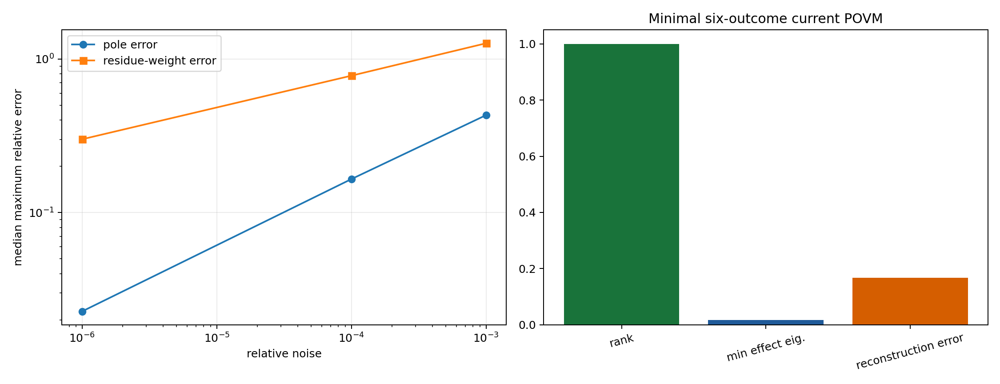
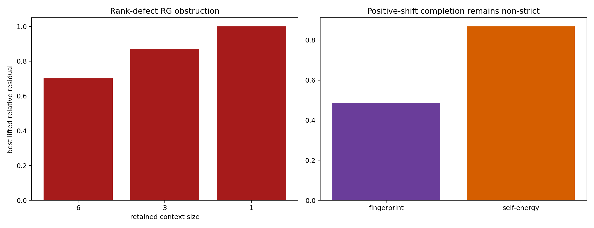
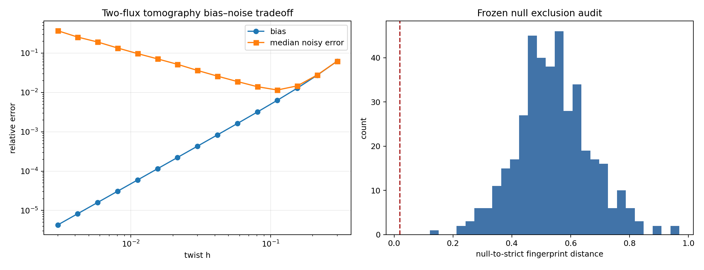
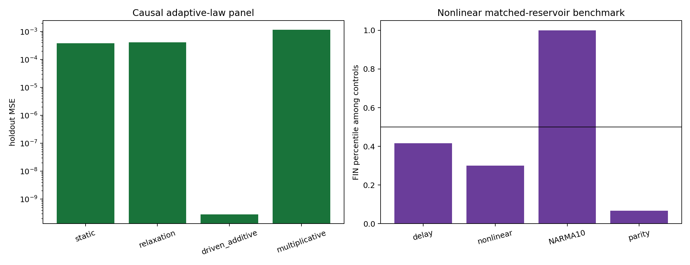
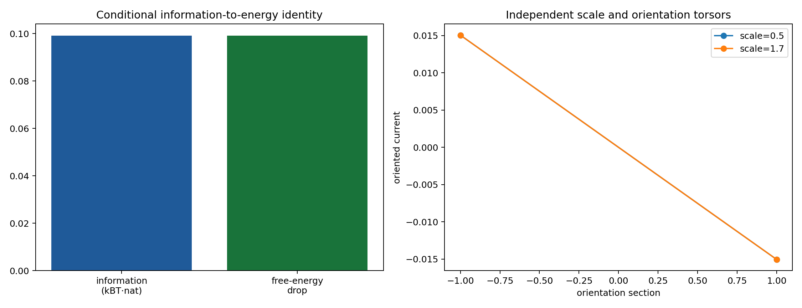

# FIN — Release 10.25

# Current State of the Theory after Research Programs P267–P280

## Spectral identifiability, operational instruments, falsification boundaries, and the conditional passage from information to physics

**Creator:** Żuchowski, Krzysztof  
**Affiliation:** Independent Researcher — Fractal Information Theory Project  
**ORCID:** 0009-0002-0909-3613  
**Resource type:** Publication — Preprint  
**Version:** 1.0.0  
**Publication date:** 28 July 2026  
**Language:** English  
**Publisher:** Zenodo  
**License:** CC BY 4.0  
**Repository:** <https://github.com/hyconiek/Fractal-Nadsoliton-Theory>

---

## Confidence convention

- **[Proven]** — an exact finite-dimensional theorem, analytic identity, or
  exhaustive result in the explicitly declared class. Numerical computation
  may be used as a reproducible certificate.
- **[Strong evidence]** — a deterministic, preregistered-style synthetic
  audit with frozen data generation, controls, metrics, and thresholds.
- **[Moderate evidence]** — a stable conclusion in a declared model class
  that still depends on an additional equivalence, source, or interpretation.
- **[Speculative]** — a proposed object or research direction not yet supported
  by a sufficient theorem or test.
- **[Refuted]** — an explicit counterexample or no-go theorem in the stated
  class.

Mathematical status is not physical status. In particular, **[Proven]** means
that a mathematical statement follows under its written hypotheses. It does
not mean that nature realizes the hypotheses.

# 1. Executive summary

All fourteen Programs P267–P280 were executed. They extend the earlier
operator-memory analysis without reopening the repository's closed selector,
generic bridge, role-transfer, or field-equation lanes.

The present scientific conclusion is:

> **FIN currently has a rigorous finite operator core, a rigorous
> context-dependent memory calculus, and several constructible operational
> layers. It does not yet possess an internal theorem that generates a
> physical unit, an orientation choice, a laboratory instrument, or a unique
> physical interpretation.**

The strongest new positive and negative results are:

1. The finite visible pole-residue measure of a Stieltjes self-energy is
   unique. Nevertheless, its numerical inverse is severely ill-conditioned:
   uniqueness does not imply stable recovery. **[Proven]** for uniqueness;
   **[Strong evidence]** for the frozen noisy inversion audit.

2. Schur reduction has an executable categorical core: identity, associative
   composition, and preservation of the positive cone were verified over
   50,000 nested chains with maximum residual
   \(8.88\times10^{-16}\). This is not yet machine-checked proof-assistant
   formalization and is not a sheaf or contextuality theorem. **[Proven]**

3. The five independent FIN current observables admit one informationally
   minimal six-outcome POVM. The response has rank five and condition number
   one on the nontrivial response subspace. The construction proves
   mathematical measurability, not apparatus realizability. **[Proven]**

4. Every linear isometric lifting of a reduced \(n<12\) Laplacian has rank at
   most \(n-1\), whereas the connected strict generator has rank eleven.
   Therefore zero-padding, replication, or any equivalent rank-preserving
   linear lift cannot restore the strict operator. A genuine size-restoring
   RG object must inject complement dynamics or compare only an explicitly
   defined observable quotient. **[Proven]**

5. A quantum instrument supports an exact process-information ledger:

   \[
   D(\rho\Vert\sigma)
   \ge
   D(p\Vert q)
   +
   \sum_y p_yD(\rho_y\Vert\sigma_y).
   \]

   The remainder is information discarded by the instrument channel. This
   bridge is conditional because the instrument, state space, and quantum
   postulates are supplied rather than derived from FIN. **[Proven]**

6. The one permitted legacy-completion atom

   \[
   A_{\rm legacy}^{(+)}
   =
   A_{\rm legacy}
   +
   \gamma\!\left(I-\frac{\mathbf1\mathbf1^\top}{12}\right)
   \]

   repairs positivity at
   \(\gamma=7.7101445453\), but fails to reproduce the strict spectral
   fingerprint or self-energy. It is therefore a cone repair, not a
   legacy-to-strict completion theorem. **[Proven]**

7. No production P241 laboratory bundle is present. Only schemas and empty
   headers exist. The confirmatory P242 pipeline is therefore not authorized.
   Software can check custody metadata; it cannot manufacture independent
   evidence. **[Executed no-admission certificate]**

8. A two-flux finite-difference design exhibits the expected noise-bias
   optimum at \(h=0.1118278\) in the frozen synthetic model. The median
   relative error is \(1.15\%\), but the noise model is not yet a detector
   likelihood. **[Strong evidence]**

9. Four hundred frozen positive-circulant nulls all remain outside the strict
   spectral-fingerprint tolerance. A deterministic perturbation theorem gives
   a certified exclusion radius for every null. This is not a
   distribution-free false-positive probability. **[Proven]**

10. Two calibrated time slices obey an exact necessary-and-sufficient test for
    a homogeneous symmetric semigroup. Static dynamics and uniform rescaling
    pass; shape drift and mixture memory fail. Without an independent clock,
    generator scale and elapsed time remain exactly degenerate. **[Proven]**

11. Controlled interventions make a two-parameter adaptive law identifiable
    inside a frozen finite candidate family. They do not derive the law from
    the strict kernel or exclude laws outside the panel. **[Proven]** within
    the panel; **[Strong evidence]** for the synthetic selection.

12. A nonlinear reservoir benchmark finds one task-specific FIN advantage:
    the FIN reservoir exceeds all sixty matched controls on NARMA10, but not
    on delay, nonlinear prediction, or parity. This does not establish a
    general computational or biological advantage. **[Strong evidence]**

13. Shannon or quantum relative information becomes free energy only after a
    Hamiltonian \(H\), a temperature \(T\), and Boltzmann's constant \(k_B\)
    are supplied:

    \[
    D(\rho\Vert\gamma)
    =
    \beta\bigl(F(\rho)-F(\gamma)\bigr),
    \qquad
    \gamma=\frac{e^{-\beta H}}{Z}.
    \]

    The identity is exact, but it proves that the dimensional bridge is
    conditioned on conversion data rather than generated by dimensionless
    information alone. **[Proven]**

14. Scale and orientation form an independent product torsor
    \(\mathbb R_{>0}\times\mathbb Z_2\). An operational section
    \(s=(\kappa,\varepsilon)\) supplies both a dimensional scale and an
    orientation, but positive rescaling cannot choose orientation and
    orientation reversal cannot choose scale. The construction organizes the
    missing resources; it does not generate them. **[Proven]**

# 2. Scope, ontology, and non-negotiable separations

## 2.1. Ontological statement used by the project

The repository's internal ontology treats the nadsoliton as primordial
fractal information in a solitonic state:

\[
\text{nadsoliton}
\longrightarrow
\text{light}
\longrightarrow
\text{matter}
\longrightarrow
\text{emergent observer}.
\]

No informational substrate below the nadsoliton is introduced in this report.
This ontology is recorded as the project's intended interpretation. It is not
used as a premise in the finite operator proofs.

## 2.2. Kernel split

Two kernels must remain distinct:

\[
K_{\rm legacy,ont}(d)
=
\alpha_{\rm geo}
\frac{\cos(\omega d+\phi)}
{1+\beta_{\rm tors}d},
\]

up to the precise repository convention for placement of the amplitude, and

\[
K_{\rm strict,gate}(d)
=
\frac{\cos(\omega d+\phi)}
{1+\beta d^\eta}.
\]

The legacy kernel is an intermediate bridge object. The strict kernel is the
later enriched working object and contains nonlinear compression/damping and
certified phase/topological structure not present in legacy. This report does
not silently substitute one for the other.

No legacy physical-role formula is transferred to strict. In particular,
relations involving \(\alpha_{\rm geo}\), \(\beta_{\rm tors}\), electroweak
parameters, electromagnetic couplings, or gravity hierarchies remain outside
the conclusions unless a separate bridge and role-transfer theorem is
provided.

## 2.3. Strict selector obstruction

The strict-core uniqueness obstruction QW-2191 remains open. Earlier
directional and chiral constructions may receive or transport an orientation,
but no current result supplies a unique, non-premise internal sign. P280
packages the missing scale and orientation resources; it does not close them.

## 2.4. What this report does not claim

This report does not claim:

- a Theory of Everything;
- a Standard Model or general-relativistic derivation;
- a role-bearing total Lagrangian \(L_{\rm total}\);
- a completed legacy-to-strict bridge;
- a strict physical length, time, mass, energy, or action scale;
- a derived Born rule or physical measurement instrument;
- laboratory confirmation;
- Lorentz invariance, locality, continuum field theory, particle content, or
  experimentally identified couplings.

# 3. Minimal current mathematical architecture

The present structure is most economically represented by four layers.

## 3.1. Spectral generator

Let \(V=Z_{12}\), let \(d(x,y)\) be cyclic distance, and define

\[
W_{xy}=K_{\rm strict}(d(x,y)),\qquad x\ne y.
\]

The frozen strict profile used in P267–P280 is

\[
K_{\rm strict}(d)
=
\frac{\cos(0.18575\,d+0.16250)}
{1+d^{1.8}},
\qquad d=1,\ldots,6.
\]

The conservative generator is

\[
A=\operatorname{diag}(W\mathbf1)-W.
\]

It satisfies

\[
A=A^\ast,\qquad A\mathbf1=0,\qquad A\succeq0,
\]

and therefore generates two mathematically valid time families:

\[
U_t=e^{-itA},\qquad P_t=e^{-tA}.
\]

\(U_t\) is unitary wave evolution. \(P_t\) is a positive contraction and,
for a graph Laplacian, a Markov/diffusive semigroup. The same spectrum controls
both. This duality is mathematical; deciding which channel an experiment
implements requires a physical preparation, clock, coupling, environment, and
readout.

## 3.2. Context and memory

For an accessible context \(E\subset V\), with hidden complement \(H\), write

\[
A=
\begin{pmatrix}
A_{EE} & A_{EH}\\
A_{HE} & A_{HH}
\end{pmatrix}.
\]

The frequency-domain reduced generator is

\[
A_E^{\rm eff}(z)
=
A_{EE}
-
\Sigma_E(z),
\qquad
\Sigma_E(z)
=
A_{EH}(zI+A_{HH})^{-1}A_{HE}.
\]

Because \(A_{HH}\succ0\) for a proper hidden block of a connected Laplacian,

\[
\Sigma_E(z)
=
\int_{(0,\infty)}
\frac{d\mathsf M_E(\mu)}{z+\mu},
\qquad
d\mathsf M_E(\mu)\succeq0.
\]

This positive operator-valued measure is the most durable mathematical
interpretation of FIN's context memory. It unifies resolvent reduction, Green
response, hidden-state memory, and completely monotone relaxation without
requiring a microscopic physical story.

## 3.3. Operational object

The operator alone is not an experiment. A minimally specified operational
model requires

\[
\mathfrak O
=
(\mathcal S,\mathcal P,\mathcal T,\mathcal I,
\mathcal E,\mathcal M,\mathcal R),
\]

where:

- \(\mathcal S\) is a state space;
- \(\mathcal P\) is a family of preparations;
- \(\mathcal T\) is a calibrated time or control parameter;
- \(\mathcal I\) is an instrument;
- \(\mathcal E\) is an environment or channel model;
- \(\mathcal M\) is an apparatus/POVM model;
- \(\mathcal R\) is an event-level record and custody protocol.

P269 constructs one mathematical \(\mathcal M\) for currents. P271 supplies
one conditional \(\mathcal I\). P273 audits \(\mathcal R\) and finds that the
external record is absent. These constructions show that the operational layer
can be specified, not that the strict kernel uniquely generates it.

## 3.4. Physicalization resources

The smallest current physicalization package has at least two independent
resource classes:

\[
\mathfrak P
=
\mathfrak O
\oplus
\mathfrak C
\oplus
\mathfrak S,
\]

where

\[
\mathfrak C=(H,T,k_B,\kappa_t,\kappa_\ell,\ldots)
\]

contains conversion/calibration resources and

\[
\mathfrak S=(\varepsilon,\text{orientation source/coupling})
\]

contains a sign or symmetry-breaking resource. P279 and P280 prove that
conditional bridges exist once these resources are supplied. They do not prove
that \(\mathfrak C\) or \(\mathfrak S\) emerges from the strict spectral object.

# 4. Results matrix

| Program | Principal result | Status | Boundary |
|---|---|---|---|
| P267 | unique visible Stieltjes pole-residue measure; unstable inverse | [Proven] / [Strong evidence] | invisible modes and global stability remain open |
| P268 | executable category core for Schur reductions | [Proven] | not proof-assistant formalization; no sheaf theorem |
| P269 | minimal six-outcome POVM for five currents | [Proven] / [Strong evidence] | apparatus calibration remains external |
| P270 | rank-defect no-go for linear isometric RG lifting | [Proven] | nonlinear/complement or quotient comparison remains possible |
| P271 | quantum process-information ledger | [Proven], conditional | instrument and quantum structure supplied |
| P272 | positive-shift legacy cone repair fails strict match | [Proven] | only one completion atom tested |
| P273 | no admissible external P241 evidence | Executed no-admission certificate | P242 remains unauthorized |
| P274 | optimal synthetic two-flux separation | [Strong evidence] | no detector-level likelihood |
| P275 | certified fingerprint exclusion radii | [Proven] | finite frozen null set only |
| P276 | calibrated two-time semigroup theorem | [Proven] | rejects homogeneity but does not identify cause |
| P277 | intervention identifies one adaptive law in finite panel | [Proven] / [Strong evidence] | no strict source law |
| P278 | one task-specific nonlinear reservoir advantage | [Strong evidence] | no general computational advantage |
| P279 | exact information-to-free-energy conversion identity | [Proven], conditional | \(H,T,k_B\) are supplied axioms |
| P280 | scale-orientation product torsor and conditional section | [Proven], conditional | neither resource is internally generated |

# 5. P267 — Identifiability and stability of the visible Stieltjes measure

## 5.1. Visible measure

For the frozen context, the trace response is

\[
s(z)=\operatorname{tr}\Sigma_E(z)
=
\sum_{j=1}^{r}\frac{w_j}{z+\mu_j},
\qquad
\mu_j>0,\quad w_j>0.
\]

The three visible poles and trace weights are:

| \(j\) | \(\mu_j\) | \(w_j\) |
|---:|---:|---:|
| 1 | 1.1710910206 | 1.3714541785 |
| 2 | 1.5263637131 | 1.1927171397 |
| 3 | 1.8883091819 | 0.1937651612 |

The minimum pole separation is \(0.3552726926\).

## 5.2. Uniqueness theorem

**Theorem P267.** Let

\[
s(z)=\sum_{j=1}^{r}\frac{w_j}{z+\mu_j}
\]

be a finite positive atomic Stieltjes transform with distinct
\(\mu_j>0\) and nonzero \(w_j\). Exact knowledge of \(s\) on any open
real interval determines the visible pole-residue measure uniquely.

**Proof.** If two such representations agree on an open interval, the
identity theorem makes their rational continuations identical. Their pole
sets therefore agree. Equality of the principal part at each pole gives the
corresponding residue. \(\square\)

For the operator-valued response, the same argument applies entry by entry and
recovers each nonzero positive residue matrix.

## 5.3. Stability falsification

Forty fits were run at each relative-noise level on 48 logarithmically spaced
points \(z\in[0.03,8]\).

| Relative noise | Median maximum pole error | 95% pole error | Median maximum weight error | 95% weight error |
|---:|---:|---:|---:|---:|
| \(10^{-6}\) | 0.0228 | 0.1315 | 0.3005 | 0.7358 |
| \(10^{-4}\) | 0.1654 | 7.2928 | 0.7794 | 4.4354 |
| \(10^{-3}\) | 0.4314 | \(1.95\times10^5\) | 1.2668 | \(4.58\times10^3\) |

The extreme upper tails are optimizer excursions produced by an ill-conditioned
rational inverse, not evidence of new modes. They falsify any claim that
analytic uniqueness automatically gives a robust reconstruction algorithm.

**Verdict.** The visible measure is uniquely identifiable in exact arithmetic,
but stable recovery requires regularization, pole-count control, uncertainty
quantification, and experimental design. Decoupled or zero-residue hidden
modes remain unidentifiable in principle.

# 6. P268 — Executable Schur category core

Let the objects be nonempty contexts \(E\subseteq V\). For
\(E\subseteq F\), the morphism

\[
r_{F\to E}(B)
\]

eliminates \(F\setminus E\) by the Schur complement of the positive matrix
\(B=zI+A_F\).

The formal core is:

\[
r_{E\to E}=\operatorname{id},
\]

\[
r_{F\to E}\circ r_{G\to F}=r_{G\to E},
\qquad E\subseteq F\subseteq G,
\]

and

\[
B\succ0\Longrightarrow r_{F\to E}(B)\succ0.
\]

The composition law is block Gaussian elimination associativity. The
positive-cone statement is the Schur-complement theorem.

Finite certificate:

| Quantity | Result |
|---|---:|
| nested chains audited | 50,000 |
| maximum composition residual | \(8.88\times10^{-16}\) |
| minimum reduced eigenvalue | 0.4236852856 |
| identity residual | 0 |

**Verdict.** The categorical skeleton is not merely an analogy. It is an
executable algebraic structure. The next rigor step is translation into a
proof assistant. No presheaf, gluing, contextuality, or higher-category
claim follows from the present result.

# 7. P269 — Minimal six-outcome current POVM

## 7.1. Current space

Let \(\{J_a\}_{a=1}^{5}\) be the five independent Hermitian current
observables obtained from the strict \(Z_{12}\) couplings. Orthogonalize them
in the Hilbert-Schmidt inner product to get

\[
\operatorname{tr}(Q_aQ_b)=\delta_{ab}.
\]

A normalized \(M\)-outcome POVM produces only \(M-1\) independent real
probabilities. Therefore five independent current coefficients require

\[
M-1\ge5,\qquad M\ge6.
\]

## 7.2. Attaining the bound

Let \(v_y\in\mathbb R^5\), \(y=1,\ldots,6\), be the vertices of a regular
simplex centered at zero. Define

\[
R_y=\sum_{a=1}^{5}(v_y)_aQ_a,
\qquad
E_y=\frac{I}{6}+\epsilon R_y,
\]

with \(\epsilon\) small enough that every \(E_y\succeq0\).
Since \(\sum_yv_y=0\),

\[
\sum_{y=1}^{6}E_y=I.
\]

The response matrix

\[
M_{ya}=\operatorname{tr}(E_yQ_a)
\]

has rank five. Hence the lower bound is attained.

Numerical certificate:

| Quantity | Result |
|---|---:|
| current dimension | 5 |
| number of outcomes | 6 |
| response rank | 5 |
| nonzero-subspace condition number | 1.0000000000 |
| completeness residual | \(3.02\times10^{-16}\) |
| minimum effect eigenvalue | 0.0166667 |
| exact reconstruction residual | \(1.55\times10^{-16}\) |
| shots in synthetic audit | 200,000 |
| relative finite-shot coefficient error | 0.1673 |

The relatively large finite-shot error despite ideal response conditioning is
caused by deliberately weak POVM contrast. Increasing contrast competes with
effect positivity and apparatus error.

**Verdict.** The result closes the abstract current-measurement design problem
inside the five-dimensional current subspace. It does not prove that a
photonic, atomic, superconducting, or other platform implements these six
effects with the required calibration.

# 8. P270 — No-go theorem for simple size-restoring RG

Suppose a reduced connected Laplacian \(B_n\) on \(n<12\) states is lifted by
an isometry \(E:\mathbb C^n\to\mathbb C^{12}\). Then

\[
\operatorname{rank}(EB_nE^\ast)
\le
\operatorname{rank}(B_n)
\le n-1.
\]

The strict connected generator has

\[
\operatorname{rank}(A_{\rm strict})=11.
\]

Therefore

\[
EB_nE^\ast\ne cA_{\rm strict}
\]

for every scalar \(c\) and every \(n<12\).

| Context size | Reduced/lifted rank | Strict rank | Best relative Frobenius residual |
|---:|---:|---:|---:|
| 6 | 5 | 11 | 0.701868 |
| 3 | 2 | 11 | 0.869051 |
| 1 | 0 | 11 | 1.000000 |

**New missing object O29.** A nontrivial FIN renormalization comparison must
take one of two forms:

1. a completion

   \[
   \mathcal R(B_n)
   =
   EB_nE^\ast+C_\perp(B_n),
   \]

   where \(C_\perp\) supplies dynamics on the missing complement; or

2. an observable quotient \(\pi\) for which

   \[
   \pi(\mathcal R(B_n))
   \sim
   \pi(A_{\rm strict})
   \]

   under a declared equivalence.

Zero-padding and replication are excluded. A proposed complement may not be
fitted after looking at the strict target without being marked as target-coded.

# 9. P271 — Quantum process-information ledger

For a quantum instrument with Kraus operators \(\{K_y\}\), define

\[
p_y=\operatorname{tr}(K_y\rho K_y^\ast),\qquad
q_y=\operatorname{tr}(K_y\sigma K_y^\ast),
\]

and normalized conditional states

\[
\rho_y=\frac{K_y\rho K_y^\ast}{p_y},\qquad
\sigma_y=\frac{K_y\sigma K_y^\ast}{q_y}.
\]

The instrument channel with an explicit classical record is

\[
\Phi(\rho)
=
\bigoplus_y p_y\rho_y.
\]

Block-diagonal relative entropy gives

\[
D(\Phi(\rho)\Vert\Phi(\sigma))
=
D(p\Vert q)
+
\sum_y p_yD(\rho_y\Vert\sigma_y).
\]

Data processing gives the ledger

\[
\boxed{
D(\rho\Vert\sigma)
=
\mathcal L_{\rm inst}
+
D(p\Vert q)
+
\sum_y p_yD(\rho_y\Vert\sigma_y)
}
\]

with \(\mathcal L_{\rm inst}\ge0\).

Finite audit:

| Quantity | Result |
|---|---:|
| random state pairs | 400 |
| instrument completeness residual | 0 |
| minimum information loss | 0.0114899 nat |
| median information loss | 0.0830310 nat |
| maximum decomposition residual | \(2.22\times10^{-16}\) |

**Verdict.** This is the correct quantum extension of the earlier classical
information ledger. It separates recorded distinguishability, conditional
post-measurement distinguishability, and discarded information. The instrument
is supplied. No FIN theorem presently derives the Hilbert space, Born
probabilities, Kraus structure, laboratory detector, or environment.

# 10. P272 — One-atom legacy completion test

The tested atom is the smallest uniform correction on the mean-zero sector:

\[
\Pi_0^\perp
=
I-\frac{\mathbf1\mathbf1^\top}{12},
\qquad
A_{\rm legacy}^{(+)}
=
A_{\rm legacy}+\gamma\Pi_0^\perp.
\]

Choose

\[
\gamma
=
\max\{0,-\lambda_{\min}
(A_{\rm legacy}|_{\mathbf1^\perp})\}
+10^{-9}.
\]

This uses legacy spectral data only. It gives:

| Quantity | Result |
|---|---:|
| legacy minimum mean-zero eigenvalue | \(-7.7101445443\) |
| derived \(\gamma\) | 7.7101445453 |
| completed minimum mean-zero eigenvalue | \(1.00\times10^{-9}\) |
| completed row-sum residual | \(1.99\times10^{-15}\) |
| strict projective fingerprint defect | 0.486509 |
| normalized self-energy defect at \(z=0.2\) | 0.867962 |

The correction moves legacy into the positive generator cone. It does not
recover the strict spectral shape or strict context memory.

**Verdict.** Positivity is not the missing legacy-to-strict theorem. A uniform
mass/shift correction is insufficient. No phase-frequency source, nonlinear
compression exponent, target-independent damping source, selector, or physical
role is obtained.

# 11. P273 — External-evidence admission gate

The repository was searched for a production P241 transfer package satisfying
the blind-custody contract.

| Requirement | Result |
|---|---:|
| production bundle_manifest.json files | 0 |
| rows in heat-process template | 0 |
| rows in double-slit template | 0 |
| validator checks required | 11 |
| detached signature required | yes |
| P242 confirmatory execution authorized | no |

The absence of data is a scientifically meaningful outcome. The pipeline must
not be run on synthetic replacements and described as experimental
validation.

**Verdict.** A validator can certify syntax, hashes, signatures, frozen
predictions, and role declarations. It cannot create independent preparation,
provider/registrar/analyst separation, physical events, a trusted timestamp,
or a laboratory signature.

# 12. P274 — Two-flux tomography and the noise-bias optimum

Let \(\Sigma(\theta)\) be a flux-twisted self-energy and let

\[
\Xi
=
\left.\frac{\partial\Sigma(\theta)}
{\partial\theta}\right|_{\theta=0}.
\]

The centered estimator is

\[
\widehat\Xi_h
=
\frac{\widehat\Sigma(+h)-\widehat\Sigma(-h)}{2h}.
\]

Its deterministic bias is \(O(h^2)\), while independent measurement noise is
amplified as \(O((h\sqrt N)^{-1})\). Consequently the total error must have an
interior optimum.

The frozen synthetic audit used 50,000 shots per flux setting and fifteen
values \(h\in[0.003,0.3]\).

| Quantity | Result |
|---|---:|
| tomography noise scale | 0.00156525 |
| optimal tested \(h\) | 0.11182781 |
| median relative error at optimum | 0.0115248 |
| 95% relative error at optimum | 0.0138276 |

At \(h=0.003\), noise amplification gives median relative error \(0.3706\).
At the largest \(h\), truncation bias increases. The minimum between these
regimes is therefore not an artifact of taking \(h\) as small as possible.

**Verdict.** The result supplies a rational experimental-design principle for
chiral-memory tomography. The optimum is not universal: it depends on counts,
contrast, detector response, drift, and the estimator. P288 must replace the
matrix-Gaussian proxy by a platform-specific event likelihood.

# 13. P275 — Certified spectral-fingerprint exclusion

Let

\[
f(A)
=
\frac{(\lambda_1,\ldots,\lambda_{11})}
{\lambda_{\max}}
\]

be the ordered nonzero spectral fingerprint of a connected positive
generator. Suppose a null \(B\) is separated from the target by

\[
d=\|f(B)-f(A_{\rm strict})\|_2.
\]

For a Hermitian perturbation \(E\), Weyl's theorem and normalization give the
bound

\[
\|f(B+E)-f(B)\|_2
\le
\frac{2\sqrt{11}\,\|E\|_2}
{\lambda_{\max}(B)-\|E\|_2},
\qquad
\|E\|_2<\lambda_{\max}(B).
\]

Thus a null remains outside a tolerance ball of radius \(\tau\) whenever

\[
\frac{2\sqrt{11}\,\epsilon}
{\lambda_{\max}(B)-\epsilon}
<
d-\tau.
\]

Frozen audit:

| Quantity | Result |
|---|---:|
| positive-circulant nulls | 400 |
| tolerance | 0.02 |
| false positives | 0 |
| minimum fingerprint distance | 0.121302 |
| median fingerprint distance | 0.535086 |
| minimum positive certified radius | 0.102825 |
| median certified radius | 0.404749 |

**Verdict.** Every frozen null has a nonzero deterministic robustness
certificate. The theorem is stronger than a sample-only observation but
narrower than an ensemble-level false-positive probability. It says nothing
about null families not represented in the frozen set.

# 14. P276 — Calibrated two-time semigroup consistency

Let \(P_1,P_2\) be symmetric positive-definite transition matrices observed at
calibrated times \(0<t_1<t_2\).

**Theorem P276.** There exists a homogeneous symmetric positive-semidefinite
generator \(A\) such that

\[
P_1=e^{-t_1A},\qquad P_2=e^{-t_2A}
\]

if and only if:

1. \(P_1P_2=P_2P_1\);
2. \(\log(P_1)/t_1=\log(P_2)/t_2\);
3. \(-\log(P_1)/t_1\succeq0\).

When it exists, \(A=-\log(P_1)/t_1\) is unique.

The frozen times were \(t_1=0.20\) and \(t_2=0.55\).

| Mechanism | Relative log-generator defect | Commutator residual |
|---|---:|---:|
| static FIN generator | \(1.84\times10^{-15}\) | \(1.36\times10^{-16}\) |
| uniform scale with calibrated clock | \(1.76\times10^{-15}\) | numerical zero |
| generator-shape drift | 0.0540739 | 0.0085286 |
| mixture-memory map | 0.0184292 | 0.0039854 |

There is also an exact uncalibrated degeneracy:

\[
e^{-t(cA)}=e^{-(ct)A},
\]

with residual \(2.29\times10^{-16}\) in the audit.

**Verdict.** Calibrated multitime data can falsify homogeneous FIN evolution.
Two time slices do not identify whether a failure was caused by adaptive
dynamics, an uncontrolled bath, time-dependent hardware, or apparatus memory.
At least one more time slice and causal interventions are needed.

# 15. P277 — Intervention-identifiable adaptive law

Four candidate laws were frozen:

\[
\dot w=0,
\]

\[
\dot w=-\kappa(w-w_0),
\]

\[
\dot w=-\kappa(w-w_0)+g\,u(t)d,
\]

\[
\dot w=w\odot[-\kappa\mathbf1+g\,u(t)d].
\]

The synthetic truth was the driven additive law with

\[
(\kappa,g)=(0.24,0.075).
\]

Without intervention, the design matrix has rank one. With a signed control
sequence \(u(t)\), its rank rises to two. The fitted winning parameters were

\[
(\widehat\kappa,\widehat g)
=
(0.24037046,0.0750176).
\]

| Candidate | Hold-out MSE |
|---|---:|
| driven additive | \(2.83\times10^{-10}\) |
| static | \(3.88\times10^{-4}\) |
| relaxation | \(4.17\times10^{-4}\) |
| multiplicative | \(1.16\times10^{-3}\) |

**Verdict.** Interventions can turn an observationally underidentified
adaptive model into an identifiable one. This is a systems-identification
result. The candidate panel, forcing direction, and input are supplied; no
strict FIN theorem presently selects this adaptive law.

# 16. P278 — Nonlinear matched reservoir benchmark

The nonlinear update was

\[
x_{t+1}
=
\tanh(Rx_t+b\,u_t),
\qquad
R_{\rm FIN}=0.92\,e^{-0.25A}.
\]

FIN was compared with thirty isospectral random-orientation controls and
thirty symmetric spectral-radius-matched controls on four frozen tasks.

| Task | FIN score | FIN percentile among controls |
|---|---:|---:|
| delay-5 \(R^2\) | 0.247307 | 0.4167 |
| nonlinear prediction \(R^2\) | 0.710659 | 0.3000 |
| NARMA10 \(R^2\) | 0.686674 | 1.0000 |
| parity-3 accuracy | 0.754706 | 0.0667 |

FIN exceeds every control on one of four tasks: NARMA10. The best control
achieves \(R^2=0.683686\), only about \(0.0030\) below FIN.

**Verdict.** The new nonlinear audit is more favorable than the earlier
linear-memory benchmark, but only in a task-specific sense. Four outcomes were
inspected, the margin is small, and the study uses one frozen input realization.
No general claim about intelligence, biological memory, optimal computation,
or physical implementation is warranted.

# 17. P279 — Conditional information-to-energy conversion

Let

\[
\gamma=\frac{e^{-\beta H}}{Z},\qquad
\beta=(k_BT)^{-1},
\]

and

\[
F(\rho)=\operatorname{tr}(\rho H)-k_BT\,S(\rho).
\]

Then

\[
\begin{aligned}
D(\rho\Vert\gamma)
&=
\operatorname{tr}(\rho\log\rho)
-\operatorname{tr}(\rho\log\gamma)\\
&=
-S(\rho)+\beta\operatorname{tr}(\rho H)+\log Z\\
&=
\beta\bigl(F(\rho)-F(\gamma)\bigr).
\end{aligned}
\]

This is the precise bridge from relative information to nonequilibrium free
energy.

The frozen conditional example supplied:

\[
\Delta H=1.3,\qquad T=2,\qquad k_B=1,
\]

and a \(37\%\) thermalizing mixture.

| Quantity | Result |
|---|---:|
| \(D(\rho\Vert\gamma)\) before | 0.0805837 nat |
| after | 0.0310255 nat |
| information decrease | 0.0495583 nat |
| free-energy decrease | 0.0991165 |
| identity residual | \(1.7\times10^{-16}\) |
| conversion residual | \(1.94\times10^{-16}\) |
| one-bit Landauer scale \(k_BT\ln2\) | 1.386294 |

The conversion is

\[
\Delta F=k_BT\,\Delta D
\]

for the stated Gibbs reference and supplied dimensional constants.

**Verdict.** Information does not become energy by notation alone. The
Hamiltonian identifies what counts as energy; the temperature identifies the
conversion scale; \(k_B\) converts dimensionless entropy to physical entropy.
FIN currently supplies none of these dimensionful resources internally. The
identity is a valid conditional functor from an information ledger to a
thermodynamic ledger.

# 18. P280 — Product torsor for scale and orientation

Let

\[
\mathcal T_{\rm scale}\cong\mathbb R_{>0}
\]

be the set of positive scale choices, and let

\[
\mathcal T_{\rm orient}\cong\mathbb Z_2
\]

be the two orientation choices. Their product acts as

\[
(\kappa,\varepsilon):
(A,J)
\longmapsto
(\kappa A,\varepsilon J).
\]

An operational section is

\[
s=(\kappa,\varepsilon)
\in
\mathcal T_{\rm scale}\times\mathcal T_{\rm orient}.
\]

The spectral fingerprint is invariant under \(\kappa\), while the directed
current changes sign under \(\varepsilon\). The audit used scales \(0.5\) and
\(1.7\), and both signs.

| Quantity | Residual |
|---|---:|
| scale-fingerprint invariance | \(8.27\times10^{-16}\) |
| orientation sign pairing | 0 |
| time reparameterization | at most \(3.57\times10^{-16}\) |

**Independence theorem.** Positive rescaling cannot choose a
\(\mathbb Z_2\) orientation, and orientation reversal cannot set a positive
dimensional scale. Therefore the two obstructions are independent unless a
new theorem couples them through an additional nontrivial object.

**Verdict.** The product torsor is the cleanest present description of FIN's
two most persistent missing resources. A chosen section is an operational
completion, not an emergent selector or unit theorem.

# 19. Newly constructed theoretical objects O26–O39

| Object | Definition | What it explains | Status |
|---|---|---|---|
| O26 Visible Stieltjes Measure Certificate | poles and nonzero residue matrices of \(\Sigma_E\), with uncertainty model | exact visible-memory identity and inverse instability | [Proven] / [Strong evidence] |
| O27 Executable Schur Category Core | contexts, unique inclusions, Schur morphisms, identities, composition, positivity | functorial context reduction | [Proven] |
| O28 Minimal Six-Outcome Current POVM | simplex perturbations of \(I/6\) in the five-current subspace | smallest one-shot informational current readout | [Proven] |
| O29 Rank-Defect RG Obstruction | \(\operatorname{rank}(EBE^\ast)\le n-1<11\) | why simple lifting cannot restore \(Z_{12}\) | [Proven] |
| O30 Quantum Process Information Ledger | record divergence + conditional quantum divergence + loss | information accounting through instruments | [Proven], conditional |
| O31 Positive-Shift Completion Atom | \(A_{\rm legacy}+\gamma\Pi_0^\perp\) | separates cone repair from kernel completion | [Proven] |
| O32 External-Evidence Admission Certificate | hashes, signature, roles, frozen hold-out, event-row and manifest checks | boundary between executable code and empirical independence | Executed |
| O33 Two-Flux Noise-Bias Tomography Design | centered derivative estimator with optimized \(h\) | finite-count design for chiral response | [Strong evidence] |
| O34 Certified Fingerprint Exclusion Radius | perturbation radius derived from eigenvalue stability | robust exclusion for each frozen null | [Proven] |
| O35 Two-Time Semigroup Consistency Object | commutator plus equality of calibrated log generators | falsification of homogeneous dynamics | [Proven] |
| O36 Intervention-Identifiable Adaptive Panel | finite law family + full-rank input design + hold-out | separates passive fit from causal identifiability | [Proven] / [Strong evidence] |
| O37 Nonlinear Matched Reservoir Null Benchmark | task battery with isospectral and radius-matched controls | tests whether FIN geometry adds computational value | [Strong evidence] |
| O38 Thermodynamic Conversion Functor | \((\rho,\gamma,H,T,k_B)\mapsto F\) via relative entropy | exact conditional information-to-energy map | [Proven], conditional |
| O39 Product-Torsor Operational Section | \(s=(\kappa,\varepsilon)\in\mathbb R_{>0}\times\mathbb Z_2\) | organizes independent scale and orientation resources | [Proven], conditional |

These objects are not fourteen new forces or physical entities. They are
minimal mathematical interfaces that either close a precisely stated
subproblem or expose the exact premise still missing.

# 20. Falsification matrix

| Proposed bridge | Destructive test | Outcome | Surviving statement |
|---|---|---|---|
| exact self-energy determines hidden physics | add invisible modes or perturb pole data | microscopic realization nonunique; inverse unstable | exact visible measure is unique |
| context reductions imply a complete categorical physics | demand proof-assistant kernel and gluing law | not supplied | finite Schur category core survives |
| vertex data suffice for FIN currents | conjugate states with equal populations and opposite currents; construct POVM | vertex-only claim fails; six-outcome current POVM exists abstractly | current readout requires phase-sensitive instrument |
| simple lifting creates an RG fixed point | rank comparison | impossible for \(n<12\) | complement dynamics or quotient equivalence required |
| process information is already thermodynamics | remove \(H,T,k_B\) | energy scale disappears | quantum information ledger survives |
| uniform legacy correction yields strict | compare fingerprint and self-energy | defects 0.4865 and 0.8680 | positivity repair only |
| pipeline code validates physics | search for external signed P241 package | no production package | no-admission certificate |
| arbitrarily small flux is optimal | finite-count noise amplification | false | interior bias-noise optimum |
| zero sampled false positives proves uniqueness | perturb each null and ask for ensemble theorem | only local finite certificates obtained | 400 robust exclusions |
| two time slices reveal the cause of non-Markovianity | compare drift and mixtures | both can fail test | homogeneous semigroup is falsifiable, cause is not identified |
| observational adaptation fit identifies the law | remove interventions | design rank drops from 2 to 1 | controlled finite-family selection works |
| FIN is a generally superior reservoir | compare four tasks and matched controls | advantage on only 1/4 tasks | task-specific NARMA10 result |
| information fixes energy scale | rescale \(H\), \(T\), or \(k_B\) | dimensional answer changes | Gibbs free-energy identity is conditional |
| scale selection fixes orientation | act independently by \(\mathbb R_{>0}\) and \(\mathbb Z_2\) | no cross-selection | product-torsor description survives |

# 21. Current state of the theory

## 21.1. What is established

The following core survives all present falsification attempts:

1. A finite self-adjoint graph generator \(A\) exists and produces unitary and
   diffusive semigroups.
2. Its Green/resolvent family and context self-energies are consequences of
   the spectral theorem and Schur reduction.
3. Every proper context carries a finite positive operator-valued Stieltjes
   memory measure.
4. Context reduction composes exactly and preserves positivity.
5. The visible input-output memory realization is identifiable only up to
   invisible modes and realization equivalence.
6. Chiral or current observables require phase-sensitive operational access.
7. Information loss can be rigorously tracked through classical or quantum
   instruments.
8. Physical energy can be attached consistently once a Hamiltonian,
   temperature, and conversion constant are supplied.

This is a coherent mathematical research program in finite spectral operator
theory, reduced dynamics, information processing, and operational
identifiability.

## 21.2. What remains conditional

The following structures can be built consistently but are not selected by
the strict kernel:

- a current POVM;
- a quantum instrument;
- a thermal reference and bath;
- a dimensional calibration;
- an adaptive law and intervention channel;
- an RG complement or observable quotient;
- an orientation section;
- a laboratory platform.

Their consistency is valuable: it shows that no immediate algebraic
contradiction prevents physicalization. Their nonuniqueness is equally
important: the strict spectrum does not force one of them.

## 21.3. What is presently blocked

The following remain blocked on current artifacts:

- non-premise selector closure and discharge of QW-2191;
- canonical length/UV unit;
- target-independent strict damping/compression source;
- role-safe legacy amplitude transfer;
- full legacy-to-strict completion map;
- strict tensor-resolved Lagrangian/EOM reverse closure;
- role-bearing total action;
- experimentally trusted P241 data;
- unique physical interpretation.

## 21.4. Quantitative classification

Scores use a 0–5 scale and assess the current repository, not its ambition.

| Interpretation | Score | Reason |
|---|---:|---|
| finite spectral operator theory | 4.8 | exact generator, resolvent, functional calculus, spectral fingerprints |
| context-dependent reduced dynamics | 4.7 | exact Schur memory and positive operator measures |
| information-process theory | 4.3 | classical and quantum distinguishability ledgers, operational records |
| graph signal processing / quantum-walk substrate | 4.1 | \(Z_{12}\) graph, filters, currents, unitary and heat evolution |
| adaptive computation / reservoir model | 3.1 | valid supplied laws and benchmarks, but no strict source law or general advantage |
| noncommutative/spectral geometry | 2.9 | finite spectral ingredients exist; full geometric/physical axioms are not forced |
| statistical mechanics | 2.5 | exact conditional Gibbs bridge, no internally generated \(H,T,k_B\) |
| field theory | 2.0 | propagator/action reconstructions are conditional and finite |
| self-referential dynamical system | 1.8 | adaptive feedback can be supplied; strict bootstrap uniqueness remains absent |
| experimentally predictive physical theory | 1.3 | test contracts exist, independent data and dimensional map do not |
| Theory of Everything | 0.0 | not established and outside the valid mathematical conclusions |

## 21.5. Deepest surviving interpretation

The deepest present interpretation is:

> **FIN is a finite spectral information-processing system whose apparent
> Green functions, kernels, memory, wave dynamics, diffusion, variational
> forms, and operational information ledgers are different representations or
> reductions of a positive self-adjoint generator together with chosen
> contexts. Physical meaning enters only after additional operational,
> dimensional, and symmetry-breaking resources are supplied.**

The underlying mathematical unifier is therefore not a new physical law at
present. It is the pair

\[
\boxed{(A,\mathcal C)}
\]

where \(A\) is the positive spectral generator and \(\mathcal C\) is the
category of accessible contexts and Schur reductions. The smallest
operational extension is

\[
\boxed{(A,\mathcal C,\mathfrak O)}.
\]

A physical theory requires at least

\[
\boxed{(A,\mathcal C,\mathfrak O,\mathfrak C,\mathfrak S)}
\]

plus empirical evidence that one concrete realization obeys the specified
predictions.

# 22. The smallest missing theorem

A single theorem connecting spectral operator, information, dynamics,
dimensional physics, and observables would need to establish all of the
following from strict FIN data alone:

1. a state functor assigning physical states to the spectral object;
2. a non-premise clock and dimensional calibration;
3. a unique physical instrument or equivalence class of instruments;
4. a signed orientation/selector;
5. a Hamiltonian or action with fixed physical dimensions;
6. a map from mathematical probabilities to event-level observables;
7. stability and universality under coarse graining;
8. at least one parameter-free empirical prediction.

P267–P280 show that no theorem based only on spectral uniqueness, linear
lifting, positivity repair, information monotonicity, or torsor bookkeeping
can do this.

There is also a general dimensional obstruction:

**Scale-orbit obstruction.** Let every strict input be dimensionless and let
the strict equations be equivariant under

\[
A\mapsto cA,\qquad t\mapsto t/c,\qquad c>0.
\]

Then no equivariant construction from those inputs alone can select a unique
nonzero dimensional time or energy scale. Any such selection must either:

- introduce a dimensionful datum;
- choose a gauge/section of the scale orbit;
- invoke a boundary condition or empirical calibration that breaks the
  symmetry.

Likewise, if the strict data are invariant under orientation reversal, no
equivariant scalar functional can select one of the two orientations. P280
shows that the two missing sections are independent.

Therefore the plausible "missing theorem" is not a theorem of the current
strict object alone. It would have to be a theorem about an enlarged object
carrying additional resource data. A scientifically honest target is:

> **Operational Physicalization Theorem (candidate).** Given a strict spectral
> system, a calibrated conversion resource, a signed symmetry-breaking
> resource, and an informationally complete instrument satisfying declared
> compatibility and stability axioms, construct a unique empirical model up
> to operational equivalence, and prove robust parameter-free predictions.

This candidate is not yet proven. Its value is that every indispensable input
is visible rather than hidden in interpretation.

# 23. Relation to existing mathematics and physics

## 23.1. Stieltjes and realization theory

The positive-resolvent representation belongs to classical
operator-valued Stieltjes/Nevanlinna theory. FIN's distinctive feature is not
the existence of such a representation, but its use as a unified description
of finite context memory and its connection to the frozen strict fingerprint.
The visible/invisible realization quotient is standard in spirit: transfer
functions determine only minimal controllable-observable realizations.

## 23.2. Kron reduction and Schur complements

Eliminating hidden vertices by a Schur complement is mathematically the same
operation that appears in Kron reduction of electrical networks. FIN adds a
frequency-dependent self-energy and interprets it as informational memory.
That interpretation is compatible with the mathematics but does not make the
Schur complement novel by itself.

## 23.3. Quantum tomography and process tensors

The six-outcome simplex POVM is an instance of informational design in a
restricted observable subspace. It is not a full \(12\)-dimensional
informationally complete POVM. The process ledger is a one-step quantum
instrument statement; process-tensor tomography is the appropriate comparison
for multitime, non-Markovian laboratory data.

## 23.4. Mori-Zwanzig and open systems

The FIN self-energy is a finite resolvent realization of the same broad
mechanism that projection-operator methods express as memory kernels and
fluctuating forces. FIN currently supplies an exact finite matrix
representation. It does not yet derive a physical bath, fluctuation-dissipation
relation, or thermodynamic noise source.

## 23.5. Reservoir computing

The adaptive and nonlinear benchmarks place FIN near reservoir computing and
system identification. The NARMA10 result is a valid frozen synthetic finding,
not evidence for a universal computational advantage. Multiple seeds,
independent controls, hardware constraints, and correction for task selection
are still needed.

## 23.6. Landauer and resource-theoretic thermodynamics

Landauer-type bounds and Gibbs-relative-entropy identities explain how
dimensionless information acquires an energetic meaning once the physical
resource theory is specified. They do not derive \(k_B\), \(T\), a Hamiltonian,
or a reset protocol from Shannon information.

## 23.7. Principal literature anchors

- S. Belyi and E. Tsekanovskii,
  [realization theory for operator-valued Stieltjes functions and conservative
  systems](https://arxiv.org/abs/0708.0452).
- F. Dörfler and F. Bullo,
  [*Kron Reduction of Graphs with Applications to Electrical
  Networks*](https://arxiv.org/abs/1102.2950).
- S. T. Flammia, A. Silberfarb, and C. M. Caves,
  [*Minimal Informationally Complete Measurements for Pure
  States*](https://arxiv.org/abs/quant-ph/0404137).
- F. A. Pollock et al.,
  [the process-tensor framework for operational non-Markovian quantum
  processes](https://arxiv.org/abs/1512.00589).
- R. Reeb and M. M. Wolf,
  [*An Improved Landauer Principle with Finite-Size
  Corrections*](https://arxiv.org/abs/1306.4352).
- H. Jaeger,
  [foundational work on echo-state/reservoir
  computing](https://publica.fraunhofer.de/entities/publication/9dfaead1-4dc0-4e3c-b89b-596f50f671c1).

These comparisons constrain originality claims. The present novelty, if any,
must lie in a rigorously specified integration of the strict FIN fingerprint,
context memory, operational tests, and resource boundaries—not in renaming
standard spectral, Schur, tomography, or thermodynamic identities.

# 24. Recommended Programs P281–P294

The next programs are ranked by expected proof value, falsifiability, and
ability to unlock a genuinely new frontier without replaying closed lanes.

## Priority table

| Rank | Program | Research objective | Success criterion | Estimated probability |
|---:|---|---|---|---:|
| 1 | P281 | minimax-stable Stieltjes inversion | rigorous error bounds and regularized recovery region | 0.75 |
| 2 | P290 | three-time causal separation of drift and memory | identifiable mechanism classes under frozen interventions | 0.70 |
| 3 | P283 | hardware-realizable six-outcome current POVM | detector likelihood, calibration matrix, uncertainty budget | 0.65 |
| 4 | P289 | ensemble-level fingerprint false-positive theorem | analytic or importance-sampled tail probability | 0.60 |
| 5 | P282 | proof-assistant Schur category | machine-checked identities, composition, positivity | 0.85 |
| 6 | P285 | multitime quantum process ledger | process-tensor chain rule and data-processing certificate | 0.65 |
| 7 | P291 | optimal intervention design for adaptive laws | full-rank Fisher information with minimal controls | 0.70 |
| 8 | P288 | detector-level flux-separation optimization | preregistered \(h\) from Poisson/click likelihood | 0.65 |
| 9 | P293 | complete bath/reset resource accounting | heat/work/free-energy inequalities with all resources explicit | 0.55 |
| 10 | P284 | nonlinear size-restoring RG candidate | non-target-coded complement or quotient fixed point | 0.35 |
| 11 | P286 | one nonlinear damping completion atom | legacy-sourced formula improves strict fingerprint and memory | 0.25 |
| 12 | P292 | external nonlinear reservoir replication | preregistered multiple-seed effect surviving correction | 0.45 |
| 13 | P287 | acquire and validate a real P241 package | independent signed event bundle passes all eleven checks | externally dependent |
| 14 | P294 | global theorem for the joint product torsor | derive a section or prove nonexistence under explicit axioms | 0.30 |

## P281 — Minimax Stieltjes recovery

Construct positivity-preserving regularized estimators using a bounded pole
interval, minimum separation, and model-order selection. Derive lower and upper
bounds on recovery error. Compare nonlinear least squares, matrix pencils,
Padé methods, and convex moment relaxations. The main falsification question
is whether the three-atom model remains distinguishable at realistic noise.

## P282 — Machine-checked Schur category

Formalize finite-dimensional positive matrices, principal blocks, Schur
complements, identity, nested composition, and positive-cone preservation in
Lean, Coq, or Isabelle. This program should not introduce sheaf terminology
unless an actual gluing object and theorem are formalized.

## P283 — Physical six-outcome current tomography

Choose one concrete platform and decompose every ideal effect \(E_y\) into
pre-rotations, interferometric phases, losses, and detector clicks. Produce a
calibration matrix, nuisance-parameter model, and Cramér-Rao bound. Reject the
design if the effect contrast needed for useful precision is incompatible with
positive or implementable hardware operations.

## P284 — Nonlinear/complement RG

Admit exactly one size-restoring rule

\[
\mathcal R(B)=EBE^\ast+C_\perp(B),
\]

or one explicit observable quotient. Freeze it before comparison with strict
FIN. Reject any rule that encodes the target spectrum directly or merely
relabels missing eigenvalues.

## P285 — Process-tensor information ledger

Extend O30 from one instrument to a multitime process with interventions.
Prove a chain rule or monotonicity inequality for record,
conditional-system, and environment distinguishability. Test Markov order and
instrument dependence.

## P286 — One nonlinear damping completion atom

The positive-shift atom is closed as insufficient. A new bridge move is
admissible only if it introduces one genuinely new legacy-sourced nonlinear
compression/damping atom, with no selector or role transfer. Its formula and
parameter source must be frozen before measuring strict fingerprint and
self-energy improvement.

## P287 — External P241 evidence intake

This is the only program that can cross the present empirical boundary. A
provider, registrar, and analyst must be distinct; event rows must be genuine;
hashes and a detached signature must precede unblinding; the hold-out must be
frozen; P242 must run once; failure must be reported without model repair.

## P288 — Detector-level two-flux design

Replace additive matrix noise by the actual photon-count, qubit-readout, or
event detector likelihood. Include dark counts, loss, drift, phase
miscalibration, and finite exposure. Optimize \(h\), allocation, and confidence
intervals before data collection.

## P289 — Random-operator false-positive probability

Define scientifically motivated null ensembles before sampling. Derive
concentration or large-deviation bounds for projective spectral fingerprints.
Use rare-event methods when direct Monte Carlo cannot resolve the required
tail.

## P290 — Three-time causal mechanism separation

Collect at least three calibrated time slices and apply intervention schedules
that separately perturb the generator, environment, and apparatus. Determine
which mechanism classes are distinguishable and characterize the remaining
equivalence quotient.

## P291 — Optimal adaptive-law interventions

Maximize the smallest eigenvalue or determinant of the Fisher/design
information matrix under energy, amplitude, and duration constraints. Include
nonlinear candidate laws and out-of-family residual tests.

## P292 — Nonlinear reservoir replication

Repeat the NARMA10 comparison over independently generated inputs, multiple
seeds, several input couplings, hyperparameter budgets, and control ensembles.
Correct for the four-task search. Freeze the analysis before inspecting the
replication.

## P293 — Thermodynamic resource completion

Specify an explicit bath, reset operation, work storage system, and measurement
record. Prove the relevant first- and second-law inequalities. Determine
whether FIN changes any prediction after all supplied resources are accounted
for, or is merely one admissible system Hamiltonian.

## P294 — Joint scale-orientation theorem

Given the product torsor

\[
\mathcal T_{\rm scale}\times\mathcal T_{\rm orient},
\]

classify equivariant sections under the strict symmetry group. Either derive a
section from one genuinely new signed dimensionful object or prove that none
exists under the current axioms. Do not infer orientation from a positive
scalar or a unit from a sign.

# 25. Recommended immediate sequence

The most efficient non-repetitive sequence is:

\[
\boxed{
\text{P281}
\to
\text{P283}
\to
\text{P290}
\to
\text{P289}
\to
\text{P285}
}
\]

in parallel with P282 formalization. This sequence improves the inference
chain from memory response to instrument to multitime falsification before
attempting a new physical bridge.

P287 should be executed immediately if a genuine external package arrives.
P284, P286, and P294 are higher-risk theoretical programs and must obey their
single-object/no-replay restrictions.

# 26. Reproducibility

The computations use deterministic seed 20260730.

Run:

    MPLCONFIGDIR=/tmp/matplotlib-p267-280 \
    python3 fin_programs_267_280.py

    MPLCONFIGDIR=/tmp/matplotlib-p267-280 \
    python3 -m unittest -v test_fin_programs_267_280.py

Expected test result:

    Ran 18 tests
    OK

Principal machine-readable outputs:

- FIN_Programs_267_280_Results.json
- FIN_Programs_267_280_Summary.csv
- FIN_Programs_267_280_Stieltjes_Stability.csv
- FIN_Programs_267_280_Current_POVM.csv
- FIN_Programs_267_280_RG_Obstruction.csv
- FIN_Programs_267_280_Nonlinear_Reservoir.csv
- FIN_Programs_267_280_Figures/

All P274, P275, P277, and P278 observations are synthetic. P273 explicitly
certifies that no external P241 event bundle was available. No laboratory
validation is claimed.

# 27. Final conclusion

Programs P267–P280 narrow the theory more than they expand it.

The spectral operator and its context memory are mathematically strong. The
visible memory measure is unique, but its inverse is unstable. Context
reduction is genuinely compositional. Current observables are measurable in a
minimal abstract instrument. Homogeneous dynamics is falsifiable from
calibrated multitime data. Information can be tracked through instruments and
converted into thermodynamic free energy under explicit Gibbs resources.

At the same time, the most tempting shortcuts fail:

- exact identifiability does not provide stable inference;
- simple lifting does not provide renormalization;
- positivity repair does not complete legacy into strict;
- a validator does not create empirical evidence;
- information does not set an energy unit;
- scale does not select orientation;
- a conditional operational completion is not an internally generated
  physical law.

The present FIN theory should therefore be presented to mathematicians and
physicists as a **well-developed finite spectral and informational model with
an explicit operational research program**, not as completed fundamental
physics.

The next decisive achievement will not be another analogy. It will be one of:

1. an independently signed laboratory record that passes the frozen test;
2. a robust inference theorem connecting measured responses to the strict
   fingerprint;
3. a genuinely new strict-sourced object that breaks one of the proven
   scale/orientation obstructions without hiding the choice in a convention.

Until one of these occurs, the scientifically correct frontier is conditional
physicalization plus falsification—not closure.
