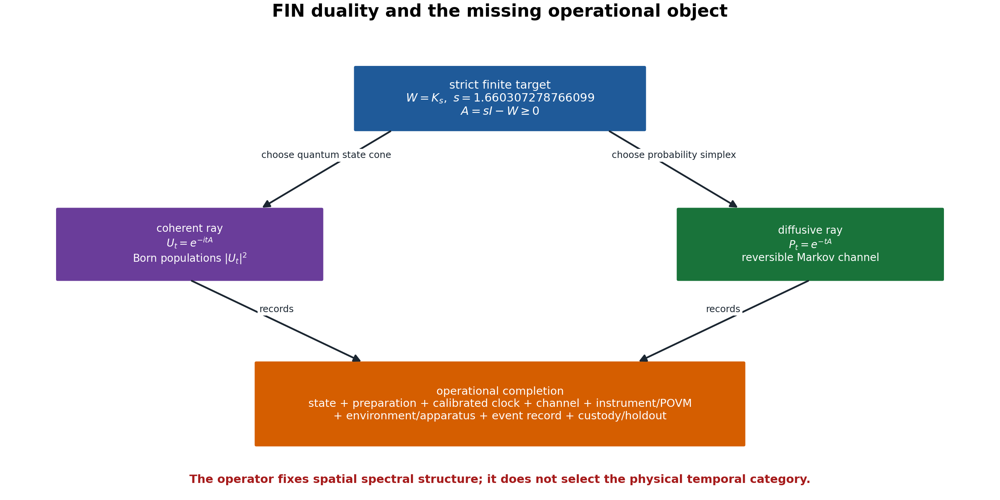
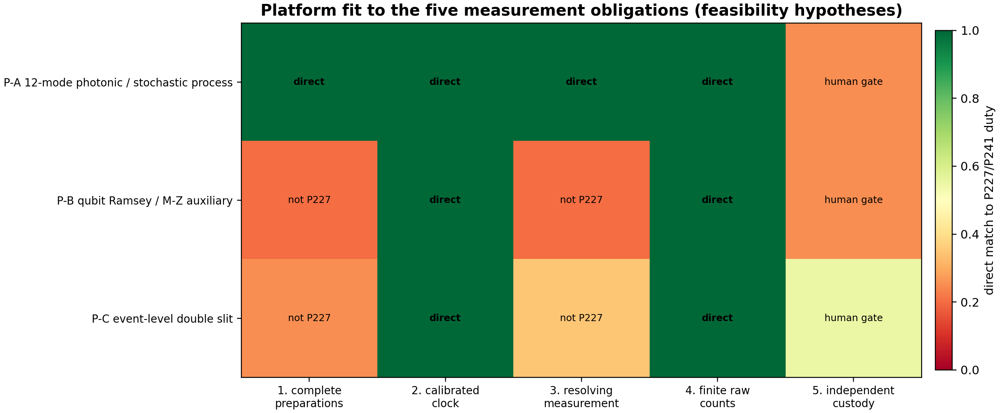
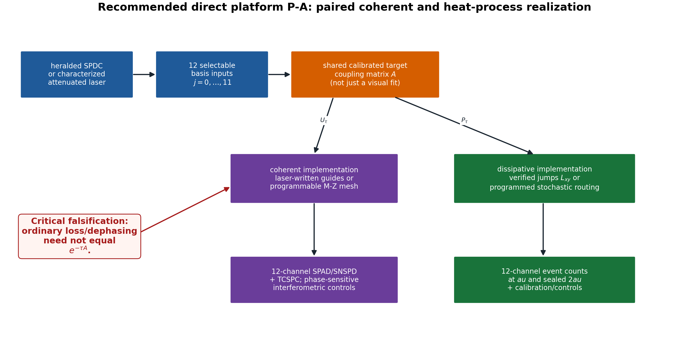
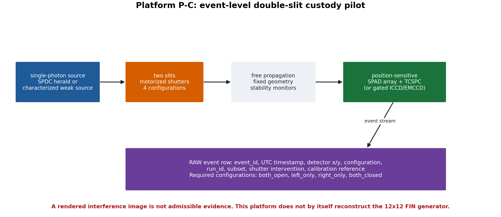
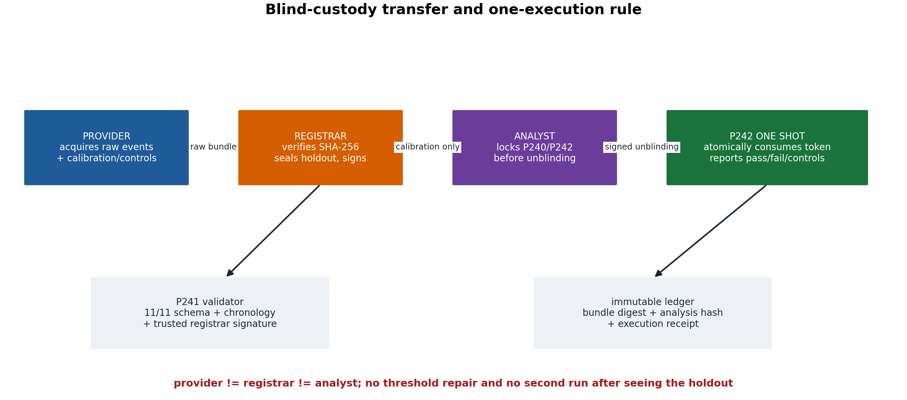
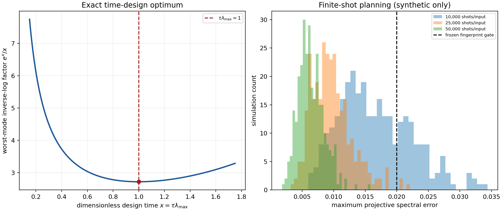

# FIN Laboratory Transfer Package — Release 10.21

# P240 Optimal Tomography + P241 Blind-Custody Validator + P242 One-Shot Pipeline

## A scientific transfer package and executable specification for theoretical and experimental physicists

**Creator:** Żuchowski, Krzysztof  
**Affiliation:** Independent Researcher — Fractal Information Theory Project  
**ORCID:** 0009-0002-0909-3613  
**Date:** 27 July 2026  
**Version:** 1.0.0  
**Language:** English  
**Resource type:** Publication — Preprint and executable specification  
**Repository:** https://github.com/hyconiek/Fractal-Nadsoliton-Theory  
**Related project DOI supplied by the author:** https://doi.org/10.5281/zenodo.21435332  
**License:** CC BY 4.0

---

# Abstract

This document transfers the experimentally actionable part of the FIN
research programme to an independent team of theoretical and experimental
physicists. It begins from the finite strict twelve-node kernel, not from
cosmological or Theory-of-Everything claims. With

$$
W=K_s,\qquad s=1.660307278766099,\qquad A=sI-W,
$$

the exact Dirichlet identity

$$
\langle f,Af\rangle
=
\frac12\sum_{x,y}W_{xy}|f_x-f_y|^2
\geq 0
$$

places the same self-adjoint generator under the coherent group

$$
U_t=e^{-itA}
$$

and the reversible heat/Markov semigroup

$$
P_t=e^{-tA}.
$$

This duality is mathematically proved on the frozen $C_{12}$ target. It does
not select which temporal law is physical. State space, preparation, clock,
instrument, environment, apparatus, record and dimensional calibration remain
operational inputs. The document therefore does not ask a laboratory to
confirm a metaphysical interpretation. It asks whether an explicitly
realized, calibrated and blinded twelve-state process follows the registered
FIN transition law and whether it survives a one-time held-out semigroup
test.

Program 240 is executed here. The fastest-mode inverse-log noise factor is
$e^x/x$, with the unique optimum

$$
x=\tau\lambda_{\max}=1.
$$

Cyclic symmetrization makes equal allocation to all twelve basis preparations
minimax within the declared convex design class. A rectangular
matrix-Bernstein theorem supplies a nonasymptotic spectral concentration
bound. Synthetic planning gives a $99\%$ and $100\%$ pass rate for the frozen
projective spectral gate at respectively $25\,000$ and $50\,000$ shots per
preparation, while the fully distribution-free sufficient count for the same
$0.02$ projective bound is approximately $22.6$ million per preparation.
The large difference is reported, not hidden.

Program 241 is an executable blind-custody validator. It checks eleven
measurement, data, calibration, control, chronology, hash and role-separation
fields and requires a detached signature from a trusted registrar. It accepts
either a twelve-state process record or an event-level double-slit record.
It cannot generate the missing independent empirical record.

Program 242 is a fail-closed analysis pipeline. It runs exactly once for an
admitted twelve-state process bundle, predicts

$$
P_{2\tau}^{\mathrm{pred}}=\widehat P_\tau^2,
$$

compares the prediction with the sealed $\widehat P_{2\tau}$ holdout, evaluates
the strict projective fingerprint and preregistered negative controls, and
reports failure without model repair. No external bundle is supplied in this
release; consequently Program 242 remains locked and no physical validation
is claimed.

---

# Executive decision for a laboratory team

## What is ready

- The finite strict target matrix and spectrum are frozen.
- The dual unitary/heat mathematics is proved on that target.
- The heat-kernel instrument-to-spectrum theorem is explicit.
- P240 supplies the registered time, allocation, shot plan and concentration
  bounds.
- P241 supplies a production validator, transfer template and signed-custody
  gate.
- P242 supplies a one-run semigroup/fingerprint pipeline.
- Eighteen regression tests pass.

## What is not ready

- No external event bundle exists in this package.
- No code can manufacture independent custody, an independent apparatus or a
  real physical preparation.
- No laboratory is asserted to realize the twelve basis states, vertex POVM,
  or a homogeneous FIN semigroup.
- No absolute physical time, energy, action or length unit follows from the
  dimensionless operator.
- The strict selector obstruction `QW-2191` remains open.
- The legacy-to-strict completion bridge and legacy physical-role transfer
  remain open.
- No $L_{\rm total}$, Standard Model, general-relativistic or
  Theory-of-Everything closure is claimed.

## Platform recommendation

| Platform | Direct relevance to P227/P240–P242 | Recommended role |
|---|---:|---|
| P-A: twelve-mode photonic coherent walk plus separately verified stochastic/open-system realization | high | primary FIN process experiment |
| P-B: qubit Mach–Zehnder/Ramsey single–plus–echo dephasing experiment | medium as an operational-method test; low as a twelve-node FIN test | auxiliary memory, dephasing and instrument validation |
| P-C: event-level single-photon double slit with four shutter configurations | high for event acquisition and custody; low for direct $12\times12$ spectral reconstruction | procedural pilot and independent interference record |

The recommended scientific sequence is:

1. use P-C, if convenient, to prove that the collaboration can produce the
   required event-level, signed, blinded record;
2. execute P-A as the direct twelve-state process test;
3. use P-B only for auxiliary tests of dephasing, echo, memory and detector
   modelling;
4. do not treat a programmable emulator as evidence that nature selected FIN;
   it validates the implementation and falsification pipeline.



---

# Claim convention

| Label | Meaning |
|---|---|
| **Proven** | analytic finite theorem in the declared scope |
| **Machine checked** | executable test or exact hash/schema check completed |
| **Synthetic planning evidence** | numerical experiment generated from a declared model; not physical evidence |
| **Feasibility hypothesis** | apparatus proposal requiring expert engineering review |
| **Open** | missing theorem, apparatus, calibration or external record |
| **Refuted in scope** | an explicit counterexample or no-go applies under stated assumptions |

No statement is promoted across these categories.

---

# 1. Scientific question

The laboratory question is intentionally narrower than the overall FIN
research programme:

> Can an independently operated, calibrated twelve-state platform realize the
> frozen transition family associated with the strict FIN generator, and can
> its sealed $2\tau$ record be predicted from its calibration-time $\tau$
> record without post-hoc repair?

There are two associated but distinct questions:

1. does a coherent implementation realize the transition amplitudes of
   $U_t=e^{-itA}$;
2. does a stochastic or open-system implementation realize the populations
   of $P_t=e^{-tA}$?

The common generator makes these two calculations mathematically related. It
does not make the two experimental procedures physically identical.

---

# 2. Frozen finite target

## 2.1 Strict working kernel

Let $V=\mathbb Z/12\mathbb Z$ and

$$
d(x,y)=\min\{|x-y|,12-|x-y|\}.
$$

The frozen strict working profile is

$$
K_{\rm strict}(d)
=
\frac{\cos(0.18575\,d+0.16250)}{1+d^{1.8}}.
$$

Define

$$
W_{xx}=0,\qquad
W_{xy}=K_{\rm strict}(d(x,y))
\quad(x\neq y).
$$

The six positive distance weights are

| $d$ | $K_{\rm strict}(d)$ |
|---:|---:|
| 1 | 0.46998567264502017 |
| 2 | 0.19204355169010282 |
| 3 | 0.09142861427792497 |
| 4 | 0.04702916874565040 |
| 5 | 0.02413122336363006 |
| 6 | 0.011070817321442113 |

Every row has sum

$$
s=2\sum_{d=1}^{5}K_{\rm strict}(d)+K_{\rm strict}(6)
=1.6603072787660986,
$$

which agrees with the registered value
$1.660307278766099$ to $4.44\times10^{-16}$.

## 2.2 Positive Dirichlet generator

Set

$$
A=sI-W.
$$

Because $W$ is symmetric, nonnegative off diagonal and has constant row sum,

$$
\begin{aligned}
\langle f,Af\rangle
&=
s\sum_x|f_x|^2-\sum_{x,y}\overline f_xW_{xy}f_y\\
&=
\frac12\sum_{x,y}W_{xy}|f_x-f_y|^2
\geq0.
\end{aligned}
$$

Strict positivity of all off-diagonal weights makes

$$
\ker A=\operatorname{span}\{\mathbf 1\}.
$$

The nonnegative generator eigenvalues, organized by Fourier mode, are:

| Modes | $\lambda(A)$ |
|---|---:|
| $0$ | 0 |
| $\pm1$ | 0.754121154207080 |
| $\pm2$ | 1.577049514427610 |
| $\pm3$ | 1.961406861976446 |
| $\pm4$ | 2.199568849333210 |
| $\pm5$ | 2.298606272079097 |
| $6$ | 2.342182041146301 |

Thus

$$
\lambda_{\max}=2.342182041146298,
\qquad
\tau_*=\lambda_{\max}^{-1}=0.426952295949885
$$

in dimensionless FIN time.

## 2.3 Kernel policy

The laboratory target above is the later strict working kernel. It must not be
silently identified with the canonical legacy intermediate kernel

$$
K_{\rm legacy}(d)
=
\alpha_{\rm geo}
\frac{\cos(\pi d/4+\pi/6)}{1+0.01d},
\qquad
\alpha_{\rm geo}=4\ln2.
$$

The current repository policy is:

- `K_strict_gate` is the primary strict finite target;
- `K_legacy_ont` is an intermediate bridge kernel;
- no raw identity, continuum completion theorem or physical-role transfer is
  available;
- a fixed-support polynomial interpolation on $C_{12}$ is not a universal
  completion law.

The laboratory must therefore label the implemented matrix explicitly and
must not infer legacy electroweak, electromagnetic or gravity-role formulas
from a strict-kernel fit.

---

# 3. One operator, multiple mathematical dynamics

## 3.1 Coherent group

Self-adjointness gives

$$
U_t=e^{-itA},
\qquad
U_t^\dagger U_t=I,
\qquad
U_{t+u}=U_tU_u.
$$

If the initial amplitude is $\psi_0$, then

$$
\psi(t)=U_t\psi_0.
$$

A vertex detector with effects $E_x=|x\rangle\langle x|$ yields Born
populations

$$
M_t(x|j)=|\langle x|U_t|j\rangle|^2.
$$

The matrices $M_t$ are doubly stochastic at each fixed time, but generally

$$
M_{t+u}\neq M_tM_u.
$$

The missing cross terms are the finite interference witness.

## 3.2 Diffusive semigroup

Because $Q=-A=W-sI$ has nonnegative off-diagonal entries and zero column and
row sums,

$$
P_t=e^{tQ}=e^{-tA}
$$

is positive, symmetric, doubly stochastic and satisfies

$$
P_{t+u}=P_tP_u.
$$

Its stationary distribution is uniform. The spectral gap controls mixing:

$$
\|P_t-\Pi\|_{2\to2}=e^{-0.754121154207080\,t},
\qquad
\Pi=\frac1{12}\mathbf1\mathbf1^\mathsf T.
$$

## 3.3 Short-time discriminator

For a localized preparation $j$ and $i\neq j$,

$$
P_t(i|j)=W_{ij}t+O(t^2),
$$

whereas

$$
M_t(i|j)=W_{ij}^2t^2+O(t^4).
$$

Classical escape is linear and coherent escape is quadratic. A freely fitted
clock can make one snapshot look similar, so the experiment must use a
calibrated clock and multiple times.

## 3.4 Wave, Green and variational shadows

The same spectral measure also defines, when typed correctly:

$$
\cos(t\sqrt A),\qquad
\frac{\sin(t\sqrt A)}{\sqrt A},\qquad
(A+zI)^{-1},
\qquad
e^{-tA}.
$$

The quadratic functional

$$
S[\phi]
=
\frac12\phi^\mathsf TA\phi-J^\mathsf T\phi
$$

has stationary equation

$$
A\phi=J.
$$

This reconstructs a Green equation from the operator. It does not supply a
physical action unit, a source $J$, a Lorentzian continuum, gauge fields or a
full field Lagrangian.

## 3.5 The observer issue

The two dynamics are not an observer-induced contradiction. They are two
inequivalent temporal semantics of one spatial generator. The mathematical
observer is an operationally specified apparatus:

$$
\mathcal P
=
(A,\mathcal S,\rho_0,\gamma,\{\Phi_\tau\},
\{\mathcal I_{a|x}\},F_{\rm app},\mathcal R).
$$

The entries denote generator, state/probability space, preparation, clock
calibration, channel, instruments, apparatus frame and persistent record.
Removing any entry creates a concrete nonidentifiability:

| Removed object | Failure |
|---|---|
| state cone / probability rule | unitary and stochastic models remain possible |
| preparation | the uniform state hides both population dynamics |
| calibrated clock | rate and time can be inversely rescaled |
| instrument | intermediate observation and coherent propagation are conflated |
| environment | different memory/decoherence laws share terminal marginals |
| apparatus frame | odd/orientation data can be erased |
| record | no empirical likelihood or holdout exists |

This is why a fifth duty—an independent record and custody split—cannot be
generated by the simulation code.

---

# 4. Dimensional and selector boundary

The finite matrix $A$ is dimensionless. Physical evolution would require,
for example,

$$
U_{\tau_{\rm phys}}
=
\exp\!\left[-i\frac{E_0\tau_{\rm phys}}{\hbar}A\right],
$$

or

$$
P_{\tau_{\rm phys}}
=
\exp[-\kappa\tau_{\rm phys}A].
$$

Only $E_0\tau_{\rm phys}/\hbar$ or $\kappa\tau_{\rm phys}$ is visible to the
dimensionless operator. The minimal conversion package remains

$$
\mathrm{CA}=(\ell_*,\tau_*,\hbar_*)
$$

or another independent rank-three basis of length, time and action/energy
calibrations. It is imported through calibrated standards, not derived from a
new dimensionless scalar.

Reflection exchanges Fourier modes $+m$ and $-m$. A radial operator cannot
select an absolute orientation. A laboratory can supply a chiral preparation,
directed apparatus or signed reference. That is an operational sector
resource, not a strict-core discharge of `QW-2191`.

Shannon information computed from detector probabilities is dimensionless.
Thermodynamic entropy, work and heat additionally require $k_B$, a physical
ensemble, temperature, Hamiltonian/bath and work/heat instruments. The
experiment below does not silently make that conversion.

---

# 5. The exact empirical target

## 5.1 Primary heat-process prediction

The calibration record estimates

$$
\widehat P_\tau.
$$

Without using the sealed $2\tau$ data, Program 242 freezes

$$
\widehat P_{2\tau}^{\rm pred}
=
\widehat P_\tau\widehat P_\tau.
$$

The held-out statistic is

$$
T_{\rm CK}
=
\max_j
\operatorname{TV}
\left(
\widehat P_{2\tau}(\cdot|j),
\widehat P_\tau^2(\cdot|j)
\right).
$$

This is a Chapman–Kolmogorov/time-homogeneity test. A failure rejects the
registered semigroup realization at the declared level. A non-rejection does
not prove that nature selected FIN.

## 5.2 Secondary projective spectral fingerprint

For exact heat data,

$$
A=-\frac1\tau\log P_\tau.
$$

If the physical clock scale is unknown but stable, transition eigenvalues

$$
\mu_k=e^{-\tau\lambda_k}
$$

still determine

$$
\frac{\lambda_k}{\lambda_{\max}}
=
\frac{\log\mu_k}{\log\mu_{\min}}.
$$

The frozen secondary distance is the maximum absolute deviation between the
reconstructed positive eigenvalue ratios and the strict target. The raw gate
is $0.02$.

## 5.3 Coherent duality diagnostics

If a coherent arm is available, it should additionally measure:

1. localized escape at $\tau/4,\tau/2,\tau$;
2. $M_{2\tau}-M_\tau^2$ with and without an intermediate vertex
   measurement;
3. phase-sensitive interference, not populations alone;
4. apparatus-reflection and preparation-label controls.

The heat arm must not be inferred merely from loss of coherent visibility.

---

# 6. SECTION C — PROPOSED EXPERIMENT AND APPARATUS

# 6.1 Five mandatory measurement duties

The five duties from Program 227 and the Program-228 intake gate are:

| No. | Duty | Current mathematical status | Can code supply it? |
|---:|---|---|---|
| 1 | vertex-basis or informationally complete preparations | explicit instrument model and design theorem | code specifies; laboratory must realize |
| 2 | calibrated duration $\tau$ | exact dimensionless optimum and calibration obligation | code specifies; external clock supplies units |
| 3 | vertex-resolving measurement / vertex POVM | exact instrument-to-spectrum theorem | code specifies; apparatus must realize and calibrate |
| 4 | finite transition counts | nonasymptotic and simulated shot analysis | code analyzes; detector supplies events |
| 5 | independent record, holdout and provider–registrar–analyst separation | schema, validator and one-run gate only | **no**; this field is empirically empty until humans supply it |

Duties 1–4 have a theorem or a declared operational model. Duty 5 is not a
software artifact and must not be filled with synthetic data, a screenshot, a
rendered plot or a record produced by the same analysis team.



# 6.2 Platform P-A — twelve-mode photonic continuous-time walk

## Feasibility status

**Feasibility hypothesis, not a FIN theorem.** Integrated waveguide arrays
and programmable multiport interferometers can realize large coherent mode
networks. Controlled noisy quantum walks and event-resolved photonic
measurements also exist. These precedents make a twelve-mode implementation
plausible. They do not prove that a given chip realizes the FIN matrix.

## Apparatus

- heralded single-photon source based on SPDC, or a strongly attenuated laser
  with documented photon statistics and a separate classical-intensity
  calibration;
- source trigger and time-tagger reference;
- twelve independently selectable input modes;
- either femtosecond-laser-written waveguides or a reconfigurable
  Mach–Zehnder mesh implementing the coherent target;
- calibrated phase shifters and coupling characterization;
- an engineered dissipative/stochastic realization with transition rates
  $W_{xy}$, for example explicit Lindblad jumps

  $$
  L_{xy}=\sqrt{W_{xy}}\,|x\rangle\langle y|,
  $$

  or a separately programmed stochastic router;
- twelve SPAD or SNSPD output channels;
- TCSPC/time-tagger electronics;
- power, temperature, vibration and phase-stability monitors;
- independent calibration paths for detector efficiency, dark counts,
  crosstalk and timing jitter;
- shuttered/dark and nearest-neighbour controls.

## Critical correction to the proposed setup

Ordinary propagation loss, pure dephasing or uncontrolled disorder does not
by itself prove

$$
\dot p=-Ap.
$$

A passive lossy optical amplitude generally follows a non-Hermitian amplitude
equation, and detected intensities are squared amplitudes. They are not
automatically the columns of $e^{-\tau A}$. The heat arm must therefore be
derived from explicit jump/routing dynamics or independently reconstructed by
process tomography.

## Mapping to the five duties

| Duty | P-A implementation |
|---|---|
| 1 | inject each of the twelve input ports in randomized order |
| 2 | calibrate propagation/coupling time or programmed transition duration against an external clock |
| 3 | twelve resolved output channels; characterize confusion/crosstalk matrix |
| 4 | retain every timestamped detector event and run identifier |
| 5 | provider exports signed raw bundle to an independent registrar; analyst receives sealed split only through protocol |

## Program-228 fields potentially closed

P-A can close event order, preparation labels, evolution-time labels,
detector calibration, environmental monitoring, negative controls and a
held-out target. Provider identity, license, independent registrar signature
and genuine role separation are organizational duties.

## Physical boundary

This report does not prove that any laboratory implements twelve ideal basis
states, a vertex POVM, the exact $W$, or a homogeneous FIN semigroup. An
experimental physicist must decide whether the hardware realizes the stated
channel within measured uncertainty.



# 6.3 Platform P-B — qubit Mach–Zehnder/Ramsey dephasing

## Feasibility status

**Feasibility hypothesis and auxiliary protocol.** A single qubit or
two-path interferometer is suitable for the single/plus/echo identifiability
problem and for testing detector blur, dephasing and temporal memory. It is
not informationally complete for the twelve-node FIN generator.

## Apparatus

- Mach–Zehnder interferometer, Ramsey-controlled qubit or equivalent
  two-level platform;
- coherent source or qubit initialization;
- AWG and microwave/optical pulse generation;
- EOM, piezo phase control or qubit $Z$ control;
- single, plus and echo preparation/intervention sequences;
- calibrated readout and detector-confusion matrix;
- synchronized clock and event-level record;
- optional environment/noise monitor.

## Role of the quoted $\tau_*=0.002\,\mathrm{s}$

The value $0.002\,\mathrm{s}$ appeared in a conditional synthetic operational
example. It is not a FIN-derived universal time and must not be imposed on a
laboratory. The apparatus must select times from its independently calibrated
coherence and control range.

## What P-B can test

- whether single, plus and echo records identify declared dephasing and memory
  parameters;
- whether an intermediate intervention changes a multitime record;
- whether the apparatus blur model is stable on held-out runs;
- whether environment models with identical one-time channels differ at two
  times.

## What P-B cannot establish

It cannot reconstruct twelve transition columns, the $C_{12}$ projective
fingerprint, or the P242 semigroup holdout without a new, explicit encoding
of twelve preparations and twelve outcomes.

# 6.4 Platform P-C — event-level double slit

## Feasibility status

**Feasibility hypothesis for an independent event record.** Time-resolved
single-photon double-slit measurements with SPAD arrays have been demonstrated
in the literature. P-C is therefore a strong candidate for testing the
custody, raw-event and interference-analysis procedures. It is not by itself
a realization of the finite FIN $C_{12}$ operator.

## Apparatus

- heralded SPDC single-photon source or characterized attenuated source;
- spatial filtering and collimation;
- two-slit mask with independently actuated left/right shutters;
- four randomized configurations:
  `both_open`, `left_only`, `right_only`, `both_closed`;
- fixed propagation geometry and alignment/stability monitors;
- position-resolving EMCCD/ICCD or, preferably for direct timestamps, a SPAD
  array with TCSPC;
- source trigger/herald detector where applicable;
- independent dark-count, efficiency and point-spread calibration;
- raw event storage.

Each event row must contain at least:

```text
event_id, timestamp_utc, run_id, subset, configuration,
x_detector, y_detector, intervention
```

The raw record must be retained. A final image of interference fringes is
insufficient.

## Four-configuration analysis

Let $N_{BO}(x)$, $N_L(x)$, $N_R(x)$ and $N_{BC}(x)$ be efficiency- and
exposure-corrected counts. An interference contrast can be formed from

$$
C(x)=N_{BO}(x)-N_L(x)-N_R(x)+N_{BC}(x).
$$

The contrast tests coherent cross terms relative to the registered controls.
It does not identify $A$ unless a twelve-mode mapping and propagation model
were independently frozen.

## Mapping to the five duties

| Duty | P-C implementation |
|---|---|
| 1 | four slit configurations, not the twelve P227 basis preparations |
| 2 | timestamps and exposure/trigger calibration |
| 3 | spatially resolved detector, not automatically the twelve-outcome vertex POVM |
| 4 | event-by-event coordinate and time record |
| 5 | a real independent bundle can satisfy P241 when signed and custody-separated |

## Physical boundary

P-C can validate interference, background subtraction, raw-event storage and
blind custody. A vanilla P-C bundle must make P242 return
`NOT_SEMIGROUP_READY`. This is a safety feature.



# 6.5 Blind-custody protocol

The roles are disjoint:

$$
\mathrm{provider}\neq\mathrm{registrar}\neq\mathrm{analyst}.
$$

## Provider

1. acquires raw events;
2. records all calibration, control and environment files;
3. does not see the frozen analysis result;
4. transfers the unmodified bundle to the registrar.

## Registrar

1. verifies event and metadata completeness;
2. computes SHA-256 for every file;
3. freezes the bundle digest;
4. verifies that preregistration predates acquisition;
5. seals the holdout;
6. signs `bundle_manifest.json` with a detached GPG signature;
7. releases only the authorized split at each stage.

## Analyst

1. freezes P240/P242 code and the analysis-lock hash before unblinding;
2. does not possess the registrar signing key;
3. receives the calibration subset first;
4. performs no threshold or model repair after seeing the holdout;
5. runs P242 once.

## One-run rule

P242 creates an atomic ledger entry keyed by the bundle digest before reading
the unblinded holdout. If an entry already exists, the pipeline refuses a
second run. A failed run remains part of the scientific record.



---

# 7. Recommended direct experiment

## 7.1 Experimental object

The cleanest direct target is a paired twelve-state realization:

$$
\mathcal E_{\rm lab}
=
(\mathcal P_{12},C_\tau,\Phi_\tau,\mathcal M_{12},
\mathcal R,\mathcal C_{\rm custody}),
$$

where $\mathcal P_{12}$ are twelve basis preparations, $C_\tau$ is the
calibrated clock, $\Phi_\tau$ is the realized process, $\mathcal M_{12}$ is
the resolving measurement, $\mathcal R$ is the event record and
$\mathcal C_{\rm custody}$ is the independent chain.

## 7.2 Registered times

Program 240 fixes

$$
\tau\lambda_{\max}=1,
\qquad
\tau=0.426952295949885
$$

in dimensionless units. The physical duration is determined by the measured
rate scale:

$$
\tau_{\rm phys}=\frac{0.426952295949885}{\kappa}
$$

for the heat implementation.

The registered process times are:

| Split | Dimensionless time | Purpose |
|---|---:|---|
| calibration | $\tau$ | estimate $\widehat P_\tau$ |
| sealed holdout | $2\tau$ | test $\widehat P_\tau^2$ |
| optional coherent diagnostic | $\tau/4,\tau/2,\tau$ | linear-vs-quadratic escape and interference |

## 7.3 Shot plan

The recommended confirmatory allocation is:

$$
50\,000
\quad\text{events per preparation per registered heat time}.
$$

For twelve preparations and two times this is

$$
2\times12\times50\,000=1\,200\,000
$$

registered heat-process events, before controls and calibration.

A pilot may use $10\,000$ events per preparation. It must not replace the
confirmatory run after seeing pilot outcomes unless the adaptation was
preregistered.

## 7.4 Randomization

- randomize preparation order in blocks;
- interleave $\tau$ calibration runs and control runs;
- keep $2\tau$ labels sealed from the analyst;
- randomize double-slit shutter configurations if P-C is used;
- record every dropped event and dead-time exclusion;
- never reorder the archived raw stream.

## 7.5 Calibration

The following calibrations are mandatory:

1. physical clock and trigger latency;
2. twelve input preparation confusion matrix;
3. twelve output detector confusion/crosstalk matrix;
4. efficiency per channel;
5. dark-count and afterpulse rates;
6. dead time;
7. timing jitter;
8. coupling/process stability over the run;
9. spatial or mode relabelling map;
10. environmental monitors and background runs.

Calibration parameters may be propagated as nuisance parameters. They may
not be fitted separately to the sealed $2\tau$ target.

---

# 8. Program 240 — optimal spectral tomography

## 8.1 Exact time optimum

Normalize the fastest nonzero generator rate to one and write

$$
x=\tau\lambda_{\max}.
$$

For a transition eigenvalue $\mu=e^{-x}$, inverse-log recovery has local
absolute-noise amplification

$$
g(x)=\frac{e^x}{x}.
$$

Since

$$
g'(x)=\frac{e^x(x-1)}{x^2},
$$

$x=1$ is the unique positive minimizer. This proves the registered
$\tau\lambda_{\max}=1$ rule in the declared local absolute-noise model.

## 8.2 Equal preparation allocation

The target and declared risk are invariant under cyclic permutation of the
twelve labels. For any allocation, average its twelve cyclic images. The
average allocation is uniform. Convexity of the design risk implies that this
symmetrization cannot increase risk. Thus a minimax allocation exists with
equal shots for all twelve basis preparations.

This theorem does not say that uniform allocation remains optimal after
detector asymmetry. Measured efficiency differences should be incorporated as
preregistered costs or nuisance parameters.

## 8.3 Nonasymptotic matrix concentration

For each preparation $j$, let $X_{jr}$ be a one-hot outcome from
$P_\tau(\cdot|j)$ and let $m$ shots be taken in every column. The raw
transition error is a sum of independent rectangular matrices

$$
\widehat P-P
=
\sum_{j,r}
\frac{(X_{jr}-p_j)e_j^\mathsf T}{m}.
$$

Each summand has operator norm at most

$$
R\leq\frac{\sqrt2}{m}.
$$

The rectangular variance proxy satisfies

$$
v\leq\frac{n}{2m}.
$$

Matrix Bernstein therefore gives, with probability at least $1-\alpha$,

$$
\|\widehat P-P\|_2
\leq
\sqrt{2v\log\frac{2n}{\alpha}}
+
\frac{2R}{3}\log\frac{2n}{\alpha}
=:\varepsilon.
$$

Symmetrization does not increase the operator error. If
$\varepsilon<\mu_{\min}(P)$, Weyl's theorem and the Lipschitz bound for the
matrix logarithm give

$$
\|\widehat A-A\|_2
\lesssim
\frac{2\varepsilon}
{\tau(\mu_{\min}-\varepsilon)}.
$$

If this absolute rate error is $\delta<\lambda_{\max}$, the normalized
fingerprint error is bounded by

$$
\frac{2\delta}{\lambda_{\max}-\delta}.
$$

The bound is deliberately distribution free and conservative.

## 8.4 Executed planning result

At $\tau\lambda_{\max}=1$:

$$
\lambda_{\min}(P_\tau)=e^{-1}=0.3678794411714421,
$$

and

$$
\lambda_{\min}(P_{2\tau})=e^{-2}=0.1353352832366125.
$$

Three hundred deterministic synthetic trials per shot level gave:

| Shots per preparation | Mean projective distance | 95th percentile | Raw $0.02$ pass rate |
|---:|---:|---:|---:|
| 10,000 | 0.016629 | 0.026915 | 0.7233 |
| 25,000 | 0.009632 | 0.015303 | 0.9900 |
| 50,000 | 0.006419 | 0.010079 | 1.0000 |

The distribution-free matrix-Bernstein/log sufficient count for a guaranteed
$0.02$ projective bound at $\alpha=0.05$ is

$$
22\,565\,113
$$

shots per preparation. This is not the recommended practical count. It is an
honest statement of the price of a broad worst-case guarantee. The
$50\,000$ plan is supported by target-model simulation and must be
accompanied by the finite-count primary test and external controls.



---

# 9. Program 241 — executable validator

## 9.1 Eleven fields

The validator checks:

1. independent provider identity and license;
2. immutable raw-event hashes;
3. ordered events or detection coordinates;
4. preparation or slit-configuration labels;
5. intervention or shutter labels;
6. clock and dimensional calibration;
7. detector geometry, efficiency, dark-count and blur calibration;
8. environment and background record;
9. negative controls;
10. held-out target committed before analysis;
11. provider–registrar–analyst role separation plus trusted registrar
    signature.

## 9.2 Bundle layout

```text
BUNDLE/
  bundle_manifest.json
  bundle_manifest.json.asc
  events.csv
  calibration.json
  controls.json
  environment.json
  preregistration.json
```

`bundle_manifest.json` contains the SHA-256 of every declared file. Paths may
not escape the bundle and symlinks are forbidden.

## 9.3 Process event schema

```text
event_id
timestamp_utc
run_id
subset
preparation_id
outcome_id
evolution_multiple
intervention
```

The production semigroup bundle must contain all preparations and outcomes
$0,\ldots,11$, evolution multiples $1$ and $2$, and the subsets
`calibration` and `holdout`.

## 9.4 Double-slit event schema

```text
event_id
timestamp_utc
run_id
subset
configuration
x_detector
y_detector
intervention
```

The required configurations are `both_open`, `left_only`, `right_only` and
`both_closed`.

## 9.5 Cryptographic boundary

P241 requires a detached GPG signature of `bundle_manifest.json` verified
against a separately supplied trusted registrar keyring. This establishes
file-level provenance relative to that key. It does not establish that the
named people are genuinely independent. The collaboration must audit that
fact institutionally.

## 9.6 Commands

Create empty templates:

```text
python3 fin_lab_p241_validator.py \
  --emit-template FIN_Lab_P241_Transfer_Template_NEW
```

Validate a production bundle:

```text
python3 fin_lab_p241_validator.py BUNDLE \
  --signature BUNDLE/bundle_manifest.json.asc \
  --trusted-keyring registrar-trustedkeys.gpg \
  --output admission_certificate.json
```

Without all eleven fields and the trusted signature, the exit status is
nonzero and P242 remains locked.

---

# 10. Program 242 — one-shot analysis pipeline

## 10.1 Fail-closed prerequisites

P242 requires:

- exact canonical analysis-lock file;
- P241 signed 11/11 admission;
- resource type `heat_process`;
- complete twelve-state $\tau$ calibration record;
- complete twelve-state sealed $2\tau$ holdout;
- preregistration committing the exact SHA-256 of the P242 analysis lock;
- a registrar-controlled one-run ledger.

A standard double-slit bundle fails the semigroup-readiness check by design.

## 10.2 Finite-count primary threshold

For an $n$-category empirical distribution with $m$ samples, the
Bretagnolle–Huber–Carol bound is used in the form

$$
\|\widehat p-p\|_1
\leq
\sqrt{
\frac{2\left(n\ln2+\ln(1/\alpha)\right)}{m}
}
$$

with the failure budget unioned across twelve columns and the two registered
times. For column-stochastic matrices,

$$
\|\widehat P_\tau^2-P_\tau^2\|_1
\leq
2\|\widehat P_\tau-P_\tau\|_1.
$$

At $50\,000$ shots per preparation at both times, the registered maximum
column-TV radius is

$$
0.0361142590.
$$

The labels are:

- `FALSIFIED_AT_REGISTERED_LEVEL` if the observed statistic exceeds the
  registered bound;
- `NOT_FALSIFIED_AT_REGISTERED_LEVEL` otherwise.

The second label is intentionally not `VALIDATED`.

## 10.3 Negative controls

P242 reports:

1. cyclic preparation-label shift;
2. reversed/misassigned time;
3. a nearest-neighbour $C_{12}$ heat model whose single scale is fitted only
   on calibration data and then evaluated on the holdout.

The collaboration should additionally report apparatus-specific controls,
missing events and all exclusion counts.

## 10.4 Atomic execution

Before unblinded analysis, P242 creates

```text
FIN_P242_EXECUTED_<bundle_digest>.lock
```

with an exclusive filesystem operation. A second attempt with the same
bundle digest is refused.

## 10.5 Production command

```text
python3 fin_lab_p242_pipeline.py \
  --bundle BUNDLE \
  --signature BUNDLE/bundle_manifest.json.asc \
  --trusted-keyring registrar-trustedkeys.gpg \
  --ledger-dir REGISTRAR_LEDGER \
  --output FIN_P242_external_result.json
```

No such command is executed in this release because no external signed bundle
is supplied.

---

# 11. Statistical interpretation

## 11.1 Registered hypotheses

The primary null is conditional:

$$
H_{\rm SG}:
\quad
P_{2\tau}=P_\tau^2
\quad
\text{for the realized, calibrated, time-homogeneous process}.
$$

The FIN fingerprint hypothesis is:

$$
H_{\rm FIN}:
\quad
\operatorname{spec}_+(A)/\lambda_{\max}
\quad
\text{matches the frozen strict target}.
$$

These are different hypotheses. A generic time-homogeneous Markov process may
satisfy $H_{\rm SG}$ and fail $H_{\rm FIN}$.

## 11.2 Decision table

| Semigroup | Fingerprint | Interpretation |
|---|---|---|
| fail | any | registered time-homogeneous heat realization is falsified or apparatus nonstationarity/calibration failure occurred |
| not falsified | fail | a semigroup-like process exists but not the frozen strict fingerprint |
| not falsified | pass | registered implementation survives; compare alternatives and engineering provenance |
| pass only after refit | invalid | post-hoc repair; report original failure |

## 11.3 Emulator boundary

If the apparatus was programmed from the FIN matrix, a successful run shows
that the matrix, control stack and analysis can be implemented. It is not an
independent discovery of the matrix in nature. A stronger physical claim
requires a domain selected independently of the FIN fit and competitive
held-out performance against alternative models.

## 11.4 Alternative models

At minimum compare:

- nearest-neighbour $C_{12}$ heat flow;
- generic symmetric circulant generator with preregistered parameter count;
- generic reversible Markov model;
- coherent continuous-time quantum walk;
- dephasing/open-system alternatives;
- detector-confusion and clock-drift nuisance models.

Model flexibility must be penalized and all nuisance fitting must use
calibration data only.

---

# 12. Double-slit relation to FIN duality

The finite FIN two-path calculation on $\mathbb Z_{12}$ uses a preparation

$$
\frac{|a\rangle|E_a\rangle+e^{i\phi}|b\rangle|E_b\rangle}{\sqrt2}
$$

and environment overlap

$$
\eta=\langle E_b|E_a\rangle.
$$

After $U_t$, a vertex detector gives

$$
p_{\phi,\eta}(x,t)
=
\frac{|u_a|^2+|u_b|^2}{2}
+
\operatorname{Re}
\left(
\eta e^{-i\phi}u_a\overline{u_b}
\right).
$$

This formula demonstrates how preparation, environment record and detector
enter an operational prediction. It is not a derivation of the continuum
optical diffraction law.

The proposed physical double-slit setup P-C tests the same general
operational distinction—coherent cross terms versus controlled one-slit and
dark records—but not the FIN spectral fingerprint unless a separate,
pre-frozen twelve-mode encoding is supplied.

The double-slit record is therefore valuable for:

- validating event-level acquisition;
- measuring how interference builds from individual detections;
- testing shutter and dark controls;
- exercising provider/registrar/analyst custody;
- demonstrating that a final image is not a sufficient scientific record.

It is not, by itself, the P242 semigroup experiment.

---

# 13. Apparatus acceptance tests

Before evidence acquisition, the experimental team should demonstrate:

## Source

- stable event rate;
- measured single-photon or weak-source statistics;
- herald timing where applicable;
- no preparation-dependent source drift beyond preregistered tolerance.

## Preparation

- each of twelve inputs addressable;
- confusion matrix measured;
- no omitted input;
- randomized run order.

## Dynamics

- coherent arm: independently reconstructed unitary or Hamiltonian within
  tolerance;
- heat arm: independently reconstructed rate/process matrix;
- stationarity across run blocks;
- explicit evidence that dephasing/loss is not being confused with the target
  Markov channel.

## Measurement

- twelve distinct outcomes;
- detector efficiency, dark count, crosstalk and dead-time record;
- position/vertex labels fixed before analysis;
- raw timestamps retained.

## Clock

- time base traceable to an external standard;
- trigger offsets and jitter measured;
- mapping from physical time to dimensionless $\tau$ frozen.

## Custody

- three distinct role identities;
- registrar key established before data transfer;
- every raw file hashed;
- holdout sealed;
- analysis-lock hash in preregistration;
- one-execution ledger outside analyst control.

---

# 14. Falsification and stop rules

The following outcomes must stop claim promotion:

1. any required P241 field fails;
2. registrar signature fails;
3. a file hash changes;
4. preparation or outcome coverage is incomplete;
5. the $\tau$ and $2\tau$ clocks are not commensurately calibrated;
6. process drift exceeds the preregistered stability tolerance;
7. the empirical transition spectrum is nonpositive where the logarithm is
   required;
8. $T_{\rm CK}$ exceeds the registered finite-count radius;
9. the fingerprint fails $0.02$;
10. a flexible alternative explains the holdout at least as well after
    complexity control;
11. the run requires a threshold, label or model change after unblinding.

A failed implementation may motivate a new experiment. It does not permit a
second P242 run on the same bundle.

---

# 15. What a successful experiment would and would not show

## It would show

- a real apparatus can realize the declared twelve-state process;
- the event-level data satisfy the registered semigroup consistency test;
- the projective spectrum agrees or disagrees with the strict finite target;
- coherent and diffusive operational protocols can be compared under explicit
  preparations, clocks and instruments;
- the transfer/custody procedure is reproducible by independent teams.

## It would not show

- that the strict kernel is uniquely selected by fundamental physics;
- that the legacy kernel is physically transferred to the strict kernel;
- that the dimensional constants emerge from FIN;
- that an absolute orientation or selector emerges;
- that a continuum, Lorentz symmetry, gauge sector, Standard Model or gravity
  has been derived;
- that FIN is a Theory of Everything.

The strongest permissible positive conclusion after an emulator success is:

> The frozen finite FIN operator and its registered operational heat/coherent
> tests were implemented and survived the declared held-out analysis on this
> apparatus.

---

# 16. Handoff responsibilities

## Theoretical physicist

- verify the matrix convention and spectral target;
- inspect the coherent and Lindblad/stochastic realizations;
- define admissible nuisance models;
- check that the physical channel corresponds to the declared mathematical
  object.

## Experimental physicist

- select hardware and characterize limitations;
- establish physical time and detector calibration;
- validate state preparation and measurement;
- preserve raw events and stability monitors.

## Statistician / analyst

- freeze the analysis hash;
- inspect P240 bounds and practical power;
- preserve the registered failure budget;
- report alternatives and non-rejections correctly.

## Independent registrar

- maintain the trusted signing key and ledger;
- verify chronology and hashes;
- seal/unseal the holdout;
- prevent repeated analysis of the same bundle.

## Repository maintainer

- preserve source, tests, locks, manifest and PDF hashes;
- do not replace external events with generated examples;
- do not change P242 after the preregistration hash is published.

---

# 17. Executable inventory

| File | Function |
|---|---|
| `fin_lab_p240_optimal_tomography.py` | target construction, time/allocation theorem, concentration bounds and synthetic planning |
| `FIN_Lab_P240_Design_Lock.json` | canonical registered design |
| `FIN_Lab_P240_Optimal_Tomography_Results.json` | machine-readable executed P240 results |
| `fin_lab_p241_validator.py` | eleven-field schema/hash/chronology/signature validator |
| `FIN_Lab_P241_Transfer_Template/` | empty transfer templates; not evidence |
| `fin_lab_p242_pipeline.py` | fail-closed one-run external analysis |
| `FIN_Lab_P242_Analysis_Lock.json` | canonical frozen P242 analysis |
| `test_fin_lab_p240_242.py` | regression/falsification tests |
| `fin_lab_transfer_figures.py` | code-native scientific diagrams |

The laboratory should archive the exact SHA-256 manifest delivered with this
PDF.

---

# 18. Reproduction commands

Run P240:

```text
MPLCONFIGDIR=/tmp/matplotlib-finlab \
python3 fin_lab_p240_optimal_tomography.py --replicates 300
```

Regenerate the analysis lock:

```text
python3 fin_lab_p242_pipeline.py --write-lock-only
```

Run the tests:

```text
MPLCONFIGDIR=/tmp/matplotlib-finlab \
python3 -m unittest -v test_fin_lab_p240_242.py
```

Expected result:

```text
Ran 18 tests
OK
```

The P242 production command must not be run until P241 has admitted a genuine
external bundle.

---

# 19. Literature and methodological anchors

The apparatus proposals use established frameworks. Their use here does not
claim novelty for those frameworks.

1. E. Farhi and S. Gutmann, “Quantum computation and decision trees,”
   *Physical Review A* **58**, 915–928 (1998).
   https://doi.org/10.1103/PhysRevA.58.915

2. H. B. Perets et al., “Realization of quantum walks with negligible
   decoherence in waveguide lattices,” *Physical Review Letters* **100**,
   170506 (2008).
   https://doi.org/10.1103/PhysRevLett.100.170506

3. W. R. Clements et al., “Optimal design for universal multiport
   interferometers,” *Optica* **3**, 1460–1465 (2016).
   https://doi.org/10.1364/OPTICA.3.001460

4. F. Caruso et al., “Fast escape of a quantum walker from an integrated
   photonic maze,” *Nature Communications* **7**, 11682 (2016).
   https://doi.org/10.1038/ncomms11682

5. P. Kolenderski et al., “Time-resolved double-slit interference pattern
   measurement with entangled photons,” *Scientific Reports* **4**, 4685
   (2014).
   https://doi.org/10.1038/srep04685

6. F. A. Pollock et al., “Non-Markovian quantum processes: Complete framework
   and efficient characterization,” *Physical Review A* **97**, 012127
   (2018).
   https://doi.org/10.1103/PhysRevA.97.012127

7. P. Taranto et al., “The structure of quantum stochastic processes with
   finite Markov order,” *Physical Review A* **99**, 042108 (2019).
   https://doi.org/10.1103/PhysRevA.99.042108

8. J. A. Tropp, “User-friendly tail bounds for sums of random matrices,”
   *Foundations of Computational Mathematics* **12**, 389–434 (2012).
   https://doi.org/10.1007/s10208-011-9099-z

9. T. Weissman et al., “Inequalities for the L1 deviation of the empirical
   distribution,” Hewlett-Packard Laboratories Technical Report HPL-2003-97
   (2003).

10. B. Bylander et al., “Noise spectroscopy through dynamical decoupling with
    a superconducting flux qubit,” *Nature Physics* **7**, 565–570 (2011).
    https://doi.org/10.1038/nphys1994

---

# 20. Final transfer statement

The finite mathematical result is strong and narrow:

$$
A=sI-W
$$

is a positive connected weighted-graph Laplacian for the frozen strict
twelve-node FIN profile, and the same spectrum supports coherent and
diffusive functional calculi.

The missing bridge is not another formula in $A$. It is an independently
implemented and calibrated operational process with a real record.

This release supplies the part that can honestly be supplied before a
laboratory acts:

$$
\boxed{
\text{P240 design lock}
\;+\;
\text{P241 signed validator}
\;+\;
\text{P242 one-shot pipeline}
}
$$

The fifth duty remains deliberately empty. Only an independent experimental
collaboration can fill it.

