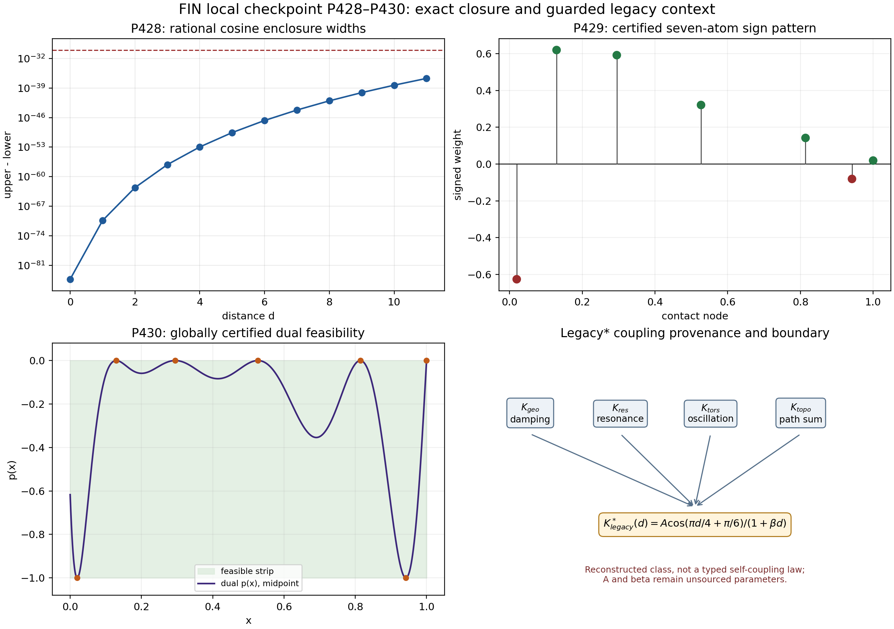

# FIN Local Research Checkpoint P428–P430

## Type-correct cosine reduction, an exact-rational 25-variable Krawczyk certificate, and global dual feasibility

**FIN Research Release 10.36**  
**Creator:** Żuchowski, Krzysztof  
**Affiliation:** Independent Researcher — Fractal Information Theory Project  
**ORCID:** 0009-0002-0909-3613  
**Resource type:** Publication — Preprint  
**Version:** 1.0.0  
**Publication date:** 2026-08-01  
**Language:** English  
**License:** CC BY 4.0

This is a local analytical, formal, and computer-assisted research checkpoint. It contains no laboratory data, external audit, web-derived evidence, or physical validation.

---

## Executive summary

This checkpoint completes the three-program batch P428–P430 and converts the Release-10.35 simultaneous-contact candidate O144 from a floating-point construction into a rigorous, scoped computer-assisted result.

- **P428 — [Proven reduction / Refuted interface / Locally blocked provider].** Lean verifies all twelve FIN-specific rational phase conditions and reduces their cosine bounds to one generic alternating-series provider. The former interface `Rat -> Rat` is mathematically incapable of denoting the ordinary real cosine at nonzero rational arguments. It is replaced by a rational-cut interface `Rat -> CutValue`. The local Lean/Std installation has no real trigonometric analysis library, so the theorem identifying the power series with the usual real cosine is explicit but not proof-kernel compiled.
- **P429 — [Computer-assisted proof].** A 180-decimal Newton refinement followed by exact rational interval arithmetic proves a strict Krawczyk inclusion for all 25 variables of the seven-contact system. The first tested relative box radius, $10^{-20}$, succeeds. The weighted infinity contraction bound is $4.0673\times10^{-11}<1$; all 25 Krawczyk coordinates lie strictly inside the box; the six interior nodes are ordered; and the weight signs are $(-,+,+,+,+,-,+)$. The certified objective box has width $4\times10^{-20}$ around $0.7073534677231137$.
- **P430 — [Computer-assisted proof].** Exact interval curvature treats the six stationary contact neighborhoods, interval monotonicity treats the endpoint contact, and rational Bernstein ranges treat all seven complementary intervals. Every cell is certified. Consequently the unique P429 contact polynomial satisfies
  
  \[
  -1\le p(x)\le0\qquad(0\le x\le1).
  \]
  
  Together with the inherited signed-moment weak-duality theorem, this proves global optimality of the certified primal–dual value in the declared moment problem. It does **not** prove that every global optimizer is identical to this one outside the isolating contact class.

The batch also audits the reconstructed historical kernel

\[
K^*_{\mathrm{legacy}}(d)
=A\frac{\cos(\pi d/4+\pi/6)}{1+\beta d},\qquad A,\beta>0.
\]

This is the research-backed reconstructed legacy class and the fixed-phase subclass of the binding intermediate $K_{\mathrm{legacy,ont}}$. It is not the strict kernel. `DIAGRAMS_KERNEL_TRANSFORMATION.md` contains four coupling mechanisms and two parameter cross-modulations, but it does not define a typed dynamical self-coupling map, feedback equation, or fixed-point law. Its displayed path-exponent and integer-node calculations are algebraically false. Therefore the diagram supplies historical intuition and provenance, not a self-coupling theorem or physical evidence.

No complete legacy-to-strict bridge, physical-role transfer, non-premise selector, canonical orientation, dimensional unit, laboratory realization, total action, Standard Model, gravity theory, or Theory-of-Everything closure is obtained.

---

## 1. Epistemic convention

| Status | Meaning in this checkpoint |
|---|---|
| **[Proven]** | Exact algebra, analytic theorem under explicitly named hypotheses, finite exhaustive result, or proof-kernel result. |
| **[Computer-assisted proof]** | A mathematical theorem whose finite enclosure conditions are checked by deterministic exact or directed interval computation. |
| **[Strong evidence]** | Stable bounded computation without a complete proof certificate. |
| **[Conditional]** | Valid only after a named source, state, reference, calibration, or axiom is supplied. |
| **[Refuted]** | A declared proposition fails in its stated class. |
| **[Blocked locally]** | A required formal library or typed provider is absent from the local environment. |
| **[Blocked by external evidence]** | Independent physical data, traceable calibration, custody, or unblinding is required. |

Floating-point residuals are not theorems. Synthetic records validate software only. Historical statements in local prose are not admitted as external laboratory evidence.

---

## 2. Inherited assumptions and present state map

The kernel split remains binding:

\[
K_{\mathrm{legacy,ont}}(d)
=\alpha_{\mathrm{geo}}
\frac{\cos(\omega_Ld+\phi_L)}{1+\beta_{\mathrm{tors}}d},
\]

\[
K_{\mathrm{strict,gate}}(d)
=\frac{\cos((743/4000)d+13/80)}{1+d^{9/5}}.
\]

The reconstructed $K^*_{\mathrm{legacy}}$ is the fixed-phase legacy subclass

\[
(\alpha_{\mathrm{geo}},\omega_L,\phi_L,\beta_{\mathrm{tors}})
=(A,\pi/4,\pi/6,\beta).
\]

The strict kernel remains a later completed/enriched working object. No silent equality is used.

| Research lane | State before this batch | State after this batch |
|---|---|---|
| Rational cosine arithmetic | Exact at twelve phases | Lean-checked and type-correctly reduced |
| Standard real cosine in Lean | Hidden behind `Rat -> Rat` | Explicit rational-cut provider; local theorem absent |
| O144 contact system | Residual $3.42\times10^{-28}$, severely conditioned | Exact-rational Krawczyk existence and local uniqueness |
| O144 global dual | Sampling/plot only | Global interval Bernstein/curvature certificate |
| O144 objective | Floating midpoint | Enclosed to width $4\times10^{-20}$ |
| Legacy-star provenance | Historical reconstruction and later audits | Explicit coupling/source audit integrated into current frontier |
| Legacy self-coupling | Intuitive language | No typed self-coupling law found in the diagram |
| Selector / QW-2191 | Open | Open |
| Dimensional physics | No internal unit source | Unchanged |
| Laboratory evidence | Absent | Absent |

The ontology remains

\[
\text{nadsoliton}\longrightarrow\text{light}\longrightarrow
\text{matter}\longrightarrow\text{emergent observer},
\]

with no lower informational layer below the nadsoliton.

---

## 3. Reconstructed Legacy* and the coupling diagram

### 3.1 What the local source actually contains

The historical diagram declares

\[
K_{\mathrm{total}}
=K_{\mathrm{geo}}K_{\mathrm{res}}
(1+0.2K_{\mathrm{tors}})K_{\mathrm{topo}},
\]

where the four factors are described as follows.

| Factor | Diagram role | Mathematical form in the source | Audited status |
|---|---|---|---|
| $K_{\mathrm{geo}}$ | viscosity/damping | $e^{-\alpha d}$ | historical mechanism label; no physical source theorem |
| $K_{\mathrm{res}}$ | resonance/phase synchronization | $1+\alpha_{\mathrm{res}}\operatorname{sim}$ | state/similarity law not typed |
| $K_{\mathrm{tors}}$ | oscillatory currents | $\cos(\pi d/4+\pi/6)$ | exact scalar carrier; no selector |
| $K_{\mathrm{topo}}$ | topological/path coupling | path sum, then $1/(1+\beta d)$ | conditional reconstruction |

The source also states the cross-modulations

\[
\alpha_{\mathrm{res,eff}}
=\alpha_{\mathrm{res,base}}e^{-\alpha_{\mathrm{geo}}/2},
\qquad
\beta_{\mathrm{topo,eff}}
=\beta_{\mathrm{topo,base}}(1+0.5|K_{\mathrm{tors}}|).
\]

These formulas are genuine records of a feedback or self-modulation *intuition*. They are not yet a mathematical self-coupling law because the source supplies none of the following:

1. a state space $X$;
2. a self-map $S:X\to X$;
3. a time or iteration variable;
4. an update equation $x_{n+1}=S(x_n)$ or flow equation;
5. a feedback closure condition;
6. a fixed-point, stability, or well-posedness theorem.

Thus the operational classification is **[Conditional]**: cross-modulated factor ansatz, not self-coupled dynamics.

### 3.2 Algebraic falsification inside the source

Two internal calculations fail.

First, the displayed path count and single-path amplitude give

\[
N(d)\sim d^{1.6},\qquad A_{\mathrm{path}}(d)\sim d^{-0.6}
\quad\Longrightarrow\quad
N(d)A_{\mathrm{path}}(d)\sim d^{1.0},
\]

which grows and cannot yield the tail $d^{-1}$ of $1/(1+\beta d)$. To obtain a $d^{-1}$ total tail under the same path-count exponent, the individual path exponent must be $-2.6$, not $-0.6$.

Second,

\[
\cos(\pi d/4+\pi/6)=0
\iff d=\frac43+4n.
\]

The integer sequence $2,5,8,11$ asserted in the diagram is not a zero sequence. This does not refute the cosine carrier; it refutes the displayed node derivation and any physical labeling based solely on those alleged zeros.

### 3.3 Correct current role of Legacy*

Under the historical role assignment and corrected path-sum interpretation, the admissible reconstructed class is

\[
\boxed{
K^*_{\mathrm{legacy}}(d)
=A\frac{\cos(\pi d/4+\pi/6)}{1+\beta d}
}
\]

with $A,\beta>0$. The class is research-backed as a reconstruction of the intended legacy formula. Neither $A$ nor $\beta$ is uniquely generated by the diagram. In particular, $A=2.9$, $A=4\ln2$, $\beta=0.01$, $\beta=0.05$, and $\beta=1$ remain historical freezes, gauges, or comparisons unless a separate source theorem is supplied.

The legacy-star object is relevant to the strict frontier because it exposes the linear hyperbolic envelope, fixed historical phase, and factor provenance. It does not source the strict phase $(743/4000,13/80)$, nonlinear exponent $9/5$, target-independent positive damping scale, selector, physical units, or legacy physical-role transfer.

---

## 4. Program P428 — a type-correct formal cosine boundary

### 4.1 Question and falsification criteria

**Question.** Can the twelve P411 rational Taylor intervals be connected to the ordinary real cosine in the dependency-free local Lean environment?

**Success criterion.** A proof-kernel theorem that the twelve rational intervals enclose standard real cosine, with no FIN-specific analytic axiom.

**Falsification criterion.** A type mismatch, parity reversal, domain violation, or absence of the required real-analysis provider.

### 4.2 The typing obstruction

P411 used an abstract interface of type

```text
Rat -> Rat
```

for cosine. This cannot literally be the usual cosine, because $\cos q$ is generally irrational when $q\in\mathbb Q\setminus\{0\}$. P428 therefore refutes that type as an adequate representation of standard real cosine.

The replacement is the rational-cut object

\[
\operatorname{CutValue}
=(L,U,\operatorname{compat}),
\]

where $L(q)$ and $U(q)$ are predicates asserting that $q$ is respectively a rational lower or upper bound, and compatibility states

\[
L(\ell)\wedge U(u)\Longrightarrow \ell\le u.
\]

A cosine provider now has the type

\[
\operatorname{CosineCutProvider}:\mathbb Q\to\operatorname{CutValue}.
\]

### 4.3 Formal reduction

For the twelve phases

\[
x_d=\frac{743d+650}{4000},\qquad d=0,\ldots,11,
\]

Lean checks exactly that

\[
0\le x_d,\qquad x_d^2<12,
\]

and that the alternating sums

\[
S_n(x)=\sum_{k=0}^{n}(-1)^k\frac{x^{2k}}{(2k)!}
\]

obey

\[
S_{21}(x_d)<S_{20}(x_d),\qquad
S_{20}(x_d)-S_{21}(x_d)<10^{-30}.
\]

The largest actual rational width in the batch is

\[
1.9128718516949603\times10^{-37}.
\]

The theorem `twelve_bounds_from_standard_provider` proves that all twelve FIN bounds follow from one generic provider for $0\le x$, $x^2<12$. This isolates the exact remaining dependency.

### 4.4 Result and boundary

- **[Proven]** All FIN-specific rational side conditions and the dependency reduction compile in Lean 4.28.0.
- **[Refuted]** `Rat -> Rat` is not a type-adequate interface for standard real cosine.
- **[Blocked locally]** No Mathlib or equivalent real trigonometric analysis provider exists in the local repository/toolchain.

This is not a failure of the standard alternating-cosine theorem. It is a formal-dependency boundary: the theorem is standard mathematics but not locally proof-kernel compiled.

---

## 5. Program P429 — exact-rational seven-contact Krawczyk box

### 5.1 The typed system

Let

\[
z=(x_0,\ldots,x_5,w_0,\ldots,w_6,c_0,\ldots,c_{11})\in\mathbb R^{25},
\]

with $x_6=1$, and define

\[
p(x)=\sum_{j=0}^{11}c_jx^j.
\]

The strict moment vector is

\[
m_k=\frac{\cos(743k/4000+13/80)}{1+k^{9/5}},
\qquad k=0,\ldots,11.
\]

The 25 equations are:

\[
\sum_{i=0}^{6}w_ix_i^k=m_k,
\qquad k=0,\ldots,11,
\]

\[
p(x_i)=t_i,
\qquad
(t_0,\ldots,t_6)=(-1,0,0,0,0,-1,0),
\]

and

\[
p'(x_i)=0,qquad i=0,\ldots,5.
\]

This defines a continuously differentiable map $F:\mathbb R^{25}\to\mathbb R^{25}$.

### 5.2 High-precision scouting, not proof

Starting from O144, Newton refinement at 180 decimal digits gives successive maximum residuals

\[
3.4204\times10^{-28},\quad
6.0076\times10^{-73},\quad
8.4790\times10^{-147}.
\]

The double-precision Jacobian estimate has condition number approximately

\[
6.65\times10^{17}.
\]

This severe conditioning is why the residual is used only to locate a box.

### 5.3 Rigorous enclosures

Each moment is enclosed using:

1. exact rational Taylor/Lagrange bounds for cosine;
2. exact rational fifth-root brackets for $k^{1/5}$;
3. exact rational interval propagation for $1/(1+k^{9/5})$.

The center $z_0$ is rounded to a 100-decimal rational vector. The box radii are

\[
r_i=10^{-20}\max(1,|z_{0,i}|).
\]

To avoid expression swell, a 180-digit numerical inverse of $DF(z_0)$ is rounded entrywise to a 70-decimal rational matrix $C$. This does not weaken rigor: $C$ is merely an arbitrary fixed preconditioner, and the exact rational computation uses the rounded matrix itself.

The Krawczyk image is

\[
\mathcal K(z_0,X)
=z_0-CF(z_0)+(I-CDF(X))(X-z_0).
\]

Exact interval arithmetic proves

\[
\mathcal K(z_0,X)\subset\operatorname{int}X.
\]

The weighted infinity contraction estimate is

\[
q=\max_i\sum_j
\sup|\delta_{ij}-(CDF(X))_{ij}|\frac{r_j}{r_i}
\le4.0672647472032875\times10^{-11}<1.
\]

The maximum Krawczyk-image/box width ratio is the same numerical upper bound, and the minimum normalized inclusion margin is

\[
0.9999999999593273.
\]

### 5.4 Certified solution data

The nodes are enclosed around

\[
\begin{aligned}
&0.0198263786851421285,&&0.129422796249122243,\\
&0.295044257239125348,&&0.526692356352776609,\\
&0.814063214510439553,&&0.941844848017407955,\\
&1.
\end{aligned}
\]

The weights are enclosed around

\[
\begin{aligned}
(&-0.626394136883480088,
0.619954368078206096,
0.592116744335684425,\\
&0.321132083364434028,
0.141956488001828879,
-0.0809593308396336302,
0.0190196871332889238).
\end{aligned}
\]

Their signs and the strict node order are certified by the boxes. The objective

\[
\mathcal N_{\mathrm{osc}}=-w_0-w_5
\]

lies in a rational interval of width $4\times10^{-20}$ centered at

\[
0.7073534677231137.
\]

### 5.5 Result and limitation

**[Computer-assisted proof]** The exact moment/contact system has one and only one zero inside the declared 25-dimensional rational box.

The theorem is local to this box. It does not, by itself, prove global dual feasibility or uniqueness among all conceivable global optimizers. P430 supplies feasibility; inherited weak duality supplies global value optimality.

---

## 6. Program P430 — global contact-aware dual feasibility

### 6.1 Why plotting is insufficient

The polynomial has active contacts at both boundaries of the feasible strip. A dense grid can miss an arbitrarily narrow violation. The proof therefore splits $[0,1]$ into contact neighborhoods and their complement.

### 6.2 Six stationary contact neighborhoods

For each of the six interior root boxes, a rational neighborhood of half-width $10^{-4}$ is used.

- At contacts $x_0,x_5$, exact KKT equations give $p(x_i)=-1$. Interval Bernstein evaluation proves $p''>0$, so these are convex local minima and $p\ge-1$. Direct interval evaluation proves the opposite bound $p<0$.
- At contacts $x_1,x_2,x_3,x_4$, exact KKT equations give $p(x_i)=0$. Interval evaluation proves $p''<0$, so these are concave local maxima and $p\le0$. Direct interval evaluation proves $p>-1$.

All six neighborhoods pass. Representative curvature bounds include

\[
1352.81<p''<1367.85\quad\text{near }x_0,
\]

\[
-103.59<p''<-102.64\quad\text{near }x_1,
\]

and

\[
535.26<p''<537.29\quad\text{near }x_5.
\]

### 6.3 Endpoint contact

The KKT equation gives $p(1)=0$. On $[0.9999,1]$, interval Bernstein evaluation gives

\[
29.1457<p'(x)<29.1578.
\]

Thus $p$ increases toward zero and cannot cross above zero. Direct evaluation gives $p>-1$ on the same cell.

### 6.4 Seven noncontact intervals

Power coefficients are transformed exactly to Bernstein coefficients after an affine map of each complementary interval to $[0,1]$. Convex-hull bounds prove strict feasibility on every gap. No subdivision is required: all seven cells pass at depth zero.

The least visually generous upper margins occur adjacent to contacts, but remain strictly negative in exact arithmetic. The full values are stored in `FIN_Programs_428_430_P430_Global_Dual.csv`.

### 6.5 The scoped optimality theorem

**Theorem (computer-assisted, inherited duality assumptions).** Assume the standard real cosine enclosure theorem used by the moment constructor and the signed-measure primal/dual weak-duality theorem established in the P337–P380 chain. Then:

1. the 25-equation system has a unique zero in the P429 isolating box;
2. its signed weights reproduce all twelve strict moments;
3. its polynomial satisfies $-1\le p\le0$ globally on $[0,1]$;
4. the primal and dual objectives agree by contact complementarity;
5. therefore the enclosed value is globally optimal for the declared signed-moment problem.

The theorem does not assert global uniqueness of the optimizing measure outside the certified contact box. It has no direct physical interpretation.



---

## 7. Newly constructed objects

### O155 — Rational-Cut Cosine Provider Interface

| Field | Definition/audit |
|---|---|
| Domain/codomain | $\mathbb Q\to\operatorname{CutValue}$ |
| Definition | rational lower/upper predicates with compatibility |
| Premise | a standard alternating-series cosine provider |
| Transformation law | rational phase maps to its lower/upper cut |
| Generated theorem | all twelve P411 bounds from one provider |
| Necessity | removes the false claim that real cosine is rational-valued |
| Removal test | reverting to `Rat -> Rat` reintroduces the type error |
| Kernel relation | strict moment phases only; no legacy substitution |
| Selector dependence | none; does not select orientation |
| Dimensional status | dimensionless |
| Operational meaning | formal trust boundary, not an apparatus |
| Failure mode | provider absent or used outside its domain |
| Confidence | **[Proven interface/reduction; provider locally blocked]** |

### O156 — Exact-Rational Seven-Contact KKT Isolating Box

| Field | Definition/audit |
|---|---|
| Domain/codomain | rational box $X\subset\mathbb R^{25}$, Krawczyk map $X\to\mathbb{IR}^{25}$ |
| Definition | $K=z_0-CF(z_0)+(I-CDF(X))(X-z_0)$ |
| Premises | moment enclosures; differentiable KKT map; rational preconditioner |
| Transformation law | covariant only under explicitly transformed variables and norms |
| Generated theorem | one unique KKT zero in $X$ |
| Necessity | replaces ill-conditioned floating residual by inclusion/contraction |
| Removal test | without inclusion, O144 remains numerical evidence |
| Kernel relation | built from strict moments; Legacy* is contextual, not input |
| Selector dependence | none |
| Dimensional status | dimensionless |
| Operational meaning | exact optimization certificate, not a measurement |
| Failure mode | inclusion or contraction bound reaches/exceeds one |
| Confidence | **[Computer-assisted proof]** |

### O157 — Contact-Aware Global Dual Certificate

| Field | Definition/audit |
|---|---|
| Domain/codomain | interval polynomial coefficients and contact boxes to a Boolean feasibility certificate |
| Definition | curvature at stationary contacts, monotonicity at $1$, Bernstein hulls on complement |
| Premises | O156 and exact contact equations |
| Transformation law | affine interval maps preserve Bernstein convex-hull bounds |
| Generated theorem | $-1\le p\le0$ on $[0,1]$ |
| Necessity | grid sampling cannot exclude narrow violations |
| Removal test | without global cells, KKT stationarity is not dual feasibility |
| Kernel relation | strict signed-moment dual only |
| Selector dependence | none |
| Dimensional status | dimensionless |
| Operational meaning | global mathematical witness, not physical observation |
| Failure mode | any contact curvature, endpoint, or complement cell fails |
| Confidence | **[Computer-assisted proof]** |

No new self-coupling object is named for the legacy diagram because the required state map and feedback law are absent.

---

## 8. Falsification attempts and failed approaches

### 8.1 Type falsification

The P411 `Rat -> Rat` abstraction was tested against the intended ordinary cosine and rejected. The replacement makes irrational values representable by rational bounds without pretending they are rational numbers.

### 8.2 Conditioning attack

The KKT Jacobian is extremely ill-conditioned in ordinary floating arithmetic. Precision was escalated to 180 decimals; residuals alone were explicitly rejected as proof. Exact interval inclusion and a $q<1$ contraction bound survived this attack.

### 8.3 Preconditioner-rounding attack

Using an exactly inverted 100-decimal rational Jacobian caused severe expression swell on the available Intel i3-10110U/16 GB system. This approach was terminated without result. It was replaced by a theorem-equivalent method: a high-precision numerical inverse was rounded to a fixed rational preconditioner, and the entire Krawczyk map was then evaluated exactly. Because a Krawczyk preconditioner may be arbitrary, no untracked floating error enters the certificate.

### 8.4 Global-grid attack

A dense plot was not accepted. Direct interval evaluation over large regions can overestimate near active contacts, so P430 separates contact geometry from noncontact Bernstein cells. The proof succeeds without recursive subdivision.

### 8.5 Legacy diagram attack

The coupling diagram was treated as a source to falsify, not an authority. Its path exponent and node sequence fail exact algebra. Its cross-modulation expressions survive only as an ansatz-level self-coupling intuition.

### 8.6 Alternative explanations

The P429/P430 object may be understood entirely as an extremal solution of a finite signed-moment problem. Its existence does not establish a physical particle, field, entropy law, observer mechanism, or laboratory channel. This simpler mathematical explanation remains sufficient.

---

## 9. Numerical and formal reproducibility

The computation is deterministic. Repeated runs produced byte-identical JSON and CSV outputs.

| Component | Method |
|---|---|
| P428 side conditions | exact Lean rational arithmetic and `native_decide` |
| P428 numerical reflection | Python `Fraction` alternating sums |
| P429 root location | 180-decimal `mpmath` Newton iteration |
| P429 moment intervals | exact fractions, cosine Taylor/Lagrange enclosure, exact fifth-root brackets |
| P429 preconditioner | 70-decimal rational rounding of 180-digit inverse |
| P429 inclusion | exact `Fraction` interval Krawczyk map |
| P429 uniqueness | exact weighted infinity contraction bound $q<1$ |
| P430 contacts | exact rational interval curvature/value bounds |
| P430 endpoint | exact rational interval derivative/value bounds |
| P430 complement | exact affine power-to-Bernstein transformation |
| Regression suite | 8 unit tests plus inherited P411–P427 and Checkpoint-000 tests |

The local formal boundary is unchanged: Lean/Std contains no standard real cosine library and no local Mathlib. No dependency was downloaded.

---

## 10. Kernel split, selector, dimensions, and operational physics

### 10.1 Kernel split

P428–P430 use strict moments. Legacy* appears only in the provenance audit. Neither kernel is substituted for the other. The legacy-to-strict completion still lacks source-independent phase/frequency, nonlinear compression, amplitude/damping, selector, and unit data. Physical-role transfer remains downstream and blocked.

### 10.2 Selector

All three new objects are orientation-neutral mathematical certificates. They do not distinguish $+1$ from $-1$ on the $\mathbb Z_{12}$ orientation torsor. QW-2191 remains open. The inversion-even radial Legacy* kernel also cannot supply a non-premise directed selector.

### 10.3 Dimensions

Every phase, moment, node, weight, polynomial coefficient, and time parameter in this checkpoint is dimensionless. No action, length, time, mass, or energy unit is internally generated. A numerical scale is not a physical unit.

### 10.4 Dual dynamics and observer boundary

For a self-adjoint $A$,

\[
U_t=e^{-itA},\qquad P_t=e^{-tA}
\]

remain two functions of one spectral measure. This explains mathematical wave/heat duality but provides none of the operational objects required for physics: state, preparation, calibrated clock, reference frame, environment, instrument, apparatus response, measurement record, custody, or hold-out unblinding.

### 10.5 Physical boundary

No data in this checkpoint are laboratory data. The old diagram's references to measurements, Wilson loops, or percentage accuracy are internal historical claims and are not admitted as physical evidence. The results prove a mathematical optimization statement only.

---

## 11. What has and has not changed

The batch materially strengthens the mathematical core:

1. the cosine trust interface is now correctly typed;
2. the seven-contact system has certified local existence and uniqueness;
3. the associated dual is globally feasible;
4. the declared signed-moment optimum has a certified value enclosure;
5. Legacy* is integrated with explicit provenance and self-coupling boundaries.

It does not change the physical status of FIN. The deepest surviving interpretation remains a finite spectral/operator and signed-moment framework with exact functional calculus, optimization certificates, and operational interfaces that still require an external state/apparatus/unit/record extension before they can be interpreted as experimentally testable physics.

---

## 12. Ranked next local research programs

The next checkpoint should contain the bounded batch P435, P436, and P440. No external gate will be simulated as evidence.

| Rank | Program | Decisive local output | Estimated chance of decisive result |
|---:|---|---|---:|
| 1 | **P436** | Rigorous interval or analytic certification of at least one positive O149 erasure-code gain cell | 0.82 |
| 2 | **P440** | Detector- and finite-sample-aware optimal JSR estimator, with nuisance-model minimax or obstruction | 0.70 |
| 3 | **P435** | Genuine noisy-comb SDP primal/dual certificate on one nonideal cell, or a reproducibility obstruction if no suitable local solver exists | 0.62 |
| 4 | P432 | Exactly one complete-Bernstein/subordination damping-source class | 0.58 |
| 5 | P442 | Representation-independence audit of O153 oriented record current | 0.57 |
| 6 | P433 | Interval cover of one nontrivial photonic chart | 0.54 |
| 7 | P431 | Formal Lindemann–Weierstrass provider | 0.10 locally; no suitable library is present |

The first action in the next batch is a cheap dependency and invariant audit. An expensive SDP or minimax calculation begins only after its exact proposition and available local solver path are known.

---

## 13. Artifact inventory

- `FIN_Local_Research_Checkpoint_P428_P430_EN.md`
- `FIN_Local_Research_Checkpoint_P428_P430_EN.tex`
- `FIN_Local_Research_Checkpoint_P428_P430_EN.pdf`
- `FIN_Current_Local_Research_Report_EN.pdf`
- `RELEASE_10_36_PROGRAMS_428_430.md`
- `FIN_Programs_428_430_Results.json`
- `FIN_Programs_428_430_Summary.csv`
- `FIN_Programs_428_430_P428_Cosine.csv`
- `FIN_Programs_428_430_P429_Krawczyk.csv`
- `FIN_Programs_428_430_P430_Global_Dual.csv`
- `FIN_Programs_428_430_LegacyStar_Coupling_Audit.csv`
- `FIN_Programs_428_430_P428_Cosine_Reduction.lean`
- `FIN_Programs_428_430_Figures/p428_p430_exact_closure_and_legacy_context.png`
- `fin_programs_428_430.py`
- `test_fin_programs_428_430.py`
- `FIN_PROGRAMS_428_430_RELEASE_MANIFEST.sha256`
- `FIN_GOAL_STATE.md`
- `AGENTS.md` checkpoint guardrail

---

## 14. Restart instructions

From the repository root:

```bash
MPLCONFIGDIR=/tmp/fin-mpl-cache python3 fin_programs_428_430.py
.elan/toolchains/leanprover--lean4---v4.28.0/bin/lean FIN_Programs_428_430_P428_Cosine_Reduction.lean
MPLCONFIGDIR=/tmp/fin-mpl-cache python3 -m unittest -v test_fin_programs_428_430.py
lualatex -interaction=nonstopmode -halt-on-error FIN_Local_Research_Checkpoint_P428_P430_EN.tex
lualatex -interaction=nonstopmode -halt-on-error FIN_Local_Research_Checkpoint_P428_P430_EN.tex
sha256sum -c FIN_PROGRAMS_428_430_RELEASE_MANIFEST.sha256
```

Then inspect the current state map and begin only the bounded P435/P436/P440 batch. Preserve the local-only rule, kernel split, QW-2191 boundary, dimensional boundary, and external-evidence gates.

---

## Conclusion

The O144 seven-contact construction survives its decisive falsification tests. It is no longer merely a beautiful floating-point pattern: within a declared rational box it has exact existence, local uniqueness, certified signs and ordering, and a globally feasible dual polynomial. The resulting optimum is a rigorous computer-assisted theorem for the declared dimensionless signed-moment problem.

The same rigor rejects overinterpretation. The reconstructed Legacy* kernel is a legitimate intermediate historical mathematical class, but its diagram supplies neither a typed self-coupling dynamics nor a source theorem for its free parameters. The strict/legacy bridge, selector, dimensions, operational apparatus, and empirical physics remain separate unsolved interfaces.
