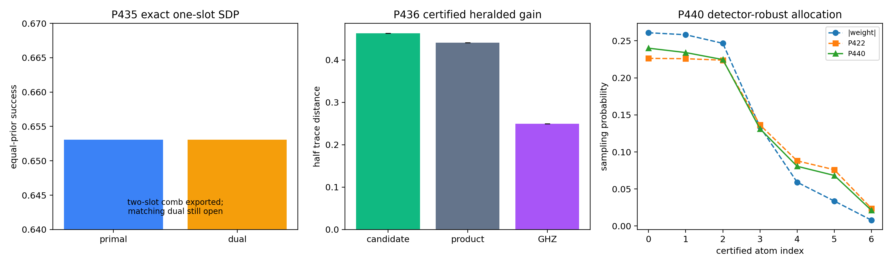

# FIN Local Research Checkpoint P435--P440

## Exact process-tester admission, a certified heralded-code gain, and detector-envelope minimax Jordan sampling

**Creator:** Żuchowski, Krzysztof  
**Affiliation:** Independent Researcher -- Fractal Information Theory Project  
**ORCID:** 0009-0002-0909-3613  
**Resource type:** Publication -- Preprint  
**Version:** 1.0.0  
**Release:** FIN Research Release 10.37  
**Publication date:** 2026-08-01  
**Language:** English  
**License:** CC BY 4.0

This is a local analytical and computer-assisted research checkpoint. It uses no laboratory data, external audit, internet resource, remote computation, or physical validation.

# 1. Executive summary

This checkpoint executes the bounded local batch P435, P436, and P440.

- **P435 -- [Proven / Constructed / Blocked locally].** For the reduced nonideal phase-dephasing channel with coherence (q=4/5) and phase (	heta=pi/8), an exact one-slot process-tester semidefinite program has matching primal and dual value

$$
p_{mathrm{succ}}^{(1)}
=\frac{1+\frac45\sin(\pi/8)}2
=0.653073372946036\ldots.
$$

  The genuine two-slot memoryless comb, its tester primal, and its dual are constructed explicitly. Its causality residual is zero in finite arithmetic. The inherited feasible half-distance is (0.45254833995939053), while the hybrid upper bound is (0.6122934917841437), leaving success-probability gap (0.07987257591237659). No local SDP solver or independent certificate checker is installed, so no matching two-slot certificate is claimed.

- **P436 -- [Computer-assisted proof].** A rationalized member of the P418 heralded-erasure-aware code family,

$$
p=\frac1{250000}(56923,68077,68077,56923),
$$

  is proved to beat both the product and GHZ baselines at

$$
n=3,\qquad q=\eta=\frac45,\qquad \theta=\frac{2\pi}{15}.
$$

  Exact rational interval arithmetic gives

$$
\begin{aligned}
D_{\mathrm{candidate}}&\in
[0.46327828319203235,0.46327828319203362],\\
D_{\mathrm{product}}&\in
[0.44070550717062451,0.44070550717062668],\\
D_{\mathrm{GHZ}}&\in
[0.24931375940767625,0.24931375940767719].
\end{aligned}
$$

  Therefore the certified gain over the better baseline is at least

$$
0.022572776021405654.
$$

  This turns the existence of a positive O149 gain in one declared cell from numerical evidence into a scoped theorem. It does not prove global code optimality or adaptive-comb optimality.

- **P440 -- [Proven conditional theorem / Computed design].** For a supplied detector model with efficiency, independently subtracted dark counts, and a declared nuisance envelope, the minimax unbiased Jordan-sampling law is

$$
q_i^\star\propto
|w_i|\,\|f_i\|_2
\sqrt{
\frac1{\underline\epsilon_i}
+\frac{\overline d_i(1-\overline d_i)}{\underline\epsilon_i^2}
}.
$$

  On the P429 certified seven-atom midpoint this reduces the worst declared mean-square-error coefficient by (7.4591\%) relative to absolute-weight sampling and by (0.3401\%) relative to P422's detector-blind spectral-radius law. A conservative twelve-coordinate Hoeffding ledger requires (1,909,937) attempts for simultaneous coordinate tolerance (0.02) at familywise error (0.05). That large number is a warning about bounded-range certification, not a prediction for an apparatus.

The strongest result is P436. The most important failed expectation is that installing no additional dependency would nevertheless yield a matching multiround comb dual: it does not. The exact one-slot result validates the formulation, but the two-slot optimum remains open.

No complete legacy-to-strict bridge, physical-role transfer, non-premise selector, canonical orientation, dimensional unit, laboratory realization, total action, Standard Model, gravity theory, or Theory-of-Everything closure is obtained.

# 2. Epistemic convention

| Status | Meaning here |
|---|---|
| [Proven] | Exact algebra or an analytic theorem under explicit hypotheses. |
| [Computer-assisted proof] | A finite theorem checked by deterministic exact or enclosing computation. |
| [Constructed] | A typed mathematical instance or executable specification exists, without a claimed optimum. |
| [Strong evidence] | Stable bounded numerical evidence without a complete certificate. |
| [Conditional] | Valid only after the named model, calibration, state, or reference is supplied. |
| [Refuted] | The declared proposition fails in its stated class. |
| [Blocked locally] | A needed local formal or numerical provider is absent; this is not a mathematical no-go. |
| [Blocked by external evidence] | Laboratory data, traceable calibration, custody, or independent unblinding is required. |

Floating-point residuals are not theorems. Synthetic envelopes and records validate mathematics or software only. They are not physical observations.

# 3. Inherited assumptions and state map

The binding kernel split is preserved:

$$
K_{\mathrm{legacy,ont}}(d)
=\alpha_{\mathrm{geo}}
\frac{\cos(\omega_Ld+\phi_L)}{1+\beta_{\mathrm{tors}}d},
$$

$$
K_{\mathrm{strict,gate}}(d)
=\frac{\cos(\omega_Sd+\phi_S)}{1+\beta d^\eta}.
$$

The reconstructed research-backed historical class

$$
K^*_{\mathrm{legacy}}(d)
=A\frac{\cos(\pi d/4+\pi/6)}{1+\beta d}
$$

is a fixed-phase subclass of the intermediate legacy kernel, not the strict kernel. The coupling intuition in `DIAGRAMS_KERNEL_TRANSFORMATION.md` remains historical source material; P435--P440 neither supplies its missing typed self-map nor transfers a physical role from it.

| Lane | State before | Result after this checkpoint |
|---|---|---|
| Reduced one-slot phase/dephasing tester | Exact state distance known | Exact primal and dual SDP certificate |
| Two-slot noisy comb | Feasible lower and hybrid upper | Genuine comb instance and SDP exported; optimum still open |
| P418 erasure-aware code | Numerical gain in 16 cells | One positive three-use gain rigorously certified |
| P422 Jordan sampler | Detector-blind exact variance law | Conditional detector-envelope minimax extension |
| Finite-sample Jordan ledger | Missing | Uniform supplied-model Hoeffding bound |
| P429 signed atoms | Certified contact box and global dual feasibility | Used as bounded estimator-design input; not physical atoms |
| Selector / QW-2191 | Open | Open |
| Dimensional physics | No internal unit source | Unchanged |
| Laboratory evidence | Absent | Absent |

The internal ontology remains

$$
\text{nadsoliton}\longrightarrow\text{light}\longrightarrow
\text{matter}\longrightarrow\text{emergent observer},
$$

with no lower informational layer beneath the nadsoliton.

# 4. P435 -- process-tester SDP admission

## 4.1 Exact question and success criterion

The question was whether the P417 reduced phase/dephasing discrimination problem could be expressed as a genuine process-tester SDP and supplied with a matching primal and dual certificate locally.

The primary success criterion was a matching nonideal multiround certificate within (10^{-4}). A secondary admission criterion was an exact one-slot certificate plus a complete two-slot instance and a reproducibility diagnosis if the multiround solver layer was absent.

## 4.2 Declared channel

For sign (s\in\{+1,-1\}), define

$$
\mathcal E_s
\begin{pmatrix}a&b\\c&d\end{pmatrix}
=
\begin{pmatrix}
a&q e^{-is\theta}b\\
q e^{is\theta}c&d
\end{pmatrix}.
$$

Its unnormalized Choi matrix in output--input order is supported on

$$
\operatorname{span}\{|00\rangle,|11\rangle\}
$$

and equals

$$
J_s=
|00\rangle\langle00|+|11\rangle\langle11|
+q e^{-is\theta}|00\rangle\langle11|
+q e^{is\theta}|11\rangle\langle00|.
$$

It satisfies (J_s\succeq0) and

$$
\operatorname{Tr}_{Y}J_s=I_X.
$$

## 4.3 One-slot primal and dual

For equal priors, the process-tester primal is

$$
\begin{aligned}
\text{maximize}\quad &
\frac12\langle T_+,J_+\rangle
+\frac12\langle T_-,J_-\rangle,\\
\text{subject to}\quad &T_+,T_-\succeq0,\\
&T_++T_-=I_Y\otimes\rho^T,\\
&\rho\succeq0,\quad\operatorname{Tr}\rho=1.
\end{aligned}
$$

The dual can be written

$$
\begin{aligned}
\text{minimize}\quad &\lambda,\\
\text{subject to}\quad &Y\succeq J_+/2,\quad Y\succeq J_-/2,\\
&\operatorname{Tr}_Y Y\preceq\lambda I_X.
\end{aligned}
$$

Choose (
ho=|+\rangle\langle+|) and use the Helstrom measurement in the
(sigma_y) basis. The tester elements are

$$
T_\pm=\frac{I\pm\sigma_y}{2}\otimes\rho^T.
$$

For the dual choose the common upper bound

$$
Y=\frac14\left(J_++J_-+|J_+-J_-|\right).
$$

Because

$$
|J_+-J_-|
=2q|\sin\theta|P_{\{|00\rangle,|11\rangle\}},
$$

one obtains

$$
\operatorname{Tr}_Y Y
=\frac{1+q|\sin\theta|}{2}I_X.
$$

Weak duality and equality of the displayed values prove

$$
p_{\mathrm{succ}}^{(1)}
=\frac{1+q|\sin\theta|}{2}.
$$

At (q=4/5), (	heta=\pi/8), all recorded normalization and causality defects are zero to construction tolerance; the floating residuals of the PSD boundary are below (1.5\times10^{-16}). The theorem itself is algebraic and does not depend on these residuals.

## 4.4 Genuine two-slot comb

In chronological order (Y_2X_2Y_1X_1), define

$$
R_s=J_s\otimes J_s.
$$

The two-outcome tester is described by (T_+,T_-\succeq0), an intermediate normalization operator (B_2\succeq0), and (
ho\succeq0):

$$
\begin{aligned}
T_++T_-&=I_{Y_2}\otimes B_2,\\
\operatorname{Tr}_{X_2}B_2&=I_{Y_1}\otimes\rho,\\
\operatorname{Tr}\rho&=1.
\end{aligned}
$$

This permits arbitrary admissible memory and adaptive control between the two channel calls. Its dual variables (Y,Z,\lambda) obey

$$
\begin{aligned}
Y&\succeq R_+/2,\qquad Y\succeq R_-/2,\\
\operatorname{Tr}_{Y_2}Y&\preceq I_{X_2}\otimes Z,\\
\operatorname{Tr}_{Y_1}Z&\preceq\lambda I_{X_1}.
\end{aligned}
$$

The exported instance has process dimension (16), 580 real primal variables before equalities, and 273 real dual variables before inequality reduction. Both comb causality defects are exactly zero in the generated finite instance.

## 4.5 Failure and boundary

The local Python environment contains none of `cvxpy`, `cvxopt`, `clarabel`, or `scs`. No network installation is permitted. A nonlinear pure-state optimizer cannot be relabelled as a comb SDP, and the hybrid telescoping bound is not a matching dual witness.

The declared two-slot cell therefore remains

$$
0.45254833995939053
\le D_2^{\mathrm{adaptive}}
\le0.6122934917841437.
$$

This is a local reproducibility obstruction, not proof that a matching certificate does not exist.

# 5. P436 -- certified heralded-erasure code gain

## 5.1 Exact question

Does at least one P418 numerical gain survive rationalization, exact heralded partial traces, transcendental enclosures, exact spectral root isolation, and perturbation accounting?

The falsification criterion was immediate: if the candidate lower enclosure did not exceed both baseline upper enclosures, the claimed gain would remain only numerical evidence.

## 5.2 Symmetric input and channel

For (n=3) and sector law (p=(p_0,p_1,p_2,p_3)), define

$$
|\psi(p)\rangle
=\sum_{z\in\{0,1\}^3}
\sqrt{\frac{p_{|z|}}{\binom3{|z|}}}|z\rangle.
$$

Independent dephasing multiplies a matrix entry by (q^{d_H(a,b)}). The two hypotheses apply phases (e^{\pm i\theta |z|}). For each heralded survivor set (S), the lost factors are traced out exactly:

$$
\rho_S^\pm
=\operatorname{Tr}_{S^c}\rho^\pm.
$$

Because survivor patterns form orthogonal classical blocks,

$$
D_{3,\eta,q}(p)
=\sum_{S\subseteq\{1,2,3\}}
\eta^{|S|}(1-\eta)^{3-|S|}
\frac12\|\rho_S^+-\rho_S^-\|_1.
$$

For a fixed survivor count (r), permutation symmetry makes every block equal. The difference is (iK_r), where (K_r) is a real skew-symmetric (2^r\times2^r) matrix. Hence

$$
\frac12\|\rho_S^+-\rho_S^-\|_1
=\frac12\|K_r\|_*.
$$

## 5.3 Exact enclosure chain

The certificate uses only local deterministic operations:

1. Machin's identity

$$
\pi=16\arctan(1/5)-4\arctan(1/239)
$$

with alternating rational series gives a (pi)-interval of width below (3.52\times10^{-86}).

2. Alternating sine series enclose every required

$$
\sin(2m\pi/15),\qquad |m|\le3.
$$

3. Integer square-root bracketing encloses all amplitudes

$$
\sqrt{\frac{p_ap_b}{\binom3a\binom3b}}.
$$

4. Exact finite sums produce interval matrices (K_r\in[K_r^-,K_r^+]).

5. Each interval matrix is rounded to a rational midpoint (K_{r,0}). The polynomial of (K_{r,0}^TK_{r,0}) is computed exactly and all roots are isolated by exact rational intervals.

6. Square-root intervals give the midpoint nuclear norm. If every entry remainder has magnitude at most (delta_r), then

$$
\frac12\big|\|K_r\|_*-\|K_{r,0}\|_*\big|
\le\frac12\|K_r-K_{r,0}\|_*
\le\frac12(2^r)^2\delta_r.
$$

The final inequality is deliberately conservative.

## 5.4 Certified result

Use

$$
p_{\mathrm{cert}}
=\left(\frac{56923}{250000},
\frac{68077}{250000},
\frac{68077}{250000},
\frac{56923}{250000}\right).
$$

It is an exact probability vector. At (q=\eta=4/5), (	heta=2\pi/15), the final intervals are:

| Law | Certified half-distance interval |
|---|---:|
| Rational O149 candidate | [0.46327828319203235, 0.46327828319203362] |
| Product law ((1,3,3,1)/8) | [0.44070550717062451, 0.44070550717062668] |
| GHZ law ((1,0,0,1)/2) | [0.24931375940767625, 0.24931375940767719] |

Thus

$$
D(p_{\mathrm{cert}})
-\max\{D(p_{\mathrm{product}}),D(p_{\mathrm{GHZ}})\}
>0.022572776021405654.
$$

## 5.5 What was and was not falsified

The positive gain survived:

- replacement of the SLSQP vector by a six-decimal rational law;
- exact normalization;
- exact enumeration of all herald patterns;
- rigorous (pi), sine, and square-root intervals;
- exact characteristic-polynomial root isolation;
- explicit nuclear-norm perturbation allowance;
- comparison against upper, not midpoint, baseline values.

It remains possible that another symmetric code, an asymmetric code, an ancilla-assisted input, or an adaptive strategy is better. P436 proves strict improvement over two named baseline families only.



# 6. P440 -- detector-envelope minimax Jordan sampling

## 6.1 Typed detector model

Let the signed atomic moment representation be

$$
m=\sum_{i=0}^6w_if_i,\qquad
f_i=(1,x_i,\ldots,x_i^{11})^T.
$$

At atom (i), suppose a supplied calibration declares independent variables

$$
B_i\sim\operatorname{Bernoulli}(\epsilon_i),\qquad
D_i\sim\operatorname{Bernoulli}(d_i),
$$

and the dark mean is subtracted:

$$
X_i=B_i+D_i-d_i.
$$

When atom (I=i) is selected with probability (q_i), define the vector estimator

$$
Z=\frac{w_i f_i X_i}{q_i\epsilon_i}.
$$

Then

$$
\mathbb E Z=\sum_iw_if_i=m.
$$

This is a mathematical detector-response model. It does not assert that a real detector has been calibrated to it.

## 6.2 Mean-square error

Since

$$
\mathbb E X_i^2
=\epsilon_i+d_i(1-d_i),
$$

define

$$
h_i(\epsilon_i,d_i)
=\frac{\mathbb E X_i^2}{\epsilon_i^2}
=\frac1{\epsilon_i}
+\frac{d_i(1-d_i)}{\epsilon_i^2}.
$$

For (N) independent attempts,

$$
N\,\mathbb E\|\widehat m_N-m\|_2^2
=\sum_i\frac{w_i^2\|f_i\|_2^2h_i}{q_i}
-\|m\|_2^2.
$$

## 6.3 Minimax nuisance envelope

P440 declares the transparent synthetic envelope

$$
\underline\epsilon_i=0.65+0.25x_i,
\qquad
\overline\epsilon_i=\min(0.99,\underline\epsilon_i+0.05),
$$

$$
0\le d_i\le\overline d_i
=0.01+0.02(1-x_i).
$$

For (d\le1/2), (h_i) decreases with (epsilon) and increases with (d). Its worst value is therefore

$$
\overline h_i
=\frac1{\underline\epsilon_i}
+\frac{\overline d_i(1-\overline d_i)}{\underline\epsilon_i^2}.
$$

Cauchy--Schwarz gives

$$
\left(\sum_i\frac{a_i}{q_i}\right)
\left(\sum_iq_i\right)
\ge\left(\sum_i\sqrt{a_i}\right)^2,
$$

with equality at (q_i\propto\sqrt{a_i}). Taking

$$
a_i=w_i^2\|f_i\|_2^2\overline h_i
$$

proves the minimax law

$$
q_i^\star
=\frac{|w_i|\|f_i\|_2\sqrt{\overline h_i}}
{\sum_j|w_j|\|f_j\|_2\sqrt{\overline h_j}}.
$$

## 6.4 Numerical design on the certified P429 atoms

The worst declared one-attempt MSE coefficients are:

| Allocation | Worst coefficient |
|---|---:|
| Absolute-weight (q_i\propto|w_i|) | 10.393243449520375 |
| P422 spectral-radius law | 9.650823955540265 |
| P440 detector-envelope minimax law | 9.618004785993307 |

The P440 improvement is (7.4590638\%) over absolute-weight allocation and (0.3400660\%) over P422. The modest incremental gain over P422 is itself informative: the declared detector envelope perturbs, but does not radically reorganize, the spectral-radius design.

## 6.5 Finite-sample confidence ledger

For each coordinate (k=0,\ldots,11), enumerate the extremes of

$$
\frac{w_ix_i^k}{q_i\epsilon_i}(B_i+D_i-d_i)
$$

over (B_i,D_i\in\{0,1\}), (d_i\in[0,\overline d_i]), and (epsilon_i\ge\underline\epsilon_i). The largest coordinate range is

$$
W_{\max}=15.731809400877701.
$$

A coordinatewise Hoeffding bound plus a union bound over twelve coordinates gives

$$
\Pr\left[
\max_{0\le k\le11}|\widehat m_{N,k}-m_k|>t
\right]
\le24\exp\left(-\frac{2Nt^2}{W_{\max}^2}\right).
$$

For (t=0.02), familywise error (0.05), a sufficient value is

$$
N\ge1,909,937.
$$

This is deliberately conservative. It exposes the cost of a distribution-free bounded-range guarantee. A sharper empirical-Bernstein result would require either a supplied variance budget or observed data, which are not present.

# 7. Newly constructed objects

## 7.1 O158 -- Process-Tester SDP Admission Certificate

- **Domain/codomain:** a pair of finite CPTP Choi operators and equal priors to a primal tester, dual upper operator, and certified success interval.
- **Definition:** the primal/dual systems in Sections 4.3--4.4.
- **Premises:** finite Hilbert spaces, known Choi matrices, declared channel order, and an SDP proof provider for more than one slot.
- **Transformation law:** invariant under simultaneous unitary change of input/output bases and corresponding tester conjugation.
- **Generated theorem:** exact one-slot optimum; typed multiround optimization interface.
- **Necessity/removal test:** deleting tester normalization permits noncausal measurements and probabilities above one; deleting the dual removes certified upper bounds.
- **Kernel relation:** kernel-split robust after a reduced operational channel has been separately declared; it derives neither kernel.
- **Selector/dimension:** no selector and no physical clock or unit are generated.
- **Operational interpretation:** mathematical discrimination protocol, not apparatus.
- **Failure mode:** absence of a solver/checker leaves the multiround optimum open.
- **Status:** [Proven] for one slot; [Constructed / Blocked locally] for two slots.

## 7.2 O159 -- Rational Heralded-Code Gain Certificate

- **Domain/codomain:** a rational Hamming-sector probability law and rational noise parameters to an interval for the herald-record trace distance.
- **Definition:** exact partial traces followed by rational transcendental and spectral enclosures.
- **Premises:** independent dephasing, independent heralded survival, orthogonal survivor labels, and the supplied dimensionless phase.
- **Transformation law:** invariant under permutations of the three uses.
- **Generated theorem:** strict gain over product and GHZ in one cell.
- **Necessity/removal test:** removing herald labels replaces a direct sum by a mixture and invalidates the distance sum; removing interval spectral verification returns the claim to floating evidence.
- **Kernel relation:** independent of the legacy/strict choice once the reduced phase channel is supplied.
- **Selector/dimension:** no orientation selector or physical unit.
- **Operational interpretation:** feasible mathematical code under the declared channel.
- **Failure mode:** correlated loss, unheralded loss, phase-reference error, or a different channel lies outside the theorem.
- **Status:** [Computer-assisted proof].

## 7.3 O160 -- Detector-Envelope Minimax Jordan Sampler

- **Domain/codomain:** signed atoms, moment features, and detector nuisance intervals to an optimal sampling simplex point and confidence ledger.
- **Definition:** the law in Section 6.3.
- **Premises:** supplied calibration, independent Bernoulli signal/dark model, correct dark-mean subtraction, and independent attempts.
- **Transformation law:** invariant under a common orthogonal change of moment coordinates; changes under reweighting the loss.
- **Generated theorem:** minimax one-attempt MSE in the declared envelope.
- **Necessity/removal test:** without efficiency correction the estimator is biased; without the detector factor the law reduces to P422 and is not minimax for heterogeneous responses.
- **Kernel relation:** it consumes a signed atomic representation; it neither selects nor physically realizes one.
- **Selector/dimension:** absolute weights remove sign from allocation; no selector or unit arises.
- **Operational interpretation:** apparatus-aware design template conditional on calibration.
- **Failure mode:** dependent counts, drifting response, incorrect dark subtraction, or zero efficiency.
- **Status:** [Proven conditional theorem / Computed design].

# 8. Adversarial audit and failed approaches

1. **Relabelling a nonlinear search as SDP -- rejected.** P417's SLSQP lower bounds remain feasible strategies only.
2. **Promoting the hybrid telescoping upper bound to a matching dual -- rejected.** It leaves a nonzero two-slot success gap.
3. **Installing a solver from the network -- not permitted.** Dependency absence is recorded instead of silently changing the research rules.
4. **Calling the P418 optimizer itself rigorous -- rejected.** P436 replaces one output by a rational probability law and encloses every downstream operation.
5. **Comparing interval midpoints -- rejected.** The proof compares the candidate lower endpoint with the maximum baseline upper endpoint.
6. **Using only the upper dark-count endpoint in Hoeffding ranges -- falsified during implementation.** The largest positive outcome occurs at (d=0) in some sign branches. Both nuisance endpoints are now enumerated; the sufficient attempt count increased from a preliminary (1,855,850) to (1,909,937).
7. **Interpreting the detector envelope as calibration -- rejected.** It is a synthetic design assumption.
8. **Inferring physical wave/heat duality -- rejected.** Nothing in this checkpoint supplies state preparation, physical time, apparatus, environment, instrument, or event record.

# 9. Legacy/strict, selector, dimensional, and physical audit

The three programs operate downstream of a declared finite channel or signed atomic measure. They are therefore **kernel-split robust in their theorem form**, but they do not prove that either the legacy or strict kernel is physically implemented by that channel.

The reconstructed (K^*_{\mathrm{legacy}}) remains the proper research-backed legacy class and intermediate bridge object. P435--P440 do not modify its free (A,\beta), do not complete it to (K_{\mathrm{strict,gate}}), and do not validate the coupling labels in the historical diagram as physical interactions.

QW-2191 remains open. O158 is basis-covariant, O159 is permutation-invariant, and O160 uses absolute weights in its allocation. None selects (+1) over (-1), a phase origin, or an orientation.

All phases, times, efficiencies, dark probabilities, and sample tolerances in this checkpoint are dimensionless supplied quantities. No action, time, length, mass, energy, Boltzmann constant, Planck constant, SI calibration, or scale anchor is generated.

Consequently:

- a mathematical channel is not a laboratory apparatus;
- a herald label is not an observed detector record unless supplied externally;
- a detector model is not detector calibration;
- a confidence formula is not an experiment;
- mathematical information is not automatically thermodynamic entropy.

# 10. Explicit nonclaims

This checkpoint does not claim:

- a solved two-slot or multiround noisy comb;
- a full twelve-mode FIN discrimination optimum;
- global optimality of O159 among all codes;
- experimental feasibility or a measured code advantage;
- a physical detector law or event count;
- selector closure or canonical chirality;
- a source of dimensional units;
- completion or physical-role transfer between legacy and strict kernels;
- Standard Model, gravity, (L_{\mathrm{total}}), or Theory-of-Everything closure.

# 11. Recommended next programs

| Rank | Program | Exact study | Decisive output | Probability |
|---:|---|---|---|---:|
| 1 | P445 | Symmetry reduction of the two-slot qubit comb | Dependency-free reduced SDP or exact analytic dual closing the (0.07987) success gap | 0.72 |
| 2 | P446 | Global simplex certificate for the (n=3) heralded code | Interval branch-and-bound proving O159 global in the symmetric simplex, or a better rational witness | 0.68 |
| 3 | P447 | Interval propagation of the complete P429 atom boxes through O160 | Certified ranges for all seven allocations and MSE reductions | 0.64 |
| 4 | P448 | Covariance-weighted detector minimax law | Exact optimizer for a supplied non-diagonal twelve-moment loss | 0.61 |
| 5 | P449 | Drift-robust detector model | Minimax law under bounded temporal response drift, or an identifiability no-go | 0.58 |
| 6 | P450 | Representation-independence audit of the signed sampler | Determine which O160 statements survive alternative Jordan representations | 0.55 |
| 7 | P451 | Four-use rational heralded witness | Certified gain in the largest P418 cell without claiming global optimality | 0.53 |
| 8 | P452 | One complete-Bernstein damping source class | Exact source theorem or no-go for one declared class only | 0.50 |
| 9 | P453 | Nontrivial photonic chart interval cover | Certified local injectivity box or explicit compensating alias | 0.46 |
| 10 | P454 | Catalytic phase-reference accounting | Exact consumed/recovered asymmetry rate with polarity nonpromotion theorem | 0.44 |
| 11 | P455 | Full twelve-mode two-use feasible strategies | Certified lower atlas with explicit comparison to the reduced two-mode face | 0.39 |
| 12 | P456 | Formal real-cosine provider | Kernel-checked analytic provider for the P428 rational-cut interface | 0.34 |

The preferred next batch is

$$
\boxed{P445\to P446\to P447.}
$$

P445 first attempts to remove the local SDP dependency by exploiting the support and conjugation symmetries of the exact comb. P446 attacks the remaining optimality boundary around the strongest certified constructive result. P447 makes the detector allocation inherit the full P429 enclosures instead of their midpoints.

# 12. Artifacts

- `FIN_Local_Research_Checkpoint_P435_P440_EN.md` -- this English source.
- `FIN_Local_Research_Checkpoint_P435_P440_EN.tex` -- archival TeX.
- `FIN_Local_Research_Checkpoint_P435_P440_EN.pdf` -- durable checkpoint.
- `FIN_Current_Local_Research_Report_EN.pdf` -- rolling copy of this checkpoint.
- `fin_programs_435_436_440.py` -- executable research code.
- `test_fin_programs_435_436_440.py` -- mathematical regression tests.
- `test_fin_checkpoint_p435_p440.py` -- checkpoint integrity tests.
- `FIN_Programs_435_436_440_Results.json` -- structured conclusions.
- `FIN_Programs_435_436_440_Summary.csv` -- compact program summary.
- `FIN_Programs_435_436_440_P435_Comb_Certificate.csv` -- primal/dual ledger.
- `FIN_Programs_435_436_440_P435_Two_Slot_Comb_Instance.npz` -- finite comb matrices.
- `FIN_Programs_435_436_440_P436_Erasure_Intervals.csv` -- exact-enclosure output.
- `FIN_Programs_435_436_440_P440_Detector_Sampler.csv` -- detector allocation.
- `FIN_Programs_435_436_440_Figures/p435_p436_p440_certificates.png` -- checkpoint figure.
- `RELEASE_10_37_PROGRAMS_435_436_440.md` -- release description.
- `FIN_Local_Research_Checkpoint_P435_P440_State.json` -- restart state.
- `FIN_Checkpoint_P435_P440_AGENTS_Guardrail.txt` -- copied binding guardrail.
- `FIN_PROGRAMS_435_436_440_RELEASE_MANIFEST.sha256` -- integrity manifest.

# 13. Reproducibility and Restart instructions

From the repository root run:

```bash
MPLCONFIGDIR=/tmp/fin-mpl-1037 python3 fin_programs_435_436_440.py
python3 -m unittest -v test_fin_programs_435_436_440.py test_fin_checkpoint_p435_p440.py
lualatex -interaction=nonstopmode -halt-on-error FIN_Local_Research_Checkpoint_P435_P440_EN.tex
lualatex -interaction=nonstopmode -halt-on-error FIN_Local_Research_Checkpoint_P435_P440_EN.tex
sha256sum -c FIN_PROGRAMS_435_436_440_RELEASE_MANIFEST.sha256
```

The expensive exact step is the characteristic-polynomial isolation in P436; it is finite and deterministic on the stated hardware. No network is required.

To resume research, read `AGENTS.md`, all mandatory guardrail packets named there, `SUMMARY_GROK.md`, `FIN_GOAL_STATE.md`, the P428--P430 checkpoint, this checkpoint, and the two latest result JSON files. Then execute only the bounded P445/P446/P447 batch unless a fresh broad state-map audit exposes a more decisive typed object. Preserve the kernel split, QW-2191, dimensional boundary, and all external-evidence gates.

# 14. Final interpretation of this checkpoint

The mathematical content has advanced in two complementary directions. First, a previously numerical operational construction now contains a rigorous nontrivial theorem: heralded information can change the optimal finite-use code structure within the declared reduced channel, and one rational code provably beats product and GHZ probes. Second, detector response can be incorporated without abandoning exact estimator theory: the correct object is a nuisance-envelope minimax allocation, not a detector-blind signed sampler.

Neither result turns FIN into physics. They show what becomes provable **after** operational objects are typed. The remaining bridge to experiment still consists of externally instantiated preparation, clock, channel, herald record, detector calibration, custody, and hold-out data. Mathematics can specify and audit those interfaces; it cannot generate their empirical records.
