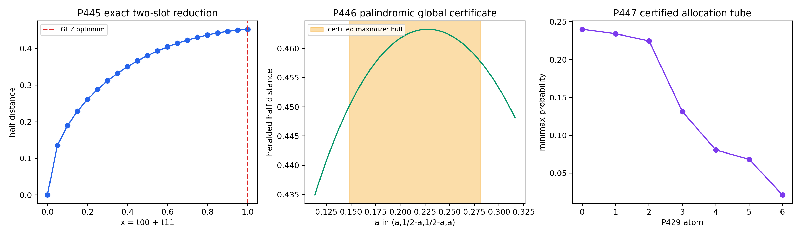

# FIN Local Research Checkpoint P445--P447

## Exact closure of a two-slot noisy comb, a scoped global code certificate, and full atom-box propagation

**Creator:** Żuchowski, Krzysztof  
**Affiliation:** Independent Researcher -- Fractal Information Theory Project  
**ORCID:** 0009-0002-0909-3613  
**Resource type:** Publication -- Preprint  
**Version:** 1.0.0  
**Release:** FIN Research Release 10.38  
**Publication date:** 2026-08-01  
**Language:** English  
**License:** CC BY 4.0

This checkpoint reports local analytical and computer-assisted research only. It contains no laboratory record, external audit, internet result, remote computation, or physical validation.

# 1. Executive summary

Programs P445--P447 continue directly from Release 10.37.

- **P445 -- [Proven].** The complete two-slot process-tester problem for the declared reduced phase/dephasing channel admits an exact diagonal-support reduction. Every causal tester compression is parameterized by four history weights and one cancelling block coherence. Completing a square proves that at (q=4/5), (theta=pi/8), the GHZ history law is globally optimal over **all** admissible two-slot testers, including arbitrary intermediate memory. The exact half-distance and equal-prior success are

$$
D_2^\star=\frac{8\sqrt2}{25}
=0.4525483399593904\ldots,
$$

$$
p_{\mathrm{succ},2}^\star
=\frac12+\frac{4\sqrt2}{25}
=0.7262741699796952\ldots.
$$

  This closes the P435 two-slot gap without installing an SDP dependency. It does not solve three or more uses or the full twelve-mode channel.

- **P446 -- [Computer-assisted proof / Strong evidence / Open].** The (S_3)-invariant three-use heralded output decomposes into a four-dimensional symmetric block and two repeated two-dimensional standard blocks. Directed interval branch-and-bound proves a global upper/lower gap below (10^{-3}) on the palindromic family

$$
p(a)=(a,1/2-a,1/2-a,a),\qquad0\le a\le1/2.
$$

  The inherited rational P436 witness gives lower bound (0.46327828319203235); the exhaustive interval upper bound is (0.4642707484333634). Twenty-four deterministic multistarts on the full three-dimensional Hamming-sector simplex converge to the same neighborhood, and sixteen sampled interior Hessians have largest eigenvalue at most (-0.60629). These are strong falsification results, not a proof of full-simplex concavity or globality.

- **P447 -- [Computer-assisted proof].** The complete (10^{-20})-scale P429 isolating boxes, not only their midpoints, are propagated through the detector-envelope minimax sampler O160. The largest certified sampling-probability width is (3.2548\times10^{-20}). The strict worst-MSE ordering survives:

$$
\mathrm{MSE}_{\mathrm{P447}}
<\mathrm{MSE}_{\mathrm{P422}}
<\mathrm{MSE}_{|w|}.
$$

  The certified reduction relative to P422 lies in a width-(8.7\times10^{-19}) interval around (0.003400659850200921). The detector envelope remains a supplied synthetic model and is not calibration.

The strongest result is P445: an open multiround SDP cell has become an exact theorem through a structural reduction. The most important failed hypothesis is that the P446 symmetry and numerical Hessian evidence already imply globality on the full simplex; they do not.

No selector, dimensional source, complete legacy-to-strict bridge, physical-role transfer, laboratory realization, total action, Standard Model, gravity theory, or Theory-of-Everything closure is obtained.

# 2. Confidence convention

| Status | Meaning in this checkpoint |
|---|---|
| [Proven] | Exact algebra or an analytic theorem under explicit hypotheses. |
| [Computer-assisted proof] | A finite theorem checked by deterministic enclosing computation. |
| [Strong evidence] | Reproducible numerical falsification attempts without a full certificate. |
| [Conditional] | Valid only after the stated channel, measure, detector model, or reference is supplied. |
| [Open] | The typed object exists, but the requested theorem is not established. |
| [Blocked by external evidence] | A real record, traceable calibration, custody, or unblinding is required. |

Synthetic models validate theorems and software only. Floating-point convergence is not promoted to proof.

# 3. Inherited state and kernel boundary

The binding split remains

$$
K_{\mathrm{legacy,ont}}(d)
=\alpha_{\mathrm{geo}}
\frac{\cos(\omega_Ld+\phi_L)}{1+\beta_{\mathrm{tors}}d},
$$

$$
K_{\mathrm{strict,gate}}(d)
=\frac{\cos(\omega_Sd+\phi_S)}{1+\beta d^\eta}.
$$

The research-backed reconstructed historical class

$$
K^*_{\mathrm{legacy}}(d)
=A\frac{\cos(\pi d/4+\pi/6)}{1+\beta d}
$$

remains a fixed-phase subclass of the intermediate legacy kernel. P445--P447 are downstream operational and estimator theorems. They neither derive a kernel nor complete or transfer roles across this split. They do not convert the coupling intuition in `DIAGRAMS_KERNEL_TRANSFORMATION.md` into a typed self-evolution.

| Lane | Before | After P445--P447 |
|---|---|---|
| One-slot reduced tester | Exact | Unchanged |
| Two-slot reduced comb | Exact instance; open (0.07987) success gap | Exact GHZ optimum over all causal testers |
| Three-use heralded code | One rational feasible gain proved | Palindromic global upper within (10^{-3}); full simplex open |
| Detector minimax allocation | Midpoint theorem | Complete P429 atom boxes propagated |
| QW-2191 selector | Open | Open |
| Dimensional source | Missing | Missing |
| Physical record | Absent | Absent |

The ontology remains

$$
\text{nadsoliton}\longrightarrow\text{light}\longrightarrow
\text{matter}\longrightarrow\text{emergent observer},
$$

with no lower informational layer beneath the nadsoliton.

# 4. P445 -- exact two-slot comb closure

## 4.1 Question and obstruction left by P435

P435 supplied exact Choi operators and causal primal/dual constraints but no local multiround solver. The question was whether the support and symmetry of those operators reduce the tester cone enough to solve the selected cell analytically.

The success criterion was an upper bound matching the feasible GHZ half-distance. The falsification criterion was any admissible tester normalization whose coherence raised the value above GHZ.

## 4.2 Process support

For (s\in\{+1,-1\}), the one-slot Choi matrix is

$$
J_s=
|00\rangle\langle00|+|11\rangle\langle11|
+q e^{-is\theta}|00\rangle\langle11|
+q e^{is\theta}|11\rangle\langle00|.
$$

Thus the two-slot process

$$
R_s=J_s\otimes J_s
$$

is supported on four histories

$$
00,\quad01,\quad10,\quad11.
$$

Only the tester compression to this four-dimensional process support affects the objective.

## 4.3 General causal normalizer on the support

The two-slot tester normalization equations imply that its support compression has two positive (2\times2) blocks:

$$
N=
\begin{pmatrix}
t_{00}&c&0&0\\
\overline c&t_{01}&0&0\\
0&0&t_{10}&-c\\
0&0&-\overline c&t_{11}
\end{pmatrix},
$$

where

$$
t_{ab}\ge0,
\qquad
\sum_{a,b}t_{ab}=1,
$$

$$
|c|^2\le\min\{t_{00}t_{01},t_{10}t_{11}\}.
$$

The opposite signs of the two off-diagonal blocks express the intermediate causality trace constraint. Neglecting (c) would describe only diagonal normalizers and would not prove the complete comb theorem.

## 4.4 Rank-two trace-norm reduction

Set

$$
a=2q|\sin\theta|,
\qquad
b=2q^2|\sin2\theta|.
$$

The compressed process difference has rank two. Since the normalized hypothesis probabilities agree, the nonzero eigenvalues of

$$
N^{1/2}(R_+-R_-)N^{1/2}
$$

are (pm D). Writing (c=u+iv), exact trace algebra gives

$$
\begin{aligned}
D^2={}&a^2(t_{00}+t_{11})(t_{01}+t_{10})
+b^2t_{00}t_{11}\\
&-4a^2u^2+2ab(t_{11}-t_{00})u.
\end{aligned}
$$

The imaginary part (v) cancels identically. This cancellation was checked against 128 admissible random normalizers with maximum direct-matrix defect (2.78\times10^{-16}); the theorem follows from the symbolic identity, not that float check.

## 4.5 Square completion

Let

$$
x=t_{00}+t_{11},
\qquad
\delta=t_{11}-t_{00}.
$$

Since

$$
t_{00}t_{11}=\frac{x^2-\delta^2}{4},
$$

completion of the square gives

$$
D^2
=F(x)-4a^2
\left(u-\frac{b\delta}{4a}\right)^2,
$$

where

$$
F(x)=a^2x(1-x)+\frac{b^2}{4}x^2.
$$

Therefore every causal tester satisfies

$$
D^2\le F(x),\qquad0\le x\le1.
$$

If (b^2\ge2a^2), (F) is maximized at (x=1). Equality requires (t_{00}=t_{11}=1/2) and (u=0), which is the GHZ history law.

At (q=4/5), (theta=pi/8), the condition reduces exactly to

$$
2q^2\cos^2\theta-1
=\frac{8\sqrt2-9}{25}>0,
$$

because (128>81). Hence

$$
D_2^\star=q^2\sin(2\theta)=\frac{8\sqrt2}{25}.
$$

This is an analytic upper certificate and a matching feasible strategy. It closes the selected two-slot comb cell.

# 5. P446 -- scoped global code certification

## 5.1 Why P445 does not solve P446

P446 concerns a different object: the three-use heralded-erasure-aware input code. The code law changes the input amplitudes, whereas P445 optimized a two-slot tester normalization for a fixed memoryless channel. The P445 square completion cannot be silently reused.

## 5.2 (S_3) representation reduction

For a three-qubit Hamming-sector law (p=(p_0,p_1,p_2,p_3)), every heralded difference matrix commutes with permutations of the surviving qubits.

For three survivors, Schur decomposition gives:

- one four-dimensional symmetric block in the Dicke basis;
- two equivalent two-dimensional standard blocks.

If (K_{mathrm{sym}}) is the real skew (4\times4) block and (K_{mathrm{std}}) one real skew (2\times2) block, then

$$
\frac12\|K_3\|_*
=\frac12\|K_{\mathrm{sym}}\|_*
+\|K_{\mathrm{std}}\|_*.
$$

For a real skew (4\times4) matrix with upper entries (k_{ij}),

$$
\frac12\|K_{\mathrm{sym}}\|_*
=\sqrt{
\sum_{i<j}k_{ij}^2
+2|\operatorname{pf}K_{\mathrm{sym}}|
}.
$$

The one- and two-survivor blocks reduce respectively to a (2\times2) skew block and a (3\times3) skew block. These identities replace repeated (8\times8) eigensolutions by scalar interval formulas.

## 5.3 Directed interval branch-and-bound

On the palindromic family

$$
p(a)=(a,1/2-a,1/2-a,a),
$$

all amplitudes, block entries, Pfaffians, and square roots were evaluated by outward-rounded binary64 interval primitives. Every addition, multiplication, square, absolute value, and square root is expanded by at least one neighboring representable number. Rational P436 enclosures supply the trigonometric constants.

The algorithm used 148 evaluated boxes and 149 terminal boxes. It imported the already proved P436 rational feasible lower value. The result is

$$
0.46327828319203235
\le
\max_{0\le a\le1/2}D(p(a))
\le
0.4642707484333634.
$$

The rigorous optimality gap is

$$
9.924652413310642\times10^{-4}.
$$

The broad surviving maximizer hull

$$
a\in[0.1484375,0.28125]
$$

reflects interval dependency, not physical uncertainty.

## 5.4 Full-simplex falsification audit

The full Hamming-sector simplex is three-dimensional. A deterministic 24-start SLSQP audit found best value

$$
0.4632782831921028
$$

at

$$
(0.2276921878,0.2723078117,0.2723078154,0.2276921850).
$$

Its reversal defect is below (3.76\times10^{-9}). At sixteen frozen interior points, the largest sampled Hessian eigenvalue is at most

$$
-0.6062949146.
$$

These tests sought asymmetric optima and local nonconcavity and found neither. They do not cover the continuum, the boundary strata, or prove differentiability across spectral degeneracies. Full-simplex globality remains open.



# 6. P447 -- certified detector-allocation tube

## 6.1 Question

P440 evaluated its minimax detector allocation at P429 atom midpoints. P447 asks whether the complete certified P429 node and weight boxes could change allocation positivity, normalization, or the ordering of estimator risks.

## 6.2 Interval map

For each certified atom define

$$
r_i=\sqrt{\sum_{k=0}^{11}x_i^{2k}},
$$

$$
\underline\epsilon_i=0.65+0.25x_i,
\qquad
\overline d_i=0.03-0.02x_i,
$$

$$
\overline h_i
=\frac1{\underline\epsilon_i}
+\frac{\overline d_i(1-\overline d_i)}{\underline\epsilon_i^2}.
$$

The score and normalized allocation are

$$
s_i=|w_i|r_i\sqrt{\overline h_i},
\qquad
q_i=\frac{s_i}{\sum_js_j}.
$$

All operations are performed on the exact P429 rational boxes. Integer square-root bracketing encloses every nonrational radical.

## 6.3 Allocation result

The midpoint display and maximum certified widths are:

| Atom | (q_i) midpoint | Certified width |
|---:|---:|---:|
| 0 | 0.24000091596029191 | (3.255\times10^{-20}) |
| 1 | 0.23410446671319241 | (3.230\times10^{-20}) |
| 2 | 0.22459244891098445 | (3.214\times10^{-20}) |
| 3 | 0.13122814297957672 | (2.354\times10^{-20}) |
| 4 | 0.08062266714704100 | (2.332\times10^{-20}) |
| 5 | 0.06826223139843195 | (2.980\times10^{-20}) |
| 6 | 0.02118912689048153 | (2.438\times10^{-20}) |

Every lower endpoint is positive. Normalization is inherited from the exact score quotient.

## 6.4 Risk ordering

The interval computations certify narrow tubes around

$$
\begin{aligned}
V_{|w|}&=10.393243449520376\ldots,\\
V_{\mathrm{P422}}&=9.650823955540266\ldots,\\
V_{\mathrm{P447}}&=9.618004785993303\ldots.
\end{aligned}
$$

The upper endpoint of each better design lies strictly below the lower endpoint of the preceding design. Therefore

$$
V_{\mathrm{P447}}<V_{\mathrm{P422}}<V_{|w|}
$$

throughout the complete P429 isolating box.

This is uncertainty in a mathematical signed-atom solution, not detector uncertainty. The efficiency/dark-count envelope remains an explicit supplied premise.

# 7. Newly constructed objects

## 7.1 O161 -- Diagonal-Support Comb Reduction

- **Domain/codomain:** a pair of two-slot phase/dephasing process Choi operators and causal testers to a four-history normalizer and scalar distance polynomial.
- **Definition:** the support normalizer (N(t,c)) and completed-square formula in Section 4.
- **Premises:** two memoryless uses of the declared commuting phase/dephasing channel and equal priors.
- **Transformation law:** invariant under simultaneous conjugations preserving the diagonal Choi support; history relabellings permute (t) and (c).
- **Generated theorem:** exact GHZ optimality in the selected cell.
- **Necessity/removal:** omitting (c) fails to represent all causal normalizers; retaining it reveals a nonpositive square correction.
- **Kernel relation:** downstream of a supplied reduced channel; derives neither legacy nor strict kernel.
- **Selector/dimension:** supplies no orientation, phase origin, clock, or physical unit.
- **Failure mode:** more slots or noncommuting noise need new constraints.
- **Status:** [Proven].

## 7.2 O162 -- Palindromic Heralded-Code Global Upper Certificate

- **Domain/codomain:** a palindromic sector interval (a\in[0,1/2]) to an enclosing heralded discrimination interval.
- **Definition:** the (S_3) block formulas plus exhaustive outward-rounded branch-and-bound.
- **Premises:** the P418 three-use independent dephasing and heralding model.
- **Generated theorem:** global palindromic value within (10^{-3}).
- **Necessity/removal:** without representation reduction the interval dependency and eigensolver trust boundary are much larger.
- **Kernel relation:** kernel-split robust after the reduced channel is supplied.
- **Selector/dimension:** no selector or unit.
- **Failure mode:** it does not cover asymmetric sector laws.
- **Status:** [Computer-assisted proof] in the declared family; [Open] on the full simplex.

## 7.3 O163 -- Certified Detector-Allocation Tube

- **Domain/codomain:** the P429 rational isolating box to seven probability intervals and estimator-risk intervals.
- **Definition:** exact interval propagation through O160.
- **Premises:** the supplied detector nuisance envelope and P429 signed-atom theorem.
- **Generated theorem:** positive normalized allocation and strict risk ordering over the full atom box.
- **Necessity/removal:** midpoint evaluation alone cannot prove robustness to the atom uncertainty.
- **Kernel relation:** consumes a mathematical signed representation; does not physically realize it.
- **Selector/dimension:** allocation uses absolute weights and cannot select polarity; no unit.
- **Failure mode:** a different detector model or moment loss requires a new map.
- **Status:** [Computer-assisted proof].

# 8. Failed approaches and adversarial checks

1. **Diagonal tester normalization only -- rejected.** Causality permits cancelling off-diagonal blocks (c,-c). P445 includes them explicitly.
2. **Numerical off-diagonal search as proof -- rejected.** Feasible random and SLSQP searches found no improvement, but the theorem comes from square completion.
3. **Promoting P445 to arbitrary use number -- rejected.** The four-history rank-two identity is two-slot specific.
4. **Promoting palindromic optimality to the full P446 simplex -- rejected.** Reversal symmetry does not by itself force a pure optimal input to be palindromic.
5. **Calling sampled negative Hessians global concavity -- rejected.** Boundary and spectral-degeneracy regions remain uncovered.
6. **Demanding an unnecessarily fine P446 interval cover -- terminated.** Exact rational fractions caused expression growth; outward-rounded binary64 intervals produced the declared finite (10^{-3}) certificate. The coarser theorem is reported honestly.
7. **Treating equal displayed P447 endpoints as zero uncertainty -- rejected.** Decimal interchange rounds them equally at 17 digits; exact widths up to (3.2548\times10^{-20}) are retained separately.
8. **Treating P447 as apparatus robustness -- rejected.** Only P429 mathematical uncertainty is propagated.

# 9. Selector, dimensional, legacy/strict, and physical audit

O161, O162, and O163 do not create a non-premise orientation. P445's optimal GHZ history law is invariant under exchanging the two diagonal histories. P446's certified family is explicitly reversal symmetric. P447 uses absolute weights. QW-2191 is therefore unchanged.

All channel phases, efficiencies, dark probabilities, and estimator losses are dimensionless. No physical time, length, mass, energy, action, (k_B), (hbar), or SI anchor is derived.

The reconstructed (K^*_{\mathrm{legacy}}) remains an intermediate legacy class. None of the three programs types the historical coupling diagram as a state self-map, sources its free amplitude/damping parameters, completes the strict kernel, or transfers a legacy electroweak, electromagnetic, or gravity-hierarchy role.

The exact comb theorem is a theorem about a supplied mathematical channel. It does not prove that a laboratory implements that channel, prepares the code, resolves FIN vertices, maintains the declared coherence, or records herald events.

# 10. Explicit nonclaims

This checkpoint does not claim:

- an (n\ge3) adaptive-comb optimum;
- a full twelve-mode FIN channel optimum;
- full-simplex globality of the P436/P446 code;
- correlated or unheralded loss correction;
- detector calibration or laboratory counts;
- selector closure or canonical chirality;
- dimensional physics;
- a legacy-to-strict completion or role-transfer theorem;
- Standard Model, gravity, (L_{\mathrm{total}}), or Theory-of-Everything closure.

# 11. Recommended next programs

| Rank | Program | Study | Decisive output | Probability |
|---:|---|---|---|---:|
| 1 | P448 | Full-simplex concavity or counterexample for the three-use heralded code | Rigorous Hessian/epigraph cover, or explicit asymmetric improvement | 0.68 |
| 2 | P449 | Three-slot extension of O161 | Causal support-recursion theorem or explicit new coherence obstruction | 0.64 |
| 3 | P450 | Representation-independence of O163 | Allocation/risk invariants across all admitted signed-atom representations, or counterexample | 0.61 |
| 4 | P451 | Sharpen O162 by interval Newton on the palindromic derivative | Unique maximizer interval and value gap below (10^{-10}) | 0.59 |
| 5 | P452 | Four-use rational heralded witness | Certified gain in the largest P418 cell | 0.55 |
| 6 | P453 | General two-slot commuting-Schur channel theorem | Necessary and sufficient endpoint-optimality condition beyond the selected cell | 0.53 |
| 7 | P454 | Covariance-weighted detector minimax allocation | Exact law for non-diagonal moment loss | 0.51 |
| 8 | P455 | Detector drift and dependence obstruction | Robust law or no-go under bounded temporal correlations | 0.48 |
| 9 | P456 | One complete-Bernstein damping-source class | Exact source theorem or bounded no-go | 0.45 |
| 10 | P457 | Photonic chart interval cover | Certified injectivity box or explicit alias | 0.42 |
| 11 | P458 | Catalytic phase-reference ledger | Exact recovery/consumption law without polarity promotion | 0.40 |
| 12 | P459 | Formal real-cosine provider | Proof-kernel completion of the P428 rational-cut interface | 0.32 |

The preferred next bounded batch is

$$
\boxed{P448\to P449\to P450.}
$$

P448 attacks the principal remaining boundary around the strongest code theorem. P449 tests whether P445 is an isolated two-slot accident or the first member of a causal support recursion. P450 checks whether the detector allocation is an invariant of the moment problem or an artifact of the selected seven-atom representation.

# 12. Artifact list

- `FIN_Local_Research_Checkpoint_P445_P447_EN.md`
- `FIN_Local_Research_Checkpoint_P445_P447_EN.tex`
- `FIN_Local_Research_Checkpoint_P445_P447_EN.pdf`
- `FIN_Current_Local_Research_Report_EN.pdf`
- `fin_programs_445_447.py`
- `fin_programs_445_447_to_latex.py`
- `test_fin_programs_445_447.py`
- `test_fin_checkpoint_p445_p447.py`
- `FIN_Programs_445_447_Results.json`
- `FIN_Programs_445_447_Summary.csv`
- `FIN_Programs_445_447_P445_Two_Slot_Reduction.csv`
- `FIN_Programs_445_447_P446_Palindromic_Certificate.csv`
- `FIN_Programs_445_447_P446_Full_Simplex_Audit.csv`
- `FIN_Programs_445_447_P447_Atom_Box_Propagation.csv`
- `FIN_Programs_445_447_Figures/p445_p447_exact_reduction_and_intervals.png`
- `RELEASE_10_38_PROGRAMS_445_447.md`
- `FIN_Local_Research_Checkpoint_P445_P447_State.json`
- `FIN_Checkpoint_P445_P447_AGENTS_Guardrail.txt`
- `FIN_PROGRAMS_445_447_RELEASE_MANIFEST.sha256`

# 13. Reproducibility and Restart instructions

```bash
MPLCONFIGDIR=/tmp/fin-mpl-1038 python3 fin_programs_445_447.py
python3 fin_programs_445_447_to_latex.py
lualatex -interaction=nonstopmode -halt-on-error FIN_Local_Research_Checkpoint_P445_P447_EN.tex
lualatex -interaction=nonstopmode -halt-on-error FIN_Local_Research_Checkpoint_P445_P447_EN.tex
python3 -m unittest -v test_fin_programs_445_447.py test_fin_checkpoint_p445_p447.py
sha256sum -c FIN_PROGRAMS_445_447_RELEASE_MANIFEST.sha256
```

To resume, read `AGENTS.md`, its mandatory packets, `SUMMARY_GROK.md`, `FIN_GOAL_STATE.md`, the P435--P440 checkpoint, this checkpoint, and the P435/P445 structured results. Begin only P448/P449/P450 unless a fresh broad state-map audit identifies a more decisive typed object. Preserve the kernel split, QW-2191, all dimensional and physical-evidence boundaries, and the distinction between mathematical detector envelopes and calibration.

# 14. Final interpretation

P445 illustrates the highest-value pattern for the current local frontier: a missing numerical dual certificate was replaced by an exact structural theorem. The causal normalizer contains more freedom than the first diagonal ansatz, but that freedom becomes a negative square and cannot improve the selected two-slot value.

P446 shows the contrasting boundary. Symmetry reduction and strong numerical concavity evidence are not enough to turn a three-dimensional global optimization into a theorem. P447 shows that once a typed theorem exists, very small upstream uncertainty can be propagated exactly without confusing it with experimental uncertainty.

These advances strengthen FIN's operational mathematics. They still do not supply the external operational structure that would make the mathematics an experimentally tested physical theory.
