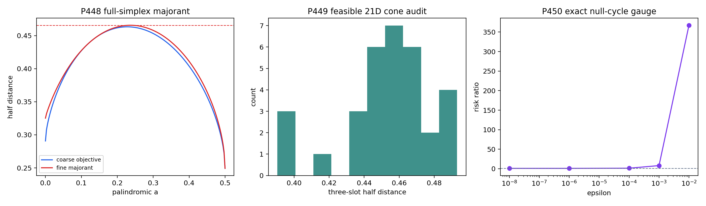

# FIN Local Research Checkpoint P448--P450

## A full-simplex erasure majorant, a three-slot causal echo counterexample, and a representation-gauge no-go

**Creator:** Żuchowski, Krzysztof  
**Affiliation:** Independent Researcher -- Fractal Information Theory Project  
**ORCID:** 0009-0002-0909-3613  
**Resource type:** Publication -- Preprint  
**Version:** 1.0.0  
**Release:** FIN Research Release 10.39  
**Publication date:** 2026-08-01  
**Language:** English  
**License:** CC BY 4.0

This checkpoint reports local analytical and computer-assisted research only. It contains no laboratory record, external audit, internet result, remote computation, or physical validation.

# 1. Executive summary

Programs P448--P450 start from the verified Release-10.38 boundary and produce three different kinds of result.

- **P448 -- [Computer-assisted proof / Open].** A new object, O164, replaces a blind three-dimensional interval cover by a concave fine-grained-erasure majorant. Revealing the computational value of every lost bit can only increase distinguishability. Each resulting fine block has a nuclear-norm variational representation that is concave in the Hamming-sector law. Reversal symmetry therefore reduces the global majorant optimization on the complete four-probability simplex to one palindromic coordinate. An outward-rounded interval cover proves

$$
0.46327828319203235
\le D_{\mathrm{P446}}^{\mathrm{global}}
\le 0.4666305033804779.
$$

  The remaining rigorous full-simplex gap is 0.003352220188445554. Exact globality of the P436 witness remains open because the majorant gives the receiver information absent from the original coarse-grained channel.

- **P449 -- [Proven / Computer-assisted proof / Open].** The support compression of every causal n-slot tester obeys the exact recursion

$$
\mathcal C_n
=\left\{
B_0\oplus B_1:
B_0,B_1\succeq0,
\ B_0+B_1\in\mathcal C_{n-1}
\right\},
$$

  with affine dimensions 1, 5, 21, 85, and 341 for one through five slots. The three-slot cone has fourteen affine coherence/history-correlation directions beyond the seven-dimensional diagonal history simplex.

  More importantly, the simple rational history law

$$
t_{abc}
=\begin{cases}
9/40,&a=c,\\
1/40,&a\ne c,
\end{cases}
$$

  is extended explicitly to a full positive causal tester normalization. Rigorous rational transcendental enclosures and exact characteristic-polynomial root isolation give

$$
D_{\mathrm{echo}}
\in[0.49063899018433244,
0.49063899018433377],
$$

$$
D_{\mathrm{GHZ},3}
=0.47302632064577882,
$$

  hence

$$
D_{\mathrm{echo}}-D_{\mathrm{GHZ},3}
\ge0.017612669538553616.
$$

  Three-slot GHZ optimality is therefore **refuted** in the declared reduced phase/dephasing comb. The global three-slot optimum remains open.

- **P450 -- [Proven].** O163 is invariant under same-sign splitting of an atom at an identical node, but it is not determined by the twelve target moments. The exact signed null cycle

$$
\nu_{12}
=\sum_{j=0}^{12}(-1)^j\binom{12}{j}\,\delta_{j/12}
$$

  has zero moments of orders 0 through 11. Adding epsilon times this cycle leaves the complete twelve-moment functional unchanged while the O163 detector-weighted allocation risk is unbounded as the magnitude of epsilon grows. At epsilon equal to 0.01, the displayed risk ratio is already 367.386555828614. A preparation-level representation rule is mathematically necessary; the moment functional alone cannot choose the sampler.

The strongest result is the P449 echo-history counterexample. The most important failed hypothesis is that the exact two-slot GHZ theorem extends naturally to three slots. It does not.

No selector, canonical orientation, dimensional source, complete legacy-to-strict bridge, physical-role transfer, laboratory realization, Standard Model, gravity theory, total action, or Theory-of-Everything closure is obtained.

# 2. Confidence convention

| Status | Meaning in this checkpoint |
|---|---|
| [Proven] | Exact algebra or analytic theorem under explicit hypotheses. |
| [Computer-assisted proof] | Finite enclosing computation with deterministic artifacts. |
| [Strong evidence] | Reproducible numerical falsification without a complete certificate. |
| [Conditional] | Valid only after a stated channel, measure, detector model, or reference is supplied. |
| [Open] | The typed object exists, but the requested closure theorem is absent. |
| [Refuted] | An explicit admissible counterexample violates the proposed statement. |
| [Blocked by external evidence] | A real record, calibration, custody chain, or unblinding is required. |

Synthetic models validate mathematics and code only. A floating-point optimum is never promoted to a theorem.

# 3. Inherited assumptions and state map

The binding kernel split is unchanged:

$$
K_{\mathrm{legacy,ont}}(d)
=\alpha_{\mathrm{geo}}
\frac{\cos(\omega_Ld+\phi_L)}{1+\beta_{\mathrm{tors}}d},
$$

$$
K_{\mathrm{strict,gate}}(d)
=\frac{\cos(\omega_Sd+\phi_S)}{1+\beta d^\eta}.
$$

The research-backed historical subclass

$$
K^*_{\mathrm{legacy}}(d)
=A\frac{\cos(\pi d/4+\pi/6)}{1+\beta d}
$$

remains an intermediate legacy object, not the strict kernel. The coupling sketches in `DIAGRAMS_KERNEL_TRANSFORMATION.md` remain provenance and intuition: they do not export the state self-map, feedback law, source of A or beta, or fixed-point theorem needed for a typed self-coupling.

| Lane | Release 10.38 | After P448--P450 |
|---|---|---|
| P446 full code simplex | Palindromic certificate; globality open | Global full-simplex interval width 0.00335223; exact optimum open |
| Two-slot comb | Exact GHZ theorem | Unchanged |
| Three-slot comb | Not reduced | Exact 21-dimensional support recursion; GHZ refuted by rational echo law |
| Detector allocation | Certified on P429 representation | Proven representation-gauge dependence |
| Canonical preparation representation | Missing | Proven necessary; still missing |
| QW-2191 selector | Open | Open |
| Dimensional source | Missing | Missing |
| Physical record | Absent | Absent |

The ontology remains

$$
\text{nadsoliton}
\longrightarrow\text{light}
\longrightarrow\text{matter}
\longrightarrow\text{emergent observer},
$$

with no informational layer beneath the nadsoliton.

# 4. P448 -- global full-simplex majorization

## 4.1 Exact question

P446 established a global interval certificate only on the palindromic line. The P448 question is whether one can bound the original operational objective over every probability vector

$$
p=(p_0,p_1,p_2,p_3),
\qquad p_k\ge0,
\qquad\sum_kp_k=1,
$$

without a blind three-dimensional subdivision.

The success criterion is a rigorous full-simplex upper bound close to the certified P436 lower witness. The falsification criterion is either a probability law exceeding that upper bound or a failure of the proposed concavity/majorization chain.

## 4.2 Coarse and fine erasure records

For a fixed heralded survivor set S, the original model traces over the computational values ell carried by lost qubits. Its signed output difference is

$$
\Delta_S(p)=\sum_\ell\Delta_{S,\ell}(p).
$$

Define the refined direct-sum record

$$
\widehat\Delta_S(p)
=\bigoplus_\ell\Delta_{S,\ell}(p).
$$

Forgetting ell is a completely positive trace-preserving coarse graining. Contractivity of trace distance gives

$$
\frac12\|\Delta_S(p)\|_1
\le
\frac12\|\widehat\Delta_S(p)\|_1
=\sum_\ell\frac12\|\Delta_{S,\ell}(p)\|_1.
$$

Summing with the exact herald probabilities defines the fine majorant M(p) and proves

$$
D_{\mathrm{coarse}}(p)\le M(p).
$$

This inequality was also attacked numerically at 256 deterministic random laws. The largest observed coarse-minus-fine defect was negative 6.96 times 10 to the minus 6. The theorem, however, is contractivity, not the random check.

## 4.3 Concavity theorem

Every fixed fine block has the form

$$
X(P)=P^{1/2}HP^{1/2},
$$

where H is a fixed Hermitian phase/dephasing difference matrix and P is a diagonal matrix whose entries are affine functions of p. For positive definite P, the nuclear-norm variational formula gives

$$
\operatorname{Tr}|X|
=\inf_{Y\succ0}
\frac12\operatorname{Tr}
\left(Y+XY^{-1}X\right).
$$

Set

$$
Y=P^{1/2}ZP^{1/2}.
$$

Then

$$
\operatorname{Tr}|P^{1/2}HP^{1/2}|
=\inf_{Z\succ0}
\frac12\operatorname{Tr}
P\left(Z+HZ^{-1}H\right).
$$

The right side is an infimum of affine functions of P and is therefore concave. Continuity extends the result to the boundary P positive semidefinite. Hence M is concave on the complete probability simplex.

Let R reverse Hamming sectors:

$$
R(p_0,p_1,p_2,p_3)=(p_3,p_2,p_1,p_0).
$$

The sum over all fine erasure records satisfies M(Rp)=M(p). Concavity gives

$$
M(p)
\le M\left(\frac{p+Rp}{2}\right).
$$

Therefore its global maximum lies on

$$
p(a)=(a,1/2-a,1/2-a,a),
\qquad0\le a\le1/2.
$$

This is a theorem about the majorant. It does not assert the same symmetrization inequality for the coarse objective.

## 4.4 Directed interval certificate

The one-dimensional cover uses:

- exact rational Machin enclosures of pi;
- alternating-series sine intervals;
- outward-rounded binary64 addition, multiplication, square, absolute value, and square root;
- the exact S3 irreducible blocks used by P446;
- a deterministic heap-based branch-and-bound with tolerance 0.001.

The certificate evaluated 152 boxes. It gives

$$
0.4656336192495863
\le\max_a M(p(a))
\le0.4666305033804779.
$$

The live maximizer hull is contained in

$$
a\in[0.1796875,0.29296875].
$$

Combining the majorization theorem with the certified P436 witness produces the full-simplex bracket stated in the executive summary.

## 4.5 What P448 does not prove

At the candidate neighborhood, revealing the lost value increases the objective by roughly two times 10 to the minus 3. The majorant is therefore not tight enough to prove the exact P436 optimizer. The correct result is a rigorous global enclosure, not a global optimum theorem.

# 5. P449 -- recursive causal support and the echo-history counterexample

## 5.1 Tester normalization

For n ordered channel calls, a causal tester normalization has the recursive form

$$
\sum_rT_r=I_{Y_n}\otimes\Xi_n,
$$

$$
\operatorname{Tr}_{X_n}\Xi_n
=I_{Y_{n-1}}\otimes\Xi_{n-1},
$$

continuing to a density operator rho with trace one. The declared channel Choi matrices are supported on Y_k=X_k in the computational basis.

Let C_n be the set of compressions of the tester normalization to the resulting 2-to-the-n-dimensional history support.

## 5.2 Recursive support theorem

The identity on Y_n forces a compression to be block diagonal in the newest history bit:

$$
N_n=B_0\oplus B_1.
$$

Tracing X_n says that the two blocks sum to the preceding support normalizer:

$$
B_0+B_1\in\mathcal C_{n-1}.
$$

Positivity gives B_0 and B_1 positive semidefinite. Conversely, every positive decomposition of a compressed preceding normalizer admits a positive full-space lift. One way to see this is to write a positive extension R of the inherited normalizer and apply the Douglas factorization/effect construction to

$$
0\preceq B_0\preceq PRP.
$$

An effect E with B_0=PR^{1/2}ER^{1/2}P gives the two positive full blocks

$$
R^{1/2}ER^{1/2},
\qquad
R^{1/2}(I-E)R^{1/2}.
$$

This proves the recursion

$$
\mathcal C_n
=\{B_0\oplus B_1:B_0,B_1\succeq0,
B_0+B_1\in\mathcal C_{n-1}\}.
$$

The affine dimension therefore satisfies

$$
d_1=1,
\qquad
d_n=d_{n-1}+4^{n-1},
$$

so

$$
d_n=\frac{4^n-1}{3}-1.
$$

For n=3, d_3=21. A diagonal eight-history law has only seven affine dimensions; fourteen additional real directions survive causal compression.

## 5.3 The rational echo-history law

The P445 two-slot theorem might suggest that endpoint GHZ histories remain optimal at three slots. P449 attacks that hypothesis directly.

Write a, b, c for newest, middle, and oldest history bits. Define

$$
t_{abc}
=\begin{cases}
9/40,&a=c,\\
1/40,&a\ne c.
\end{cases}
$$

In lexicographic order this is

$$
t=\frac1{40}(9,1,9,1,1,9,1,9).
$$

Its two newest-bit blocks are

$$
B_0=\frac1{40}\operatorname{diag}(9,1,9,1),
$$

$$
B_1=\frac1{40}\operatorname{diag}(1,9,1,9),
$$

and

$$
B_0+B_1=I_4/4\in\mathcal C_2.
$$

Thus it is an admissible element of C_3. It correlates the first and third calls while leaving the middle bit uniform, hence the working name “echo-history tester”.

## 5.4 Explicit full-space extension

To avoid relying only on the abstract lifting theorem, the executable artifact constructs the full operator. Let Xi_2=I_8/4. On the equality support Y_2=X_2 and Y_1=X_1, embed B_0 in a sixteen-dimensional operator and fill its complement by I/8. Call the result B_0 full. Define

$$
B_1^{\mathrm{full}}=I_{16}/4-B_0^{\mathrm{full}},
$$

$$
\Xi_3=B_0^{\mathrm{full}}\oplus B_1^{\mathrm{full}},
$$

$$
\sum_rT_r=I_{Y_3}\otimes\Xi_3.
$$

The smallest eigenvalue of Xi_3 is 0.025. The generated full-space checks give exactly zero floating residual for

$$
\operatorname{Tr}_{X_3}\Xi_3-I_{Y_2}\otimes\Xi_2,
$$

for the inherited Xi_2 constraint, and for compression back to the displayed eight-history normalizer.

## 5.5 Certified discrimination advantage

At

$$
q=4/5,
\qquad\theta=\pi/8,
$$

the support difference is a purely imaginary Hermitian matrix whose real factor is skew symmetric. Every entry of the echo witness is enclosed using:

- the exact rational probabilities t;
- rational square-root enclosures;
- a Machin interval for pi;
- alternating sine intervals for multiples of pi/8;
- exact characteristic-polynomial root isolation for the rational midpoint of K-transpose-K;
- an explicit nuclear-norm perturbation remainder.

The resulting intervals are

$$
D_{\mathrm{echo}}
\in[0.49063899018433244,
0.49063899018433377],
$$

$$
D_{\mathrm{GHZ},3}
\in[0.47302632064577882,
0.47302632064577882].
$$

The strict lower advantage is 0.017612669538553616. In equal-prior success probability, the certified echo lower bound is 0.74531949509216622, whereas the GHZ upper bound is 0.73651316032288938.

This refutes three-slot GHZ optimality in the declared reduced channel. It does not determine the global optimum. Thirty-two deterministic feasible full-cone scouts reached 0.4929886420607703; that larger value is [Strong evidence], not a certified optimum.

## 5.6 Interpretation and failure of the two-slot extrapolation

The two-slot proof collapses every admissible coherence correction to one negative square. At three slots, the affine cone grows from dimension 5 to dimension 21. Even its diagonal face contains temporal correlations unavailable to the two-endpoint GHZ history.

The echo law is a mathematical causal tester strategy. It does not prove a physical delay line, quantum memory, clock, preparation, vertex POVM, detector, or laboratory record.

# 6. P450 -- the moment-null representation gauge

## 6.1 Exact question

O163 assigns detector-aware sampling probabilities to a signed atomic representation

$$
\mu=\sum_iw_i\delta_{x_i}
$$

of the twelve-moment functional. P450 asks whether the allocation and its risk depend only on the moments, or on the selected representation.

## 6.2 A limited positive invariance

If one atom w delta_x is split into two same-sign atoms lambda w delta_x and (1-lambda) w delta_x at the identical node, then

$$
|\lambda w|r(x)\sqrt{h(x)}
+|(1-\lambda)w|r(x)\sqrt{h(x)}
=|w|r(x)\sqrt{h(x)}.
$$

The aggregated allocation and minimized risk are unchanged. The code verifies this at lambda equal to 2/5.

## 6.3 Exact null cycle

Define

$$
\nu_{12}
=\sum_{j=0}^{12}(-1)^j\binom{12}{j}\delta_{j/12}.
$$

The finite-difference identity gives, exactly,

$$
\int x^k\,d\nu_{12}(x)=0,
\qquad k=0,1,\ldots,11.
$$

Therefore every representation

$$
\mu_\epsilon=\mu+\epsilon\nu_{12}
$$

has precisely the same twelve moments as mu.

## 6.4 Risk divergence

For the supplied detector envelope, define

$$
s_i=|w_i|r_i\sqrt{h_i},
\qquad
q_i^*=\frac{s_i}{\sum_js_j}.
$$

The minimized worst second-moment coefficient is

$$
V(\mu)=\left(\sum_i s_i\right)^2-\|m\|_2^2,
$$

where m is the twelve-moment vector. Along the null orbit, m is fixed. Because nu_12 has nonzero support, the score sum grows at least linearly in the magnitude of epsilon. Consequently

$$
\sup_\epsilon V(\mu_\epsilon)=+\infty.
$$

This is an analytic no-go for representation independence.

The deterministic finite examples are:

| epsilon | Exact moment defect | Risk ratio to reduced P429 representation |
|---:|---:|---:|
| 0 | 0 | 1.000000 |
| 0.00000001 | 0 | 1.00003849 |
| 0.000001 | 0 | 1.00385180 |
| 0.0001 | 0 | 1.41764264 |
| 0.001 | 0 | 8.12753817 |
| 0.01 | 0 | 367.38655583 |



## 6.5 The missing operational object

The moment functional cannot specify how its signed representation is physically or algorithmically prepared. At least one additional typed rule is necessary, for example:

- a reduced Jordan representation;
- minimal support under explicit admissibility conditions;
- minimum total variation;
- a preparation instrument that fixes the atoms operationally;
- a quotient-invariant estimator that does not consume a presentation.

These alternatives are not equivalent, and P450 does not select one. O166 is the representation gauge itself: two presentations are gauge-related when their difference annihilates the declared moment space.

This is distinct from QW-2191. Fixing a preparation representation does not select an orientation on Z12.

# 7. Newly constructed objects

## 7.1 O164 -- Concave Fine-Grained-Erasure Majorant

- **Domain/codomain:** a four-sector probability law to a nonnegative discrimination upper bound.
- **Definition:** the herald-weighted sum of trace distances after adjoining the lost computational value as an orthogonal classical record.
- **Premises:** the declared independent dephasing and heralded erasure channel.
- **Transformation law:** invariant under Hamming-sector reversal and survivor permutations.
- **Generated theorem:** global full-simplex upper bound after one-dimensional interval optimization.
- **Necessity/removal:** without the fine record, concavity has not been proved; with it, the bound is not tight.
- **Kernel relation:** downstream and kernel-split robust after the reduced channel is supplied.
- **Selector/dimension:** no orientation and no physical unit.
- **Operational interpretation:** an information-enhanced receiver used only for upper bounding.
- **Failure mode:** strict coarse-graining loss prevents exact globality.
- **Status:** [Computer-assisted proof] as a global certificate; [Open] as an exact optimizer.

## 7.2 O165 -- Recursive Causal-Support Cone

- **Domain/codomain:** n-slot causal tester normalizations to positive history-support matrices.
- **Definition:** C_1 is the one-bit diagonal density interval and C_n consists of positive block decompositions whose block sum lies in C_(n-1).
- **Premises:** ordered qubit calls and the diagonal Choi support of the declared channel.
- **Transformation law:** compatible with chronological relabeling; reversal is not silently identified with causal reversal.
- **Generated theorem:** exact cone recursion and affine dimension; admission of the echo-history witness.
- **Necessity/removal:** using only the diagonal independent-history face misses both causal correlations and fourteen three-slot directions.
- **Kernel relation:** consumes a supplied reduced channel; derives neither kernel.
- **Selector/dimension:** no Z12 selector and no unit.
- **Operational interpretation:** the mathematical memory/adaptation normalizer available to a process tester.
- **Failure mode:** different Choi support or noncommuting noise requires a new compression theorem.
- **Status:** [Proven].

## 7.3 O166 -- Moment-Null Representation Gauge

- **Domain/codomain:** signed atomic measures to equivalence classes modulo annihilators of polynomials of degree at most eleven.
- **Definition:** mu is equivalent to mu-prime when their moments of orders 0 through 11 coincide.
- **Premises:** the declared twelve-moment interface.
- **Transformation law:** addition of any signed measure in the moment-null space.
- **Generated theorem:** O163 risk is unbounded on a single gauge orbit.
- **Necessity/removal:** without a gauge fixing or quotient-invariant estimator, the moment data cannot determine a preparation allocation.
- **Kernel relation:** applies to the P429 signed representation and does not change either kernel.
- **Selector/dimension:** not a selector and supplies no unit.
- **Operational interpretation:** ambiguity between an abstract functional and a concrete preparation list.
- **Failure mode:** a separately justified canonical measure could remove the ambiguity in its declared class.
- **Status:** [Proven].

# 8. Falsification and failed approaches

1. **Blind full-simplex interval subdivision -- terminated.** The dependency width made the initial three-dimensional cover computationally disproportionate. O164 replaces it with a proved one-dimensional majorant.
2. **Calling the majorant exact -- refuted.** Lost-value disclosure creates a strict gap near the candidate optimizer.
3. **Promoting numerical concavity of the coarse objective -- rejected.** P448 proves concavity only for the fine majorant.
4. **Extrapolating two-slot GHZ optimality -- refuted.** The rational echo law is an admissible strict counterexample at three slots.
5. **Treating a compressed normalizer as automatically physical -- rejected.** P449 supplies both the lifting theorem and an explicit full Xi_3 extension.
6. **Treating a floating advantage as proof -- rejected.** The echo advantage is enclosed by rational transcendental and spectral certificates.
7. **Calling the largest random P449 value optimal -- rejected.** It is only a feasible scout.
8. **Assuming moment equality fixes the sampler -- refuted.** The exact finite-difference null cycle preserves all twelve moments and changes the risk without bound.
9. **Treating atom splitting as a universal counterexample -- rejected.** Same-sign splitting at the identical node is actually invariant after aggregation; the nontrivial obstruction requires a null cycle.
10. **Interpreting the null cycle as laboratory noise -- rejected.** It is a mathematical representation transformation, not a physical process.

# 9. Selector, dimensional, kernel, and physical audit

O164 is reversal invariant. O165 describes causal normalization but does not choose a Z12 direction. The echo rule correlates temporal endpoints inside an already ordered tester; the chronology is a supplied interface and is not a non-premise strict selector. O166 is a representation gauge and likewise does not discharge QW-2191.

All phases, coherence factors, probabilities, detector envelopes, and risks remain dimensionless. No clock, length, action, mass, energy, hbar, k_B, or SI anchor is generated.

The programs neither derive the legacy or strict kernel nor complete their bridge. They do not source A, beta, alpha_geo, beta_tors, or the strict compression exponent. No legacy electroweak, electromagnetic, or gravity-hierarchy role is transferred.

The mathematical duality

$$
U_t=e^{-itA},
\qquad
P_t=e^{-tA}
$$

remains a functional-calculus duality. P448--P450 do not supply its physical state, clock, environment, apparatus, preparation, instrument, measurement, observer, or record.

The echo tester is an executable mathematical specification. A laboratory would still have to establish preparation, calibrated time, channel stationarity, memory implementation, resolved measurement, counts, independent custody, hold-out, and unblinding.

# 10. Explicit nonclaims

This checkpoint does not claim:

- the exact full-simplex P446 optimizer;
- a global three-slot comb optimum;
- an n-slot echo theorem;
- a full twelve-mode FIN comb optimum;
- a canonical preparation representation;
- detector calibration or empirical counts;
- selector closure or canonical chirality;
- a physical time or dimensional scale;
- a legacy-to-strict completion or physical-role transfer theorem;
- Standard Model, gravity, total action, or Theory-of-Everything closure.

# 11. Recommended next programs

| Rank | Program | Study | Decisive output | Probability |
|---:|---|---|---|---:|
| 1 | P451 | Exact/global optimization of the three-slot recursive cone | Matching analytic/interval upper bound for the echo neighborhood, or a stronger certified witness | 0.73 |
| 2 | P452 | Close the P448 coarse-graining gap | Direct full-simplex interval/SOS certificate below 0.46664, or an asymmetric counterexample | 0.66 |
| 3 | P453 | Canonical representation rule for O163 | Uniqueness theorem for a reduced/minimum-TV admissible measure, or a no-go | 0.63 |
| 4 | P454 | Four-slot echo-history extension | Certified rational witness and comparison with GHZ/product baselines | 0.60 |
| 5 | P455 | General n-slot cone formalization | Machine-checked recursion, dimension formula, and lift theorem | 0.56 |
| 6 | P456 | Quotient-invariant moment estimator | Estimator whose risk is invariant on O166 gauge classes, or impossibility theorem | 0.54 |
| 7 | P457 | Full twelve-mode support recursion | Typed support cone or explicit obstruction from non-diagonal Fourier structure | 0.50 |
| 8 | P458 | Covariance-aware canonical atom preparation | Exact risk law after a chosen operational representation interface | 0.47 |
| 9 | P459 | Sharpen O164 with partial lost-value disclosure | Hierarchy of upper bounds converging to the coarse objective | 0.45 |
| 10 | P460 | Echo strategy robustness | Certified neighborhood in q and theta where GHZ remains refuted | 0.44 |
| 11 | P461 | Typed legacy-star self-coupling candidate | One explicit state self-map and fixed-point/instability theorem, without role transfer | 0.38 |
| 12 | P462 | Formal nuclear-norm concavity provider | Local proof-assistant theorem or explicit library obstruction | 0.34 |

The preferred next bounded batch is

$$
\boxed{P451\longrightarrow P452\longrightarrow P453.}
$$

P451 is now the highest-value lane because P449 supplies a certified counterexample with a large margin. P452 attacks the only remaining gap around the three-use erasure-aware code. P453 responds directly to the operational ambiguity proved by P450.

# 12. Artifact list

- `FIN_Local_Research_Checkpoint_P448_P450_EN.md`
- `FIN_Local_Research_Checkpoint_P448_P450_EN.tex`
- `FIN_Local_Research_Checkpoint_P448_P450_EN.pdf`
- `FIN_Current_Local_Research_Report_EN.pdf`
- `fin_programs_448_450.py`
- `fin_programs_448_450_to_latex.py`
- `test_fin_programs_448_450.py`
- `test_fin_checkpoint_p448_p450.py`
- `FIN_Programs_448_450_Results.json`
- `FIN_Programs_448_450_Summary.csv`
- `FIN_Programs_448_450_P448_Full_Simplex_Majorant.csv`
- `FIN_Programs_448_450_P449_Three_Slot_Recursion.csv`
- `FIN_Programs_448_450_P449_Three_Slot_Witness.npz`
- `FIN_Programs_448_450_P450_Null_Cycle.csv`
- `FIN_Programs_448_450_Figures/p448_p450_global_majorant_and_gauge_obstruction.png`
- `RELEASE_10_39_PROGRAMS_448_450.md`
- `FIN_Local_Research_Checkpoint_P448_P450_State.json`
- `FIN_Checkpoint_P448_P450_AGENTS_Guardrail.txt`
- `FIN_PROGRAMS_448_450_RELEASE_MANIFEST.sha256`

# 13. Reproducibility and restart instructions

```bash
MPLCONFIGDIR=/tmp/fin-mpl-1038 python3 fin_programs_448_450.py
python3 fin_programs_448_450_to_latex.py
lualatex -interaction=nonstopmode -halt-on-error FIN_Local_Research_Checkpoint_P448_P450_EN.tex
lualatex -interaction=nonstopmode -halt-on-error FIN_Local_Research_Checkpoint_P448_P450_EN.tex
MPLCONFIGDIR=/tmp/fin-mpl-1038 python3 -m unittest -v test_fin_programs_448_450.py test_fin_checkpoint_p448_p450.py
sha256sum -c FIN_PROGRAMS_448_450_RELEASE_MANIFEST.sha256
```

To resume, read `AGENTS.md`, its mandatory packets, `SUMMARY_GROK.md`, `FIN_GOAL_STATE.md`, the P445--P447 checkpoint, this checkpoint, and both structured result files. Begin P451/P452/P453 unless a fresh state-map audit identifies a more decisive typed object. Preserve the kernel split, QW-2191, the dimensional and physical-evidence boundaries, and the distinction between a mathematical tester and a laboratory instrument.

# 14. Final interpretation

This checkpoint exposes two different operational lessons.

First, causal memory is not a minor perturbation of a parallel GHZ code. At two calls, all freedom collapses to a negative square; at three calls, an elementary endpoint-correlation law already defeats GHZ by a certified margin. The missing object was not a new kernel but the correctly typed recursive causal-support cone.

Second, an abstract moment functional is not an executable preparation. Exact null directions leave every advertised moment unchanged while altering the optimal sampling risk without bound. A canonical representation or quotient-invariant protocol is therefore logically prior to any claim that the signed atomic measure specifies an apparatus.

Both advances are mathematical and operational. Neither turns FIN into tested physics. They identify precisely what local mathematics can establish and what additional typed structures remain necessary.
