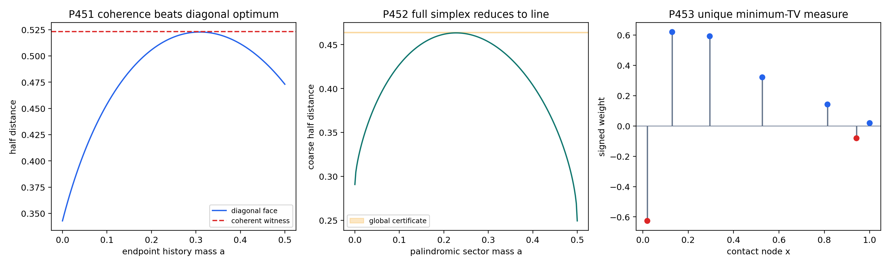

# FIN Local Research Checkpoint P451–P453

## Coherence Advantage, Global Coarse-Erasure Symmetry, and Canonical Jordan Representation

**Release:** 10.40  
**Version:** 1.0.0  
**Publication date:** 2026-08-01  
**Creator:** Żuchowski, Krzysztof  
**Affiliation:** Independent Researcher — Fractal Information Theory Project  
**ORCID:** 0009-0002-0909-3613  
**Resource type:** Publication — Preprint  
**Language:** English  
**License:** CC BY 4.0

---

# 1. Executive summary

This checkpoint completes local analytical and computational Programs P451,
P452, and P453. It uses no laboratory data, external audit, external AI
opinion, internet search, remote computation, or empirical record.

Three previously open mathematical boundaries are advanced.

1. **P451 — [Proven / Computer-assisted proof].** The complete diagonal face
   of the three-slot causal tester cone is reduced by concavity and finite
   symmetry to one variable. Its global maximizer is algebraic,

   \[
   a_* = 0.30884079156611205\ldots,
   \]

   and its half-distance is

   \[
   D_{\rm diag}^{\max}=0.5227633693019748\ldots .
   \]

   A separate exact-rational, strictly positive coherent tester has certified
   half-distance

   \[
   0.52332810026048937
   \le D_{\rm coh}\le
   0.52332810026049204.
   \]

   It exceeds the global diagonal upper bound by at least

   \[
   0.00056473095851463685.
   \]

   Therefore diagonal optimality is rigorously refuted. Eight deterministic
   full-cone starts converge near \(0.5233281002704\), but no matching
   21-dimensional dual certificate is yet available. The full causal optimum
   remains open.

2. **P452 — [Proven / Computer-assisted proof].** The coarse-graining gap in
   P446/P448 is localized to the two-survivor sector. A new analytic
   inequality proves that reversal symmetrization cannot decrease this
   sector whenever

   \[
   4q^2\cos^2\theta\ge 1.
   \]

   At the declared parameters \(q=4/5\), \(\theta=2\pi/15\), exact rational
   trigonometric enclosures give a positive margin

   \[
   4q^2\cos^2\theta-1
   =1.1364871761393385\ldots>0.
   \]

   Hence the complete four-sector probability simplex reduces to the P446
   palindromic line. The old line certificate is now a full-simplex theorem:

   \[
   0.46327828319203235
   \le D_{\rm coarse}^{\max}
   \le 0.4642707484333634,
   \]

   with gap \(0.0009924652413310642<10^{-3}\). This improves the P448 global
   upper bound by \(0.0023597549471144896\).

3. **P453 — [Proven, conditional on inherited certified inputs].** P429 gave
   a locally unique seven-contact primal–dual solution, while P430 proved its
   dual polynomial globally feasible. P453 adds the missing strict
   complementarity argument. Every global primal optimizer must place its
   positive Jordan measure on the five zero contacts of the dual and its
   negative Jordan measure on the two \(-1\) contacts. The seven nodes are
   distinct, with minimum certified separation greater than
   \(0.05815515198\), and their Vandermonde determinant is bounded away from
   zero by \(1.4954513576571674\times10^{-9}\). The weights are therefore
   unique. The P429 measure is the unique global minimum-negative-mass
   representation and, at fixed signed mass, the unique minimum-total-
   variation representation.

The checkpoint constructs three typed objects:

- **O167 — Causal-Coherence Advantage Witness;**
- **O168 — Coarse-Erasure Symmetrization Certificate;**
- **O169 — Strict-Complementarity Jordan Gauge Fixer.**

These are mathematical and operational-design results. They do not provide
a selector, canonical physical orientation, dimensional unit, apparatus,
laboratory record, completed legacy-to-strict bridge, physical-role transfer,
Standard Model, gravity theory, \(L_{\rm total}\), or Theory of Everything.

---

# 2. Confidence convention

| Label | Meaning in this checkpoint |
|---|---|
| [Proven] | Analytic consequence of stated premises, with exact symbolic or finite algebraic verification |
| [Computer-assisted proof] | Finite certificate using rational intervals, exact root isolation, or exhaustive interval branching |
| [Strong evidence] | Deterministic numerical evidence with falsification tests, but no complete proof certificate |
| [Conditional] | Correct only after an explicitly supplied mathematical or operational premise |
| [Open] | The present artifacts do not decide the question |
| [Blocked by external evidence] | A real laboratory, custody, calibration, or independent record is indispensable |

---

# 3. Inherited assumptions and guardrails

## 3.1 Accepted mathematical inputs

The following local results are used as working facts unless explicitly
falsified here.

- The reduced one-qubit phase/dephasing Choi family is supplied at the stated
  dimensionless parameters.
- P445 proves the exact two-slot diagonal-support comb reduction.
- P446 proves a \(10^{-3}\) interval upper/lower certificate on the
  palindromic three-use erasure-code line.
- P448 proves concavity of the fine-grained erasure majorant and a global
  full-simplex upper bound for that majorant.
- P449 proves the exact recursive compressed causal-support cone

  \[
  \mathcal C_n=
  \{B_0\oplus B_1:\ B_0,B_1\succeq0,\ B_0+B_1\in\mathcal C_{n-1}\}.
  \]

- P429 certifies one unique seven-contact KKT solution in a declared exact
  rational box.
- P430 certifies the associated dual polynomial globally inside
  \([-1,0]\) on \([0,1]\).
- P450 proves that twelve moments alone admit exact null-cycle
  representation gauge freedom.

## 3.2 Kernel split

The historical/intermediate bridge kernel and strict working kernel remain
distinct:

\[
K_{\rm legacy,ont}(d)=
\frac{\alpha_{\rm geo}\cos(\omega d+\phi)}{1+\beta_{\rm tors}d},
\]

\[
K_{\rm strict,gate}(d)=
\frac{\cos(\omega d+\phi)}{1+\beta d^\eta}.
\]

The locally researched Kernel new Legacy / Legacy* instance remains a
historical intermediate subclass, not the strict kernel. None of P451–P453
substitutes one kernel for the other. The programs consume already typed
downstream reduced-channel or strict-moment objects.

No legacy electroweak, electromagnetic, gravitational-hierarchy, or other
physical role is transferred.

## 3.3 Selector, units, and physics

- QW-2191 remains open.
- Chronological slot order is a supplied causal interface, not a strict
  source of Z12 orientation.
- All channel parameters and times in this checkpoint are dimensionless.
- A mathematical tester is not an apparatus.
- A canonical signed measure is not a physical preparation.
- Synthetic computations are not laboratory evidence.
- The internal ontology remains

  \[
  \text{nadsoliton}\to\text{light}\to\text{matter}
  \to\text{emergent observer},
  \]

  with no lower informational layer beneath the nadsoliton.

---

# 4. Current state map before P451–P453

| Lane | Inherited state | Question attacked here | Outcome |
|---|---|---|---|
| Three-slot causal discrimination | P449 coherent echo refutes GHZ; global optimum open | Is the diagonal face globally solvable, and can coherence beat it? | Diagonal face solved; coherent advantage certified; full cone open |
| Three-use erasure code | P446 line proof; P448 looser full-simplex majorant | Can the actual coarse objective be symmetrized? | Yes under an explicit analytic condition; full-simplex \(10^{-3}\) theorem |
| Signed-moment representation | P430 global value; P450 representation gauge | Is the minimum-negativity optimizer globally unique? | Yes by strict complementarity plus Vandermonde injectivity |
| Selector/orientation | QW-2191 open | Not imported | Unchanged |
| Dimensional source | No canonical unit | Not imported | Unchanged |
| Laboratory evidence | None admitted | Not fabricated | Unchanged |
| Legacy-to-strict bridge | Incomplete | Not replayed | Unchanged |

---

# 5. Program P451 — diagonal globality and causal coherence

## 5.1 Exact question

For three uses of the reduced memoryless phase/dephasing channel with

\[
q=\frac45,\qquad \theta=\frac\pi8,
\]

determine the global optimum on the full diagonal history simplex. Then test
whether an admissible off-diagonal normalizer in the exact P449 cone can
strictly exceed that optimum.

## 5.2 Object type and objective

Let \(\Delta_3\) be the compressed three-use process difference on the eight
diagonal Choi histories. For \(N\in\mathcal C_3\), define

\[
D(N)=\frac12\left\lVert
N^{1/2}\Delta_3N^{1/2}
\right\rVert_1.
\]

The nuclear-norm variational formula makes \(D\) concave in \(N\). This is
the same mathematical half-distance used in P445 and P449.

## 5.3 Global reduction of the diagonal face

A diagonal \(N\) is a probability law on eight binary histories. The
memoryless process is invariant under the six permutations of the three
slots and global bit complement. Averaging a diagonal law over this finite
group cannot lower the concave invariant objective.

The averaged law has the form

\[
t_{000}=t_{111}=a,
\qquad
t_h=b=\frac{1-2a}{6}quad
(h\ne000,111),
\]

where \(0\le a\le1/2\). Thus every diagonal tester is dominated by one point
on this line.

## 5.4 Exact one-variable formula

Block diagonalization under the same finite symmetry gives

\[
D_{\rm diag}(a)=\sqrt{R(a)}+
\frac{12-24a}{125}\sqrt{2-\sqrt2},
\]

with

\[
R(a)=\frac{16}{15625}
\left[
(-3520+1568\sqrt2)a^2
+(1532-414\sqrt2)a
+242-121\sqrt2
\right].
\]

The squared stationary equation is, up to the nonzero factor
\(-2048/244140625\),

\[
\begin{aligned}
0={}&(-8836992+5639168\sqrt2)a^2\\
&+(3415528-1972208\sqrt2)a\\
&-323159+149850\sqrt2.
\end{aligned}
\]

Squaring produces two algebraic roots. Only one obeys the positive
unsquared derivative branch. It is

\[
\begin{aligned}
a_*={}&-
\frac{5177925}{28304679968}
\sqrt{3504977-2461052\sqrt2}\\
&-
\frac{413025\sqrt2}{3538084996}
\sqrt{3504977-2461052\sqrt2}\\
&+\frac{3691\sqrt2}{58384}
+\frac{31987}{116768}.
\end{aligned}
\]

Exact symbolic substitution gives zero residual. Nested rational square-root
enclosures give

\[
a_*=0.30884079156611205\ldots
\]

and

\[
D_{\rm diag}^{\max}=0.5227633693019748\ldots .
\]

Concavity proves this stationary point is globally maximizing on the whole
diagonal face. The success probability on that face is

\[
p_{\rm succ,diag}^{\max}
=\frac{1+D_{\rm diag}^{\max}}2
=0.7613816846509874\ldots .
\]

## 5.5 Exact-rational coherent witness

Define \(N=B_0\oplus B_1\) by

\[
B_0=\begin{pmatrix}
A&u&u&0\\
u&B&0&-u\\
u&0&B&-u\\
0&-u&-u&C
\end{pmatrix},
\qquad
B_1=\begin{pmatrix}
C&-u&-u&0\\
-u&B&0&u\\
-u&0&B&u\\
0&u&u&A
\end{pmatrix},
\]

where

\[
A=\frac{143583}{500000},\quad
B=\frac{68777}{1000000},\quad
C=\frac{941}{12500},\quad
u=\frac{9493}{1000000}.
\]

Both blocks are congruent. One eigenvector has eigenvalue \(B>0\), and
Sylvester reduction of the remaining three-dimensional block gives the exact
positive minors

\[
AB-2u^2=
\frac{4892545471}{250000000000}>0,
\]

\[
ABC-2u^2(A+C)=
\frac{355371546810313}{250000000000000000}>0.
\]

Therefore \(B_0,B_1\succ0\). Moreover,

\[
B_0+B_1=
\operatorname{diag}(A+C,2B,2B,A+C),
\]

and \(A+C+2B=1/2\). This lies exactly in \(\mathcal C_2\), so the P449
recursion admits \(N\in\mathcal C_3\). The floating minimum eigenvalue
\(0.0577247734\) is only a diagnostic; positivity follows from the rational
minors.

## 5.6 Trace-distance certificate

The exact trigonometric entries of \(\Delta_3\) are enclosed using rational
Machin/Taylor intervals. Their midpoints are rounded to 18-decimal rational
numbers. For positive \(N\),

\[
N\Delta_3
\sim N^{1/2}\Delta_3N^{1/2},
\]

so their eigenvalues agree. The rational midpoint characteristic polynomial
has eight real roots, each isolated in a disjoint exact rational interval.
The residual entry radius is at most

\[
4.175005697635287\times10^{-17}.
\]

Using \(\lVert N\rVert_2\le\operatorname{Tr}N=1\), the paid half-nuclear
perturbation is at most

\[
1.3360018232432918\times10^{-15}.
\]

The final certified value is

\[
0.52332810026048937
\le D(N)\le
0.52332810026049204.
\]

Hence

\[
D(N)-D_{\rm diag}^{\max}
\ge0.00056473095851463685>0.
\]

**P451 verdict:** diagonal optimality is **[Refuted]**. The displayed
coherent witness and its advantage are **[Computer-assisted proof]**. The
complete 21-dimensional optimum is **[Open]**.

## 5.7 Full-cone falsification scout

An interior effect parameterization was used:

\[
C_0=N_1^{1/2}E_2N_1^{1/2},\qquad
B_0=N_2^{1/2}E_3N_2^{1/2},
\]

with logistic spectral effects \(0\prec E_j\prec I\). Eight deterministic
starts converge near \(0.5233281002704\), close to but slightly above the
rational witness. This is **[Strong evidence]** for the location of a smooth
interior optimum. It is not promoted: no exact KKT box and no matching comb
dual are exported.

---

# 6. Program P452 — closing the coarse-erasure symmetrization gap

## 6.1 Exact question

P448 could symmetrize a fine-grained upper majorant, but the operational
P446 objective discards the computational values of lost bits. Does the
actual coarse objective still obey reversal symmetrization on the complete
four-sector simplex?

## 6.2 Localizing the only gap

Let \(s\) be the number of surviving qubits.

- For \(s=3\), nothing is lost; coarse and fine forms coincide.
- For \(s=1\), the output is a two-dimensional skew block. All lost-value
  amplitudes have the same sign, so absolute value commutes with their sum;
  coarse and fine forms again coincide.
- Only \(s=2\) is nontrivial. If \(v_0,v_1\in\mathbb R^3\) are the skew-block
  vectors for the two lost values, then

  \[
  D_{2,\rm coarse}=\lVert v_0+v_1\rVert_2,
  \qquad
  D_{2,\rm fine}=\lVert v_0\rVert_2+\lVert v_1\rVert_2.
  \]

Their exact disclosure defect is

\[
\delta_2=
\frac{2(\lVert v_0\rVert\lVert v_1\rVert-v_0\cdot v_1)}
{\lVert v_0\rVert+\lVert v_1\rVert+\lVert v_0+v_1\rVert}.
\]

This explains why the P448 majorant can be strict without introducing a new
channel or a hidden physical effect: it reveals a classical label that the
coarse experiment discards.

## 6.3 Analytic two-survivor inequality

Write the square roots of the four sector probabilities as

\[
(x,y,z,w)=
(\sqrt{p_0},\sqrt{p_1},\sqrt{p_2},\sqrt{p_3}).
\]

Set

\[
x=\sqrt2X\cos\alpha,\quad
w=\sqrt2X\sin\alpha,
\]

\[
y=\sqrt2Y\cos\beta,\quad
z=\sqrt2Y\sin\beta,
\]

with \(\alpha,\beta\in[0,\pi/2]\) and \(r=X/Y\ge0\). The reversal average
has square-root masses \((X,Y,Y,X)\).

After the \(S_2\) irreducible block reduction, the difference

\[
D_2(\operatorname{sym}p)^2-D_2(p)^2
\]

is a nonnegative scale times a quadratic polynomial in \(r\). Its constant
coefficient is

\[
\frac19\cos^2(2\beta)\ge0.
\]

Its linear coefficient is proportional to

\[
1-\sin(2\beta)\cos(\alpha-\beta)\ge0.
\]

Its quadratic coefficient is

\[
Q=-\frac13\cos(2\alpha)\cos(2\beta)
+\gamma\cos^2(\alpha+\beta),
\]

where

\[
\gamma=\frac{4q^2\cos^2\theta}{3}.
\]

If \(\cos(2\alpha)\cos(2\beta)\le0\), then \(Q\ge0\) immediately. If the
product is nonnegative, use

\[
\cos^2(\alpha+\beta)
-\cos(2\alpha)\cos(2\beta)
=\sin^2(\alpha-\beta)\ge0.
\]

Thus \(Q\ge0\) whenever \(\gamma\ge1/3\), equivalently

\[
4q^2\cos^2\theta\ge1.
\]

At \(q=4/5\), \(\theta=2\pi/15\), exact rational cosine intervals certify
the strict margin \(1.1364871761393385\ldots\).

Therefore

\[
D_2(p)\le D_2\!\left(\frac{p+p^{\rm rev}}2\right).
\]

The \(s=1,3\) components obey the same inequality by the inherited concavity
argument. Hence the complete coarse objective satisfies

\[
D_{\rm coarse}(p)\le
D_{\rm coarse}\!\left(\frac{p+p^{\rm rev}}2\right).
\]

## 6.4 Global full-simplex certificate

The reversal average is exactly

\[
p(a)=(a,1/2-a,1/2-a,a).
\]

P446 already exhaustively covered \(0\le a\le1/2\) using outward-rounded
binary64 interval arithmetic. P452 supplies the missing theorem that licenses
the reduction of every full-simplex point to that line. Consequently

\[
0.46327828319203235
\le \max_{p\in\Delta_3}D_{\rm coarse}(p)
\le0.4642707484333634.
\]

The gap is

\[
0.0009924652413310642<10^{-3}.
\]

This is a stricter operational upper bound than P448:

\[
0.4666305033804779-0.4642707484333634
=0.0023597549471144896.
\]

**P452 verdict:** the full-simplex reversal theorem is **[Proven]** and the
numerical global bracket is **[Computer-assisted proof]**. Exact optimizer
uniqueness and unrestricted adaptive-code optimality remain **[Open]**.

---

# 7. Program P453 — global uniqueness of the minimum-negativity measure

## 7.1 Exact question

P430 proved the value of the signed-moment optimization globally but did not
claim every global optimizer was identical. P450 then showed that the moment
vector alone admits exact null-cycle representation freedom. Does the
minimum-negative-mass variational problem itself remove that freedom?

## 7.2 Primal and dual objects

Let

\[
\mu=\mu_+-\mu_-
\]

be a finite signed measure on \([0,1]\) reproducing the twelve strict
moments. Its Jordan negative mass is

\[
N(\mu)=\mu_-([0,1]).
\]

Let \(p\) be the P429/P430 dual polynomial, satisfying

\[
-1\le p(x)\le0.
\]

Weak duality is the identity and inequality

\[
\begin{aligned}
N(\mu)-\int p\,d\mu
&=\int(-p)\,d\mu_+
+\int(1+p)\,d\mu_-\\
&\ge0.
\end{aligned}
\]

## 7.3 Equality forces the support

For any global primal optimizer, equality with the dual optimum holds. Both
integrands on the right are nonnegative, so

\[
\operatorname{supp}\mu_+\subseteq\{x:p(x)=0\},
\]

\[
\operatorname{supp}\mu_-\subseteq\{x:p(x)=-1\}.
\]

P430 did more than show weak feasibility. Its curvature cells prove strict
local extrema at the six interior contacts; its endpoint derivative proves
the unique endpoint contact; and its Bernstein complement cells prove strict
inequality everywhere else. Hence

\[
\{p=-1\}=\{x_0,x_5\},
\]

\[
\{p=0\}=\{x_1,x_2,x_3,x_4,1\}.
\]

Every global optimizer is therefore supported on these exact seven nodes,
with the forced sign pattern

\[
(-,+,+,+,+,-,+).
\]

## 7.4 Vandermonde injectivity

The P429 node boxes are strictly ordered. Their minimum pairwise separation
is certified above

\[
0.058155151982592045.
\]

For the seven-by-seven moment matrix

\[
V_{ki}=x_i^k,
\qquad k,i=0,\ldots,6,
\]

the determinant is

\[
\det V=\prod_{0\le i<j\le6}(x_j-x_i).
\]

Interval multiplication gives

\[
|\det V|>1.4954513576571674\times10^{-9}>0.
\]

Thus the first seven moment equations already determine all seven weights
uniquely. The remaining five equations are satisfied by the inherited P429
Krawczyk solution. No second global optimizer can exist.

## 7.5 Minimum total variation

The signed zeroth moment

\[
m_0=\mu([0,1])
\]

is fixed. Therefore

\[
\lVert\mu\rVert_{\rm TV}=m_0+2N(\mu).
\]

Minimizing negative mass is equivalent to minimizing total variation. The
unique optimum has

\[
N_*=0.7073534677231137\ldots,
\]

\[
\lVert\mu_*\rVert_{\rm TV}
=2.401532838636556\ldots .
\]

## 7.6 What is and is not canonical

Within the declared variational problem, the result is canonical: there is
one minimum-TV signed measure, hence one reduced atomic input to O163.

Moments alone are still insufficient. Removing the minimum-negativity rule
restores the P450 gauge

\[
\mu_\epsilon=\mu_*+\epsilon\nu_{12},
\]

where \(\nu_{12}\) annihilates moments zero through eleven. Thus P453 does
not falsify P450; it supplies exactly the additional mathematical rule P450
proved necessary.

The rule is not an internally generated apparatus. A real implementation
would still have to demonstrate that its preparation instrument realizes
the seven atoms and signs.

**P453 verdict:** global optimizer uniqueness is **[Proven conditional on
the inherited P429/P430 computer-assisted certificates and signed-moment
duality]**. Physical preparation remains **[Blocked by external evidence]**.

---

# 8. Newly constructed theoretical objects

## 8.1 O167 — Causal-Coherence Advantage Witness

| Required field | Definition and audit |
|---|---|
| Name | Causal-Coherence Advantage Witness |
| Domain/codomain | Exact rational \(N\in\mathcal C_3\mapsto D(N)\in\mathbb R_{\ge0}\) |
| Complete definition | The displayed block matrix \(B_0\oplus B_1\) with rational \(A,B,C,u\) |
| Premises | P449 cone recursion; declared reduced \(q=4/5,\theta=\pi/8\) channel |
| Transformation law | Global complement exchanges the blocks and signs but preserves \(D\) |
| Generated theorem | A coherent causal tester exceeds the global diagonal optimum |
| Necessity test | Setting \(u=0\) returns to the diagonal face and removes the certified advantage |
| Removal attempt | The complete diagonal optimization proves no diagonal substitute can match the witness |
| Strict/legacy relation | Downstream reduced-channel object; derives neither kernel and substitutes neither |
| Selector dependence | None; chronological interface is supplied and does not discharge QW-2191 |
| Dimensional status | Dimensionless |
| Operational interpretation | Mathematical three-slot tester normalizer |
| Failure mode | Does not establish the full 21-dimensional optimum or laboratory implementability |
| Confidence | **[Computer-assisted proof]** for feasibility and advantage |

## 8.2 O168 — Coarse-Erasure Symmetrization Certificate

| Required field | Definition and audit |
|---|---|
| Name | Coarse-Erasure Symmetrization Certificate |
| Domain/codomain | \(p\in\Delta_3\mapsto (p+p^{\rm rev})/2\) with a monotonicity theorem for \(D_{\rm coarse}\) |
| Complete definition | The survivor-sector decomposition plus the nonnegative quadratic coefficients under \(4q^2\cos^2\theta\ge1\) |
| Premises | Three-use Hamming-sector code; heralded loss; \(q=4/5,\theta=2\pi/15\) |
| Transformation law | Invariant under sector reversal |
| Generated theorem | Complete simplex reduces to the palindromic line |
| Necessity test | Without the \(s=2\) inequality, P448 only controls a strictly larger disclosed-label majorant |
| Removal attempt | Direct triangle inequality reproduces only the old loose P448 upper bound |
| Strict/legacy relation | Kernel-split robust downstream code theorem |
| Selector dependence | None; reversal averaging does not select an orientation |
| Dimensional status | Dimensionless |
| Operational interpretation | Exact mathematical control of lost-label coarse graining |
| Failure mode | The condition may fail for other \(q,\theta\); unrestricted input families remain open |
| Confidence | **[Proven]** reduction; **[Computer-assisted proof]** value bracket |

## 8.3 O169 — Strict-Complementarity Jordan Gauge Fixer

| Required field | Definition and audit |
|---|---|
| Name | Strict-Complementarity Jordan Gauge Fixer |
| Domain/codomain | Strict moment vector plus minimum-negativity variational rule \(\mapsto\) unique signed measure |
| Complete definition | Equality support under the P430 dual polynomial followed by seven-node Vandermonde inversion |
| Premises | P429 Krawczyk box; P430 global strict contact cells; inherited signed-measure duality |
| Transformation law | Coordinate changes must push forward moments, measure, and dual polynomial together |
| Generated theorem | Unique global minimum-negative-mass and minimum-TV representation |
| Necessity test | The P450 null cycle survives if the variational rule is removed |
| Removal attempt | Moments alone give an unbounded O163 risk gauge orbit |
| Strict/legacy relation | Uses strict moments; no legacy substitution or role transfer |
| Selector dependence | The coordinate chart is supplied; no canonical physical orientation is generated |
| Dimensional status | Dimensionless |
| Operational interpretation | Canonical mathematical input for a sampler, not a preparation device |
| Failure mode | A different declared objective may select a different representation; physical realization remains external |
| Confidence | **[Proven conditional on inherited certified inputs]** |

---

# 9. Falsification attempts and failed approaches

## 9.1 P451: diagonal conjecture destroyed

The aesthetically simplest conjecture was that the group-symmetrized
diagonal optimum might already solve the complete causal cone. It fails. The
rational coherent witness lies strictly above its certified upper bound.
This counterexample is not a numerical accident: positivity, causality, and
the distance gap all have finite certificates.

## 9.2 P451: floating optimum not promoted

Eight full-cone starts agree to approximately ten decimal places. This could
tempt a global claim. It is rejected because the objective is concave but is
being maximized, the cone has 21 affine dimensions, and no supporting dual
matrix or interval KKT inclusion has been constructed.

## 9.3 P452: fine majorant no longer used as equality

P448's revealed-label majorant can be strictly larger than the coarse
objective. P452 does not call that majorant the channel value. It proves a
separate inequality for the exact coarse two-survivor block and then reuses
only the already valid P446 line cover.

## 9.4 P452: parameter universality rejected

The analytic condition \(4q^2\cos^2\theta\ge1\) is part of the theorem. No
claim is made that reversal symmetrization holds for every coherence and
phase.

## 9.5 P453: moments-alone canonicity remains refuted

P453 does not retract the P450 no-go. The canonical object arises only after
adding the minimum-negative-mass variational rule. Without it, the exact
finite-difference null cycle remains.

## 9.6 P453: mathematical representation is not preparation

Global uniqueness of a measure does not force a physical source to emit its
atoms. Any such assertion would require apparatus, calibration, event-level
records, custody, and an independently frozen protocol.

---

# 10. Reproducibility and numerical boundaries

| Program | Exact/finite method | Floating method and role | Decisive boundary |
|---|---|---|---|
| P451 | Nested radical intervals; exact rational PSD minors; rational characteristic polynomial root isolation; nuclear perturbation bound | Eight seeded L-BFGS-B starts only scout the full cone | No full-cone dual certificate |
| P452 | Analytic nonnegative-coefficient proof; exact rational cosine margin; inherited outward 1D interval cover | 256 seeded random points are falsification only | Exact maximizer/uniqueness not proved |
| P453 | Strict complementary support theorem; exact node boxes; rational Vandermonde lower bound | Midpoints appear only in figures | Inherits P429/P430 and duality assumptions |

The P451 characteristic polynomial has eight disjoint real root intervals.
The midpoint-to-exact perturbation is paid after, rather than ignored. The
P452 random audit found no positive symmetrization defect; the theorem does
not depend on this audit. The P453 determinant uses lower node separations,
not rounded midpoint nodes.

---

# 11. Legacy/strict, selector, dimensional, and operational audit

| Boundary | Result after P451–P453 |
|---|---|
| K_legacy_ont versus K_strict_gate | Still separated; no substitution |
| Legacy* / Kernel new Legacy | Historical bridge subclass only; not an input to these proofs |
| Self-coupling diagram | Still intuition/provenance, not a typed feedback state map |
| Legacy-to-strict completion | Open |
| Legacy physical-role transfer | Not started |
| QW-2191 selector | Open |
| Canonical orientation/phase origin | Not generated |
| Dimensional time/length/action | Not generated |
| State/preparation/instrument/apparatus | Mathematical interfaces only |
| Laboratory record | None |
| Independent custody/hold-out | None executed |
| Information-to-thermodynamic entropy | Not established |
| Standard Model / gravity / \(L_{\rm total}\) / ToE | Not established |

The dual functional calculus

\[
U_t=e^{-itA},\qquad P_t=e^{-tA}
\]

remains mathematical wave/heat duality. P451's causal coherence does not
turn this duality into an observer, clock, environment, or record.

---

# 12. Ranked next research programs

The following ranking is for decisive local analytical/computational
progress, not physical plausibility. Probabilities are judgmental planning
weights, not theorem probabilities.

| Rank | Program | Exact target | Cheapest decisive method | Probability of decisive local result |
|---:|---|---|---|---:|
| 1 | **P454** | Matching primal/dual certificate for the full 21D P451 causal cone | Derive the nested comb SDP dual; solve the symmetry-reduced KKT system; rationalize and verify PSD slacks | 0.72 |
| 2 | **P455** | Exact optimum on the coherent symmetry face containing O167 | Symbolic block diagonalization, algebraic stationarity, interval root isolation | 0.81 |
| 3 | **P456** | Decide whether O167 coherence advantage persists for \(n=4\) | Extend P449 recursion; construct one rational witness and compare with the global diagonal face | 0.69 |
| 4 | **P457** | Tighten P452 full-simplex value from \(10^{-3}\) to \(10^{-6}\) | Re-run the licensed 1D outward branch cover with a smaller tolerance | 0.94 |
| 5 | **P458** | Prove or refute uniqueness of the P452 palindromic maximizer | Derivative interval isolation and monotonicity cells on \([0,1/2]\) | 0.84 |
| 6 | **P459** | Propagate P453 global uniqueness through the complete O163 detector box | Combine the unique contact support with P447 atom intervals and allocation sensitivity | 0.91 |
| 7 | **P460** | Compare minimum-TV gauge fixing with a representation-quotient estimator | Construct null-cycle-invariant estimators or prove a finite-dimensional no-go | 0.63 |
| 8 | **P461** | Formalize the P452 trigonometric/algebraic reduction | Lean proof of the coefficient signs, leaving only a typed cosine provider if necessary | 0.58 |
| 9 | **P462** | Formalize P453 complementarity and Vandermonde uniqueness | Lean finite-measure support lemma plus finite Vandermonde theorem | 0.61 |
| 10 | **P463** | Freeze a preparation-level executable contract for O169 | Typed manifest, admission validator, synthetic integration test explicitly marked nonphysical | 0.88 |

The selected next batch is

\[
\boxed{P454\longrightarrow P455\longrightarrow P457}.
\]

P454 attacks the most important open theorem. P455 supplies an exact fallback
if the full dual cannot be closed. P457 is cheap, licensed by P452, and
guarantees a durable quantitative improvement before a later risky batch.

---

# 13. Exact artifact list

- FIN_Local_Research_Checkpoint_P451_P453_EN.md
- FIN_Local_Research_Checkpoint_P451_P453_EN.tex
- FIN_Local_Research_Checkpoint_P451_P453_EN.pdf
- FIN_Current_Local_Research_Report_EN.pdf
- FIN_Local_Research_Checkpoint_P451_P453_State.json
- RELEASE_10_40_PROGRAMS_451_453.md
- FIN_Checkpoint_P451_P453_AGENTS_Guardrail.txt
- FIN_PROGRAMS_451_453_RELEASE_MANIFEST.sha256
- FIN_Programs_451_453_Results.json
- FIN_Programs_451_453_Summary.csv
- FIN_Programs_451_453_P451_Causal_Coherence.csv
- FIN_Programs_451_453_P451_Coherent_Witness.npz
- FIN_Programs_451_453_P452_Coarse_Symmetrization.csv
- FIN_Programs_451_453_P453_Canonical_Representation.csv
- FIN_Programs_451_453_Figures/p451_p453_coherence_symmetry_and_gauge_fixing.png
- fin_programs_451_453.py
- fin_programs_451_453_to_latex.py
- test_fin_programs_451_453.py
- test_fin_checkpoint_p451_p453.py

---

# 14. Restart instructions

Run the scientific batch:

    MPLCONFIGDIR=/tmp/fin-mpl-1038 python3 fin_programs_451_453.py

Run current and inherited regression tests:

    MPLCONFIGDIR=/tmp/fin-mpl-1038 python3 -m unittest -v \
      test_fin_programs_451_453.py \
      test_fin_checkpoint_p451_p453.py \
      test_fin_checkpoint_p448_p450.py \
      test_fin_checkpoint_p445_p447.py

Regenerate and compile the monograph:

    python3 fin_programs_451_453_to_latex.py
    lualatex -interaction=nonstopmode -halt-on-error \
      FIN_Local_Research_Checkpoint_P451_P453_EN.tex
    lualatex -interaction=nonstopmode -halt-on-error \
      FIN_Local_Research_Checkpoint_P451_P453_EN.tex

Verify the immutable package:

    sha256sum -c FIN_PROGRAMS_451_453_RELEASE_MANIFEST.sha256

Before P454, reread the latest AGENTS.md guardrail and preserve all kernel,
selector, dimensional, and physical-evidence boundaries.

---

# 15. Final conclusion

P451–P453 resolve three precise mathematical ambiguities without promoting
FIN to physics.

The three-slot reduced channel needs genuine causal coherence: the complete
diagonal theory is solvable and is strictly suboptimal. The three-use
heralded erasure code no longer has a full-simplex symmetry gap: its coarse
objective is globally controlled by the palindromic line under a proved
parameter condition. The strict signed-moment problem no longer has multiple
minimum-negativity representations: strict complementarity forces seven
contacts, and Vandermonde injectivity forces their weights.

The deepest surviving interpretation of this batch is therefore a family of
finite, dimensionless operator-optimization structures with increasingly
sharp causal, coarse-graining, and variational interfaces. The missing
physics is still missing: no theorem here creates a physical clock, unit,
preparation device, detector, observer, laboratory record, or unique strict
orientation.
