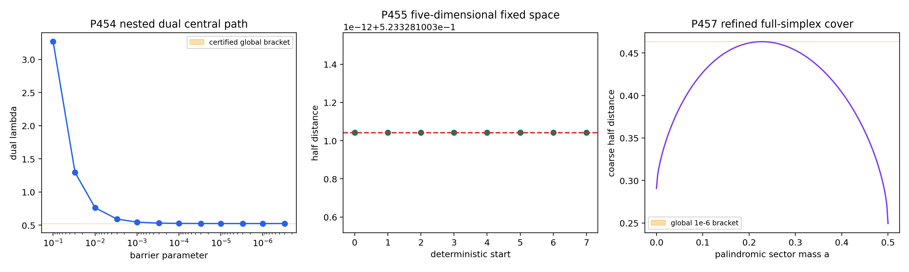

# FIN Local Research Checkpoint P454–P457

## A Certified Nested Comb Dual, an Ordered-Symmetry Obstruction, and a Six-Decimal Global Cover

**Release:** 10.41  
**Version:** 1.0.0  
**Publication date:** 2026-08-01  
**Creator:** Żuchowski, Krzysztof  
**Affiliation:** Independent Researcher — Fractal Information Theory Project  
**ORCID:** 0009-0002-0909-3613  
**Resource type:** Publication — Preprint  
**Language:** English  
**License:** CC BY 4.0

---

# 1. Executive summary

This checkpoint completes local Programs P454, P455, and P457. It uses only
analytical derivation, finite-dimensional linear algebra, rational
arithmetic, directed intervals, and deterministic local optimization. It
contains no laboratory data, external audit, internet result, remote
computation, or physical evidence.

The three programs produce the following results.

1. **P454 — [Proven / Computer-assisted proof].** The complete three-slot
   causal discrimination problem from P451 is written as a primal
   semidefinite program and a nested dual with matrix sizes

   \[
   8\longrightarrow4\longrightarrow2\longrightarrow1.
   \]

   A dependency-free log-determinant central-path scout locates a dual near
   the primal value. All entries are then rounded to explicit rationals. Six
   matrix slacks and two scalar slacks are certified strictly positive using
   exact Sylvester criteria. The two trigonometric slacks retain a margin
   greater than \(4.9999999969\times10^{-7}\) after paying the full operator
   perturbation. Together with the inherited P451 coherent primal witness,
   this proves the global full-cone bracket

   \[
   0.52332810026048937
   \le D_3^{\rm global}
   \le0.523334700252.
   \]

   Its exact width is

   \[
   0.00000659999151063.
   \]

   The corresponding success probability is confined to

   \[
   0.761664050130244685
   \le p_{\rm succ}^{\rm global}
   \le0.761667350126.
   \]

2. **P455 — [Proven / Strong evidence].** The complex three-slot causal cone
   has 21 affine dimensions. Complex conjugation and global bit complement
   can be averaged because the objective is concave and invariant, so an
   optimizer has a real, complement-fixed representative. The real cone has
   14 affine dimensions. Exact finite rank gives nine independent complement
   constraints and a five-dimensional fixed space. The O167 coherent ansatz
   has only three dimensions. Therefore two symmetry-allowed directions
   remain, and known symmetries alone cannot prove reduction to O167. This is
   a rigorous obstruction to the proposed symmetry shortcut. Eight
   deterministic searches over all five fixed dimensions return to the O167
   value within \(6.7\times10^{-16}\), with a negative sampled Hessian, but
   this non-improvement remains strong evidence rather than a theorem.

3. **P457 — [Computer-assisted proof].** P452 already licensed reversal
   reduction of the exact coarse erasure objective to the palindromic line.
   P457 performs a new outward-rounded cover at tolerance \(10^{-6}\). The
   cover evaluates 5,008 boxes and terminates with

   \[
   0.463278283192093
   \le D_{\rm coarse}^{\rm global}
   \le0.46327928294340853,
   \]

   whose width is

   \[
   9.997513155113325\times10^{-7}.
   \]

   This is a factor of approximately 992.7 narrower than the Release-10.40
   bound.

The checkpoint constructs three typed objects:

- **O170 — Nested Comb Dual Ladder;**
- **O171 — Ordered-Comb Symmetry Residual Space;**
- **O172 — Six-Decimal Coarse-Erasure Cover.**

No exact P454 optimizer, optimizer uniqueness, selector, canonical physical
orientation, dimensional unit, apparatus, laboratory record, complete
legacy-to-strict bridge, role-transfer theorem, Standard Model, gravity
theory, \(L_{\rm total}\), or Theory of Everything is claimed.

---

# 2. Confidence convention

| Label | Meaning |
|---|---|
| [Proven] | Exact analytic or finite algebraic result under declared premises |
| [Computer-assisted proof] | Finite rational/interval certificate with auditable code and artifacts |
| [Strong evidence] | Deterministic numerical agreement and falsification tests without a complete certificate |
| [Conditional] | Result depends on an explicitly supplied interface or variational rule |
| [Open] | Current artifacts do not decide the proposition |
| [Blocked by external evidence] | A laboratory, calibration, custody, or external record is indispensable |

---

# 3. Inherited assumptions and state map

## 3.1 Inputs retained from Release 10.40

- P449 gives the exact compressed causal recursion

  \[
  \mathcal C_n=
  \{B_0\oplus B_1:\ B_0,B_1\succeq0,
  \ B_0+B_1\in\mathcal C_{n-1}\}.
  \]

- P451 gives the certified rational coherent primal witness with

  \[
  D_{\rm primal}\ge0.52332810026048937.
  \]

- P452 proves reversal symmetrization of the declared actual coarse erasure
  objective, not merely its fine-label majorant.
- P446 provides the outward one-dimensional branch procedure reused in P457.
- P453 proves uniqueness of the minimum-negative-mass signed representation,
  conditional on its inherited certified inputs.

## 3.2 State map

| Lane | State before this checkpoint | New state |
|---|---|---|
| Three-slot causal optimum | Primal lower \(0.52332810026048937\); full optimum open | Rigorous global upper \(0.523334700252\); gap \(<6.7\times10^{-6}\) |
| Coherent symmetry face | Three-parameter O167 candidate | Five-dimensional exact fixed space; two residual directions proved |
| Coarse erasure code | Full-simplex gap \(<10^{-3}\) | Full-simplex gap \(<10^{-6}\) |
| P453 canonical gauge | Unique only inside minimum-TV rule | Unchanged |
| Selector/QW-2191 | Open | Unchanged |
| Dimensional source | Missing | Unchanged |
| Laboratory evidence | None | None |
| Legacy-to-strict bridge | Incomplete | Unchanged |

## 3.3 Kernel and ontology guardrails

The intermediate and strict kernels remain distinct:

\[
K_{\rm legacy,ont}(d)=
\frac{\alpha_{\rm geo}\cos(\omega d+\phi)}{1+\beta_{\rm tors}d},
\]

\[
K_{\rm strict,gate}(d)=
\frac{\cos(\omega d+\phi)}{1+\beta d^\eta}.
\]

Kernel new Legacy / Legacy* remains a researched historical/intermediate
bridge subclass and is not silently substituted for the strict kernel. The
present programs are downstream reduced-channel calculations. They derive
neither kernel and transfer no legacy physical role.

The internal ontology remains

\[
\text{nadsoliton}\to\text{light}\to\text{matter}
\to\text{emergent observer},
\]

with no lower informational layer beneath the nadsoliton.

---

# 4. Program P454 — exact nested comb dual and global bracket

## 4.1 Exact question

Can the full 21-dimensional three-slot causal optimization left open by P451
receive a matching rigorous upper bound without installing an external SDP
package or treating a floating optimizer as a theorem?

## 4.2 Primal SDP

Let \(\Delta=\Delta_3\) be the supplied eight-dimensional compressed process
difference. Introduce positive measurement testers \(T_+,T_-\succeq0\) and
positive causal-normalization layers

\[
B_0,B_1\in\mathbb H_+^4,
\qquad
C_0,C_1\in\mathbb H_+^2,
\qquad
d_0,d_1\ge0.
\]

The primal is

\[
\begin{aligned}
\text{maximize}\quad &
\frac12\operatorname{Tr}\!\left[\Delta(T_+-T_-)\right]\\
\text{subject to}\quad &
T_++T_-=B_0\oplus B_1,\\
&B_0+B_1=C_0\oplus C_1,\\
&C_0+C_1=\operatorname{diag}(d_0,d_1),\\
&d_0+d_1=1.
\end{aligned}
\]

For fixed normalization \(N=T_++T_-\), binary Helstrom optimization gives

\[
\max_{T_\pm}\frac12\operatorname{Tr}[\Delta(T_+-T_-)]
=\frac12\lVert N^{1/2}\Delta N^{1/2}\rVert_1.
\]

Thus the SDP is exactly the P451 full-cone objective, not a relaxation.

## 4.3 Dual derivation

Introduce Hermitian multipliers

\[
X_3\in\mathbb H^8,
\quad X_2\in\mathbb H^4,
\quad X_1\in\mathbb H^2,
\]

and scalar \(\lambda\). Taking the supremum over every positive primal
variable is finite precisely when

\[
X_3\succeq\frac{\Delta}{2},
\qquad
X_3\succeq-\frac{\Delta}{2},
\]

\[
X_2\succeq (X_3)_{00},
\qquad
X_2\succeq (X_3)_{11},
\]

\[
X_1\succeq (X_2)_{00},
\qquad
X_1\succeq (X_2)_{11},
\]

\[
\lambda\ge(X_1)_{00},
\qquad
\lambda\ge(X_1)_{11}.
\]

Here the subscripts denote the two equal-size principal blocks at the next
causal level. The dual is

\[
\text{minimize}\quad\lambda.
\]

This produces the new hierarchy

\[
\boxed{X_3\to X_2\to X_1\to\lambda},
\]

which is O170.

Both sides possess strict feasible points: the central normalized tester is
strictly primal feasible after a strictly positive outcome split, and large
scalar identities are strictly dual feasible. Finite-dimensional Slater
duality therefore applies. Weak duality alone already suffices for the
certified upper bound.

## 4.4 Dependency-free locator

No local cvxpy, cvxopt, SCS, Clarabel, or commercial SDP solver is available.
P454 therefore uses the local barrier

\[
\Phi_\mu=
\lambda-\mu\sum_{j=1}^{8}\log\det S_j,
\]

where \(S_j\) are the six matrix and two scalar dual slacks. Complex
conjugation swaps the first two constraints, so the dual variables can be
chosen real symmetric while \(\Delta\) remains imaginary Hermitian.

A deterministic feasible BFGS method with explicit Armijo backtracking
follows twelve barrier values from \(10^{-1}\) to \(3\times10^{-7}\). The last
point has

\[
\lambda_{\rm scout}=0.5233347002511172.
\]

The last barrier iteration does not meet the chosen gradient tolerance. It is
used only to locate rational matrices and is never itself the certificate.

## 4.5 Rationalization and exact positivity

Every entry of \(X_3,X_2,X_1\) is rounded to denominator \(10^{12}\), and
\(\lambda\) is rounded upward:

\[
\lambda_{\mathbb Q}
=\frac{130833675063}{250000000000}
=0.523334700252.
\]

The entries of \(\Delta/2\) are enclosed by the inherited rational
Machin/Taylor provider and rounded to denominator \(10^{20}\). The maximum
entry radius is paid using

\[
\lVert E\rVert_2\le8\max_{ij}|E_{ij}|.
\]

For each rational midpoint matrix slack \(S\), exact Sylvester tests are
applied to

\[
S-\frac{1}{2\,000\,000}I.
\]

All leading principal minors are strictly positive:

- eight for each \(8\times8\) trigonometric slack;
- four for each \(4\times4\) inherited slack;
- two for each \(2\times2\) inherited slack;
- one for each scalar slack.

The trigonometric operator perturbation is only

\[
3.0514767686602317\times10^{-16},
\]

so the certified exact minimum-eigenvalue lower bound for each top slack is

\[
4.9999999969485233\times10^{-7}>0.
\]

The other matrix slacks retain the exact margin \(1/2{,}000{,}000\), and the
two scalar slacks are approximately \(5.99997\times10^{-7}\) and
\(5.99995\times10^{-7}\). Thus the rational dual is strictly feasible.

## 4.6 Global theorem and limitation

Combining the P451 primal lower bound and P454 dual upper bound gives

\[
0.52332810026048937
\le D_3^{\rm global}
\le0.523334700252.
\]

The exact gap is

\[
\frac{659999151063}{10^{17}}
=6.59999151063\times10^{-6}.
\]

**P454 verdict:** the nested dual derivation is **[Proven]**, and the rational
upper bound plus global bracket are **[Computer-assisted proof]**. Exact
attainment by O167 and optimizer uniqueness remain **[Open]**.

---

# 5. Program P455 — ordered-comb symmetry residual space

## 5.1 Exact question

Can the three-parameter O167 face be derived from the symmetries already
present in the ordered three-slot cone, thereby converting its numerical
optimum into the full optimum?

## 5.2 Real causal tangent space

The P449 complex Hermitian affine dimension is 21. Because

\[
D(N)=D(\overline N)
\]

and \(D\) is concave, averaging \(N\) with \(\overline N\) cannot lower the
objective. Hence a real-symmetric optimizer exists.

The exact real affine recursion has dimension

\[
e_1=1,
\qquad e_n=e_{n-1}+\frac{2^{n-1}(2^{n-1}+1)}{2}.
\]

For three slots,

\[
e_3=1+3+10=14.
\]

An explicit integer basis consists of one last-level diagonal direction,
three real-symmetric \(C_0\) directions, and ten real-symmetric \(B_0\)
directions.

## 5.3 Global complement

Let \(J_8\) reverse all three history bits. The objective is invariant under
the induced global-complement action. Averaging with

\[
N\mapsto J_8NJ_8
\]

again cannot lower a concave invariant objective.

On the exact fourteen-direction integer basis, the linear constraints

\[
J_8NJ_8=N
\]

have rank nine. Therefore the real, complement-fixed affine space has

\[
14-9=5
\]

dimensions. The computation exports five exact nullspace vectors with
entries in \(\{-1,0,1\}\).

## 5.4 Why O167 is not symmetry-forced

The O167 form

\[
N(A,B,u)=B_0(A,B,u)\oplus B_1(A,B,u),
\]

with

\[
C=\frac12-A-2B
\]

has only three independent affine directions. Direct rank computation proves
that this face is contained in the five-dimensional fixed space but does not
fill it. The residual dimension is

\[
5-3=2.
\]

Thus complex conjugation plus global complement do not imply the O167 ansatz.
Any proof of that reduction needs one additional invariant, a KKT theorem, a
dual complementary-slackness argument, or an independent source law.

This is a rigorous obstruction, not a failed numerical search.

## 5.5 Falsification in all five dimensions

The O167 face optimization gives

\[
(A,B,u)=
(0.28716641518022373,
0.068777213178814,
0.009493712418100549)
\]

and

\[
D_{\rm face}=0.5233281002710417.
\]

The minimum normalizer eigenvalue is \(0.0577235542\), so the point is well
inside the positive region. Eight deterministic Nelder–Mead starts over all
five fixed coordinates give values between

\[
0.5233281002710413
\quad\text{and}\quad
0.5233281002710424.
\]

The maximum apparent gain over the face is

\[
6.661338147750939\times10^{-16}.
\]

A finite-difference Hessian in the five-dimensional fixed space has sampled
eigenvalues

\[
(-2.4559,-1.4969,-1.0050,-0.6617,-0.3045),
\]

all negative. This is strong, robust local evidence that the two residual
directions do not improve the candidate. It is not a proof of global
five-dimensional optimality.

**P455 verdict:** the five-dimensional fixed space and two-dimensional
residual are **[Proven]**. Return to the O167 value is **[Strong evidence]**.
The hypothesis that known symmetries alone force O167 is **[Refuted]**.

---

# 6. Program P457 — six-decimal full-simplex erasure cover

## 6.1 Exact question

After P452 converted the P446 palindromic line into a theorem for the complete
declared simplex, how much can the value bracket be tightened using the same
auditable outward arithmetic without a new conceptual assumption?

## 6.2 Licensed one-dimensional reduction

P452 proves

\[
D_{\rm coarse}(p)
\le D_{\rm coarse}\!\left(\frac{p+p^{\rm rev}}2\right)
\]

at \(q=4/5\), \(\theta=2\pi/15\). Every reversal average has the form

\[
p(a)=(a,1/2-a,1/2-a,a),
\qquad0\le a\le1/2.
\]

P457 changes only the interval tolerance, from \(10^{-3}\) to \(10^{-6}\).
No full-simplex point is omitted because P452 supplies the exact reduction.

## 6.3 Finite cover

The directed binary64 implementation expands every arithmetic primitive by
one representable number. Each branch cell receives an interval upper bound;
midpoint evaluations update a certified feasible lower bound. The run uses

- 5,008 evaluated boxes;
- 5,009 terminal boxes;
- deterministic initial interval \([0,1/2]\);
- no stochastic pruning.

The final bracket is

\[
0.463278283192093
\le D_{\rm coarse}^{\rm global}
\le0.46327928294340853.
\]

The width is

\[
9.997513155113325\times10^{-7}<10^{-6}.
\]

The best certified point has

\[
a=0.2276921272277832,
\]

and the conservative live maximizer hull is

\[
[0.2178955078125,0.234619140625].
\]

The new gap is approximately 992.712 times smaller than the P452 gap.

**P457 verdict:** the full-simplex bracket is **[Computer-assisted proof]**.
A closed-form maximizer, uniqueness, unrestricted inputs, adaptivity, and
laboratory performance remain **[Open]**.

---

# 7. Newly constructed theoretical objects

## 7.1 O170 — Nested Comb Dual Ladder

| Required field | Definition and audit |
|---|---|
| Name | Nested Comb Dual Ladder |
| Domain/codomain | Three-slot primal tester SDP \(\mapsto(X_3,X_2,X_1,\lambda)\) dual |
| Complete definition | The eight Loewner/scalar inequalities displayed in Section 4 |
| Premises | P449 causal recursion; declared reduced \(\Delta_3\) |
| Transformation law | Block levels follow the ordered causal trace hierarchy |
| Generated theorem | Global full-cone upper bound \(0.523334700252\) |
| Necessity test | A scalar norm bound cannot resolve the P451 coherence gap to \(10^{-5}\) scale |
| Removal attempt | Removing any level loses the corresponding causal normalization constraint |
| Strict/legacy relation | Downstream reduced channel; derives neither kernel and transfers no role |
| Selector dependence | Ordered slots are supplied; no QW-2191 discharge |
| Dimensional status | Dimensionless |
| Operational interpretation | Mathematical dual witness for binary causal discrimination |
| Failure mode | Does not prove exact optimizer or apparatus implementation |
| Confidence | **[Proven]** dual; **[Computer-assisted proof]** rational certificate |

## 7.2 O171 — Ordered-Comb Symmetry Residual Space

| Required field | Definition and audit |
|---|---|
| Name | Ordered-Comb Symmetry Residual Space |
| Domain/codomain | Real \(\mathcal C_3\) tangent space \(\mapsto\ker(J_8(\cdot)J_8-I)\) |
| Complete definition | Exact rank-nine complement action on a fourteen-direction integer basis |
| Premises | Conjugation and global-complement invariance; causal order retained |
| Transformation law | Fixed under \(N\mapsto J_8NJ_8\) |
| Generated theorem | Fixed dimension five; O167 codimension two inside it |
| Necessity test | Explains why symmetry alone cannot close P451 exact globality |
| Removal attempt | Discarding the residual directions silently assumes two unproved constraints |
| Strict/legacy relation | Kernel-split robust downstream cone geometry |
| Selector dependence | Complement invariance distinguishes no orientation |
| Dimensional status | Dimensionless |
| Operational interpretation | Admissible ordered tester-normalization directions |
| Failure mode | Numerical non-improvement along residual directions is not a theorem |
| Confidence | **[Proven]** dimension; **[Strong evidence]** optimizer location |

## 7.3 O172 — Six-Decimal Coarse-Erasure Cover

| Required field | Definition and audit |
|---|---|
| Name | Six-Decimal Coarse-Erasure Cover |
| Domain/codomain | Palindromic \(a\in[0,1/2]\mapsto\) global objective bracket |
| Complete definition | Outward interval branch cover at tolerance \(10^{-6}\) |
| Premises | P452 full-simplex reversal theorem and declared P446 channel/code |
| Transformation law | Reversal invariant |
| Generated theorem | Global bracket width \(<10^{-6}\) |
| Necessity test | Reusing the old tolerance leaves a thousand-times wider uncertainty |
| Removal attempt | Floating maximization alone provides no global bound |
| Strict/legacy relation | Downstream, kernel-split robust after channel supply |
| Selector dependence | None; averaging does not select a direction |
| Dimensional status | Dimensionless; “six-decimal” is numerical, not a length scale |
| Operational interpretation | Mathematical code-performance certificate |
| Failure mode | Scope does not include arbitrary inputs, adaptive codes, or hardware |
| Confidence | **[Computer-assisted proof]** |

---

# 8. Falsification and robustness audit

## 8.1 P454: no solver output was accepted as proof

The last central-path point fails the selected gradient tolerance. The report
does not hide this. Its only role is to locate rational matrices. The theorem
uses exact rational entries, exact leading principal minors, an upward-rounded
objective, and a separately paid transcendental perturbation.

## 8.2 P454: global value is bounded, not identified exactly

The primal and dual witnesses differ by \(6.6\times10^{-6}\). Nothing in
duality says the O167 face attains the exact optimum until the gap is closed
or complementary slackness is certified.

## 8.3 P455: symmetry shortcut is rigorously insufficient

The five-versus-three dimension count is exact. The two missing directions
cannot be deleted because eight numerical starts did not exploit them. A
new theorem must eliminate them or a future counterexample may use them.

## 8.4 P455: local Hessian is not global concavity proof

Although all five sampled Hessian eigenvalues are negative, the objective is
concave in the normalizer but maximizing a concave function does not permit
arbitrary conclusions from a sampled Hessian. A stationary supergradient or
restricted dual is still required.

## 8.5 P457: expensive cover is finite and scoped

The 5,008-box run is deterministic and terminates. It does not justify
repeating blind refinement indefinitely. The next conceptual move should
isolate the derivative or prove uniqueness rather than merely add decimal
places.

---

# 9. Reproducibility boundaries

| Program | Proof-grade layer | Scout-only layer | Remaining boundary |
|---|---|---|---|
| P454 | Exact dual derivation, rational matrices, Sylvester margins, interval perturbation | Barrier path | Exact optimizer and uniqueness |
| P455 | Exact dimension/rank/nullspace | Five-dimensional Nelder–Mead and Hessian | Eliminate or exploit two residual directions |
| P457 | Outward exhaustive 1D cover licensed by P452 | Plot sampling | Closed form and uniqueness |

The complete P457 batch takes approximately three minutes on the declared
Intel i3-10110U system, dominated by interval evaluation. The P454 rational
certificate is much cheaper than dense exact characteristic-polynomial
isolation because Sylvester margins directly prove the required positivity.

---

# 10. Physical and epistemic boundary

| Question | Status after P454–P457 |
|---|---|
| Mathematical three-slot tester value | Globally bracketed to \(<6.7\times10^{-6}\) |
| Physical preparation of that tester | Not established |
| Physical clock or dimensional time | Not generated |
| Vertex POVM / twelve-state apparatus | Not demonstrated |
| Laboratory event record | None |
| QW-2191 selector | Open |
| Canonical orientation or phase origin | Open |
| Information-to-thermodynamic entropy | Not established |
| Legacy-to-strict completion | Open |
| Legacy physical-role transfer | Not started |
| Standard Model, gravity, \(L_{\rm total}\), ToE | Not established |

The ordered causal hierarchy is a mathematical interface. It is not a
physical arrow of time and does not source a Z12 orientation. The numerical
parameter \(\mu\) in the barrier method is not a physical scale.

---

# 11. Ranked next research programs

| Rank | Program | Exact target | Cheapest decisive method | Probability of decisive local result |
|---:|---|---|---|---:|
| 1 | **P464** | Close or sharply reduce the P454 \(6.6\times10^{-6}\) primal–dual gap | Build a five-dimensional restricted dual/KKT inclusion using O171 |
| 2 | **P458** | Prove or refute uniqueness of the P457 palindromic maximizer | Interval isolate the derivative and certify monotonicity cells |
| 3 | **P459** | Propagate P453 global uniqueness through the full O163 detector box | Combine forced support with P447 interval allocation sensitivities |
| 4 | **P460** | Construct a null-cycle-quotient estimator or prove a no-go | Linear invariant analysis on the degree-11 moment quotient |
| 5 | **P461** | Formalize the P452 coefficient theorem | Lean proof with a typed cosine-positivity provider boundary |
| 6 | **P462** | Formalize P453 support forcing and Vandermonde uniqueness | Lean finite-measure complementarity plus finite Vandermonde lemma |
| 7 | **P463** | Freeze an executable preparation contract for O169 | Local schema, validator, synthetic integration test marked nonphysical |
| 8 | **P465** | Produce a higher-precision rational O167 primal witness | Rationalize the face optimizer and repeat exact trace-distance certification |
| 9 | **P466** | Test causal coherence at four slots | P449 recursion, global diagonal symmetry, one rational coherent witness |
| 10 | **P467** | Generalize O170 to arbitrary slot number | Inductive primal/dual comb ladder theorem and dimension recurrence |

The selected next batch is

\[
\boxed{P464\longrightarrow P458\longrightarrow P459}.
\]

P464 attacks the most important remaining mathematical gap. P458 replaces
further brute-force decimals with a uniqueness theorem or counterexample.
P459 converts P453's canonical mathematical gauge into a fully propagated,
still explicitly nonphysical operational design.

---

# 12. Exact artifact list

- FIN_Local_Research_Checkpoint_P454_P457_EN.md
- FIN_Local_Research_Checkpoint_P454_P457_EN.tex
- FIN_Local_Research_Checkpoint_P454_P457_EN.pdf
- FIN_Current_Local_Research_Report_EN.pdf
- FIN_Local_Research_Checkpoint_P454_P457_State.json
- RELEASE_10_41_PROGRAMS_454_455_457.md
- FIN_Checkpoint_P454_P457_AGENTS_Guardrail.txt
- FIN_PROGRAMS_454_455_457_RELEASE_MANIFEST.sha256
- FIN_Programs_454_455_457_Results.json
- FIN_Programs_454_455_457_Summary.csv
- FIN_Programs_454_455_457_P454_Nested_Dual.csv
- FIN_Programs_454_455_457_P454_Rational_Dual.npz
- FIN_Programs_454_455_457_P455_Symmetry_Residual.csv
- FIN_Programs_454_455_457_P457_Refined_Cover.csv
- FIN_Programs_454_455_457_Figures/p454_p457_dual_symmetry_and_refined_cover.png
- fin_programs_454_455_457.py
- fin_programs_454_455_457_to_latex.py
- test_fin_programs_454_455_457.py
- test_fin_checkpoint_p454_p457.py

---

# 13. Restart instructions

Run the bounded scientific batch:

    MPLCONFIGDIR=/tmp/fin-mpl-1038 python3 fin_programs_454_455_457.py

Run current and inherited regression tests:

    MPLCONFIGDIR=/tmp/fin-mpl-1038 python3 -m unittest -v \
      test_fin_programs_454_455_457.py \
      test_fin_checkpoint_p454_p457.py \
      test_fin_checkpoint_p451_p453.py

Regenerate and compile the monograph:

    python3 fin_programs_454_455_457_to_latex.py
    lualatex -interaction=nonstopmode -halt-on-error \
      FIN_Local_Research_Checkpoint_P454_P457_EN.tex
    lualatex -interaction=nonstopmode -halt-on-error \
      FIN_Local_Research_Checkpoint_P454_P457_EN.tex

Verify the manifest:

    sha256sum -c FIN_PROGRAMS_454_455_457_RELEASE_MANIFEST.sha256

Before P464, reread the latest AGENTS.md guardrail and do not promote the
P455 numerical return to O167 into a symmetry theorem.

---

# 14. Final conclusion

P454 changes the status of the three-slot causal problem from “one good
coherent witness” to a globally bracketed finite SDP. P455 then explains why
the remaining tiny gap cannot be erased by invoking the currently known
symmetries: two exact ordered-comb directions survive outside O167. P457
shows that the separate coarse-erasure code problem is now controlled to six
decimal places on its entire declared simplex.

The strongest interpretation surviving falsification is still purely
mathematical: FIN supplies finite dimensionless operator, comb, and moment
optimization problems that admit increasingly sharp primal, dual, symmetry,
and variational certificates. None of these certificates supplies the
missing bridge from mathematical information dynamics to experimentally
testable dimensional physics.
