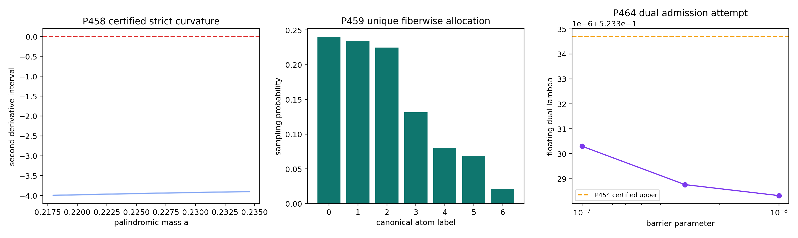

# FIN Local Research Checkpoint P458–P464

## Unique Palindromic Curvature, Fiberwise Canonical Allocation, and a Thirty-Fold Dual-Gap Reduction

**Release:** 10.42  
**Version:** 1.0.0  
**Publication date:** 2026-08-01  
**Creator:** Żuchowski, Krzysztof  
**Affiliation:** Independent Researcher — Fractal Information Theory Project  
**ORCID:** 0009-0002-0909-3613  
**Resource type:** Publication — Preprint  
**Language:** English  
**License:** CC BY 4.0

---

# 1. Executive summary

This checkpoint completes local Programs P458, P459, and P464 by analytical
derivation, rational arithmetic, outward interval automatic differentiation,
exact finite linear algebra, and deterministic local computation. It uses no
laboratory record, external audit, internet result, remote computation, or
physical evidence.

1. **P458 — [Computer-assisted proof].** The P452 symmetrization theorem and
   P457 global cover reduce the declared coarse-erasure question to a bounded
   palindromic maximizer hull. On 256 outward interval cells,

   \[
   -4.002571478626325\le F''(a)\le-3.890264298788524<0.
   \]

   Endpoint derivatives have opposite certified signs. Consequently the
   palindromic maximizer is unique and lies in

   \[
   0.2276921883225489\le a_*\le0.22769218832267057,
   \]

   a width of \(1.2169\times10^{-13}\). This proves uniqueness of the
   palindromic representative, not the absence of asymmetric co-optimizers.

2. **P459 — [Proven, conditional].** P453 fixes one signed atomic
   representation under the explicit minimum-TV rule. For every realization
   of the supplied O160/O163 detector coefficient box, the risk

   \[
   R(q)=\sum_{i=0}^{6}\frac{s_i^2}{q_i}-M
   \]

   is strictly convex on the probability simplex and has the unique solution

   \[
   q_i=\frac{s_i}{\sum_j s_j}.
   \]

   The smallest certified ambient Hessian diagonal is greater than
   \(90.5081\), and all adjacent allocation ranks remain separated by at
   least \(0.00589644924709949\). The result is fiberwise canonical; it does
   not choose an actual detector realization or provide calibration.

3. **P464 — [Computer-assisted proof].** A smaller-barrier nested-dual scout
   was admitted only after rounding to denominator \(10^{14}\), exact
   Sylvester verification of six matrix slacks, positivity of two scalar
   slacks, and payment of the complete trigonometric perturbation. The new
   global full-cone bracket is

   \[
   0.52332810026048937\le D_3^{\rm global}
   \le0.52332832027103.
   \]

   Its exact width is

   \[
   \frac{22001054063}{10^{17}}=2.2001054063\times10^{-7},
   \]

   approximately 29.999 times narrower than the Release-10.41 bracket. The
   corresponding success probability lies in

   \[
   0.761664050130244685\le p_{\rm succ}^{\rm global}
   \le0.761664160135515.
   \]

New objects are O173 Palindromic Curvature Isolator, O174 Fiberwise Canonical
Allocation Tube, and O175 Rational-Dual Admission Gate.

No exact P464 optimizer, full-simplex uniqueness, selector, canonical physical
orientation, dimensional unit, apparatus, laboratory record, complete
legacy-to-strict bridge, role-transfer theorem, Standard Model, gravity,
\(L_{\rm total}\), or Theory of Everything is claimed.

# 2. Confidence convention

| Label | Meaning |
|---|---|
| [Proven] | Exact analytic or finite algebraic consequence of declared premises |
| [Computer-assisted proof] | Finite rational or outward-interval certificate with auditable artifacts |
| [Strong evidence] | Reproducible numerical evidence lacking a complete certificate |
| [Conditional] | The conclusion depends on an explicitly supplied mathematical interface |
| [Open] | Current local artifacts do not decide the proposition |
| [Blocked by external evidence] | Laboratory, calibration, custody, or an external record is indispensable |

# 3. State map and guardrails

| Lane | Inherited state | New state |
|---|---|---|
| P457 maximizer | Global value gap below \(10^{-6}\); uniqueness open | Unique palindromic maximizer isolated to width \(<1.22\times10^{-13}\) |
| O163 allocation | Certified interval tube | Unique minimizer in every supplied-box fiber; rank order invariant |
| Three-slot full cone | Gap \(6.59999151063\times10^{-6}\) | Gap \(2.2001054063\times10^{-7}\) |
| Exact O167 attainment | Open | Open |
| Full-simplex uniqueness | Open | Open: asymmetric equality cases not excluded |
| Selector/QW-2191 | Open | Unchanged |
| Dimensional source | Missing | Unchanged |
| Laboratory evidence | None | None |
| Legacy-to-strict bridge | Incomplete | Unchanged |

The intermediate and strict kernels remain distinct:

\[
K_{\rm legacy,ont}(d)=
\frac{\alpha_{\rm geo}\cos(\omega d+\phi)}{1+\beta_{\rm tors}d},
\qquad
K_{\rm strict,gate}(d)=
\frac{\cos(\omega d+\phi)}{1+\beta d^\eta}.
\]

These programs are downstream reduced-channel and estimator calculations.
They derive neither kernel and transfer no legacy physical role. The ontology
remains nadsoliton to light to matter to emergent observer, with no lower
informational layer beneath the nadsoliton.

# 4. P458 — interval curvature and unique palindromic maximizer

## 4.1 Proof architecture

P452 proves that reversal averaging cannot reduce the declared coarse
objective, hence a global optimizer has a palindromic representative

\[
p(a)=(a,\tfrac12-a,\tfrac12-a,a).
\]

P457 proves that every palindromic maximizer is contained in

\[
H=[0.2178955078125,0.234619140625].
\]

P458 differentiates the same block-reduced objective, including every square
root, Pfaffian absolute value, and standard-sector contribution, with
second-order outward interval jets. No finite difference is used in the proof
layer.

## 4.2 Strict curvature

The 256-cell cover of \(H\) proves a strictly negative second derivative on
every cell. At the hull endpoints,

\[
F'(H_- )\in[0.03881422991489784,0.03881422991492505],
\]

\[
F'(H_+ )\in[-0.027120573501572463,-0.027120573501547406].
\]

Strict decrease of \(F'\), continuity, and opposite signs prove exactly one
stationary point in \(H\), which is its strict maximum.

## 4.3 Scope of uniqueness

The theorem is deliberately narrower than full-simplex uniqueness. P452 shows
that symmetrization sends every point to a no-worse palindromic point. Equality
could still hold along a non-palindromic fiber. Excluding that possibility
requires a strict equality-case theorem for the P452 reversal inequality.

# 5. P459 — fiberwise canonical detector allocation

## 5.1 Variational theorem

For strictly positive scores \(s_i\), the Hessian of
\(R(q)=\sum_i s_i^2/q_i-M\) is diagonal:

\[
\nabla^2R(q)=\operatorname{diag}\left(\frac{2s_i^2}{q_i^3}\right)\succ0.
\]

Thus the restriction to the simplex tangent space is strictly positive.
Lagrange multipliers give the unique minimizer \(q_i=s_i/\sum_j s_j\).
Every certified score lower bound is positive over the complete inherited atom
box, so the argument holds in every fiber.

## 5.2 Certified allocation order

The interval image is centered at

\[
(0.240000916,0.234104467,0.224592449,0.131228143,
0.080622667,0.068262231,0.021189127).
\]

All adjacent interval differences are positive. The smallest is greater than
\(0.00589644924709949\), so label ordering cannot change anywhere inside the
supplied box.

## 5.3 Removal test

Removing the minimum-TV premise revives the P450 signed null-cycle and makes
the allocation representation-dependent. Retaining minimum-TV but removing a
specified detector realization leaves a tube of unique fiberwise answers, not
one physical allocation. No preparation or calibration theorem is generated.

# 6. P464 — rational dual admission and global bracket

## 6.1 Admission rule

Floating central-path values are scouts only. A candidate enters the theorem
layer only if every rationalized slack is positive. For the accepted
denominator-\(10^{14}\) certificate:

- both \(X_3\pm\Delta/2\) have exact Sylvester margin \(10^{-8}\);
- the four lower matrix slacks have exact margin \(10^{-8}\);
- both terminal scalar slacks equal \(2000001/10^{14}\);
- the trigonometric matrix perturbation is bounded by
  \(3.0514767686602317\times10^{-16}\).

Hence the smallest final certified slack exceeds
\(9.9999996948523228\times10^{-9}\).

## 6.2 Theorem and limitation

Weak duality gives the new upper bound \(0.52332832027103\). Combined with the
P451 rational primal witness it proves the global bracket stated above. This
does not prove that the O167 candidate attains the exact optimum: the remaining
gap is positive. It also supplies no uniqueness theorem.

# 7. Newly constructed objects

| Object | Definition | What it generates | What it does not generate |
|---|---|---|---|
| O173 | Second-order interval jet cover on the P457 hull | Strict curvature and unique palindromic root | Full-simplex equality-case uniqueness |
| O174 | Map from each positive detector-score fiber to its unique simplex minimizer | Canonical allocation conditional on minimum-TV and a detector fiber | Physical detector choice or calibration |
| O175 | Exact rational feasibility gate for nested dual scouts | Admissible global upper bounds only | Exact primal attainment or physical evidence |

# 8. Falsification and robustness

- P458 recomputes derivatives through the complete block formula; sampled
  Hessians are not used as proof.
- P458 does not erase possible asymmetric co-optimizers.
- P459 proves strict convexity rather than inferring uniqueness from one
  numerical minimization.
- P459 explicitly fails without the P453 minimum-TV gauge.
- P464 rejects floating decreases unless all exact rational slacks pass.
- P464 pays the full certified trigonometric operator perturbation.
- None of the programs changes selector, dimensional, kernel-bridge, or
  laboratory-evidence status.

# 9. Physical and epistemic boundary

The results are dimensionless mathematical statements about supplied finite
operators, probability laws, and synthetic detector coefficients. They do not
derive time, length, action, energy, apparatus, a preparation instrument,
independent custody, or an experimental record. QW-2191 remains open. No
mathematical output in this checkpoint is empirical confirmation of FIN.

# 10. Ranked next research programs

| Rank | Program | Question | Method |
|---:|---|---|---|
| 1 | P465 | Does P452 have strict equality only on the palindromic fixed set? | Factor and interval-certify the reversal Jensen defect |
| 2 | P468 | Can the P464 gap be reduced below \(10^{-8}\)? | Primal KKT inclusion plus adaptive rational dual margins |
| 3 | P469 | Does an exact stationary O167 witness satisfy full nested complementarity? | Interval matrix sign/KKT system |
| 4 | P460 | Is the O174 allocation invariant under alternative admissible loss geometries? | Quotient and sensitivity theorem |
| 5 | P461 | Formalize the P452 symmetrization theorem | Lean finite algebra |
| 6 | P462 | Formalize P453 strict-complementarity uniqueness | Lean moment-duality core |
| 7 | P463 | Specify a preparation contract without claiming its physical realization | Typed operational interface |
| 8 | P466 | Test whether causal coherence advantage persists for four slots | Reduced comb recursion and certified witness |
| 9 | P467 | Generalize O170 to arbitrary slot number | Inductive primal/dual ladder theorem |
| 10 | P470 | Identify which local conclusions are stable under strict-kernel parameter boxes | Interval perturbation audit with no role transfer |

The next bounded batch is

\[
\boxed{P465\longrightarrow P468\longrightarrow P469}.
\]

# 11. Artifact list and restart

- FIN_Programs_458_459_464_Results.json
- FIN_Programs_458_459_464_Summary.csv
- FIN_Programs_458_459_464_P458_Derivative_Uniqueness.csv
- FIN_Programs_458_459_464_P459_Canonical_Allocation.csv
- FIN_Programs_458_459_464_P464_Dual_Refinement.csv
- FIN_Programs_458_459_464_P464_Rational_Dual.npz
- FIN_Programs_458_459_464_Figures/p458_p459_p464_certificates.png
- fin_programs_458_459_464.py
- test_fin_programs_458_459_464.py

Recompute with:

    MPLCONFIGDIR=/tmp/fin-mpl-1038 python3 fin_programs_458_459_464.py
    MPLCONFIGDIR=/tmp/fin-mpl-1038 python3 -m unittest -v \
      test_fin_programs_458_459_464.py test_fin_checkpoint_p458_p464.py
    python3 fin_programs_458_459_464_to_latex.py
    lualatex -interaction=nonstopmode -halt-on-error \
      FIN_Local_Research_Checkpoint_P458_P464_EN.tex
    sha256sum -c FIN_PROGRAMS_458_459_464_RELEASE_MANIFEST.sha256

# 12. Conclusion

The strongest surviving interpretation is mathematical and operational: a
finite nested causal optimization admits auditable primal and dual
certificates; a declared coarse-erasure model has one rigorously isolated
palindromic optimum; and an explicit variational gauge produces a unique
detector allocation in every supplied uncertainty fiber. These are substantive
local theorems. They still do not manufacture the selector, dimensional scale,
physical preparation, or laboratory record required for a physical theory.
