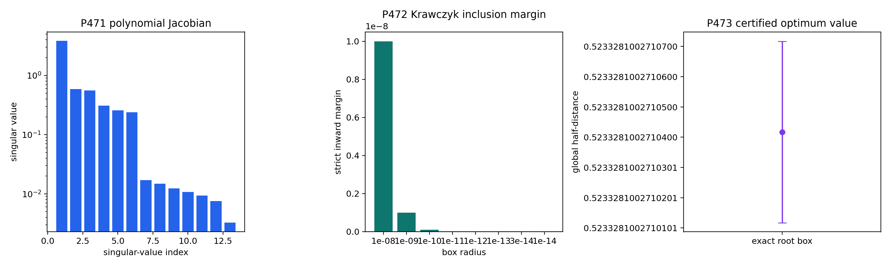

# FIN Local Research Checkpoint P471–P473

## Exact O167 Primal–Dual Attainment by Polynomial Krawczyk Certification

**Release:** 10.44  
**Version:** 1.0.0  
**Publication date:** 2026-08-01  
**Creator:** Żuchowski, Krzysztof  
**Affiliation:** Independent Researcher — Fractal Information Theory Project  
**ORCID:** 0009-0002-0909-3613  
**Resource type:** Publication — Preprint  
**Language:** English  
**License:** CC BY 4.0

---

# 1. Executive summary

This checkpoint completes local Programs P471, P472, and P473. It turns the
floating full-KKT evidence of P469 into a finite exact certificate. The proof
uses symbolic polynomial reduction, exact rational interval arithmetic, exact
trigonometric enclosures, a rational Krawczyk operator, exact Sylvester
positivity, and finite-dimensional primal–dual identities. It uses no internet
result, external audit, laboratory record, remote computation, or empirical
physical evidence.

The principal results are:

1. **P471 — [Proven].** The matrix absolute value in the O177 support ladder
   can be eliminated. For a positive normalizer \(N\) and positive dual
   support \(X_3\),

   \[
   X_3 N X_3=\frac14\Delta N\Delta
   \]

   is equivalent to

   \[
   X_3=\frac12N^{-1/2}
   \left|N^{1/2}\Delta N^{1/2}\right|N^{-1/2}.
   \]

   The exact O167 symmetries and the complete lower-level block-equality KKT
   conditions reduce \(X_3\) to ten real parameters. Together with the three
   O167 normalizer parameters \((A,B,u)\), all 36 upper-triangular Riccati
   equations collapse symbolically into exactly 13 polynomial residual
   orbits in 13 unknowns. The maximum polynomial degree is three.

2. **P472 — [Computer-assisted proof].** Every one of the 13 polynomials and
   all 169 Jacobian entries are evaluated with exact rational interval
   arithmetic. The three trigonometric constants are enclosed by rational
   intervals at decimal scale \(10^{30}\). A rational approximate inverse
   defines the Krawczyk map. Strict inclusions are obtained for radii from
   \(10^{-8}\) down to \(3\times10^{-14}\). The smaller attempted radius
   \(10^{-14}\) fails and is not admitted. The selected radius is therefore

   \[
   r=\frac{3}{10^{14}}=3\times10^{-14}.
   \]

3. **P473 — [Computer-assisted proof].** The strict Krawczyk inclusion proves
   that the exact coefficient instance has one unique root inside the
   selected box. Separate exact Sylvester calculations prove that the entire
   box keeps both \(N\) and \(X_3\) positive. At this exact root, the Riccati
   identity proves the two top dual inequalities, the polynomial block
   pattern makes every lower dual slack zero, and recursive trace identities
   give equality of the primal and dual objectives. Consequently the O167
   normalizer exactly attains the global optimum of the declared reduced
   three-slot ordered-comb problem.

The exact optimal value is enclosed by

\[
\boxed{
0.5233281002710117
\le D_3^{\rm global}\le
0.5233281002710717,}
\]

an interval of width

\[
\boxed{
\frac{3}{5\times10^{13}}=6\times10^{-14}.}
\]

This is an exact attainment theorem, not merely a small primal–dual gap. It
proves one exact globally optimal O167 normalizer. It does not yet prove that
this optimizer is the only full-cone optimizer outside the certified local
root box.

The new objects are O179 Polynomialized Interior KKT Core, O180 Rational
Polynomial Krawczyk Provider, and O181 Exact O167 Primal–Dual Contact
Certificate.

No FIN selector, QW-2191 discharge, dimensional source, physical clock,
preparation, apparatus, independent experimental record, complete
legacy-to-strict kernel bridge, legacy role transfer, \(L_{\rm total}\),
Standard Model or gravity closure, or Theory of Everything is claimed.

# 2. Confidence convention

| Label | Meaning |
|---|---|
| [Proven] | Exact analytic or finite symbolic consequence of the declared premises |
| [Computer-assisted proof] | Finite rational or outward-interval certificate with auditable artifacts |
| [Strong evidence] | Reproducible numerical evidence lacking a complete exact certificate |
| [Conditional] | Conclusion dependent on an explicitly supplied mathematical interface |
| [Open] | Current local artifacts do not decide the proposition |
| [Refuted] | A stated candidate or attempted certificate fails a necessary test |
| [Blocked by external evidence] | Laboratory, calibration, custody, or an external record is indispensable |

# 3. State transition and guardrails

| Lane | Release 10.43 state | Release 10.44 state |
|---|---|---|
| O167 stationarity | Full floating KKT residual \(1.33\times10^{-15}\) | Exact polynomial root exists in a certified box |
| O167 global attainment | Open | Proved for the declared reduced three-slot problem |
| Global value | Rational bracket width \(4.1055151\times10^{-10}\) | Exact-attainment value interval width \(6\times10^{-14}\) |
| Root uniqueness | Numerical locator | Unique exact polynomial root in the selected local box |
| Full-cone optimizer uniqueness | Open | Still open outside the local root box |
| Selector / QW-2191 | Open | Unchanged |
| Dimensional source | Missing | Unchanged |
| Laboratory evidence | None | None |
| Legacy-to-strict bridge | Incomplete | Unchanged |

The intermediate and strict kernels remain separate:

\[
K_{\rm legacy,ont}(d)=
\frac{\alpha_{\rm geo}\cos(\omega d+\phi)}
{1+\beta_{\rm tors}d},
\qquad
K_{\rm strict,gate}(d)=
\frac{\cos(\omega d+\phi)}{1+\beta d^\eta}.
\]

The present theorem is downstream of supplied finite channel operators. It
derives neither kernel, completes no bridge, and transfers no legacy physical
role. The ontology remains

\[
\text{nadsoliton}\longrightarrow\text{light}\longrightarrow
\text{matter}\longrightarrow\text{emergent observer},
\]

with no informational substrate below the nadsoliton.

# 4. Inherited problem

## 4.1 Three-slot primal

For the supplied compressed Hermitian process difference \(\Delta\), the
ordered three-slot primal SDP is

\[
\begin{aligned}
\operatorname{maximize}\quad&
\frac12\operatorname{Tr}[\Delta(T_+-T_-)]\\
\operatorname{subject\ to}\quad&
T_++T_-=B_0\oplus B_1,\\
&B_0+B_1=C_0\oplus C_1,\\
&C_0+C_1=\operatorname{diag}(d_0,d_1),\\
&d_0+d_1=1,
\end{aligned}
\]

with all primal variables positive semidefinite.

For a fixed positive normalizer \(N=T_++T_-\),

\[
\max_{T_\pm}
\frac12\operatorname{Tr}[\Delta(T_+-T_-)]
=\frac12\left\|N^{1/2}\Delta N^{1/2}\right\|_1.
\]

## 4.2 Nested dual

The dual minimizes \(\lambda\) subject to

\[
X_3\succeq\pm\frac{\Delta}{2},
\]

\[
X_2\succeq(X_3)_{00},\qquad
X_2\succeq(X_3)_{11},
\]

\[
X_1\succeq(X_2)_{00},\qquad
X_1\succeq(X_2)_{11},
\]

\[
\lambda\ge(X_1)_{00},\qquad
\lambda\ge(X_1)_{11}.
\]

Slater points exist on both sides. Therefore finite-dimensional strong
duality applies.

## 4.3 O167 normalizer

The O167 normalizer is parameterized by

\[
N(A,B,u)=B_0\oplus B_1,
\qquad
C=\frac12-A-2B,
\]

\[
B_0=
\begin{pmatrix}
A&u&u&0\\
u&B&0&-u\\
u&0&B&-u\\
0&-u&-u&C
\end{pmatrix},
\]

\[
B_1=
\begin{pmatrix}
C&-u&-u&0\\
-u&B&0&u\\
-u&0&B&u\\
0&u&u&A
\end{pmatrix}.
\]

This form satisfies the causal trace recursion identically whenever the
blocks are positive.

# 5. P471 — polynomialization of the support ladder

## 5.1 Removing the matrix absolute value

Set

\[
H=N^{1/2}\Delta N^{1/2}.
\]

The P469 support formula is

\[
X_3=\frac12N^{-1/2}|H|N^{-1/2}.
\]

Multiplying through gives

\[
X_3NX_3
=\frac14N^{-1/2}|H|^2N^{-1/2}
=\frac14\Delta N\Delta.
\]

The reverse implication is equally important. Suppose \(N\succ0\),
\(X_3\succ0\), and

\[
X_3NX_3=\frac14\Delta N\Delta.
\]

Then

\[
Y=N^{1/2}X_3N^{1/2}\succ0
\]

obeys

\[
Y^2=\frac14H^2.
\]

The positive square root of \(H^2/4\) is unique. Hence

\[
Y=\frac12|H|
\]

and the support formula follows. Thus the nonsmooth-looking matrix absolute
value is exactly equivalent, inside the positive cone, to a finite cubic
polynomial system.

## 5.2 Exact lower-ladder pattern

At an interior optimum, positive \(B_0,B_1,C_0,C_1,d_0,d_1\) force both
lower dual slacks at every level to vanish. Therefore the two diagonal
blocks of \(X_3\) equal one common \(X_2\), the two diagonal blocks of \(X_2\)
equal one common \(X_1\), and the two diagonal elements of \(X_1\) equal
\(\lambda\).

Under the exact O167 permutation and complement pattern,

\[
X_2=
\begin{pmatrix}
L&a&a&c\\
a&L&b&a\\
a&b&L&a\\
c&a&a&L
\end{pmatrix},
\]

and

\[
X_3=
\begin{pmatrix}
X_2&Y\\
Y^{T}&X_2
\end{pmatrix},
\]

where

\[
Y=
\begin{pmatrix}
d&e&e&f\\
g&h&h&e\\
g&h&h&e\\
i&g&g&d
\end{pmatrix}.
\]

The unknown vector is

\[
z=(A,B,u,L,a,b,c,d,e,f,g,h,i)\in\mathbb R^{13}.
\]

## 5.3 Exact residual orbits

Expanding

\[
R(z)=X_3(z)N(z)X_3(z)
-\frac14\Delta N(z)\Delta
\]

gives 36 upper-triangular entries. Exact symbolic comparison over
\(\mathbb Q[s_1,s_2,s_3]\), where

\[
s_k=\sin\frac{k\pi}{8},
\]

partitions those entries into exactly 13 identical polynomial orbits:

| Orbit | Upper-triangular positions |
|---:|---|
| 1 | (0,0), (7,7) |
| 2 | (0,1), (0,2), (5,7), (6,7) |
| 3 | (0,3), (4,7) |
| 4 | (0,4), (3,7) |
| 5 | (0,5), (0,6), (1,7), (2,7) |
| 6 | (0,7) |
| 7 | (1,1), (2,2), (5,5), (6,6) |
| 8 | (1,2), (5,6) |
| 9 | (1,3), (2,3), (4,5), (4,6) |
| 10 | (1,4), (2,4), (3,5), (3,6) |
| 11 | (1,5), (1,6), (2,5), (2,6) |
| 12 | (3,3), (4,4) |
| 13 | (3,4) |

Selecting one representative from each orbit yields a square 13-variable
system \(F(z)=0\). Its maximum degree is three. No equation is discarded:
the orbit identities prove that the 13 representatives vanish if and only if
the complete symmetric matrix residual vanishes.

## 5.4 Floating locator and necessity boundary

The local numerical root is

\[
\begin{aligned}
(A,B,u)\approx(&0.28716641537176957,\\
&0.06877721090495262,\\
&0.009493709596686299),
\end{aligned}
\]

with

\[
L\approx0.5233281002710417.
\]

The full 13-vector residual infinity norm is

\[
6.158268339717665\times10^{-17}.
\]

The Jacobian singular values range from

\[
3.833325700590803
\]

to

\[
0.003267495644871251,
\]

giving condition number approximately \(1173.17\). This is sufficient for a
well-scaled local interval attempt, but P471 alone does not convert a
floating locator into an exact root.

# 6. P472 — exact rational interval provider

## 6.1 Arithmetic layer

Each polynomial is stored as a finite list of rational coefficients and
monomials. Every primitive operation uses an exact interval

\[
[x_-,x_+],\qquad x_\pm\in\mathbb Q.
\]

Addition and multiplication are performed by rational endpoint arithmetic.
No binary floating number appears in the proof evaluator.

The exact Taylor/Machin trigonometric providers are coarsened outward to
denominator \(10^{30}\). Their original widths are much smaller; for example
the inherited enclosure of \(\sin(\pi/8)\) has width below \(7\times10^{-67}\).
Coarsening reduces integer growth while preserving the true constants.

## 6.2 Krawczyk operator

Let \(z_0\in\mathbb Q^{13}\) be the rationalized locator, \(Z\) a rational
box centered at \(z_0\), and \(C\in\mathbb Q^{13\times13}\) a rationalized
inverse of the midpoint Jacobian. The exact interval Krawczyk map is

\[
K(z_0,Z)=
z_0-CF(z_0)+
\left[I-CF'(Z)\right](Z-z_0).
\]

If

\[
K(z_0,Z)\subset\operatorname{int}Z,
\]

then the exact coefficient instance has one root in \(Z\), and that root is
unique within \(Z\).

## 6.3 Attempt ladder

The following radii were tested with the same exact evaluator:

| Radius | Result |
|---:|---|
| \(10^{-8}\) | strict inclusion |
| \(10^{-9}\) | strict inclusion |
| \(10^{-10}\) | strict inclusion |
| \(10^{-11}\) | strict inclusion |
| \(10^{-12}\) | strict inclusion |
| \(10^{-13}\) | strict inclusion |
| \(3\times10^{-14}\) | strict inclusion |
| \(10^{-14}\) | rejected |

The selected radius is the smallest admitted attempted radius:

\[
r=3\times10^{-14}.
\]

The strict inward margin is positive. The rejected \(10^{-14}\) attempt is
retained in the CSV artifact and is not silently rounded into success.

## 6.4 What the provider proves

P472 encloses the complete polynomial residual and every Jacobian entry on
the entire box. It does not sample corners and does not assume that a matrix
eigendecomposition is interval stable. The proof layer therefore removes
the principal methodological weakness identified in P469.

# 7. P473 — exact O167 primal–dual attainment

## 7.1 Exact root

The strict P472 inclusion proves the existence of an exact root

\[
z_*\in z_0+[-r,r]^{13},
\qquad r=3\times10^{-14}.
\]

The root is unique within this box. The global-value coordinate \(L_*\) obeys

\[
\frac{5233281002710117}{10^{16}}
\le L_*\le
\frac{5233281002710717}{10^{16}}.
\]

## 7.2 Positivity on the entire box

Krawczyk inclusion alone does not establish that the root lies in the
positive primal–dual cone. P473 separately rationalizes the center matrices
and applies exact Sylvester tests.

For the normalizer center,

\[
N(z_0)\succeq\frac1{100}I.
\]

Every normalizer entry moves by at most \(5r\), and therefore

\[
\|\delta N\|_2\le8(5r)=40r.
\]

The certified box lower bound is

\[
\lambda_{\min}(N(z))
\ge\frac{24999999997}{2500000000000}>0.
\]

For the dual support center,

\[
X_3(z_0)\succeq\frac1{100}I,
\]

and

\[
\|\delta X_3\|_2\le8r.
\]

Thus

\[
\lambda_{\min}(X_3(z))
\ge\frac{124999999997}{12500000000000}>0.
\]

Both matrices are positive throughout the complete certified box, hence also
at the exact root.

## 7.3 Exact top dual feasibility

At the root,

\[
X_3N X_3=\frac14\Delta N\Delta.
\]

Set

\[
H=N^{1/2}\Delta N^{1/2},
\qquad
Y=N^{1/2}X_3N^{1/2}.
\]

Since \(Y\succ0\) and \(Y^2=H^2/4\),

\[
Y=\frac12|H|.
\]

For every Hermitian \(H\),

\[
|H|\succeq\pm H.
\]

Congruence by \(N^{-1/2}\) gives

\[
\boxed{X_3\succeq\pm\frac{\Delta}{2}.}
\]

The two top dual inequalities are therefore exact consequences of the
polynomial root and positivity; they are not numerical eigenvalue tests.

## 7.4 Exact lower dual feasibility

The ten-parameter pattern makes the two diagonal blocks of \(X_3\) equal to
the same \(X_2\). The two diagonal blocks of \(X_2\) equal the same

\[
X_1=
\begin{pmatrix}
L&a\\
a&L
\end{pmatrix},
\]

and both diagonal entries of \(X_1\) equal \(L\). Taking

\[
\lambda=L
\]

makes all six lower dual slacks exactly zero. Zero is positive semidefinite,
so the complete dual ladder is feasible.

## 7.5 Exact equality of primal and dual values

The trace-norm support identity gives the fixed-normalizer primal value

\[
D(N)=\operatorname{Tr}(NX_3).
\]

The block identities telescope:

\[
\begin{aligned}
\operatorname{Tr}(NX_3)
&=\operatorname{Tr}[(B_0+B_1)X_2]\\
&=\operatorname{Tr}[(C_0+C_1)X_1]\\
&=\operatorname{Tr}[\operatorname{diag}(d_0,d_1)X_1]\\
&=L(d_0+d_1)\\
&=L=\lambda.
\end{aligned}
\]

Thus a feasible primal construction and a feasible dual construction have
the same objective value. Weak duality alone proves that both are globally
optimal.

## 7.6 Theorem

**Exact O167 attainment theorem. [Computer-assisted proof]** For the exact
declared reduced three-slot phase/dephasing channel at \(q=4/5\) and
\(\theta=\pi/8\), there exists an exact positive O167 normalizer whose
binary causal discrimination value equals the global full-cone optimum. The
optimal value lies in

\[
\boxed{
[0.5233281002710117,\,
0.5233281002710717].}
\]

The exact root is unique in the certified 13-dimensional box of radius
\(3\times10^{-14}\).

The theorem proves existence and exact global attainment of one O167
optimizer. It does not prove that no disconnected or distant globally optimal
normalizer exists elsewhere in the 21-dimensional causal cone.

# 8. New objects

## 8.1 O179 — Polynomialized Interior KKT Core

| Field | Definition |
|---|---|
| Input | O167 normalizer, structured nested dual, supplied \(\Delta\) |
| Equation | \(X_3NX_3=\Delta N\Delta/4\) |
| Unknown count | 13 |
| Complete residual count | 36 upper-triangular entries |
| Exact orbit count | 13 |
| Maximum degree | 3 |
| Generated theorem | Positive roots are exactly structured support-ladder contacts |
| Confidence | [Proven] |

## 8.2 O180 — Rational Polynomial Krawczyk Provider

| Field | Definition |
|---|---|
| Coefficients | Exact rational polynomial terms plus outward rational sine boxes |
| Jacobian | All 169 entries enclosed exactly |
| Preconditioner | Rationalized inverse of the midpoint Jacobian |
| Admission | Strict coordinatewise inclusion \(K(Z)\subset\operatorname{int}Z\) |
| Selected box radius | \(3\times10^{-14}\) |
| Failure retained | \(10^{-14}\) box rejected |
| Confidence | [Computer-assisted proof] |

## 8.3 O181 — Exact O167 Primal–Dual Contact Certificate

| Field | Definition |
|---|---|
| Root | Unique exact O179 root in the O180 box |
| Positivity | Exact Sylvester margins for \(N\) and \(X_3\), perturbation paid |
| Top dual | Riccati identity plus positive-square-root uniqueness |
| Lower dual | Exact zero slacks from nested block equality |
| Equality | Recursive trace telescope gives primal \(=\lambda\) |
| Generated theorem | Exact global O167 attainment |
| Remaining open | Full-cone optimizer uniqueness outside the root box |
| Confidence | [Computer-assisted proof] |

# 9. Falsification and independent checks

## 9.1 Algebraic checks

- All 36 upper-triangular matrix equations are retained through exact orbit
  identities.
- Sine constants remain symbolic during orbit classification.
- The Riccati implication is used only after positivity is independently
  certified.
- The lower dual pattern is written explicitly; no floating near-equality is
  promoted.

## 9.2 Interval checks

- Polynomial evaluation and Jacobian evaluation use exact fractions.
- Trigonometric enclosures are outward, not nearest rounded.
- The preconditioner is rationalized.
- Inclusion is checked coordinate by coordinate with a strictly positive
  margin.
- A smaller failed box is recorded as failed.
- The entire root box, not only its center, is proved positive.

## 9.3 Duality checks

- Top feasibility is derived from \(|H|\succeq\pm H\).
- Lower feasibility uses exact zero slacks.
- The primal value is linked to the dual scalar by an explicit trace
  telescope.
- Strong duality is not needed for the final equality; feasible primal and
  dual points with the same value plus weak duality suffice.

## 9.4 Claims rejected

The following are not consequences of P473:

- the full ordered-comb optimizer is globally unique;
- O167 is universally optimal for other channels or slot counts;
- a causal tester is a FIN strict selector;
- \(L_*\) is a dimensional action, time, length, mass, or energy;
- a finite operator theorem supplies a physical preparation or detector;
- the legacy kernel inherits strict-kernel physical roles;
- a local mathematical optimum is empirical confirmation.

# 10. Significance for FIN

Release 10.44 closes a well-defined mathematical problem that had remained
open since P451. The progression is now:

\[
\begin{aligned}
\text{coherent primal witness}
&\longrightarrow
\text{nested rational dual bounds}
\longrightarrow
\text{full floating KKT locator}\\
&\longrightarrow
\text{polynomial exact root}
\longrightarrow
\text{exact primal--dual contact}.
\end{aligned}
\]

This is a genuine upgrade from numerical plausibility to a finite theorem.
It demonstrates that the finite operator layer can support proof-grade causal
optimization, including coherence and memory, without relying on an external
SDP solver.

The result remains a theorem about a supplied dimensionless channel. It does
not bridge information to SI units or laboratory observables. It does not
select a physical branch or origin. It does not complete the legacy-to-strict
kernel map. The missing physics objects identified by earlier audits remain
missing.

# 11. Ranked next research programs

| Rank | Program | Question | Method and success criterion |
|---:|---|---|---|
| 1 | P474 | Is the P473 globally optimal normalizer unique on the complete causal cone? | Exact tangent-cone nondegeneracy, top-slack kernel analysis, and strict-complementarity uniqueness theorem or counterexample |
| 2 | P483 | Does the exact root persist under a certified \((q,\theta)\) parameter neighborhood? | Parametric interval implicit-function/Krawczyk tube |
| 3 | P475 | Can the optimal value or root receive an algebraic minimal polynomial? | Elimination over the algebraic sine field; stop if degree/height is computationally prohibitive |
| 4 | P479 | Formalize the Riccati-to-support and trace-telescope theorem | Lean finite-matrix theorem with positivity premises separated |
| 5 | P477 | Does O179 generalize to arbitrary slot number? | Inductive nested support Riccati ladder and symmetry-orbit count |
| 6 | P478 | Does an exact coherent optimum exist for four slots? | Reduced four-slot primal, structured dual, rational witness before any global claim |
| 7 | P476 | Extend P465 uniqueness over a \((q,\theta)\) region | Exact condition \(4q^2\cos^2\theta>1\) plus positive sector-weight boundary audit |
| 8 | P480 | Build a standalone minimal checker for O180/O181 | Serialize rational monomials, boxes, and Krawczyk matrix; independent replay without SciPy |
| 9 | P481 | Classify all roots of the 13-polynomial system in the positive feasible parameter domain | Interval branch-and-bound or certified exclusion boxes |
| 10 | P460 | Test O174 allocation stability under alternative admissible loss geometries | Quotient sensitivity and ranking-margin theorem |
| 11 | P470 | Audit local operational conclusions under strict-kernel parameter boxes | Interval perturbation with no legacy role transfer |
| 12 | P463 | Specify the minimal preparation/instrument contract | Typed conditional interface, explicitly non-empirical |

The next bounded batch is

\[
\boxed{P474\longrightarrow P483\longrightarrow P479}.
\]

P474 has highest priority because P473 proves one global optimizer but does
not yet classify the complete optimal face. P483 tests robustness rather than
another isolated parameter point. P479 isolates the reusable exact theorem
from its numerical certificate.

# 12. Artifacts and restart

- FIN_Programs_471_472_473_Results.json
- FIN_Programs_471_472_473_Summary.csv
- FIN_Programs_471_472_473_P471_Polynomial_Core.csv
- FIN_Programs_471_472_473_P472_Interval_Provider.csv
- FIN_Programs_471_472_473_P473_Krawczyk.csv
- FIN_Programs_471_472_473_P473_Root_Box.npz
- FIN_Programs_471_472_473_Figures/p471_p473_polynomial_krawczyk.png
- fin_programs_471_472_473.py
- test_fin_programs_471_472_473.py

Recompute with:

    MPLCONFIGDIR=/tmp/fin-mpl-1044 python3 fin_programs_471_472_473.py
    python3 -m unittest -v test_fin_programs_471_472_473.py
    python3 fin_programs_471_472_473_to_latex.py
    lualatex -interaction=nonstopmode -halt-on-error \
      FIN_Local_Research_Checkpoint_P471_P473_EN.tex
    sha256sum -c FIN_PROGRAMS_471_472_473_RELEASE_MANIFEST.sha256

# 13. Conclusion

P471–P473 close the exact-attainment question for the declared reduced
three-slot ordered-comb optimization. The key move is conceptual as well as
computational: the spectral support map is replaced by a positive Riccati
equation, exposing a 13-variable cubic core. Exact rational Krawczyk
inclusion then proves a true root, and positivity plus trace recursion turns
that root into matching primal and dual feasible points.

The resulting theorem is strong but narrow. One exact O167 optimizer exists
and globally attains a value in an interval only \(6\times10^{-14}\) wide.
Whether it is the only optimizer in the entire cone remains open. The result
advances FIN's finite operator and information-processing mathematics; it
does not manufacture the selector, dimensions, preparation, apparatus, or
experimental record required for physics.
