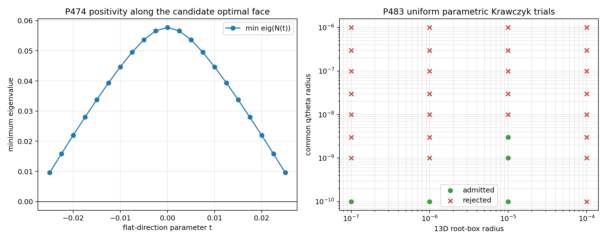

# FIN Local Research Checkpoint P474–P479–P483

## Complex Optimal-Face Evidence and an Exact Parametric O181 Tube

**Release:** 10.45  
**Version:** 1.0.0  
**Publication date:** 2026-08-01  
**Creator:** Żuchowski, Krzysztof  
**Affiliation:** Independent Researcher — Fractal Information Theory Project  
**ORCID:** 0009-0002-0909-3613  
**Resource type:** Publication — Preprint  
**Language:** English  
**License:** CC BY 4.0

---

# 1. Executive summary

This checkpoint executes local Programs P474, P479, and P483 after the exact
O167 attainment theorem of P473. The programs use only analytical derivation,
finite linear algebra, exact rational interval arithmetic, and local code. No
internet source, external audit, remote model, laboratory record, or empirical
physical evidence is used.

The principal results are:

1. **P474 — [Strong evidence].** The exact O167 root is locally unique in its
   13-dimensional real polynomial chart, but the complete complex causal comb
   appears not to have a unique optimizer. The full linearized
   complementarity-and-causality system has size (299\times128), numerical
   rank (127), and one null direction. Its smallest nonzero singular value is
   (1.8591352597\times10^{-2}), while the remaining singular value is
   (6.96\times10^{-15}). An independent (28\times7) imaginary-causal
   Riccati tangent map has rank six and the same one-dimensional defect.
   Along the tested segment (t\in[-0.025,0.025]), the normalizer remains
   positive, with minimum sampled eigenvalue (9.61\times10^{-3}), while the
   objective changes by at most (1.12\times10^{-15}). This is compelling
   evidence for a one-dimensional complex optimal face, but an exact algebraic
   null-vector certificate is still missing. Full-cone uniqueness is therefore
   not marked refuted.

2. **P479 — [Open as machine formalization].** A dependency-free Lean source
   now separates the Riccati-to-support implication, trace-telescope contact,
   weak duality, and the distinction between local root uniqueness and global
   optimizer uniqueness. The local `lean` launcher exists, but no Lean
   toolchain is installed. In accordance with the local-only rule, no network
   installation was attempted. The file is an explicit formal interface, not
   a machine-checked theorem.

3. **P483 — [Computer-assisted proof].** The O181 root is not an isolated
   artifact of the single point (q=4/5,\theta=\pi/8). A uniform exact
   rational Krawczyk calculation proves that, for every

   \[
   |q-4/5|\le 3\times10^{-9},\qquad
   |\theta-\pi/8|\le 3\times10^{-9},
   \]

   there exists a unique positive root in one common 13-dimensional box of
   radius (10^{-5}). The exact inclusion margin is greater than
   (4.7195\times10^{-6}), and the maximum interval contraction row sum is
   less than (0.229493). Uniform positivity bounds are

   \[
   N\succeq \frac{6}{625}I,
   \qquad
   X_3\succeq \frac{31}{3125}I.
   \]

   The same Riccati, block-equality, and trace-telescope argument as P473 then
   proves exact primal–dual attainment throughout this parameter rectangle.
   Root uniqueness is local to the common polynomial box; uniqueness of the
   optimizer over the complete complex cone is not claimed.

The new objects are O182 Complex Comb Optimal-Face Direction, O183
Riccati-Attainment Formal Interface, and O184 Parametric O181 Krawczyk Tube.

No FIN selector, QW-2191 discharge, dimensional source, physical clock,
preparation, apparatus, independent measurement record, complete
legacy-to-strict bridge, legacy role transfer, (L_{\rm total}), Standard
Model or gravitational closure, or Theory of Everything is claimed.

# 2. Confidence convention

| Label | Meaning |
|---|---|
| [Proven] | Exact analytic or finite symbolic consequence of the declared premises |
| [Computer-assisted proof] | Finite rational or outward-interval certificate with auditable local artifacts |
| [Strong evidence] | Reproducible numerical evidence lacking one exact certificate |
| [Conditional] | Conclusion dependent on an explicitly named mathematical interface |
| [Open] | Current local artifacts do not decide the proposition |
| [Refuted] | A candidate fails a necessary test or an exact counterexample exists |
| [Blocked by external evidence] | Laboratory, calibration, custody, or independent external evidence is indispensable |

# 3. State transition and scientific boundaries

| Lane | Release 10.44 state | Release 10.45 state |
|---|---|---|
| Exact O167 attainment at (q=4/5,\theta=\pi/8) | Proved | Preserved |
| Local polynomial-root uniqueness | One certified point box | Uniform common box over a certified parameter rectangle |
| Parameter robustness | Open | Proved for radii (3\times10^{-9}) in (q) and (\theta) |
| Full complex optimal face | Open | One-dimensional face strongly indicated; exact certificate open |
| Lean formalization | Not attempted in P471–P473 | Source exported; local checker unavailable |
| Selector / QW-2191 | Open | Unchanged |
| Dimensional source | Missing | Unchanged |
| Laboratory evidence | None | None |
| Legacy-to-strict bridge | Incomplete | Unchanged |

The kernel split remains binding:

\[
K_{\rm legacy,ont}(d)=
\frac{\alpha_{\rm geo}\cos(\omega d+\phi)}
{1+\beta_{\rm tors}d},
\qquad
K_{\rm strict,gate}(d)=
\frac{\cos(\omega d+\phi)}{1+\beta d^\eta}.
\]

The current programs are downstream analyses of supplied finite channel
operators. They derive neither kernel, complete no bridge, and transfer no
legacy physical role. The ontology remains

\[
\text{nadsoliton}\longrightarrow\text{light}\longrightarrow
\text{matter}\longrightarrow\text{emergent observer},
\]

with no informational substrate below the nadsoliton.

# 4. Inherited exact problem

## 4.1 Ordered three-slot primal

For the supplied compressed Hermitian process difference (\Delta), the
reduced ordered three-slot primal is

\[
\begin{aligned}
\operatorname{maximize}\quad&
\frac12\operatorname{Tr}[\Delta(T_+-T_-)]\\
\operatorname{subject\ to}\quad&
T_++T_-=B_0\oplus B_1,\\
&B_0+B_1=C_0\oplus C_1,\\
&C_0+C_1=\operatorname{diag}(d_0,d_1),\\
&d_0+d_1=1,
\end{aligned}
\]

where all primal matrices are positive semidefinite. For a fixed positive
normalizer (N=T_++T_-), the inner binary discrimination problem is

\[
F(N)=\frac12\left\|N^{1/2}\Delta N^{1/2}\right\|_1.
\]

## 4.2 Nested dual and P473 contact

The dual minimizes (\lambda) under

\[
X_3\succeq\pm\frac{\Delta}{2},
\]

followed by the nested block majorization ladder

\[
X_2\succeq (X_3)_{00},(X_3)_{11},\qquad
X_1\succeq (X_2)_{00},(X_2)_{11},\qquad
\lambda\ge (X_1)_{00},(X_1)_{11}.
\]

P473 proved one exact positive root of

\[
X_3NX_3=\frac14\Delta N\Delta
\]

inside a rational box of radius (3\times10^{-14}). The structured form of
(X_3) makes all lower dual slacks vanish, while the positive Riccati theorem
gives the top support and the trace telescope gives

\[
F(N)=\operatorname{Tr}(NX_3)=\lambda.
\]

Thus one exact global optimizer was known before P474. What remained open was
whether every global optimizer must coincide with that one.

# 5. P474 — complete optimal-face audit

## 5.1 Why local root uniqueness is insufficient

The 13 P471 variables describe a real symmetry chart for (N) and (X_3).
Krawczyk uniqueness in this chart means only that no second root occurs inside
that local real box. The primal cone, however, contains complex Hermitian
normalizers and complex Hermitian tester effects. A global uniqueness theorem
must exclude those directions as well.

At an exact dual optimum define the top slacks

\[
S_+=X_3-\frac{\Delta}{2},\qquad
S_-=X_3+\frac{\Delta}{2}.
\]

If two primal optima differ by (\delta T_+,\delta T_-), complementary
slackness and homogeneous causality require

\[
S_+\delta T_+=0,
\qquad
S_-\delta T_-=0,
\]

together with the homogeneous version of every nested comb constraint for
(\delta N=\delta T_++\delta T_-).

Each (8\times8) Hermitian matrix has 64 real coordinates. The two tester
directions therefore have 128 unknowns. Expanding both complex contact
equations and the 43 independent real causal equations produces a
(299\times128) real matrix.

## 5.2 Rank defect

At the P473 center the singular-value calculation gives

\[
\operatorname{rank}_{10^{-10}}M_{\rm contact}=127.
\]

The two terminal singular values are

\[
\sigma_{127}=1.859135259729509\times10^{-2},
\qquad
\sigma_{128}=6.962781439294319\times10^{-15}.
\]

The separation of more than twelve orders of magnitude is incompatible with
an ordinary poorly conditioned full-rank matrix. It identifies one candidate
flat direction and leaves all transverse directions well separated from zero.

## 5.3 Independent Riccati tangent representation

The channel difference is purely imaginary. Write

\[
\Delta=iK,
\qquad K^T=-K,
\]

with (K) real. A complex Hermitian normalizer perturbation can be written

\[
N(t)=N_*+itQ,
\qquad Q^T=-Q,
\]

where (Q) is a real skew matrix. Because the Riccati equation is linear in
(N), the whole affine line satisfies it exactly if

\[
\boxed{X_3QX_3+\frac14KQK=0.}
\]

The imaginary tangent space of the three-slot causal recursion has seven real
coordinates: one inherited (C_0) skew coordinate and six (B_0) skew
coordinates. The resulting Riccati tangent map has size (28\times7). Its
singular values are

\[
\begin{aligned}
&(0.468366,\ 0.269691,\ 0.195477,\ 0.131330,\\
&\hspace{17mm}0.0538862,\ 0.0160806,\ 2.77928\times10^{-15}).
\end{aligned}
\]

It independently has rank six. After normalization, the null vector is
numerically

\[
(0,1,1,-\rho,0,1,1),
\qquad
\rho=0.0297904414933592,
\]

up to errors of order (3.2\times10^{-13}) in the coordinates expected to be
zero or one. In the upper (4\times4) block this is

\[
Q_0=
\begin{pmatrix}
0&1&1&-\rho\\
-1&0&0&1\\
-1&0&0&1\\
\rho&-1&-1&0
\end{pmatrix},
\qquad
Q=Q_0\oplus(-Q_0).
\]

This form satisfies the homogeneous causal recursion by construction. The
remaining task is to prove that its exact (\rho) satisfies every exact
Riccati tangent equation at the exact P473 root.

## 5.4 Positivity and constant-value scout

The full tester null vector was reconstructed independently from the
(299\times128) contact system. Twenty-one equally spaced points were tested
for

\[
-0.025\le t\le0.025.
\]

Across this segment:

- the smallest normalizer eigenvalue is at least
  (9.6097438913\times10^{-3});
- the smallest tester eigenvalues are zero within numerical error
  ((-3.58\times10^{-16}));
- the maximum change in the objective is
  (1.11\times10^{-15}).

The figure below shows that the candidate line remains well inside the
positive normalizer cone over the tested range.

## 5.5 P474 verdict

**[Strong evidence]** The real O167 solution is a point on a one-dimensional
complex optimal face, rather than the unique full-cone optimizer.

**[Open]** This is not yet an exact nonuniqueness theorem. The missing object
is a rational/algebraic certificate that the exact P473 root makes the
(28\times7) tangent map singular with exact null vector (Q\ne0). Until that
certificate exists, neither “unique” nor “nonunique” is asserted as a theorem
for the complete complex cone.

## 5.6 Interpretation boundary

The candidate direction is an operational phase degree of freedom inside a
finite complex tester cone. It is not a FIN selector, a physical time, a
measured phase, a gauge field, or evidence of an observer mechanism. Such
interpretations would require additional definitions and records absent from
the present local mathematics.

# 6. P479 — formal dependency interface

## 6.1 What was encoded

The file `FIN_Programs_474_479_483_P479_Riccati_Trace_Core.lean` contains four
dependency-free theorem interfaces:

1. `riccati_support_bridge` isolates the analytic theorem converting a
   positive Riccati solution into the trace-norm support;
2. `trace_telescope_attainment` isolates equality produced by primal–dual
   contact;
3. `exact_attainment_blocks_strict_improvement` proves the standard weak
   duality consequence that no feasible primal point can exceed an attained
   dual value;
4. `local_root_uniqueness_does_not_assert_global_optimizer_uniqueness`
   prevents the precise overclaim investigated by P474.

The abstraction is intentional. It does not pretend that spectral square
roots, matrix absolute values, positivity, and trace theory have been
formalized merely because their implication structure has been typed.

## 6.2 Local checker result

The local executable `/usr/bin/lean` is only an `elan` launcher. It reports
that no default toolchain is configured. The project constraints prohibit
network access, so no toolchain was downloaded.

**[Open]** The source is not machine-checked in the present environment.

**[Proven outside Lean]** The finite-dimensional O181 result remains proved by
the exact polynomial, interval, positivity, and primal–dual artifacts of
P471–P473. P479 changes no confidence label attached to that result.

# 7. P483 — exact parametric Krawczyk tube

## 7.1 Parametric polynomial family

P471 fixed (q=4/5) and represented the three phase quantities by

\[
s_k=\sin(k\theta),\qquad k=1,2,3.
\]

P483 promotes (q) to an interval parameter and evaluates all coefficients
of the 13 Riccati orbit polynomials over boxes for

\[
(q,s_1,s_2,s_3).
\]

For (\theta_0=\pi/8), the mean-value theorem supplies the exact enclosure

\[
|\sin(k\theta)-\sin(k\theta_0)|
\le k|\theta-\theta_0|.
\]

The calculation therefore over-approximates the true one-dimensional
trigonometric curve by an independent four-parameter box. A successful
certificate on this larger box is valid on the physical parameter curve.

## 7.2 Uniform Krawczyk map

Let (c) be the rational center inherited from P473, (B_r(c)) the
13-dimensional coefficient box, and (R) a rational approximate inverse of
the nominal Jacobian. For the interval parameter box (P), P483 evaluates

\[
\mathcal K(B_r,P)=
c-RF(c,P)+\bigl(I-RJ(B_r,P)\bigr)(B_r-c)
\]

using exact `Fraction` arithmetic. Uniform strict inclusion

\[
\mathcal K(B_r,P)\subset\operatorname{int}B_r(c)
\]

proves existence and uniqueness of a root inside (B_r(c)) for every
parameter point in (P).

Thirty-two candidate tubes were tested. Five were admitted. The selected
largest common parameter radius uses

\[
r=10^{-5},\qquad
\delta_q=\delta_\theta=3\times10^{-9}.
\]

Its rational (q)-interval is

\[
\frac{799999997}{10^9}
\le q\le
\frac{800000003}{10^9}.
\]

The exact minimum Krawczyk inclusion margin is approximately

\[
4.7195001774\times10^{-6}>0,
\]

and the maximum row-sum bound for (I-RJ) is

\[
0.2294927355<1.
\]

The maximum interval residual at the common center is

\[
1.0152457599\times10^{-8}.
\]

## 7.3 Uniform positivity

The structured normalizer changes by at most (40r) in operator norm under
the declared 13-dimensional box, and (X_3) changes by at most (8r). Paying
these bounds against the exact P473 center margins gives

\[
\lambda_{\min}(N)\ge
\frac1{100}-40\times10^{-5}
=\frac6{625}>0,
\]

and

\[
\lambda_{\min}(X_3)\ge
\frac1{100}-8\times10^{-5}
=\frac{31}{3125}>0.
\]

Thus every certified root in the tube remains in the positive Riccati branch.

## 7.4 Uniform attainment theorem

**Theorem P483 — [Computer-assisted proof].** For every real pair

\[
(q,\theta)\in
\left[\frac45-3\times10^{-9},\frac45+3\times10^{-9}\right]
\times
\left[\frac\pi8-3\times10^{-9},\frac\pi8+3\times10^{-9}\right],
\]

the declared 13-polynomial ordered-comb system has exactly one positive root
inside the common (\ell_\infty) box of radius (10^{-5}) centered at the
P473 rational point. For this root, the structured O167 normalizer and dual
support satisfy the top Riccati support identity, all lower dual block
equalities, and the trace telescope. Consequently an O167 primal point
exactly attains the global value of the declared reduced three-slot SDP for
every parameter pair in the rectangle.

**Proof.** Exact rational interval evaluation encloses all 13 residuals and
169 Jacobian entries over the joint root-and-parameter box. The rational
Krawczyk image lies strictly inside the common root box, uniformly in the
parameter coordinates. The explicit norm payments above retain (N>0) and
(X_3>0). The P471 positive Riccati theorem yields
(X_3\succeq\pm\Delta/2). The imposed block pattern makes the lower dual
slacks zero. The recursive trace identities equate the primal and dual
values. Weak duality then proves global attainment.

## 7.5 What P483 does not prove

The theorem establishes local continuation of the exact polynomial root and
global attainment of a corresponding O167 primal point. It does not:

- classify the full complex optimal face;
- prove that the same tube is maximal;
- prove behavior outside the declared (q,\theta) rectangle;
- identify (q) or (\theta) with a measured physical parameter;
- derive dimensional time, energy, length, mass, or action;
- supply an experiment, calibration, custody chain, or hold-out record.

# 8. Cross-program synthesis

P473, P474, and P483 distinguish three notions that must not be conflated:

| Notion | Current result |
|---|---|
| Unique root in a local real polynomial chart | Proved at the nominal point and uniformly in the P483 tube |
| Existence of a globally attaining primal point | Proved at the nominal point and throughout the P483 tube |
| Unique optimizer in the complete complex causal cone | Open; P474 gives strong evidence against it |

This distinction resolves an apparent tension. Parametric stability of the
root is compatible with degeneracy of the complete primal optimal face. The
root determines one real representative and a dual certificate; it need not
determine every complex tester realizing the same value.

The likely new geometry is therefore a locally stable base point carrying a
one-dimensional complex optimal fiber:

\[
(q,\theta)
\longmapsto
(N_*(q,\theta),X_3(q,\theta))
\quad\text{with a candidate optimal phase fiber over each point.}
\]

This bundle language is presently an organizing intuition, not a proved
topological structure. Proving the exact P474 null direction and transporting
it through the P483 tube are separate obligations.

# 9. Falsification ledger

| Candidate claim | Attack | Result | Status |
|---|---|---|---|
| Local real root uniqueness implies full-cone uniqueness | Expand to all complex Hermitian tester coordinates | A one-dimensional numerical nullspace appears | [Strong evidence] against implication |
| Rank defect is mere ill-conditioning | Compare terminal singular values | Gap exceeds twelve orders of magnitude; next singular value (>0.0185) | [Strong evidence] genuine defect |
| Candidate direction immediately exits positivity | Scan (t\in[-0.025,0.025]) | Normalizer margin stays (>0.0096) | [Strong evidence] robust feasible segment |
| Flatness is only first order | Recompute full trace-norm objective | Maximum deviation (1.11\times10^{-15}) | [Strong evidence] finite segment flatness |
| P473 is isolated at one parameter point | Uniform parameter Krawczyk test | Five strict tube certificates admitted | [Refuted] |
| P483 positivity could fail inside wider root box | Exact perturbation payment | Bounds (6/625) and (31/3125) remain positive | [Computer-assisted proof] |
| Lean source is already machine checked | Invoke local checker | No toolchain configured | [Refuted] |
| Mathematical robustness supplies physical calibration | Audit dimensions and records | No scale or record is generated | [Refuted] |

# 10. Reproducibility and local-resource audit

The P483 certificate uses exact rational arithmetic after symbolic generation
of the polynomial system. Floating-point computations are used in P474 and
to choose the rational Krawczyk preconditioner, but not to decide P483's
strict inclusion inequalities.

The calculations fit the declared local hardware envelope. The expensive
step is interval evaluation of 32 candidate parameter tubes; it remains a
small (13\times13) problem and requires neither GPU nor remote computation.

The following artifacts are included:

- `fin_programs_474_479_483.py`;
- `test_fin_programs_474_479_483.py`;
- `FIN_Programs_474_479_483_Results.json`;
- `FIN_Programs_474_479_483_Summary.csv`;
- `FIN_Programs_474_479_483_P474_Optimal_Face.csv`;
- `FIN_Programs_474_479_483_P474_Flat_Direction.npz`;
- `FIN_Programs_474_479_483_P479_Formalization.csv`;
- `FIN_Programs_474_479_483_P479_Riccati_Trace_Core.lean`;
- `FIN_Programs_474_479_483_P483_Parametric_Tube.csv`;
- figure directory `FIN_Programs_474_479_483_Figures`, containing
  `p474_p483_optimal_face_and_parameter_tube.png`.

# 11. Ranked next research programs

| Rank | Program | Question | Method and success criterion |
|---:|---|---|---|
| 1 | P484 | Is the P474 complex flat direction exact? | Derive a symbolic (Q(\rho)), certify one exact nonzero tangent root, and prove positivity for a nonzero rational interval in (t) |
| 2 | P485 | Does the P474 optimal fiber persist throughout the P483 tube? | Uniform interval rank/minor certificate for the (28\times7) tangent map |
| 3 | P480 | Can O180/O181 be replayed without SciPy or SymPy? | Serialize monomials, boxes, rational preconditioner, and implement a standard-library-only checker |
| 4 | P475 | Does the O181 value have a tractable algebraic minimal polynomial? | Elimination over the exact algebraic sine field; stop on certified resource threshold |
| 5 | P476 | How large is the analytic uniqueness region behind P465? | Prove (4q^2\cos^2\theta>1) with all sector-weight boundary conditions |
| 6 | P477 | Does the polynomial support ladder generalize to arbitrary slot number? | Inductive orbit count and nested Riccati theorem |
| 7 | P478 | Is there a four-slot coherent optimum with an exact certificate? | Reduced four-slot primal and structured dual before any full-cone claim |
| 8 | P481 | Are there other positive roots outside the P483 local box? | Certified interval branch-and-bound over a bounded feasible domain |
| 9 | P486 | Is the candidate optimal fiber gauge, operational, or observable? | Quotient the tester equivalence relation and identify invariant outcome statistics without physical promotion |
| 10 | P470 | Are downstream conclusions stable under strict-kernel parameter boxes? | Interval perturbation with explicit legacy/strict separation and no role transfer |
| 11 | P463 | What is the minimal preparation/instrument contract? | Typed local interface for state, clock, instrument, environment, apparatus, and record; explicitly conditional |
| 12 | P460 | Is allocation O174 stable under alternative admissible loss geometries? | Quotient sensitivity and certified ranking margins |

The next bounded batch is

\[
\boxed{P484\longrightarrow P480\longrightarrow P475}.
\]

P484 has priority because it decides whether full-cone optimizer uniqueness is
false or merely numerically doubtful. P480 protects the exact P473/P483
results against loss of large software dependencies. P475 is attempted only
after those two proof-grade tasks and must stop if elimination exceeds the
local resource ceiling.

# 12. Conclusion

This checkpoint strengthens and sharpens the finite operator theory without
promoting it to physics. P483 proves that exact O167 primal–dual attainment is
stable on a nonzero, rigorously certified (q,\theta) neighborhood. P474
shows, with two independent numerical formulations, that the corresponding
real optimizer probably sits on a one-dimensional complex optimal face. P479
records the theorem dependency structure and exposes the absence of a local
Lean toolchain rather than hiding it.

The deepest surviving interpretation of this batch is a robust local family
of exact finite-comb discrimination certificates, possibly equipped with a
complex operational degeneracy. That structure belongs to finite operator
optimization and quantum-information geometry. It does not yet contain the
selector, dimensional scale, operational measurement record, or empirical
bridge required for a physical theory.
