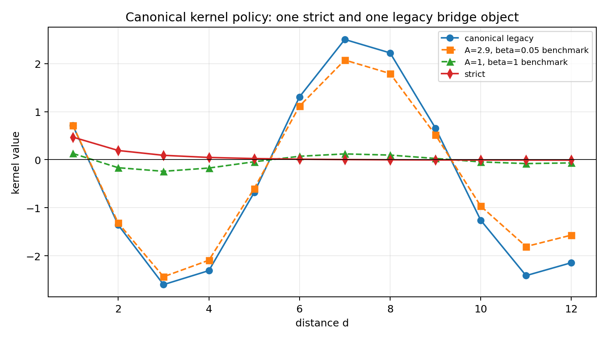
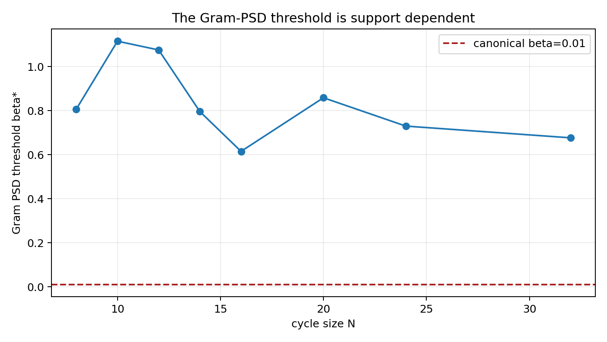
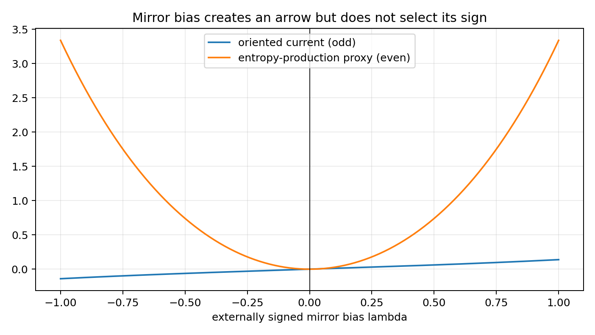

# FIN Post-41–50 Scientific Correction

## Methodology audit, mirror-coupling theorem, and canonical kernel policy

**FIN Research Supplement — Release 10.5**  
**Author:** Krzysztof Żuchowski  
**Affiliation:** Independent Researcher — Fractal Information Theory Project  
**ORCID:** 0009-0002-0909-3613  
**Publication type:** Preprint  
**Version:** 1.0.0  
**Date:** 27 July 2026  
**Language:** English  
**License:** CC BY 4.0

## Confidence convention

- **[Proven]** analytic theorem or exact finite algebra under the stated definitions.
- **[Strong evidence]** reproducible finite computation with a clear margin.
- **[Moderate evidence]** conclusion restricted to a declared model class.
- **[Conditional]** valid only after an additional operator, state, clock, or sector axiom.
- **[Refuted]** contradicted by an explicit calculation or counterexample.

All quantities in this report are dimensionless. No SI unit, physical clock, strict selector, legacy-role transfer, completed legacy-to-strict bridge, unit-bearing action, or Theory-of-Everything claim is exported.

---

# 1. Executive summary

This report re-audits the research artifacts added after Programs 31–40, including Program 42a, Programs 41–50, the legacy-star bridge audits, and P3171/P3172. It corrects methodological errors in the executable suite, performs new mirror-coupling tests, and freezes a kernel policy for subsequent work.

The principal conclusions are:

1. **There is no third canonical legacy kernel. [Proven]** The object called
   \[
   K^*(d)=A\frac{\cos(\pi d/4+\pi/6)}{1+\beta d}
   \]
   is a two-parameter family containing the already canonical legacy kernel exactly at
   \[
   A=4\ln2,\qquad \beta=0.01.
   \]
   The maximum difference is numerically zero.

2. **The freezes \((A,\beta)=(2.9,0.05)\) and \((1,1)\) are not canonical. [Proven]** Their relative profile distances from the canonical legacy object on \(d=1,\ldots,12\) are \(0.17892\) and \(0.94094\), respectively. They remain useful stress tests only.

3. **The P3172 Gram threshold is corrected. [Proven]** On the declared undirected \(Z_{12}\) Gram realization,
   \[
   \beta_*=1.075150776229914,
   \]
   not \(1.089\). The old value was the first positive point of an 80-point grid.

4. **The threshold is not universal. [Proven finite counterexamples]** Across cycle sizes \(N=8,10,12,14,16,20,24,32\), the threshold ranges from \(0.61472\) to \(1.11505\). It is a support-dependent finite property, not a physical constant.

5. **The raw quantity \(d_I=-\log|K|\) is not a metric. [Proven correction]** Previous code checked only the triangle inequality. The raw quantity has
   \[
   d_I(x,x)=-\log|A\cos(\pi/6)|,
   \]
   which is generally nonzero. At \(\beta=1\) the raw triangle inequality happens to hold on \(Z_{12}\), but the metric axioms still fail. Normalization by \(K(0)\) restores the zero diagonal but creates 96 triangle violations at \(\beta=1\). A genuine finite metric appears in the tested normalized construction only at the separate benchmark \(\beta=2\).

6. **The Program 42 phase fit is a tautology. [Proven correction]** Since both phases are affine in \(d\),
   \[
   \theta_s(d)=a\theta_\ell(d)+b,
   \quad
   a=\frac{\omega_s}{\omega_\ell},
   \quad
   b=\phi_s-a\phi_\ell,
   \]
   identically for every real \(d\). Its near-zero residual results from inserting the strict target parameters and has no predictive content.

7. **Program 43 contained data leakage. [Corrected]** Its declared training set was \(d=1,\ldots,4\), but the objective used all six points. The corrected training-only fit gives
   \[
   c=0.47447756,\qquad \eta=1.89178313,
   \]
   with training relative error \(0.137813\) and held-out \(d=5,6\) error \(0.999021\). The loss law does not generalize.

8. **The original Program 46 did not use its coupling operator. [Corrected]** It manually flipped an interference term after constructing an unused operator. The corrected test uses an actual mirror-odd Hermitian coupling.

9. **Mirror coupling has a precise but limited role. [Proven]** A passive reflected copy preserves symmetry. An inversion-odd carrier \(C\) with \(RCR=-C\) breaks reflection in a fixed branch
   \[
   H_\lambda=H_0+\lambda C,\qquad \lambda\ne0,
   \]
   but
   \[
   RH_\lambda R=H_{-\lambda}.
   \]
   The two branches are exactly isospectral. Thus \(C\) has the representation type required by the missing orientation object, but the sign/source law for \(\lambda\) is still absent.

10. **The kernel policy is now fixed.** Strict work uses \(K_{\rm strict\_gate}\). The only canonical non-strict bridge kernel is \(K_{\rm legacy\_ont}\) with \(A=4\ln2,\beta_{\rm tors}=0.01\). The legacy-star notation denotes an uncertainty family, not a new canonical kernel.

---

# 2. Scope and repository guardrails

The current repository distinguishes:

\[
K_{\rm legacy\_ont}(d)
=
4\ln2\,
\frac{\cos(\pi d/4+\pi/6)}{1+0.01d},
\]

an intermediate ontological/bridge kernel, from

\[
K_{\rm strict\_gate}(d)
=
\frac{\cos(0.18575d+0.16250)}{1+d^{1.8}},
\]

the later gate-selected strict working kernel.

This report treats strict as the primary strict object and legacy as an intermediate bridge object. It does not transfer legacy electroweak, electromagnetic, hierarchy, or torsion roles to strict.

The nadsoliton remains the primordial information in a solitonic state. No lower informational substrate is introduced.

---

# 3. Audit of the new research methodology

| Artifact or program | Original methodological status | Correction |
|---|---|---|
| Program 42a reconstruction | Useful historical audit, but calls an already documented functional class a new reconstruction | Retain as conditional diagram audit; identify \(K^*\) as the parameter family containing canonical legacy |
| Program 41 Loewner scan | Finite support comparison | Keep only as support/normalization counterexample; not a universal bridge test |
| Program 42 phase map | Target-inserted affine fit | Reclassify as exact coordinate identity with zero predictive content |
| Program 43 hazard | Objective leaked held-out points | Restrict objective to \(d=1,\ldots,4\); held-out failure remains |
| Program 44 information flow | Correct after declared positivity repair | Retain; it compares temporal calculi, not physical time selection |
| Program 45 environment recovery | Chosen Stinespring dilation | Retain as an existence witness, not a kernel-derived bath or unique recovery mechanism |
| Program 46 sign reference | Coupling operator constructed but unused | Replace with \(H_\lambda=H_0+\lambda C\), \(RCR=-C\) |
| Program 47 influence proxy | Post-hoc two-parameter regression | Retain only as a failed phenomenological fit |
| Program 48 feedback | Open-spiral proxy called work | Replace with the closed unit-circle integral \(3.4\pi=10.6814\) |
| Program 49 process tensor | Comparison of two Markov semigroups | Relabel as two-generator intervention discrimination, not a full process-tensor test |
| Program 50 challenge | Strict-generated target scored against strict | Reclassify as software self-recovery; no independent evidence |
| P3172 metric | Checked triangle inequality only | Check zero diagonal, nonnegativity, separation, symmetry, and triangle inequality |
| P3172 PSD threshold | First passing point on coarse grid | Bracket and bisect the eigenvalue crossing |

The corrected Programs 41–50 executable and JSON were regenerated.

---

# 4. Corrected finite results

## 4.1. Legacy-star is a family, not a third kernel

Define

\[
\mathcal K_*=
\left\{
A\frac{\cos(\pi d/4+\pi/6)}{1+\beta d}
:
A>0,\ \beta>0
\right\}.
\]

Then

\[
K_{\rm legacy\_ont}\in\mathcal K_*
\]

exactly at \(A=4\ln2\), \(\beta=0.01\). Therefore the terminology should be:

- `K_legacy_ont`: canonical legacy bridge kernel;
- `LegacyStarRadialFamily`: parameter family for uncertainty and stress testing;
- not `K_legacy_star` as a separate canonical physical kernel.

## 4.2. Gram positivity is support dependent

The exact finite thresholds are:

| Cycle size \(N\) | \(\beta_*(N)\) |
|---:|---:|
| 8 | 0.806516886 |
| 10 | 1.115047101 |
| 12 | 1.075150776 |
| 14 | 0.795468336 |
| 16 | 0.614721534 |
| 20 | 0.858165892 |
| 24 | 0.729453278 |
| 32 | 0.676222037 |

The canonical \(\beta_{\rm tors}=0.01\) is far below every listed Gram threshold. This does not invalidate the signed kernel as a self-adjoint interaction operator. It does invalidate interpreting its undirected matrix as a covariance/Gram kernel without an additional transformation.

## 4.3. Information-distance correction

For raw

\[
d_I(x,y)=-\log|K(d(x,y))|,
\]

the diagonal is not zero. Therefore it is not a metric at \(\beta=0.01,1,\) or \(2\), even when the triangle inequality happens to hold.

For the normalized candidate

\[
\widetilde d_I(x,y)
=
-\log\frac{|K(d(x,y))|}{|K(0)|},
\]

the finite results are:

| \(\beta\) | Nonnegative? | Triangle violations | Metric on tested \(Z_{12}\)? |
|---:|---|---:|---|
| 0.01 | no | 216 | no |
| 1 | yes | 96 | no |
| 2 | yes | 0 | yes |

This is a finite regime statement, not a canonical geometry theorem.

## 4.4. Corrected hazard generalization

The corrected fit uses only distances \(1\)–\(4\). The held-out error is approximately one:

\[
\varepsilon_{\rm train}=0.137813,
\qquad
\varepsilon_{\rm hold}=0.999021.
\]

The apparent exponent near \(1.9\) is not a derivation of strict \(\eta=1.8\); it is an unstable target-conditioned fit.

## 4.5. Feedback correction

For

\[
M=
\begin{pmatrix}
-0.8&-1.7\\
1.7&-0.8
\end{pmatrix},
\]

the eigenvalues are \(-0.8\pm1.7i\). The full normalized antisymmetry defect is

\[
\frac{\|M-M^T\|_F}{\|M\|_F}=1.8096374.
\]

The genuine unit-circle work is

\[
\oint_{|z|=1}(Mz)\cdot dz
=
3.4\pi
=
10.6814150.
\]

Stable feedback therefore need not be a gradient flow. This feedback law remains added rather than kernel-derived.

---

# 5. Mirror-coupling theorem

## 5.1. Passive reflection does not break symmetry

Let \(R\) be the reflection operator on \(Z_{12}\), \(R^2=I\). The canonical radial legacy matrix \(H_0\) satisfies

\[
RH_0R=H_0
\]

with zero finite residual.

Consequently:

- replacing \(H_0\) by \(RH_0R\) changes nothing;
- coupling \(H_0\) to an identical reflected copy with a symmetric off-diagonal block preserves a \(Z_2\) sector-exchange symmetry;
- the sign of an isolated two-copy coupling \(g\) is a gauge, because a sign flip on one copy maps \(g\) to \(-g\).

The finite two-copy sign-gauge and mirror-commutator residuals are both zero.

## 5.2. The inversion-odd carrier

Choose a directed representative \(D\) of the legacy-star family and define

\[
C
=
\frac{i}{2}(D-D^T).
\]

Then \(C=C^\dagger\) and

\[
RCR=-C.
\]

After Frobenius normalization, define

\[
H_\lambda=H_0+\lambda C.
\]

For \(\lambda=0.4\), the finite tests give:

| Test | Residual or value |
|---|---:|
| \(RH_0R-H_0\) | 0 |
| \(RCR+C\) | 0 |
| \(RH_{+\lambda}R-H_{-\lambda}\) | 0 |
| spectral difference \(H_{+\lambda}\) vs \(H_{-\lambda}\) | 0 |
| fixed-branch reflection commutator norm | 0.8 |

Thus:

> **Mirror theorem.** A nonzero inversion-odd coupling explicitly breaks reflection in a fixed signed branch, but the full \(+\lambda/-\lambda\) pair remains reflection symmetric and isospectral.

This theorem separates three claims:

1. existence of an odd carrier \(C\): **constructed**;
2. breaking of reflection after fixing \(\lambda\ne0\): **proven**;
3. internal selection of the sign of \(\lambda\): **not obtained**.

## 5.3. Does it match a missing theoretical object?

Yes, partially.

The operator \(C\) has exactly the inversion-odd/chiral representation type identified in the selector and orientation audits. It is a candidate carrier for:

- the orientation torsor;
- a chiral or pseudoscalar sector;
- a signed current;
- a polarity-sensitive apparatus coupling.

However, the construction of \(D\) already chooses a directed chart, and the scalar legacy kernel does not supply:

- a nonzero signed value of \(\lambda\);
- a law choosing \(+\lambda\) rather than \(-\lambda\);
- a coupling theorem from the informational nadsoliton to \(C\);
- a phase origin;
- a physical scale.

Therefore mirror coupling provides the **receiver/representation object**, not the missing **source/selector theorem**.

## 5.4. Classical directional realization

A positive-rate directional model can be constructed as

\[
w_{i,i+r}(\lambda)=a_r e^\lambda,
\qquad
w_{i,i-r}(\lambda)=a_r e^{-\lambda},
\]

with \(a_r=|K_{\rm legacy}(r)|\). At \(\lambda=0.4\):

| Quantity | Value |
|---|---:|
| uniform stationary residual | \(6.0\times10^{-16}\) |
| mirror covariance residual | \(9.4\times10^{-15}\) |
| nearest-edge stationary current | 0.0486395 |
| entropy-production rate | 5.03545 |

The current is odd in \(\lambda\), while entropy production is even. Negative and positive couplings are mirror descriptions unless an external orientation reference fixes the sign.

---

# 6. Canonical kernel policy for future work

## 6.1. Primary kernel

Use

\[
K_{\rm strict\_gate}(d)
=
\frac{\cos(0.18575d+0.16250)}{1+d^{1.8}}
\]

for strict-pipeline calculations, strict dual dynamics, and any work claiming compatibility with the current strict gate.

## 6.2. Only canonical kernel outside strict

Use

\[
\boxed{
K_{\rm legacy\_ont}(d)
=
4\ln2\,
\frac{\cos(\pi d/4+\pi/6)}{1+0.01d}
}
\]

as the sole canonical non-strict intermediate bridge kernel.

## 6.3. Objects that are not additional canonical kernels

| Object | Future status |
|---|---|
| \(K^*(A,\beta)\) | uncertainty/stress-test family containing canonical legacy |
| \(K^*(2.9,0.05)\) | historical diagram benchmark only |
| \(K^*(1,1)\) | finite operator-scale benchmark only |
| rejected double-damped product | retire |
| \(|K_{\rm legacy}|\) | declared magnitude projection for sensitivity tests, not a kernel identity |
| \(\max(K_{\rm legacy},0)\) | declared positive-part projection for sensitivity tests |
| mirror-odd \(C\) | conditional sector operator; not a replacement kernel |

## 6.4. Dynamics policy

- For primary Markov/diffusive work, use strict because its declared \(C_{12}\) weights are positive.
- For legacy spectral/unitary work, use the signed self-adjoint legacy matrix; a scalar spectral shift may be used but must be declared.
- For legacy Markov sensitivity, report both positive-part and absolute-value repairs. Programs 31–40 proved that the repair is nonunique and dynamically consequential.
- Do not call either repair “the legacy kernel.”
- Add \(C\) only in an explicitly conditioned sector-axiom branch.

---

# 7. What survives after correction

## Proven or retained

- Canonical legacy and strict remain distinct but related research objects.
- The legacy-star functional family is mathematically useful.
- Dual Borel dynamics from one self-adjoint generator remains valid.
- Apparent reduced information loss remains compatible with environmental transfer.
- The raw signed legacy kernel is not a classical Markov-rate matrix.
- Mirror-odd coupling can create a genuine directional branch.
- The \(+\lambda\) and \(-\lambda\) branches remain mirror-paired and isospectral.

## Refuted or demoted

- A new third canonical legacy-star kernel.
- Phase-fit residual as evidence of strict-phase derivation.
- Program 50 as independent validation of strict.
- Original Program 46 as an executed coupling test.
- Raw \(-\log|K|\) as a metric merely because triangles pass.
- \(\beta_*\) as a universal constant.
- Mirror copying alone as symmetry breaking.
- Mirror-odd carrier existence as selector closure.

---

# 8. Recommended continuation

1. **Freeze the kernel policy in documentation.** Use only strict plus canonical legacy; treat all other freezes as benchmarks.
2. **Develop the mirror carrier only as a conditioned sector object.** Write
   \[
   H_{\lambda}=H_0+\lambda C
   \]
   with explicit `SA_mirror(lambda, orientation)` labeling.
3. **Attack the real missing theorem:** derive or rule out a non-premise signed source law
   \[
   \mathrm{Source}_{\rm mirror}(\text{nadsoliton})\longrightarrow
   \lambda C,
   \qquad \lambda\ne0.
   \]
4. **Do not perform further scalar or affine phase fits.** They cannot source orientation or strict phase parameters.
5. **Replace synthetic self-recovery with blinded external targets.** A valid kernel-selection challenge must hide the generating model and must not include exact target code as a candidate by construction.
6. **Keep unit and selector frontiers separate.** Mirror chirality cannot supply \(S_+\), \(\hbar_*\), length, time, or action units.
7. **Run both quantum and stochastic mirror branches.** Test whether one signed \(\lambda\) explains orientation-sensitive records across both categories after clock and apparatus marginalization.

---

# 9. Final scientific judgment

The post-31–40 research contains useful finite mathematics, but several headline results were stronger than their methods justified. After correction, the scientifically stable structure is:

\[
\boxed{
K_{\rm legacy\_ont}
\quad\text{(canonical intermediate bridge object)}
\qquad\text{and}\qquad
K_{\rm strict\_gate}
\quad\text{(primary strict working object)}.
}
\]

The legacy-star notation is retained only for the parameter family containing the canonical legacy kernel.

Mirror coupling does not solve the theory by passive reflection. Its nontrivial contribution is sharper:

\[
\boxed{
\text{it constructs the correct inversion-odd carrier, but not the law selecting its sign.}
}
\]

It therefore matches the shape of a missing theoretical object while leaving the actual selector, source provenance, dimensional scale, and legacy-to-strict bridge open.

---

# Reproducibility

- Corrected Programs 41–50 code: `fin_programs_41_50_legacy_star.py`
- Corrected Programs 41–50 record: `FIN_Programs_41_50_Legacy_Star_Results.json`
- P3172 corrected code and tests: `fundamental_action_reconstruction/p3172_s2122_legacy_star_operator_model_generator_potential_audit.py`
- New correction/mirror suite: `fin_post_41_50_correction_and_mirror.py`
- New machine-readable record: `FIN_Post_41_50_Corrected_Results.json`
- Figures: `FIN_Post_41_50_Correction_Figures/`

Suggested citation:

Żuchowski, K. (2026). *FIN Post-41–50 Scientific Correction: Methodology Audit, Mirror-Coupling Theorem, and Canonical Kernel Policy* (FIN Research Supplement, Release 10.5; Version 1.0.0) [Preprint].
