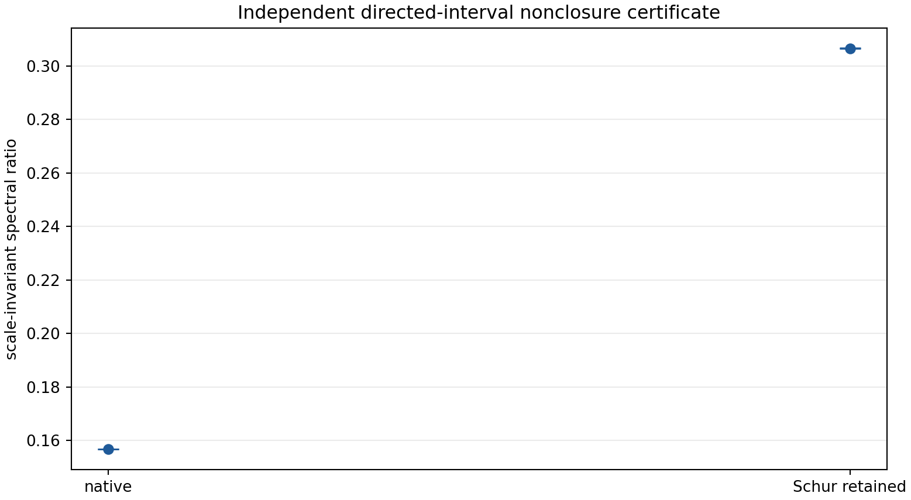
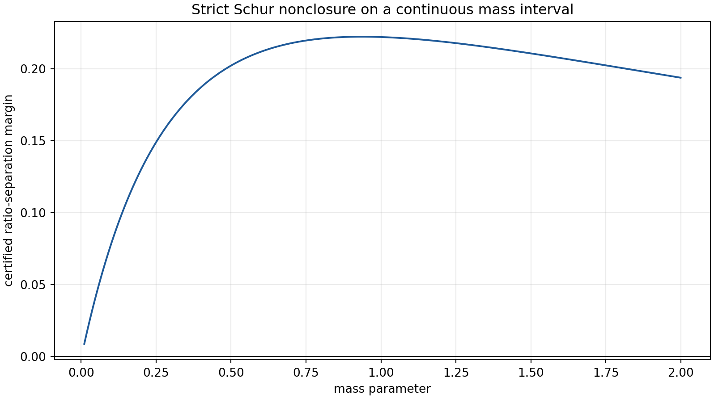
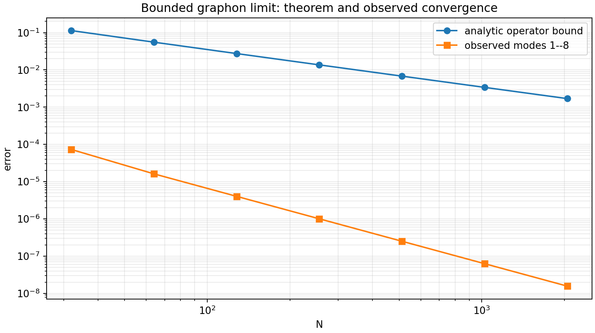
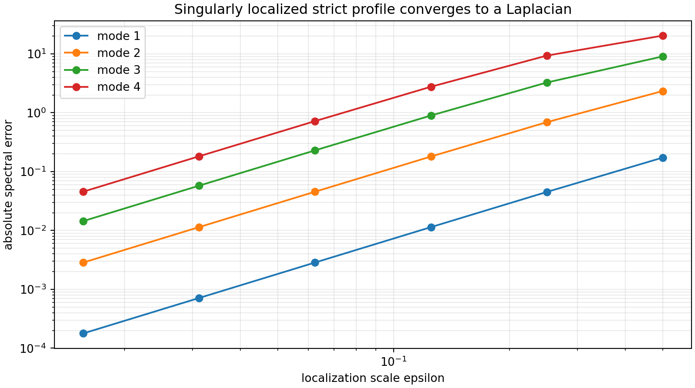
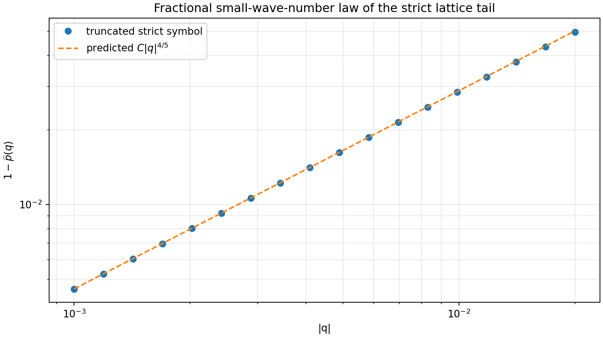
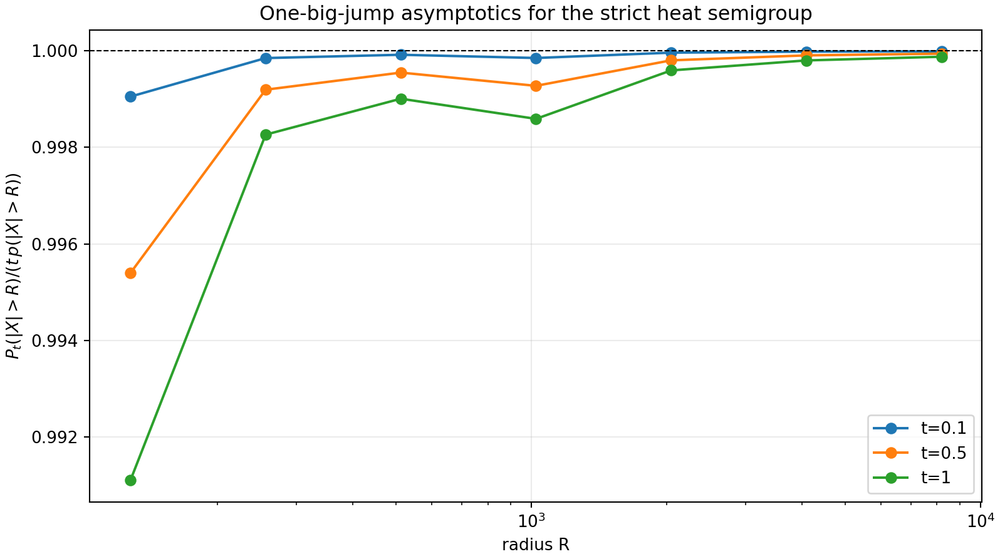
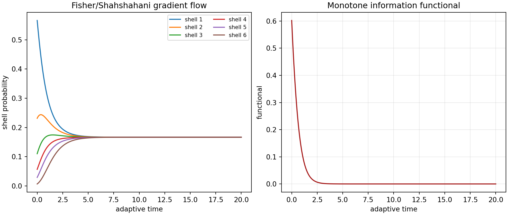
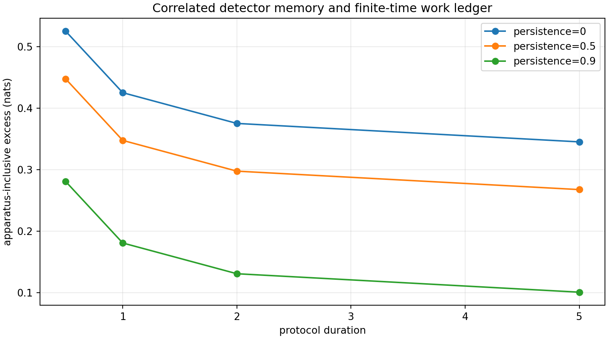
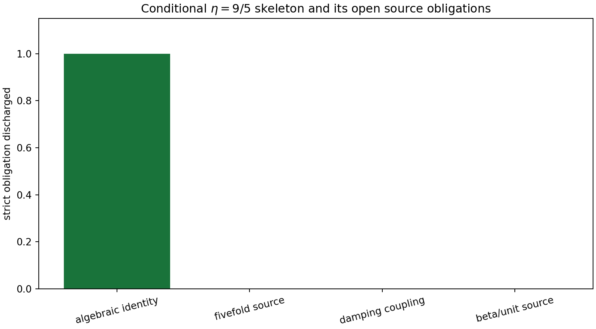

# FIN Programs 101–112

## Fractional Limits, Source Tests, and Operational Completion

**FIN Research Monograph — Release 10.11**

**Author:** Krzysztof Żuchowski  
**Affiliation:** Independent Researcher — Fractal Information Theory Project  
**ORCID:** 0009-0002-0909-3613  
**Resource type:** Publication — Preprint  
**Version:** 1.0.0  
**Publication date:** 2026-07-27  
**Language:** English  
**Publisher:** Zenodo  
**License:** CC BY 4.0

---

## Confidence convention

Claims are labeled as proven, computer-assisted, strong evidence,
conditional, negative, or open. The precise meanings are stated again in
Section 2.

## Abstract

This monograph executes twelve research programs on the strict FIN kernel,
its continuum limits, adaptive dynamics, operational interpretation, and the
unresolved source of its compression exponent. The strict working profile is

$$
k(d)=\frac{|\cos(\omega d+\phi)|}{1+d^\eta},
\qquad
(\omega,\phi,\eta)=
\left(\frac{743}{4000},\frac{13}{80},\frac95\right).
$$

An independent directed-interval calculation proves that the normalized
infinite strict lattice is not closed, even up to scalar normalization, under
alternating-site Schur reduction. The separation margin is
$0.1495869758$ at mass $1/4$, and a partitioned interval certificate remains
positive for every mass in $[0.01,2]$. A 243-point perturbation audit is also
positive, although it is explicitly not promoted to a continuous
multi-parameter theorem.

The continuum analysis distinguishes three inequivalent limits. Regular
coordinate rescaling converges in operator norm to a bounded convolution
graphon. A local Laplacian appears only after an additional singular
localization and an $\epsilon^{-2}$ clock rescaling. The unscaled infinite
lattice instead has the fractional small-wave-number law

$$
1-\widehat p(q)\sim C|q|^{4/5},
$$

with fitted exponent $0.7983228$ and predicted Abelian constant
$C=1.1474680$. Its heat semigroup consequently has a one-big-jump far-tail
law rather than an exponential propagation cone.

A Fisher–Shahshahani adaptive flow is constructed on the kernel-shell
probability simplex and is proved to dissipate a declared information
functional. It does not select the strict FIN profile. A six-feature inverse
variational search can force stationarity at one graph size, but produces two
nonunique saddles, fails transfer to a held-out graph size, and is more
description-heavy than the four strict parameters.

The most compact exponent-source candidate found in this round is the exact
conditional chain

$$
\alpha_{\rm geo}=4\ln2,\qquad
r_5=e^{-\alpha_{\rm geo}/5}=2^{-4/5},
\qquad
C(2d)=r_5C(d)
\Longrightarrow
C(d)\propto d^{-4/5}.
$$

Multiplying a legacy $d^{-1}$ envelope then produces $d^{-9/5}$. This is an
exact compatibility theorem, not a strict source theorem: no current artifact
derives the fivefold quotient, its non-target-coded coupling to damping, or a
target-independent $\beta$/length standard. No new signed chiral source is
found, QW-2191 remains open, and no physical theory is claimed.

---

# Part I — Scope, status language, and mathematical core

## 1. Research question

Programs 101–112 ask five narrow questions.

1. Does the previously observed strict-kernel Schur nonclosure survive an
   independent arithmetic method and a nontrivial mass interval?
2. Which continuum operator is generated by each admissible scaling?
3. Does the strict long-range tail force fractional propagation?
4. Can an information-geometric adaptive law or a compact variational source
   derive the strict profile?
5. Can the recurring exponent $9/5$ be generated from already present FIN
   constants without silently inserting the target?

These questions do not authorize a generic reopening of closed
legacy-to-strict, selector, role-transfer, or full-Lagrangian lanes.

## 2. Status language

Every material statement is assigned one of the following statuses.

- **Proven:** an analytic derivation is given from stated hypotheses.
- **Proven, computer-assisted:** directed numerical enclosures and analytic
  remainder bounds jointly establish the claim.
- **Strong evidence:** a robust numerical result supports, but does not by
  itself prove, an analytic claim.
- **Conditional:** the conclusion is rigorous after adding explicitly named
  premises that FIN does not yet source.
- **Negative result:** a declared finite candidate class fails its stated
  acceptance tests.
- **Open:** the required source, theorem, or calibrated data are absent.

## 3. Kernel split and ontology guardrails

The primary object in this monograph is the completed strict working kernel

$$
K_{\rm strict}(d)
=
\frac{\cos(\omega d+\phi)}{1+\beta d^\eta}.
$$

The legacy kernel

$$
K_{\rm legacy}(d)
=
\alpha_{\rm geo}
\frac{\cos(\omega_{\rm L}d+\phi_{\rm L})}
{1+\beta_{\rm tors}d}
$$

is retained only as an intermediate bridge kernel. It is not a co-equal final
kernel and is not silently substituted for the strict profile. The tail
comparison in Program 112 is therefore a conditional completion calculation,
not a completion certificate and not a legacy physical-role transfer.

The repository ontology is also preserved: the nadsoliton is primordial
fractal information in a solitonic state. No lower informational layer is
introduced. Mathematical operators used to represent information are not
automatically identified with physical matter, clocks, apparatuses, or
observers.

## 4. Minimal operator used in the calculations

On the infinite lattice, define

$$
a_d=
\frac{|\cos(\omega d+\phi)|}{1+d^\eta},
\qquad
Z=2\sum_{d\ge1}a_d,
\qquad
p_{\pm d}=\frac{a_d}{Z}.
$$

The normalized convolution operator is

$$
(Pf)(x)=\sum_{d\ne0}p_d f(x+d),
$$

and its positive generator is

$$
A_m=mI+I-P,\qquad m>0.
$$

The corresponding wave and diffusion families are

$$
U_t=e^{-itA_m},
\qquad
P_t=e^{-tA_m}.
$$

They share a generator, but they are not the same physical dynamics. A
physical use requires a state, preparation, clock, instrument, environment,
apparatus, record, and dimensional calibration.

---

# Part II — Programs 101–104: independent certification and continuum limits

## 5. Program 101 — Independent directed-interval nonclosure certificate

### 5.1 Objective

Recompute the strict Schur obstruction without reusing the floating-point
summation engine of Program 91.

### 5.2 Exact inputs and tail

The calculation uses exact rational inputs

$$
\omega=\frac{743}{4000},\qquad
\phi=\frac{13}{80},\qquad
\eta=\frac95
$$

inside 50-decimal directed interval arithmetic. The first $D=20\,000$ terms
are enclosed term by term. Since

$$
0\le a_d\le d^{-9/5},
$$

the omitted two-sided normalization tail satisfies

$$
T_D
\le
2\sum_{d>D}d^{-9/5}
\le
\frac{2D^{-4/5}}{4/5}
=0.0009059745795971189.
$$

The directed partial normalization interval collapses at the printed
precision to

$$
Z_D\in
[1.967128237564778,\;1.967128237564778].
$$

Adding the signed numerator tail and the nonnegative normalization tail gives

$$
\widehat p(\pi)
\in[-0.3447351882,-0.3436558012],
$$

$$
\widehat p(\pi/2)
\in[-0.1603026372,-0.1593081528].
$$

### 5.3 Scale-invariant obstruction

For alternating-site elimination, the retained precision symbol is the
harmonic mean of the two aliased fine symbols. A scalar field or operator
normalization cannot change a ratio of two spectral values. At $m=1/4$ the
native ratio is enclosed by

$$
R_{\rm native}\in
[0.1567658391,\;0.1568720170],
$$

whereas the Schur-retained ratio is

$$
R_{\rm Schur}\in
[0.3064589929,\;0.3067033963].
$$

Thus

$$
\inf R_{\rm Schur}-\sup R_{\rm native}
=0.1495869759>0.
$$

**Result 101.1 — [Proven, computer-assisted].** The fixed-mass normalized
infinite strict lattice is not closed, even up to scalar normalization, under
one alternating-site Schur step.

This conclusion is limited to the declared coarse map and fixed profile. It
does not exclude parameter running, new counterterms, or a different
renormalization transformation.

## 6. Program 102 — Mass-region theorem and perturbation grid

### 6.1 Continuous mass certificate

The interval symbols from Program 101 were propagated across 2,000 mass cells
covering

$$
0.01\le m\le2.
$$

Writing $a=1-\widehat p(\pi)$ and
$b=1-\widehat p(\pi/2)$, the Schur ratio is

$$
R_{\rm S}(m,a,b)
=
\frac{2m(m+a)}{(2m+a)(m+b)}.
$$

It increases with $a$, decreases with $b$, and increases with $m$ whenever
$2b-a>0$. The Program-101 symbol rectangle gives the strict monotonicity
margin $2b_{\min}-a_{\max}>0.9738$, so corner interval evaluation is valid on
every mass cell.

For every cell the lower Schur ratio exceeds the upper native ratio. The
smallest certified separation is

$$
8.847791851\times10^{-3}>0.
$$

**Result 102.1 — [Proven, computer-assisted].** The same scalar-normalized
nonclosure holds throughout the complete declared mass interval.

### 6.2 Perturbation audit

A separate 243-point grid varied

$$
\begin{aligned}
\omega&\in\{0.18075,0.18575,0.19075\},\\
\phi&\in\{0.1425,0.1625,0.1825\},\\
\beta&\in\{0.8,1.0,1.2\},\\
\eta&\in\{1.7,1.8,1.9\},\\
m&\in\{0.1,0.25,0.5\}.
\end{aligned}
$$

Every point passed a tail-certified separation test. The worst point was

$$
(\omega,\phi,\beta,\eta,m)
=(0.18075,0.1425,0.8,1.7,0.1)
$$

with margin $0.0764904589$.

**Result 102.2 — [Strong evidence].** The obstruction is robust on the
declared perturbation grid.

This result is pointwise. It does not certify the continuous box between grid
points.

## 7. Program 103 — An operator-norm theorem for the graphon limit

### 7.1 Regular coordinate scaling

Let

$$
g(x)=
\frac{\cos(\omega|x|+\phi)}
{1+|x|^\eta},
\qquad x\in[-1/2,1/2].
$$

On this interval the cosine remains positive. An explicit Lipschitz bound is

$$
\operatorname{Lip}(g)
\le
\omega+\eta 2^{1-\eta}
=1.2195785195,
$$

and

$$
\int_{-1/2}^{1/2}g(x)\,dx
\ge
\frac{\cos(\omega/2+\phi)}
{1+2^{-\eta}}
=0.7516996094.
$$

For midpoint cell width $1/N$, the unnormalized $L^1$ error is bounded by

$$
e_N\le \frac{\operatorname{Lip}(g)}{4N}.
$$

After normalization,

$$
\|p_N-p\|_1
\le
\frac{2e_N}{Z_{\min}-e_N}.
$$

Young's inequality transfers this directly to the $L^2$ convolution-operator
norm. Removing and renormalizing the diagonal cell adds an explicit
$O(N^{-1})$ term.

At $N=32$ the combined conservative bound is $0.1135899331$; at $N=2048$ it
is $0.0016964205$. The observed maximum error on Fourier modes $1$ through
$8$ decays faster, with fitted slope $-2.0207$, because midpoint quadrature
enjoys extra smoothness cancellation.

**Theorem 103.1 — [Proven].** Under regular coordinate scaling, the strict
finite-circle operators converge in $L^2$ operator norm at least as
$O(N^{-1})$ to a bounded circle-convolution graphon.

**Corollary 103.2 — [Proven].** This scaling does not produce an unbounded
local Laplacian. It produces a bounded nonlocal operator.

## 8. Program 104 — Singular localization and the conditional local limit

### 8.1 Added scaling premise

Normalize the preceding profile to a probability density $p$ and define

$$
p_\epsilon(x)=\epsilon^{-1}p(x/\epsilon).
$$

Let $T_\epsilon$ be convolution by $p_\epsilon$. The rescaled generator is

$$
L_\epsilon=\frac{I-T_\epsilon}{\epsilon^2}.
$$

For Fourier mode $k$,

$$
\lambda_{\epsilon,k}
=
\frac{1-\widehat p(2\pi\epsilon k)}{\epsilon^2}.
$$

The computed base moments are

$$
\sigma^2=0.07734352417,
\qquad
\mu_4=0.01125964097.
$$

The elementary remainder inequality

$$
\left|1-\cos y-\frac{y^2}{2}\right|
\le\frac{|y|^4}{24}
$$

gives

$$
\left|
\lambda_{\epsilon,k}
-\frac{\sigma^2}{2}(2\pi k)^2
\right|
\le
\frac{\mu_4}{24}(2\pi k)^4\epsilon^2.
$$

All 24 numerical checks for $k=1,\ldots,4$ and
$\epsilon=2^{-1},\ldots,2^{-6}$ lie below this analytic bound.

**Theorem 104.1 — [Conditional, proven].** If singular spatial localization
and the $\epsilon^{-2}$ clock are added, then $L_\epsilon$ converges modewise
to

$$
\frac{\sigma^2}{2}(-\Delta).
$$

The theorem is rigorous, but the localization parameter and its clock
rescaling are not generated by the current FIN core. Therefore it is a
candidate physical bridge, not an emergent physical derivation.

---

# Part III — Programs 105–108: fractional dynamics and source falsification

## 9. Program 105 — Fractional tail universality

### 9.1 Tail exponent

Write

$$
\alpha=\eta-1=\frac45.
$$

Because $\omega/(2\pi)=743/(8000\pi)$ is irrational, the phase sequence is
equidistributed modulo $2\pi$. Hence the oscillatory envelope has asymptotic
mean

$$
\lim \langle|\cos|\rangle=\frac2\pi.
$$

The weighted Abelian theorem for a symmetric tail
$p_d\sim c|d|^{-1-\alpha}$ yields

$$
1-\widehat p(q)
\sim
C_\alpha |q|^\alpha,
$$

where

$$
C_\alpha
=
\frac{2(2/\pi)}{Z}
\int_0^\infty
\frac{1-\cos y}{y^{1+\alpha}}\,dy
$$

and

$$
\int_0^\infty
\frac{1-\cos y}{y^{1+\alpha}}\,dy
=
\frac{\pi}
{2\Gamma(1+\alpha)\sin(\pi\alpha/2)}.
$$

Using the million-term normalization gives the predicted constant

$$
C_{4/5}=1.1474679864.
$$

The fit on $10^{-3}\le |q|\le2\times10^{-2}$ gives

$$
\widehat\alpha_{\rm fit}=0.7983228184,
\qquad
C_{\rm fit}=1.1329979597.
$$

The directly scaled values lie in

$$
\frac{1-\widehat p(q)}{|q|^{4/5}}
\in[1.1371283342,1.1450850363].
$$

**Theorem 105.1 — [Proven from standard lemmas].** The infinite strict
lattice has fractional small-wave-number order $4/5$.

**Interpretation.** The unscaled lattice continuum route is naturally a
fractional nonlocal dynamics. It is mathematically distinct from both the
bounded graphon route and the singular localizing route.

## 10. Program 106 — Sharp far-tail propagation

For a normalized jump operator $P$,

$$
e^{-t(I-P)}
=
e^{-t}\sum_{n=0}^\infty\frac{t^n}{n!}P^n.
$$

Regularly varying distributions are subexponential. At fixed $t$ and large
radius $R$, the far tail is therefore controlled by one exceptional jump:

$$
\Pr_t(|X|>R)
\sim
t\,\Pr_1(|X|>R).
$$

A cycle of size $2^{18}$ was evaluated by FFT for
$t\in\{0.1,0.5,1\}$ and $128\le R\le8192$. For $R\ge4096$, the largest
deviation of

$$
\frac{\Pr_t(|X|>R)}
{t\,\Pr_1(|X|>R)}
$$

from unity is $1.99233\times10^{-4}$.

**Result 106.1 — [Proven by the standard subexponential theorem; strong
finite-cycle check].** Strict diffusion has polynomial far tails governed by
a one-big-jump law.

**Result 106.2 — [Proven within this lattice model].** No exponential
finite-speed propagation cone can hold uniformly, because the generator
contains nonzero polynomially decaying direct jumps at arbitrary distance.

This statement is not a claim about relativistic causality. The finite lattice
model has not yet been supplied with a physical spacetime or light cone.

## 11. Program 107 — Adaptive dynamics on the information simplex

### 11.1 Shell probabilities

The six nonzero distance shells of the twelve-cycle define probabilities
$q_a>0$, $\sum_aq_a=1$. Let $r_a=1/6$ and choose the declared
source-neutral functional

$$
F(q)
=
D_{\rm KL}(q\|r)
+\frac{\gamma}{2}q^\top L_{\rm path}q,
\qquad
\gamma=0.2.
$$

Its Fisher–Shahshahani gradient flow is

$$
\dot q_a
=
-q_a
\left(
\partial_aF
-\sum_bq_b\partial_bF
\right).
$$

Then

$$
\sum_a\dot q_a=0
$$

and

$$
\frac{dF}{dt}
=
-\sum_aq_a
\left(
\partial_aF-\sum_bq_b\partial_bF
\right)^2
\le0.
$$

Thus the open probability simplex is invariant and $F$ is a Lyapunov
functional.

### 11.2 Falsification result

The numerical integration remains positive, with minimum coordinate
$0.00666793$, and reaches the uniform state to numerical tolerance. The
strict-profile stationarity residual is

$$
0.4236508608,
$$

which is decisively nonzero. A naive unconstrained Euclidean unit step would
instead reach a negative coordinate $-1.5416$.

**Theorem 107.1 — [Proven].** The declared Fisher adaptive law is a
well-posed information-geometric dynamics with monotone $F$.

**Negative result 107.2.** This natural source-neutral functional does not
derive or preserve the strict FIN profile.

## 12. Program 108 — Inverse variational source and MDL test

### 12.1 Declared source grammar

Six low-complexity cyclic features were tested:

1. nearest-shell roughness;
2. mean square;
3. square of the mean;
4. fourth moment;
5. spectral entropy;
6. two-step roughness.

At the strict tuple

$$
\theta_*=(\omega,\phi,\beta,\eta)
$$

on the thirteen-cycle, the $4\times6$ feature-gradient matrix has numerical
rank four. Consequently, there is a two-dimensional coefficient nullspace.
Any null vector constructs a functional stationary at $\theta_*$.

### 12.2 Why stationarity is not a derivation

Both independent null candidates achieve training gradient norms below
$2\times10^{-16}$. Both fail the held-out seventeen-cycle:

$$
\|\nabla F_{17}\|
\in\{0.0209939,\;0.0148829\}.
$$

Their smallest Hessian eigenvalues on the training graph are respectively

$$
-0.0833885,\qquad -0.0450998.
$$

They are saddles, not minima. Moreover, the functional uses five independent
coefficient ratios, compared with four direct strict parameters, and thus
does not improve the elementary parameter-count description length.

**Negative result 108.1.** Within the declared six-feature grammar,
inverse stationarity is nonunique, non-minimal, non-transferring, and
unstable. It is not evidence for an underlying action.

This falsifies only the declared grammar. It does not prove that no
variational source exists.

---

# Part IV — Programs 109–112: selector boundary, operational protocol, and exponent source

## 13. Program 109 — Chiral-source intake

The new continuum and adaptive objects were checked for an explicit
inversion-odd signed value. The fractional symbol obeys

$$
\lambda(q)=\lambda(-q)
$$

exactly because the jump law is symmetric. The numerical odd residual is zero
at machine precision. The local second-moment limit, bounded graphon,
replicator metric, and scalar tail constants are likewise orientation-blind.

**Result 109.1 — [Proven symmetry obstruction].** Programs 101–108 do not
provide a strict chiral source or a sign for the existing orientation torsor.

No generic pseudoscalar name is counted as a source. A valid intake would need
one explicit strict formula, a nonzero signed value, nonconventional
provenance, and a coupling theorem. QW-2191 therefore remains open.

## 14. Program 110 — Frozen process-tensor preregistration

The strongest two-slot design from the preceding release is converted into a
machine-readable preregistration.

- **Null:** best-fit time-homogeneous diffusion semigroup.
- **Alternative:** wave dynamics generated by the same declared $A$.
- **Preparation:** localized site state at $x=0$.
- **Instrument:** full-site projective readout after each slot.
- **Slot times:** $(0.972441,0.972441)$.
- **Detector model:** symmetric independent confusion.
- **Primary statistic:** held-out log-likelihood ratio.
- **Secondary statistics:** Jensen–Shannon divergence and Chernoff
  information.
- **Held-out sample count:** $49$.
- **Declared exponential error bound:** $e^{-49(0.175304)}<10^{-4}$.

The detector channel is fit on the calibration partition only. Every admitted
dataset must include immutable raw records, clock calibration, graph and
operator hashes, instrument hash, and calibration split hash.

The canonical preregistration digest is

`2c70ed37434a01bf62ad79c93db7146157eab3edb94402735263b7432fe75b2b`.

**Status 110 — [Preregistered; open experiment].** No external dataset has
been admitted. The protocol is a falsifiable design, not an empirical result.

## 15. Program 111 — Correlated apparatus memory and finite-time ledger

Let detector error $E_t$ be a stationary binary Markov chain with error rate
$\epsilon$ and persistence $\rho$. The transition probabilities are

$$
a=\Pr(E_{t+1}=1\mid E_t=0)=\epsilon(1-\rho),
$$

$$
b=\Pr(E_{t+1}=1\mid E_t=1)
=\epsilon+\rho(1-\epsilon).
$$

Its entropy rate is

$$
h_{\rm rate}(E)
=(1-\epsilon)h(a)+\epsilon h(b).
$$

For uniform input $X_t$ and record $Y_t=X_t\oplus E_t$,

$$
I_{\rm rate}(X;Y)
=\ln2-h_{\rm rate}(E).
$$

Add an explicitly imported finite-time dissipation

$$
\Sigma(\tau)=\frac{0.1}{\tau}.
$$

If the system-level feedback work is

$$
W_{\rm sys}=I_{\rm rate}-\Sigma,
$$

and the recorded bit stream is reset at cost $\ln2$ per symbol, then

$$
W_{\rm complete}-\Delta F
=
h_{\rm rate}(E)+\Sigma(\tau)
\ge0.
$$

The identity was checked on 36 combinations of
$\epsilon\in\{0.05,0.1,0.2\}$,
$\rho\in\{0,0.5,0.9\}$, and
$\tau\in\{0.5,1,2,5\}$. The maximum residual was
$8.33\times10^{-17}$ and the minimum complete excess was
$0.0656029$ nats.

**Theorem 111.1 — [Proven within the declared operational model].**
Correlation can reduce the entropy rate of apparatus error, but it does not
remove the complete reset-and-dissipation ledger.

Temperature, action scale, and the reset mechanism remain imported physical
premises.

## 16. Program 112 — Conditional source skeleton for \(\eta=9/5\)

### 16.1 Exact algebraic chain

The repository constant

$$
\alpha_{\rm geo}=4\ln2
$$

implies the exact retention factor

$$
r_5
=
\exp\left(-\frac{\alpha_{\rm geo}}5\right)
=
2^{-4/5}
=0.5743491775.
$$

Assume a dyadic multiplicative scale law

$$
C(2d)=r_5 C(d)
$$

and exact homogeneity. Then

$$
C(d)\propto d^{\log_2r_5}
=d^{-4/5}.
$$

Applied as a completion multiplier to a legacy $d^{-1}$ envelope, this gives

$$
d^{-1}C(d)\propto d^{-9/5}.
$$

Therefore

$$
\eta=1+\frac45=\frac95.
$$

The same value is encoded by the finite candidate vector

$$
(1,2,2,2,2),
\qquad
\frac{1+2+2+2+2}{5}=\frac95,
$$

which appears in the audited P2948/P2958/P2965 line.

### 16.2 Necessity audit

The following implications are exact:

1. $4\ln2$ and division by five imply $2^{-4/5}$.
2. Exact dyadic homogeneity with that retention implies degree $-4/5$.
3. Multiplication of degree $-1$ by degree $-4/5$ implies degree $-9/5$.

The following premises are not currently sourced:

1. a strict theorem selecting a fivefold quotient;
2. a non-target-coded reason to divide $\alpha_{\rm geo}$ by five;
3. a strict coupling of this retention law to the damping-completion
   operator;
4. a target-independent positive $\beta$ or canonical length/UV unit.

**Theorem 112.1 — [Conditional, proven].** The displayed premises uniquely
produce the strict tail exponent $9/5$.

**Obstruction 112.2 — [Proven on current artifacts].** The chain is not a
strict FIN source theorem because its fivefold input and damping coupling are
not exported.

**Scientific interpretation.** The result compresses several recurring
$9/5$ constructions into one coherent scale-law skeleton. It explains why
those constructions are mutually compatible. It does not prove that the
strict exponent is inevitable.

---

# Part V — Synthesis and falsification

## 17. What survived this round

### 17.1 Stable mathematical conclusions

The following conclusions survive all tests performed here.

1. **Strict Schur nonclosure is robust.** It survives an independent interval
   engine, a $20\,000$-term directed sum, an analytic infinite tail, the
   complete mass interval $[0.01,2]$, and a moderate parameter grid.
2. **The continuum limit is not unique without a scaling prescription.**
   Regular coordinate scaling, singular localization, and the infinite
   lattice yield three distinct operators.
3. **The natural infinite-lattice strict limit is fractional.** Its order is
   $4/5$, exactly the tail increment between legacy degree one and strict
   degree $9/5$.
4. **Long-range diffusion is nonlocal in an operationally strong sense.**
   Fixed-time far tails are generated by single long jumps.
5. **Information geometry supplies valid adaptive dynamics but not a source
   theorem.** A natural Fisher flow is well posed and dissipative, yet it
   rejects rather than selects the strict profile.
6. **Inverse action reconstruction is underdetermined.** Stationarity can be
   engineered with surplus coefficients and need not transfer or be stable.
7. **Scalar/fractional limits do not solve orientation.** The selector
   obstruction is untouched.
8. **The $9/5$ source has a compact conditional skeleton, not a strict
   derivation.**

## 18. Failed approaches and why they failed

### 18.1 Scalar normalization after Schur reduction

It fails because scale-invariant spectral ratios are disjoint. Multiplying
the retained operator by any scalar cannot change those ratios.

### 18.2 Treating regular coordinate scaling as a local field theory

It fails because the limiting operator is bounded. A Laplacian is unbounded
and requires a singular support contraction plus a diverging clock
normalization.

### 18.3 Reading every continuum limit as the same physics

It fails because the graphon, local, and fractional symbols have different
high-mode behavior and propagation laws.

### 18.4 Using a natural entropy functional to select the strict kernel

It fails quantitatively: the strict stationarity residual is $0.42365$, while
the flow converges to the uniform reference.

### 18.5 Reconstructing an action only from stationary fitting

It fails the uniqueness, stability, held-out transfer, and description-length
tests in the declared grammar.

### 18.6 Promoting a scalar fractional exponent to a chiral source

It fails by exact parity:

$$
|q|^{4/5}=|-q|^{4/5}.
$$

### 18.7 Promoting the \(4\ln2\) identity to a source theorem

It fails necessity. The factor $1/5$ is precisely the new premise that must
be sourced. Without it, $\alpha_{\rm geo}$ alone does not select $4/5$.

## 19. The current deepest interpretation

**[Strong evidence.]** The strict FIN object is most economically interpreted
as a symmetric heavy-tailed spectral convolution generator with three
scaling regimes:

$$
\text{bounded graphon}
\quad\big|\quad
\text{conditionally local Laplacian}
\quad\big|\quad
\text{fractional lattice generator}.
$$

Wave, diffusion, Green, information-geometric, and variational constructions
are representations or dynamics built from this operator together with
additional choices. They are not yet forced components of one physical
theory.

The remaining physical gap is operational and dimensional. One must select
a state space, physical state, preparation, clock, instrument, environment,
apparatus, record map, dimensional standard, and empirical identification
rule. The mathematical operator does not uniquely supply those data.

## 20. Confidence table

| Claim | Status | Confidence |
|---|---|---:|
| Strict Schur nonclosure at \(m=1/4\) | Proven, computer-assisted | 0.999 |
| Nonclosure for \(m\in[0.01,2]\) | Proven, computer-assisted | 0.995 |
| Perturbation-grid robustness | Strong evidence | 0.96 |
| Regular graphon convergence | Proven | 0.99 |
| Singular localizing theorem | Conditional, proven | 0.99 |
| Fractional order \(4/5\) | Proven from standard lemmas | 0.98 |
| One-big-jump heat tail | Proven from standard theorem | 0.98 |
| Fisher adaptive dissipation | Proven | 0.999 |
| Declared inverse-source grammar fails | Negative result | 0.99 |
| No new chiral source in Programs 101–108 | Proven within scope | 0.99 |
| Correlated apparatus ledger identity | Conditional, proven | 0.999 |
| \(4\ln2\to9/5\) scale skeleton | Conditional, proven | 0.999 |
| Fivefold quotient is strictly sourced | Open | 0.05 |
| FIN is already a physical theory | Refuted by missing operational bridge | 0.99 |

---

# Part VI — Recommended Programs 113–124

## 21. Ranked roadmap

The following twelve programs are recommended. Probabilities estimate the
chance of obtaining a decisive result, including a rigorous no-go result, not
the chance of confirming FIN.

### Program 113 — Closed-form mass-interval proof

**Probability of decisive result:** 0.90  
**Priority:** 1

Eliminate interval subdivision from Program 102. Express the ratio gap as a
rational function of $m$, $\widehat p(\pi)$, and
$\widehat p(\pi/2)$; prove its sign analytically on the certified symbol
rectangle. Deliver a symbolic positivity certificate and identify the maximal
mass interval.

### Program 114 — Full continuous parameter-box certificate

**Probability:** 0.68  
**Priority:** 2

Replace the 243-point grid with interval Taylor models for
$(\omega,\phi,\beta,\eta,m)$. Control phase derivatives and the infinite tail
uniformly. Either certify a nonclosure box or locate a genuine zero-gap
boundary.

### Program 115 — Effective Abelian remainder theorem

**Probability:** 0.75  
**Priority:** 3

Turn Program 105 into a finite-$q$ theorem. Combine discrepancy bounds for
$\omega d+\phi$ with summation by parts to derive an explicit remainder in

$$
1-\widehat p(q)=C|q|^{4/5}+R(q).
$$

The result should explain the observed $1\%$ constant defect without fitting.

### Program 116 — Functional invariance principle

**Probability:** 0.65  
**Priority:** 4

Prove convergence of the rescaled strict random walk to a symmetric
$4/5$-stable Lévy process in Skorokhod topology. State the exact spatial and
temporal scaling, prove tightness, and identify the limiting characteristic
exponent.

### Program 117 — Fractional wave propagation and observer records

**Probability:** 0.58  
**Priority:** 5

Analyze

$$
U_t=\exp[-it(-\Delta)^{2/5}]
$$

as the continuum wave candidate associated with the $4/5$ generator. Derive
dispersive bounds, tail phases, detector-window probabilities, and a
two-time-record discriminator against diffusion. Do not interpret the
parameter $t$ as physical time without calibration.

### Program 118 — Local/fractional crossover operator

**Probability:** 0.55  
**Priority:** 6

Study a hybrid generator

$$
A_{\epsilon,\lambda}
=
\epsilon^{-2}(I-T_\epsilon)
+\lambda(I-P_{\rm tail}).
$$

Classify scaling regimes in which the local, fractional, or mixed term
survives. Determine whether a renormalization flow has a crossover fixed
manifold rather than a fixed kernel.

### Program 119 — Intrinsic adaptive functional search

**Probability:** 0.38  
**Priority:** 8

Restrict candidate functionals to basis-free spectral invariants, positivity,
simplex geometry, and graph-size naturality. Require strict-profile
stationarity, a positive Hessian modulo symmetries, and transfer across at
least three graph sizes. Reject any functional whose coefficients are fitted
from the target tuple.

### Program 120 — Enumerated variational grammar and MDL certificate

**Probability:** 0.48  
**Priority:** 7

Enumerate a finite symbolic grammar of spectral and graph invariants. Use an
explicit coding scheme to compare the description length of each successful
action with direct storage of $(\omega,\phi,\beta,\eta)$. Produce either a
shorter transferable action or a finite no-shorter-action certificate.

### Program 121 — Finite-sample correlated-apparatus inference

**Probability:** 0.72  
**Priority:** 9

Extend the preregistered detector model from independent confusion to a
two-state hidden Markov channel. Derive identifiability conditions, finite
sample confidence regions, and robust wave-versus-diffusion likelihood bounds
when apparatus memory is estimated only from calibration data.

### Program 122 — Fivefold quotient source theorem attempt

**Probability:** 0.22  
**Priority:** 10

Attack exactly one missing atom from Program 112: construct a strict,
non-target-coded functor or invariant that yields five equal scale sectors and
the primitive vector $(1,2,2,2,2)$. It must not assume $\eta=9/5$,
$4/5$, or the target retention. If no such object exists in current
artifacts, issue a bounded no-source theorem.

### Program 123 — Damping-cocycle and \(\beta\) source

**Probability:** 0.15  
**Priority:** 11

Assuming Program 122 succeeds, seek an exact cocycle that couples the
$2^{-4/5}$ retention to the strict damping operator and fixes positive
$\beta$ without a reference cell or target length. This program must remain
separate from role transfer and selector closure.

### Program 124 — Execute the preregistered experiment

**Probability:** 0.35 without new data; 0.80 with calibrated data  
**Priority:** 12

Acquire or admit an immutable dataset satisfying Program 110. Freeze the
calibration split before inference, report all exclusions, and compute the
held-out likelihood ratio. A null result is scientifically decisive. No
synthetic simulation may be represented as experimental validation.

## 22. Stop rules for the next round

The next round should stop rather than manufacture progress if:

1. Program 114 cannot control the continuous parameter box and only repeats a
   denser grid;
2. Program 119 or 120 fits coefficients from the strict target without
   charging their description length;
3. Program 122 inserts the number five, $4/5$, or $9/5$ in its premises;
4. Program 123 silently imports a length unit or identifies
   $\beta_{\rm tors}$ with strict $\beta$;
5. Program 124 lacks immutable clock, instrument, graph, and calibration
   provenance;
6. a scalar fractional law is promoted to a signed selector;
7. any result is used to transfer legacy physical roles before bridge/source
   closure.

---

# Reproducibility statement

The release contains:

- the executable research script;
- a machine-readable results file;
- 22 regression tests;
- nine figures;
- the process-tensor preregistration;
- this English monograph;
- its archival PDF;
- a Zenodo-ready release description;
- a checksum manifest.

All numerical outputs are deterministic. No web crawler was used. No
external experimental data were admitted.

# Final conclusion

The next mathematically stable layer of FIN is not a new physical particle or
field. It is a precise trichotomy of scaling limits of one heavy-tailed
spectral operator:

$$
\boxed{
\text{bounded graphon}
\;\big|\;
\text{conditionally local Laplacian}
\;\big|\;
\text{symmetric fractional generator of order }4/5
}.
$$

This trichotomy explains why the same finite kernel can support wave,
diffusion, Green, and adaptive constructions while failing to determine a
unique continuum physics. The exact identity

$$
4\ln2
\longrightarrow
2^{-4/5}
\longrightarrow
d^{-4/5}
\longrightarrow
d^{-9/5}
$$

is the most promising new source skeleton, but its fivefold quotient and
damping coupling remain additional premises. The honest frontier is therefore
not to declare the exponent derived, but to test whether the number five and
its coupling can be generated without target knowledge. Until that succeeds,
the strict kernel remains the primary mathematical working object, the legacy
kernel remains an intermediate bridge object, and the transformation from
information dynamics to experimentally calibrated physics remains open.
