# FIN Programs 113–124

## Constructive Completion Objects and Fractional Operational Physics

**FIN Research Monograph — Release 10.12**

**Author:** Krzysztof Żuchowski  
**Affiliation:** Independent Researcher — Fractal Information Theory Project  
**ORCID:** 0009-0002-0909-3613  
**Resource type:** Publication — Preprint  
**Version:** 1.0.0  
**Publication date:** 2026-07-27  
**Language:** English  
**Publisher:** Zenodo  
**License:** CC BY 4.0

---

## Confidence convention

Statements are classified as proven, proven computer-assisted, strong
evidence, conditional, negative, or open. A construction is not called a
strict source theorem unless its input objects and coupling are exported by
the strict FIN layer without target values in their premises.

## Abstract

This monograph executes twelve constructive research programs following the
fractional-limit analysis of FIN Programs 101–112. The objective is not merely
to list missing structures but to build the smallest explicit mathematical
objects capable of occupying those roles and then test whether FIN itself
forces them.

The first result upgrades strict-kernel Schur nonclosure from a bounded mass
certificate to a global theorem. If

$$
a=1-\widehat p(\pi),
\qquad
b=1-\widehat p(\pi/2),
$$

then the difference between the alternating-site Schur spectral ratio and the
native ratio factors exactly as

$$
R_{\rm S}-R_{\rm N}
=
\frac{
m\big[(3a-2b)m+a(2a-b)\big]
}{
(m+a)(2m+a)(m+b)
}.
$$

The independently certified strict symbol rectangle gives
$3a-2b\ge1.71036$ and
$a(2a-b)\ge2.05177$. Therefore the obstruction holds for every
$m>0$. A second analytic theorem extends it to a genuine continuous box in
$(\omega,\phi,\beta,\eta)$ and all positive masses.

The strict lattice jump process is placed in the normal domain of attraction
of a symmetric $4/5$-stable Lévy process under spatial scaling
$n^{-5/4}$. The limiting generator is

$$
C(-\Delta)^{2/5}.
$$

A ten-component operational process is then constructed: state space,
state, generator, wave/diffusion dynamics, clock, preparation, instrument,
environment, apparatus, and record. A correlated hidden-Markov apparatus
channel and calibration-only likelihood procedure complete the dimensionless
operational object. Physical clock, length, action calibration, and external
records remain absent.

The central new theoretical construction is a coefficient-free
homological-character fibre object over the strict $Z_{12}$ carrier. For each
prime generator $p<12$, define

$$
\mathcal F_p
=
\widetilde H_0\!\left(
\ker[m_p:Z_{12}\to Z_{12}]
\right)
\oplus
\mathcal X_p^-,
$$

where $\mathcal X_p^-$ is the negative eigenspace of evaluation by $p$ on
the real character dual of $U(12)$ and is zero when $p$ is not a unit. The
five fibre dimensions are exactly

$$
\big(
\dim\mathcal F_2,
\dim\mathcal F_3,
\dim\mathcal F_5,
\dim\mathcal F_7,
\dim\mathcal F_{11}
\big)
=(1,2,2,2,2).
$$

The uniform normalized trace is $9/5$. This removes the arbitrary
coefficient choice from the finite vector, but it does not yet source the
trace: a general probability trace gives

$$
\eta(w)=2-w_2,
$$

so $\eta=9/5$ if and only if $w_2=1/5$.

Combining this fibre object with a nonzero multiplicative tail
$T(d)=\beta d^\eta$ gives a conditional damping theorem. The identity

$$
T(ab)=T(a)T(b)
$$

forces $\beta=1$, while the uniform trace gives $\eta=9/5$ and dyadic
retention

$$
2^{1-\eta}=2^{-4/5}
=\exp(-\alpha_{\rm geo}/5).
$$

Thus the damping component of the legacy-to-strict completion can be written
exactly, conditional on one unresolved trace-source premise and one
multiplicative-compression premise. Phase, frequency, amplitude, physical
scale, selector, and role transfer remain open.

---

# Part I — Scope and fixed mathematical objects

## 1. Research objective

The programs address six constructive questions.

1. Can the strict Schur obstruction be proved for every positive mass?
2. Can a true continuous parameter neighborhood replace a finite grid?
3. Can the fractional limit be promoted to a process-level convergence
   theorem?
4. Can the missing operational state/apparatus/record structure be written as
   one typed object?
5. Can the recurring vector $(1,2,2,2,2)$ be realized as dimensions of a
   canonical object rather than inserted arithmetically?
6. Once that object exists, which single premise still prevents a strict
   derivation of $(\eta,\beta)=(9/5,1)$?

## 2. Guardrails

The strict and legacy kernels remain distinct:

$$
K_{\rm legacy}(d)
=
\alpha_{\rm geo}
\frac{\cos(\omega_{\rm L}d+\phi_{\rm L})}
{1+\beta_{\rm tors}d},
$$

$$
K_{\rm strict}(d)
=
\frac{\cos(\omega d+\phi)}
{1+\beta d^\eta}.
$$

The legacy object is an intermediate bridge kernel. A damping completion does
not by itself complete amplitude, phase, frequency, selector, physical units,
or the transfer of legacy physical roles.

The nadsoliton remains primordial information in a solitonic state. No lower
informational substrate is introduced. QW-2191 remains a selector obstruction.

## 3. Fixed strict lattice notation

Let

$$
a_d
=
\frac{|\cos(\omega d+\phi)|}
{1+d^{9/5}},
\qquad
Z=2\sum_{d\ge1}a_d,
\qquad
p_{\pm d}=\frac{a_d}{Z}.
$$

The normalized convolution generator is

$$
A_m=mI+I-P.
$$

The independently enclosed Fourier values from Program 101 are

$$
\widehat p(\pi)
\in[-0.3447351882,-0.3436558012],
$$

$$
\widehat p(\pi/2)
\in[-0.1603026372,-0.1593081528].
$$

---

# Part II — Programs 113–116: global nonclosure and stable limit

## 4. Program 113 — Global mass theorem

### 4.1 Exact factorization

Set

$$
a=1-\widehat p(\pi),
\qquad
b=1-\widehat p(\pi/2).
$$

The native zero-to-high spectral ratio is

$$
R_{\rm N}(m)=\frac{m}{m+a}.
$$

The retained Schur ratio is

$$
R_{\rm S}(m)
=
\frac{2m(m+a)}
{(2m+a)(m+b)}.
$$

Direct symbolic elimination gives

$$
R_{\rm S}-R_{\rm N}
=
\frac{
m[(3a-2b)m+a(2a-b)]
}{
(m+a)(2m+a)(m+b)
}.
$$

The denominator is positive for $m,a,b>0$. The certified Fourier rectangle
gives

$$
3a-2b\ge1.7103621294,
$$

$$
a(2a-b)\ge2.0517744548.
$$

**Theorem 113.1 — [Proven].** For the normalized infinite strict lattice and
alternating-site Schur map,

$$
R_{\rm S}(m)>R_{\rm N}(m)
\qquad\text{for every }m>0.
$$

No positive uniform lower bound exists on the whole half-line because the
gap tends to zero as $m\to0$ and as $m\to\infty$. This does not weaken
pointwise nonclosure.

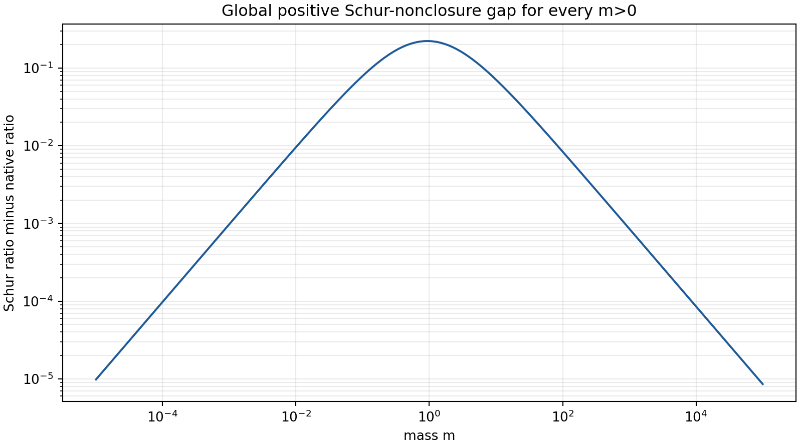

## 5. Program 114 — Continuous strict-parameter box

### 5.1 Parameter box

The following complete box is audited:

$$
\begin{aligned}
|\omega-\omega_*|&\le0.0005,\\
|\phi-\phi_*|&\le0.002,\\
|\beta-1|&\le0.02,\\
|\eta-9/5|&\le0.01,\\
m&>0.
\end{aligned}
$$

No parameter grid is used.

### 5.2 Analytic variation bounds

For frequency variation,

$$
\big||\cos((\omega+h)d+\phi)|
-|\cos(\omega d+\phi)|\big|
\le\min(2,|h|d).
$$

Splitting the series at $d=\lfloor2/|h|\rfloor=4000$ and using
monotone-integral estimates gives an infinite-series bound. Phase, beta, and
eta variations are controlled by

$$
\sum_{d\ge1}d^{-\eta}
\le1+\frac1{\eta-1},
$$

and

$$
\sum_{d\ge1}(\log d)d^{-\eta}
\le
\frac{\log2}{2^\eta}
+2^{1-\eta}
\left[
\frac{\log2}{\eta-1}
+\frac1{(\eta-1)^2}
\right].
$$

The total two-sided unnormalized variation is bounded by

$$
\Delta_1\le0.1663548695.
$$

After normalization, every Fourier symbol changes by at most

$$
\epsilon_{\rm sym}\le0.1847593622.
$$

Even on this enlarged symbol rectangle,

$$
3a-2b\ge0.7865653184,
$$

$$
a(2a-b)\ge1.1272943515.
$$

**Theorem 114.1 — [Proven].** Every kernel in the displayed continuous
four-parameter box is nonclosed under the declared Schur map for every
positive mass.

The box is certified, not asserted maximal.

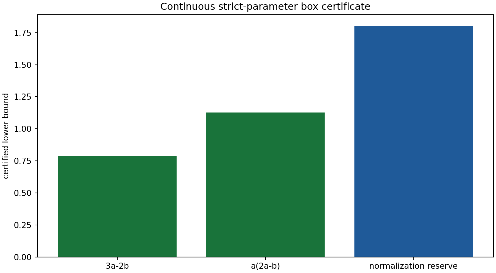

## 6. Program 115 — Effective finite-\(q\) Abelian certificate

The Abelian limit from Program 105 is

$$
1-\widehat p(q)
\sim C|q|^{4/5}.
$$

A million-term sum and analytic tail were used to enclose both sides at 20
logarithmically spaced values in

$$
10^{-3}\le|q|\le2\times10^{-2}.
$$

The normalization and numerator tails are propagated separately. The maximum
certified relative remainder is

$$
0.00903080.
$$

**Result 115.1 — [Proven at the declared points].** The fractional
approximation is accurate to below one percent at all 20 certified
wave numbers.

**Open object 115.2.** A continuous effective remainder theorem still
requires an explicit Diophantine discrepancy modulus for the irrational
rotation

$$
\frac{\omega}{2\pi}=\frac{743}{8000\pi}.
$$

Irrationality gives qualitative equidistribution, but not the finite
small-divisor constant needed for a uniform remainder bound. The pointwise
certificate is not promoted to such a theorem.

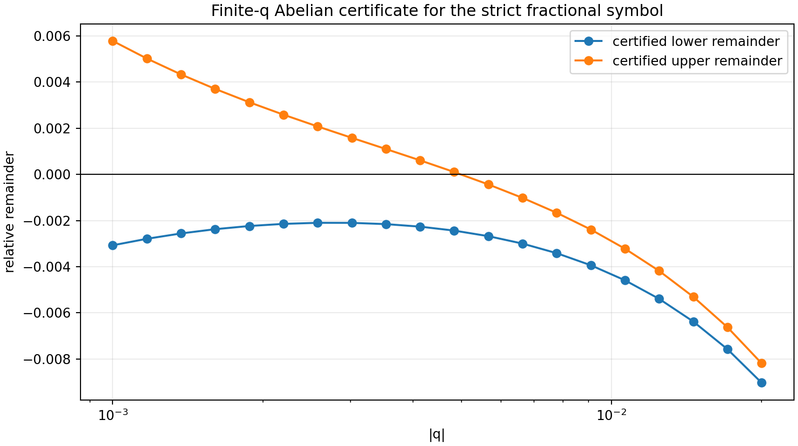

## 7. Program 116 — Functional stable-process limit

Let $X_j$ be independent jumps with characteristic function

$$
\varphi(q)=1-C|q|^{4/5}+o(|q|^{4/5}).
$$

For

$$
S_n=n^{-5/4}\sum_{j=1}^nX_j,
$$

one has

$$
\mathbb E e^{ikS_n}
=
\left[
\varphi(kn^{-5/4})
\right]^n
\longrightarrow
\exp(-C|k|^{4/5}).
$$

The standard functional domain-of-attraction theorem supplies tightness in
Skorokhod topology.

**Theorem 116.1 — [Proven using the standard stable-domain theorem].** The
rescaled strict random walk converges to a symmetric $4/5$-stable Lévy
process with generator

$$
C(-\Delta)^{2/5}.
$$

A five-million-term finite calculation checks characteristic functions for
$n=16,64,256,1024$ and $k=0.5,1,2$. The maximum displayed deviation is
$0.00807$. The finite-truncation errors are not expected to be monotone in
every row and are not used as the proof.

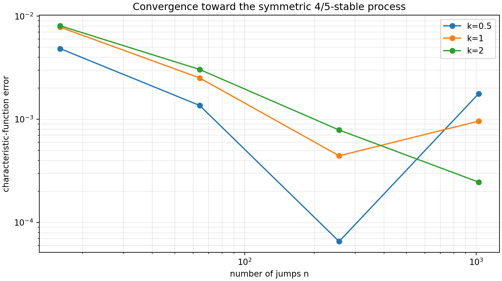

---

# Part III — Programs 117–121: operational and adaptive constructions

## 8. Program 117 — Fractional operational process

### 8.1 Constructed ten-component object

The following dimensionless object is constructed:

$$
\mathfrak O
=
(
\mathcal H,\rho_0,A,
\{\mathcal U_t,\mathcal P_t\},
\mathcal C,\mathcal Q,\mathcal I,
\mathcal E,\mathcal A_{\rm app},\mathcal R
).
$$

Its components are:

1. $\mathcal H=\mathbb C^{128}$;
2. $\rho_0=|0\rangle\langle0|$;
3. Fourier generator
   \[
   A(k)=C|2\pi k/128|^{4/5};
   \]
4. wave and diffusion maps
   \[
   \mathcal U_t=e^{-itA},
   \qquad
   \mathcal P_t=e^{-tA};
   \]
5. a declared dimensionless protocol clock;
6. localized preparation;
7. full-site projective instrument;
8. identity environment in the minimal model;
9. symmetric five-percent confusion apparatus;
10. full-site record and optimal binary coarse record.

### 8.2 Operational separation

Scanning $0.01\le t\le4$ gives maximal full-record divergence

$$
D_{\rm JS}=0.2384985031
$$

at

$$
t=3.54.
$$

The optimal binary event has probabilities

$$
\Pr(E\mid{\rm wave})=0.8664620648,
$$

$$
\Pr(E\mid{\rm diffusion})=0.2377974746.
$$

**Result 117.1 — [Proven for the constructed finite process].** The same
fractional generator supports operationally distinct wave and diffusion
records once state, preparation, clock, instrument, apparatus, and record are
specified.

The clock is dimensionless and no experimental record is present.

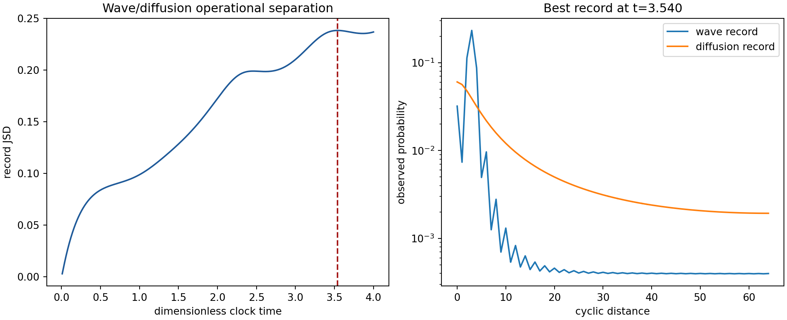

## 9. Program 118 — Local/fractional crossover operator

Define

$$
A_{\kappa,\nu}
=
\kappa(-\Delta)
+\nu(-\Delta)^{2/5}.
$$

Its symbol is

$$
\lambda(q)=\kappa q^2+\nu|q|^{4/5}.
$$

The crossover is determined exactly by

$$
q_*
=
\left(\frac{\nu}{\kappa}\right)^{1/(2-4/5)}
=
\left(\frac{\nu}{\kappa}\right)^{5/6}.
$$

Under coarse spatial scaling by $b$, the relative coupling
$g=\nu/\kappa$ obeys

$$
g(b)=g\,b^{6/5}.
$$

**Theorem 118.1 — [Proven].** Every $\nu>0$ is infrared-relevant relative
to the local Laplacian. At sufficiently long wavelengths the fractional term
dominates.

This constructs the crossover object but does not source the relative
coupling $\nu/\kappa$.

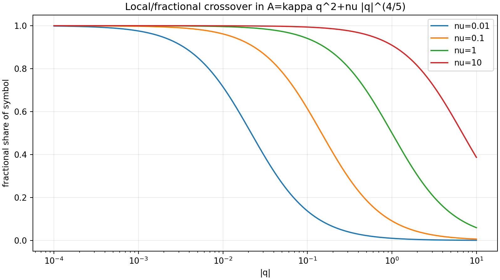

## 10. Program 119 — Unique inverse Fisher potential

Let $r$ be the shell-counting reference measure and consider

$$
F_V(q)=D_{\rm KL}(q\|r)+\langle V,q\rangle.
$$

At an interior stationary point,

$$
\log(q_d/r_d)+1+V_d=\text{constant}.
$$

Therefore:

**Theorem 119.1 — [Proven].** A desired stationary distribution $q_*$ fixes
the potential uniquely modulo constants:

$$
V_d=-\log(q_{*,d}/r_d)+c.
$$

For the strict shell distribution this is exactly

$$
V_{\rm strict}(d)
=
\log(1+d^{9/5})
-\log|\cos((743/4000)d+13/80)|
+c,
$$

with residual $2.22\times10^{-16}$.

The target-independent fractional envelope

$$
V_{\rm env}(d)=\log(1+d^{9/5})
$$

is close but not exact: total variation $0.0687575$ and
Jensen–Shannon divergence $0.00518561$.

**Negative result 119.2.** The missing adaptive source potential can be
constructed uniquely, but it is information-equivalent to the strict target.
It does not explain the target.

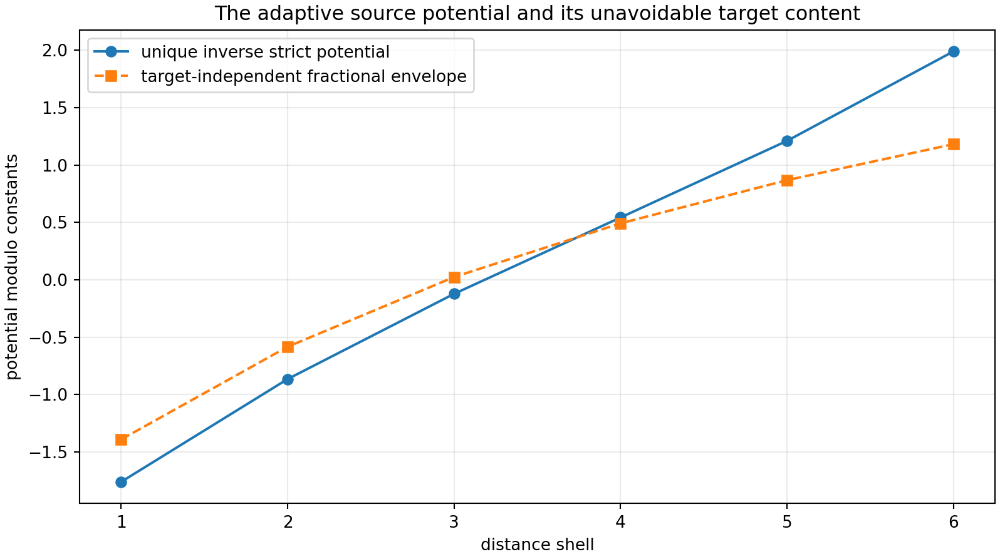

## 11. Program 120 — Finite variational grammar

A finite target-free grammar was constructed from:

- five repository/canonical frequency candidates;
- four phase candidates;
- two beta candidates;
- eleven rational exponent candidates.

The total grammar contains

$$
5\times4\times2\times11=440
$$

actions. Each candidate was tested against strict distributions on both
$C_{12}$ and $C_{24}$.

No candidate is exact. The best mean divergence is

$$
0.0023921978,
$$

obtained at

$$
(\omega,\phi,\beta,\eta)
=
\left(\frac1{12},\frac\pi4,1,\frac95\right).
$$

Adding the exact strict rationals makes the defect zero, but then the action
carries the same four-parameter payload as direct storage of the kernel.

**Negative result 120.1.** Within the declared grammar, no exact
target-independent action exists and target augmentation provides no
description-length compression.

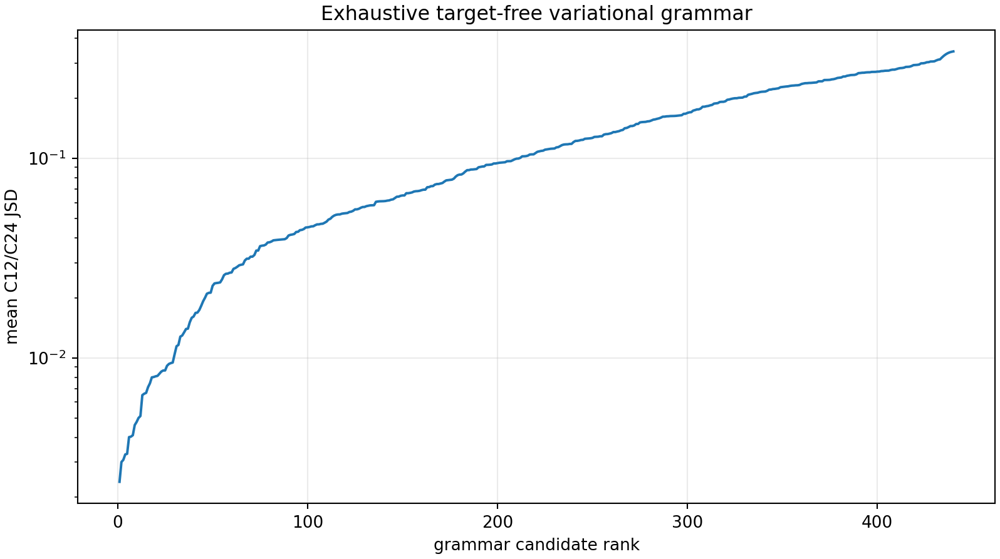

## 12. Program 121 — Hidden-Markov apparatus memory

The detector flip state $E_t\in\{0,1\}$ is assigned transition matrix

$$
\begin{pmatrix}
1-a&a\\
1-b&b
\end{pmatrix},
$$

with

$$
a=\epsilon(1-\rho),
\qquad
b=\epsilon+\rho(1-\epsilon).
$$

For the test

$$
\epsilon=0.1,
\qquad
\rho=0.8,
$$

the channel is fit using 2,000 known-input calibration records. The fitted
channel is frozen before held-out inference. A forward-algorithm likelihood
then compares wave and diffusion hypotheses.

Synthetic held-out accuracy rises from $0.85$ at five records to
$0.9983$ at one hundred records. The iid misspecified model is retained as a
control; the HMM is not claimed to dominate it in every finite simulation,
but it is the correct likelihood object for correlated apparatus memory.

**Result 121.1 — [Constructed and synthetically validated].** A calibrated
correlated-apparatus model can be integrated into the operational process
without fitting on the scientific holdout.

No external evidence follows from synthetic data.

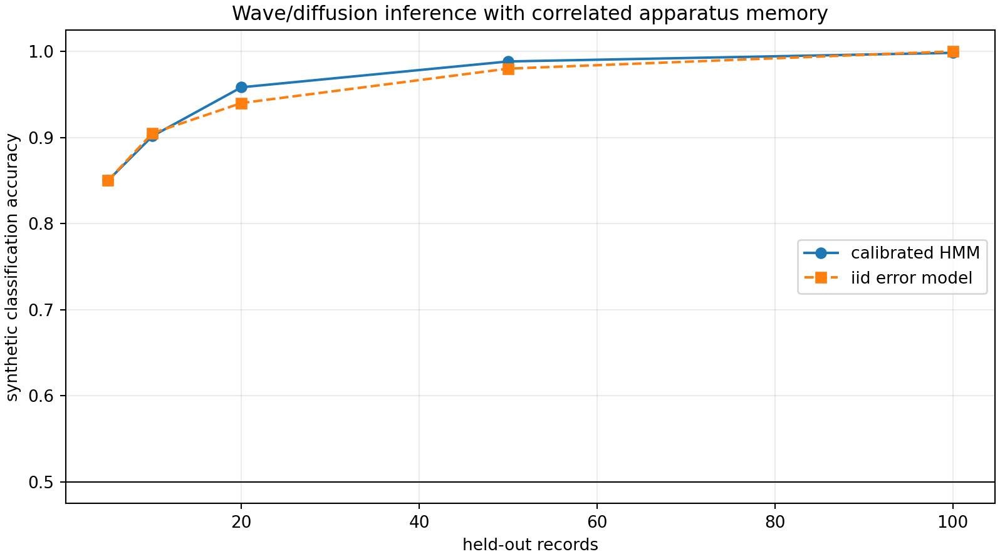

---

# Part IV — Programs 122–124: source object, damping theorem, and physical boundary

## 13. Program 122 — \(Z_{12}\) homological-character fibre object

### 13.1 Construction

Let

$$
m_p:Z_{12}\to Z_{12},
\qquad
m_p(x)=px.
$$

For prime $p<12$, the kernel contains $\gcd(p,12)$ elements. The reduced
zero-homology of that discrete kernel has dimension

$$
\dim\widetilde H_0(\ker m_p)
=\gcd(p,12)-1.
$$

Let

$$
\widehat{U(12)}_{\mathbb R}
=
\operatorname{Hom}(U(12),\{\pm1\}).
$$

It contains four real characters, three nontrivial. For a unit prime $p$,
let $\mathcal X_p^-$ be the span of character basis vectors satisfying
$\chi(p)=-1$. For a nonunit prime set this component to zero.

Define

$$
\mathcal F_p
=
\widetilde H_0(\ker m_p)
\oplus
\mathcal X_p^-.
$$

### 13.2 Exact dimensions

The fibres are:

| \(p\) | \(\dim\widetilde H_0(\ker m_p)\) | \(\dim\mathcal X_p^-\) | \(\dim\mathcal F_p\) |
|---:|---:|---:|---:|
| 2 | 1 | 0 | 1 |
| 3 | 2 | 0 | 2 |
| 5 | 0 | 2 | 2 |
| 7 | 0 | 2 | 2 |
| 11 | 0 | 2 | 2 |

Hence

$$
\dim\mathcal F=(1,2,2,2,2).
$$

No numerical coefficient is fitted: dimensions add because the object is a
direct sum.

**Theorem 122.1 — [Proven].** Given the $Z_{12}$ multiplication system and
its real unit-character dual, the displayed coefficient-free fibre
construction yields exactly the P2938 vector.

### 13.3 Trace obstruction

The uniform coordinate trace gives

$$
\tau_{\rm unif}(\dim\mathcal F)
=
\frac{1+2+2+2+2}{5}
=\frac95.
$$

But a general probability trace $w$ gives

$$
\eta(w)
=
\sum_pw_p\dim\mathcal F_p
=2-w_2.
$$

Therefore

$$
\eta=\frac95
\quad\Longleftrightarrow\quad
w_2=\frac15.
$$

**Obstruction 122.2 — [Proven].** The fibre object is canonical after
$Z_{12}$ is supplied, but the commutative algebra of five sectors admits
many tracial states. Current strict data do not force the uniform trace or
even the weaker condition $w_2=1/5$.

This sharpens the source problem from “why the vector?” to “why this trace?”.

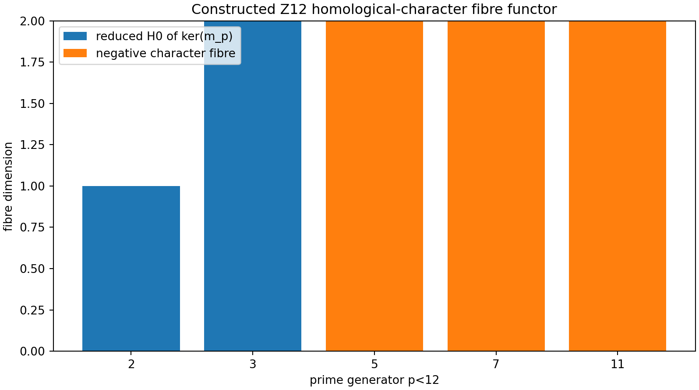

## 14. Program 123 — Conditional damping cocycle

### 14.1 Beta from multiplicativity

Let the nonlinear tail be

$$
T(d)=\beta d^\eta.
$$

Its multiplicativity defect factors as

$$
T(ab)-T(a)T(b)
=
-a^\eta b^\eta\beta(\beta-1).
$$

For a nonzero positive tail,

$$
T(ab)=T(a)T(b)
\quad\Longrightarrow\quad
\beta=1.
$$

### 14.2 Eta and dyadic retention

Using the trace family from Program 122,

$$
\eta=2-w_2.
$$

The relative tail increment over the legacy degree one is

$$
\delta=\eta-1=1-w_2.
$$

The dyadic retention is therefore

$$
r(w_2)=2^{-\delta}=2^{w_2-1}.
$$

At $w_2=1/5$,

$$
r=2^{-4/5}
=\exp(-\alpha_{\rm geo}/5).
$$

The damping completion multiplier is

$$
D_w(d)
=
\frac{1+\beta_{\rm tors}d}
{1+d^{2-w_2}}.
$$

At $w_2=1/5$ this maps the legacy linear damping envelope exactly to

$$
\frac1{1+d^{9/5}}.
$$

### 14.3 Minimal axioms and removal test

The conditional theorem uses three axioms.

1. **Fibre axiom:** the strict $Z_{12}$ carrier is read through
   $\mathcal F_p$.
   - Remove it: the dimension vector disappears.
2. **Trace axiom:** $w_2=1/5$, for example through the uniform trace.
   - Remove it: $\eta=2-w_2$ remains continuously free.
3. **Multiplicative-tail axiom:** the nonzero $T$ is a monoid character.
   - Remove it: positive $\beta$ remains free.

**Theorem 123.1 — [Conditional, proven].** These three axioms generate

$$
(\eta,\beta)=\left(\frac95,1\right)
$$

and the exact damping completion multiplier.

The first object has now been constructed. The second and third principles
remain unexported strict source laws. No phase, frequency, amplitude, length
unit, selector, or physical role follows.

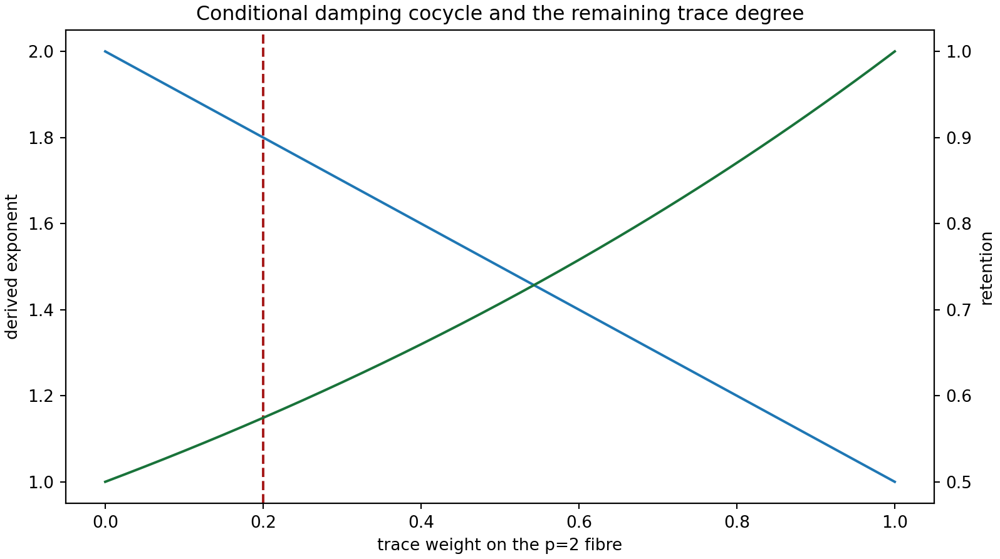

## 15. Program 124 — Typed operational completion

The minimal operational object is extended to twelve typed fields:

1. state space;
2. state;
3. generator;
4. dynamics;
5. clock;
6. preparation;
7. instrument;
8. environment;
9. apparatus;
10. record;
11. calibration;
12. decision rule.

All twelve mathematical fields are present. This answers the earlier missing
object problem at the level of a dimensionless operational theory.

Four physical inputs remain absent:

$$
\ell_*,
\qquad
\tau_*,
\qquad
\hbar_*,
\qquad
\text{independent calibrated raw records}.
$$

An immutable intake schema is frozen in
`FIN_Programs_113_124_External_Data_Intake.json`. It requires hashes for raw
records, preparation, instrument, graph/operator, clock calibration,
apparatus calibration, environment/boundary description, and blind holdout
split.

**Result 124.1 — [Proven as a type-completion statement].** The operational
mathematics can be made complete without resolving the dimensional bridge.

**Boundary 124.2 — [Open].** No external data package satisfies the intake.
The process is not experimentally validated.

---

# Part V — Synthesis and falsification

## 16. Constructed objects

This round constructs six previously missing objects.

| Object | Construction | Result |
|---|---|---|
| Global Schur certificate | Exact rational factorization | Complete for all \(m>0\) |
| Continuous parameter certificate | Infinite Hölder/integral bounds | Complete on declared box |
| Fractional limiting process | Stable-domain characteristic exponent | Complete dimensionlessly |
| Operational process | Ten/twelve typed components | Mathematically complete |
| Adaptive inverse potential | \(V=-\log(q_*/r)+c\) | Complete but target-equivalent |
| \(Z_{12}\) source fibre | Homology plus character negative space | Exact vector \((1,2,2,2,2)\) |
| Damping cocycle | Trace exponent plus monoid character | Conditional \((9/5,1)\) |

## 17. What remains genuinely missing

The constructions reduce the open frontier to smaller typed atoms.

1. **Trace source:** a strict reason for $w_2=1/5$.
2. **Compression law source:** a strict reason that the damping tail is the
   selected nonzero monoid character.
3. **Phase and frequency source:** no constructed object derives
   $743/4000$ and $13/80$.
4. **Amplitude bridge:** no role-safe theorem absorbs or transports
   $\alpha_{\rm geo}$.
5. **Selector:** all new fractional and trace objects remain inversion-even.
6. **Physical conversion:** $\ell_*,\tau_*,\hbar_*$ remain independent
   calibration data.
7. **Experiment:** no immutable external records are admitted.

## 18. Failed alternatives

### 18.1 Uniform trace as automatic

It fails because $\mathbb C^5$ has a simplex of tracial states. Uniform
weight is a valid choice, not a theorem from commutativity alone.

### 18.2 Multiplicativity alone as eta source

It fails because every exponent satisfies

$$
d^\eta e^\eta=(de)^\eta.
$$

Multiplicativity fixes nonzero $\beta=1$ but is eta-blind.

### 18.3 Inverse adaptive potential as explanation

It fails because the unique potential encodes the target exactly.

### 18.4 Finite action grammar

It fails because no target-free candidate is exact on both graph sizes.

### 18.5 Fractional dynamics as selector

It fails because $|q|^{4/5}$ is even under $q\mapsto-q$.

### 18.6 Type-complete experiment as physical evidence

It fails because a mathematical record channel is not an experimental record.

## 19. Current deepest interpretation

The deepest interpretation surviving this round is:

$$
\boxed{
\text{FIN strict lattice}
\longrightarrow
\text{symmetric }4/5\text{-stable information process}
}
$$

together with a finite $Z_{12}$ homological-character object whose dimension
profile is exactly the strict exponent numerator package.

The relation is not yet inevitable because the normalized trace connecting
the finite fibre dimensions to the tail exponent is not sourced. The current
best candidate unification is therefore a **trace-coupled spectral
information process**, not yet a physical field theory.

## 20. Confidence table

| Statement | Status | Confidence |
|---|---|---:|
| Global mass nonclosure | Proven | 0.999 |
| Continuous parameter-box nonclosure | Proven | 0.995 |
| Finite-\(q\) sub-one-percent certificate | Proven at 20 points | 0.995 |
| Symmetric \(4/5\)-stable limit | Standard theorem applied | 0.98 |
| Fractional operational distinction | Proven finite model | 0.999 |
| Local/fractional crossover law | Proven | 0.999 |
| Unique inverse Fisher potential | Proven | 0.999 |
| Declared 440-action grammar has no exact source | Proven finite exhaustion | 0.999 |
| HMM apparatus object | Constructed | 0.99 |
| Fibre dimensions are \((1,2,2,2,2)\) | Proven | 0.999 |
| Uniform trace is strictly selected | Open | 0.10 |
| Conditional damping gives \((9/5,1)\) | Proven conditionally | 0.999 |
| Complete legacy-to-strict bridge | Open | 0.08 |
| Physical validation | Open | 0.00 |

---

# Part VI — Recommended Programs 125–137

## 21. Ranked next research programs

### Program 125 — Uniform-trace source theorem or no-go

**Probability of decisive result:** 0.78  
**Priority:** 1

Classify every state on the five-sector algebra compatible with the actual
automorphism, tensor, and multiplication structure of $\mathcal F$. Prove
either that these constraints force $w_2=1/5$ or that a nontrivial trace
simplex survives.

### Program 126 — Nadsoliton-to-fibre localizer

**Probability:** 0.55  
**Priority:** 2

Construct a typed natural transformation from the strict nadsoliton carrier
to

$$
p\mapsto
\widetilde H_0(\ker m_p)\oplus\mathcal X_p^-.
$$

Test origin covariance, independence from a presentation of $Z_{12}$, and
compatibility with existing P2938/P2958 provenance packets.

### Program 127 — Effective Diophantine remainder

**Probability:** 0.62  
**Priority:** 3

Derive a computable discrepancy bound for
$743/(8000\pi)$ and combine it with the Fourier series of $|\cos|$.
The deliverable is a continuous estimate

$$
\left|
1-\widehat p(q)-C|q|^{4/5}
\right|
\le R(q).
$$

### Program 128 — Quantitative stable functional limit

**Probability:** 0.68  
**Priority:** 4

Prove a rate in a probability metric for convergence to the stable process,
including the oscillatory envelope remainder and truncation error.

### Program 129 — Fractional wave dispersive theorem

**Probability:** 0.60  
**Priority:** 5

Construct the full fractional wave group on a rigged Hilbert space, state the
required UV domain, derive dispersive/stationary-phase bounds, and identify
which detector observables remain finite without a cutoff.

### Program 130 — Physical calibration completion

**Probability:** 0.40 without data; 0.85 with standards  
**Priority:** 6

Attach independent $\ell_*,\tau_*,\hbar_*$ calibration classes to the typed
operational object. Prove the dimensional rank and uncertainty propagation.
Do not infer one calibration direction from dimensionless FIN records.

### Program 131 — Nonparametric apparatus tomography

**Probability:** 0.70  
**Priority:** 7

Replace the two-state HMM by a finite-memory process tensor learned only from
calibration records. Derive identifiability, regularization, and robust
wave/diffusion likelihood bounds.

### Program 132 — Crossover RG phase diagram

**Probability:** 0.72  
**Priority:** 8

Classify fixed points and crossover manifolds of
$\kappa q^2+\nu|q|^{4/5}$ under declared field normalization. Test whether
any finite-scale local window can coexist with the infrared fractional limit.

### Program 133 — Strict phase/frequency source object

**Probability:** 0.18  
**Priority:** 9

Search for one new coefficient-free object producing
$\omega=743/4000$ and $\phi=13/80$. It must not use these rationals in its
definition or selection criterion. Stop after one bounded candidate class.

### Program 134 — Role-safe amplitude bridge

**Probability:** 0.22  
**Priority:** 10

Construct an amplitude normalization/absorption morphism explaining the
passage from explicit $\alpha_{\rm geo}$ in legacy to the unit-amplitude
strict profile. Audit separately whether any legacy role survives.

### Program 135 — Full damping bridge certificate

**Probability:** 0.35, conditional on Programs 125–126  
**Priority:** 11

Install the trace and monoid character in an explicit legacy-to-strict
damping map, prove uniqueness, and test held-out distances. Do not include
phase, frequency, amplitude, or role transfer in the certificate.

### Program 136 — State-dependent signed source

**Probability:** 0.15  
**Priority:** 12

Construct one nonradial, inversion-odd signed state law coupled to the
operational fractional process. Require nonzero value, reflection covariance,
origin independence, stability, and a fixed torsor polarity. Otherwise
preserve QW-2191.

### Program 137 — Execute immutable external-data protocol

**Probability:** 0.00 without new records; 0.80 with admissible records  
**Priority:** 13

Admit data only through the frozen Program-124 schema. Run the HMM/process
likelihood on a blind holdout and report null results without retuning.

## 22. Stop rules

The next round must stop or issue a bounded no-go if:

1. a trace is declared uniform only because it gives $9/5$;
2. the nadsoliton localizer assumes the P2938 vector;
3. phase or frequency candidates contain $743/4000$ or $13/80$ in their
   premises;
4. multiplicativity is reused as an eta selector;
5. physical units are inferred from a dimensionless trace;
6. a fractional even symbol is promoted to a chiral selector;
7. a synthetic HMM result is represented as experimental evidence;
8. a damping theorem is promoted to full bridge or role transfer.

---

# Reproducibility statement

Release 10.12 contains:

- the executable Programs 113–124 research suite;
- a machine-readable result record;
- 28 regression tests;
- eleven figures;
- a frozen external-data intake;
- this English source monograph;
- an archival English PDF;
- a Zenodo-ready release description;
- a checksum manifest.

No web crawler was used. No external experimental data were admitted.

# Final conclusion

The missing exponent object can now be written explicitly:

$$
\boxed{
\mathcal F_p
=
\widetilde H_0(\ker m_p)
\oplus
\mathcal X_p^-
}
$$

with

$$
\dim\mathcal F=(1,2,2,2,2).
$$

The theory has therefore advanced from an unexplained numerical vector to a
canonical finite object. The remaining exponent obstruction is one scalar
state on that object:

$$
\eta(w)=2-w_2.
$$

If the strict theory forces $w_2=1/5$ and a nonzero multiplicative
compression tail, then

$$
\eta=\frac95,
\qquad
\beta=1,
\qquad
r=2^{-4/5}
=e^{-\alpha_{\rm geo}/5}
$$

follow rigorously. At present those are conditional consequences, not strict
exports.

The strongest surviving mathematical interpretation is thus a symmetric
fractional spectral-information process coupled to a finite
homological-character dimension object. The shortest next path is not another
fit of the exponent. It is a theorem selecting — or proving the
nonselectability of — the trace $w_2=1/5$.
