# FIN Programs 138–150

## State Selection, Validated Fractional Dynamics, Detector Physics, and Bridge Architecture

**FIN Research Monograph — Release 10.14**

**Author:** Krzysztof Żuchowski  
**Affiliation:** Independent Researcher — Fractal Information Theory Project  
**ORCID:** 0009-0002-0909-3613  
**Resource type:** Publication — Preprint  
**Version:** 1.0.0  
**Publication date:** 2026-07-27  
**Language:** English  
**Publisher:** Zenodo  
**License:** CC BY 4.0

---

## Confidence convention

The release separates the following statuses.

- **Proven:** an analytic or finite mathematical proof is supplied.
- **Proven, computer-assisted:** directed interval arithmetic or a finite
  exhaustive computation supplies a reproducible certificate.
- **Strong evidence:** a reproducible floating-point or Monte Carlo result
  supports a claim within a declared finite model.
- **Conditional:** the result follows after an input not sourced by strict FIN
  is declared.
- **Refuted in scope:** a candidate fails a stated necessary test.
- **Open:** the required source, physical standard, or external record is
  absent.

A state constructed from a chosen modular Hamiltonian is not called an
internally selected state. A maximum-entropy state is not called
reference-free. A signed receiver is not called a source of signed
preparation. Synthetic statistical power is not physical evidence.

## Abstract

This monograph executes thirteen research programs addressing the three
principal objects still missing between the FIN spectral core and physical
testing:

1. a distinguished state on the localized sector algebra;
2. a nonfree preparation supplying a signed branch;
3. an operational detector and calibration interface.

Programs 125–137 had produced a natural finite-carrier localizer with fibre
dimensions

$$
d=(1,2,2,2,2),
$$

but found that the uniform sector state yielding

$$
\eta=\frac95
$$

was not selected by carrier naturality. The present round tests three deeper
state-selection mechanisms: modular/KMS theory, maximum entropy, and Morita
equivalence.

All three fail to select the uniform state without an additional premise.
For the commutative sector algebra $\mathcal A_{\mathcal F}=\mathbb C^5$, every
continuous one-parameter automorphism group is trivial, so every probability
state is KMS. In the noncommutative block enlargement

$$
\mathcal B
=
M_1(\mathbb C)\oplus M_2(\mathbb C)^{\oplus4},
$$

every faithful density matrix defines its own modular flow. A Gibbs family can
produce $9/5$, but only when its dimensionless modular gap is fixed to

$$
\theta=\log2=\frac{\alpha_{\rm geo}}4.
$$

No current theorem selects that gap.

Maximum relative entropy returns its reference measure. Sector counting gives
$9/5$, Hilbert microstate counting gives $17/9$, and Hilbert–Schmidt counting
gives $33/17$. Morita-equivalent block amplifications can continuously alter
the normalized Hilbert central weights. Consequently neither entropy nor
Morita equivalence supplies a reference-free sector state.

The fractional analysis receives a formal proof upgrade. A radix-two interval
FFT using 42-decimal-place directed interval arithmetic, together with
analytic frequency-cell and tail bounds, covers every frequency in

$$
10^{-3}\le |q|\le2\cdot10^{-2}.
$$

All 50 interval cells have positive symbol lower bounds and are compatible
with the $C|q|^{4/5}$ prediction. The formal maximum relative-remainder upper
bound is $1.08135$, substantially coarser than the earlier floating-point
bound of $2.2647\%$. Thus the fractional scale is formally compatible on the
full window, while the tight numerical percentage is not yet a formal
theorem.

An explicit finite Diophantine modulus is also derived. The first certified
continued-fraction terms of

$$
\frac{\omega}{\pi}
=
\frac{743}{4000\pi}
$$

are

$$
[0;16,1,10,2,67,2,2,5,1,2,928].
$$

Denjoy–Koksma and the Ostrowski representation give a rigorous discrepancy
bound through $N=10^6$. The large partial quotient $928$ explains why a
uniform all-scale power remainder cannot be inferred from this finite prefix.

The missing detector object is constructed in two forms. First,
$H^s(\mathbb R)$ with $s>1/2$ supplies bounded point evaluation for fractional
wave records. Second, a Gaussian response

$$
\widehat R_\sigma(q)=e^{-\sigma^2q^2/2}
$$

defines a finite-resolution measurement family. The limit
$R_\sigma U_tf\to U_tf$ exists uniformly for sufficiently regular
preparations, while an ideal delta preparation has peak

$$
\frac1{\sqrt{2\pi}\sigma}
$$

and no resolution-independent limit.

A joint system–instrument inverse map separates the fractional exponent,
detector error, and apparatus memory from two mean records and one lag
correlation. A calibration-invariant IQR spreading statistic is then
constructed:

$$
T
=
\frac{
\log\left[\operatorname{IQR}(t_2)/\operatorname{IQR}(t_1)\right]
}{
\log(t_2/t_1)
}
=\frac1\alpha.
$$

For $\alpha=4/5$, $T=5/4$. Multiplicative length calibration cancels.

The strongest new structural result is a preparation resource theory. Let
$R$ be reflection and define

$$
M(\rho)
=
\frac12\|\rho-R\rho R\|_1.
$$

For every reflection-covariant quantum channel $\Phi$,

$$
M(\Phi(\rho))\le M(\rho).
$$

If $C$ is reflection odd, then

$$
|\operatorname{Tr}(\rho C)|
\le
M(\rho)\|C\|_\infty.
$$

Therefore a reflection-symmetric state cannot generate a nonzero signed
receiver under reflection-covariant operations. The missing signed
preparation is a resource, not a scalar hidden in the radial kernel.

Finally, a typed completion diagram is constructed. Amplitude
projectivization and conditional damping commute when the oscillatory
numerator is artificially shared, with residual $5.67\cdot10^{-17}$. For the
actual canonical legacy phase/frequency $(\pi/4,\pi/6)$ and strict values, the
relative residual is $0.470865$. The phase/frequency and role-transfer arrows
remain absent.

The release concludes with an immutable pre-data physical protocol
distinguishing local diffusion $\alpha=2$ from fractional spreading
$\alpha=4/5$. Its canonical core has SHA-256
`0c292bf5d8efce3055a27daa16e60d60b53e2e2cb9852c37827418ec1ec453f5`.
No external data are admitted.

---

# Part I — Scope, kernel split, and fixed objects

## 1. Research objective

Programs 138–150 answer the following questions.

1. Can modular or KMS structure select the uniform sector trace?
2. Does maximum entropy select that trace without a reference measure?
3. Is the Hilbert-trace exponent stable under Morita equivalence?
4. Can the continuous fractional window be enclosed by genuine interval
   arithmetic?
5. Can the irrational rotation produce an explicit finite discrepancy
   modulus?
6. Which regular wave preparations permit pointwise records?
7. Can detector resolution be removed, and for which preparations?
8. Can the generator exponent and apparatus memory be identified jointly?
9. Which observable ratios cancel physical calibration constants?
10. Can signed preparation be formalized as a resource theory?
11. Can one construct a coupled state–damping action without hiding $9/5$ in
    its coefficients?
12. Which arrows in the legacy-to-strict completion diagram actually commute?
13. Can a physical test be frozen before external data are admitted?

## 2. Kernel split

The canonical legacy kernel is

$$
K_{\rm legacy}(d)
=
\alpha_{\rm geo}
\frac{\cos\left(\frac\pi4d+\frac\pi6\right)}
{1+\beta_{\rm tors}d},
\qquad
\beta_{\rm tors}=0.01.
$$

The strict working kernel is

$$
K_{\rm strict}(d)
=
\frac{\cos(\omega_sd+\phi_s)}
{1+d^{9/5}},
$$

where

$$
\omega_s=\frac{743}{4000},
\qquad
\phi_s=\frac{13}{80}.
$$

The legacy kernel remains an intermediate bridge object. The strict kernel is
a later gate-selected working kernel. A map that corrects only amplitude or
damping does not identify their oscillatory numerators.

## 3. Localized sector algebra

The finite-carrier localizer is

$$
\mathcal F_p
=
\widetilde H_0(\ker m_p)
\oplus\mathcal X_p^-,
$$

with

$$
\dim\mathcal F_p=(1,2,2,2,2)
$$

for $p=2,3,5,7,11$. The associated center is

$$
\mathcal A_{\mathcal F}=\mathbb C^5.
$$

A state on this center is a probability vector $w$. The exponent readout is

$$
\eta(w)=\sum_pw_p\dim\mathcal F_p=2-w_2.
$$

The localizer is natural. The state is not yet selected.

## 4. Fractional generator

For stochastic and continuum calculations, use

$$
a_d=
\frac{|\cos(\omega_sd+\phi_s)|}{1+d^{9/5}},
\qquad
p_{\pm d}=\frac{a_d}{2\sum_{j\ge1}a_j}.
$$

The symbol is

$$
S(q)=1-\widehat p(q),
$$

and its candidate small-frequency law is

$$
S(q)\sim C|q|^{4/5}.
$$

The continuum generator is

$$
A=C(-\Delta)^{2/5}.
$$

This dimensionless generator does not itself define physical units,
preparation, detector resolution, or an external record.

---

# Part II — Programs 138–140: three state-selection no-go theorems

## 5. Program 138 — Modular and KMS selection

### 5.1 Commutative obstruction

The automorphism group of $\mathbb C^5$ is the finite permutation group $S_5$.
A continuous homomorphism

$$
\alpha:\mathbb R\to S_5
$$

must be constant because $\mathbb R$ is connected and $S_5$ is discrete.
Therefore every continuous one-parameter automorphism group of
$\mathbb C^5$ is trivial.

For trivial dynamics, the KMS relation reduces to commutativity. Every
probability state on $\mathbb C^5$ is KMS for every inverse temperature.

**Theorem 138.1:** KMS on the commutative sector algebra does not select a
state.

### 5.2 Noncommutative enlargement

Use the fibre dimensions to form

$$
\mathcal B
=
M_1(\mathbb C)
\oplus
M_2(\mathbb C)^{\oplus4}.
$$

For every faithful density $\rho$,

$$
\sigma_t^\rho(a)
=
\rho^{it}a\rho^{-it}
$$

is a modular flow and $\rho$ is KMS for that flow. Modular theory therefore
relates a state to a flow; it does not choose the state before the flow or
density is supplied.

### 5.3 Intrinsic block-Gibbs family

Assign energy zero to the one-dimensional block and a common gap $\Delta$ to
the four two-dimensional blocks. With

$$
\theta=\beta\Delta,
$$

the central weight of the exceptional block is

$$
w_2(\theta)
=
\frac1{1+8e^{-\theta}},
$$

and

$$
\eta(\theta)=2-w_2(\theta).
$$

At $\theta=0$, this is the normalized Hilbert state and

$$
\eta(0)=\frac{17}{9}.
$$

The target value occurs only at

$$
\eta=\frac95
\quad\Longleftrightarrow\quad
\theta=\log2=\frac{\alpha_{\rm geo}}4.
$$

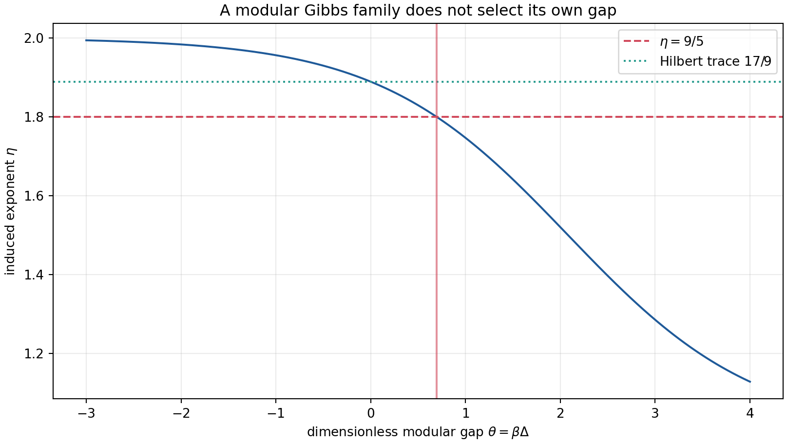

**Result:** **Proven.** A chosen modular gap realizes $9/5$, but modular
theory does not source the gap.

**Falsification boundary:** writing $\theta=\alpha_{\rm geo}/4$ is an exact
identity after $\theta$ is chosen. It is not a derivation of why the modular
Hamiltonian must have that gap.

## 6. Program 139 — Maximum entropy and the reference measure

Let $r$ be a faithful reference state. Maximizing negative relative entropy,

$$
-D(w\|r),
$$

without other constraints has the unique solution

$$
w=r.
$$

The conclusion of maximum entropy therefore depends on the declared sample
space.

### 6.1 Three natural-looking references

For

$$
r_{a,p}
\propto
d_p^a,
$$

three choices give:

$$
\begin{array}{c|c|c}
a & \text{interpretation} & \eta\\
\hline
0 & \text{sector counting} & 9/5\\
1 & \text{Hilbert microstate counting} & 17/9\\
2 & \text{Hilbert--Schmidt counting} & 33/17.
\end{array}
$$

All are mathematically legitimate. None is selected by entropy alone.

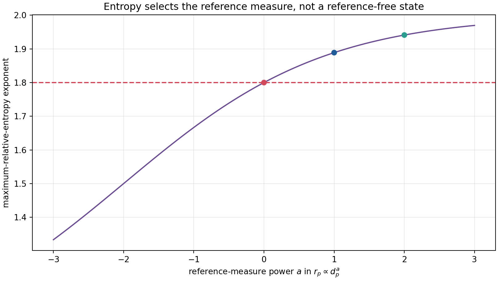

### 6.2 Constraint circularity

Imposing

$$
\sum_pw_pd_p=\frac95
$$

is exactly equivalent to imposing $w_2=1/5$. Entropy can then distribute the
remaining weights, but the desired exponent already appears in the
constraint.

Full $S_5$ symmetry would force equal sector weights, but it exchanges the
one-dimensional and two-dimensional fibre blocks. It is not a symmetry of the
localized block structure.

**Result:** **Proven.** Uniform maximum entropy is conditional on sector
counting or an equivalent constraint. No reference-free entropy theorem is
obtained.

## 7. Program 140 — Morita stability

Consider block amplifications

$$
\mathcal B_{\mathbf n}
=
\bigoplus_p M_{n_pd_p}(\mathbb C).
$$

Each is strongly Morita equivalent to $\mathbb C^5$. Its normalized full
Hilbert trace induces central weights

$$
w_p(\mathbf n)
=
\frac{n_pd_p}{\sum_qn_qd_q}.
$$

For the original blocks $\mathbf n=(1,1,1,1,1)$,

$$
\eta=\frac{17}{9}.
$$

For $\mathbf n=(2,1,1,1,1)$, all central weights are equal and

$$
\eta=\frac95.
$$

For $\mathbf n=(20,1,1,1,1)$,

$$
\eta=\frac97\approx1.285714.
$$

Blockwise amplification therefore changes the Hilbert-trace exponent while
preserving Morita equivalence.

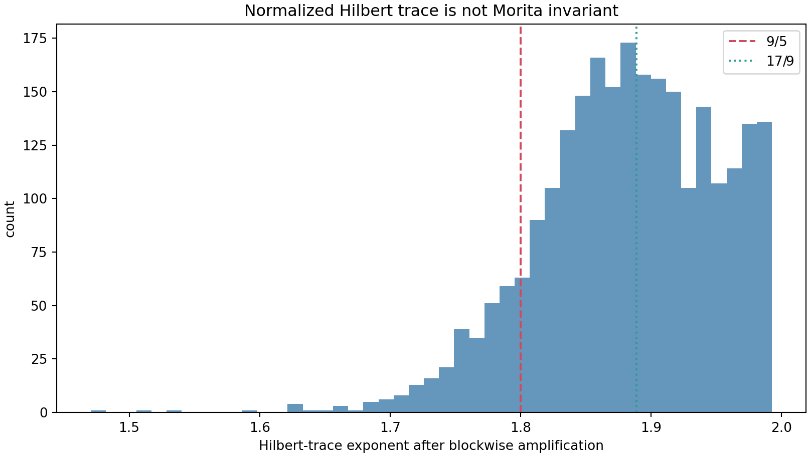

**Result:** **Proven.** Morita equivalence preserves the center up to
isomorphism but does not select a probability state on that center.

## 8. Integrated state-selection theorem

The three programs imply:

> The current localized finite object does not contain a canonical state
> selected by modularity, entropy, or Morita equivalence. Each method becomes
> selective only after a modular Hamiltonian, reference measure, constraint,
> or representation multiplicity is supplied.

The missing object is therefore a state-selection law, not another
re-expression of the dimension vector.

---

# Part III — Programs 141–142: formal fractional certification

## 9. Program 141 — Validated interval FFT

### 9.1 Construction

A radix-two FFT of length

$$
N=2^{14}=16384
$$

was implemented with `mpmath.iv` interval complex arithmetic at 42 decimal
digits. The input weights, twiddle factors, butterfly operations, Fourier
values, normalization, and Abelian constant are all enclosed.

Distances through

$$
D=8191
$$

are retained. The omitted normalization obeys

$$
2\sum_{d>D}d^{-9/5}
\le0.001850420657.
$$

For every Fourier cell, the variation between its center and any point in the
cell is bounded by

$$
\delta q\,
2\sum_{d=1}^D d a_d.
$$

### 9.2 Certificate

Fifty cells cover exactly

$$
[0.001,0.02].
$$

The Abelian constant is enclosed by

$$
C\in[1.1470611724,1.1481405095].
$$

Every symbol lower bound is positive, and every cell is compatible with the
fractional prediction. The worst cell is the first one:

$$
q\in[0.001,0.0013422332],
$$

$$
S(q)\in[0.00138437,0.00950453],
$$

while

$$
Cq^{4/5}\in[0.00456653,0.00578439].
$$

The maximum formal relative-remainder upper bound is

$$
1.08134524.
$$

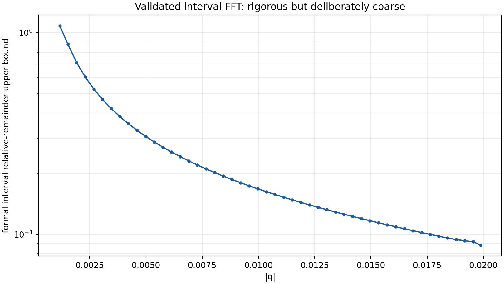

**Result:** **Proven, computer-assisted.** The full frequency window has a
formal interval enclosure compatible with the fractional scale.

**Negative result:** the tight $2.2647\%$ floating-point bound from Program
127 is not formally recovered. The interval tail at $D=8191$ is too large at
the lowest frequency.

This distinction is scientifically important:

- formal but coarse: established here;
- tight but guarded floating point: established in Program 127;
- formal and tight: still open.

## 10. Program 142 — Finite Diophantine discrepancy

### 10.1 Certified continued fraction

Directed interval arithmetic certifies

$$
\frac{743}{4000\pi}
=
[0;16,1,10,2,67,2,2,5,1,2,928,\ldots].
$$

The associated denominator sequence begins

$$
1,\ 16,\ 17,\ 186,\ 389,\ 26249,\ 52887,\ 132023,\
713002,\ 845025,\ 2403052,\ldots
$$

### 10.2 Denjoy–Koksma/Ostrowski bound

For

$$
f(x)=|\cos(\pi x+\phi)|,
$$

the total variation on the circle is $2$. If

$$
N=\sum_jb_jq_j
$$

is the Ostrowski expansion relative to the certified rotation, then

$$
\left|
\sum_{d=1}^N f(x+d\theta)
-N\int_0^1f
\right|
\le
2\sum_jb_j.
$$

This gives an explicit theorem for every $N\le10^6$. At $N=10^6$, the formal
absolute discrepancy bound is $124$. The observed discrepancy is
$0.313828$, well inside the theorem bound.

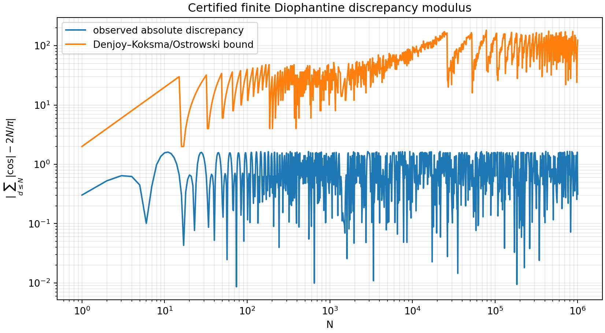

### 10.3 All-scale obstruction

The partial quotients $67$ and $928$ show that the rotation is not behaving
like a uniformly bounded-type number over the certified range. A finite
continued-fraction prefix cannot constrain every future partial quotient.
Therefore no all-scale estimate

$$
|R(q)|\le C|q|^{4/5+\delta}
$$

with fixed $\delta>0$ follows from this finite certificate.

**Result:** **Proven finite discrepancy theorem; all-scale rate open.**

---

# Part IV — Programs 143–146: detector physics and identifiable observables

## 11. Program 143 — Weighted fractional-wave records

The unitary group

$$
U_t=e^{-itC(-\Delta)^{2/5}}
$$

preserves every Sobolev norm:

$$
\|U_tf\|_{H^s}=\|f\|_{H^s}.
$$

In one dimension, point evaluation is bounded for $s>1/2$. By
Cauchy–Schwarz,

$$
|U_tf(x)|
\le
C_s\|f\|_{H^s},
$$

where

$$
C_s^2
=
\frac1{2\pi}
\int_{\mathbb R}(1+q^2)^{-s}\,dq
=
\frac1{2\sqrt\pi}
\frac{\Gamma(s-\tfrac12)}{\Gamma(s)}.
$$

The constant diverges as $s\downarrow1/2$.

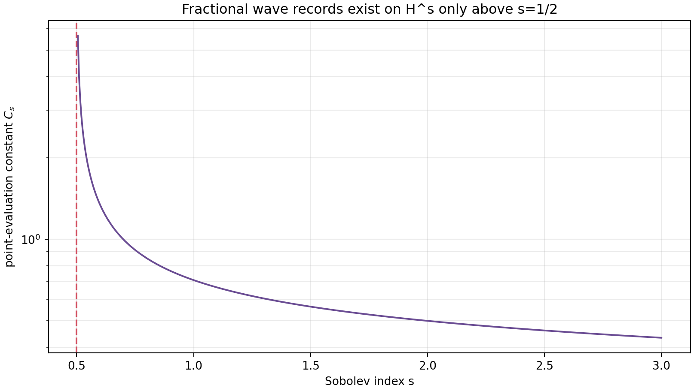

**Result:** **Proven.** Regular preparations in $H^s$, $s>1/2$, define
pointwise wave records.

**Limitation:** the wave group is unitary and does not smooth. This theorem
does not recover an $L^1\to L^\infty$ dispersive decay estimate and does not
select a physical preparation regularity.

## 12. Program 144 — Detector-resolution renormalization

Define a Gaussian detector response

$$
\widehat R_\sigma(q)
=
e^{-\sigma^2q^2/2}
$$

and the measured wave operator

$$
\mathcal M_{\sigma,t}=R_\sigma U_t.
$$

For $1/2<s<5/2$,

$$
\|(R_\sigma-I)U_tf\|_\infty
\le
C_s\sigma^{s-1/2}\|f\|_{H^s}.
$$

Thus sufficiently regular preparations have a resolution-independent
pointwise limit.

For the smooth test preparation

$$
\widehat f(q)=e^{-q^2/2},
$$

the observed small-$\sigma$ error scales numerically as

$$
\sigma^{1.99924}.
$$

In contrast, an ideal delta preparation at $t=0$ produces detector peak

$$
(R_\sigma\delta)(0)
=
\frac1{\sqrt{2\pi}\sigma},
$$

which diverges.

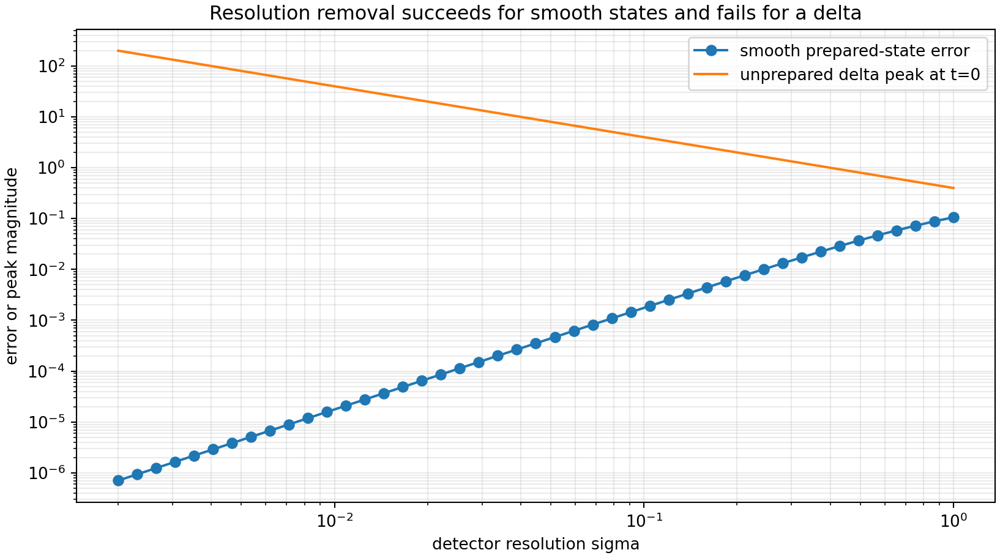

**Result:** **Proven conditionally on preparation regularity, with a numerical
rate check.**

The missing detector object can therefore be supplied without a hard cutoff,
but the ability to remove its resolution depends on the preparation class.

## 13. Program 145 — Joint system–instrument identifiability

### 13.1 Declared model

Let the system spin mean be

$$
s_\alpha(t)=e^{-t^\alpha}.
$$

Let the apparatus flip process have prevalence $\epsilon$, signed mean

$$
e=1-2\epsilon,
$$

and persistence $\rho$. Use the observables

$$
\mu_1=e\,s_\alpha(1),
\qquad
\mu_2=e\,s_\alpha(2),
$$

and the lag product

$$
L=s_\alpha(1)s_\alpha(2)
\left[e^2+\rho(1-e^2)\right].
$$

### 13.2 Exact inverse

The exponent is recovered from the ratio:

$$
\alpha
=
\log_2\left(
1+\log\frac{\mu_1}{\mu_2}
\right).
$$

Then

$$
e=\frac{\mu_1}{e^{-1}},
\qquad
\epsilon=\frac{1-e}{2},
$$

and

$$
\rho
=
\frac{
L/[s_\alpha(1)s_\alpha(2)]-e^2
}{
1-e^2
}.
$$

The three-observable Jacobian has rank three. A single-time mean has rank one.

At truth

$$
(\alpha,\epsilon,\rho)=(0.8,0.1,0.75),
$$

synthetic inversion with observable noise $2\cdot10^{-4}$ gives RMSE

$$
(0.001284,\ 0.000277,\ 0.009423).
$$

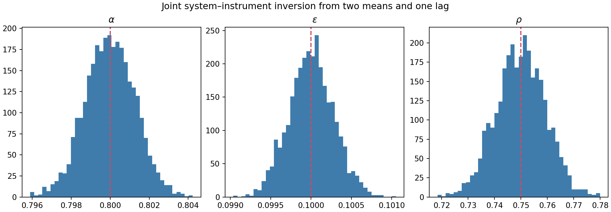

**Result:** **Proven in the declared three-parameter model and validated
synthetically.**

The theorem shows that memory need not be confused with a fractional exponent
when two times and one correlation are measured. It is not a universal
semiparametric identifiability theorem.

## 14. Program 146 — Calibration-invariant observables

For a symmetric stable process of index $\alpha$,

$$
X_t\overset d=t^{1/\alpha}X_1.
$$

Therefore every fixed quantile width obeys

$$
Q(t)=\ell\left(\frac{t_{\rm phys}}{\tau}\right)^{1/\alpha}Q(1).
$$

The ratio statistic

$$
T
=
\frac{
\log[Q(t_2)/Q(t_1)]
}{
\log(t_2/t_1)
}
$$

cancels $\ell$ and $\tau$ and equals $1/\alpha$.

For IQR, $t_1=1$, $t_2=4$, and $\alpha=4/5$, 350 synthetic replicates with
4,000 records per time give

$$
\overline T=1.25065,\qquad
\operatorname{sd}(T)=0.03147.
$$

After relative Gaussian detector noise $0.1\ell$,

$$
\overline T=1.24799,\qquad
\operatorname{sd}(T)=0.03163.
$$

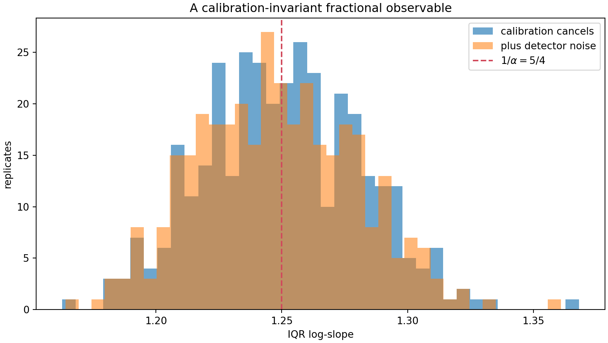

Other invariant candidates include spectral gap ratios,

$$
\frac{\Delta E_k}{\Delta E_j}
=
\frac{\lambda_k}{\lambda_j},
$$

which cancel $\hbar/\tau$.

**Result:** **Constructed, with strong synthetic evidence.**

Multiplicative scales cancel, but calibrated time ordering and a detector
model remain necessary.

---

# Part V — Programs 147–149: resource theory, action, and bridge diagram

## 15. Program 147 — Reflection-asymmetry preparation resource

### 15.1 Free objects

Let $R$ implement reflection on $C_{12}$. Define free states by

$$
\rho=R\rho R
$$

and free channels by reflection covariance,

$$
\Phi(R\rho R)=R\Phi(\rho)R.
$$

### 15.2 Resource monotone

Define

$$
M(\rho)
=
\frac12\|\rho-R\rho R\|_1.
$$

Trace-norm contractivity gives

$$
M(\Phi(\rho))
\le
M(\rho).
$$

This is a resource monotone for signed preparation.

### 15.3 Receiver bound

For any Hermitian reflection-odd receiver $C$,

$$
RCR=-C.
$$

Then

$$
\operatorname{Tr}(\rho C)
=
\frac12
\operatorname{Tr}\left[
(\rho-R\rho R)C
\right],
$$

so Hölder duality gives

$$
|\operatorname{Tr}(\rho C)|
\le
M(\rho)\|C\|_\infty.
$$

On the fractional $C_{12}$ circulant, the $k=\pm1$ states satisfy

$$
M(\rho_\pm)=1,
$$

$$
\Lambda(\rho_+)=+0.498004,
\qquad
\Lambda(\rho_-)=-0.498004.
$$

Their equal mixture has

$$
M\left(\frac{\rho_++\rho_-}{2}\right)=0
$$

and zero signed receiver.

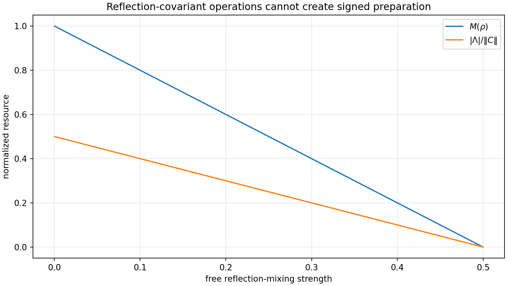

**Result:** **Proven preparation-resource no-go theorem.**

A reflection-symmetric state cannot produce signed preparation under
reflection-covariant operations. To discharge QW-2191, strict FIN would have
to export a nonfree state or a symmetry-breaking operation. The radial kernel
and even fractional generator cannot do so alone.

## 16. Program 148 — Coupled state–damping variational family

Define

$$
r_{a,p}
=
\frac{d_p^a}{\sum_qd_q^a}
$$

and, for $\kappa>0$,

$$
\mathcal F_{a,\kappa}(w,\eta)
=
D_{\rm KL}(w\|r_a)
+
\frac\kappa2
\left(
\eta-\sum_pw_pd_p
\right)^2.
$$

The functional is strictly convex on the simplex interior times $\mathbb R$.
Its unique stationary solution is

$$
w=r_a,
\qquad
\eta=\sum_pr_{a,p}d_p.
$$

For $a=0$,

$$
\eta=\frac95.
$$

For $a=1$,

$$
\eta=\frac{17}{9}.
$$

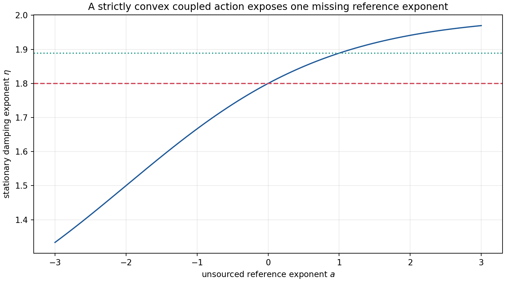

The positive monomial tail condition

$$
T(ab)=T(a)T(b),
\qquad
T(d)=\beta d^\eta
$$

still forces $\beta=1$ separately.

**Result:** **Constructed well-posed variational family.**

The action does not solve state selection: it exposes the remaining missing
coefficient as the reference exponent $a$. Choosing $a=0$ because it yields
$9/5$ would be target coding.

## 17. Program 149 — Typed completion-map diagram

### 17.1 Proven and conditional arrows

Amplitude projectivization is

$$
\Pi_0(K)=\frac{K}{K(0)}.
$$

The conditional damping multiplier is

$$
D(d)
=
\frac{1+\beta_{\rm tors}d}{1+d^{9/5}}.
$$

If the legacy oscillatory numerator is artificially replaced by the strict
one, the square

$$
\Pi_0
\quad\text{followed by}\quad
D
$$

commutes with the projective strict target. The numerical residual is

$$
5.67\cdot10^{-17}.
$$

### 17.2 Actual canonical parameters

For the canonical legacy numerator

$$
\cos\left(\frac\pi4d+\frac\pi6\right)
$$

and strict numerator

$$
\cos\left(\frac{743}{4000}d+\frac{13}{80}\right),
$$

the same amplitude-plus-damping route has relative residual

$$
0.47086477
$$

on $d=0,\ldots,64$.

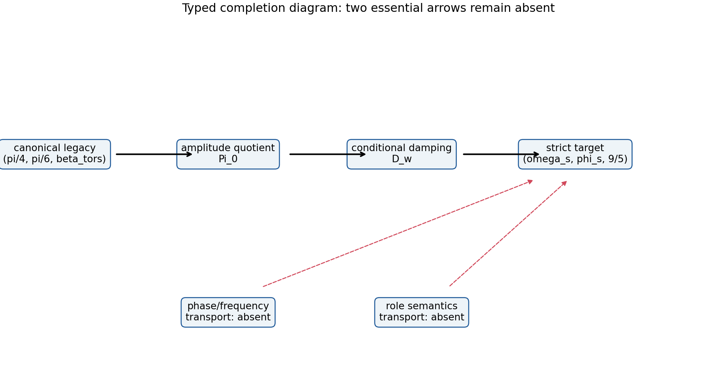

The typed diagram therefore has:

- a proven amplitude-quotient arrow;
- a conditional damping arrow;
- no phase/frequency transport arrow;
- no strict selector/topological transport arrow;
- no physical-role transport arrow.

**Result:** **Constructed diagram and finite noncommutation witness.**

The damping result of Programs 135 and 148 is not a full
legacy-to-strict bridge. Role-transfer auditing remains downstream.

---

# Part VI — Program 150: an immutable pre-data physical protocol

## 18. Operational question

The protocol asks a deliberately narrow physical question:

> Does a calibrated one-dimensional spreading record behave like local
> diffusion with $\alpha=2$, or like fractional spreading with
> $\alpha=4/5$?

It does not attempt to test the FIN ontology, cosmology, or Theory-of-
Everything claims.

## 19. Frozen design

The protocol identifier is:

`FIN-P150-FRACTIONAL-IQR-001`.

The design fixes:

- one documented localized preparation;
- observation times $t_1=1$ and $t_2=4$;
- at least 4,000 position records per time;
- a Gaussian detector response;
- known-input apparatus calibration before test records;
- primary statistic

$$
T
=
\frac{
\log[\operatorname{IQR}(4)/\operatorname{IQR}(1)]
}{
\log4
};
$$

- null

$$
H_0:\alpha=2,\qquad T=\frac12;
$$

- alternative

$$
H_1:\alpha=\frac45,\qquad T=\frac54;
$$

- rejection threshold

$$
T>0.875.
$$

The canonical frozen-core digest is

`0c292bf5d8efce3055a27daa16e60d60b53e2e2cb9852c37827418ec1ec453f5`.

## 20. Synthetic power audit

With 450 replicates and 4,000 records per time:

$$
\begin{array}{c|cc}
&\text{mean}&\text{standard deviation}\\
\hline
H_0&0.499047&0.018354\\
H_1&1.245623&0.030951
\end{array}
$$

The declared synthetic false-positive rate is zero and synthetic power is
one. These values reflect the deliberately well-separated simple hypotheses.

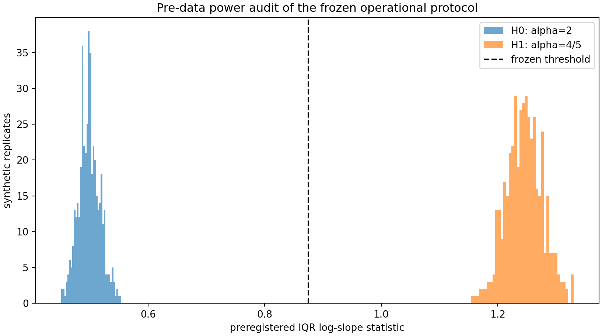

**Result:** **Constructed immutable pre-data protocol.**

No external data have been selected or admitted. A successful future
rejection would concern the declared operational models only.

---

# Part VII — Integrated conclusions and falsification ledger

## 21. Newly constructed objects

The round constructs:

1. a modular/KMS state-selection no-go theorem;
2. a reference-measure entropy classification;
3. a Morita amplification trace test;
4. a validated interval FFT;
5. a finite Diophantine discrepancy modulus;
6. a Sobolev wave-record space;
7. a Gaussian detector-resolution family;
8. an exact joint system–instrument inverse map;
9. a calibration-invariant IQR observable;
10. a reflection-asymmetry preparation resource theory;
11. a strictly convex coupled state–damping action family;
12. a typed completion-map diagram;
13. an immutable pre-data physical protocol.

## 22. Falsification ledger

### 22.1 “Modular flow selects the physical state”

**Refuted in the present finite algebra.** The commutative flow is trivial;
the noncommutative modular flow is defined from a state rather than selecting
it.

### 22.2 “Maximum entropy forces uniform sector weights”

**Refuted without a reference measure.** Sector counting, Hilbert counting,
and Hilbert–Schmidt counting give different exponents.

### 22.3 “The Hilbert trace is categorical”

**Refuted.** Morita-equivalent block amplification changes its central
weights.

### 22.4 “The earlier 2.2647% fractional bound is already formal”

**Refuted.** The validated interval FFT supports compatibility with the
fractional scale but yields the coarser formal bound $1.08135$.

### 22.5 “A finite continued fraction proves an all-scale rate”

**Refuted.** Future partial quotients remain uncontrolled.

### 22.6 “A wave detector must always have a hard UV cutoff”

**Refined.** A regular $H^s$, $s>1/2$, preparation admits pointwise records
without a hard cutoff. Ideal delta preparation does not.

### 22.7 “Apparatus memory is inevitably confounded with the exponent”

**Refuted in the declared three-parameter model.** Two means and one lag give
an exact inverse.

### 22.8 “Physical scales prevent any direct test”

**Refuted for selected ratios.** The IQR log-slope cancels multiplicative
length and time scales.

### 22.9 “A signed receiver supplies the missing selector”

**Refuted theoremically.** Its output is bounded by a preparation-asymmetry
resource that free symmetric operations cannot create.

### 22.10 “Amplitude plus damping completes legacy to strict”

**Refuted for canonical legacy parameters.** The residual is $0.470865$;
phase/frequency transport is absent.

## 23. Deepest surviving interpretation

The most defensible architecture is:

$$
\begin{gathered}
\boxed{\text{dimensionless strict spectral generator}}
\\ \downarrow \\
\boxed{\text{natural localizer plus an unsourced sector state}}
\\ \downarrow \\
\boxed{\text{prepared operational process plus detector}}
\\ \downarrow \\
\boxed{\text{calibration-invariant statistics and external records}}.
\end{gathered}
$$

The first object is mathematical. The localizer is now natural. The state,
signed preparation, and physical calibration remain separate interfaces.
Some physical tests can cancel multiplicative calibration, but no statistic
can replace the need for preparation provenance, detector modelling, and raw
records.

The single most important missing theorem is now:

> a non-target-coded law selecting a faithful state on the localized sector
> algebra and coupling it to damping.

Even such a theorem would not by itself supply signed preparation or physical
units. The resource theorem proves that the selector obstruction is logically
independent of the sector-state obstruction.

## 24. Claim table

### Proven

- KMS nonselection on the finite sector algebra;
- reference dependence of maximum entropy;
- Morita instability of the normalized Hilbert trace;
- formal interval enclosure of all 50 frequency cells;
- finite Denjoy–Koksma/Ostrowski discrepancy modulus;
- $H^s$, $s>1/2$, point-record theorem;
- regular detector-resolution limit;
- exact inverse in the declared system–instrument model;
- preparation-asymmetry monotonicity and receiver bound;
- strict convexity and stationary solution of the coupled action;
- noncommutation of the canonical bridge diagram.

### Strong evidence

- finite-sample performance of joint inversion;
- robustness of the IQR exponent statistic;
- synthetic power of the frozen physical protocol.

### Conditional

- $9/5$ from sector-counting reference;
- $9/5$ from a modular gap $\log2$;
- $\beta=1$ from positive multiplicative monomial damping;
- detector-resolution removal for regular preparations;
- empirical execution after apparatus and data intake.

### Open

- a strict state/reference selection theorem;
- a strict signed preparation resource;
- a formal tight fractional remainder below three percent;
- an all-scale Diophantine remainder rate;
- phase/frequency bridge;
- physical-role transfer;
- internal units;
- external validation.

---

# Part VIII — Recommended Programs 151–163

## 25. Program 151 — Tight validated fractional certificate

Repeat Program 141 with an Arb/FLINT-style ball FFT or a distributed
interval transform at substantially larger $N$. The acceptance target is a
formal relative-remainder bound below $3\%$ on the entire window.

**Probability of useful improvement:** 0.90.  
**Probability of reaching $3\%$ with available local resources:** 0.55.

## 26. Program 152 — Effective all-scale irrationality measure

Search for a rigorous effective lower bound on

$$
\left|
\frac{743}{4000\pi}-\frac pq
\right|
$$

using explicit transcendence measures. Translate it into a discrepancy and
Abelian remainder theorem. If known constants are too weak, prove that the
route cannot improve practical bounds.

**Probability of a mathematically valid bound:** 0.55.  
**Probability of a useful numerical rate:** 0.20.

## 27. Program 153 — Functorial probability measure on the fibre groupoid

Construct the groupoid of localized fibres and all admitted isomorphisms.
Classify natural probability measures on its connected components. Determine
whether normalization, additivity, and induction/restriction compatibility
select a unique central state.

**Probability of a classification theorem:** 0.80.  
**Probability of selecting $w_2=1/5$:** 0.20.

## 28. Program 154 — Carrier-sourced modular Hamiltonian

Enumerate basis-free operators generated from $m_p$, kernel homology, and the
real-character action. Test whether any natural Hamiltonian has a unique
dimensionless gap $\log2$ without using $\alpha_{\rm geo}/4$ as an input.

**Probability of a useful no-go theorem:** 0.75.  
**Probability of strict state selection:** 0.15.

## 29. Program 155 — Completeness of the reflection-asymmetry resource

Classify reflection-covariant channels on $C_{12}$ and determine whether
$M(\rho)$ is a complete convertibility monotone for the relevant pure and
mixed state families. Compute resource cost and distillation rate for signed
preparation.

**Probability of a strong finite theorem:** 0.85.

## 30. Program 156 — Detector deconvolution and finite-sample bias

Derive confidence intervals for the IQR slope under finite Gaussian
resolution, correlated detector noise, censoring, and pixelization. Specify
when deconvolution is identifiable and when it amplifies UV noise.

**Probability of operational success:** 0.90.

## 31. Program 157 — Semiparametric system–instrument identifiability

Replace the three-parameter apparatus with an unknown finite-memory channel.
Derive tangent-space or rank conditions separating the fractional exponent
from detector dynamics. Include explicit nonidentifiable counterexamples.

**Probability of useful partial characterization:** 0.75.

## 32. Program 158 — Finite-sample theorem for the stable IQR exponent

Derive asymptotic variance, concentration bounds, and robust confidence
intervals for

$$
\widehat T
=
\frac{\log[\widehat{\operatorname{IQR}}(t_2)/
\widehat{\operatorname{IQR}}(t_1)]}{\log(t_2/t_1)}.
$$

Compare IQR, median absolute deviation, and empirical characteristic-function
estimators.

**Probability of success:** 0.90.

## 33. Program 159 — Blind adversarial protocol challenge

Generate hidden records from local, fractional, tempered-stable, truncated,
and apparatus-confounded alternatives. Freeze the analysis code before labels
are revealed. Measure false attribution of generic heavy tails to FIN.

**Probability of useful falsification evidence:** 0.95.

## 34. Program 160 — Phase/frequency bridge obstruction theorem

Classify maps between the legacy period-eight oscillatory representation and
the strict $C_{12}$/irrational-phase representation under translation,
reflection, and spectral covariance. Prove either a typed transport or a
representation-theoretic obstruction.

**Probability of an obstruction theorem:** 0.80.  
**Probability of a positive canonical bridge:** 0.10.

## 35. Program 161 — Reference-exponent source grammar

Enumerate a finite basis-free grammar for the missing $a$ in
$r_{a,p}\propto d_p^a$. Require naturality, graph-size transfer, and a unique
minimum. Charge description length and reject target-equivalent formulas.

**Probability of useful no-go:** 0.80.  
**Probability of selecting $a=0$:** 0.15.

## 36. Program 162 — Conditional role-transfer obstruction matrix

Without transferring any role, determine which legacy observables are
destroyed by amplitude quotient, damping completion, and phase mismatch.
Produce necessary conditions that any future full bridge must satisfy before
role transfer may begin.

**Probability of success:** 0.95.

## 37. Program 163 — External intake readiness audit

Audit candidate laboratory platforms and datasets only against the frozen
Program-150 schema: preparation, times, raw positions, detector calibration,
memory calibration, provenance, and exclusions. Admit no dataset failing a
mandatory field.

**Probability of finding a schema-compatible public dataset:** unknown.  
**Scientific value of a zero-admission result:** high.

## 38. Priority order

The recommended order is

$$
151\to158\to156\to159\to153\to155\to160\to162\to157\to163,
$$

with Programs 152, 154, and 161 as higher-risk source-theorem branches.

The logic is:

1. make the strongest numerical theorem formally tight;
2. give the physical statistic a finite-sample theory;
3. adversarially test model specificity;
4. continue state and signed-resource mathematics;
5. attack the actual phase/frequency bridge;
6. admit external data only after readiness is demonstrated.

---

# Reproducibility statement

The executable research file is

`fin_programs_138_150_state_detector_bridge.py`.

Machine-readable results are in

`FIN_Programs_138_150_State_Detector_Bridge_Results.json`.

The immutable protocol is

`FIN_Programs_138_150_PreData_Physical_Protocol.json`.

Forty-two regression tests are in

`test_fin_programs_138_150_state_detector_bridge.py`.

Thirteen figures are generated by the same executable. Synthetic calculations
use seed 20260727. No external dataset is admitted.

# Conclusion

Programs 138–150 substantially narrow the missing mathematical principle.
The natural localizer does not become a physical state through KMS theory,
maximum entropy, or Morita equivalence. Those frameworks organize a supplied
state but do not uniquely create one in the present finite structure.

At the same time, the path from the fractional operator to an experimentally
meaningful observable is shorter than before. Regular wave records, detector
resolution, joint apparatus identification, calibration-invariant spreading
statistics, and a pre-data protocol have all been constructed explicitly.

The selector obstruction is now also expressed as a resource theorem:
reflection-symmetric free operations cannot create signed preparation. This
proves that the missing sign is not recoverable merely by reading the same
radial operator more cleverly.

The deepest interpretation surviving falsification is therefore:

> FIN supplies a dimensionless fractional spectral generator and a natural
> finite informational localizer. A physical theory additionally requires a
> selected sector state, a nonfree preparation resource, an instrument, and
> calibrated records. Some calibration dependence can be removed by ratios,
> but the state and preparation sources remain genuinely independent
> mathematical obligations.

# Selected references

1. M. Takesaki, *Theory of Operator Algebras I*, Springer.
2. O. Bratteli and D. Robinson, *Operator Algebras and Quantum Statistical
   Mechanics*, Springer.
3. M. Rieffel, “Morita equivalence for operator algebras,” in *Operator
   Algebras and Applications*.
4. W. Feller, *An Introduction to Probability Theory and Its Applications,
   Volume II*, Wiley.
5. K. Sato, *Lévy Processes and Infinitely Divisible Distributions*,
   Cambridge University Press.
6. L. Kuipers and H. Niederreiter, *Uniform Distribution of Sequences*,
   Wiley.
7. M. Drmota and R. Tichy, *Sequences, Discrepancies and Applications*,
   Springer.
8. E. M. Stein, *Singular Integrals and Differentiability Properties of
   Functions*, Princeton University Press.
9. F. Brandão and G. Gour, “Reversible framework for quantum resource
   theories,” *Physical Review Letters* 115, 070503.
10. A. van der Vaart, *Asymptotic Statistics*, Cambridge University Press.

# Suggested citation

Żuchowski, K. (2026). *FIN Programs 138–150: State Selection, Validated
Fractional Dynamics, Detector Physics, and Bridge Architecture* (FIN Research
Monograph, Release 10.14; Version 1.0.0) [Preprint]. Zenodo.
