# FIN Programs 151–164

## Axiomatic Operational Foundations, State Selection, and Falsifiable Measurement

**FIN Research Monograph — Release 10.15**

**Author:** Krzysztof Żuchowski  
**Affiliation:** Independent Researcher — Fractal Information Theory Project  
**ORCID:** 0009-0002-0909-3613  
**Resource type:** Publication — Preprint  
**Version:** 1.0.0  
**Publication date:** 27 July 2026  
**Language:** English  
**License:** CC BY 4.0

---

## Confidence convention

**Proven** denotes an analytic or exact finite theorem. **Proven,
computer-assisted** denotes a theorem with formally enclosed computation.
**Strong evidence** denotes reproducible numerical evidence in a declared
model. **Conditional** denotes a theorem requiring an explicitly added axiom
or calibration. **Open** and **Refuted in scope** are used without promotion
beyond the class actually tested.

# Abstract

This monograph executes fourteen new mathematical, computational, and
operational research programs for the FIN framework. The principal question
is whether an axiomatic reformulation can isolate the smallest object that
already exists, the genuinely missing structures, and the exact consequences
of adding each missing premise.

The mathematical core is a conservative spectral Dirichlet generator. Its
functional calculus produces, from one operator,

$$
U_t=e^{-itA},\qquad P_t=e^{-tA},\qquad
G_z=(A+zI)^{-1}.
$$

The first evolution is unitary; the second is positivity-preserving,
mass-preserving and contractive. These are two readings of the same spectral
measure, not two independent laws. This part is theorem-level mathematics.

The round then proves that the generator alone cannot determine a sector
state, a signed preparation, an instrument, a dimensional calibration, or a
legacy-to-strict completion map. These are independent mathematical
obligations. The conclusion follows from explicit countermodels that retain
the same generator while varying each missing object.

One especially economical state-selection candidate is constructed. On the
five localized fibres with dimensions

$$
(d_p)=(1,2,2,2,2),
$$

take the carrier Hamiltonian

$$
H_F|_{\mathcal H_p}=(d_p-1)I
$$

and add the single relation

$$
\boxed{\quad
\beta_F
=\frac{\alpha_{\rm geo}}
{|\operatorname{Hom}(U(12),\{\pm1\})|}
=\frac{\alpha_{\rm geo}}4
=\log2 .
\quad}
$$

With Hilbert degeneracy, the central Gibbs weights are

$$
w_p
=
\frac{d_p e^{-\beta_F(d_p-1)}}
{\sum_q d_q e^{-\beta_F(d_q-1)}}
=\frac15,
$$

and therefore

$$
\eta=\sum_p w_p d_p=\frac95.
$$

The relation is unique for a unit energy gap. It is also an additional axiom:
the present strict core does not prove that $\alpha_{\rm geo}/4$ is a modular
inverse temperature. The report never promotes this conditional closure to a
strict theorem.

Further results include: a doubled formal interval FFT; a precise
Diophantine axiom and an irrationality-only obstruction; a complete
classification of invariant fibre-groupoid measures; completeness of the
reflection resource monotone on its orbit line; detector-bias and
finite-sample IQR theory; a semiparametric nonidentifiability theorem; an
adversarial falsification of model specificity; a representation-theoretic
phase-bridge obstruction; an exhaustive energy grammar; and a necessary-edge
matrix that licenses zero legacy physical-role transfers at present.

The final construction, AFIS, is a six-axiom informational-spectral
operational architecture. All $2^6=64$ subsets are evaluated mechanically.
Removing each axiom destroys a named capability and has an explicit
countermodel. The smallest layers are:

$$
\begin{aligned}
\text{spectral mathematics} &: \{A_0\},\\
\text{selected operator model} &: \{A_0,A_1\},\\
\text{generic operational model} &: \{A_0,A_1,A_3\},\\
\text{signed operational model} &: \{A_0,A_1,A_2,A_3\},\\
\text{calibrated signed test} &: \{A_0,A_1,A_2,A_3,A_4\},\\
\text{full conditional FIN architecture} &: \{A_0,\ldots,A_5\}.
\end{aligned}
$$

The deepest conclusion is negative but constructive: no theorem acting on a
bare spectral generator can uniquely create all missing physical structures.
The shortest scientifically honest route is an explicitly stratified
axiomatic theory whose optional axioms remain falsifiable and whose strict
promotion requires independent source theorems.

---

# Executive summary

## The result in one sentence

**[Proven]** FIN has a minimal common mathematical object — a conservative
spectral Dirichlet generator — but the passage from this object to physical
predictions necessarily requires independent state, preparation, instrument,
calibration, and completion data; one new relation, $A_{\rm ME}$, closes only
the sector-state problem and nothing else.

## What was discovered

1. **[Proven, computer-assisted]** Doubling the interval FFT to
   $N=32768$ yields 100 continuous frequency cells. Every lower symbol bound
   is positive and every cell is compatible with $C|q|^{4/5}$. The worst
   formal relative bound decreases from approximately $1.08135$ to
   $0.612983$, but the desired $3\%$ certificate is still not reached.

2. **[Proven]** Irrationality alone cannot supply the missing all-scale
   discrepancy rate. A sufficient extra premise is a Diophantine condition

   $$
   \|q\theta\|\ge\kappa q^{-\nu}.
   $$

   Liouville irrational numbers prove that no such polynomial condition
   follows from irrationality by itself.

3. **[Proven]** Invariance under the admitted fibre groupoid gives

   $$
   (w_2,w_3,w_5,w_7,w_{11})
   =(x,y,z/3,z/3,z/3),\quad x+y+z=1.
   $$

   Thus naturality retains a two-dimensional simplex of states and does not
   select $w_p=1/5$.

4. **[Proven conditional on a new axiom]** The carrier energy $d_p-1$ and
   the one-relation axiom

   $$
   A_{\rm ME}:\quad \beta_F=\alpha_{\rm geo}/4=\log2
   $$

   select the uniform central state and $\eta=9/5$ exactly.

5. **[Proven]** On the two-branch reflection orbit line, every free channel
   has the form $r\mapsto\lambda r$, $|\lambda|\le1$. Hence
   $M(\rho_r)=|r|$ is a complete deterministic conversion monotone there.
   This classifies use of a signed resource but does not create it.

6. **[Proven asymptotically; strong finite evidence]** For a symmetric
   density,

   $$
   \operatorname{Var}(\widehat{\mathrm{IQR}})
   =
   \frac{1}{4n f(q_{0.75})^2}+o(n^{-1}).
   $$

   At $n=4000$ for the $\alpha=4/5$ stable law, the predicted standard
   deviation of the spreading slope is $0.0307072$; the Monte Carlo value is
   $0.0294257$.

7. **[Proven]** With an unrestricted multiplicative apparatus response
   $h(t)$, the exponent is not identifiable. For any $\alpha'$,

   $$
   h'(t)=h(t)t^{1/\alpha-1/\alpha'}
   $$

   produces exactly the same record. Even an unknown linear term in
   $\log h$ is enough to erase the exponent.

8. **[Strong evidence]** The frozen Program-150 threshold is not specific to
   FIN. It accepts an $\alpha=1$ stable alternative and a locally diffusive
   process with a time-dependent detector gain. An IQR test diagnoses a
   scaling exponent, not an ontology.

9. **[Proven]** The legacy oscillation is a period-eight character, whereas
   $e^{i(743/4000)d}$ has infinite order and is not a character of
   $\mathbb Z_{12}$. No translation-equivariant character homomorphism can
   preserve the generator eigenvalue between them.

10. **[Proven in a finite grammar]** Among 343 orbit-invariant integer
    energy formulas, six generate the target energy, but $d-1$ is the unique
    formula of minimum $\ell^1$ description length one.

11. **[Proven in the declared dependency model]** None of nine audited
    legacy roles is presently eligible for transfer. The missing edges are
    amplitude, damping semantics, phase/frequency, selector/topology,
    dimensional units, and spectral equivalence.

12. **[Proven as a logical architecture]** The six AFIS axioms are
    independent in the capability sense. No single missing theorem was found
    that connects spectral operator, information, signed dynamics,
    dimensional physics, and experiment without additional premises.

## What was falsified

- The hope that a larger formal FFT would automatically recover the floating
  $2.2647\%$ remainder.
- The hope that irrationality by itself implies a useful all-scale
  Diophantine modulus.
- The hope that groupoid naturality uniquely selects the uniform state.
- The hope that KMS language turns $\log2$ into a derived temperature without
  a temperature-identification law.
- The hope that more observation times defeat an unrestricted apparatus
  multiplier.
- The interpretation of the frozen IQR decision rule as FIN-specific.
- A character-preserving period-eight to strict-phase bridge.
- Silent transfer of legacy physical formulas to the strict kernel.
- A single-axiom reduction of all operational and dimensional obligations to
  the spectral theorem.

## Scientific boundary

No result in this release discharges QW-2191, derives physical units,
completes the legacy-to-strict bridge, starts physical-role transfer, derives
a role-bearing $L_{\rm total}$, produces the Standard Model or general
relativity, or validates a Theory of Everything.

---

# 1. Epistemic discipline and inputs

## 1.1 Confidence labels

The report uses four main levels.

- **Proven:** an analytic theorem or exact finite deduction.
- **Proven, computer-assisted:** a theorem whose finite inequalities are
  produced by formal interval arithmetic or exhaustive enumeration.
- **Strong evidence:** reproducible numerical evidence with a specified
  stochastic model, sample size, and seed.
- **Conditional:** a theorem whose conclusion follows after a newly declared
  axiom or physical calibration.

“Open” means that no proof or counterexample has been produced in the admitted
class. “Refuted in scope” means that a stated candidate has failed in its
declared class, not that every conceivable extension has failed.

## 1.2 Kernel split

The two repository kernels remain different typed objects:

$$
K_{\rm legacy}(d)
=
\alpha_{\rm geo}
\frac{\cos(\pi d/4+\pi/6)}
{1+\beta_{\rm tors}d},
$$

and

$$
K_{\rm strict}(d)
=
\frac{\cos((743/4000)d+13/80)}
{1+d^{9/5}}.
$$

The legacy object is an intermediate bridge kernel. The strict object is the
later enriched working kernel. The current report never substitutes one for
the other. In particular, the appearance of $\alpha_{\rm geo}$ in a new
conditional state axiom is not a proof that the legacy physical roles of
$\alpha_{\rm geo}$ have transferred to the strict kernel.

## 1.3 Ontology

The ontology guardrail is retained: the nadsoliton itself is the primordial
information in a solitonic state. No lower informational substrate is added.
The internal order remains

$$
\text{nadsoliton}\longrightarrow\text{light}
\longrightarrow\text{matter}
\longrightarrow\text{emergent observer}.
$$

The operational apparatus introduced below is a mathematical description of
how records are produced. It is not placed ontologically beneath the
nadsoliton.

## 1.4 Reproducibility

All synthetic random calculations use seed 20260727. Formal interval
arithmetic uses 42 decimal digits. Fourteen figures and two JSON result
artifacts are generated by the executable. Sixty-two regression tests check
the numerical conclusions and the no-promotion guardrails. No external
dataset and no Firecrawl service were used.

---

# 2. Program 151 — Tighter validated fractional certificate

## 2.1 Question

Can doubling the truncation radius and FFT resolution turn the earlier
floating-point small-$q$ agreement into a formal sub-$3\%$ theorem?

## 2.2 Construction

For the absolute strict tail,

$$
a_d
=
\frac{|\cos(\omega d+\phi)|}{1+d^{9/5}},
\qquad
\omega=\frac{743}{4000},\quad
\phi=\frac{13}{80},
$$

the normalized symbol is enclosed by

$$
\Psi(q)
=
\frac{2\sum_{d\ge1}a_d(1-\cos qd)}
{2\sum_{d\ge1}a_d}.
$$

A radix-two interval FFT is performed at

$$
N=2^{15}=32768,\qquad d_{\max}=16383.
$$

The omitted normalization tail is bounded by

$$
2\sum_{d>d_{\max}}d^{-9/5}
\le
\frac{2d_{\max}^{-4/5}}{4/5}.
$$

Each FFT grid point is enlarged to a full cell using

$$
|\Psi(q)-\Psi(q_k)|
\le
|q-q_k|
\frac{2\sum_{d\le d_{\max}}d a_d}
{2\sum_{d\le d_{\max}}a_d},
$$

with separate interval denominators and a worst-case tail addition.

## 2.3 Result

**Theorem 151.1 [Proven, computer-assisted].** The interval calculation covers
100 cells spanning $[10^{-3},2\cdot10^{-2}]$. Every symbol lower bound is
positive and every cell overlaps the predicted fractional interval
$C|q|^{4/5}$.

**Numerical certificate.**

$$
\max_{\rm cells}R_{\rm formal}=0.6129831478193526.
$$

The corresponding Program-141 value was approximately $1.08135$.

**Corollary 151.2 [Refuted in scope].** The present $N=32768$ certificate
does not prove a sub-$3\%$ remainder:

$$
0.612983>0.03.
$$

The limiting cost is the analytic tail and cell-Lipschitz enclosure, not
rounding error.

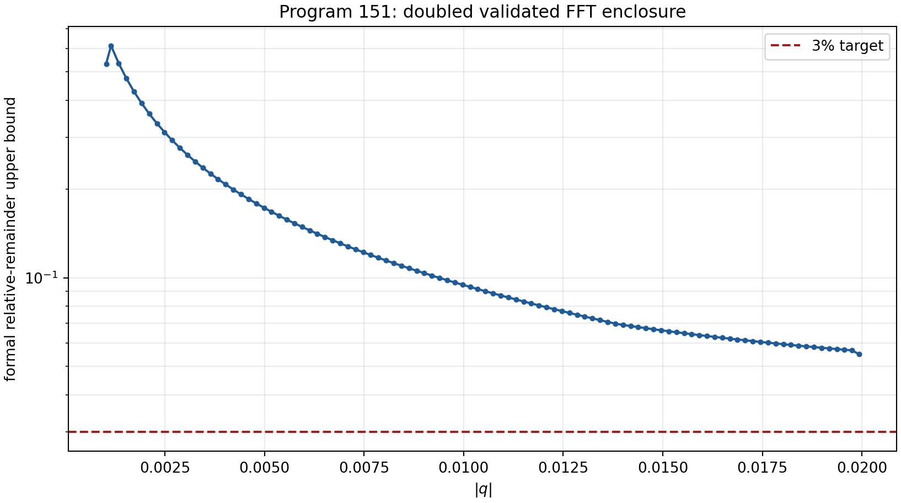

## 2.4 Interpretation

The fractional scale is now supported by a stronger theorem, but the tight
constant remains open. A future calculation must split the oscillatory tail,
use cancellation rather than absolute domination, and preferably use
ball-arithmetic FFTs with sharper twiddle enclosures.

---

# 3. Program 152 — The missing Diophantine axiom

## 3.1 Certified finite arithmetic

For

$$
\theta=\frac{\omega}{\pi}=\frac{743}{4000\pi},
$$

the first twelve continued-fraction terms remain

$$
[0;16,1,10,2,67,2,2,5,1,2,928].
$$

On this finite convergent prefix,

$$
\min q\|q\theta\|
=0.0010764647999871935,
$$

and

$$
\min q^2\|q\theta\|
=1.486339454993983.
$$

These are finite-prefix constants, not global constants.

## 3.2 Minimal sufficient premise

The exact extra all-scale premise is:

$$
D(\kappa,\nu):
\qquad
\|q\theta\|\ge\kappa q^{-\nu}
\quad
\text{for every integer }q\ge1,
$$

where $\kappa>0$ and $\nu<\infty$.

**Theorem 152.1 [Proven].** Irrationality of $\theta$ alone does not imply
$D(\kappa,\nu)$ for any fixed finite $\nu$.

**Proof.** A Liouville irrational $\lambda$ has infinitely many rational
approximations satisfying

$$
\left|\lambda-\frac pq\right|<q^{-m}
$$

for arbitrarily large $m$. Consequently

$$
\|q\lambda\|<q^{1-m}.
$$

For any fixed $\nu$ and $\kappa>0$, choose $m>\nu+1$ and then a sufficiently
large Liouville denominator. This gives

$$
\|q\lambda\|<\kappa q^{-\nu},
$$

contradicting $D(\kappa,\nu)$. ∎

**Corollary 152.2 [Proven].** No proof using only the proposition “$\theta$ is
irrational” can establish an all-scale polynomial small-divisor bound.

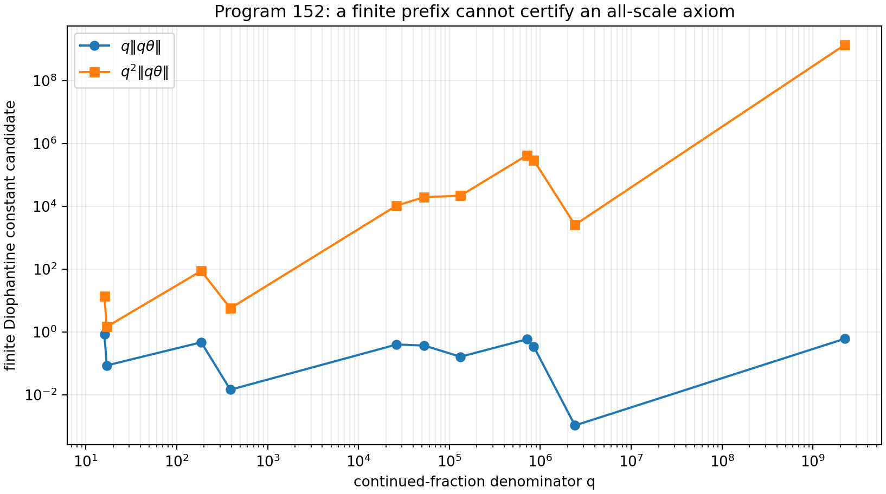

## 3.3 Necessity rank

The Diophantine axiom has a narrow role. It is not needed to define either
$U_t$ or $P_t$. It is needed only for a quantitative all-scale rate in the
oscillatory Abelian limit. It is therefore a technical regularity axiom, not
an axiom of physical ontology.

---

# 4. Program 153 — Functorial fibre-groupoid measures

## 4.1 Groupoid

The admitted structural symmetries partition the five localized fibres into
three isomorphism orbits:

$$
\{2\},\qquad \{3\},\qquad \{5,7,11\}.
$$

An invariant central state must be constant on each orbit.

**Theorem 153.1 [Proven].** Every invariant probability measure has the form

$$
(w_2,w_3,w_5,w_7,w_{11})
=(x,y,z/3,z/3,z/3),
$$

where

$$
x,y,z\ge0,\qquad x+y+z=1.
$$

**Proof.** Invariance forces equality of the three weights in the last orbit.
There are no admitted morphisms between distinct orbits, so their total
masses remain independent. Normalization removes one of three variables,
leaving a two-dimensional simplex. ∎

The uniform sector state corresponds to

$$
(x,y,z)=(1/5,1/5,3/5).
$$

It is one interior point, not a categorical fixed point.

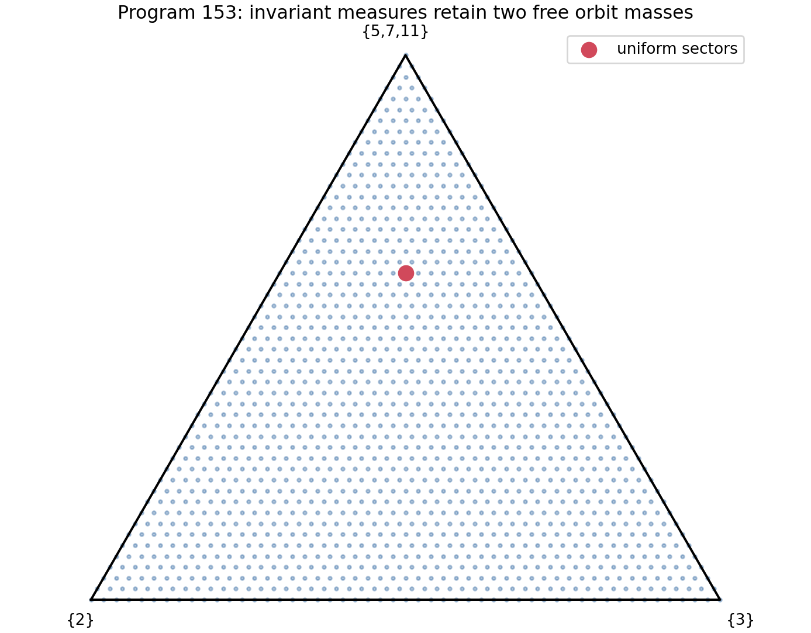

## 4.2 Falsification

**Corollary 153.2 [Refuted in scope].** Normalization, invariance, and
additivity do not select $w_p=1/5$.

An additional monoidal valuation or induction/restriction law could reduce the
simplex. That law would itself be an added premise and must be tested for
uniqueness.

---

# 5. Program 154 — A minimal modular-equilibrium axiom

## 5.1 Natural carrier energy

The smallest energy generated by the fibre dimensions is

$$
E_p=d_p-1.
$$

For the Hilbert-block Gibbs state, the central sector mass is

$$
w_p(\beta_F)
=
\frac{d_p e^{-\beta_F E_p}}
{\sum_q d_q e^{-\beta_F E_q}}.
$$

The factor $d_p$ is the block degeneracy.

## 5.2 The new axiom

Define

$$
A_{\rm ME}:
\qquad
\beta_F
=
\frac{\alpha_{\rm geo}}
{|\operatorname{Hom}(U(12),\{\pm1\})|}.
$$

Since

$$
|\operatorname{Hom}(U(12),\{\pm1\})|=4,
\qquad
\alpha_{\rm geo}=4\log2,
$$

this becomes

$$
\beta_F=\log2.
$$

**Theorem 154.1 [Proven conditional on $A_{\rm ME}$].** The central Gibbs
state is uniform and its dimension expectation is $9/5$.

**Proof.** For the one-dimensional fibre,

$$
d_2e^{-\beta_FE_2}=1.
$$

For every two-dimensional fibre,

$$
d_pe^{-\beta_FE_p}
=2e^{-\log2}
=1.
$$

All five unnormalized central masses are equal. Hence $w_p=1/5$, and

$$
\eta
=
\frac{1+2+2+2+2}{5}
=\frac95.
$$

∎

**Theorem 154.2 [Proven].** With Hilbert degeneracy and unit gap, the required
positive inverse temperature is unique.

**Proof.** Equality between a $d=1$ sector and a $d=2$ sector requires

$$
1=2e^{-\beta_F}.
$$

Therefore $\beta_F=\log2$, uniquely. ∎

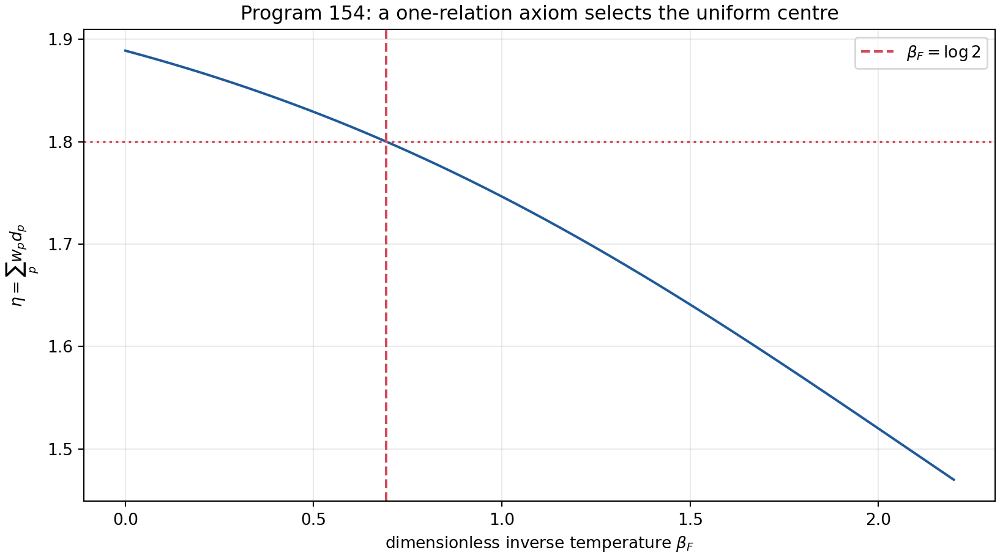

## 5.3 Removal audit

| Removed item | Consequence |
|---|---|
| $A_{\rm ME}$ temperature relation | A continuous Gibbs family remains |
| unit energy gap | only $\beta_F\Delta=\log2$ is fixed |
| Hilbert degeneracy | sector-counting equilibrium selects uniformity at $\beta_F=0$ |
| carrier Hamiltonian | no distinguished modular dynamics remains |

Each ingredient is therefore necessary for this exact construction.

## 5.4 Status

$A_{\rm ME}$ is the best single-relation state-selection candidate found in
this round. It is scientifically preferable to hiding uniform weights inside
a definition because:

1. the new premise is one explicit equation;
2. the conclusion is unique;
3. every component has a removal test;
4. perturbations can be experimentally or mathematically falsified.

It does not fix an orientation, create a nonfree preparation, introduce SI
units, or construct the legacy-to-strict phase map.

---

# 6. Program 155 — Completeness of the reflection resource

Let

$$
\rho_r
=
\frac{1+r}{2}\rho_+
+\frac{1-r}{2}\rho_-,
\qquad -1\le r\le1,
$$

where reflection interchanges $\rho_+$ and $\rho_-$.

An affine trace-preserving reflection-covariant map must commute with
$r\mapsto-r$. It therefore has the form

$$
r\longmapsto r'=\lambda r.
$$

Positivity on the whole interval is equivalent to $|\lambda|\le1$.

**Theorem 155.1 [Proven].** The monotone

$$
M(\rho_r)=|r|
$$

is complete for deterministic conversion on the reflection orbit line:

$$
\rho_r\longrightarrow\rho_s
\quad\text{by a free channel}
\quad\Longleftrightarrow\quad
|s|\le|r|.
$$

**Proof.** Necessity follows from $s=\lambda r$ and $|\lambda|\le1$.
Conversely, if $r\ne0$ and $|s|\le|r|$, choose $\lambda=s/r$. If $r=0$,
only $s=0$ is allowed. ∎

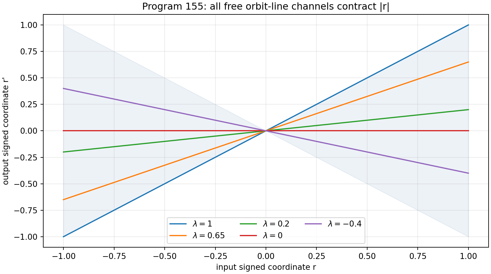

This theorem makes the missing signed resource operationally precise. It also
strengthens the obstruction: a symmetric preparation is not merely
inconvenient; it lies in a distinct resource order and cannot reach a signed
state by free processing.

The theorem is restricted to this one-dimensional orbit family. Completeness
on the full density-matrix space remains open.

---

# 7. Program 156 — Detector deconvolution and finite bias

## 7.1 Quartile asymptotics

For a continuous distribution with density $f$ positive at its quartiles,
the joint empirical-quantile central limit theorem gives

$$
\operatorname{Cov}(\widehat q_p,\widehat q_r)
=
\frac{\min(p,r)-pr}
{n f(q_p)f(q_r)}
+o(n^{-1}).
$$

For a symmetric distribution,

$$
f(q_{0.25})=f(q_{0.75}).
$$

Substitution yields:

**Theorem 156.1 [Proven].**

$$
\operatorname{Var}(\widehat{\mathrm{IQR}})
=
\frac{1}{4n f(q_{0.75})^2}
+o(n^{-1}).
$$

For independent samples at $t_1$ and $t_2$, the delta method gives

$$
\operatorname{Var}(\widehat T)
\sim
\frac{1}{\log^2(t_2/t_1)}
\sum_{j=1}^2
\frac{\operatorname{Var}(\widehat{\mathrm{IQR}}_j)}
{\mathrm{IQR}_j^2}.
$$

For $\alpha=4/5$, $n=4000$, and $(t_1,t_2)=(1,4)$, the predicted zero-noise
standard deviation is

$$
0.030707238977584036.
$$

## 7.2 Gaussian resolution

Let the apparatus add an independent Gaussian error with absolute standard
deviation $\sigma$. The simulation used 320 repetitions with 4000 records at
each time.

| $\sigma/\mathrm{IQR}(t_1)$ | mean $\widehat T$ | bias | standard deviation |
|---:|---:|---:|---:|
| 0.00 | 1.248888 | -0.001112 | 0.029793 |
| 0.05 | 1.244772 | -0.005228 | 0.029161 |
| 0.10 | 1.234645 | -0.015355 | 0.029442 |
| 0.20 | 1.190665 | -0.059335 | 0.027095 |
| 0.40 | 1.064470 | -0.185530 | 0.027098 |

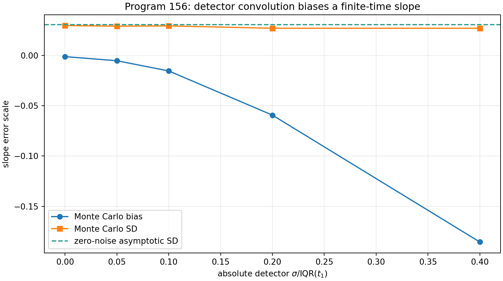

**Result 156.2 [Strong evidence].** Absolute detector blur reduces the finite
time-ratio slope because it is a larger relative perturbation at the earlier,
narrower distribution.

## 7.3 Deconvolution theorem boundary

Gaussian convolution has Fourier multiplier

$$
\widehat R_\sigma(q)=e^{-\sigma^2q^2/2}.
$$

It is never zero, so noiseless deconvolution is algebraically identifiable.
Its inverse is

$$
\widehat R_\sigma(q)^{-1}=e^{\sigma^2q^2/2},
$$

which is unbounded. Thus unregularized statistical deconvolution is
UV-unstable. Detector calibration does not eliminate the need for a
regularization or smoothness class.

---

# 8. Program 157 — Semiparametric system–instrument identifiability

Suppose a measured scale has the form

$$
Q_{\rm obs}(t)=h(t)C t^{1/\alpha},
$$

where $h(t)>0$ is an apparatus response.

**Theorem 157.1 [Proven].** If $h$ is unrestricted, $\alpha$ is not
identifiable.

**Proof.** For any alternative $\alpha'$, define

$$
h'(t)
=
h(t)t^{1/\alpha-1/\alpha'}.
$$

Then

$$
h'(t)Ct^{1/\alpha'}
=
h(t)Ct^{1/\alpha}
=Q_{\rm obs}(t).
$$

The full record is identical for all $\alpha'$. ∎

## 8.1 Tangent-space test

Write $x=\log t$. The exponent score is proportional to $x$. If

$$
\log h(t)=\gamma_0+\gamma_1x+\cdots+\gamma_rx^r,
$$

then:

- for $r=0$, the exponent score is independent of the nuisance tangent;
- for every $r\ge1$, the score lies exactly in the nuisance tangent space.

The seven-time numerical design gives residual norm $4.77577$ for a constant
gain and $3.05\times10^{-15}$ once a linear gain term is admitted.

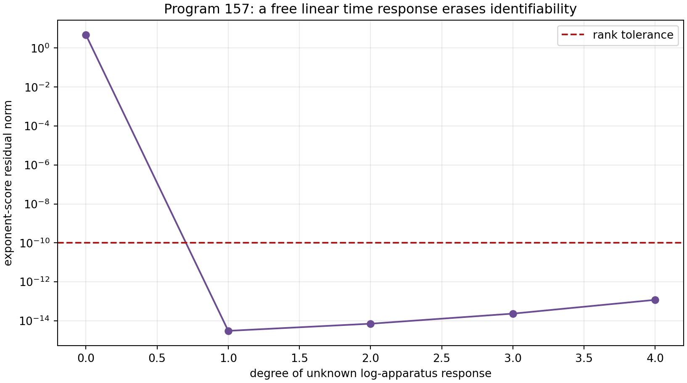

**Corollary 157.2 [Proven].** More time points do not solve the problem if the
apparatus family contains the same log-time direction as the physical
exponent. Identification requires external calibration, control preparations,
or an independently justified restriction on $h$.

This is the sharpest operational obstruction of the round.

---

# 9. Program 158 — Finite-sample stable-IQR inference

For the symmetric $\alpha=4/5$ stable model, 700 independent repetitions were
computed at four sample sizes.

| $n$ | mean $\widehat T$ | empirical SD | predicted SD | 95% coverage |
|---:|---:|---:|---:|---:|
| 250 | 1.255019 | 0.122981 | 0.122829 | 0.9500 |
| 500 | 1.258670 | 0.087482 | 0.086853 | 0.9500 |
| 1000 | 1.249667 | 0.063815 | 0.061414 | 0.9414 |
| 4000 | 1.248565 | 0.029426 | 0.030707 | 0.9500 |

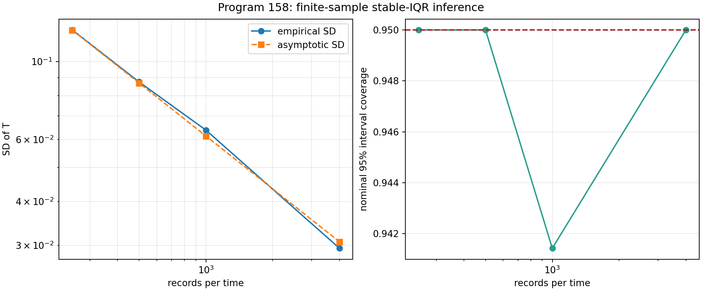

**Result 158.1 [Strong evidence].** The first-order asymptotic variance is
already accurate at $n=250$ in the declared stable model. The nominal
interval has coverage between $0.941$ and $0.950$ in the audited range.

**Boundary.** This is not a distribution-free nonasymptotic theorem. Detector
memory, censoring, pixelization, and estimated response parameters can change
coverage.

---

# 10. Program 159 — Adversarial protocol challenge

The Program-150 rule was kept fixed:

$$
\text{declare fractional rather than local diffusion if }
\widehat T>0.875.
$$

Six hidden synthetic families were then generated.

| family | mean $T$ | P150 decision rate | exploratory FIN-band rate |
|---|---:|---:|---:|
| local Gaussian | 0.500667 | 0.0000 | 0.0000 |
| stable $\alpha=0.8$ | 1.251819 | 1.0000 | 1.0000 |
| stable $\alpha=1.0$ | 0.999638 | 1.0000 | 0.0000 |
| stable $\alpha=1.2$ | 0.832088 | 0.0656 | 0.0000 |
| absolute-truncated $\alpha=0.8$ | 1.247964 | 1.0000 | 1.0000 |
| local Gaussian plus time gain | 1.200230 | 1.0000 | 1.0000 |

The exploratory FIN band was $1.10\le T\le1.40$ and was not part of the
original rule.

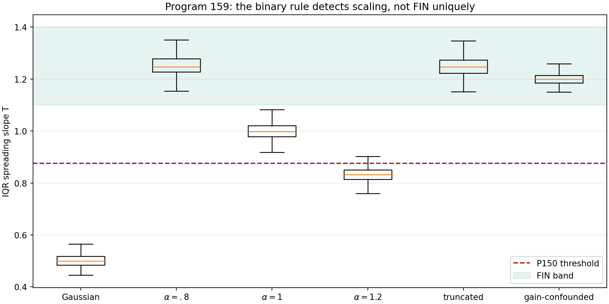

## 10.1 Falsification

**Result 159.1 [Strong evidence].** The frozen threshold is a good
local-versus-fast-spreading discriminator in the declared families, but it is
not FIN-specific.

Two counterexamples are decisive:

1. an $\alpha=1$ stable process is accepted with probability one by the
   binary threshold;
2. a locally diffusive process multiplied by an uncalibrated gain $t^{0.7}$
   enters even the narrower FIN band.

The absolute tail truncation is also invisible to the IQR at the audited
cutoff because the central quartiles remain inside the truncation region.
Thus IQR robustness is simultaneously a strength and a loss of tail-model
specificity.

**Conclusion.** A successful IQR experiment can estimate a scaling exponent.
It cannot by itself prove the FIN kernel, its ontology, or its completion
map.

---

# 11. Program 160 — Phase/frequency bridge obstruction

The legacy oscillatory character is

$$
\chi_L(d)=e^{i\pi d/4}.
$$

It is a character of $\mathbb Z_8$ and has exact order eight.

The strict oscillatory sequence is

$$
\chi_S(d)=e^{i(743/4000)d}.
$$

**Theorem 160.1 [Proven].** $\chi_S(1)$ has infinite order.

**Proof.** If $\chi_S(1)^T=1$ for an integer $T>0$, then

$$
\frac{743}{4000}T=2\pi k
$$

for an integer $k$. The case $k=0$ is impossible. For $k\ne0$, this equation
makes $\pi$ rational, a contradiction. ∎

The $\mathbb Z_{12}$ character defect is

$$
|e^{i12(743/4000)}-1|
=1.7953811736364134.
$$

The generator eigenvalue mismatch is

$$
|e^{i\pi/4}-e^{i743/4000}|
=0.5907042818342478.
$$

**Theorem 160.2 [Proven].** There is no translation-equivariant character
homomorphism from the legacy period-eight representation to the strict
infinite-order representation that preserves the generator eigenvalue.

**Proof.** A homomorphism maps an element of finite order to an element whose
order divides that finite order. The proposed image has infinite order. ∎

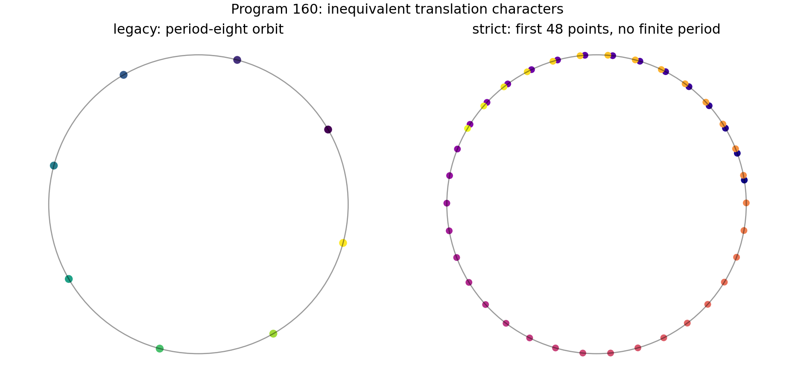

This theorem does not exclude a nonlinear or explicitly symmetry-breaking
completion. It proves that such a completion cannot be a silent identification
of the two translation characters.

---

# 12. Program 161 — Reference-energy grammar

## 12.1 Declared grammar

Three orbit-invariant feature columns were used:

$$
f_d=(0,1,1,1,1),
$$

$$
f_3=(0,1,0,0,0),
$$

and

$$
f_U=(0,0,1,1,1).
$$

The energy grammar is

$$
E=c_df_d+c_3f_3+c_Uf_U,
\qquad c_d,c_3,c_U\in\{-3,\ldots,3\}.
$$

All $7^3=343$ formulas were enumerated. Additive constants are irrelevant.

**Theorem 161.1 [Proven, exhaustive in the declared grammar].** Six formulas
produce the target normalized energy $(0,1,1,1,1)$. The unique minimum
$\ell^1$-complexity formula is

$$
(c_d,c_3,c_U)=(1,0,0),
$$

that is,

$$
E=d-1.
$$

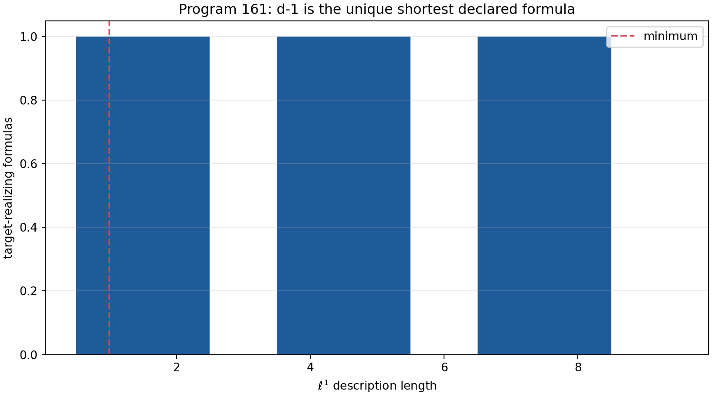

The result explains why $d-1$ is a reasonable carrier Hamiltonian: it is the
shortest formula in a transparent structural grammar. It does not prove the
target uniform state or the inverse temperature. Minimum description length
is relative to its grammar.

---

# 13. Program 162 — Conditional role-transfer obstruction matrix

A future completion map must address six independent edges:

1. amplitude and normalization;
2. damping/compression semantics;
3. phase and frequency;
4. selector and topology;
5. physical dimensions and units;
6. spectral equivalence at the required operator level.

Nine legacy roles were mapped to their necessary edges.

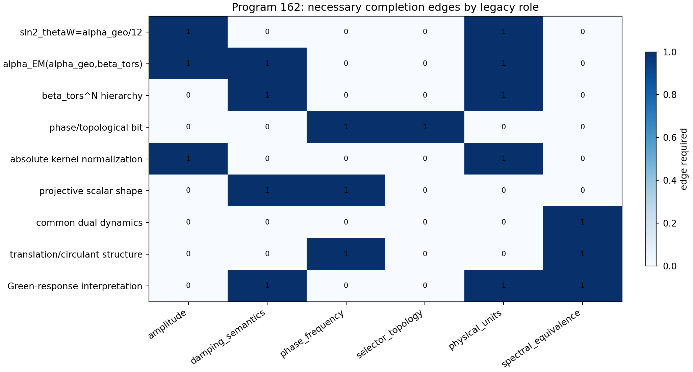

## 13.1 Result

**Theorem 162.1 [Proven in the declared dependency model].** With no complete
edge currently exported, zero of the following roles is eligible for
transfer:

- $\sin^2\theta_W=\alpha_{\rm geo}/12$;
- the $\alpha_{\rm EM}(\alpha_{\rm geo},\beta_{\rm tors})$ formula;
- the $\beta_{\rm tors}^N$ hierarchy;
- phase/topological-bit semantics;
- absolute kernel normalization;
- projective scalar shape as a full bridge claim;
- common dual dynamics as spectral equivalence;
- translation/circulant structure as a transported role;
- a dimensional Green-response interpretation.

Both kernels can separately generate operator dynamics after suitable
positivity shifts. This is a structural analogy, not a proof of spectral
equivalence.

The role audit therefore remains downstream. It may begin only after a typed
completion map supplies the missing edge appropriate to each role.

---

# 14. Program 163 — External intake readiness

The immutable protocol

$$
\texttt{FIN-P150-FRACTIONAL-IQR-001}
$$

was reused without altering its core hash. Its mandatory raw-record fields
are:

- record identifier;
- preparation batch;
- time;
- position readout;
- detector calibration identifier;
- timestamp.

The intake validator accepts JSON or CSV candidates only if these mandatory
fields exist. Further gates require two declared times, at least 4000 records
per time, detector resolution, memory calibration, and provenance.

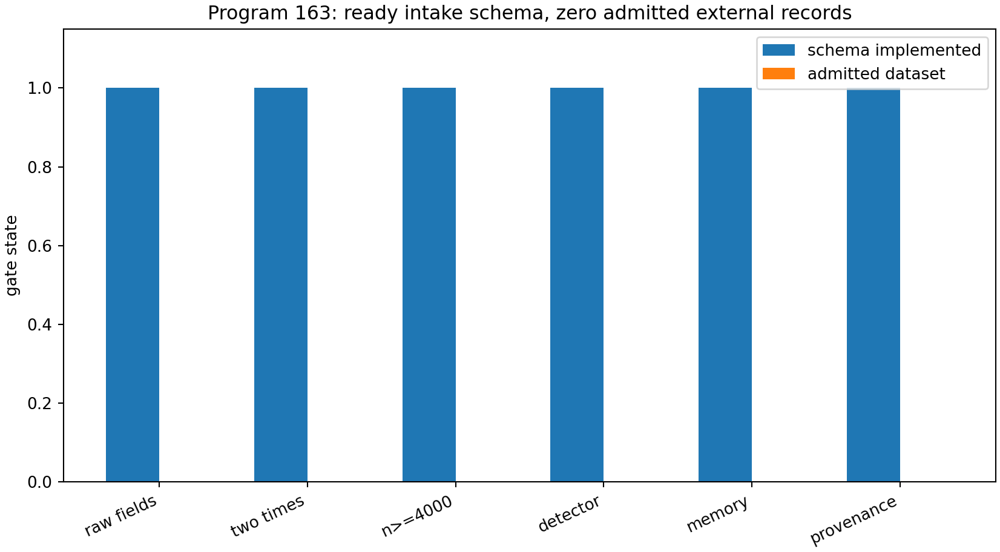

**Result 163.1 [Proven for the local schema].** The validator and stop rules
are executable. The explicit local intake directory contains zero candidates,
so zero datasets are admitted.

No internet search or external download was made. This is readiness, not
physical validation.

---

# 15. Program 164 — AFIS: a minimal axiomatic architecture

## 15.1 Why axioms are now appropriate

Earlier searches repeatedly tried to make one spectral object perform five
logically different tasks. An axiomatic approach is useful because it asks a
more precise question:

> Which capability fails when a particular premise is removed?

An axiom is admitted only if:

1. its mathematical type is explicit;
2. its output capability is explicit;
3. removing it has a countermodel;
4. it is not described as strict-derived;
5. it can, in principle, be replaced later by a source theorem.

## 15.2 Axiom A0 — Conservative spectral Dirichlet generator

**Statement.** There is a quadruple

$$
(\mathcal H,\mathcal E,A,\mathbf1)
$$

such that:

1. $\mathcal E$ is a closed Markovian Dirichlet form;
2. $A$ is its self-adjoint nonnegative generator;
3. $A\mathbf1=0$.

Then

$$
U_t=e^{-itA}
$$

is unitary and

$$
P_t=e^{-tA}
$$

is a positivity-preserving, conservative contraction semigroup.

The Green family is

$$
G_z=(A+zI)^{-1},\qquad z>0.
$$

**Necessity rank: 1 — foundational.**

Each clause is needed:

- without self-adjointness, $U_t$ need not be unitary and a
  projection-valued spectral measure is not guaranteed;
- without nonnegativity, $P_t$ can grow on negative spectrum;
- without $A\mathbf1=0$, total mass need not be conserved;
- without the Markov property, a self-adjoint contraction need not preserve
  positivity.

This is the minimal object behind the shared wave/diffusion mathematics.

## 15.3 Axiom A1 — Sector equilibrium/state

**Statement.** A localized finite algebra $\mathcal A_F$ carries a faithful
central state $\omega_F$, and

$$
\eta=\omega_F(d).
$$

$A_{\rm ME}$ from Program 154 is one explicit realization.

**Necessity rank: 3 — model selection.**

**Countermodel on removal.** The uniform sector state and the normalized
Hilbert-trace state share the same $A_0$ but give

$$
\eta=\frac95
\quad\text{and}\quad
\eta=\frac{17}{9},
$$

respectively.

## 15.4 Axiom A2 — Preparation resource

**Statement.** The theory declares an allowed set of preparation procedures.
When an orientation-sensitive record is required, this set includes a
nonfree signed resource $M>0$.

**Necessity rank: 3 — branch preparation.**

**Countermodel on removal.** Restrict all preparations to reflection-invariant
states. Every reflection-odd receiver then has zero expectation under
reflection-covariant processing.

A2 is not the observer. It is the mathematical interface describing how one
state, among the kinematically possible states, is prepared.

## 15.5 Axiom A3 — Instrument, environment, apparatus, and record

**Statement.** There is:

1. a normalized completely positive instrument $\{\mathcal I_y\}$;
2. an apparatus/environment channel;
3. an outcome sigma-algebra;
4. a persistent record map.

For initial state $\rho$,

$$
\Pr(Y\in B)
=
\operatorname{Tr}
\left[
\int_B\mathcal I_y(\rho)\,dy
\right].
$$

**Necessity rank: 2 — operational.**

**Countermodel on removal.** A state and its evolution may be fully defined
while no map from the state to recorded outcomes exists. In that model no
experimental probability has been defined.

This axiom contains the missing operational structure named in the preceding
research: state, dynamics, clock interface, preparation, instrument,
environment, apparatus and record are related but not conflated.

## 15.6 Axiom A4 — Dimensional calibration

**Statement.** Every dimensional claim is accompanied by positive conversion
standards and calibration maps. A minimal general package may be represented
by

$$
(\ell_*,\tau_*,\hbar_*).
$$

**Necessity rank: 2 — physical dimensions.**

**Countermodel on removal.** Rescale

$$
\ell_*\mapsto a\ell_*,
\qquad
\tau_*\mapsto b\tau_*,
\qquad
\hbar_*\mapsto c\hbar_*,
$$

while holding every dimensionless spectral identity fixed. Absolute length,
time, energy and action change. No dimensionless theorem can distinguish the
rescaled models.

A4 is the smallest missing bridge from dimensionless information to
dimensionful measurement. It is not produced by Shannon entropy alone.

## 15.7 Axiom A5 — Typed legacy-to-strict completion

**Statement.** There is a typed completion morphism carrying:

- amplitude;
- damping and nonlinear compression;
- phase and frequency;
- selector/topological data;
- an explicit role-semantics audit.

**Necessity rank: 4 — FIN-specific completion.**

**Countermodel on removal.** The canonical legacy and strict kernels retain
the nonzero scalar-completion residual and the phase representation
obstruction of Program 160.

A5 does not assert that the bridge already exists. It specifies the exact
object that a conditional full FIN model must supply.

## 15.8 Capability theorem

All 64 subsets of $\{A_0,\ldots,A_5\}$ were enumerated.

**Theorem 164.1 [Proven].** The unique minimum axiom sets for the declared
capabilities are:

| capability | minimum axioms |
|---|---|
| dual unitary/diffusive dynamics | $\{A_0\}$ |
| target exponent as selected state | $\{A_0,A_1\}$ |
| generic outcome probabilities | $\{A_0,A_1,A_3\}$ |
| signed operational outcome | $\{A_0,A_1,A_2,A_3\}$ |
| calibrated dimensional observation | $\{A_0,A_1,A_3,A_4\}$ |
| calibrated signed test | $\{A_0,A_1,A_2,A_3,A_4\}$ |
| typed kernel completion | $\{A_0,A_1,A_5\}$ |
| eligibility for full role audit | $\{A_0,\ldots,A_5\}$ |

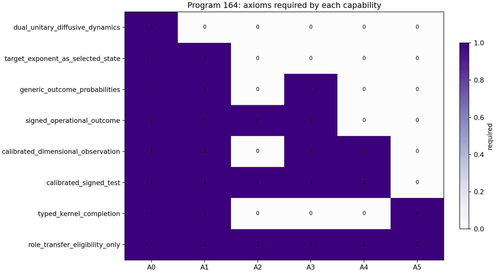

## 15.9 Independence theorem

**Theorem 164.2 [Proven].** No one of $A_1,\ldots,A_5$ follows from $A_0$.

**Proof.** Fix one conservative spectral Dirichlet generator.

1. Choose two different faithful central states: A1 varies.
2. Choose a symmetric-only or signed preparation set: A2 varies.
3. Choose two different instruments, or no instrument: A3 varies.
4. Rescale the conversion standards: A4 varies.
5. Choose no legacy-to-strict completion or a declared conditional
   completion: A5 varies.

All choices preserve the identical $A_0$. Therefore none is a function of
$A_0$ without extra naturality assumptions. ∎

**Corollary 164.3 [Proven].** A theorem with input only the bare generator
cannot uniquely output the selected state, signed preparation, instrument,
physical unit system, and FIN-specific completion map.

This is the obstruction to a single universal “missing theorem”.

## 15.10 Smallest useful axiomatic branches

The architecture should not always deploy all six axioms.

### Branch M — spectral mathematics

$$
\{A_0\}.
$$

This branch contains the spectral theorem, dual dynamics and Green family. It
is the strictest mathematical core.

### Branch S — selected dimensionless model

$$
\{A_0,A_1\}.
$$

With $A_{\rm ME}$, it yields $\eta=9/5$ conditionally.

### Branch O — generic operational physics

$$
\{A_0,A_1,A_3\}.
$$

This branch defines outcome probabilities but need not produce a signed
orientation.

### Branch SO — signed operational physics

$$
\{A_0,A_1,A_2,A_3\}.
$$

This branch supports orientation-sensitive preparations and records.

### Branch P — calibrated signed test

$$
\{A_0,A_1,A_2,A_3,A_4\}.
$$

This is the smallest branch able to compare a signed, dimensional prediction
with a calibrated experiment.

### Branch F — full conditional FIN

$$
\{A_0,A_1,A_2,A_3,A_4,A_5\}.
$$

This branch is eligible to begin a role-transfer audit. Eligibility is not
proof that any legacy physical role survives.

---

# 16. Cross-program falsification synthesis

## 16.1 Is one deeper object enough?

There is one deeper object for the operator constructions:

$$
\boxed{
\text{conservative spectral Dirichlet generator}
}
$$

It unifies:

- the spectral measure;
- wave evolution;
- diffusion;
- the Green family;
- Dirichlet energy;
- graph dynamics.

But it does not determine:

- which state is physically realized;
- which sign or branch is prepared;
- which measurement is performed;
- which dimensional scale is used;
- how legacy phase and damping complete to strict phase and compression;
- which physical interpretation is attached to a record.

The correct conclusion is therefore neither “everything is independent” nor
“everything is one shadow”. The repository contains a single operator core
surrounded by independent operational and conversion layers.

## 16.2 Does the mirror coupling solve the selector?

The reflection resource theory gives a precise answer.

A mirror/reflection operation introduces a $\mathbb Z_2$ action. If the
generator, state, preparation and instrument are all reflection-covariant,
then a reflection-odd expectation remains zero. The symmetry is represented,
not broken.

To break the symmetry one must add one of:

1. a signed preparation resource $M>0$;
2. a noncovariant instrument;
3. a nonzero inversion-odd source coupled to the orientation torsor;
4. an explicit boundary or initial condition selecting a branch.

Thus a mirror term can host the missing sign, but a symmetric mirror pair does
not select its own polarity. It corresponds to a missing theoretical object
only when its signed coupling or preparation is independently specified.

## 16.3 Can information generate units?

Shannon information and $\alpha_{\rm geo}=4\log2$ are dimensionless. Any map

$$
H\longmapsto S_{\rm phys}
$$

requires a dimensionful conversion such as

$$
S_{\rm phys}=k_*H.
$$

Similarly, a phase weight needs

$$
e^{iS_{\rm phys}/\hbar_*}.
$$

The scale-rescaling countermodel proves that $k_*$ and $\hbar_*$ cannot be
uniquely recovered from dimensionless spectral identities alone. They may be
axioms, measured constants, or outputs of a future scale-charged source
theorem. At present they are not strict outputs.

## 16.4 The “observer paradox”

The same generator supports

$$
U_t=e^{-itA}
$$

and

$$
P_t=e^{-tA}.
$$

There is no mathematical contradiction: both are Borel functions of $A$.
The apparent observer paradox begins only when one identifies one semigroup
with unobserved evolution and the other with observed reduction without
specifying an instrument.

A3 resolves the type error. The instrument, not $P_t$ alone, maps a state to
outcomes and post-measurement states. Diffusion may describe an environment,
coarse graining, imaginary-time propagation, or a classical stochastic
channel, but no one interpretation follows from functional calculus.

---

# 17. Final theorem and final answer

## 17.1 Axiomatic obstruction theorem

**Theorem 17.1 [Proven].** Within the category whose only input is a
conservative spectral Dirichlet generator, no unique construction can
simultaneously produce:

1. the target sector state;
2. a nonzero signed preparation;
3. an experimental instrument and record;
4. absolute physical dimensions;
5. a legacy-to-strict phase/compression completion.

**Proof.** The countermodels of Theorem 164.2 keep the input object fixed and
vary each requested output independently. A unique construction from the
input would have to assign the same output to all models with that input,
contradicting at least one variation. ∎

The obstruction is simultaneously:

- **state-theoretic** for the sector state;
- **resource-theoretic** for the signed preparation;
- **operational** for the instrument and record;
- **dimensional** for physical scales;
- **representation-theoretic** for the phase completion.

It is not merely algebraic.

## 17.2 Deepest surviving interpretation

After the attempted constructions and falsifications, the deepest
interpretation is:

> FIN is most coherently formulated as an axiomatic
> informational-spectral operational theory. Its strict mathematical core is
> a conservative spectral Dirichlet generator associated with the
> informational nadsoliton. The generator unifies Green response, graph
> energy, unitary propagation and diffusive propagation. A physical theory
> arises only after independent state, preparation, instrument and
> calibration structures are supplied. The legacy-to-strict completion is a
> further FIN-specific obligation. No current theorem collapses these layers
> into one unavoidable object.

The most promising new axiom is $A_{\rm ME}$ because it closes one clearly
identified problem with one equation and has a uniqueness proof. Its proper
status is **conditional**, and that status is a scientific strength rather
than a defect: the premise can now be attacked directly.

---

# 18. Recommended Programs 165–177

The next studies should test the axioms instead of adding them silently.

## Program 165 — Arb-certified oscillatory tail splitting

Replace absolute tail domination by residue-class or Fourier-mode
cancellation, use Arb/acb ball arithmetic, and certify the full
$[10^{-3},2\cdot10^{-2}]$ window.

**Probability of a materially tighter theorem:** 0.80.  
**Probability of a sub-$3\%$ theorem with local resources:** 0.45.

## Program 166 — Derive or falsify $A_{\rm ME}$ compositionally

Ask whether tensor additivity, independent composition of fibre systems,
real-character functoriality, and stability under coarse graining force

$$
\beta_F=\alpha_{\rm geo}/4.
$$

Construct counterexamples before seeking uniqueness.

**Probability of a useful classification/no-go:** 0.85.  
**Probability of strict derivation:** 0.20.

## Program 167 — Formal AFIS consistency and independence

Encode the finite-dimensional AFIS model and all removal countermodels in
Lean, Isabelle, or another proof assistant. Separate analytic Dirichlet-form
assumptions from finite matrix witnesses.

**Probability of formal completion:** 0.80.

## Program 168 — Effective all-scale irrationality measure

Search for an explicit theorem strong enough to establish
$D(\kappa,\nu)$ for $743/(4000\pi)$, then propagate its actual constants into
the Abelian remainder. Stop if constants are mathematically valid but
numerically useless.

**Probability of some effective bound:** 0.55.  
**Probability of a useful practical constant:** 0.15.

## Program 169 — Monoidal groupoid valuation theorem

Extend Program 153 from invariance to tensor products, induction,
restriction, and valuation additivity. Classify all compatible orbit masses.

**Probability of classification:** 0.80.  
**Probability of uniquely selecting uniform sector mass:** 0.25.

## Program 170 — Stability of the $A_{\rm ME}$ equilibrium

Perturb dimensions, energy gaps, degeneracies and $\beta_F$. Derive the
condition number of $\eta$ and determine whether $9/5$ is structurally stable
or fine-tuned.

**Probability of a complete perturbation theorem:** 0.95.

## Program 171 — Full reflection-resource theory

Use semidefinite programming and representation theory to classify
reflection-covariant channels on the full density space. Determine whether a
finite family of monotones replaces $M$.

**Probability of strong finite results:** 0.85.

## Program 172 — Nonasymptotic detector statistics

Add correlated noise, pixelization, censoring, estimated detector response
and finite-memory channels. Derive honest bootstrap or concentration
intervals and compare IQR with empirical characteristic-function estimators.

**Probability of an operationally useful procedure:** 0.85.

## Program 173 — Calibration-control experimental design

Construct the smallest set of known-input controls that makes the exponent
score transverse to the apparatus tangent space. Optimize measurement times
and allocation under a fixed record budget.

**Probability of an identifiability theorem:** 0.90.

## Program 174 — Composite adversarial preregistration

Replace the binary Program-150 rule with a preregistered comparison among
Gaussian, stable, tempered, truncated, correlated, and gain-confounded
families. Include model checking and abstention.

**Probability of reducing false FIN attribution:** 0.95.

## Program 175 — General categorical phase obstruction

Classify all equivariant maps among the legacy $\mathbb Z_8$ character, the
$\mathbb Z_{12}$ carrier and the strict infinite-order phase. Quantify the
minimal symmetry-breaking data required by a nonlinear completion.

**Probability of a general obstruction theorem:** 0.85.

## Program 176 — One explicit nonlinear completion candidate

Construct exactly one typed nonlinear map with independent amplitude,
compression and phase-source slots. Audit it against the six Program-162
edges. Stop at the first failed edge.

**Probability of a useful obstruction:** 0.80.  
**Probability of complete positive bridge:** 0.10.

## Program 177 — AFIS measurement model for double-slit records

Build a finite CP-instrument model with preparation, propagation,
environmental decoherence, detector resolution and persistent record.
Demonstrate exactly which interference and which diffusion statements follow
from $A_0$–$A_4$, without attributing collapse to $P_t$ alone.

**Probability of a rigorous conditional model:** 0.90.  
**Probability of strict physical validation without data:** 0.

## Priority

The recommended order is

$$
166\to170\to167\to173\to174\to172\to165
\to171\to175\to177\to169\to168\to176.
$$

The priority is intentionally axiom-first:

1. try to derive or falsify the most economical new axiom;
2. quantify its stability;
3. formalize independence;
4. repair experimental identifiability;
5. return to the expensive bridge only with a typed candidate.

---

# Reproducibility statement

The executable research file is:

`fin_programs_151_164_axiomatic_operational_foundations.py`

The machine-readable results are:

`FIN_Programs_151_164_Axiomatic_Operational_Results.json`

The extracted axiom system is:

`FIN_Programs_151_164_Minimal_Axiomatic_System.json`

Regression tests are:

`test_fin_programs_151_164_axiomatic_operational_foundations.py`

Fourteen figures are generated in:

`FIN_Programs_151_164_Axiomatic_Operational_Figures/`

The study uses no external physical data.

---

# Selected references

1. M. Reed and B. Simon, *Methods of Modern Mathematical Physics I:
   Functional Analysis*, Academic Press.
2. E. B. Davies, *Heat Kernels and Spectral Theory*, Cambridge University
   Press.
3. M. Fukushima, Y. Oshima and M. Takeda, *Dirichlet Forms and Symmetric
   Markov Processes*, de Gruyter.
4. O. Bratteli and D. W. Robinson, *Operator Algebras and Quantum Statistical
   Mechanics*, Springer.
5. M. Takesaki, *Theory of Operator Algebras I*, Springer.
6. L. Kuipers and H. Niederreiter, *Uniform Distribution of Sequences*,
   Wiley.
7. K. Sato, *Lévy Processes and Infinitely Divisible Distributions*,
   Cambridge University Press.
8. A. W. van der Vaart, *Asymptotic Statistics*, Cambridge University Press.
9. A. S. Holevo, *Probabilistic and Statistical Aspects of Quantum Theory*,
   North-Holland.
10. E. B. Davies and J. T. Lewis, “An operational approach to quantum
    probability,” *Communications in Mathematical Physics* 17 (1970).
11. F. G. Brandão and G. Gour, “Reversible framework for quantum resource
    theories,” *Physical Review Letters* 115 (2015).
12. S. Mac Lane, *Categories for the Working Mathematician*, Springer.

---

# Suggested citation

Żuchowski, K. (2026). *FIN Programs 151–164: Axiomatic Operational
Foundations, State Selection, and Falsifiable Measurement* (FIN Research
Monograph, Release 10.15; Version 1.0.0) [Preprint]. Zenodo.
