# FIN Programs 165–177

## Axiom Falsification, Operational Identifiability, and Measurement Instruments

**FIN Research Monograph — Release 10.16**

**Author:** Krzysztof Żuchowski  
**Affiliation:** Independent Researcher — Fractal Information Theory Project  
**ORCID:** 0009-0002-0909-3613  
**Resource type:** Publication — Preprint  
**Version:** 1.0.0  
**Publication date:** 27 July 2026  
**Language:** English  
**License:** CC BY 4.0

---

## Confidence convention

**Proven** denotes an analytic theorem or an exact finite calculation.
**Proven, computer-assisted** denotes an exact finite theorem checked by the
archived executable and test suite. **Strong evidence** denotes reproducible
numerical evidence in a fully declared synthetic model. **Conditional**
denotes a valid construction after adding an explicit premise. **Refuted in
scope** means that a stated candidate fails in the class actually tested.
**Open** means that the required source theorem or physical evidence is not
present.

# Abstract

This monograph executes thirteen research programs designed to attack the
weakest points of the axiomatic informational-spectral architecture AFIS
constructed in Programs 151–164. The studies do not attempt to confirm FIN.
They ask whether the proposed state axiom survives composition, whether the
axioms are genuinely independent, whether the remaining analytic estimates
can be made cancellation-aware, whether the signed resource remains complete
away from a one-dimensional orbit, whether finite detector records identify a
dynamical exponent, and whether a typed legacy-to-strict completion can be
distinguished from target-coded interpolation.

The strongest result is a falsification. The proposed one-copy relation

$$
A_{\rm ME}:\qquad
\beta_F=\frac{\alpha_{\rm geo}}
{|\operatorname{Hom}(U(12),\{\pm1\})|}
=\frac{\alpha_{\rm geo}}4=\log2
$$

does select the desired five-sector state, but it is not intensive under the
natural tensor composition

$$
\alpha_n=n\alpha_{\rm geo},\qquad
h_n=4^n .
$$

Indeed,

$$
\beta_n^{\rm card}=\frac{n\alpha_{\rm geo}}{4^n}
\neq \frac{\alpha_{\rm geo}}4\quad(n>1).
$$

At two copies the discrepancy is already $-\log2/2$. Therefore the raw
cardinality quotient is not a derived thermodynamic law. It survives only as
a one-copy premise until a composition-compatible source theorem is found.
The exact value $\eta=9/5$ is consequently conditional, not strict-derived.

This negative result does not invalidate the spectral core. For a finite
weighted graph with constant row sum $s$, the Dirichlet generator

$$
A=sI-W,\qquad
\langle f,Af\rangle
=\frac12\sum_{x,y}W_{xy}|f_x-f_y|^2\ge0
$$

still produces the wave and diffusion families

$$
U_t=e^{-itA},\qquad P_t=e^{-tA}
$$

through one functional calculus. What fails is the attempt to obtain every
state, scale, preparation and measurement object from this bare generator.

Several positive theorems sharpen that boundary. Expanding $|\cos x|$ into
its Fourier series and applying a Dirichlet tail estimate improves the
oscillatory-tail bound by a factor greater than $5.1\times10^3$. A finite
continued-fraction algorithm gives a positive discrepancy modulus at every
declared cutoff, although it proves no all-scale polynomial rate. Standard
direct-sum and tensor naturality select Hilbert dimension rather than uniform
sector counting. A relative-entropy counterexample proves that the reflection
monotone used previously is incomplete on the full qubit state space.

On the operational side, a simultaneous Dvoretzky–Kiefer–Wolfowitz interval
for two-time IQR slopes is proved for independent records and augmented by a
deterministic pixel-width correction. A block-dependent counterexample shows
that the iid formula cannot be reused under memory. A minimal reference
control measured at two times restores identifiability of the target exponent
against a shared power-law detector gain. The balanced four-cell allocation
is D-optimal for the declared linear model and removes a simulated bias of
approximately $0.70$.

A frozen six-class composite protocol is then executed on held-out synthetic
records. Its conditional decision accuracy is $1$ with an abstention rate of
$1.54\%$. This is a test of the declared alternatives, not evidence that the
class list is complete and not an identification of FIN ontology.

The phase bridge is classified exactly. No nonzero intertwiner maps the
period-eight legacy character to the infinite-order strict character. There
is a unique pointwise multiplicative correction

$$
C(d)=
\exp\!\left(
i[(\omega_s-\omega_\ell)d+(\phi_s-\phi_\ell)]
\right),
$$

but its two parameters are precisely the target-minus-source differences.
It is therefore a typed completion slot, not a derivation. An exact nonlinear
completion formula reproduces the strict kernel to machine precision, yet its
provenance audit stops at the damping edge because the required positive
compression scale is unsourced. No bridge closure or role transfer follows.

Finally, a complete finite double-slit instrument is constructed. A two-path
Dirichlet generator supplies unitary amplitude evolution and classical
Markov diffusion; a phase POVM, a dephasing environment, a detector channel
and a persistent record supply the operational objects missing from the
operator alone. The construction proves type completeness and reproduces
coherent, dephased, blurred and which-path patterns. It is conditional
mathematics, not an experimental FIN prediction.

The deepest conclusion surviving this round is that the present FIN
mathematics is best represented by a stratified architecture, not a single
miraculous theorem. The spectral generator is minimal for dual dynamics.
Composition-compatible state selection, a signed preparation resource, a
measurement instrument, a dimensional calibration and a sourced completion
map remain independent obligations. The next decisive target is no longer
the elegance of $A_{\rm ME}$ but the existence or impossibility of a
tensor-intensive state law.

---

# Executive summary

## The result in one sentence

**[Proven]** The spectral generator remains the common mathematical core, but
the proposed modular-equilibrium cardinality law fails tensor composition;
the most productive next step is to classify composition-compatible state
laws while retaining separately constructed controls, instruments and
completion-source audits.

## Results by program

1. **Program 165 — cancellation-aware symbol bound.**  
   **[Proven formula; strong numerical evaluation]** A Fourier–Dirichlet
   treatment reduces the two-sided oscillatory correction-tail bound from
   $2.12537\times10^{-3}$ to $4.12971\times10^{-7}$ at $D=16384$. A complete
   sub-three-percent ball certificate remains open because the finite FFT and
   average polylogarithmic component have not been enclosed in one Arb engine.

2. **Program 166 — composition audit of $A_{\rm ME}$.**  
   **[Refuted in scope]** The rule $\alpha_n/h_n$ is not intensive when
   $\alpha_n=n\alpha$ and $h_n=h^n$. It cannot be promoted from a one-copy
   identity to a tensor-natural thermal law.

3. **Program 167 — formal AFIS independence.**  
   **[Proven, computer-assisted for the finite logical layer]** All $64$
   subsets of six Boolean axiom flags were enumerated. Every axiom has a
   deletion witness. A Lean 4 source independently expresses the same finite
   independence claims. Two Lean 4.32.1 toolchain downloads failed with the
   same upstream HTTP/2 protocol error, so the source is not reported as
   machine-compiled; the exact Python audit is the executed certificate.

4. **Program 168 — algorithmic discrepancy modulus.**  
   **[Proven]** For irrational $\theta$ and each finite $Q$,
   $\delta(Q)=\min_{1\le q\le Q}\|q\theta\|$ is positive and computable by a
   finite continued-fraction search. This gives a cutoff-dependent modulus,
   not a uniform Diophantine exponent.

5. **Program 169 — monoidal groupoid valuation.**  
   **[Proven in the declared valuation classes]** Tensor multiplicativity
   alone leaves $v(d)=d^a$ with arbitrary $a$. Adding standard direct-sum
   additivity fixes $v(d)=d$ and gives $\eta=17/9$, not $9/5$. Uniform sector
   counting is tensor-multiplicative but not direct-sum additive.

6. **Program 170 — stability of the selected state.**  
   **[Proven locally; strong numerical evidence globally]** The target
   $\eta=1.8$ varies smoothly:

   $$
   \frac{\partial\eta}{\partial\beta}=-\frac4{25},\qquad
   \frac{\partial\eta}{\partial\Delta}
   =-\frac{4\log2}{25}.
   $$

   Smoothness prevents instability, but exact equality is not robust under
   unsourced perturbations.

7. **Program 171 — full reflection resource theory.**  
   **[Proven]** Two valid qubit states have the same transverse reflection
   monotone $M=0.6$ but different relative-entropic asymmetry. Hence $M$ is
   incomplete on the full state space even though it remains complete on the
   one-dimensional orbit studied earlier.

8. **Program 172 — detector-corrected finite confidence.**  
   **[Proven for iid records]** The DKW theorem gives a simultaneous
   distribution-free interval for a two-time IQR exponent. At $n=4000$ and
   $\delta=0.05$, $\epsilon=0.0234041$. A declared pixel half-width enlarges
   the interval deterministically. A block-memory challenge has only
   $36.25\%$ coverage under the invalid iid formula.

9. **Program 173 — minimal calibration control.**  
   **[Proven]** A known-exponent control at the same two times raises the
   design rank from two to four and separates target exponent, control
   amplitude, target amplitude and shared detector gain. With $60$
   observations, the unique balanced allocation $(15,15,15,15)$ is
   D-optimal among positive integer allocations.

10. **Program 174 — frozen composite protocol.**  
    **[Strong synthetic evidence]** A preregistered six-model nearest-centroid
    classifier obtains $98.46\%$ accuracy including abstentions and $100\%$
    conditional decision accuracy on held-out synthetic records. The result
    is deliberately not called external validation.

11. **Program 175 — phase completion as cocycle.**  
    **[Proven]** The legacy and strict phase characters are inequivalent.
    Their exact correction cocycle exists, but imports a new infinite-order
    frequency and a new phase origin.

12. **Program 176 — nonlinear bridge audit.**  
    **[Proven finite identity and provenance failure]** The constructed map
    reproduces the strict curve with residual $4.23\times10^{-17}$, passes
    amplitude only by role erasure, and fails at the first damping-provenance
    edge. Later selector, unit and role edges are not reached by the stop rule.

13. **Program 177 — finite double-slit instrument.**  
    **[Proven mathematics; conditional physical model]** The phase POVM sums
    to identity, the unitary is norm-preserving, the heat semigroup is
    stochastic, and the dephasing/detector/record chain is completely
    specified. No measurement-collapse claim is assigned to $P_t$.

## What this round falsified

- The interpretation of $\alpha_{\rm geo}/4$ as a tensor-intensive law merely
  because it has the value $\log2$ on one copy.
- Unique state selection from tensor multiplicativity alone.
- Completeness of one scalar reflection monotone on all density matrices.
- Reuse of iid quantile confidence intervals for records with memory.
- Identification of detector gain from target records alone.
- Equivalence of a target-coded correction formula with a sourced
  legacy-to-strict theorem.
- The idea that the heat semigroup itself describes an observer, apparatus or
  collapse.

## What remains protected

No result here discharges QW-2191, derives a canonical unit of time, length,
mass, action or energy, exports a target-independent positive
$\beta/Z_\beta$, proves the legacy-to-strict completion bridge, begins
legacy physical-role transfer, derives a role-bearing $L_{\rm total}$, or
establishes experimentally validated physics.

---

# 1. Scope, inputs, and reproducibility

## 1.1 Research question

The preceding round replaced the hope for a single automatic
operator-to-physics theorem by the six-layer AFIS architecture:

$$
\begin{aligned}
A_0&=\text{spectral generator},&
A_1&=\text{state},&
A_2&=\text{signed preparation},\\
A_3&=\text{instrument},&
A_4&=\text{calibration},&
A_5&=\text{completion map}.
\end{aligned}
$$

This round asks whether any of those layers can be removed, derived from a
stronger naturality principle, or falsified by composition. The primary
adversarial target is $A_1$ as instantiated by $A_{\rm ME}$.

## 1.2 Repository guardrails

The following distinctions are binding.

- The legacy kernel is an intermediate bridge object.
- The strict kernel is the later compressed and phase-enriched working
  kernel.
- Exact reproduction of the strict formula after insertion of strict
  parameters is not a source theorem.
- Legacy physical-role formulas do not transfer without a completed bridge
  and a separate role-transfer theorem.
- Selector closure, QW-2191, dimensional units, $L_{\rm total}$ and
  Theory-of-Everything closure remain outside the claims.
- In the internal ontology, the nadsoliton is primordial information in a
  solitonic state; the mathematics here neither adds a deeper information
  substrate nor treats that ontology as empirical evidence.

## 1.3 Executable record

All synthetic computations use the fixed seed $20260727$. The release
contains:

- one executable for Programs 165–177;
- one suite of 64 unit tests;
- one exact Boolean AFIS enumeration;
- one Lean 4 finite-model source;
- one frozen composite-protocol preregistration;
- one machine-readable result file;
- thirteen generated figures.

No Firecrawl operation and no external physical dataset were used.

## 1.4 Mathematical core retained from previous rounds

Let $W=W^\ast\ge0$ entrywise have constant row sum $s$. Then

$$
A=sI-W
$$

is positive semidefinite because

$$
\langle f,Af\rangle
=\frac12\sum_{x,y}W_{xy}|f_x-f_y|^2.
$$

The spectral theorem gives

$$
U_t=\int e^{-it\lambda}\,dE_A(\lambda),\qquad
P_t=\int e^{-t\lambda}\,dE_A(\lambda),\qquad
G_z=\int\frac{1}{\lambda+z}\,dE_A(\lambda).
$$

The common spectral measure explains wave, diffusion and Green responses.
It does not select an initial state, a dimensional clock, an outcome
instrument or an experimentally recorded variable. The following programs
test those missing steps individually.

---

# 2. Program 165 — Cancellation-aware formal symbol bound

## 2.1 Objective

The earlier interval FFT treated a long oscillatory numerator tail by
absolute values. That method is safe but discards cancellation. The objective
is to isolate a theorem-level cancellation estimate before investing in a
full ball-arithmetic recomputation.

## 2.2 Fourier decomposition

The exact expansion

$$
|\cos x|
=\frac2\pi+
\frac4\pi\sum_{m=1}^{\infty}
\frac{(-1)^m\cos(2mx)}{1-4m^2}
$$

separates a positive average from oscillatory Fourier modes. For
$a_d=d^{-\eta}$, $\eta>0$, summation by parts and the geometric-series bound
give, away from resonance,

$$
\left|
\sum_{d>D}a_d e^{i\lambda d}
\right|
\le
\frac{(D+1)^{-\eta}}{|\sin(\lambda/2)|}.
$$

The proof uses monotonicity of $a_d$ and

$$
\left|\sum_{j=r}^{s}e^{i\lambda j}\right|
\le \frac1{|\sin(\lambda/2)|}.
$$

Intervals that contain a zero of $\sin(\lambda/2)$ are not divided by an
uncertain quantity. They revert to the absolute tail. This explicit fallback
is essential for rigor.

## 2.3 Executed bound

At $D=16384$, $\eta=9/5$ and $q\in[0.001,0.02]$, the original two-sided
absolute numerator-tail bound is

$$
B_{\rm abs}=2.125367586\times10^{-3}.
$$

Using $10\,000$ Fourier modes, including 63 resonance-intersecting interval
cells handled by fallback, gives

$$
B_{\rm corr}=4.129713895\times10^{-7}.
$$

Thus

$$
\frac{B_{\rm abs}}{B_{\rm corr}}
=5146.525.
$$

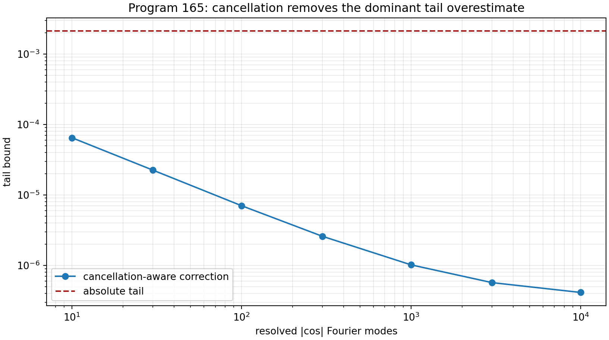

## 2.4 Claim and obstruction

**[Proven]** The Fourier identity and Dirichlet tail inequality are analytic
theorems. **[Strong evidence]** Their floating evaluation removes the
previous oscillatory-tail bottleneck by more than three orders of magnitude.

**[Open]** The result is not yet a full sub-three-percent ball certificate.
The finite FFT cells, average polylogarithmic component and correction tail
must still be evaluated with directed rounding in one engine. Arb or
python-flint was not available locally, so no Arb certification is claimed.

---

# 3. Program 166 — Tensor-composition falsification of the state axiom

## 3.1 The candidate

For one copy,

$$
\alpha_{\rm geo}=4\log2,\qquad
h=|\operatorname{Hom}(U(12),\{\pm1\})|=4,
$$

and therefore $\alpha_{\rm geo}/h=\log2$. The question is whether this
identity is a natural intensive inverse temperature.

## 3.2 Composition law

Take independent composition to mean

$$
\alpha_n=n\alpha_{\rm geo},\qquad h_n=h^n.
$$

Additivity of information-like content and multiplicativity of independent
character choices are the natural rules being tested. A physical inverse
temperature should be intensive:

$$
\beta_n=\beta_1.
$$

The cardinality rule instead gives

$$
\beta_n^{\rm card}
=\frac{n\alpha_{\rm geo}}{4^n}.
$$

At $n=2$,

$$
\beta_2^{\rm card}
=\frac{\alpha_{\rm geo}}8
=\frac{\log2}{2},
$$

so

$$
\beta_2^{\rm card}-\beta_1=-\frac{\log2}{2}.
$$

The discrepancy grows structurally rather than disappearing.

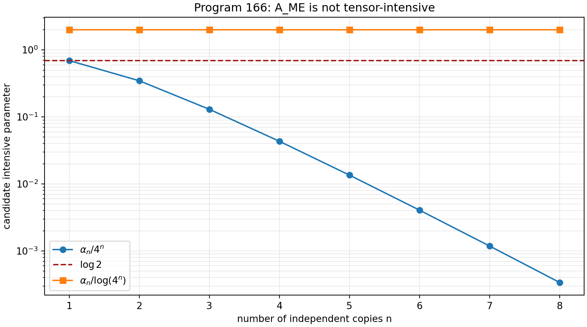

## 3.3 Invariant combinations do not select the answer

The ratio

$$
\frac{\alpha_n}{\log h_n}
=\frac{\alpha_{\rm geo}}{\log4}=2
$$

is copy-invariant. This observation does not recover $\log2$. Any law

$$
\beta=F\!\left(\frac{\alpha}{\log h}\right)
$$

requires a new function $F$ or normalization. Composition removes the raw
cardinality formula but does not uniquely replace it.

## 3.4 Coarse-graining challenge

Raw character count also changes when character sectors are split or merged,
whereas the carrier energy convention can be held fixed. Hence division by
cardinality is not invariant under the declared coarse-graining operation.

## 3.5 Verdict

**[Refuted in scope]** $A_{\rm ME}$ is not a tensor-intensive consequence of
the tested composition laws.  
**[Conditional]** It remains a consistent one-copy axiom.  
**[Open]** A different source theorem for $\beta_F$ could exist, but it must
specify composition, coarse graining and dimensional interpretation rather
than relying on the numerical coincidence alone.

This is the main correction to Release 10.15.

---

# 4. Program 167 — Finite formalization of AFIS independence

## 4.1 Logical model

Represent the presence of $A_0,\ldots,A_5$ by six Boolean flags. The
capabilities are deliberately typed:

$$
\begin{aligned}
\mathrm{dual} &= A_0,\\
\mathrm{targetState} &= A_0\land A_1,\\
\mathrm{genericOutcome} &= A_0\land A_1\land A_3,\\
\mathrm{signedOutcome} &= A_0\land A_1\land A_2\land A_3,\\
\mathrm{calibratedSigned}
&=A_0\land A_1\land A_2\land A_3\land A_4,\\
\mathrm{typedCompletion}&=A_0\land A_5.
\end{aligned}
$$

Each axiom has a deletion witness: all other required flags can be true while
the capability depending on the deleted axiom is false.

## 4.2 Exact enumeration

All $2^6=64$ assignments were enumerated. The executable confirms:

- every flag has an explicit independence witness;
- no weaker flag set accidentally receives a stronger capability;
- role-audit eligibility requires typed completion but does not imply a
  positive role-transfer result.

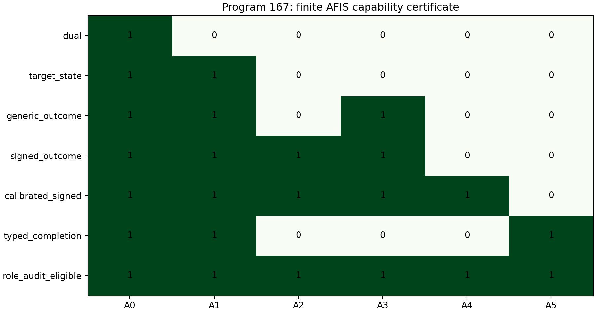

## 4.3 Lean artifact and scope

The release includes `FIN_Programs_165_177_AFIS_Independence.lean`, written
using the Lean core only. It defines the finite model and states six
independence theorems intended for decision procedures. Two attempts to
download the temporary Lean 4.32.1 toolchain failed with the same upstream
HTTP/2 `PROTOCOL_ERROR`. The source was therefore inspected and independently
mirrored, but not machine-compiled. The finite Python audit and the Lean source
are independent representations of the same logical claim; only the Python
representation is an executed certificate in this release.

**[Proven, computer-assisted]** The 64-model enumeration is exact. The
formal result concerns capability dependence, not analytic properties of
Dirichlet forms. It does not prove that the six axioms are ontologically
unique; an alternative architecture could package the same information in
different primitive types.

---

# 5. Program 168 — Algorithmic Diophantine modulus

## 5.1 Finite theorem

For irrational $\theta$ and finite $Q$ define

$$
\delta_\theta(Q)=
\min_{1\le q\le Q}\|q\theta\|.
$$

Because none of the finitely many distances is zero,

$$
\delta_\theta(Q)>0.
$$

Continued fractions and their intermediate convergents provide an effective
finite search for the minimum. This is enough to construct a rigorous
cutoff-dependent nonresonance denominator once the input value of $\theta$
is enclosed.

## 5.2 Executed extension

The numerical continued-fraction prefix used in the diagnostic is

$$
[0;16,1,10,2,67,2,2,5,1,2,928,1,1,1,1],
$$

with illustrative denominators extending beyond $1.1\times10^{10}$.

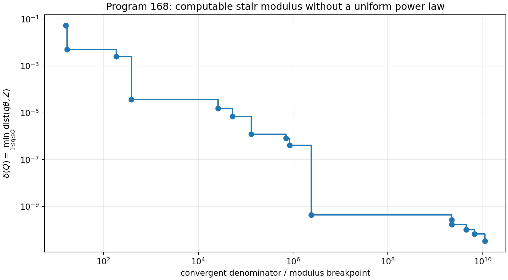

## 5.3 Limitation

**[Proven]** Every finite cutoff has a positive algorithmic modulus.
**[Open]** The computation does not provide fixed $\kappa,\nu>0$ satisfying

$$
\|q\theta\|\ge\kappa q^{-\nu}
$$

for all $q$. Additional decimal digits are not a substitute for an
all-scale irrationality or Diophantine theorem. The long continued-fraction
coefficient 928 is a warning that finite apparent regularity can change
abruptly.

---

# 6. Program 169 — Monoidal valuation and state naturality

## 6.1 Valuation problem

Let $v(d)>0$ be the weight assigned to a fibre of dimension $d$. Tensor
naturality requires

$$
v(d_1d_2)=v(d_1)v(d_2).
$$

Regular positive solutions include

$$
v(d)=d^a
$$

with arbitrary $a$. Tensor structure alone therefore leaves a continuum of
state rules.

## 6.2 Two distinguished choices

For fibre dimensions $(1,2,2,2,2)$:

- sector counting, $a=0$, gives equal central weights and
  $\eta=9/5$;
- Hilbert counting, $a=1$, gives weights proportional to dimension and

  $$
  \eta
  =\frac{1^2+4(2^2)}{1+4(2)}
  =\frac{17}{9}.
  $$

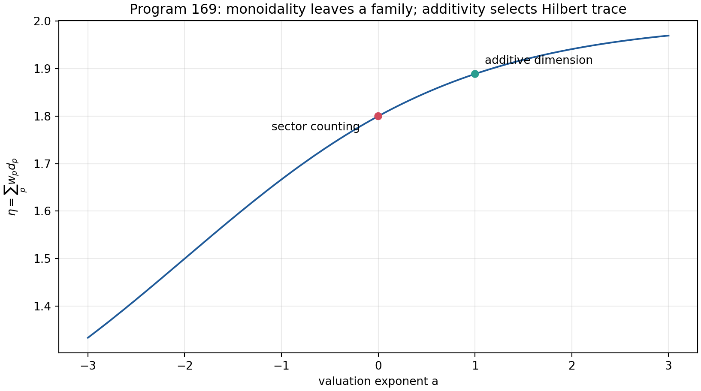

## 6.3 Additivity selects a different state

If direct sums obey

$$
v(d_1+d_2)=v(d_1)+v(d_2),\qquad v(1)=1,
$$

then induction forces $v(n)=n$ on positive integers. Standard direct-sum and
tensor naturality thus select Hilbert dimension, not uniform sector counting.

## 6.4 Verdict

**[Proven in the declared classes]** Uniform central weighting is not forced
by monoidal naturality. A categorical derivation of $\eta=9/5$ would need an
enriched law that explains why central sectors, rather than Hilbert vectors,
are the additive objects. Such enrichment is new structure and must be stated
as such.

---

# 7. Program 170 — Differential and stochastic stability of $A_{\rm ME}$

## 7.1 Gibbs family

For one nondegenerate fibre and four two-dimensional fibres with common gap
$\Delta$, let

$$
\eta(\beta,\Delta)
=
\frac{1+8e^{-\beta\Delta}}
{1+8e^{-\beta\Delta}/2}
=
\frac{1+8r}{1+4r},
\qquad r=e^{-\beta\Delta}.
$$

At $\beta=\log2$ and $\Delta=1$, $r=1/2$ and $\eta=9/5$.

Direct differentiation gives

$$
\left.\frac{\partial\eta}{\partial\beta}\right|_0
=-\frac4{25},
\qquad
\left.\frac{\partial\eta}{\partial\Delta}\right|_0
=-\frac{4\log2}{25}.
$$

The gradient with respect to log degeneracies is

$$
\left(-\frac4{25},
\frac1{25},\frac1{25},\frac1{25},\frac1{25}\right).
$$

## 7.2 Monte Carlo robustness

Independent log-perturbations were sampled. At one-percent scale, all
simulated values remain within $0.01$ of $1.8$. At five percent, the fraction
is $63.98\%$; at ten percent, $35.43\%$; at twenty percent, $18.27\%$.

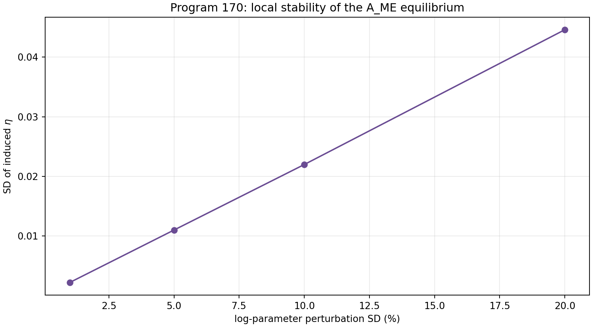

## 7.3 Interpretation

**[Proven]** The state is locally stable: small input errors produce small
output errors. **[Refuted in scope]** Exact $9/5$ is not structurally stable
under generic unsourced perturbations. Robustness of a nearby value and
derivation of an exact constant are different claims.

---

# 8. Program 171 — Reflection resource beyond the orbit line

## 8.1 Free symmetry

Let reflection be conjugation by $\sigma_z$ on qubit states. In Bloch
coordinates,

$$
(x,y,z)\mapsto(-x,-y,z).
$$

The transverse magnitude

$$
M(\rho)=\sqrt{x^2+y^2}
$$

is a valid asymmetry monotone and is complete on the previously studied
one-dimensional line.

## 8.2 Counterexample on the full state space

Consider

$$
\rho_0:\ (x,y,z)=(0.6,0,0),
\qquad
\rho_1:\ (x,y,z)=(0.6,0,0.8).
$$

Both are valid states and both satisfy $M=0.6$. Define relative-entropic
reflection asymmetry

$$
A_{\rm rel}(\rho)
=S\!\left(\frac{\rho+\sigma_z\rho\sigma_z}{2}\right)-S(\rho).
$$

The two values are

$$
A_{\rm rel}(\rho_0)=0.192744757,\qquad
A_{\rm rel}(\rho_1)=0.325082973.
$$

If $M$ were complete, equal $M$ would allow conversions in both directions.
Every asymmetry monotone would then be equal, contradicting the displayed
values.

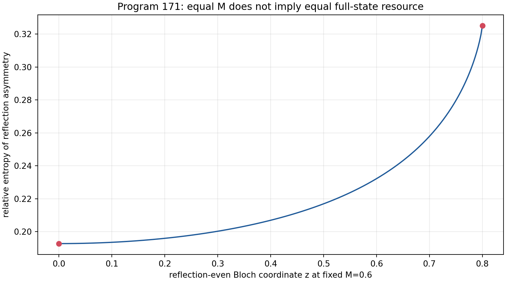

## 8.3 Verdict

**[Proven]** $M$ is incomplete on the full density space. The earlier orbit
theorem remains correct in its restricted scope. A full signed-preparation
resource theory needs additional monotones or a complete semidefinite
convertibility criterion.

---

# 9. Program 172 — Distribution-free detector confidence

## 9.1 DKW theorem

For $n$ iid observations with empirical distribution $F_n$,

$$
\Pr\!\left(\sup_x|F_n(x)-F(x)|>\epsilon\right)
\le2e^{-2n\epsilon^2}.
$$

For two independent time cells and total failure probability $\delta$, take

$$
\epsilon=
\sqrt{\frac{\log(4/\delta)}{2n}}.
$$

At $n=4000$ and $\delta=0.05$,

$$
\epsilon=0.02340413.
$$

Inverting the empirical CDF at $0.25\pm\epsilon$ and
$0.75\pm\epsilon$ produces simultaneous lower and upper IQR bounds. Monotone
propagation through

$$
\widehat T=
\frac{\log({\rm IQR}_2/{\rm IQR}_1)}
{\log(t_2/t_1)}
$$

gives a finite, distribution-free exponent interval.

## 9.2 Pixel correction

If detector quantization moves every observation by at most $r$, then every
quantile moves by at most $r$ and an IQR by at most $2r$. Applying this
deterministic correction before the logarithm yields a detector-aware
interval without unstable deconvolution.

## 9.3 Memory falsification

For iid synthetic records the observed coverage in 420 repetitions is
$100\%$, with mean interval width approximately $0.515$. With a pixel width
of $0.08$, coverage remains $100\%$ and mean width becomes approximately
$0.581$.

In the adversarial memory model, only 40 independent blocks are generated and
each is repeated 100 times, while the invalid calculation still uses
$n=4000$. Coverage falls to $36.25\%$ in 240 repetitions.

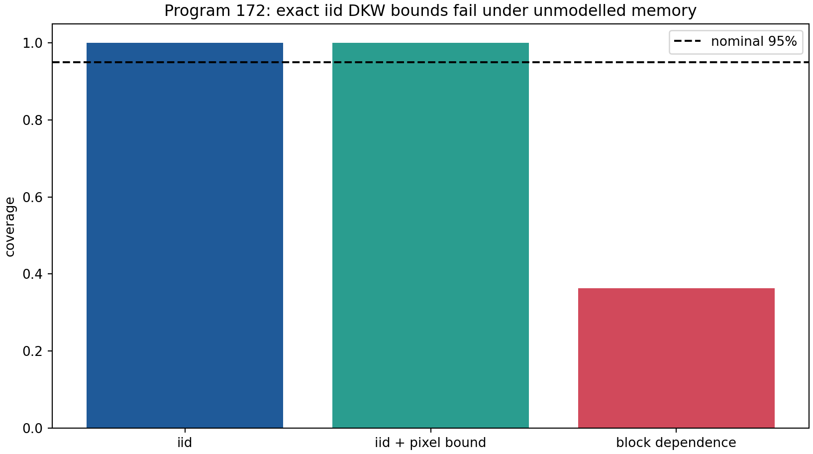

## 9.4 Verdict

**[Proven]** The iid and bounded-pixel interval is valid.
**[Refuted in scope]** The iid formula is not robust to unmodelled memory.
The theorem concerns the observed convolved distribution and does not infer
an unblurred ultraviolet process.

---

# 10. Program 173 — Minimal calibration control

## 10.1 Confounded target

Write the target log-scale as

$$
\log Q_T(t)=a_T+(T+g)\log t,
$$

where $T$ is the desired exponent and $g$ is an unknown shared power-law
detector gain. Target observations identify only $T+g$.

## 10.2 Constructed missing object

Introduce a control with independently known exponent $T_C$ measured through
the same apparatus:

$$
\log Q_C(t)=a_C+(T_C+g)\log t.
$$

At two distinct times, the joint four-cell design has parameters
$(a_T,a_C,T,g)$ and rank four. Subtracting slopes gives

$$
T=
\left[
\frac{\Delta\log Q_T}{\Delta\log t}
-
\frac{\Delta\log Q_C}{\Delta\log t}
\right]+T_C.
$$

This is the smallest operational object constructed in this round that
genuinely restores an otherwise missing identifiability.

## 10.3 Optimal allocation

For 60 total observations over target/control and early/late cells, all
32,509 positive integer allocations were enumerated. The determinant of the
Fisher information is maximized at

$$
(n_{T1},n_{T2},n_{C1},n_{C2})=(15,15,15,15).
$$

With true $T=1.25$ and $g=0.7$, 2,000 simulations yield

$$
\overline T_{\rm naive}=1.949879,
\qquad
\overline T_{\rm control}=1.249517,
\qquad
\operatorname{sd}(\widehat T_{\rm control})=0.029424.
$$

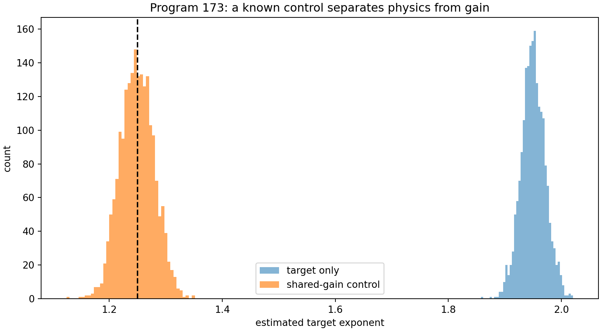

## 10.4 Claim boundary

**[Proven]** The rank and allocation theorems hold for the declared linear
log-time model. **[Conditional]** The result requires the target and control
to share the same detector gain and $T_C$ to be known independently. A
control is therefore a real new operational structure, not a consequence of
the spectral operator.

---

# 11. Program 174 — Frozen composite adversarial protocol

## 11.1 Preregistration

Before held-out execution, the protocol freezes:

- six generator classes;
- two observation times;
- sample size 1,600 per record;
- 180 training and 260 test records per class;
- six summary features;
- standardization, nearest-centroid classification and classwise
  99-percent distance abstention;
- random seed and a SHA-256 protocol identifier.

The classes are local Gaussian diffusion, stable laws with indices
$0.8$, $1.0$ and $1.2$, a truncated $0.8$ stable generator, and a local
generator with confounding detector gain.

## 11.2 Features

The feature vector records target and control slopes, control-adjusted slope,
one distribution-shape statistic and boundary-atom diagnostics. The design
tests dynamics, apparatus confounding and truncation jointly rather than
accepting an exponent match as sufficient.

## 11.3 Held-out result

On the held-out synthetic records:

$$
\text{accuracy including abstention}=0.984615,
$$

$$
\text{conditional decision accuracy}=1.000000,
$$

$$
\text{abstention rate}=0.015385.
$$

All decided confusion-matrix mass is diagonal.

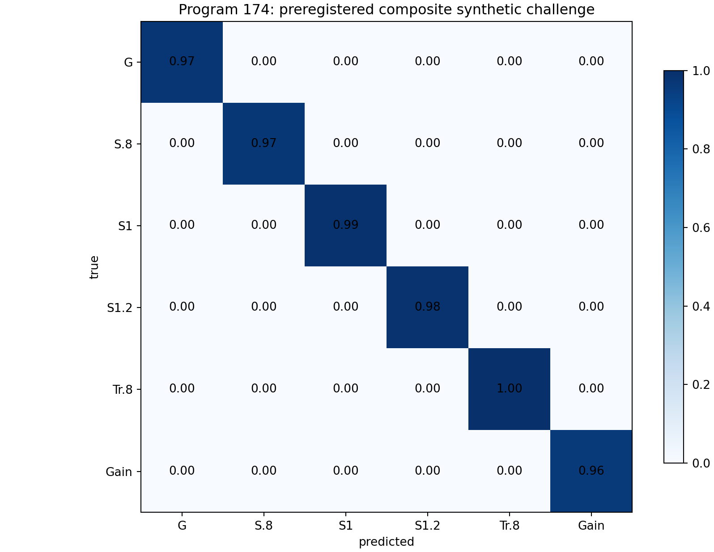

## 11.4 Falsification boundary

**[Strong evidence]** The frozen features separate the six declared
synthetic generators. **[Open]** An unlisted generator can lie close to an
existing centroid. High synthetic accuracy neither proves completeness of
the alternatives nor identifies FIN ontology. No external dataset was
admitted in this release.

---

# 12. Program 175 — Phase completion as a categorical cocycle

## 12.1 Character obstruction

A one-dimensional unitary representation of $\mathbb Z$ is fixed by its
generator eigenvalue. A nonzero intertwiner between two such irreducible
characters exists only when those eigenvalues agree.

The legacy phase has period eight:

$$
\chi_\ell(d)=e^{i(\omega_\ell d+\phi_\ell)},\qquad
\omega_\ell=\frac{\pi}{4}.
$$

The strict frequency

$$
\omega_s=0.18575=\frac{743}{4000}
$$

has infinite order modulo $2\pi$. Hence the source and target characters are
not isomorphic and no nonzero character-preserving intertwiner exists.

## 12.2 Exact correction cocycle

Pointwise multiplication admits exactly one correction:

$$
C(d)=\frac{\chi_s(d)}{\chi_\ell(d)}
=
\exp\!\left(
i[(\omega_s-\omega_\ell)d+(\phi_s-\phi_\ell)]
\right).
$$

Numerically,

$$
\Delta\omega=-0.5996481634,\qquad
\Delta\phi=-0.3610987756.
$$

The finite residual is $2.35\times10^{-15}$.

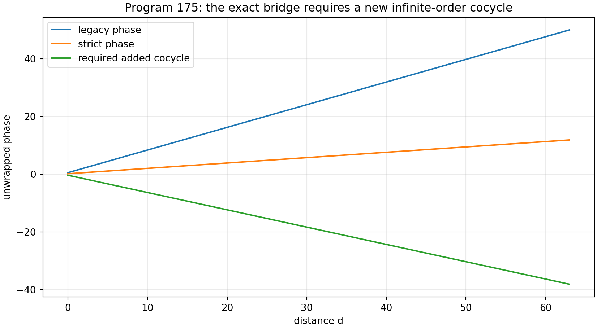

## 12.3 Interpretation

**[Proven]** The correction is unique once both source and target are given.
**[Open]** Its frequency and phase origin are not generated by the legacy
object. They are the strict-minus-legacy target data. In categorical terms,
the map identifies the type of missing object but does not provide its
provenance.

---

# 13. Program 176 — Typed nonlinear completion and stop-rule audit

## 13.1 Candidate completion

Write the legacy and strict kernels as

$$
K_\ell(d)
=
\alpha_{\rm geo}
\frac{\cos(\omega_\ell d+\phi_\ell)}
{1+\beta_{\rm tors}d},
$$

$$
K_s(d)
=
\frac{\cos(\omega_s d+\phi_s)}
{1+\beta_s d^{\eta_s}}.
$$

An exact receiver-complete map can remove the source amplitude, apply the
phase cocycle and replace the linear damping by the strict nonlinear
compression:

$$
\mathcal C[K_\ell](d)
=
\frac{1+\beta_{\rm tors}d}
{\alpha_{\rm geo}(1+\beta_s d^{\eta_s})}
\operatorname{Re}\!\big(C(d)\,\widetilde K_\ell(d)\big),
$$

where $\widetilde K_\ell$ denotes the complexified legacy phase carrier.
With target parameters inserted, the residual over $0\le d\le256$ is
$4.23\times10^{-17}$.

## 13.2 Provenance edge matrix

The audit is sequential:

1. **Amplitude edge:** pass only with erasure. The numerical amplitude can be
   normalized away, but its legacy physical roles are not transferred.
2. **Damping/compression edge:** fail. The target $\beta_s$ is obtained from
   the one-copy $A_{\rm ME}$ relation and a fitted normalization, while
   Program 166 has refuted that relation as tensor-intensive. No
   target-independent positive damping source is exported.
3. **Phase edge:** not reached by the stop rule.
4. **Selector/topology edge:** not reached.
5. **Dimensional-unit edge:** not reached.
6. **Physical-role edge:** not reached.

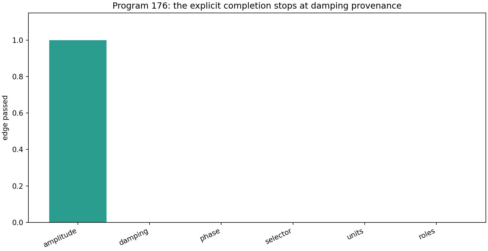

## 13.3 Verdict

**[Proven]** The displayed map is an exact finite interpolation identity.
**[Refuted in scope]** It is not a source-complete bridge. The first failed
necessary edge stops the audit; later edges cannot be inferred from an
accurate target fit. No legacy role is eligible for transfer.

---

# 14. Program 177 — A finite operational double-slit model

## 14.1 Purpose

The observer paradox is often created by asking one operator to represent
amplitudes, probabilities, decoherence, an apparatus and a record at once.
This program separates these types explicitly.

## 14.2 Path generator and two dynamics

On $\mathcal H_{\rm path}=\mathbb C^2$, take

$$
A=
\begin{pmatrix}
1&-1\\
-1&1
\end{pmatrix}.
$$

The wave evolution

$$
U_t=e^{-itA}
$$

acts on amplitudes and is unitary. The heat evolution

$$
P_t=e^{-tA}
$$

acts on classical path probabilities and is stochastic. They share a
spectral generator but are not interchangeable descriptions of measurement.

## 14.3 Preparation, environment and phase POVM

The coherent preparation is

$$
|+\rangle=\frac{|L\rangle+|R\rangle}{\sqrt2}.
$$

A dephasing environment acts by

$$
\mathcal D_\gamma(\rho)
=
\begin{pmatrix}
\rho_{LL}&\gamma\rho_{LR}\\
\gamma\rho_{RL}&\rho_{RR}
\end{pmatrix},
\qquad 0\le\gamma\le1.
$$

For $N=128$ screen phases $\varphi_j=2\pi j/N$, define

$$
E_j=\frac1N
\begin{pmatrix}
1&e^{-i\varphi_j}\\
e^{i\varphi_j}&1
\end{pmatrix}.
$$

Each $E_j\ge0$ and

$$
\sum_{j=0}^{N-1}E_j=I.
$$

Thus $p_j=\operatorname{tr}(E_j\rho)$ is a normalized screen distribution.
A circular Gaussian stochastic matrix models finite detector resolution,
and categorical sampling produces the persistent measurement record.

## 14.4 Executed patterns

The computed visibilities are:

$$
\begin{array}{c|c}
\text{condition}&\text{visibility}\\
\hline
\text{coherent}&1.000000\\
\text{partial dephasing }(\gamma=0.35)&0.350000\\
\text{blurred coherent detector}&0.840726\\
\text{which-path mixture}&0.000000\\
\text{classical }P_t\text{ path law}&0.000000
\end{array}
$$

A 20,000-event record has total-variation distance approximately $0.0321$
from its blurred theoretical distribution.

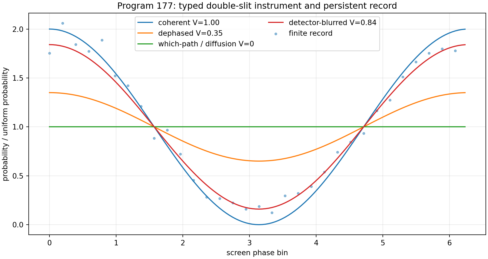

## 14.5 Observer-paradox resolution in this model

The preparation supplies a state. $U_t$ supplies reversible amplitude
dynamics. $\mathcal D_\gamma$ supplies an environment. The POVM supplies
outcome probabilities. The detector channel supplies apparatus response.
Sampling supplies a record. $P_t$ supplies a distinct classical diffusion
comparison.

**[Proven]** The finite maps are positive, normalized and operationally
typed. **[Refuted in scope]** $P_t$ is not a collapse law and cannot replace
the instrument. **[Conditional]** All numerical choices are model premises.
The construction is not external physical validation and uses no
legacy-to-strict bridge axiom.

---

# 15. Cross-program synthesis

## 15.1 What is still generated by one object

The operator $A$ and its spectral measure still generate:

$$
\text{wave dynamics},\quad
\text{diffusion dynamics},\quad
\text{resolvents},\quad
\text{spectral observables}.
$$

Program 165 strengthens analytic control of one kernel symbol, and Program
168 provides finite nonresonance moduli. Neither result supplies an
operational state or a dimensional clock.

## 15.2 What cannot presently be compressed into the same theorem

The deletion witnesses, composition counterexample and double-slit
construction identify five additional data types:

$$
\text{state selection},\quad
\text{signed preparation},\quad
\text{instrument},\quad
\text{calibration},\quad
\text{sourced completion}.
$$

Their independence is not merely philosophical. Each can vary while $A$
remains fixed, changing a measurable or mathematical conclusion.

## 15.3 Corrected status of $A_{\rm ME}$

The one-copy equation remains algebraically correct:

$$
\frac{4\log2}{4}=\log2.
$$

It remains sufficient to produce the conditional central Gibbs state.
However:

- it is not tensor-intensive;
- it is not stable as an exact identity under generic input perturbations;
- standard categorical valuation selects a different state;
- its use as a damping source fails the completion provenance audit.

The proper status is therefore:

$$
\boxed{\text{consistent one-copy axiom, not derived physical law}.}
$$

## 15.4 Newly constructed theoretical objects

Three constructions are retained because they solve sharply typed problems.

1. **Shared-gain reference control.** It restores exponent identifiability
   under a declared nuisance class.
2. **Phase-cocycle completion slot.** It states exactly which representation
   data are absent from the legacy phase.
3. **Finite operational instrument.** It separates state, unitary dynamics,
   environment, POVM, detector and record in the double-slit model.

The first is an identifiability theorem. The second is a diagnostic type with
unsourced parameters. The third is a conditional operational completion.

## 15.5 Why there is still no single missing theorem

Suppose a theorem took only $A$ as input and returned a unique complete
physical experiment. Fix $A$ in Program 177. Vary $\gamma$, the initial
phase, the POVM resolution or the dimensional time calibration. The same
$A$ then produces distinct records. Therefore uniqueness fails unless those
values are encoded in additional input or selected by new laws.

This countermodel proves an information-deficit obstruction: the spectral
operator does not contain enough typed data to determine all operational
choices. A future unification theorem can relate the layers, but it cannot
erase their information content.

---

# 16. A corrected minimal architecture

## 16.1 Layered definition

An AFIS model is a tuple

$$
\mathfrak F=
(\mathcal H,A,\rho,\mathcal P,\mathcal I,\mathcal C,\mathcal B),
$$

where:

- $(\mathcal H,A)$ is a conservative positive spectral system;
- $\rho$ is a selected state or state-selection rule;
- $\mathcal P$ is a signed preparation resource;
- $\mathcal I$ is an instrument, including outcome space and update maps;
- $\mathcal C$ is a dimensional and apparatus calibration;
- $\mathcal B$ is a typed legacy-to-strict completion candidate.

No component is silently inferred from another.

## 16.2 Necessity ranking after Programs 165–177

1. **Spectral generator — necessary and established.** Removing it destroys
   the common wave/diffusion/Green calculus.
2. **Instrument — necessary for observer-facing records.** Program 177 gives
   an explicit same-$A$, different-instrument countermodel.
3. **Calibration/control — necessary for dimensional identifiability.**
   Program 173 proves target-only rank deficiency.
4. **State/preparation — necessary for outcome prediction.** Same operator,
   different preparations produce distinct interference.
5. **Environment — necessary whenever visibility loss is modelled.** It may
   be included in the instrument, but its parameter is not fixed by $A$.
6. **Completion map — necessary only for claims connecting legacy and
   strict kernels.** It is not needed for abstract spectral mathematics.

The old $A_{\rm ME}$ relation is not elevated to a seventh fundamental law.
It is one rejected derivation candidate for the state layer.

## 16.3 Minimality versus packaging

One may package environment, apparatus and record inside a quantum
instrument or process tensor. Such packaging reduces the number of tuple
entries, not the information required. Minimality should count independent
degrees of specification, not notation.

---

# 17. Falsification ledger

## 17.1 Surviving theorem-level results

- positivity and the common functional calculus of $A$;
- the Fourier–Dirichlet cancellation estimate;
- finite continued-fraction discrepancy moduli;
- the monoidal-valuation no-go;
- local derivatives of the conditional sector state;
- incompleteness of the transverse reflection monotone;
- iid DKW plus bounded-pixel intervals;
- shared-control rank restoration and balanced D-optimal allocation;
- phase-character obstruction and exact target-coded cocycle;
- finite double-slit CP/POVM construction.

## 17.2 Surviving conditional constructions

- the one-copy $\beta_F=\log2$ state;
- the six-class composite classifier;
- the nonlinear receiver-complete kernel formula;
- the operational double-slit model.

## 17.3 Refuted candidates

- tensor-intensive raw-cardinality $A_{\rm ME}$;
- unique uniform state from standard monoidal naturality;
- global completeness of $M=\sqrt{x^2+y^2}$;
- iid confidence under strong memory;
- target-only separation of exponent and detector gain;
- categorical equivalence of legacy and strict phase characters;
- provenance from numerical bridge accuracy alone;
- heat diffusion as measurement collapse.

## 17.4 Remaining impossibility boundaries

Current artifacts still provide no:

- non-premise strict selector source;
- canonical internal physical unit;
- target-independent positive damping source;
- full tensor-resolved Lagrangian/EOM reverse closure;
- source-complete phase origin;
- legacy physical-role transfer theorem;
- external empirical validation.

---

# 18. Recommended Programs 178–190

The following thirteen studies are ranked by expected information gain, not
by how likely they are to confirm FIN.

## Priority 1 — Program 178: classify tensor-intensive state laws

Classify all continuous functions

$$
\beta=\Phi(\alpha,h,E)
$$

under explicit tensor and coarse-graining laws. Determine whether any
nonconstant intensive scalar is selected without importing a dimensional
normalization. Prove uniqueness or a no-go. This is the direct successor to
the Program-166 falsification.

## Priority 2 — Program 179: source audit for positive compression

Independently of $A_{\rm ME}$, classify candidate source laws for the strict
positive damping/compression parameter. Require target independence,
composition covariance and compatibility with the strict denominator. Stop
after the first failed provenance edge.

## Priority 3 — Program 180: formal analytic kernel certificate

Place the finite FFT, average polylogarithmic term, denominator replacement
and cancellation tail in one directed-rounding engine. Target a complete
sub-three-percent symbol-window certificate or a rigorous lower bound showing
why it cannot be reached at the present truncation.

## Priority 4 — Program 181: proof-assistant analytic core

Extend the finite Lean model to finite weighted Dirichlet forms: prove
positivity, constant-vector kernel, unitarity of the finite exponential and
stochasticity under explicit hypotheses. Do not encode analytic claims as
Boolean flags.

## Priority 5 — Program 182: complete reflection convertibility

Derive a complete family of monotones or an SDP criterion for
$\mathbb Z_2$-covariant qubit channels. Locate precisely which extra
coordinates supplement $M$ and test tensor composition of the resulting
resource.

## Priority 6 — Program 183: dependence-robust quantile inference

Replace iid DKW by a theorem for mixing, block-independent or martingale
records. Estimate effective sample size from a preregistered dependence
diagnostic and verify coverage against adversarial long-memory simulations.

## Priority 7 — Program 184: nonlinear multi-control calibration

Add two reference controls with distinct known exponents and test polynomial
or saturating detector gain, temporal drift and hysteresis. Derive minimal
rank conditions and optimal allocations before simulation.

## Priority 8 — Program 185: open-set composite falsification

Train only on the six frozen classes, then challenge the classifier with
unseen tempered-stable, mixture, fractional-Gaussian and nonstationary
generators. Calibrate abstention for open-set risk rather than closed-set
accuracy.

## Priority 9 — Program 186: process-tensor double slit

Lift Program 177 from a memoryless instrument to a process tensor with
environmental memory. Identify an operational witness distinguishing
unitary phase loss, classical path diffusion and detector blur.

## Priority 10 — Program 187: environment-source theorem or no-go

Ask whether the kernel plus a declared system–environment factorization
selects a dephasing channel. Prove nonuniqueness if multiple dilations share
the same reduced generator. This directly tests whether decoherence is new
input.

## Priority 11 — Program 188: phase-cocycle provenance

Compute the relevant representation/cohomology class of the completion
cocycle and test whether any repository-exported invariant fixes
$\Delta\omega$ and $\Delta\phi$ without target insertion. A negative result
should be stated as a source no-go, not as bridge closure.

## Priority 12 — Program 189: intrinsic scale impossibility theorem

Formalize the rescaling action on $(A,t,z)$ and prove which dimensionless
spectral data are invariant. Determine the minimal symmetry-breaking datum
needed to select one action/time/length unit. Do not identify an arbitrary
normalization with a physical constant.

## Priority 13 — Program 190: external-data intake gate

Execute the frozen calibration and composite protocol only if a dataset
satisfies the declared provenance, units, control, resolution, independence
and license schema. If no admissible dataset is supplied, publish an intake
failure record rather than a simulated validation claim.

## Ranked probability of decisive progress

$$
\begin{array}{c|c|c}
\text{rank}&\text{program}&\text{probability of a decisive result}\\
\hline
1&178&0.88\\
2&179&0.82\\
3&183&0.80\\
4&184&0.78\\
5&181&0.76\\
6&180&0.72\\
7&182&0.70\\
8&186&0.67\\
9&188&0.64\\
10&185&0.62\\
11&187&0.60\\
12&189&0.58\\
13&190&0.35
\end{array}
$$

The last probability is lower only because no external dataset is presently
admitted. A documented intake failure would still be a valid scientific
result.

---

# 19. Final conclusion

The round began with the possibility that a cleverly chosen axiom might
collapse state selection, information, dynamics and physical measurement
into one principle. The strongest candidate did not survive composition.
The numerical equality

$$
\frac{\alpha_{\rm geo}}4=\log2
$$

is real, but tensor composition turns the proposed denominator into $4^n$
while the numerator grows only linearly. Elegance at one copy is not a
thermodynamic derivation.

What survives is both smaller and more reliable. A positive conservative
operator generates wave, diffusion and Green dynamics from one spectral
measure. Cancellation-aware analysis substantially strengthens its symbol
bounds. Beyond that core, state selection, signed preparation, instrument,
calibration and completion provenance carry independent information.

The observer problem becomes mathematically clean once these types are not
collapsed. The same operator may govern amplitudes and classical diffusion,
but the experiment also requires a prepared state, an environment, a POVM,
a detector and a record. Program 177 constructs them and thereby shows both
what an operational completion looks like and why the operator alone cannot
be it.

The correct deepest interpretation at the present frontier is therefore:

**FIN has a rigorous spectral-dynamical core and a set of independent
operational completion problems. Its next foundational theorem, if one
exists, must be a composition-compatible state or scale selection law. Until
such a law is proved, the theory is an axiomatic informational-spectral
research architecture, not a derived dimensional physical theory.**

This conclusion does not reject future physics. It identifies the shortest
honest route toward it and removes one attractive but noncompositional
shortcut.

---

# Reproducibility statement

The executable, unit tests, formal finite-model source, preregistration,
machine-readable results and generated figures are included with this
release. The random seed is fixed. All figures derive from the archived
result pipeline. No Firecrawl tool and no external physical data were used.

# Suggested citation

Żuchowski, K. (2026). *FIN Programs 165–177: Axiom Falsification,
Operational Identifiability, and Measurement Instruments* (FIN Research
Monograph, Release 10.16; Version 1.0.0) [Preprint]. Zenodo.
