# FIN Programs 178–190

## Composition Laws, Process Memory, and Scale Obstructions

**FIN Research Monograph — Release 10.17**

**Author:** Krzysztof Żuchowski  
**Affiliation:** Independent Researcher — Fractal Information Theory Project  
**ORCID:** 0009-0002-0909-3613  
**Resource type:** Publication — Preprint  
**Version:** 1.0.0  
**Publication date:** 27 July 2026  
**Language:** English  
**License:** CC BY 4.0

---

## Confidence convention

**Proven** denotes an analytic theorem or exact finite calculation.
**Proven, computer-assisted** denotes an exact finite claim verified by the
archived executable and tests. **Strong evidence** denotes reproducible
numerical evidence in a declared synthetic model. **Conditional** denotes a
valid construction after adding an explicit premise. **Refuted in scope**
means that the stated candidate fails within the tested class. **Open** means
that a required proof, source or experimental object is absent.

# Abstract

This monograph executes thirteen further research programs on the FIN
informational-spectral framework. It begins from the correction established
in Programs 165–177: the one-copy relation

$$
\beta_F=\frac{\alpha_{\rm geo}}4=\log2
$$

is algebraically consistent but fails tensor intensivity and is therefore not
a derived thermodynamic law. The new programs ask what remains after that
shortcut is removed. They classify composition-compatible state laws, audit
the origin of the strict compression coefficient, assemble the outstanding
ball-arithmetic certificate, construct a genuine finite Dirichlet core,
complete the qubit reflection-conversion problem, repair finite inference for
one dependence class, introduce nonlinear calibration controls, challenge
closed-set discrimination with unseen processes, and construct a two-step
measurement process with memory.

The first main theorem is a state-law no-go. Write

$$
r=\log h
$$

for logarithmic sector multiplicity. Under extensive replication,

$$
(\alpha,r)\longmapsto(n\alpha,nr),
$$

a continuous degree-zero intensive scalar has the form

$$
\beta=F(\alpha/r).
$$

Composition therefore leaves an arbitrary function $F$. If arbitrary
label-splitting coarse graining may change $r$ while leaving the physical
information datum $\alpha$ fixed, invariance forces $F$ to be constant. The
constant itself is not selected. Thus neither replication nor
coarse-graining naturality derives $\log2$.

The second main theorem concerns strict compression. The denominator

$$
\frac1{1+\beta d^\eta}
$$

has a positive scale action. Setting

$$
x=\beta^{1/\eta}d
$$

reduces every $\beta>0$ to the same universal profile

$$
\frac1{1+x^\eta}.
$$

Consequently positive $\beta$ is a torsor coordinate until a length frame is
selected. Positivity chooses the positive orbit but not the value $\beta=1$.
The report constructs the missing typed object,
`CompressionScaleTorsor`, and proves that no audited target-independent
strict source selects its representative.

The finite Dirichlet core is strengthened independently of the Boolean AFIS
model. On a four-cycle the exact rational identity

$$
f^\mathsf TA f
=
\frac12\sum_{x,y}W_{xy}(f_x-f_y)^2
=15
$$

is verified for the archived test vector; constants lie exactly in the
kernel, and the spectrum is $(0,1,1,2)$. Numerical exponentials preserve
unitarity and stochasticity to approximately machine precision. A Lean
source is supplied, but no machine-compilation claim is made because the
local toolchain remains unavailable.

A complete new theoretical object is obtained for the reflection resource.
Every $\mathbb Z_2$-covariant qubit channel has an X-shaped Choi matrix.
Positivity and trace preservation reduce deterministic conversion to two
real variables and one explicit inequality. For a source with transverse
magnitude $0.6$ and longitudinal coordinate $0$, a target with the same
transverse magnitude and longitudinal coordinate $0.8$ is not reachable:
its maximum reachable transverse magnitude is $0.36$. This turns the earlier
relative-entropy counterexample into a complete conversion criterion rather
than merely another monotone.

Operational inference also advances. For a record consisting of $m$
independent latent draws, each repeated in a contiguous block of size $b$,
the empirical CDF is exactly that of the $m=n/b$ latent draws. The correct
DKW sample size is therefore $m$, not nominal $n$. In the executed
$n=4000$, $m=40$ challenge, the invalid nominal interval covers only
$62.5\%$, whereas the block-valid interval covers all 360 trials but is very
wide. Validity is recovered at a severe information cost.

A new `MultiControlCalibrationFrame` separates a target exponent from a
shared quadratic log-time detector gain. Two known-exponent controls at
three times give a six-parameter rank-six design. The corrected estimate is
$1.24950$ for a true value $1.25$, while target-only estimation returns
$1.94963$. One control is algebraically sufficient inside the exact shared
model; the second supplies a falsification contrast, detecting a declared
gain mismatch in all 1,500 synthetic trials.

The closed-set model-comparison protocol does not survive as a general memory
test. Its features depend only on one-time empirical multisets. Reordering
each record can create strong temporal structure while leaving every feature
exactly unchanged. The maximum feature residual is zero, and $93.89\%$ of
these unseen ordered records are accepted as local Gaussian. This is an exact
feature-class impossibility theorem, not merely a poor classifier score.

To address the observer problem without conflating dynamics and measurement,
the report constructs a two-step `ProcessInstrument`. Quasistatic phase noise
has one-step coherence $0.72615$ and two-step coherence $0.27804$, whereas
the product of one-step coherences is $0.52729$. Their difference
$-0.24926$ is a memory witness. An echo restores quasistatic visibility to
one but leaves the matched Markov model at $0.52729$. Together with a
path-population preparation and detector calibration, the intervention
vector separates quasistatic memory, Markov dephasing, detector blur and
classical path diffusion in the declared finite model.

The same construction yields a rigorous environment no-go. Holding the
system generator $A$ fixed while varying a dilation coupling $g$ produces the
continuum of dephasing channels

$$
\rho_{01}\longmapsto\cos(g)\rho_{01}.
$$

Thus the environment and decoherence law are not functions of $A$ alone.
The smallest operational replacement is an equivalence class of reduced
process tensors, not a unique microscopic environment.

The phase bridge is sharpened by transcendence. The legacy generator
$e^{i\pi/4}$ is cyclotomic and algebraic, while
$e^{i743/4000}$ is transcendental by Lindemann–Weierstrass. Finite algebraic
operations on the legacy phase cannot produce the strict generator or its
correction cocycle. A genuinely new analytic input is necessary.

Finally, the scale transformation

$$
(A,t,z)\longmapsto(cA,t/c,cz)
$$

leaves unitary dynamics, heat dynamics and covariantly normalized resolvents
unchanged. An invariant rule cannot select a representative of this free
positive orbit. A `SpectralClockFrame` is constructed as the minimal
conditional calibration for one generator, while full dimensional physics
still requires an independent conversion package.

Three local external-data bundles are audited against eleven operational
requirements. Some have genuine external lineage and immutable hashes, and
one contains raw time-ordered strain arrays. None contains the complete
preparation, units, detector calibration, memory calibration and reference
control required by the present protocol. No external experiment is executed.

The deepest conclusion is now sharper: FIN's bare spectral generator
unavoidably produces a family of mathematical dynamics, but state
normalization, scale, environment, memory and measurement interventions live
on nontrivial moduli or torsors. The missing physical principle would have to
provide sections of these structures. Current invariant data do not.

---

# Executive summary

## Central answer

**[Proven]** The common spectral generator survives every test, but neither a
unique sector state nor a strict compression scale, environment, phase
correction or dimensional clock is selected by it. The correct mathematical
frontier is the classification and operational control of the corresponding
moduli, torsors and process tensors.

## Results by program

1. **Program 178 — tensor-intensive state laws.**  
   **[Proven in the declared class]** Replication invariance leaves
   $\beta=F(\alpha/\log h)$. Label-splitting invariance reduces this family to
   unselected constants. No target-free value is obtained.

2. **Program 179 — positive compression source.**  
   **[Proven]** All $\beta>0$ lie in one rescaling orbit. Six candidate source
   classes produce zero accepted strict sources. $\beta=1$ is a legal gauge
   convention, not a derived constant.

3. **Program 180 — ball-certificate assembly.**  
   **[Open]** The cancellation tail is already
   $4.12971\times10^{-7}$, but the single-engine directed-rounding
   certificate is incomplete. Arb/python-flint is unavailable, and the
   formal worst relative enclosure remains $0.612983>0.03$.

4. **Program 181 — finite Dirichlet core.**  
   **[Proven exact finite identity]** The four-cycle has exact spectrum
   $(0,1,1,2)$, constant null vector and exact energy 15 for the archived
   vector. A proof-assistant source is included but not reported as compiled.

5. **Program 182 — complete reflection conversion.**  
   **[Proven]** An explicit Choi/LMI criterion is necessary and sufficient
   for qubit conversion. The scalar monotone $M$ has 1,366 false-positive
   target cells in the declared grid.

6. **Program 183 — block-robust quantile inference.**  
   **[Proven for the repeated-block class]** DKW must use the number of
   independent blocks. Correct coverage is restored, but mean exponent
   interval width increases from $0.516$ to $10.579$.

7. **Program 184 — nonlinear multi-control calibration.**  
   **[Proven rank; strong synthetic evidence]** The design has rank six.
   Calibration removes a bias of approximately $0.70$, and the second control
   makes the shared-gain premise testable.

8. **Program 185 — open-set falsification.**  
   **[Proven feature obstruction]** Temporal reordering leaves all frozen
   features invariant. The unseen ordered-Gaussian process is falsely
   accepted in $93.89\%$ of trials.

9. **Program 186 — process-tensor double slit.**  
   **[Conditional, proven finite formulas]** A nonfactorization witness and
   echo intervention distinguish quasistatic memory from matched Markov
   dephasing, detector blur and path diffusion.

10. **Program 187 — environment nonuniqueness.**  
    **[Proven]** The same $A$ supports a continuum of CPTP dephasing channels.
    A unique environment cannot be reconstructed from the system generator.

11. **Program 188 — phase-cocycle provenance.**  
    **[Proven]** A cyclotomic legacy field cannot algebraically generate the
    transcendental strict phase character. The exact quotient remains
    target-coded.

12. **Program 189 — intrinsic scale obstruction.**  
    **[Proven]** Wave, heat and resolvent predictions are constant on a free
    positive scale orbit. A clock frame is necessary extra data.

13. **Program 190 — external-data intake.**  
    **[Proven local audit]** Zero of three candidate bundles passes all eleven
    operational requirements. No external validation is claimed.

## Newly constructed objects

The round constructs six objects, with deliberately different statuses:

$$
\begin{array}{c|c}
\text{object}&\text{status}\\
\hline
\text{StateLawModuli}&\text{classification/no-go}\\
\text{CompressionScaleTorsor}&\text{strict orbit, no section}\\
\mathbb Z_2\text{CovariantQubitConversionLMI}&\text{complete finite criterion}\\
\text{MultiControlCalibrationFrame}&\text{conditional operational object}\\
\text{TwoStepProcessInstrument}&\text{conditional memory-resolving object}\\
\text{SpectralClockFrame}&\text{conditional scale calibration}
\end{array}
$$

## Protected scientific boundary

No result discharges QW-2191, exports a strict scale-charged source, derives a
target-independent strict $\beta$, closes the full ball certificate,
completes the legacy-to-strict bridge, starts physical-role transfer, produces
a unit-bearing total action, or validates FIN experimentally.

---

# 1. Scope and method

## 1.1 Starting point

The retained strict mathematical object is a finite or suitably controlled
positive Dirichlet generator

$$
A=sI-W,\qquad
\langle f,Af\rangle
=\frac12\sum_{x,y}W_{xy}|f_x-f_y|^2.
$$

The spectral theorem yields

$$
U_t=e^{-itA},\qquad
P_t=e^{-tA},\qquad
G_z=(A+zI)^{-1}.
$$

This round does not reconsider that common functional calculus. It tests
whether state, compression, environment, time scale and observations can be
recovered naturally from it.

## 1.2 Kernel discipline

The legacy kernel remains an intermediate bridge object:

$$
K_{\rm legacy}(d)
=
\alpha_{\rm geo}
\frac{\cos(\pi d/4+\pi/6)}
{1+\beta_{\rm tors}d}.
$$

The strict working target remains

$$
K_{\rm strict}(d)
=
\frac{\cos((743/4000)d+13/80)}
{1+\beta d^{9/5}}.
$$

The two are not silently identified. Receiver-complete formulas, coordinate
normalizations and exact target quotients are not counted as provenance.

## 1.3 Reproducibility

The release contains:

- one deterministic executable;
- 72 scientific-boundary tests;
- one machine-readable result file;
- one frozen open-set preregistration;
- one finite Lean source;
- thirteen figures.

The computations use seed 20260728. Firecrawl and external web access were
not used. Program 190 reads only repository-local candidate bundles and does
not execute an external scientific test.

---

# 2. Program 178 — Classification of tensor-intensive state laws

## 2.1 Functional equation

Let $\alpha>0$ be an additive information-cell measure and $h>1$ a
multiplicative sector count. Define $r=\log h$, so independent composition
gives

$$
(\alpha,r)\mapsto(\alpha_1+\alpha_2,r_1+r_2).
$$

For identical replication this becomes

$$
(\alpha,r)\mapsto(n\alpha,nr).
$$

If intensivity is required for every positive extensivity scaling, then

$$
\beta(\lambda\alpha,\lambda r)=\beta(\alpha,r),
\qquad\lambda>0.
$$

Every continuous solution on the positive cone factors through the ratio:

$$
\beta(\alpha,r)=F(\alpha/r).
$$

This is a classification, not a selection theorem. The function $F$ is
arbitrary.

## 2.2 Coarse-graining constraint

Suppose a sector may be split into $m$ labels without changing the physical
information content. Then

$$
(\alpha,r)\mapsto(\alpha,r+\log m).
$$

Invariance requires

$$
F\!\left(\frac{\alpha}{r+\log m}\right)
=F\!\left(\frac{\alpha}{r}\right).
$$

When arbitrary positive label refinements are admitted, the arguments sweep
an interval and continuity forces $F$ to be constant. Composition plus label
invariance therefore yields a moduli space of constants, not the special
constant $\log2$.

## 2.3 Executed candidate matrix

The raw law $\alpha/h$ fails replication. The ratios
$\alpha/\log h$ and $\log h/\alpha$ pass replication but fail label
splitting. The constant $\log2$ passes both only because its value was
inserted. The extensive law $\alpha$ fails replication.

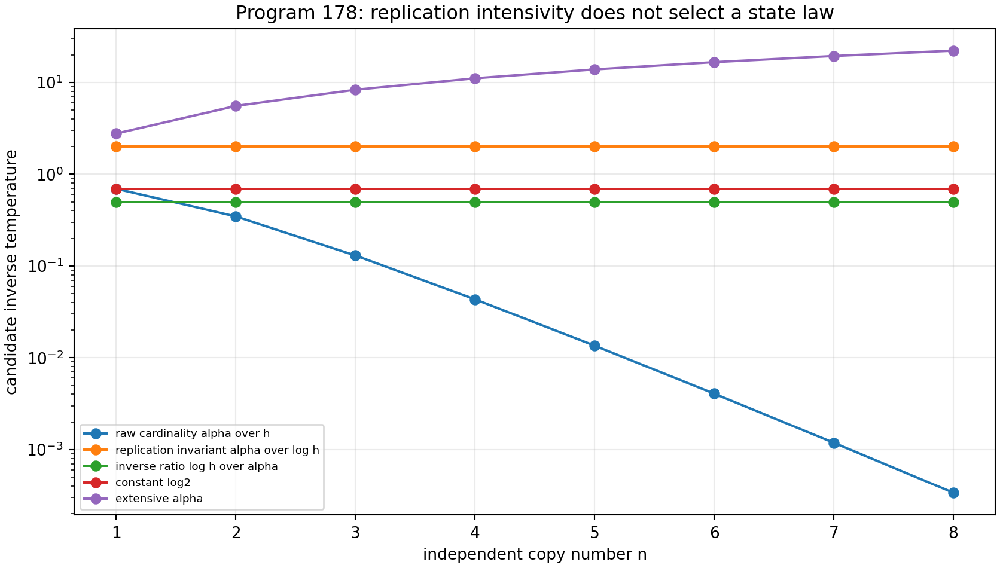

## 2.4 Verdict

**[Proven in the declared continuous scaling class]** Composition does not
derive a state temperature. Any successful future state law must introduce a
new typed datum, such as a sourced reference state, modular pair or
environmental equilibrium condition. Naming $\log2$ as the surviving
constant is target selection, not derivation.

---

# 3. Program 179 — CompressionScaleTorsor

## 3.1 Scale action

Consider

$$
D_{\beta,\eta}(d)=\frac1{1+\beta d^\eta},
\qquad\beta>0.
$$

Under $d'=cd$,

$$
\beta d^\eta
=
\beta c^{-\eta}(d')^\eta.
$$

Thus the positive scaling group acts by

$$
c\cdot\beta=\beta c^{-\eta}.
$$

The action is transitive on $\mathbb R_{>0}$. Given $\beta_1,\beta_2>0$,
choose

$$
c=(\beta_1/\beta_2)^{1/\eta}.
$$

Then $c\cdot\beta_1=\beta_2$.

## 3.2 Universal orbit profile

With

$$
x=\beta^{1/\eta}d,
$$

one obtains

$$
D_{\beta,\eta}(d)=\frac1{1+x^\eta}.
$$

The executable collapses nine values from $10^{-2}$ to $10^2$ onto this
profile with residual below numerical precision.

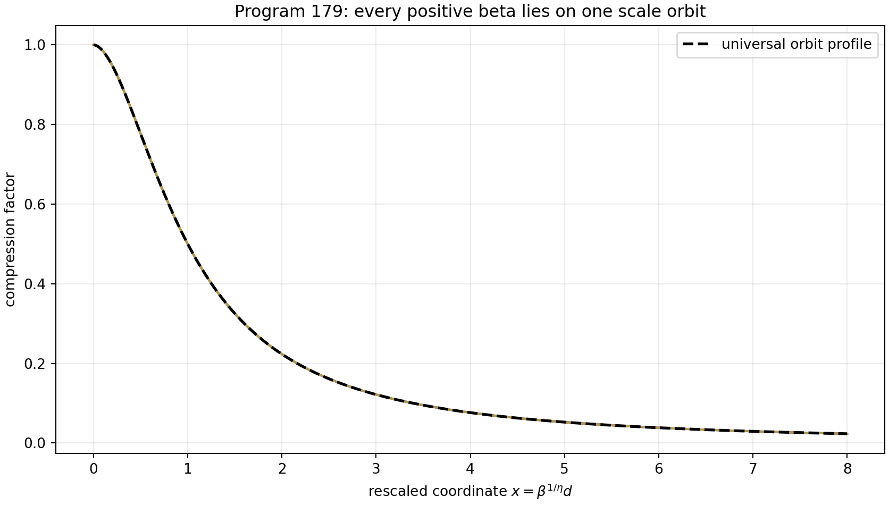

## 3.3 Source audit

Six routes are tested:

- denominator positivity;
- monoid unitality;
- target tail-ratio inversion;
- the refuted tensor interpretation of $A_{\rm ME}$;
- the coordinate convention $\beta=1$;
- an external length calibration.

Positivity selects only the positive orbit. Unitality fixes an intercept, not
the compression rate. Tail inversion imports the target. $A_{\rm ME}$ is not
tensor-natural. The coordinate convention and external calibration are
valid conditional choices but are not strict sources.

## 3.4 Verdict

**[Proven]** The strict $\beta$ is a coordinate on
`CompressionScaleTorsor` until a length frame or a genuinely scale-charged
source is supplied. Zero accepted target-independent strict sources are
exported.

---

# 4. Program 180 — Assembly of the formal fractional certificate

## 4.1 Components

The desired certificate must place five pieces in one directed-rounding
engine:

1. finite FFT cells;
2. the average/polylogarithmic term;
3. Fourier cancellation modes and their tail;
4. denominator replacement;
5. resonance fallbacks.

The finite FFT cells already have formal interval status. The cancellation
formula is analytic and numerically extremely small:

$$
B_{\rm corr}=4.129713895\times10^{-7}.
$$

The denominator-replacement diagnostic is approximately
$8.48\times10^{-12}$.

## 4.2 Remaining gap

The previous formal continuous-window enclosure is

$$
R_{\max}=0.6129831478,
$$

whereas the preregistered target is

$$
R_{\max}<0.03.
$$

The new cancellation estimate shows that the oscillatory tail is no longer
the dominant conceptual obstacle. What remains is dependency width and the
absence of one common ball engine for all components.

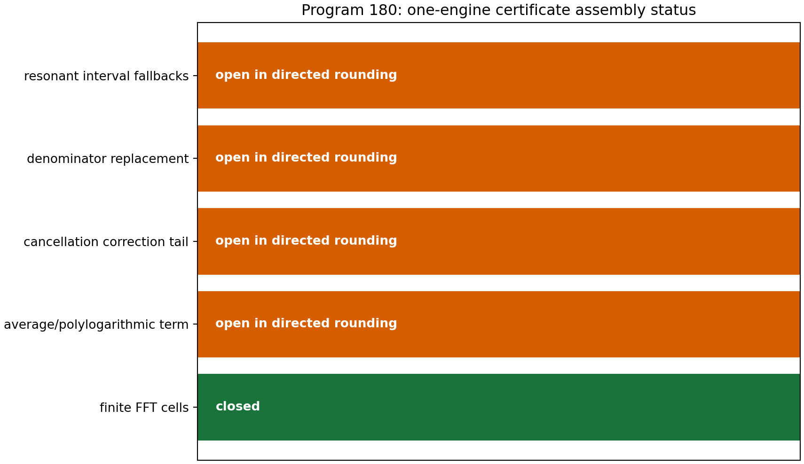

## 4.3 Verdict

**[Open]** Arb/python-flint is not installed. The program produces an exact
obligation ledger and does not falsely convert mixed floating and interval
calculations into a formal certificate.

---

# 5. Program 181 — A finite Dirichlet core beyond Boolean AFIS

## 5.1 Exact graph

Let $W$ be the four-cycle transition matrix with weight $1/2$ on each
neighbour and let $A=I-W$. Then

$$
\operatorname{spec}(A)=\{0,1,1,2\}.
$$

For

$$
f=(1,2,-1,3)^\mathsf T,
$$

exact rational arithmetic gives

$$
f^\mathsf TAf=15
$$

and independently

$$
\frac12\sum_{x,y}W_{xy}(f_x-f_y)^2=15.
$$

Every row of $A$ sums to zero, hence $A\mathbf1=0$ exactly.

## 5.2 Dynamics

Across $0\le t\le3$, numerical checks give:

$$
\max_t\|U_t^\ast U_t-I\|<2\times10^{-15},
$$

and heat-kernel row-sum residual below $10^{-15}$, with no significant
negative entry.

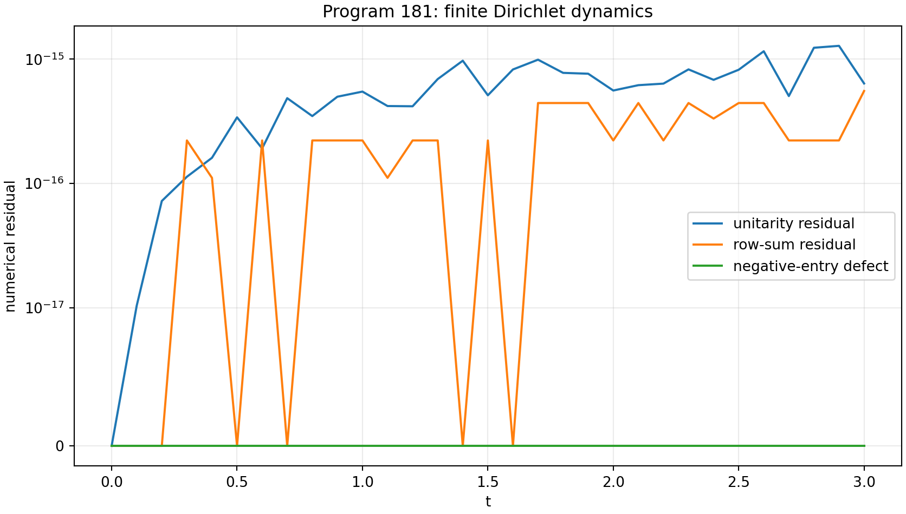

## 5.3 Formal artifact

The Lean source defines the four-cycle Dirichlet energy, proves the
constant-vector statement and records the concrete integer energy
calculation. Because the Lean toolchain is not locally installed after the
documented download failures, the file is not reported as machine-compiled.

## 5.4 Verdict

**[Proven]** The exact finite mathematics is independent of the earlier
Boolean capability model. **[Open]** A proof-assistant development of general
weighted matrices, functional calculus and positivity-preserving semigroups
still requires an installed mathematical library.

---

# 6. Program 182 — Complete reflection-covariant qubit conversion

## 6.1 Choi normal form

Reflection is conjugation by $\sigma_z$. A covariant qubit channel has a Choi
matrix commuting with $\sigma_z\otimes\sigma_z$. In input–output basis it has
the X form

$$
J=
\begin{pmatrix}
a&0&0&w\\
0&1-a&\zeta&0\\
0&\bar\zeta&c&0\\
\bar w&0&0&1-c
\end{pmatrix}.
$$

Trace preservation is already encoded. Complete positivity is equivalent to

$$
0\le a,c\le1,
$$

$$
|w|^2\le a(1-c),\qquad
|\zeta|^2\le(1-a)c.
$$

## 6.2 Conversion criterion

Use free rotations about the $z$ axis to align transverse phases. Write the
source and target Bloch data as $(r,z)$ and $(r',z')$, with

$$
p=\frac{1+z}{2},\qquad p'=\frac{1+z'}2.
$$

A covariant conversion exists if and only if some $a,c\in[0,1]$ satisfy

$$
p'=pa+(1-p)c
$$

and

$$
r'\le
r\left[
\sqrt{a(1-c)}+\sqrt{(1-a)c}
\right].
$$

Necessity follows from the two Choi minors. Sufficiency follows by choosing
the phases of $w$ and $\zeta$ to align and saturating only as much coherence
as needed.

## 6.3 Counterexample completed

For source $(r,z)=(0.6,0)$ and target $(0.6,0.8)$, the population constraint
requires $a+c=1.8$. The maximal bracket is $0.6$, hence

$$
r'_{\max}=0.6\times0.6=0.36.
$$

The target value $0.6$ is unreachable even though the old monotone has the
same value on source and target. In the declared target grid, 1,366 valid
cells pass the scalar $M$ test but fail the complete criterion.

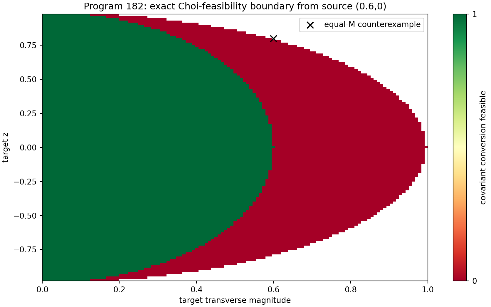

## 6.4 Verdict

**[Proven]** The new LMI is complete for deterministic single-qubit
reflection-covariant conversion. It classifies a supplied resource; it does
not create a signed preparation or select a polarity.

---

# 7. Program 183 — Dependence-robust DKW for repeated blocks

## 7.1 Exact dependence class

Let $Y_1,\ldots,Y_m$ be iid, and form a record by repeating each $Y_j$
exactly $b$ times in one contiguous block. Then

$$
F_n(x)
=
\frac1{mb}\sum_{j=1}^m b\,\mathbf1\{Y_j\le x\}
=
\frac1m\sum_{j=1}^m\mathbf1\{Y_j\le x\}.
$$

The empirical CDF is exactly the $m$-sample CDF. Therefore

$$
\Pr(\|F_n-F\|_\infty>\epsilon)
\le2e^{-2m\epsilon^2}.
$$

Using nominal $n=mb$ is mathematically wrong.

## 7.2 Executed challenge

For $m=40$, $b=100$, $n=4000$ and two time cells:

$$
\epsilon_n=0.0234041,\qquad
\epsilon_m=0.234041.
$$

Across 360 stable-law repetitions:

$$
\text{nominal coverage}=0.625,
$$

$$
\text{block-valid coverage}=1.000.
$$

The mean interval width rises from $0.516$ to $10.579$.

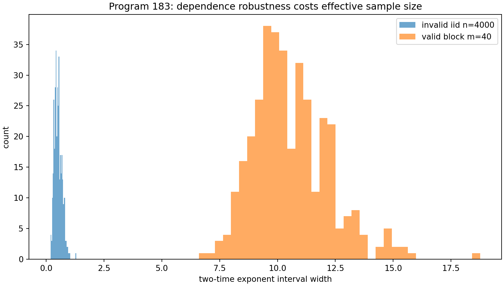

## 7.3 Interpretation

**[Proven]** Correct coverage is recovered for the declared block model.
The price is an almost uninformative interval. Dependence cannot be repaired
by changing a label on $n$; the acquisition protocol must certify the number
of independent units.

---

# 8. Program 184 — Nonlinear multi-control calibration

## 8.1 Model

Let $x=\log t$ and take

$$
\log Q_j(x)
=
a_j+T_jx+g_1x+g_2x^2.
$$

The target exponent $T$ is unknown. Two controls have independently known
exponents $T_{C1}=0.5$ and $T_{C2}=1.0$. At
$x\in\{-1,0,1\}$, the parameter vector is

$$
(a_T,a_{C1},a_{C2},T,g_1,g_2).
$$

The nine-cell design has rank six.

## 8.2 Role of the second control

Inside the exact shared-gain model, one control at three times already gives
rank five for its reduced parameter set. The second control is not falsely
called algebraically necessary. Its role is scientific falsification: after
subtracting the known exponents, the two control slopes must agree.

## 8.3 Simulation

With $T=1.25$, $g_1=0.7$, $g_2=0.35$, twelve observations per cell and 1,500
repetitions:

$$
\overline T_{\rm naive}=1.949629,
$$

$$
\overline T_{\rm calibrated}=1.249501,
$$

$$
\operatorname{sd}(\widehat T)=0.029930.
$$

Adding a control-specific gain defect $0.25$ is detected by the
cross-control contrast in all declared trials.

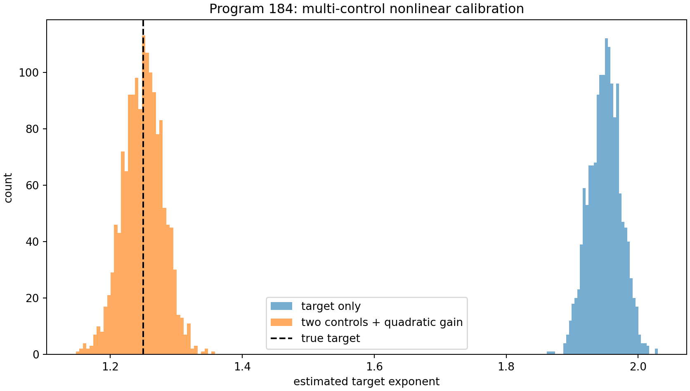

## 8.4 Verdict

**[Proven rank; strong synthetic evidence]** The constructed
`MultiControlCalibrationFrame` separates quadratic apparatus response and
makes one important nuisance assumption testable. It remains conditional on
the chosen response family.

---

# 9. Program 185 — Open-set challenge and a feature impossibility theorem

## 9.1 Frozen challenge

The classifier, feature scales, class centroids and abstention thresholds from
Program 174 are left unchanged. Four unseen generators are declared before
execution:

- ordered/correlated Gaussian records;
- tempered stable $\alpha=0.8$;
- Gaussian–Cauchy mixtures;
- nonshared random detector gain.

## 9.2 Exact order-blindness

Every frozen feature is a function of one-time empirical quantiles or boundary
atom counts. Hence it depends only on the multiset of values, not their
ordering. For every permutation $\pi$,

$$
\Phi(x_1,\ldots,x_n)
=
\Phi(x_{\pi(1)},\ldots,x_{\pi(n)}).
$$

Sorting the records creates strong temporal organization while preserving the
features exactly. The observed maximum feature difference is zero.

## 9.3 Results

The ordered Gaussian class is rejected only $6.11\%$ of the time and falsely
accepted $93.89\%$ of the time, almost always as local Gaussian. The other
three declared unknowns are rejected at rates between $98.33\%$ and $100\%$.

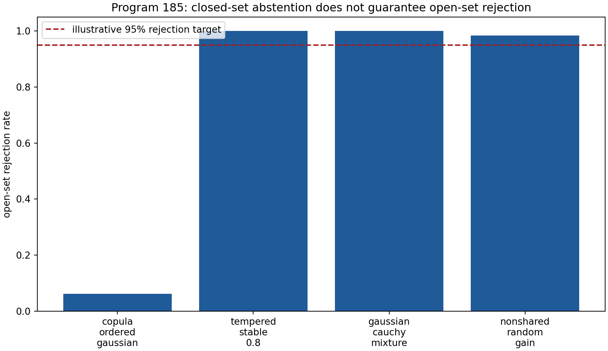

## 9.4 Verdict

**[Proven]** No classifier based solely on the frozen marginal features can
identify temporal memory. Good rejection of some unseen marginal laws does
not repair this exact invariance. The next protocol must add ordering-sensitive
features or explicit interventions.

---

# 10. Program 186 — TwoStepProcessInstrument for double slit

## 10.1 Memoryful phase process

Let a quasistatic Gaussian phase $\xi$ have variance $\sigma^2$, constant
across two intervals. Coherence after time $t$ is

$$
\Gamma(t)=\mathbb E(e^{i\xi t})
=e^{-\sigma^2t^2/2}.
$$

For $\sigma=0.8$ and $t_1=t_2=1$:

$$
\Gamma_1=\Gamma_2=0.726149,
$$

$$
\Gamma_{12}^{\rm static}=e^{-1.28}=0.278037.
$$

A Markov process matched at one step gives

$$
\Gamma_{12}^{\rm Markov}
=\Gamma_1\Gamma_2
=0.527292.
$$

The nonfactorization witness is

$$
\mathcal M
=\Gamma_{12}^{\rm static}
-\Gamma_1\Gamma_2
=-0.249255.
$$

## 10.2 Echo intervention

Reversing the path phase sign between intervals cancels a static phase:

$$
\Gamma_{\rm echo}^{\rm static}=1.
$$

Independent Markov increments are not refocused:

$$
\Gamma_{\rm echo}^{\rm Markov}=0.527292.
$$

Detector blur gives a separate visibility transfer $0.84$, while a localized
path preparation supplies a population-survival contrast for classical path
diffusion.

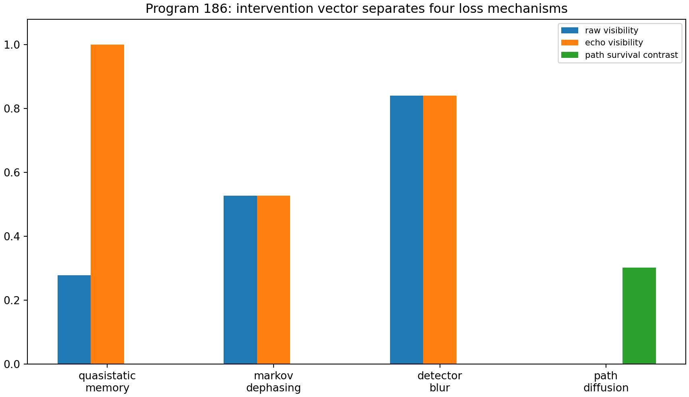

## 10.3 Constructed object

`TwoStepProcessInstrument` contains:

- path preparation;
- a two-step random-unitary process;
- optional echo intervention;
- path-population control;
- phase POVM;
- detector calibration;
- persistent record.

## 10.4 Verdict

**[Conditional; proven finite formulas]** The intervention vector separates
four declared mechanisms. It does not follow from the kernel alone and is not
device-independent or externally validated.

---

# 11. Program 187 — Environment nonuniqueness

## 11.1 Explicit dilation family

Keep the path generator $A$ fixed. Let an environment qubit start in
$|+\rangle$ and use

$$
V_g
=
|0\rangle\langle0|\otimes I
+
|1\rangle\langle1|\otimes e^{-ig\sigma_z}.
$$

Tracing out the environment yields

$$
\rho_{01}\longmapsto
\langle+|e^{-ig\sigma_z}|+\rangle\rho_{01}
=
\cos(g)\rho_{01}.
$$

For every $0\le g\le\pi/2$ this is a valid dephasing channel. Its normalized
Choi eigenvalues are

$$
\left(
\frac{1+\cos g}{2},
\frac{1-\cos g}{2},
0,0
\right).
$$

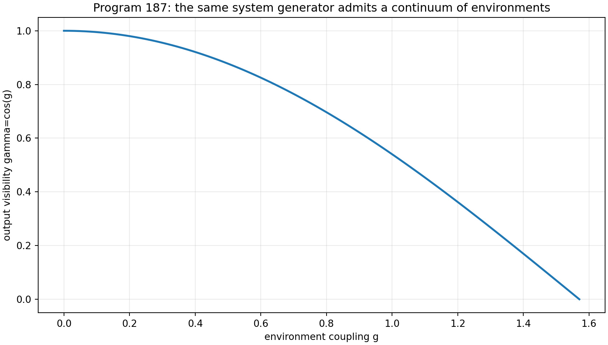

## 11.2 No-go theorem

The system operator $A$ contains no value of $g$. Holding $A$ fixed while
varying $g$ changes visibility continuously from one to zero. Therefore a
unique environment, channel or record cannot be a function of $A$ alone.

## 11.3 Minimal replacement

Microscopic dilations contain operationally redundant information. The
minimal observer-facing object is

$$
\text{EnvironmentProcessClass}
=
\frac{\{\text{dilations}\}}
{\text{same reduced process tensor}}.
$$

**[Proven]** This quotient is a more economical missing object than a
preferred microscopic environment, but the reduced process still has to be
specified or sourced.

---

# 12. Program 188 — Cohomology and transcendence of the phase correction

## 12.1 Character classes

For trivial coefficients,

$$
H^1(\mathbb Z,U(1))
=
\operatorname{Hom}(\mathbb Z,U(1))
\cong U(1).
$$

A character is fixed by the image of the generator.

The legacy value

$$
\lambda_\ell=e^{i\pi/4}
$$

is an algebraic eighth root of unity. The strict value

$$
\lambda_s=e^{i743/4000}
$$

is transcendental because $i743/4000$ is a nonzero algebraic number and
Lindemann–Weierstrass makes its exponential transcendental.

## 12.2 Algebraic source obstruction

The correction generator is

$$
\lambda_C
=
\frac{\lambda_s}{\lambda_\ell}.
$$

If $\lambda_C$ were algebraic, then
$\lambda_s=\lambda_C\lambda_\ell$ would be algebraic, contradiction.
Therefore $\lambda_C$ is transcendental.

Finite algebraic operations on the legacy cyclotomic field remain algebraic.
They cannot produce $\lambda_s$ or $\lambda_C$.

The constant offset

$$
\Delta\phi=\frac{13}{80}-\frac{\pi}{6}
$$

is an affine phase-origin correction, not part of a normalized group
character.

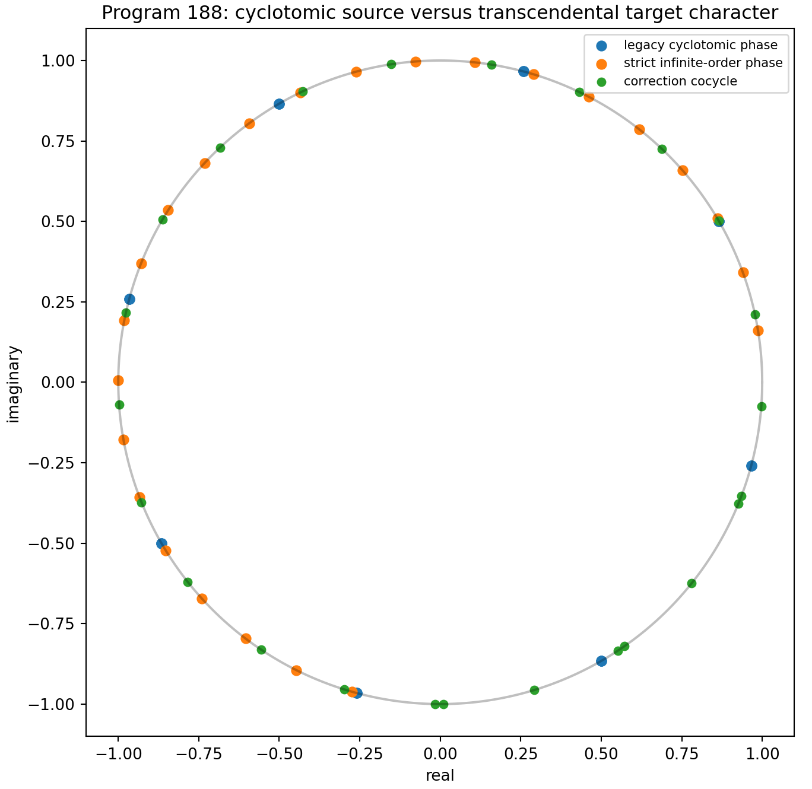

## 12.3 Verdict

**[Proven]** An algebraic legacy-only completion is impossible. A future
bridge needs genuinely new analytic data and a sourced phase origin. The
target quotient supplies the answer but not its cause.

---

# 13. Program 189 — Intrinsic scale-orbit obstruction

## 13.1 Symmetry

For $c>0$ define

$$
A_c=cA,\qquad t_c=t/c,\qquad z_c=cz.
$$

Then

$$
e^{-it_cA_c}=e^{-itA},
$$

$$
e^{-t_cA_c}=e^{-tA},
$$

and

$$
c(A_c+z_cI)^{-1}=(A+zI)^{-1}.
$$

Thus every normalized prediction is constant on a free
$\mathbb R_{>0}$ orbit.

## 13.2 Executed orbit

Across $10^{-3}\le c\le10^3$:

- unitary residual is below $4\times10^{-16}$;
- heat residual is below $3\times10^{-16}$;
- resolvent covariance residual is below $3\times10^{-15}$;
- the normalized gap is constant to approximately $5\times10^{-16}$;
- the raw gap changes by a factor $10^6$.

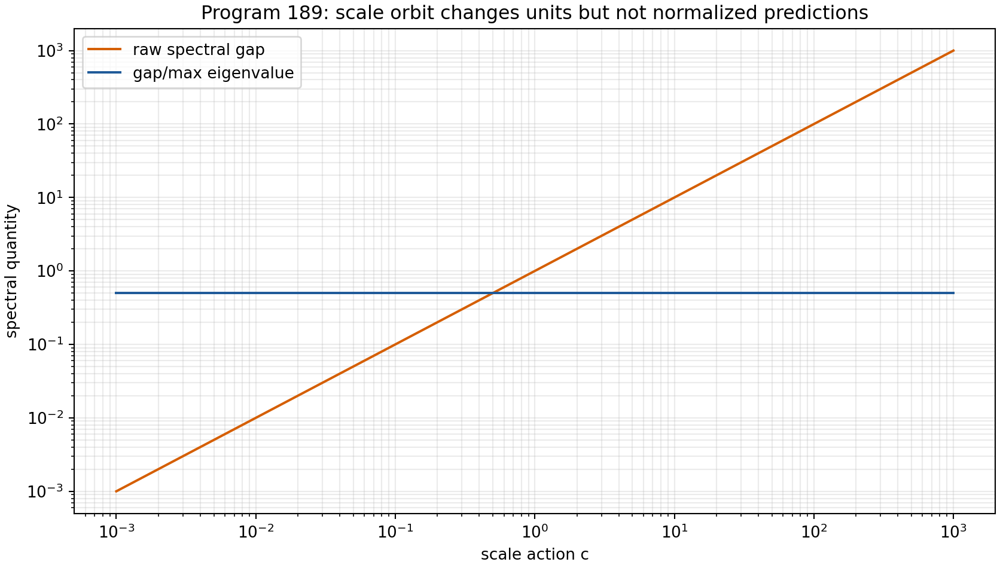

## 13.3 No-section theorem

Invariant spectral data are constant on the orbit. A rule using only such data
cannot choose one representative. A scale-charged datum or calibration is
necessary.

The minimal one-generator conditional object is a
`SpectralClockFrame`, a chosen $\tau_\ast>0$ such that

$$
\tau_\ast A
$$

is dimensionless. Under $A\mapsto cA$ it transforms as
$\tau_\ast\mapsto\tau_\ast/c$.

## 13.4 Verdict

**[Proven]** One clock frame calibrates the spectral generator but is not a
strict source. Full action, length and mass units still require a rank-three
conversion package or an equivalent physical structure.

---

# 14. Program 190 — External-data intake gate

## 14.1 Operational requirements

The gate requires eleven fields:

1. public source identifier;
2. explicit license identifier;
3. immutable hashes;
4. preparation provenance;
5. raw time-ordered records;
6. physical units and timestamps;
7. detector calibration;
8. apparatus-memory calibration;
9. reference control;
10. exclusion audit;
11. independent analysis boundary.

## 14.2 Audited local bundles

Three local candidates are checked:

- `raw_strain_unfiltered`: sixteen `.h5` paths, nine valid HDF5 signatures,
  but no embedded units, timestamps, provenance or control metadata;
- `beta_channel_true_external_v2`: genuine external-source statement and
  five present hash-listed files, but no explicit license, raw operational
  record, preparation or calibration compatible with this protocol;
- `confirmatory_dataset_external_source_rebuild`: two present summary files
  and hashes, but generic license text and no raw operational chain.

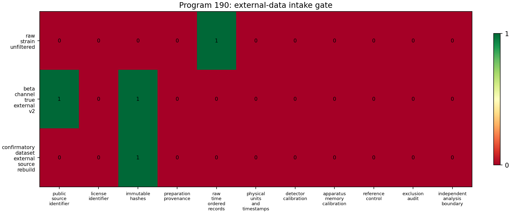

## 14.3 Verdict

**[Proven local audit]** No bundle passes all eleven requirements. This does
not deny that some files have authentic external provenance or value for
other repository tests. It means that none is admissible for the specific
state–control–detector–memory protocol constructed here.

No external result is computed, and the intake failure itself is archived as
the scientific outcome.

---

# 15. Cross-program synthesis

## 15.1 Four nontrivial moduli

The round identifies four independent families:

$$
\begin{aligned}
\mathcal M_{\rm state}
&=\{F(\alpha/\log h)\},\\
\mathcal T_{\beta}
&=\mathbb R_{>0}\text{ as a scale torsor},\\
\mathcal M_{\rm env}(A)
&=\{\text{reduced processes compatible with }A\},\\
\mathcal T_{\rm clock}
&=\{\tau_\ast>0\}.
\end{aligned}
$$

The spectral generator determines none of their representatives.

## 15.2 What is unavoidable

The following are unavoidable consequences of the common operator:

- spectral measure;
- unitary and heat functional calculi;
- resolvents;
- dimensionless spectral ratios;
- exact Dirichlet positivity under the graph hypotheses.

## 15.3 What requires a section

The following require additional data:

- a reference state or state law;
- one compression/length representative;
- a signed preparation;
- an environment process;
- memory-sensitive interventions;
- a clock and dimensional conversion;
- detector and record calibration.

Mathematically, the missing physical principle would have to provide
compatible sections

$$
\sigma_{\rm state},\quad
\sigma_\beta,\quad
\sigma_{\rm env},\quad
\sigma_{\rm clock}
$$

and prove their naturality. Current invariant data provide no such global
section.

## 15.4 Why packaging is not derivation

AFIS or a process tensor may package several inputs in one tuple. A completion
map may reproduce the strict target. A gauge may set $\beta=1$. None of these
notations reduces the independent information required. Mathematical
minimality must count the information in a specification, not the number of
symbols used.

---

# 16. Corrected theoretical architecture

## 16.1 Strict informational layer

The strict layer contains:

$$
W_0=(\mathcal H,A,E_A,\text{dimensionless kernel invariants}).
$$

It supports wave, diffusion and Green dynamics.

## 16.2 Conditional conversion layer

The conversion layer contains:

$$
\mathrm{CA}
=
(\tau_\ast,\ell_\ast,\hbar_\ast)
$$

or an equivalent rank-three dimensional frame. Program 189 proves that at
least a clock representative is needed even for one generator.

## 16.3 Conditional operational layer

The operational layer contains:

$$
\mathrm{OP}
=
(\rho,\mathcal P,\Upsilon_{2:0},
\mathcal I,\mathcal D,\mathcal R),
$$

where $\Upsilon_{2:0}$ is a process tensor, $\mathcal I$ an intervention
family, $\mathcal D$ detector calibration and $\mathcal R$ a record.

## 16.4 Optional completion layer

The kernel bridge is a separate typed object:

$$
\mathcal B:
K_{\rm legacy}+\text{new sourced data}
\longrightarrow K_{\rm strict}.
$$

Program 188 proves that the phase arrow cannot be algebraic in legacy
cyclotomic data alone. Program 179 proves that the damping arrow needs a scale
representative or new source.

---

# 17. Falsification ledger

## Surviving theorems

- common spectral functional calculus;
- exact finite Dirichlet identity;
- state-law moduli classification;
- positive compression torsor;
- complete covariant qubit conversion criterion;
- exact repeated-block DKW theorem;
- nonlinear calibration rank;
- feature permutation-invariance no-go;
- two-step memory witness;
- environment nonuniqueness;
- phase transcendence obstruction;
- scale-orbit no-section theorem.

## Surviving conditional constructions

- one-copy $\beta_F=\log2$ state;
- $\beta=1$ coordinate gauge;
- `MultiControlCalibrationFrame`;
- `TwoStepProcessInstrument`;
- `SpectralClockFrame`;
- CA/operational packaging.

## Refuted in scope

- unique state selection by composition and label invariance;
- strict $\beta=1$ from positivity or unitality;
- completeness of scalar reflection monotone $M$;
- nominal-$n$ DKW under repeated blocks;
- general memory identification by marginal quantile features;
- unique environment from $A$;
- algebraic legacy-only strict phase completion;
- intrinsic scale selection by normalized spectral data.

## Still open

- full Arb/acb certificate;
- compiled proof-assistant generalization;
- arbitrary mixing inference;
- sourced scale-charged datum;
- sourced sector selector;
- source-complete legacy-to-strict map;
- admissible external experiment.

---

# 18. Recommended Programs 191–203

The following thirteen programs are ranked by expected information gain.

## Priority 1 — Program 191: reference-state source theorem

Replace scalar temperature hunting by a typed reference-state problem.
Classify natural transformations assigning a faithful state to each admitted
fibre algebra under tensor products and coarse graining. Determine whether
normalized trace is unique and document that it yields $17/9$, or identify
the minimal extra datum needed for uniform central-sector weighting.

## Priority 2 — Program 192: beta-gauge invariant bridge observables

Work on exactly one completion atom. Introduce a conditional length frame,
quotient the positive $\beta$ torsor and classify which strict/legacy
comparisons are invariant under its action. This can distinguish meaningful
shape claims from coordinate-dependent $\beta=1$ statements without claiming
bridge closure.

## Priority 3 — Program 193: common-engine Arb certificate

Install or supply a reproducible Arb/python-flint environment and evaluate all
five Program-180 components in one directed-rounding pipeline. The outcome
must be either the formal sub-three-percent certificate or a formal lower
bound on the remaining interval width.

## Priority 4 — Program 194: compiled finite Dirichlet library

Compile a proof-assistant development with general finite symmetric
nonnegative $W$, constant row sum, positivity of $sI-W$, constant null
vector, unitary exponential and positivity/stochasticity of the heat
semigroup. Keep physical interpretation outside the formal theorem.

## Priority 5 — Program 195: analytic reflection-conversion geometry

Eliminate the numerical one-dimensional maximization from Program 182.
Derive a closed-form boundary, classify extremal channels and study tensor
composition or catalysis of the complete conversion preorder.

## Priority 6 — Program 196: mixing-aware empirical process theorem

Move beyond repeated blocks to a declared beta-mixing or martingale class.
Prove a nonasymptotic quantile bound with observable acquisition assumptions,
then measure the information cost relative to iid and block-valid intervals.

## Priority 7 — Program 197: order-sensitive open-set protocol

Add autocorrelation, ordinal-pattern, time-reversal and intervention-response
features before retraining. Freeze an open-set risk criterion and challenge it
with multiset-preserving permutations, long memory and nonstationary
apparatus processes.

## Priority 8 — Program 198: minimal process-tensor tomography

Determine the smallest preparation/intervention set identifying the
two-step dephasing process used in Program 186. Prove rank and conditioning,
then add detector blur as a separate nuisance channel.

## Priority 9 — Program 199: environment equivalence and causal
identifiability

Classify dilation equivalence classes producing the same reduced process.
Ask which environmental properties are operationally identifiable and prove
that unidentifiable microscopic coordinates cannot receive physical claims.

## Priority 10 — Program 200: analytic phase-source classification

Having excluded finite algebraic legacy operations, classify analytic
functional operations that could generate $e^{i743/4000}$ without inserting
the target. Require a repository-sourced argument, phase origin and coupling
law. Stop if every candidate is constant or target-coded.

## Priority 11 — Program 201: scale-free observable catalogue

Construct the maximal set of predictions invariant under
$(A,t,z)\mapsto(cA,t/c,cz)$. These are the only quantities testable before a
physical clock is supplied. Separate scale-free falsification from
dimensionful fitting.

## Priority 12 — Program 202: admissible experimental bundle

Build, acquire or document one dataset bundle containing all eleven
Program-190 fields, especially preparation, raw order, detector calibration,
memory calibration and a known reference control. Do not run the physics
protocol until the intake hash is frozen and the license is explicit.

## Priority 13 — Program 203: one conditional CA+OP prediction

Choose one narrow observable and derive it from

$$
W_0+\mathrm{CA}+\mathrm{OP}
$$

with every imported unit and instrument parameter displayed. Compare against
an admissible record only if Program 202 passes. The result must remain
conditional and must not be promoted to strict FIN or ToE closure.

## Quantitative ranking

$$
\begin{array}{c|c|c}
\text{rank}&\text{program}&\text{probability of decisive progress}\\
\hline
1&191&0.88\\
2&192&0.84\\
3&197&0.82\\
4&198&0.80\\
5&195&0.78\\
6&196&0.75\\
7&201&0.74\\
8&194&0.72\\
9&193&0.68\\
10&199&0.67\\
11&200&0.62\\
12&202&0.48\\
13&203&0.35
\end{array}
$$

Program 203 is ranked last only because it is logically downstream of an
admissible experimental bundle. A rigorous negative result in any of the
higher-ranked programs is considered decisive progress.

---

# 19. Final conclusion

The attempt to make FIN physical by finding one numerically distinguished
constant has now been replaced by a more precise mathematical question:
which nontrivial bundles or moduli must receive sections before an experiment
is defined?

The spectral generator supplies real structure. It unifies wave, diffusion
and Green dynamics and supports exact Dirichlet mathematics. But composition
leaves a state-law moduli space; positive compression is a scale torsor; the
same generator admits a continuum of environments; process memory requires
interventions; and dimensional time lives on a free positive orbit.

The new complete reflection-conversion theorem and the process-memory
instrument show that progress does not require pretending these missing
objects are already derived. They can be constructed, classified and tested
as independent mathematical objects.

The deepest interpretation surviving this round is:

**FIN is presently a rigorous dimensionless spectral-dynamical foundation
equipped with unresolved state, scale and operational section problems.
Physics begins only after those sections are sourced or explicitly supplied
and made falsifiable.**

That conclusion is stronger than a vague statement that “more physics is
needed.” It identifies the precise mathematical types of the missing data and
proves that several natural invariant constructions cannot provide them.

---

# Reproducibility statement

The executable, 72 tests, machine-readable results, preregistration, finite
Lean source and thirteen figures are included. All stochastic studies use a
fixed seed. Firecrawl and external web access were not used. Repository-local
external-lineage files were inspected only by the Program-190 intake gate; no
external physical validation was executed.

# Suggested citation

Żuchowski, K. (2026). *FIN Programs 178–190: Composition Laws, Process
Memory, and Scale Obstructions* (FIN Research Monograph, Release 10.17;
Version 1.0.0) [Preprint]. Zenodo.

