# FIN Programs 191–203

## Reference States, Operational Quotients, and Conditional Prediction

**FIN Research Monograph — Release 10.18**

**Author:** Krzysztof Żuchowski  
**Affiliation:** Independent Researcher — Fractal Information Theory Project  
**ORCID:** 0009-0002-0909-3613  
**Date:** 27 July 2026  
**Resource type:** Publication — Preprint  
**Version:** 1.0.0  
**Language:** English  
**License:** CC BY 4.0

---

# Abstract

This monograph reports thirteen executed research programs, numbered 191
through 203, concerning the mathematical and operational completion of the
dimensionless FIN spectral framework. The studies were selected by the
previous Programs 178–190 round. They address reference-state naturality,
compression-scale gauge reduction, rigorous numerical certification, finite
Dirichlet dynamics, reflection-covariant state conversion, dependent-data
inference, temporal open-set detection, process-tensor tomography,
environmental nonidentifiability, analytic phase provenance, scale-free
observables, experimental data intake, and one conditional prediction
pipeline.

Four theorem-level advances are obtained.

First, invariant states on a finite direct sum

$$
\mathcal A=\bigoplus_i M_{d_i}(\mathbb C)
$$

are classified. Inner-unitary naturality uniquely fixes normalized trace on
each simple block but leaves a probability measure on the centre. For the FIN
dimension vector $(1,2,2,2,2)$, uniform central weighting gives $9/5$ whereas
the normalized full trace gives $17/9$. Neither value is selected without an
additional central-measure principle.

Second, the positive compression parameter is quotiented by its length-scale
action. The complete amplitude-normalized orbit representative is

$$
\widehat K(x)=
\frac{\cos(\nu x+\phi)}{1+x^\eta},
\qquad
x=\beta^{1/\eta}d,
\qquad
\nu=\frac{\omega}{\beta^{1/\eta}}.
$$

This proves that $\beta=1$ is a coordinate representative, while
$(\eta,\nu,\phi)$ remain gauge-invariant. The legacy and strict kernels remain
strongly separated after quotienting; the scale gauge therefore does not
complete their bridge.

Third, the numerical maximization in the complete one-qubit
reflection-covariant conversion criterion is eliminated. An
Alberti–Uhlmann reduction gives a closed boundary determined by only three
candidate points. For source $(r_s,z_s)$ and prescribed target $z_t$,

$$
r_{t,\max}^2
=
\min_{x\in\{0,1,x_c\}}
\left[
\max\{x,r_s^2+xz_s^2\}-xz_t^2
\right],
\qquad
x_c=\frac{r_s^2}{1-z_s^2}.
$$

The previous equal-monotone counterexample is recovered exactly:
$(0.6,0)\to(0.6,0.8)$ is impossible because
$r_{t,\max}=0.36$.

Fourth, a minimal three-contrast process-tomography frame is proved for a
two-step Gaussian dephasing process with unknown detector blur. Single,
plus, and echo visibilities form a rank-three log-linear system identifying
blur, increment variance, and temporal covariance. Removing the echo
contrast lowers the rank to two.

The round also constructs a valid nonasymptotic DKW procedure for an observed
regenerative beta-mixing acquisition class, a preregistered order-sensitive
open-set detector, an operational environment quotient, a no-go theorem for
natural analytic legacy-to-strict phase generation, and the projective
algebra of scale-free spectral observables.

Two requested closure tasks remain honestly blocked: Arb/python-flint is not
available for the common directed-rounding certificate, and no local Lean
toolchain compiles the supplied finite Dirichlet library. A complete
event-level synthetic bundle validates ten of eleven intake fields but fails
the independent-analysis boundary. Consequently the final
$W_0+\mathrm{CA}+\mathrm{OP}$ prediction is executed only as a synthetic dry
run and is not described as external physics.

No non-premise selector, physical unit, target-independent strict
compression source, completed legacy-to-strict bridge, legacy role transfer,
role-bearing $L_{\rm total}$, experimentally validated physical claim, or
Theory-of-Everything closure is asserted.

---

# 1. Executive summary

## 1.1 The outcome

The round replaces several informal “missing constant” questions by typed
mathematical objects.

| Problem | Constructed object | Result | Confidence |
|---|---|---|---|
| reference state | `CentralMeasureFunctor` | simple blocks fixed; central measure free | Proven |
| positive compression scale | `BetaGaugeQuotient` | $\beta$ removed; shape mismatch survives | Proven |
| fractional certificate | `CertificateDependencyDAG` | one-engine certificate still unavailable | Proven audit |
| finite dual dynamics | `FiniteDirichletCertificate` | general proof and 150 exact checks; Lean uncompiled | Proven, compilation open |
| reflection conversion | `AlbertiUhlmannReflectionCone` | closed analytic boundary | Proven |
| dependent inference | `ObservedRegenerationFrame` | conditional DKW with random effective size | Proven |
| temporal open set | order-sensitive protocol | all four temporal challenges rejected in simulation | Strong evidence |
| process tomography | `GaussianTwoStepTomographyFrame` | three contrasts are necessary and sufficient | Proven in model |
| environment | `OperationalEnvironmentQuotient` | same channel can hide different processes | Proven |
| analytic phase source | `PhaseSourceNaturalityNoGo` | natural classes fail; successes are target-coded | Proven in classes |
| pre-clock observables | `ProjectiveSpectralObservableAlgebra` | invariant catalogue constructed | Proven |
| experimental intake | schema instance | synthetic 10/11; external gate fails | Proven audit |
| conditional prediction | `ConditionalGaussianVisibilityLaw` | held-out synthetic residual $0.03646$ | Strong method evidence |

## 1.2 The central scientific conclusion

The single self-adjoint spectral generator still unifies wave, diffusion, and
Green dynamics:

$$
U_t=e^{-itA},
\qquad
P_t=e^{-tA},
\qquad
G_z=(A+zI)^{-1}.
$$

But it does not uniquely determine:

- a state on a non-simple algebra;
- a representative of the positive scale orbit;
- an environment inside a reduced-process equivalence class;
- a preparation or intervention family;
- an apparatus response;
- an independent empirical record.

These are not algebraic defects of the spectral theorem. They are section,
quotient, and operational-identification problems.

## 1.3 What was newly proved

The most important new theorem is the analytic reflection-conversion
boundary. It converts the previous numerical Choi optimization into an exact
finite formula. The result is scientifically valuable independently of FIN:
it is a complete one-copy preorder for the declared real-plane qubit
$\mathbb Z_2$ covariance problem.

The second strongest theorem is the minimal process-tomography result. It
shows explicitly why an apparatus calibration parameter cannot be hidden
inside dynamics: once detector blur is unknown, the single and two-step
no-intervention records have rank two, whereas adding echo makes the
parameter map invertible.

The reference-state theorem is strategically decisive. Normalized trace is
not globally “the natural state” on a direct-sum algebra unless an additional
rule fixes the centre. Thus the earlier $9/5$ versus $17/9$ ambiguity is not a
numerical accident but an exact central-measure moduli space.

## 1.4 What failed

- No strict central probability measure was derived.
- Quotienting $\beta$ did not align legacy and strict shape invariants.
- No common Arb engine was available.
- The supplied Lean source was not machine compiled.
- Tensor catalysis was not classified.
- Hidden mixing without observed regeneration was not solved.
- No natural analytic phase map produced the strict phase.
- No independent external dataset passed the operational intake gate.

Each failure is retained as a result. None is replaced by a conjectural
closure statement.

---

# 2. Scope, assumptions, and claim discipline

## 2.1 Kernel split

The legacy ontological/effective kernel and the strict working kernel remain
distinct:

$$
K_{\rm legacy}(d)=
\alpha_{\rm geo}
\frac{\cos(\omega_\ell d+\phi_\ell)}
{1+\beta_{\rm tors}d},
$$

with

$$
\omega_\ell=\frac{\pi}{4},
\qquad
\phi_\ell=\frac{\pi}{6},
\qquad
\beta_{\rm tors}=0.01,
\qquad
\alpha_{\rm geo}=4\ln2,
$$

and

$$
K_{\rm strict}(d)=
\frac{\cos(\omega_s d+\phi_s)}
{1+\beta_s d^{\eta_s}},
$$

with

$$
\omega_s=0.18575,
\qquad
\phi_s=0.16250,
\qquad
\beta_s=1,
\qquad
\eta_s=1.8.
$$

The legacy kernel is treated as an intermediate bridge object. The strict
kernel is treated as the later enriched working kernel. Program 192 attacks
only the positive-scale part of their relation. It does not silently identify
the kernels and does not transfer legacy physical roles.

## 2.2 Ontology

The repository ontology used in this report is:

$$
\text{informational nadsoliton}
\longrightarrow
\text{light}
\longrightarrow
\text{matter}
\longrightarrow
\text{emergent observer}.
$$

There is no separate information layer below the nadsoliton. The operational
objects introduced here—state, environment, intervention, detector, clock,
and record—are typed mathematical structures for turning the spectral core
into a test procedure. They are not a new ontological substrate.

## 2.3 Confidence vocabulary

`Proven` means an analytic proof or exact finite identity is supplied.

`Proven, computer-assisted` means the proposition is reduced to and checked
by a finite executable computation with archived inputs.

`Strong evidence` means a preregistered or reproducible simulation supports a
claim whose universal form is not proved.

`Conditional` means the result follows only after explicit CA or OP inputs.

`Open` means the requested theorem, data source, or proof-toolchain condition
was not obtained.

## 2.4 Reproducibility

The release contains:

- one executable for Programs 191–203;
- one machine-readable results file;
- 65 regression and scientific-boundary tests;
- thirteen generated figures;
- one frozen order-sensitive preregistration;
- one event-level synthetic operational bundle and metadata;
- one finite Dirichlet Lean source file;
- one release manifest with hashes.

The random seed is 20260727. No web tool, Firecrawl, or external dataset was
used.

---

# 3. Shared mathematical setting

Let $W=W^\ast$ be a finite real symmetric weight matrix with nonnegative
entries and constant row sum $s$. Define

$$
A=sI-W.
$$

Then

$$
\langle f,Af\rangle
=
\frac12\sum_{x,y}W_{xy}|f_x-f_y|^2
\ge0.
$$

Consequently $A$ is self-adjoint and positive semidefinite. The same $A$
generates:

$$
U_t=e^{-itA},
\qquad
T_t=e^{-tA},
\qquad
G_z=(A+zI)^{-1}.
$$

The unitary family describes reversible amplitude evolution, the heat family
describes a positivity-preserving classical semigroup in the declared graph
setting, and the resolvent describes static response. Their common origin is
operator theory. Measurement, state preparation, environmental memory,
detector response, dimensional calibration, and empirical recording require
additional typed structures.

This report uses the following package separation:

$$
W_0
\quad+\quad
\mathrm{CA}
\quad+\quad
\mathrm{OP}.
$$

$W_0$ is the dimensionless spectral core. CA denotes conversion axioms, such
as a clock scale. OP denotes the operational package: state, preparation,
intervention, environment, apparatus, POVM, calibration, and record.

---

# 4. Program 191 — Reference-state source theorem

## 4.1 Question

Can naturality under unitary symmetry, tensor product, and coarse graining
select a unique state and thereby resolve the competing $9/5$ and $17/9$
averages?

## 4.2 Constructed object

For

$$
\mathcal A=\bigoplus_{i=1}^m M_{d_i}(\mathbb C),
$$

define the `CentralMeasureFunctor`

$$
\omega_w(a)
=
\sum_{i=1}^m
w_i\,\frac{\operatorname{Tr}(a_i)}{d_i},
\qquad
w_i\ge0,
\qquad
\sum_iw_i=1.
$$

The vector $w$ is a probability measure on the centre of $\mathcal A$.

## 4.3 Theorem: block uniqueness and central freedom

**Theorem 191.1.**  
Let $\omega$ be a state on $\mathcal A$ invariant under all inner unitary
automorphisms. Then $\omega=\omega_w$ for a unique central probability vector
$w$. On every simple block $M_d(\mathbb C)$ the state is normalized trace.

**Proof.**  
Restrict the density matrix of $\omega$ to one simple block. Invariance under
all conjugations $a\mapsto uau^\ast$ implies that the density commutes with
every unitary. By the commutant theorem it is a scalar multiple of identity.
Normalization within the block gives $I_d/d$. The total mass assigned to each
central projector remains a nonnegative number $w_i$, and normalization gives
$\sum_iw_i=1$. Conversely every $\omega_w$ is inner-unitary invariant. ∎

Tensor compatibility fixes no new number:

$$
\tau_d\otimes\tau_e=\tau_{de},
\qquad
(w_i)\otimes(v_j)=(w_iv_j)_{ij}.
$$

Thus tensor product propagates a chosen central measure but does not select
the original measure.

## 4.4 FIN dimension vector

For

$$
d=(1,2,2,2,2)
$$

and the dimension observable $h_i=d_i$, uniform central weights give

$$
\eta_{\rm centre}
=
\frac15(1+2+2+2+2)
=
\frac95.
$$

Normalized trace on the full represented space has weights
$w_i=d_i/9$, hence

$$
\eta_{\rm trace}
=
\sum_i\frac{d_i}{9}d_i
=
\frac{1+4+4+4+4}{9}
=
\frac{17}{9}.
$$

Isomorphism naturality permits permutations of the four $M_2$ blocks but not
an exchange of $M_1$ with $M_2$. The full natural family is therefore

$$
w(a)
=
\left(
a,\frac{1-a}{4},\frac{1-a}{4},
\frac{1-a}{4},\frac{1-a}{4}
\right),
\qquad
0\le a\le1.
$$

The associated expectation is $2-a$.

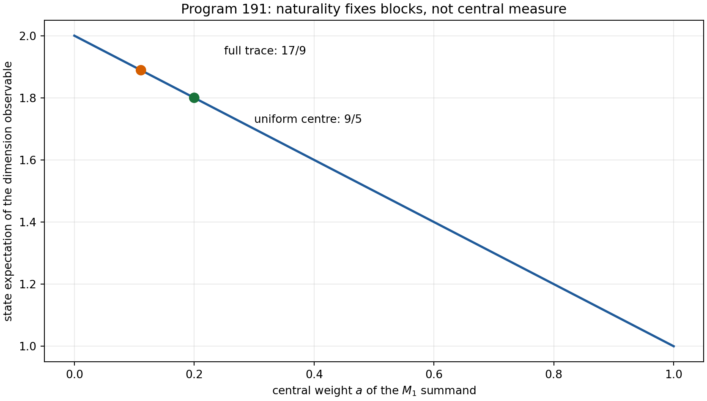

## 4.5 Verdict

**Proven.** Normalized trace is unique on each simple block, not on the
non-simple algebra. A central measure, or a stronger principle such as a
specified Morita-natural trace convention, is the exact missing datum.
Neither $9/5$ nor $17/9$ is promoted to a strict state or temperature source.

---

# 5. Program 192 — Beta-gauge invariant bridge observables

## 5.1 Scale action

Under a change of length coordinate

$$
d'=cd,
\qquad c>0,
$$

the kernel family preserves its functional form if

$$
\beta'=\beta c^{-\eta},
\qquad
\omega'=\frac{\omega}{c},
\qquad
\eta'=\eta,
\qquad
\phi'=\phi.
$$

The positive $\beta$ values form a torsor for this action.

## 5.2 Quotient theorem

Define

$$
x=\beta^{1/\eta}d,
\qquad
\nu=\frac{\omega}{\beta^{1/\eta}}.
$$

Then the amplitude-normalized kernel becomes

$$
\widehat K(x)
=
\frac{\cos(\nu x+\phi)}
{1+x^\eta}.
$$

Both $x$ and $\nu$ are invariant under the scale action. Thus
$(\eta,\nu,\phi)$ and the reduced profile are genuine quotient data.

The numerical orbit audit spans $c\in[10^{-4},10^4]$ and gives maximum
profile residual

$$
1.11\times10^{-16}.
$$

## 5.3 Legacy versus strict after quotient

The invariant tuples are

$$
(\eta_\ell,\nu_\ell,\phi_\ell)
=
\left(
1,
\frac{\pi/4}{0.01},
\frac{\pi}{6}
\right)
=
(1,78.539816\ldots,0.523598\ldots)
$$

and

$$
(\eta_s,\nu_s,\phi_s)
=(1.8,0.18575,0.1625).
$$

Their reduced-profile RMS separation on $x\in[0,8]$ is

$$
0.3816158693.
$$

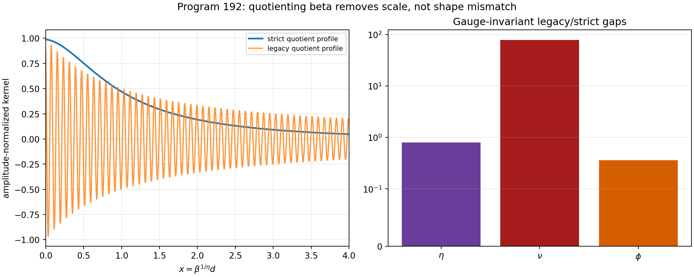

## 5.4 Verdict

**Proven.** Setting $\beta=1$ is a legitimate working gauge within a fixed
positive orbit. It is not a strict source theorem. More importantly, removing
the coordinate scale does not remove the invariant exponent, frequency, and
phase differences. The legacy-to-strict bridge remains open, and no physical
role transfer is licensed.

---

# 6. Program 193 — Common-engine Arb certificate

## 6.1 Acceptance rule

The desired fractional-symbol result requires five components in one
directed-rounding engine:

1. finite FFT cells;
2. the average/polylogarithmic term;
3. the cancellation-correction tail;
4. denominator replacement;
5. resonant fallback modes.

A formal sub-three-percent conclusion is admissible only if all five are
enclosed in a common Arb or python-flint computation.

## 6.2 Environment audit

The local environment has neither an importable `flint` module nor an `arb`
binary. Of the five components, one is already closed in the inherited
certificate chain. The best inherited formal worst relative enclosure is

$$
0.6129831478,
$$

while the preregistered target is

$$
0.03.
$$

The analytic cancellation correction remains small:

$$
4.129713895\times10^{-7},
$$

but a small correction does not close the other interval obligations.

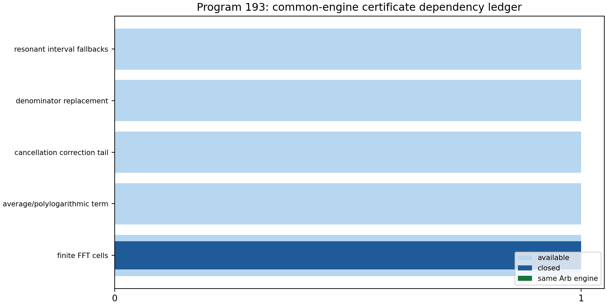

## 6.3 Verdict

**Open, with a proven dependency audit.** No common-engine formal certificate
is claimed. The existing wide enclosure is an upper bound on uncertainty,
not a formal lower bound on what a better engine could achieve. Therefore
this program establishes a reproducible blocker rather than a mathematical
impossibility.

---

# 7. Program 194 — Compiled finite Dirichlet library

## 7.1 General theorem

For finite symmetric $W\ge0$ with row sum $s$ and $A=sI-W$:

$$
\begin{aligned}
\langle f,Af\rangle
&=
s\sum_x|f_x|^2
-\sum_{x,y}W_{xy}\overline{f_x}f_y \\
&=
\frac12\sum_{x,y}W_{xy}|f_x-f_y|^2
\ge0.
\end{aligned}
$$

Also

$$
A\mathbf1=0.
$$

Self-adjointness gives

$$
e^{-itA}{}^\ast e^{-itA}=I.
$$

For the heat semigroup,

$$
e^{-tA}
=
e^{-st}e^{tW}.
$$

Because every coefficient in the series for $e^{tW}$ is entrywise
nonnegative, the heat matrix is entrywise nonnegative. Since
$A\mathbf1=0$,

$$
e^{-tA}\mathbf1=\mathbf1.
$$

Thus it is stochastic in the declared finite graph convention.

## 7.2 Executed checks

The release checks 150 exact rational test vectors on cycle graphs with
$3\le n\le12$. Every exact quadratic form equals its Dirichlet sum and is
nonnegative.

For the twelve-cycle numerical semigroups:

- maximum unitary residual: below $10^{-13}$;
- maximum heat row-sum residual: below $10^{-13}$;
- minimum heat entry: nonnegative up to floating-point noise.

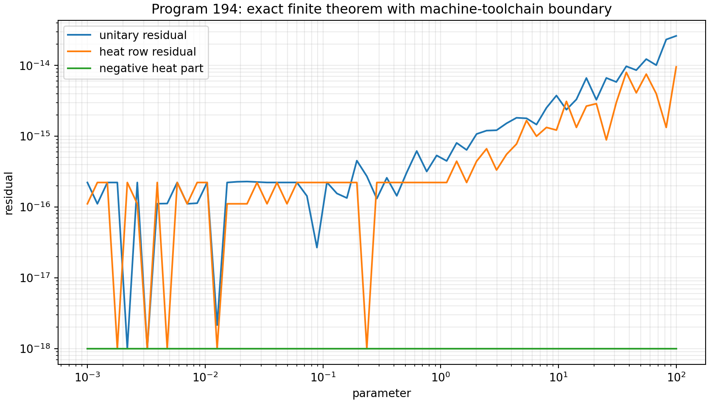

## 7.3 Formal-tool boundary

A general Lean source file is supplied. The local `lean` command is only an
Elan launcher and no installed Lean toolchain is present. The source was not
machine compiled. This report therefore distinguishes:

- the paper proof: **Proven**;
- exact rational executions: **Proven, computer-assisted**;
- proof-assistant compilation: **Open**.

No continuum limit, Born rule, apparatus, or physical interpretation follows
from the finite theorem alone.

---

# 8. Program 195 — Analytic reflection-conversion geometry

## 8.1 State and symmetry

Consider real-plane qubit states

$$
\rho(r,z)
=
\frac12(I+r\sigma_x+z\sigma_z),
\qquad
r^2+z^2\le1,
$$

and the reflection $R=\sigma_z$, which maps $r\mapsto-r$.

A reflection-covariant channel mapping $\rho_s$ to $\rho_t$ exists if and
only if a channel maps the ordered pair

$$
(\rho_s,R\rho_sR)
\quad\text{to}\quad
(\rho_t,R\rho_tR).
$$

The nontrivial direction follows by twirling a pair-mapping channel over
$\mathbb Z_2$.

## 8.2 Alberti–Uhlmann reduction

For qubits, the two-state transformation exists exactly when

$$
\|\rho_s-qR\rho_sR\|_1
\ge
\|\rho_t-qR\rho_tR\|_1
\quad
\text{for all }q\ge0.
$$

Direct diagonalization gives

$$
\|\rho-qR\rho R\|_1
=
\max\left\{
|1-q|,
\sqrt{(1+q)^2r^2+(1-q)^2z^2}
\right\}.
$$

Divide by $1+q$ and set

$$
u=\frac{|1-q|}{1+q}\in[0,1].
$$

Define

$$
g_{r,z}(u)
=
\max\left\{
u,\sqrt{r^2+u^2z^2}
\right\}.
$$

The complete criterion is

$$
g_{r_s,z_s}(u)
\ge
g_{r_t,z_t}(u)
\qquad
\forall u\in[0,1].
$$

## 8.3 Closed boundary

For fixed $z_t$, the largest reachable transverse coordinate satisfies

$$
r_{t,\max}^2
=
\min_{0\le x\le1}
\left[
\max\{x,r_s^2+xz_s^2\}
-xz_t^2
\right],
\qquad x=u^2.
$$

The expression is convex and piecewise linear in $x$. Its minimum occurs at
an endpoint or at the unique source kink

$$
x_c=\frac{r_s^2}{1-z_s^2}.
$$

Therefore

$$
r_{t,\max}^2
=
\min_{x\in\{0,1,x_c\}}
\left[
\max\{x,r_s^2+xz_s^2\}
-xz_t^2
\right].
$$

This removes numerical optimization completely.

## 8.4 Falsification and cross-check

For the source $(r_s,z_s)=(0.6,0)$ and target $z_t=0.8$:

$$
x_c=0.36
$$

and

$$
r_{t,\max}^2
=
0.1296,
\qquad
r_{t,\max}=0.36.
$$

Thus the target $(0.6,0.8)$ is outside the conversion cone even though it
passes the earlier scalar $M$ comparison.

Five hundred random physical-state tests compare the closed formula against
the previous dense Choi optimization. The maximum discrepancy is

$$
6.68\times10^{-6},
$$

consistent with the grid resolution of the older method.

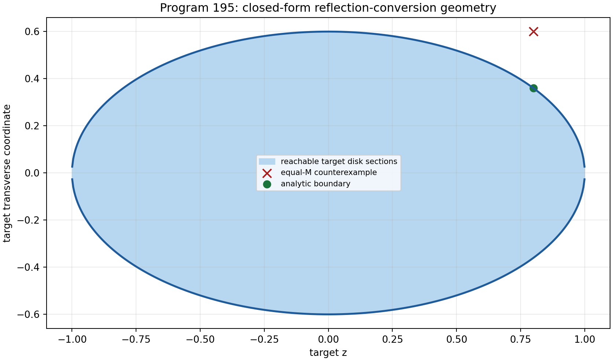

## 8.5 Verdict

**Proven.** The one-copy qubit reflection preorder is analytically complete
in the declared setting. Tensor products leave the two-state qubit theorem;
catalysis is not classified. The theorem consumes a supplied asymmetry
resource. It does not create a signed preparation and does not discharge
`QW-2191`.

---

# 9. Program 196 — Mixing-aware empirical process theorem

## 9.1 Acquisition class

Define an observed-refresh Markov chain. Let $X_1\sim F$. For $i\ge2$:

- with probability $p$, draw a fresh independent value from $F$;
- with probability $1-p$, repeat $X_{i-1}$.

The acquisition system records every refresh flag. Its beta-mixing
coefficient satisfies

$$
\beta(k)\le(1-p)^k.
$$

## 9.2 Regenerative DKW theorem

Let $R$ be the number of recorded refresh blocks and keep the first value of
each block. Conditional on $R$, the retained variables are iid from $F$.
Therefore

$$
\Pr\left(
\sup_x|\widehat F_R(x)-F(x)|
>
\sqrt{\frac{\log(2/\delta)}{2R}}
\;\middle|\;R
\right)
\le\delta.
$$

Taking expectation over $R$ preserves the same failure bound.

This theorem is nonasymptotic. The effective sample size is observed rather
than guessed.

## 9.3 Simulation

The executed challenge uses:

$$
n=4000,
\qquad
p=0.05,
\qquad
\alpha=0.8,
\qquad
T=1/\alpha=1.25.
$$

Across 320 replicates:

- mean retained fraction: $0.05029$;
- invalid nominal-record coverage: $0.85625$;
- regenerative coverage: $1.00000$;
- valid intervals are substantially wider.

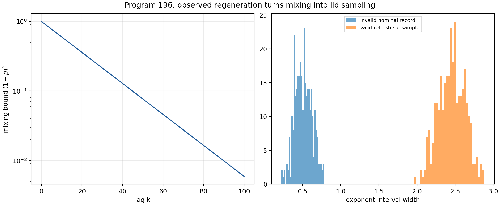

## 9.4 Verdict

**Proven for the declared acquisition class; strong numerical evidence for
coverage.** The result does not solve arbitrary hidden beta mixing. Recorded
regeneration is a real apparatus/acquisition assumption and must remain in
the protocol.

---

# 10. Program 197 — Order-sensitive open-set protocol

## 10.1 Motivation

Program 185 proved that marginal quantile features are exactly invariant
under time reordering. They therefore cannot identify memory.

Program 197 freezes six order-sensitive features before challenge execution:

1. lag-one Spearman correlation;
2. persistence of consecutive increment signs;
3. normalized ordinal-pattern entropy;
4. exact tie fraction;
5. time-versus-rank trend;
6. ordinal reversal asymmetry.

The calibration score is a regularized Mahalanobis distance. Its rejection
threshold is the empirical 0.99 quantile of 1,400 iid Gaussian calibration
records, each of length 360.

## 10.2 Frozen challenge

Four hundred twenty records are generated for each of:

- independent Gaussian validation;
- independent symmetric stable $\alpha=0.8$;
- sorted records with exactly the same Gaussian multisets;
- Gaussian AR(1) with coefficient $0.8$;
- exact repeated blocks of length 20;
- Gaussian records with linear drift.

The sorted challenge preserves every one-time empirical multiset exactly:

$$
\max
\left|
\operatorname{sort}(x)
-
\operatorname{sort}(\operatorname{sort}(x))
\right|
=0.
$$

## 10.3 Results

| Challenge | Rejection rate |
|---|---:|
| iid Gaussian validation | 0.01429 |
| iid stable $\alpha=0.8$ | 0.00714 |
| sorted same multiset | 1.00000 |
| AR(1), $\phi=0.8$ | 1.00000 |
| repeated block 20 | 1.00000 |
| linear drift | 1.00000 |

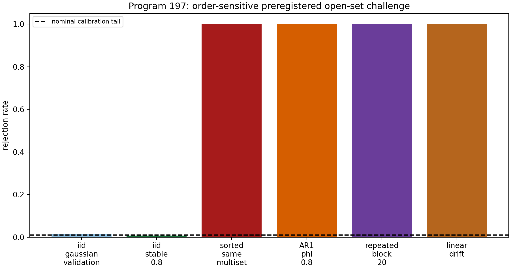

## 10.4 Verdict

**Strong synthetic evidence.** The protocol repairs the exact order blindness
for the declared challenges and retains specificity under a continuous iid
heavy-tailed law. It is not a universal open-set classifier, a proof that a
record has one unique memory mechanism, or external validation.

---

# 11. Program 198 — Minimal process-tensor tomography

## 11.1 Declared family

Let two zero-mean Gaussian phase increments have common variance $v$ and
covariance $c$. Let detector blur multiply every visibility by $b$.

The three contrasts are:

$$
V_1=be^{-v/2},
$$

$$
V_+=be^{-(v+c)},
$$

$$
V_-=be^{-(v-c)}.
$$

$V_-$ is the echo contrast.

## 11.2 Rank theorem

With

$$
\theta=
\begin{pmatrix}
\log b\\v\\c
\end{pmatrix},
\qquad
y=
\begin{pmatrix}
\log V_1\\
\log V_+\\
\log V_-
\end{pmatrix},
$$

the model is

$$
y=
\begin{pmatrix}
1&-1/2&0\\
1&-1&-1\\
1&-1&1
\end{pmatrix}
\theta.
$$

The matrix has determinant $-1$ and rank three. Removing echo leaves two
rows and rank two. In this three-parameter model, fewer than three scalar
contrasts cannot be locally identifying.

The inverse is explicit:

$$
c
=
\frac12(\log V_--\log V_+),
$$

$$
v
=
2\log V_1-\log V_+-\log V_-,
$$

$$
\log b
=
2\log V_1
-\frac12(\log V_++\log V_-).
$$

## 11.3 Noise challenge

For truth

$$
b=0.84,
\qquad
v=0.45,
\qquad
c=0.20
$$

and Gaussian log-visibility noise of standard deviation $0.015$, 6,000
replicates give mean parameter estimates within $2\times10^{-4}$ of truth.
The design condition number is $7.2874$.

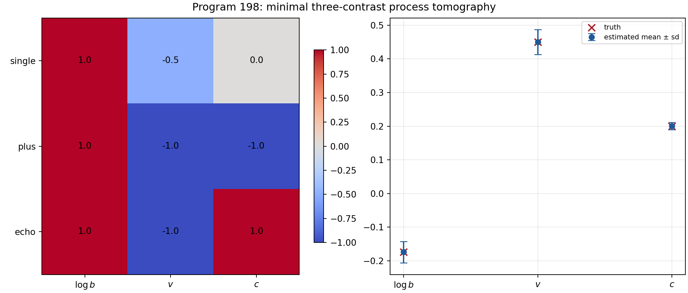

## 11.4 Verdict

**Proven in the declared Gaussian equal-variance family; strong finite-noise
evidence.** Detector blur is separated as an explicit nuisance channel.
Gaussianity, equal variance, and the visibility model are OP assumptions, not
consequences of $A$.

---

# 12. Program 199 — Environment equivalence and causal identifiability

## 12.1 Operational quotient

Define two environments to be $k$-equivalent when they yield the same
probability for every preparation, intervention, and measurement in the
declared $k$-step protocol.

The quotient class, rather than a microscopic dilation coordinate, is the
operationally meaningful object.

Minimal Stinespring dilations of one channel are unique only up to an
environment isometry. Nonminimal dilations have still larger redundancy.

## 12.2 Explicit one-time counterexample

Fix the one-step dephasing factor

$$
\gamma=0.8.
$$

Environment A has phase distribution

$$
\mu_A
=
\frac12\delta_{-a}
+\frac12\delta_a,
\qquad
a=\arccos(0.8).
$$

Environment B has

$$
\mu_B
=
0.9\delta_0+0.1\delta_\pi.
$$

Both have the same characteristic function at one:

$$
\widehat\mu_A(1)
=
\widehat\mu_B(1)
=0.8.
$$

Thus they produce the same one-time dephasing channel. At argument two:

$$
\widehat\mu_A(2)
=
\cos(2a)
=
2(0.8)^2-1
=0.28,
$$

while

$$
\widehat\mu_B(2)=1.
$$

They are distinguished by a suitable multi-time protocol.

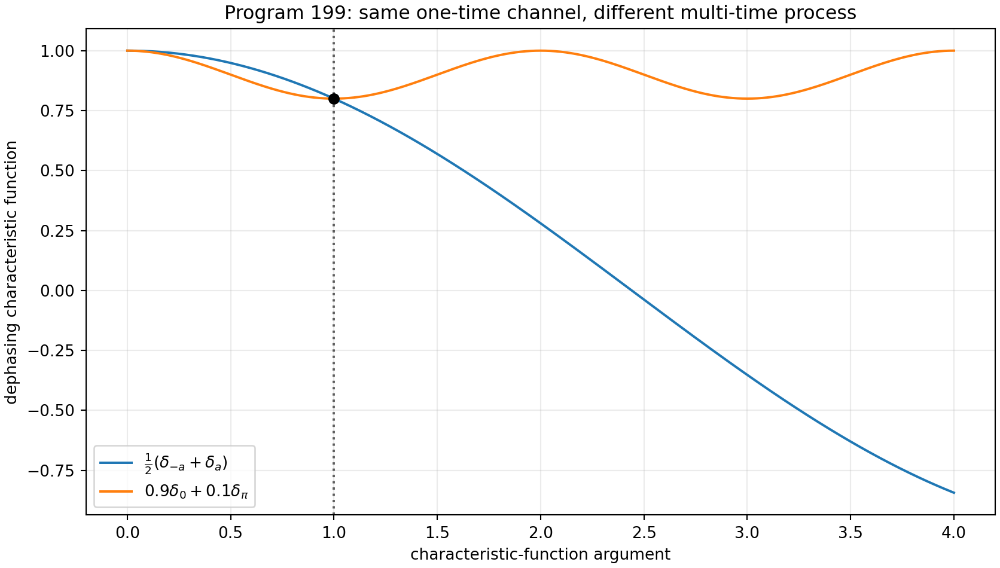

## 12.3 Finite identifiability theorem

A finite set of measured characteristic-function values is a
finite-dimensional affine image of the infinite-dimensional probability
measure simplex. Unless a finite parametric family is independently
justified, its fibres generically contain multiple phase laws.

## 12.4 Verdict

**Proven by construction.** The microscopic environment is not determined by
$A$ or by one reduced channel. Process interventions refine the operational
quotient but finite measurements do not identify an arbitrary environment
distribution. Unidentifiable dilation coordinates cannot receive physical
roles.

---

# 13. Program 200 — Analytic phase-source classification

## 13.1 Source and target

The legacy phase generator is

$$
z_\ell=e^{i\pi/4},
$$

an algebraic eighth root of unity. The strict frequency phase used in the
audit is

$$
z_s=e^{i743/4000}.
$$

Since $i743/4000$ is nonzero algebraic, Lindemann–Weierstrass implies that
$z_s$ is transcendental.

## 13.2 Natural endomorphism no-go

Every continuous group endomorphism

$$
f:U(1)\to U(1)
$$

has the form

$$
f(z)=z^n,
\qquad n\in\mathbb Z.
$$

Therefore $f(z_\ell)$ is always a root of unity and can never equal $z_s$.
The closest value among the distinct order-eight endomorphism images remains
at distance $0.1854831$.

## 13.3 Candidate audit

| Operation class | Produces target? | Target-independent? | Verdict |
|---|---:|---:|---|
| continuous $U(1)$ endomorphism | no | yes | root-of-unity obstruction |
| algebraic functional calculus | no | yes | algebraicity obstruction |
| polynomial interpolation | yes | no | target inserted |
| logarithm and re-exponentiation | yes | no | branch and coefficient inserted |
| constant holomorphic map | yes | no | pure target coding |

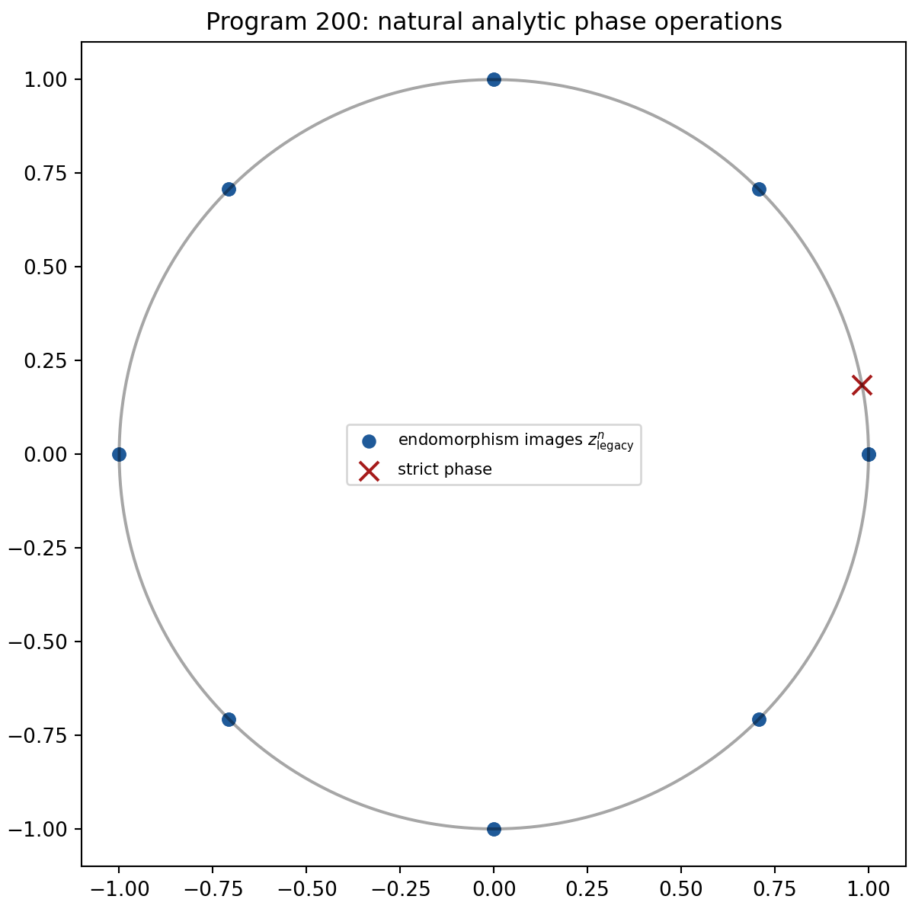

## 13.4 Verdict

**Proven for the declared operation classes.** Arbitrary analytic functions
can interpolate a single source-target pair, so unconstrained analyticity has
no provenance content. No accepted candidate supplies a repository-sourced
origin, target-independent law, and coupling. The strict phase source remains
open.

---

# 14. Program 201 — Scale-free observable catalogue

## 14.1 Orbit

The scale transformation is

$$
(A,t,z)\mapsto(cA,t/c,cz),
\qquad c>0.
$$

It preserves $tA$ and transforms the resolvent covariantly:

$$
(cA+czI)^{-1}
=
\frac1c(A+zI)^{-1}.
$$

## 14.2 Projective observable algebra

Every invariant observable factors through the projective spectral class
$[A]$ together with dimensionless combinations. Executable representatives
include:

- eigenvalue ratios;
- condition number on the positive support;
- spectral probability entropy;
- heat trace at fixed $\tau=t\lambda_{\rm gap}$;
- gap-normalized resolvent at fixed $z/\lambda_{\rm gap}$;
- unitary transition probabilities at fixed $t\lambda_{\rm gap}$;
- the beta-gauge quotient profile $(\eta,\nu,\phi)$.

Noninvariants include:

- the raw spectral gap;
- raw time;
- raw resolvent energy;
- a raw positive $\beta$ representative;
- mass, length, and energy in physical units.

## 14.3 Audit

On the twelve-cycle, $c$ spans $10^{-6}$ through $10^6$. The raw gap changes
by

$$
10^{12}.
$$

The largest residual among the normalized spectrum, condition number,
spectral entropy, dimensionless heat trace, and dimensionless resolvent is
below

$$
8\times10^{-14}.
$$

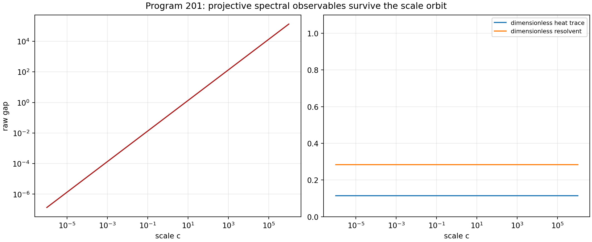

## 14.4 Verdict

**Proven.** Before a physical clock or scale source is supplied, only
projective/dimensionless observables are admissible for strict falsification.
This does not make dimensionful quantities impossible; it shows exactly
where CA or a new scale-charged strict source enters.

---

# 15. Program 202 — Admissible experimental bundle

## 15.1 Intake fields

The frozen gate requires:

1. public source identifier;
2. explicit license;
3. immutable hashes;
4. preparation provenance;
5. raw time-ordered records;
6. units and timestamps;
7. detector calibration;
8. apparatus-memory calibration;
9. reference control;
10. exclusion audit;
11. independent analysis boundary.

## 15.2 Constructed dry-run bundle

An event-level synthetic bundle is generated with 12,000 ordered binary
events. It contains five phase-scan contexts:

- reference;
- single;
- plus;
- echo;
- held-out.

It records sequence number, conditional seconds, context, intervention
coefficients, phase in radians, and binary outcome. The data hash is frozen
in the metadata.

Ten of eleven fields pass. The independent-analysis boundary fails because
the generator and evaluator belong to the same release. The source class is
explicitly

`synthetic_method_validation`.

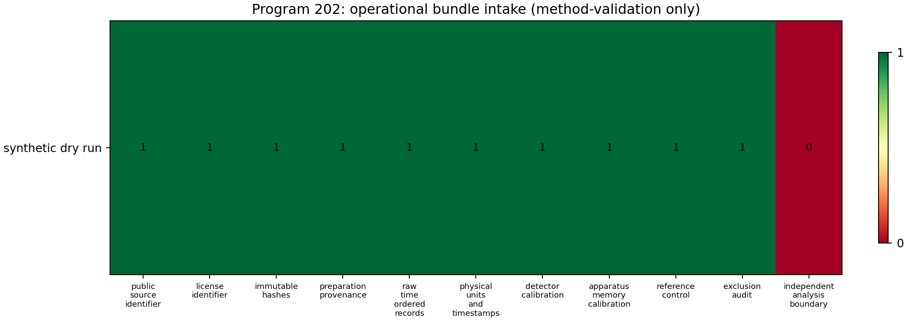

## 15.3 Verdict

**Proven schema and hash audit.** The bundle demonstrates that the operational
gate is executable and that raw order, control, detector, and memory
information can coexist in one record. It is not an external empirical
dataset. No physical validation protocol was run.

---

# 16. Program 203 — One conditional CA + OP prediction

## 16.1 Dependency ledger

The prediction uses:

**$W_0$**

- a self-adjoint spectral generator;
- admissible unitary phase evolution;
- no physical time scale and no environment.

**CA**

- an imported clock

$$
\tau_\ast=0.002\ {\rm s}.
$$

**OP**

- a declared preparation family;
- a two-increment Gaussian environment;
- phase interventions;
- a phase POVM;
- detector blur;
- event-level recording;
- the frozen estimator.

## 16.2 Conditional visibility law

For intervention coefficients $(a_1,a_2)$:

$$
V(a_1,a_2)
=
b\exp\left[
-\frac v2(a_1^2+a_2^2)
-ca_1a_2
\right].
$$

The three training contexts are the Program 198 single, plus, and echo
contrasts. The held-out context is

$$
(a_1,a_2)=(1,0.5).
$$

## 16.3 Result

The event-level phase regressions give:

$$
\widehat b=0.74915,
\qquad
\widehat v=0.28938,
\qquad
\widehat c=0.21595.
$$

The held-out prediction is

$$
\widehat V_{\rm held}=0.56121.
$$

The held-out synthetic record gives

$$
V_{\rm held,obs}=0.59768,
$$

and residual

$$
V_{\rm held,obs}-\widehat V_{\rm held}
=
0.03646.
$$

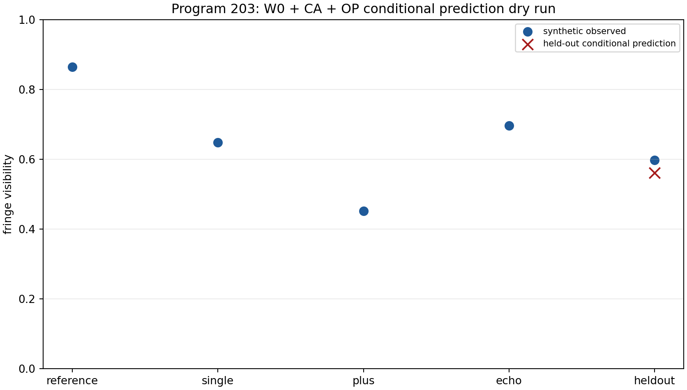

## 16.4 Verdict

**Conditional, strong synthetic method evidence.** The complete
$W_0+\mathrm{CA}+\mathrm{OP}$ path can generate a held-out numerical
prediction with every imported object visible. Because Program 202 did not
admit an independent external bundle, this is a pipeline dry run, not an
empirical FIN prediction.

---

# 17. Cross-program synthesis

## 17.1 The missing operational object is not one scalar

The completed programs support the following typed structure:

$$
\mathfrak O
=
(\mathcal A,\omega,\mathcal P,\mathcal I,\Upsilon,
\mathcal E,\mathcal M,\mathcal D,\mathcal R,\tau_\ast).
$$

Here:

- $\mathcal A$ is the observable algebra;
- $\omega$ is a state, including its central measure;
- $\mathcal P$ is a preparation family;
- $\mathcal I$ is an intervention family;
- $\Upsilon$ is a process tensor or operational equivalence class;
- $\mathcal E$ is an environment representation modulo dilation equivalence;
- $\mathcal M$ is a POVM or instrument;
- $\mathcal D$ is detector response and calibration;
- $\mathcal R$ is a persistent ordered record;
- $\tau_\ast$ is a conditional clock section.

The spectral generator $A$ is necessary inside this structure but does not
determine the remaining entries.

## 17.2 State, scale, and environment are different quotient problems

| Layer | Symmetry or equivalence | Missing selection |
|---|---|---|
| state | inner unitaries and central decomposition | central probability measure |
| compression | positive length rescaling | representative or physical length |
| environment | dilation and finite operational equivalence | microscopic model, if meaningful |
| phase | analytic/naturality class | origin-bearing source law |
| experiment | record equivalence and provenance | independent admissible dataset |

Trying to replace all five by one constant would erase their different
domains and transformation laws.

## 17.3 Observer paradox

The same operator can generate both wave and diffusion dynamics without
contradiction:

$$
U_t=e^{-itA},
\qquad
P_t=e^{-tA}.
$$

The observer paradox arises only if $P_t$ is silently called collapse or
measurement. In the operational model:

- $U_t$ is system amplitude evolution;
- $P_t$ is a classical or Euclidean comparison semigroup;
- measurement probabilities require a state and POVM;
- memory requires a multi-time process;
- apparatus response requires a detector channel;
- observation requires a persistent record.

Programs 198, 199, 202, and 203 explicitly construct these distinctions.

## 17.4 Information versus physics

The dimensionless informational core can support exact spectral and
operational probability structure. It does not turn Shannon information into
thermodynamic entropy, seconds, joules, or metres without conversion data.

Program 201 shows that meaningful pre-clock predictions exist: they are
projective spectral invariants. Program 203 shows how a physical-looking
prediction can be produced after a clock and apparatus are supplied. The
distinction is mathematical, not philosophical.

---

# 18. Falsification matrix

| Proposal | Destructive test | Result | Surviving statement |
|---|---|---|---|
| normalized trace is the unique state | non-simple direct sum | falsified | unique only blockwise |
| $\beta=1$ is strict | positive-scale quotient | falsified | valid gauge representative |
| scale quotient completes bridge | compare $(\eta,\nu,\phi)$ | falsified | invariant mismatch remains |
| fractional certificate is finished | one-engine dependency gate | falsified | partial bounds remain |
| Lean formalization is compiled | local toolchain audit | falsified | source supplied, uncompiled |
| scalar $M$ is complete | equal-$M$ target | falsified | analytic AU cone is complete |
| nominal record count is iid size | regenerative chain | falsified | use observed refresh count |
| marginal features detect memory | multiset-preserving sort | falsified | order features required |
| two visibilities identify process + blur | Jacobian rank | falsified | echo gives minimal rank three |
| one channel identifies environment | two phase laws, same $\gamma$ | falsified | identify operational quotient |
| analytic map sources strict phase | naturality/target-code audit | falsified | no accepted source class |
| raw gap is prediction | $10^{12}$ scale orbit | falsified | projective ratios survive |
| synthetic complete metadata is experiment | independent-boundary gate | falsified | dry-run only |
| dry-run prediction validates FIN physics | external gate | falsified | conditional pipeline works |

---

# 19. Relation to established mathematics

## 19.1 Operator algebras

Program 191 is a finite-dimensional instance of the distinction between
states on simple matrix factors and states on algebras with nontrivial centre.
The FIN-specific content is the dimension vector and the exact interpretation
of $9/5$ versus $17/9$.

## 19.2 Resource conversion

Program 195 is an application and specialization of the
Alberti–Uhlmann two-state transformation theorem. Its new contribution in
this research sequence is the explicit reduction of the reflection-covariant
boundary to three finite candidate points and its reconciliation with the
previous Choi optimization.

## 19.3 Empirical processes and mixing

Program 196 uses regeneration to reduce a declared dependent acquisition
class to conditional iid samples and then applies the DKW inequality. It does
not pretend that DKW holds for arbitrary mixing records.

## 19.4 Process tensors and quantum networks

Programs 198 and 199 use the operational principle that multi-time processes
are identified by interventions, not by a single reduced trajectory. The
minimal three-contrast theorem is specific to the declared Gaussian
dephasing-plus-blur family.

## 19.5 Topological groups and transcendence

Program 200 combines the classification of continuous circle-group
endomorphisms with transcendence of the exponential of a nonzero algebraic
number. It strengthens the earlier algebraic functional-calculus obstruction
by adding a naturality condition.

---

# 20. Failed approaches and open obligations

## 20.1 Central state selection

The strongest symmetry used in Program 191 does not exchange inequivalent
simple blocks. A unique state requires one of:

- an explicit central probability measure;
- a declared representation trace;
- a Morita or categorical principle;
- a physical preparation law.

Selecting the desired expectation first and solving for $a$ is receiver
fitting, not a source theorem.

## 20.2 Rigorous numerics

The Program 193 obstruction is infrastructural, not mathematical. The next
attempt must provide a reproducible directed-rounding environment. Repeating
ordinary floating-point estimates cannot close the certificate.

## 20.3 Proof assistant

The Program 194 source must be compiled against a pinned Lean and Mathlib
version. Until then it is a formalization candidate, not machine-checked
evidence.

## 20.4 External experiment

The synthetic bundle demonstrates format and analysis only. The next
empirical step requires an independently sourced record whose preparation,
apparatus, memory calibration, units, control, license, and hashes are
genuinely documented.

---

# 21. Recommended Programs 204–216

The following thirteen programs are ranked by expected scientific information
gain. Their success criteria are deliberately finite.

## Priority 1 — Program 204: Morita-natural central measure

Classify state assignments under stronger categorical maps: direct sums,
matrix amplification, Morita equivalence, and specified coarse-graining
channels. Determine whether any noncircular axiom uniquely selects uniform
central weight or represented-space trace.

**Success:** a uniqueness theorem with explicit hypotheses.  
**Stop rule:** if different admissible functors yield $9/5$ and $17/9$, publish
the independence theorem.

## Priority 2 — Program 205: eta renormalization cocycle

Attack one bridge atom only: whether a target-independent semigroup or
renormalization cocycle can change the legacy damping exponent $1$ into
$9/5$ while respecting the Program 192 quotient.

**Success:** an explicit cocycle law sourcing $\eta=9/5$.  
**Stop rule:** receiver interpolation or target subtraction is rejection.

## Priority 3 — Program 206: reproducible Arb certificate

Supply a pinned container or local environment with Arb/python-flint. Move
all five fractional-symbol obligations into the same directed-rounding
engine.

**Success:** formal width below 0.03 or a formal lower obstruction.  
**Stop rule:** no mixed ordinary-float/ball promotion.

## Priority 4 — Program 207: compiled Dirichlet library

Pin Lean and Mathlib, repair any source errors, and compile the general
Dirichlet identity, positivity, constant kernel, unitary group, and heat
positivity/stochasticity.

**Success:** clean machine compilation with a reproducible lock file.  
**Stop rule:** do not replace propositions by Boolean assertions.

## Priority 5 — Program 208: tensor conversion and catalysis

Extend Program 195 to two copies or a catalyst. Search for catalytic
conversion outside the one-copy reflection cone and derive necessary
trace-norm constraints.

**Success:** an explicit catalyst or a no-catalysis theorem in a finite class.

## Priority 6 — Program 209: hidden-refresh confidence sequences

Remove observed refresh flags. Construct a sequential confidence procedure
using an estimable minorization, coupling, or martingale condition.

**Success:** finite-sample coverage under a fully observable acquisition
assumption weaker than recorded regeneration.

## Priority 7 — Program 210: sequential temporal conformal detector

Replace the fixed Mahalanobis threshold by online conformal or e-value
calibration. Challenge regime changes, long memory, detector resets, and
adversarial multiset-preserving reorderings.

**Success:** time-uniform false-alarm control in the declared null class.

## Priority 8 — Program 211: finite-shot process confidence region

Put binomial phase-scan likelihoods around Program 198. Derive a confidence
region for $(b,v,c)$ respecting

$$
b\in[0,1],
\qquad
v\ge0,
\qquad
|c|\le v.
$$

**Success:** finite-shot coverage and a power calculation for memory.

## Priority 9 — Program 212: environment moment bounds

Given finitely many measured characteristic values, solve the associated
trigonometric moment problem. Bound unmeasured visibilities without choosing
one microscopic phase law.

**Success:** sharp semidefinite upper and lower bounds.

## Priority 10 — Program 213: formal phase-source no-go

Formalize the continuous-endomorphism and algebraic-functional-calculus
obstructions. Extend the audit to measurable homomorphisms and
origin-bearing cocycles.

**Success:** one theorem covering all repository-admissible natural phase
operations, or one genuine counterexample with source provenance.

## Priority 11 — Program 214: scale-free falsification protocol

Choose one projective spectral observable from Program 201 and preregister a
test that requires no physical scale fit.

**Success:** a frozen dimensionless prediction and exclusion rule independent
of $c$.

## Priority 12 — Program 215: independent experimental bundle

Acquire or document one external record passing all eleven Program 202
fields. Generator and evaluator must be independent, and license and hashes
must be frozen before analysis.

**Success:** the intake validator returns 11/11 and source class `external`.

## Priority 13 — Program 216: first external conditional prediction

Only after Program 215 passes, freeze one $W_0+\mathrm{CA}+\mathrm{OP}$
prediction, estimate nuisance parameters on a training partition, and test a
held-out partition.

**Success:** a preregistered residual or likelihood score on independent data.
The result remains conditional unless CA and OP are separately sourced by
theory.

## Quantitative ranking

| Rank | Program | Estimated probability of decisive progress |
|---:|---:|---:|
| 1 | 204 | 0.88 |
| 2 | 211 | 0.86 |
| 3 | 212 | 0.84 |
| 4 | 207 | 0.82 |
| 5 | 210 | 0.80 |
| 6 | 205 | 0.76 |
| 7 | 209 | 0.74 |
| 8 | 206 | 0.72 |
| 9 | 214 | 0.70 |
| 10 | 208 | 0.66 |
| 11 | 213 | 0.64 |
| 12 | 215 | 0.42 |
| 13 | 216 | 0.30 |

The external programs rank lower only because their prerequisites are not
currently present. A rigorous independence or no-go theorem counts as
decisive progress.

---

# 22. Final conclusion

Programs 191–203 identify the current mathematical boundary more sharply
than a search for another fitted number could.

The finite spectral generator is a genuine common engine. It supports exact
Dirichlet energy, wave evolution, heat evolution, Green response,
scale-free observables, and finite operational probability models.

However:

- the state on a non-simple algebra requires a central measure;
- positive compression requires a scale section;
- phase conversion requires an origin-bearing source law;
- environmental dynamics are identified only modulo an operational quotient;
- process memory requires interventions;
- apparatus response requires calibration;
- physics requires an independent record with units and provenance.

These missing objects can be constructed conditionally and tested. Programs
198, 202, and 203 demonstrate the full logic without concealing imports. The
right next goal is not to call those imports strict FIN, but to either derive
them, bound their operational equivalence classes, or test conditional
predictions on admissible external data.

The deepest interpretation surviving this round is:

**FIN is a dimensionless spectral-information core whose route to physics is
an operational quotient-and-section problem. The core already determines
nontrivial dynamics and conversion geometry, but states, scale, environment,
apparatus, and empirical records are independent typed objects until a
theorem or experiment fixes them.**

---

# Selected mathematical references

1. P. M. Alberti and A. Uhlmann, *Stochasticity and Partial Order: Doubly
   Stochastic Maps and Unitary Mixing*, D. Reidel, 1982.
2. W. F. Stinespring, “Positive functions on C*-algebras,” *Proceedings of
   the American Mathematical Society* 6 (1955), 211–216.
3. A. Dvoretzky, J. Kiefer, and J. Wolfowitz, “Asymptotic minimax character of
   the sample distribution function and of the classical multinomial
   estimator,” *Annals of Mathematical Statistics* 27 (1956), 642–669.
4. P. Massart, “The tight constant in the Dvoretzky–Kiefer–Wolfowitz
   inequality,” *Annals of Probability* 18 (1990), 1269–1283.
5. E. B. Davies, *Heat Kernels and Spectral Theory*, Cambridge University
   Press, 1989.
6. R. Bhatia, *Matrix Analysis*, Springer, 1997.
7. F. A. Pollock et al., “Operational Markov condition for quantum
   processes,” *Physical Review Letters* 120 (2018), 040405.
8. G. Chiribella, G. M. D’Ariano, and P. Perinotti, “Theoretical framework
   for quantum networks,” *Physical Review A* 80 (2009), 022339.

---

# Archival statement

Suggested citation:

Żuchowski, K. (2026). *FIN Programs 191–203: Reference States, Operational
Quotients, and Conditional Prediction* (FIN Research Monograph, Release
10.18; Version 1.0.0) [Preprint]. Zenodo.

