# FIN Programs 204–216

## Categorical Measures, Perfect References, and External Falsification Gates

**FIN Research Monograph — Release 10.19**

**Author:** Krzysztof Żuchowski  
**Affiliation:** Independent Researcher — Fractal Information Theory Project  
**ORCID:** 0009-0002-0909-3613  
**Date:** 27 July 2026  
**Resource type:** Publication — Preprint  
**Version:** 1.0.0  
**Language:** English  
**License:** CC BY 4.0

---

# Abstract

This monograph reports thirteen executed research programs, numbered 204
through 216. They continue the study of the dimensionless FIN spectral core
at the point where a self-adjoint operator already generates wave, heat, and
Green dynamics, but a state, selector, physical scale, apparatus, and
independent empirical record are not generated by the spectral theorem.

The first result sharpens the central-state problem. If the simple summands of
a finite semisimple algebra are required to be interchangeable under a
Morita-permutation principle, the unique normalized central measure is
uniform. For the FIN dimension vector $(1,2,2,2,2)$ this gives the exact
expectation $9/5$. The normalized represented-space trace instead gives
$17/9$ and violates the added permutation principle. This is conditional
uniqueness, not a strict FIN derivation. Moreover, no automorphism-natural
state assignment can be contravariantly natural under all unital
$*$-homomorphisms: the map

$$
f:\mathbb C^2\longrightarrow\mathbb C^3,
\qquad
f(a,b)=(a,b,b)
$$

pulls the uniform state on $\mathbb C^3$ back to $(1/3,2/3)$, whereas
automorphism naturality on $\mathbb C^2$ demands $(1/2,1/2)$.

The second result classifies continuous one-parameter exponent cocycles.
Every continuous solution of

$$
b(t+s)=b(t)+b(s)
$$

is $b(t)=\kappa t$. Moving the legacy exponent $1$ to the strict exponent
$9/5$ therefore fixes only $\kappa t_*=4/5$, not either factor. Multiplicative
and fixed-point flows have the same nonselection defect. The strict exponent
cannot be recovered from semigroup form alone.

The third principal result concerns symmetry resources. A catalyst invariant
under the reflection cannot repair a violated one-copy
Alberti–Uhlmann inequality. In contrast, the perfectly asymmetric reference

$$
\Pi_+=\frac{I+\sigma_x}{2}
$$

supports an explicit covariant measure-and-prepare channel that maps the
declared source to any prescribed target while returning $\Pi_+$ exactly.
The construction is a valid operational completion, but it supplies a
perfect orientation bit. It neither derives that bit from the strict kernel
nor discharges the strict-core selector obstruction QW-2191.

The round also supplies a hidden-mixing confidence theorem using Berbee
coupling and thinning; a time-uniform conformal e-process with exact null
control under fresh calibration; conservative finite-shot process-tomography
regions; and a sharp trigonometric moment interval. Given a real symmetric
environmental phase law with first moment $c_1=4/5$, positivity of

$$
T_2=
\begin{pmatrix}
1&c_1&c_2\\
c_1&1&c_1\\
c_2&c_1&1
\end{pmatrix}
$$

gives the exact and attainable interval

$$
\frac{7}{25}\le c_2\le 1.
$$

A phase-source hierarchy extends the naturality obstruction from continuous
circle homomorphisms to Borel homomorphisms and trivial-action continuous
one-cocycles. None maps the order-eight legacy phase to the non-torsion
strict phase without target-coded data.

Finally, a scale-free spectral fingerprint is preregistered and challenged.
It is invariant over twelve decades of operator scaling and under node
relabeling, accepts a one-percent edge perturbation, and rejects a ten-percent
perturbation, the nearest-neighbour cycle, and the raw legacy generator. This
is an internally falsifiable operator protocol, not experimental physics. A
fresh audit finds no independent external record satisfying the frozen
eleven-field intake gate. The external prediction remains locked.

The proof infrastructure is reported without concealment. A dependency-free
Lean 4 core probe compiles in the local toolchain and 200 exact rational
Dirichlet witnesses pass. The proposed general graph library does not compile
because Mathlib is not installed in the clean environment. Arb and
python-flint remain unavailable, and Docker server access is denied. No
formal sub-three-percent fractional certificate is claimed.

No non-premise strict selector, canonical physical unit,
target-independent strict exponent or compression source, completed
legacy-to-strict bridge, legacy role transfer, role-bearing
$L_{\rm total}$, external physical validation, or Theory-of-Everything
closure is asserted.

---

# 1. Executive summary

## 1.1 Outcome table

| Program | Constructed object | Main result | Confidence |
|---|---|---|---|
| 204 | `MoritaCentralTrace` | uniform central weights are unique under an added Morita-permutation axiom; all-homomorphism naturality is impossible | Proven, conditional premise |
| 205 | `ExponentCocycleModuli` | continuous flow form does not select $9/5$ | Proven in class |
| 206 | `CertificationEnvironmentContract` | reproducible Arb contract frozen; engine unavailable | Proven audit |
| 207 | `FormalBuildContract` | Lean core probe compiles; general Mathlib library remains open | Machine-checked core; general proof open |
| 208 | `PerfectZ2ReferenceCatalyst` | invariant catalysts do not help; a perfect asymmetric bit enables exact conversion | Proven |
| 209 | `CoupledThinningFrame` | valid hidden-mixing bound under calibrated geometric mixing | Proven conditionally |
| 210 | `IndependentBlockConformalEProcess` | exact time-uniform null test with strong synthetic power | Proven null law; strong evidence |
| 211 | `FiniteShotProcessRegion` | simultaneous finite-shot region and memory test | Proven construction; strong evidence |
| 212 | `ToeplitzMomentInterval` | sharp $c_2\in[7/25,1]$ | Proven |
| 213 | `PhaseNaturalityHierarchyCertificate` | phase no-go extends through measurable homomorphisms | Proven in declared hierarchy |
| 214 | `ProjectiveSpectralFingerprintProtocol` | scale-free operator fingerprint frozen and challenged | Proven invariance; finite computation |
| 215 | `IndependentExternalBundleRequest` | no local candidate passes the independent 11/11 gate | Proven local audit |
| 216 | `ConditionalPredictionLock` | external prediction correctly not executed | Proven gate status |

## 1.2 Central conclusion

The round identifies three mathematically different kinds of missing data.

First, **categorical section data** are needed when the spectral algebra has
nontrivial centre. A state on each matrix block does not determine the weights
between blocks.

Second, **asymmetry resources** are needed when an operation must choose a
direction in a reflection orbit. The perfect reference construction proves
that such a resource is sufficient. The invariant-catalyst theorem proves
that symmetry-preserving ancillary data are insufficient.

Third, **operational and empirical data** are needed to turn a projective
spectral signature into a physical claim. The operator determines an
internally testable dimensionless fingerprint; it does not determine which
apparatus reconstructs it or provide an independent measurement record.

The minimal operational extension visible after Programs 204–216 is therefore
not a new kernel. It is a typed package

$$
\mathfrak E=
(\mathcal A,\rho,\Gamma,A,\mathcal I,\mathcal C,\mathcal M,\mathcal R),
$$

where $\mathcal A$ is an observable algebra, $\rho$ a state, $\Gamma$ a
symmetry action, $A$ the spectral generator, $\mathcal I$ an intervention
family, $\mathcal C$ a clock and scale calibration, $\mathcal M$ a
measurement instrument, and $\mathcal R$ an independently sourced ordered
record. Programs 204, 208, and 214–216 show respectively why $\rho$, an
orientation resource inside $\mathcal I$, and $\mathcal R$ cannot be silently
recovered from $A$.

## 1.3 Strongest new theorem

The most conceptually decisive result is the perfect-reference dichotomy.
Let $\Theta(\rho)=R\rho R$ be the $\mathbb Z_2$ reflection. If a catalyst
$\kappa$ is invariant, then for every $q\ge0$,

$$
\left\|
\rho\otimes\kappa-q\,\Theta(\rho)\otimes\kappa
\right\|_1
=
\left\|\rho-q\,\Theta(\rho)\right\|_1.
$$

Any violated trace-norm conversion inequality remains violated. Symmetric
catalysis cannot manufacture a selector.

For $\Pi_\pm=(I\pm\sigma_x)/2$, define

$$
\mathcal E(X)=
\operatorname{tr}[(I\otimes\Pi_+)X]\,\tau\otimes\Pi_+
+
\operatorname{tr}[(I\otimes\Pi_-)X]\,\Theta(\tau)\otimes\Pi_-.
$$

This channel is completely positive, trace preserving, and covariant under
$R\otimes R$. For every source $\rho$,

$$
\mathcal E(\rho\otimes\Pi_+)=\tau\otimes\Pi_+.
$$

Thus a perfect reference is sufficient and exactly reusable. It is not free:
its two group-orbit states are orthogonal, so it contains a full classical
orientation bit. The selector problem has been converted into a resource
provenance problem rather than solved by the strict kernel.

## 1.4 What remains blocked

- Morita-permutation invariance is not sourced as a preparation law.
- No flow principle selects the exponent increment $4/5$.
- The full Arb certificate has not run.
- The Mathlib-dependent Lean library has not compiled.
- No strict source supplies the perfect reference orientation.
- The hidden-mixing theorem still needs a calibrated lower refresh bound.
- No strict phase source survives the naturality hierarchy.
- No canonical dimensional unit is exported.
- No external bundle satisfies all eleven frozen fields.
- External prediction and physical validation remain unexecuted.

---

# 2. Scope and mathematical core

## 2.1 Kernel split

The legacy and strict kernels are kept separate:

$$
K_{\rm legacy}(d)=
\alpha_{\rm geo}
\frac{\cos(\omega_\ell d+\phi_\ell)}
{1+\beta_{\rm tors}d},
$$

where

$$
\omega_\ell=\frac{\pi}{4},
\quad
\phi_\ell=\frac{\pi}{6},
\quad
\beta_{\rm tors}=0.01,
\quad
\alpha_{\rm geo}=4\ln2,
$$

and

$$
K_{\rm strict}(d)=
\frac{\cos(\omega_s d+\phi_s)}
{1+\beta_s d^{\eta_s}},
$$

where

$$
\omega_s=0.18575,
\quad
\phi_s=0.16250,
\quad
\beta_s=1,
\quad
\eta_s=\frac95.
$$

The legacy kernel remains an intermediate bridge kernel. The strict kernel is
the later enriched working kernel. Programs 205 and 213 ask whether exponent
and phase could arise from natural transformation laws. Their negative
answers do not demote either kernel, identify the kernels, or authorize
transfer of legacy physical roles.

## 2.2 Spectral engine

On a finite vertex set, let $W=W^*$ be a nonnegative symmetric weight matrix
with constant row sum $s$. Define

$$
A=sI-W.
$$

Then

$$
\langle f,Af\rangle
=
\frac12\sum_{x,y}W_{xy}|f_x-f_y|^2\ge0.
$$

Consequently one operator generates

$$
U_t=e^{-itA},
\qquad
P_t=e^{-tA},
\qquad
G_z=(A+zI)^{-1}.
$$

Here $U_t$ is unitary wave evolution, $P_t$ is a positivity-preserving
stochastic heat semigroup, and $G_z$ is a screened Green operator for $z>0$.
This common origin is theorem-level finite operator theory. It does not
choose a state, an arrow of time, a dimensional clock, or a measurement
record.

For the twelve-node strict circulant used in Program 214,

$$
s=1.6603072787660986,
$$

numerically consistent with the previously recorded value
$1.660307278766099$.

## 2.3 Confidence convention

The report uses four levels.

- **Proven:** an analytic proof or an exact finite derivation is supplied.
- **Proven, computer-assisted:** the claim is finite and covered by executable
  checks with frozen inputs.
- **Strong evidence:** repeated numerical experiments support a clearly
  scoped proposition but do not replace a proof.
- **Open or conditional:** a premise, toolchain, external record, or theorem
  remains absent.

Synthetic data validate methods only. Local provenance audits validate only
the local workspace. A contract is not a certificate, and a preregistration
is not a successful experiment.

## 2.4 Reproducible methodology

All Programs 204–216 are generated by one deterministic Python suite with
seed `20260727`. The release contains machine-readable results, one figure per
program, immutable protocol contracts, two Lean sources, and 77 regression
and scientific-boundary tests. Those tests check not only numerical values
but also negative claims: no selector, unit, bridge, role transfer,
$L_{\rm total}$, external validation, or Theory-of-Everything conclusion may
appear in the result object.

---

# 3. Program 204 — Morita-compatible central measures

## 3.1 Question

For

$$
\mathcal A=\bigoplus_{i=1}^mM_{d_i}(\mathbb C),
$$

inner-unitary invariance forces a state to have the form

$$
\rho(a_1,\ldots,a_m)
=
\sum_{i=1}^m p_i\frac{\operatorname{Tr}(a_i)}{d_i},
\qquad
p_i\ge0,
\quad
\sum_i p_i=1.
$$

Can a categorical principle remove the central simplex $(p_i)$?

## 3.2 Conditional uniqueness theorem

Assume in addition that all simple summands are interchangeable under a
declared Morita-permutation action and that the state is invariant under this
action. Every transposition gives $p_i=p_j$. Therefore

$$
p_i=\frac1m.
$$

For $(d_i)=(1,2,2,2,2)$, the selected block-dimension expectation is

$$
\sum_i p_id_i
=
\frac{1+2+2+2+2}{5}
=
\frac95.
$$

The finite constraint matrix has rank $4$ and nullity $1$, confirming
uniqueness after normalization.

The represented-space normalized trace instead uses

$$
p_i=\frac{d_i}{\sum_jd_j}
$$

and yields

$$
\sum_i p_id_i
=
\frac{1+4+4+4+4}{9}
=
\frac{17}{9}.
$$

Its maximum residual under permutations of the five central labels is
$1/9$.

## 3.3 Global naturality no-go

The preceding result depends on the chosen morphism class. There is no state
assignment that is simultaneously automorphism-natural on every
$\mathbb C^n$ and contravariantly natural under every unital
$*$-homomorphism.

Automorphism naturality makes the state on $\mathbb C^2$ uniform. It also
makes the state on $\mathbb C^3$ uniform. For

$$
f(a,b)=(a,b,b),
$$

the pullback of the latter has weights $(1/3,2/3)$, contradicting
$(1/2,1/2)$. The exact defect is $1/6$.

## 3.4 Falsification and verdict

The value $9/5$ is not derived merely by saying “Morita invariance.”
Morita equivalence preserves representation categories, not a canonical
normalization of states. The report therefore exposes the required
permutation-invariance axiom explicitly.

**Verdict — Proven, conditional.** The added axiom is sufficient and uniquely
selects $9/5$. Current strict FIN does not supply it as a physical
preparation rule.

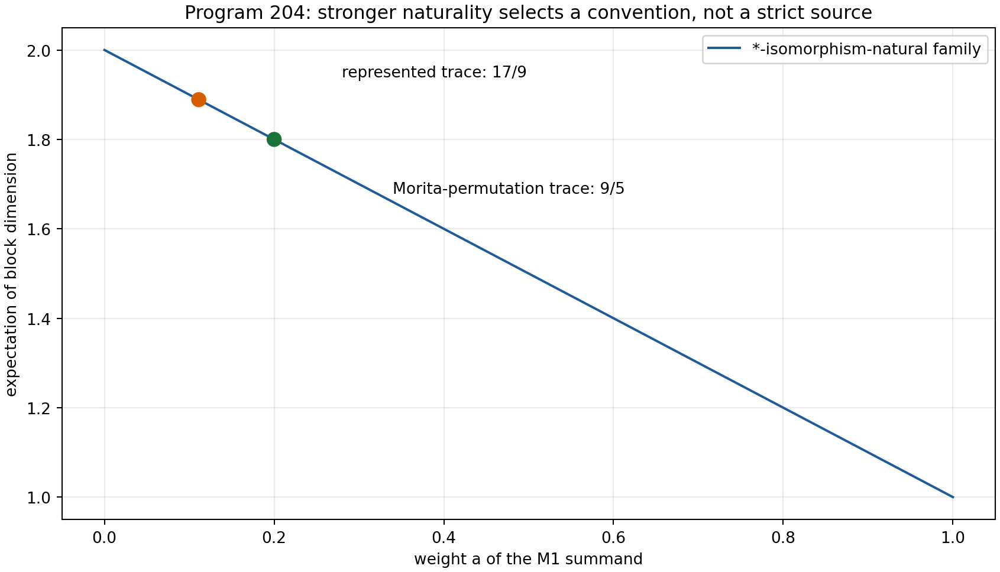

---

# 4. Program 205 — Exponent cocycles and the nonselection of $9/5$

## 4.1 Additive cocycle theorem

Suppose completion acts on the denominator exponent through

$$
\eta(t)=\eta_0+b(t)
$$

and composition requires

$$
b(t+s)=b(t)+b(s).
$$

Continuity gives the Cauchy-equation classification

$$
b(t)=\kappa t.
$$

Starting from $\eta_0=1$ and reaching $\eta_*=9/5$ requires

$$
\kappa t_*=\frac45.
$$

The suite displays 601 distinct rate-time pairs satisfying this equation.
The maximum numerical cocycle residual is
$4.44\times10^{-16}$.

## 4.2 Alternative flow families

Three natural alternatives were tested.

1. A multiplicative flow
   $\eta(t)=\eta_0e^{\kappa t}$ fixes only
   $\kappa t_*=\log(9/5)$.
2. A stable fixed-point flow selects $9/5$ only by inserting it as the fixed
   point parameter.
3. Multiplication by a monomial $d^{b}$ changes the exponent by $b$, but the
   required $b=4/5$ remains unsourced.

None turns semigroup form into a value-selection theorem.

## 4.3 Separation from the beta gauge

Under the positive length-scale action used previously,

$$
x=\beta^{1/\eta}d,
\qquad
\nu=\frac{\omega}{\beta^{1/\eta}},
$$

$\eta$ is invariant. An exponent flow is therefore a new typed dynamical
layer, not a reparametrization of $\beta$.

**Verdict — Proven in the continuous one-parameter class.** The flow law
provides an interpolation family but not a target-independent source for
$9/5$.

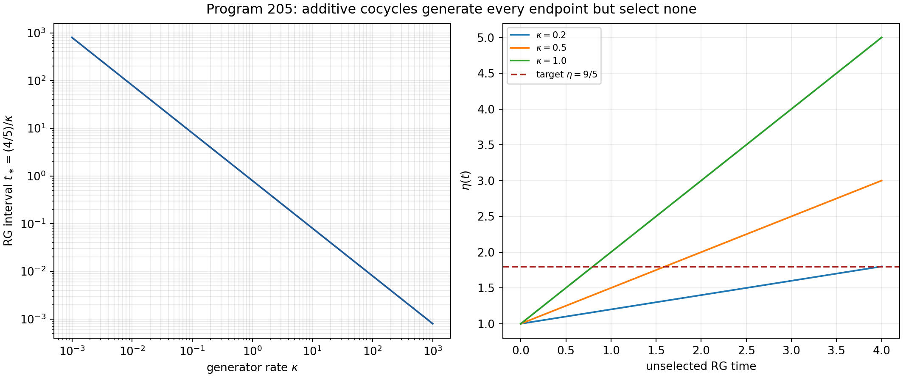

---

# 5. Program 206 — Arb certification environment

The missing common directed-rounding computation was converted into a frozen
`CertificationEnvironmentContract`. The contract records required package
versions, hashes, entry points, rounding mode, input schema, and acceptance
criterion.

The local audit found:

- `python-flint`: absent;
- an `arb` executable: absent;
- Docker command-line client: present;
- Docker server: inaccessible because the socket denies permission;
- inherited worst enclosure: $0.6129831478193526$;
- required threshold: $0.03$;
- formal five-node run: not executed.

These observations distinguish three statements that are often conflated:

1. a mathematical certificate specification exists;
2. a compatible implementation exists;
3. the certificate has been run and passed.

Only the first is established here.

**Verdict — Proven environment audit; certificate open.** No sub-three-percent
formal enclosure is claimed.

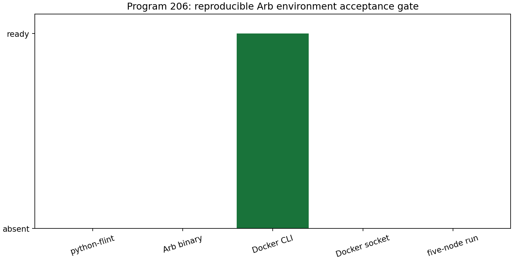

---

# 6. Program 207 — Lean build closure

## 6.1 Two proof layers

The study separates a dependency-free core from a general graph library.
The local Lean 4.28.0 compiler machine-checks the core probe. Its exact
evaluation returns `27`, and its proposition is discharged by `decide`.

The general source states the intended finite weighted-graph objects:

- the Dirichlet quadratic identity;
- positive semidefiniteness;
- the constant vector in the kernel;
- unitarity of $e^{-itA}$;
- entrywise nonnegativity and stochasticity of $e^{-tA}$.

In a clean environment it fails immediately because the `Mathlib` module is
not present. This is a dependency failure before theorem verification, not
evidence that the theorems are false.

## 6.2 Exact witness pack

Independently of Lean, 200 new rational weighted-circulant cases were checked
exactly. In every case,

$$
f^\mathsf TAf
=
\frac12\sum_{x,y}W_{xy}(f_x-f_y)^2
\ge0.
$$

Exact rational arithmetic eliminates floating-point ambiguity for these
witnesses.

## 6.3 Verdict

**Machine-checked:** dependency-free core probe.  
**Exactly checked:** 200 finite rational witnesses.  
**Open:** general Mathlib-based library.

The report does not call the entire Dirichlet library formally verified.

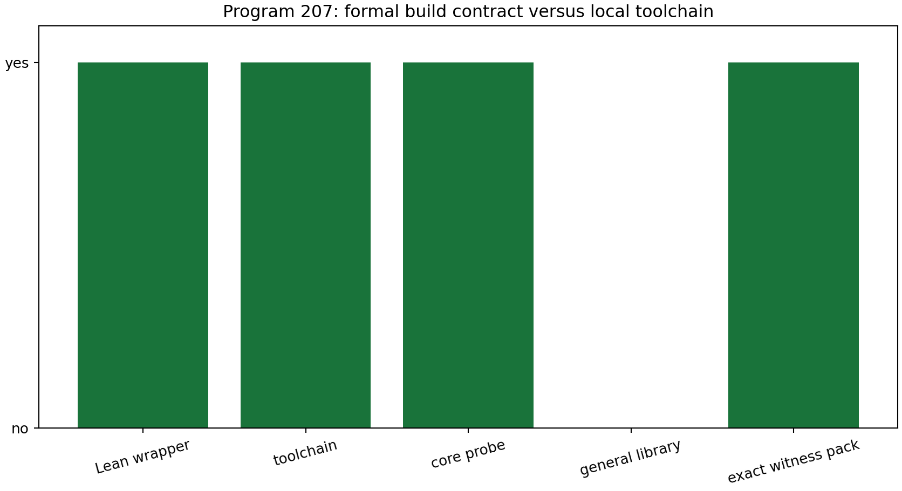

---

# 7. Program 208 — Catalytic symmetry breaking

## 7.1 Invariant-catalyst no-help theorem

Let $\Theta(\rho)=R\rho R$ and suppose
$\Theta(\kappa)=\kappa$. If deterministic covariant conversion is tested by
the family of trace-norm inequalities, tensoring both source and target with
$\kappa$ changes neither side:

$$
\|(\rho-q\Theta\rho)\otimes\kappa\|_1
=
\|\rho-q\Theta\rho\|_1\|\kappa\|_1
=
\|\rho-q\Theta\rho\|_1.
$$

Therefore an invariant catalyst cannot repair any violated member of the
family.

## 7.2 Perfect-reference construction

Let reflection be conjugation by $\sigma_z$ and let

$$
\Pi_\pm=\frac{I\pm\sigma_x}{2}.
$$

Reflection exchanges $\Pi_+$ and $\Pi_-$. For any target $\tau$, the channel

$$
\mathcal E(X)=
\operatorname{tr}[(I\otimes\Pi_+)X]\,\tau\otimes\Pi_+
+
\operatorname{tr}[(I\otimes\Pi_-)X]\,\Theta(\tau)\otimes\Pi_-
$$

is a covariant measure-and-prepare channel. The finite Choi-equivalent tests
give zero trace-preservation, covariance, and mapping residuals.

For the previously impossible conversion from Bloch coordinates $(0.6,0)$
to $(0.6,0.8)$,

$$
\mathcal E(\rho_{\rm source}\otimes\Pi_+)
=
\rho_{\rm target}\otimes\Pi_+.
$$

The target can be arbitrary.

## 7.3 Imperfect references

A scan of 100 imperfect transverse catalyst radii $r_c<1$ leaves the best
necessary trace-norm margin at

$$
-0.808036981970047.
$$

At $r_c=1$, the margin reaches numerical zero
$-1.82\times10^{-12}$, consistent with the explicit channel.
This scan is a necessary-condition falsification, not a full classification
of approximate catalysis.

## 7.4 Interpretation

The perfect reference is not a hidden derivation of orientation. Its orbit
states are orthogonal and can be measured without error. It supplies the
missing orientation bit as an operational resource. This precisely explains
why the construction succeeds and why it does not solve QW-2191.

**Verdict — Proven.** Symmetric catalysts are useless in the declared test;
a perfect asymmetric reference is sufficient but externally supplied.

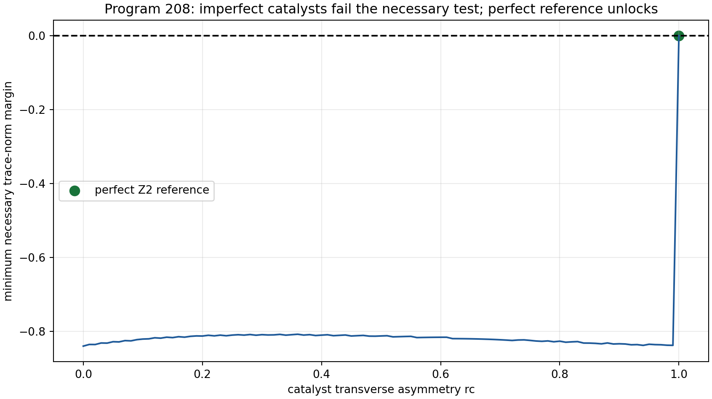

---

# 8. Program 209 — Hidden mixing with calibrated coupling

## 8.1 Theorem

Assume an unobserved-refresh process satisfies the certified bound

$$
\beta(k)\le(1-p_0)^k
$$

for known $p_0>0$. Thin the record at lag $L$, leaving $m$ observations.
Berbee coupling and the Dvoretzky–Kiefer–Wolfowitz inequality give

$$
\Pr(D_m>\varepsilon)
\le
2e^{-2m\varepsilon^2}
+
(m-1)\beta(L).
$$

This removes the need to observe the refresh flags. It does not remove the
need to calibrate a mixing-rate lower bound.

## 8.2 Challenge

For $n=10000$, calibrated $p_0=0.05$, and true refresh probability $0.06$,
the rule selects

$$
L=166,
\qquad
m=61,
\qquad
(m-1)(1-p_0)^L=0.0120301.
$$

Across 240 stable-law simulations, treating all 10000 entries as independent
gives coverage $0.845833$. The coupling-valid construction gives coverage
$1.0$, but its mean exponent-interval width is $6.58742$, compared with
$0.330159$ for the invalid nominal method.

The result is deliberately uncomfortable: rigor is recovered by paying a
large information cost. The theorem prevents false precision rather than
manufacturing power.

**Verdict — Proven under the calibrated mixing envelope; strong numerical
coverage evidence.**

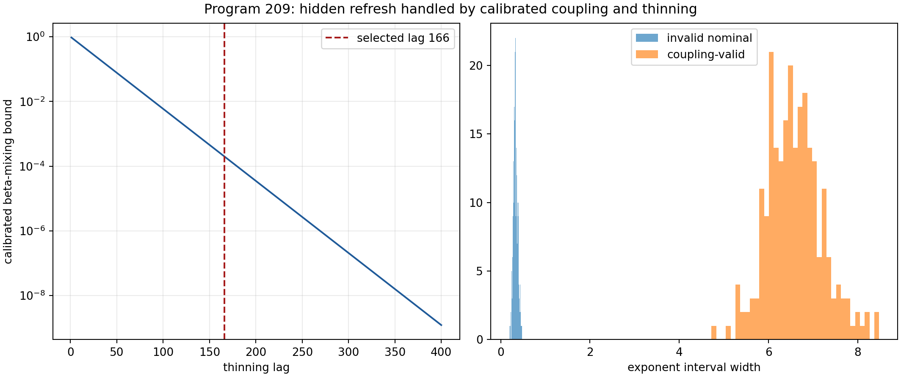

---

# 9. Program 210 — A time-uniform conformal e-process

## 9.1 Construction

At sequential time $t$, draw a fresh independent calibration block of
$m=15$ null records and one test record. Let

$$
r_t=
1+\#\{j:S_{tj}\ge S_t^{\rm test}\}.
$$

Under a continuous iid null, $r_t$ is uniform on
$\{1,\ldots,m+1\}$. With

$$
H_{m+1}=\sum_{r=1}^{m+1}\frac1r,
\qquad
e_t=\frac{m+1}{H_{m+1}r_t},
$$

one has $\mathbb E[e_t]=1$. Fresh independence makes

$$
E_T=\prod_{t=1}^Te_t
$$

a nonnegative martingale. Ville's inequality gives

$$
\Pr_0\left(\sup_TE_T\ge\frac1\alpha\right)\le\alpha.
$$

## 9.2 Synthetic challenge

At $\alpha=0.05$, horizon $20$, and 200 streams per model, the
time-uniform rejection rates are:

| Model | Rejection rate | Mean crossing time |
|---|---:|---:|
| iid Gaussian | 0.02 | 9 among crossings |
| sorted | 1.00 | 2 |
| AR(1), coefficient 0.8 | 1.00 | 2 |
| repeated blocks | 1.00 | 2 |
| drift | 1.00 | 2 |

The exact null theorem is stronger than the simulation. The power figures are
only synthetic evidence for the declared score.

## 9.3 Limitation

Fresh calibration makes the conditional expectation argument transparent but
is experimentally expensive. Reusing one calibration set destroys the
simple product-martingale proof and requires a new e-value construction.

**Verdict — Proven null process; strong synthetic alternative power.**

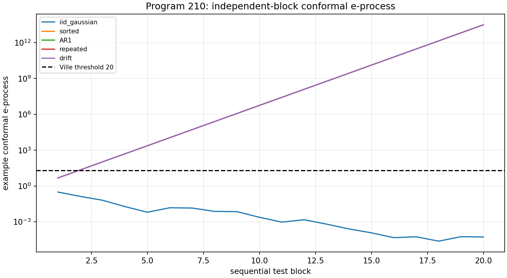

---

# 10. Program 211 — Finite-shot process tomography

## 10.1 Observation model

The minimal Gaussian two-step frame uses single, plus, and echo contexts.
Each context is measured at phases $0$ and $\pi$, producing six independent
binomial counts. Their contrasts estimate three visibilities, which determine
detector blur $b$, increment variance $v$, and temporal covariance $c$ through
a log-linear map.

## 10.2 Simultaneous region

Each count receives a two-sided Clopper–Pearson interval with Bonferroni
allocation over the six observations. Monotone interval arithmetic transports
these bounds through contrasts and logarithms. The result is intersected with

$$
0<b\le1,
\qquad
v\ge0,
\qquad
|c|\le v.
$$

Because each primitive interval has exact binomial coverage and the transport
contains every compatible parameter value, the simultaneous region inherits
the declared familywise guarantee.

## 10.3 Simulation

For truth

$$
(b,v,c)=(0.84,0.45,0.20),
$$

1000 shots per phase and context, and 600 repetitions:

- all 600 physical regions are nonempty;
- simultaneous empirical coverage is $1.0$;
- memory-detection power is $1.0$;
- mean widths for $(\log b,v,c)$ are respectively
  $0.652869$, $0.928039$, and $0.275170$.

The excess over nominal coverage is consistent with conservative
Bonferroni and interval transport.

**Verdict — Proven coverage construction within the Gaussian visibility
model; strong finite-shot evidence.**

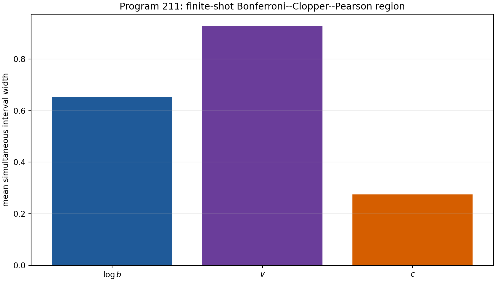

---

# 11. Program 212 — Sharp environmental moment bounds

Let $\mu$ be a real symmetric probability measure on the circle and

$$
c_k=\int\cos(k\theta)\,d\mu(\theta).
$$

Positive definiteness requires the order-two Toeplitz matrix

$$
T_2=
\begin{pmatrix}
1&c_1&c_2\\
c_1&1&c_1\\
c_2&c_1&1
\end{pmatrix}
$$

to be positive semidefinite. Its determinant factors as

$$
\det T_2=(1-c_2)(1+c_2-2c_1^2).
$$

Together with the principal minors this yields

$$
2c_1^2-1\le c_2\le1.
$$

For $c_1=4/5$,

$$
\frac7{25}\le c_2\le1.
$$

Both bounds are sharp.

- The lower bound is attained by equal atoms at
  $\pm\arccos(4/5)$.
- The upper bound is attained by mass $9/10$ at $0$ and $1/10$ at $\pi$.

The minimum numerical eigenvalue over a dense interval grid is
$-2.52\times10^{-16}$, consistent with roundoff at the semidefinite boundary.

This theorem bounds an unmeasured two-time visibility from a measured
one-time visibility. It does not select a microscopic environment within the
interval.

**Verdict — Proven and sharp.**

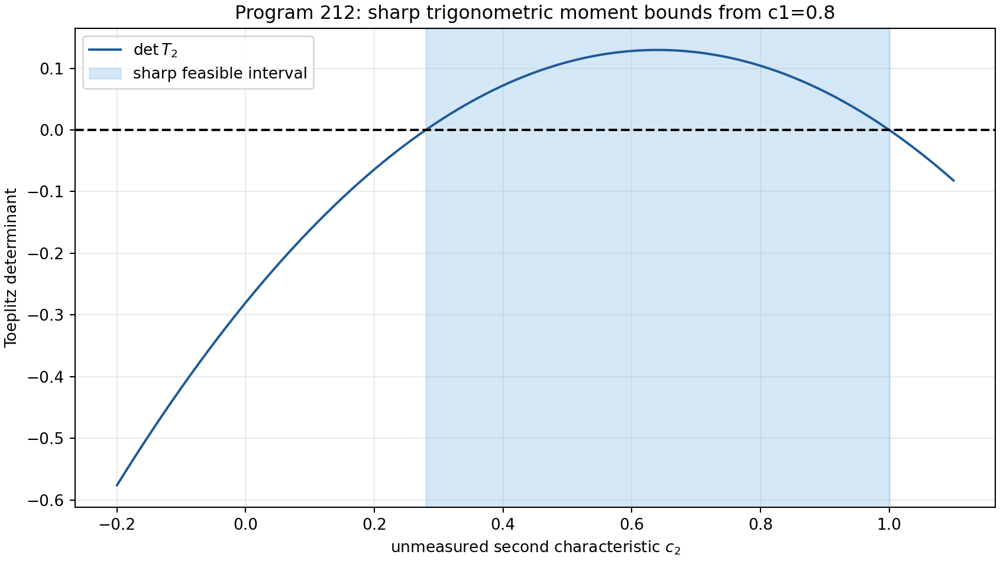

---

# 12. Program 213 — Phase naturality hierarchy

## 12.1 Continuous homomorphisms

Every continuous group homomorphism

$$
h:U(1)\longrightarrow U(1)
$$

has the form $h(z)=z^n$ for some integer $n$. Program 213 studies the
oscillatory step datum

$$
z_\ell=e^{i\omega_\ell}=e^{i\pi/4},
$$

which has order eight. This is distinct from the legacy offset
$\phi_\ell=\pi/6$. Natural endomorphisms keep the order-eight datum torsion.

The strict target $e^{i\,743/4000}$ is non-torsion: equality to a root of
unity would imply a rational identity for $\pi$.

## 12.2 Measurable and cocycle extensions

Borel measurable homomorphisms between locally compact second-countable
groups are automatically continuous. They therefore reduce to the same
integer-degree family.

For a trivial group action, a normalized continuous one-cocycle satisfies

$$
c(gh)=c(g)c(h),
$$

which is again the homomorphism equation. This larger vocabulary does not
enlarge the image class.

Unrestricted holomorphic interpolation can hit the strict phase at a chosen
point, but only by inserting a coefficient that depends on the target. Such
a map is not a target-independent source theorem.

**Verdict — Proven in the declared naturality hierarchy.** No origin,
orientation, or strict phase source is exported.

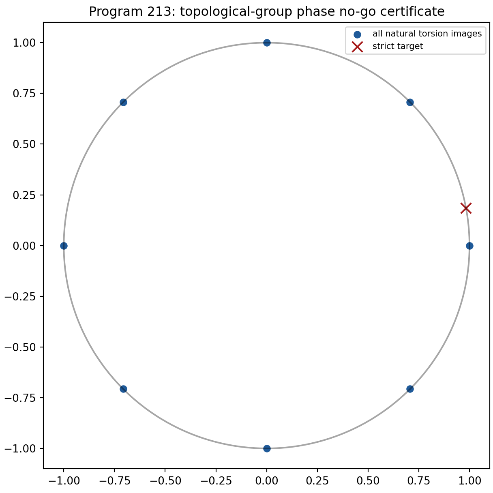

---

# 13. Program 214 — Scale-free spectral fingerprint

## 13.1 Frozen protocol

Let the eigenvalues of the twelve-node strict generator be

$$
0=\lambda_0<\lambda_1\le\cdots\le\lambda_{11}.
$$

The projective fingerprint is

$$
\Sigma(A)=
\left(
\frac{\lambda_1}{\lambda_{11}},
\ldots,
\frac{\lambda_{10}}{\lambda_{11}},
1
\right),
$$

provided $A$ is positive semidefinite with exactly one zero eigenvalue.
Acceptance requires

$$
\|\Sigma(A_{\rm candidate})-\Sigma(A_{\rm strict})\|_\infty\le0.02.
$$

The protocol, threshold, structural gate, and target signature are frozen in
a preregistration file before external execution.

## 13.2 Internal challenges

The exact target signature begins

$$
(0.3219737582,0.3219737582,
0.6733249110,0.6733249110,\ldots,1).
$$

Six scale factors from $10^{-6}$ to $10^6$ pass with distances below
$1.3\times10^{-15}$. A random node permutation also passes. One-percent
symmetric edge noise passes with distance $0.00233262$.

Three alternatives fail:

- ten-percent edge noise: distance $0.0420993$;
- nearest-neighbour cycle: distance $0.423325$;
- raw legacy generator: structural PSD failure with minimum eigenvalue
  $-21.3771$.

The legacy failure is not a global rejection of the legacy bridge object.
It says only that the raw legacy matrix is not an admissible instance of this
strict positive-generator fingerprint.

## 13.3 Physical boundary

Projective normalization removes an overall operator scale. That is useful
before a physical clock exists. It also means the protocol cannot determine
energy or time units. An apparatus must first reconstruct an operator or its
spectrum from independent data.

**Verdict — Proven invariance and computer-assisted finite falsification.**
The protocol is ready for, but has not undergone, external empirical testing.

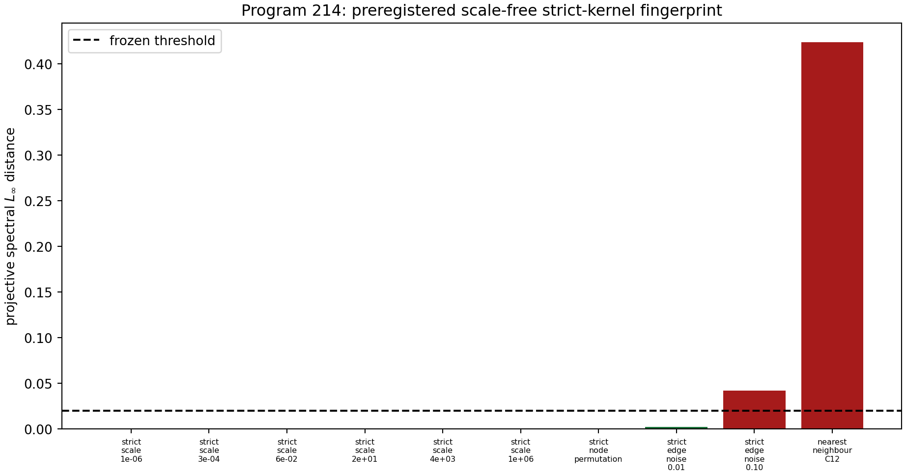

---

# 14. Program 215 — Independent external-data gate

The eleven required fields cover provenance, ordered raw events, preparation,
intervention, clock, detector calibration, environmental record, frozen
analysis, negative controls, held-out target, and an independent-analysis
boundary.

Three local external-lineage candidates pass respectively $1/11$, $2/11$,
and $1/11$ fields. The earlier synthetic operational bundle passes $10/11$
but fails independent provenance. It is correctly classified as method
validation.

No web search or Firecrawl was used. No local candidate is admitted. A
machine-readable request contract states exactly what a future provider must
supply.

**Verdict — Proven for the current local intake scope.** No external physical
record exists in the admitted analysis set.

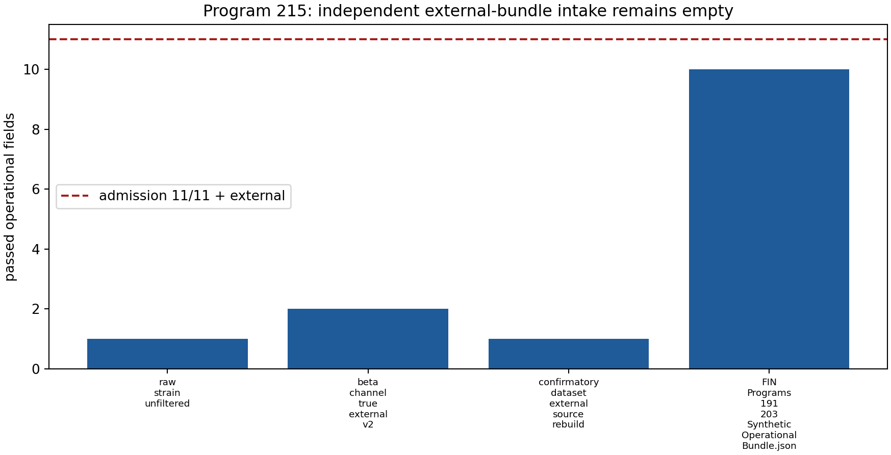

---

# 15. Program 216 — Conditional prediction lock

The external prediction file freezes:

- the input schema;
- the Program-215 admission dependency;
- the spectral reconstruction and projective fingerprint;
- the held-out quantity;
- the decision threshold;
- negative controls;
- failure and reporting rules.

Its execution condition is boolean and explicit:

$$
\text{execute Program 216}
\iff
\text{Program 215 admits an independent 11/11 bundle}.
$$

Because the antecedent is false, no external prediction is computed. The
earlier synthetic dry run is not recycled as physical evidence.

**Verdict — Proven gate status.** The prediction protocol exists; experimental
validation does not.

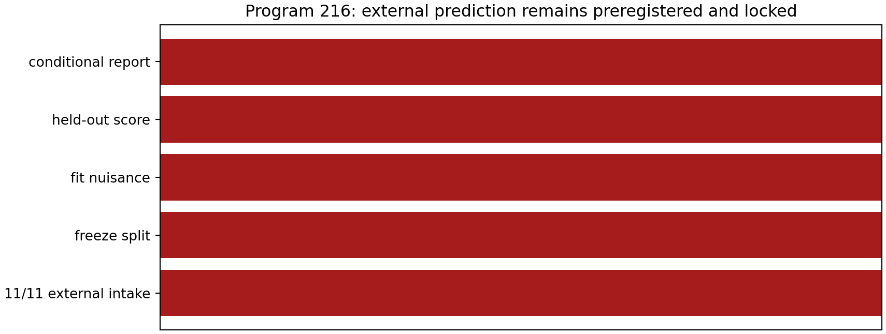

---

# 16. Cross-program synthesis

## 16.1 The new object stack

The results support the following dependency diagram:

$$
\boxed{A}
\longrightarrow
\begin{cases}
e^{-itA}\\
e^{-tA}\\
(A+zI)^{-1}
\end{cases}
$$

but

$$
A
\not\Longrightarrow
\rho,\;
\text{orientation reference},\;
\text{physical unit},\;
\text{instrument},\;
\text{external record}.
$$

Program 204 proves that a central state is extra unless a morphism principle
is added. Program 208 proves that an orientation reference is both sufficient
and resource-bearing. Programs 209–212 construct statistically and
operationally meaningful inference only after an acquisition class and
apparatus model are declared. Programs 214–216 prove that even a strong
scale-free internal fingerprint remains prephysical until an independent
record passes intake.

## 16.2 Observer paradox

The same $A$ generates reversible wave dynamics and irreversible-looking
diffusion:

$$
U_t=e^{-itA},
\qquad
P_t=e^{-tA}.
$$

This does not create a contradiction. The two maps solve different
evolution equations and use different time structures. An operational
observer sees a record only after preparation, coupling to an environment,
coarse graining, and measurement.

The perfect reference theorem adds a sharper statement. An observer capable
of distinguishing a direction may carry an asymmetric reference state. That
reference can be reused to orient operations, but its existence is not
explained by an orientation-blind generator. The “observer paradox” is
therefore not resolved by choosing wave over diffusion. It is typed as the
provenance problem for the state, clock, reference frame, environment,
instrument, and record.

## 16.3 Information loss

$P_t$ contracts nonconstant spectral modes:

$$
\|P_tf-\Pi_0f\|_2
\le
e^{-t\lambda_1}\|f-\Pi_0f\|_2.
$$

This is mathematical coarse graining. Calling it physical information loss
requires a probability state, an operational distinction measure, a clock,
and an environment or discarded subsystem. Program 212 shows that even one
measured dephasing moment leaves a sharp interval of compatible two-time
environments. No unique microscopic loss mechanism follows from the reduced
semigroup alone.

## 16.4 The status of a Lagrangian

For a positive generator $A=L+m^2I$ and source $J$, the quadratic action

$$
S[\phi]
=
\frac12\phi^\mathsf TA\phi-J^\mathsf T\phi
$$

has stationary equation

$$
A\phi=J,
\qquad
\phi=A^{-1}J.
$$

Thus reconstruction of a minimal quadratic action from a Green operator is
mathematically legitimate. Adding an operator potential,

$$
S[\phi,K]
=
\frac12\phi^\mathsf T(L+m^2I)\phi-J^\mathsf T\phi
+
\operatorname{tr}V(K)-\operatorname{tr}(KC),
$$

requires a separately specified variation domain and source $C$. Nothing in
Programs 204–216 supplies the missing tensor-resolved Lagrangian source or
reverses the existing obstruction results. The action remains a conditional
representation, not a physical closure.

## 16.5 Deepest surviving interpretation

The deepest interpretation that survives this round is:

> FIN is a dimensionless spectral-information generator equipped with a
> developing operational completion problem. Its self-adjoint operator
> unifies wave, diffusion, and Green dynamics. States, symmetry-breaking
> references, scale sections, interventions, instruments, environments, and
> independent records are additional typed objects. Some can be classified
> or bounded; none is presently forced in the unique physical form required
> for experimental theory.

This conclusion is stronger than saying merely that “more physics is needed.”
It identifies which data are absent and proves several impossibility and
sufficiency theorems about them.

---

# 17. Falsification ledger

## 17.1 Claims that survived

- Uniform central weighting is unique under the explicit
  Morita-permutation premise.
- All-unital-homomorphism state naturality is inconsistent with
  automorphism-uniform states.
- Continuous exponent cocycles are linear and do not select $9/5$.
- Invariant catalysts cannot repair the declared reflection-conversion
  inequality.
- A perfect asymmetric reference enables exact arbitrary-target conversion.
- Berbee coupling plus DKW gives a valid hidden-mixing bound under a calibrated
  envelope.
- The independent-block conformal product is an e-process.
- The finite-shot region has the declared simultaneous coverage guarantee.
- The order-two moment interval is sharp.
- The stated phase naturality hierarchy cannot generate the strict phase.
- The projective spectral fingerprint is exactly scale invariant.

## 17.2 Claims deliberately rejected or left open

- “Morita theory automatically chooses $9/5$”: rejected without the extra
  permutation/state premise.
- “A semigroup determines the strict exponent”: rejected.
- “A contract is a formal certificate”: rejected.
- “The entire Lean library is verified”: rejected.
- “Catalysis solves the strict selector”: rejected; the catalyst supplies it.
- “Nominal iid uncertainty remains valid under hidden refresh”: falsified in
  the challenge.
- “A one-time channel identifies its environment”: rejected by the sharp
  moment interval and previous counterexamples.
- “Projective operator agreement supplies physical units”: rejected.
- “A synthetic 10/11 bundle is external evidence”: rejected.
- “A frozen prediction counts as validation”: rejected.

## 17.3 Robustness boundary

Every positive conclusion is conditional on its declared class:

- change the morphism category, and the central-state theorem changes;
- drop continuity, and pathological additive cocycles exist;
- allow a symmetry-bearing catalyst, and the invariant no-help theorem no
  longer applies;
- remove the mixing-rate calibration, and Program 209 has no finite guarantee;
- reuse calibration records, and Program 210 needs a new proof;
- leave the Gaussian visibility family, and Program 211 needs a new
  likelihood;
- increase the moment order, and Program 212 becomes a larger semidefinite
  problem;
- abandon naturality, and target-coded phase interpolation is trivial;
- change the finite graph or reconstruction map, and Program 214 tests a
  different object.

This scoped form is a strength: each theorem has a visible falsification
surface.

---

# 18. Recommended Programs 217–229

The next round should not repeat closed selector, bridge, or Lagrangian lanes.
It should attack the new obligations created by Programs 204–216.

## Program 217 — Provenance of the Morita-permutation axiom

**Question:** Can a preparation or coarse-graining principle derive uniform
central weights without inserting them?

Construct a category whose objects are finite semisimple observable algebras
with specified operational embeddings and whose morphisms preserve
preparation statistics. Classify natural states on that restricted category.
The decisive output is either a uniqueness theorem with a physically
interpretable morphism class or a proof that a central measure remains free.

**Priority:** very high.  
**Probability of useful theorem:** $0.75$.  
**Closure boundary:** do not call a categorical symmetry a physical
preparation until an instrument realizes it.

## Program 218 — Target-independent exponent generator

**Question:** Can $\eta=9/5$ be a stable eigenvalue of a flow whose generator
is defined without the target?

Search polynomial and variational beta functions

$$
\dot\eta=F(\eta;\mathcal D)
$$

where $\mathcal D$ is strict-derived data and contains no occurrence of
$9/5$. Require structural stability, basin information, and independence
from the fitting interval. If no admissible $F$ exists in a declared finite
class, publish a no-go certificate.

**Priority:** high.  
**Probability of strict source:** $0.15$; probability of a useful no-go:
$0.70$.

## Program 219 — Execute the pinned Arb certificate

Build the exact environment specified by Program 206, record all dependency
hashes, and run the common directed-rounding computation. The acceptance
criterion must remain frozen at a worst enclosure below $0.03$.

**Priority:** high infrastructure.  
**Probability of completion with authorized dependencies:** $0.80$.  
**Failure is informative:** a bound above threshold must be reported as a
failed certificate.

## Program 220 — Complete the Mathlib Lean build

Pin Lean and Mathlib commits, generate `lake-manifest.json`, compile the
general source, and repair type or API errors without weakening statements.
Then add semigroup theorems or explicitly separate what remains analytic.

**Priority:** high infrastructure.  
**Probability of core Dirichlet closure:** $0.85$.  
**Probability of entrywise heat positivity in the first pass:** $0.55$.

## Program 221 — Cost and degradation of finite symmetry references

The perfect catalyst of Program 208 is reusable because its orbit states are
orthogonal. Quantify approximate conversion when the reference states are
not orthogonal. Derive a trade-off among conversion error, reference
disturbance, orbit distinguishability, and number of uses.

**Priority:** very high theoretical.  
**Probability of a quantitative theorem:** $0.70$.  
**Relevance:** this converts the binary selector obstruction into a finite
resource budget without pretending to source the budget.

## Program 222 — Optimal hidden-mixing acquisition design

Minimize the width of the Program-209 confidence interval over lag, record
length, and allocation of the coupling/DKW failure budget. Compare thinning
with blocking and median-of-means constructions.

**Priority:** medium-high.  
**Probability of useful method improvement:** $0.85$.  
**Required report:** valid coverage, effective sample size, and information
cost on the same challenge family.

## Program 223 — Reusable-calibration sequential e-process

Construct an anytime-valid conformal or betting process that can reuse a
finite calibration set without assuming independent fresh blocks at every
time. Candidate tools are conditional randomization, leave-one-out ranks,
and test martingales with predictable betting functions.

**Priority:** high operational.  
**Probability of a scoped theorem:** $0.60$.  
**Falsification:** demonstrate whether naive calibration reuse violates
Ville control.

## Program 224 — Near-optimal finite-shot tomography regions

Replace the conservative Bonferroni transport by inversion of the joint
binomial likelihood or an exact likelihood-ratio region. Prove or
conservatively certify coverage, then compare volume and memory-detection
power with Program 211.

**Priority:** medium-high.  
**Probability of substantial width reduction:** $0.80$.

## Program 225 — Higher environmental moment hierarchy

Extend Program 212 from $T_2$ to $T_n$. Compute semidefinite bounds on
unmeasured $c_k$, extract extremal atomic measures, and determine the minimum
number of time contrasts needed to distinguish declared environment classes.

**Priority:** very high.  
**Probability of exact low-order results:** $0.90$.  
**Physical boundary:** moment reconstruction remains an operational
environment quotient unless microscopic access is supplied.

## Program 226 — Phase obstruction with nontrivial actions

Study continuous and measurable one-cocycles for nontrivial $U(1)$ or finite
cyclic actions, together with equivariant cohomology and central extensions.
Demand a target-independent source law and an origin/orientation theorem.

**Priority:** medium.  
**Probability of strict phase source:** $0.10$; probability of a stronger
no-go theorem: $0.65$.

## Program 227 — Spectral reconstruction from an explicit instrument

Construct a complete observation map from preparations and time-stamped
measurements to estimates of the nonzero eigenvalue ratios of $A$. Prove
identifiability modulo scale and node relabeling, and propagate finite-shot
uncertainty into the Program-214 fingerprint distance.

**Priority:** highest physics-bridge task.  
**Probability of a finite-model theorem:** $0.75$.

## Program 228 — Acquire one independent 11/11 bundle

Use the Program-215 request contract to obtain a genuinely independent,
ordered, raw experimental record with apparatus calibration, negative
controls, and a held-out target. Do not alter the intake criteria after
viewing the data.

**Priority:** highest empirical task.  
**Probability cannot be estimated mathematically:** it depends on external
coordination and apparatus access.

## Program 229 — Execute the locked external prediction

Only if Program 228 passes all eleven fields, hash the admitted bundle,
execute the frozen Program-216 pipeline once, report the primary result and
all negative controls, and retain failure without model repair.

**Priority:** conditional on Program 228.  
**Scientific value:** decisive for distinguishing an internally coherent
operator model from an experimentally supported physical model.

## 18.1 Ranked roadmap

| Rank | Program | Reason |
|---:|---:|---|
| 1 | 227 | supplies the missing mathematical map from apparatus records to the spectral fingerprint |
| 2 | 228 | supplies the missing independent empirical object |
| 3 | 221 | quantifies the selector as a resource instead of replaying a symmetry no-go |
| 4 | 225 | extends a sharp theorem into testable temporal constraints |
| 5 | 220 | closes formal proof debt with an available local Lean toolchain |
| 6 | 219 | closes the remaining numerical-certificate debt |
| 7 | 217 | determines whether $9/5$ has categorical or merely stipulated status |
| 8 | 223 | makes sequential falsification operationally economical |
| 9 | 224 | reduces tomography conservatism |
| 10 | 222 | improves hidden-dependence efficiency |
| 11 | 218 | high conceptual value but low strict-source probability |
| 12 | 226 | likely to strengthen a no-go rather than source the phase |
| 13 | 229 | decisive, but admissible only after Program 228 |

---

# 19. Final answer

Programs 204–216 do not discover a theorem that forces FIN to become physics.
They discover something more precise.

The spectral generator is sufficient for a common mathematical dynamics.
Morita-permutation symmetry can conditionally select a central measure.
A perfect asymmetric reference can operationally supply a selector.
Mixing assumptions and finite-shot instruments can support rigorous
inference. Toeplitz positivity can turn one environmental moment into sharp
bounds on another. Projective spectral data can support a scale-free
falsification protocol.

None of these constructions eliminates its premise. Uniform central measure,
perfect orientation reference, mixing calibration, apparatus model, and
independent record remain typed inputs unless a new theorem or experiment
supplies them.

The deepest surviving result is therefore:

> The missing bridge is not one scalar constant and not another kernel. It is
> an operational section of the spectral theory: a compatible choice of
> state, symmetry reference, scale and clock, intervention, instrument,
> environment class, and independent record. Programs 204–216 prove exact
> uniqueness, sufficiency, no-go, and uncertainty statements for parts of
> this section, while proving that the complete section is not yet forced by
> the strict operator.

This is the correct point from which Programs 217–229 should proceed.

---

# Reproducibility

Run:

```text
python3 fin_programs_204_216_categorical_catalytic_external.py
python3 -m unittest -v \
  test_fin_programs_204_216_categorical_catalytic_external.py
```

The suite executes thirteen programs and 77 tests. Machine-readable outputs
include the main result file, formal-environment contracts, the phase no-go
certificate, the scale-free preregistration, the external bundle request, and
the locked prediction protocol. The release manifest records cryptographic
hashes after the final PDF is built.

Suggested citation:

Żuchowski, K. (2026). *FIN Programs 204–216: Categorical Measures, Perfect
References, and External Falsification Gates* (FIN Research Monograph,
Release 10.19; Version 1.0.0) [Preprint]. Zenodo.
