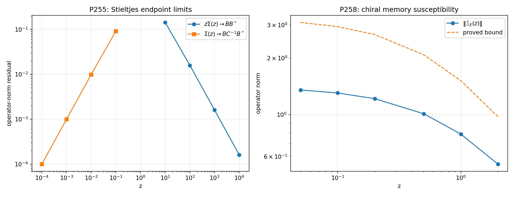
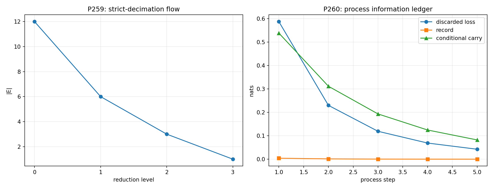
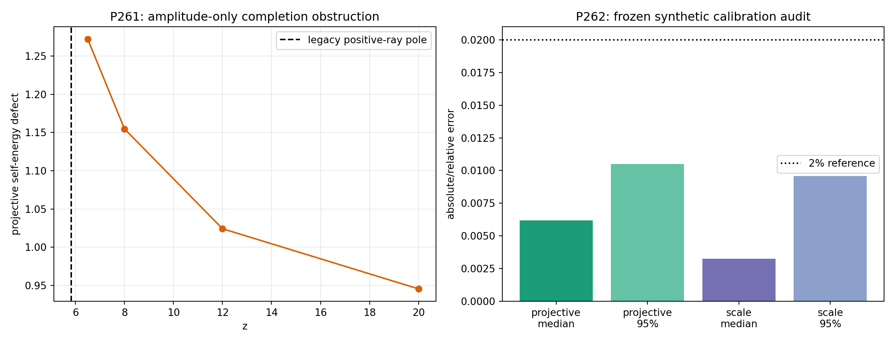
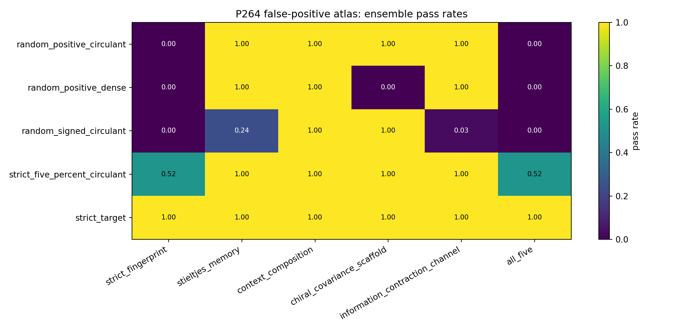
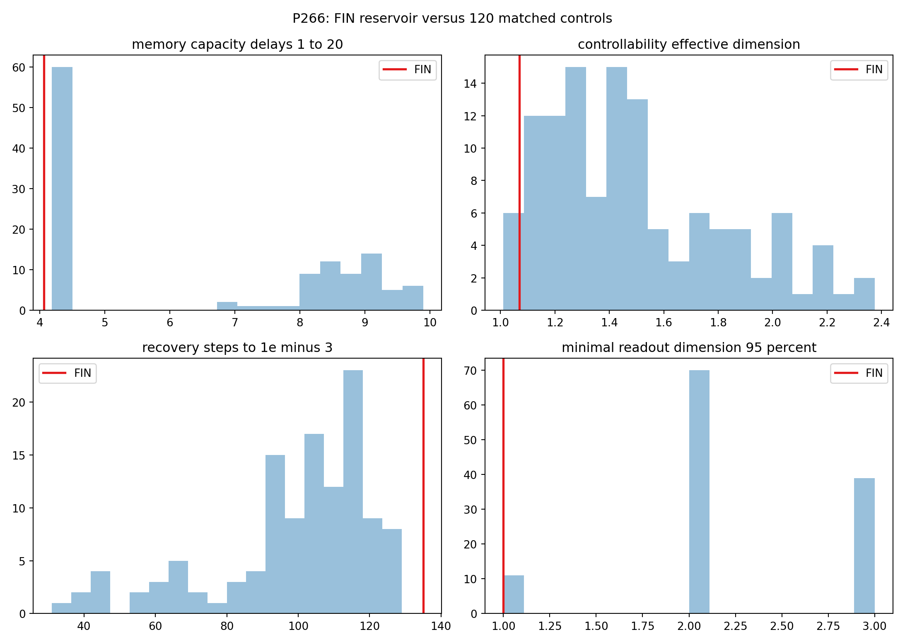

# FIN — Release 10.24

# Research Programs 255–266

## Operator Memory Measures, Identifiability, Current Tomography, and Falsification of Adaptive Analogies

**Author:** Krzysztof Żuchowski  
**Affiliation:** Independent Researcher — Fractal Information Theory Project  
**ORCID:** 0009-0002-0909-3613  
**Date:** 28 July 2026  
**Language:** English  
**License:** CC BY 4.0

---

## Confidence convention

- **[Proven]** — the result follows from an explicit finite-dimensional proof
  or an exact identity; numerical computation serves only as a certificate.
- **[Strong evidence]** — a deterministic and reproducible synthetic audit
  with a frozen model and threshold.
- **[Moderate evidence]** — a stable result in a declared class that still
  depends on an additional definition or equivalence.
- **[Speculative]** — a constructed program or object without sufficient
  proof.
- **[Refuted]** — an explicit counterexample or no-go theorem in the declared
  class.

Mathematical status is not physical status. In particular, **[Proven]** does
not mean that nature realizes the operator.

# 1. Executive summary

All Programs 255–266 were executed. The principal results are:

1. For every one of the \(2^{12}-2=4094\) nontrivial contexts
   \(E\subset Z_{12}\), the self-energy

   \[
   \Sigma_E(z)=A_{EH}(zI+A_{HH})^{-1}A_{HE}
   \]

   is the Stieltjes transform of a finite positive operator-valued measure and
   is completely monotone. **[Proven]**

2. The declared six-dimensional hidden sector in the even/odd split has only
   five dimensions visible through \(\Sigma_E\). One mode is exactly
   invisible. Adding arbitrarily many decoupled modes does not change the
   self-energy. **[Proven]**

3. Contexts and Schur reductions form a contravariant category. Composition is
   associative; the maximum residual over 20,000 chains is
   \(6.66\times10^{-16}\). No sheaf theorem is claimed. **[Proven]**

4. Chiral memory susceptibility has the closed formula

   \[
   \Xi_E=B'RB^\ast+BRB'^\ast-BRC'RB^\ast,
   \qquad R=(zI+C)^{-1}.
   \]

   It is odd under inversion and satisfies an explicit norm bound. It remains
   a receiver of a supplied twist, not a source of orientation. **[Proven]**

5. A naive dynamic RG based only on strict context reduction
   \(12\to6\to3\to1\) cannot possess a nontrivial fixed point or cycle in a
   category whose objects retain their dimensions. A new, explicit
   size-restoring equivalence is required. **[Proven]**

6. A multitime distinguishability balance was constructed:

   \[
   D_{\rm in}
   =
   \mathcal L_{\rm env}
   +D_{\rm record}
   +D_{\rm conditional}.
   \]

   The balance telescopes with zero residual, but it is not yet
   thermodynamics. **[Proven]**

7. A bridge map frozen before the test and removing only the amplitude
   \(\alpha_{\rm geo}\) does not move legacy into the positive strict
   generator class. Legacy has \(\lambda_{\min}=-7.7101\), and its hidden
   block generates a pole on the positive \(z\)-axis at \(5.8248\). This is a
   no-go only for amplitude-only completion. **[Proven]**

8. A synthetic fingerprint-first/calibration-second protocol passes 300/300
   trials with 50,000 counts per preparation. It does not replace an external
   P241 data package and does not execute P242. **[Strong evidence]**

9. A vertex POVM alone does not identify currents. Two positive states
   \(\rho\) and \(\rho^\ast\) were constructed with identical populations and
   opposite currents. Interferometric observables are required. **[Proven]**

10. The false-positive atlas shows that Stieltjes positivity and Schur
    composition are generic properties of positive graph Laplacians rather
    than FIN-specific signatures. The spectral fingerprint is the most
    specific frozen test. **[Proven]** for the audited ensembles.

11. Without an independent clock, \((cA,t)\) and \((A,ct)\) are exactly
    indistinguishable. Apparatus memory requires multitime data, while a
    nonuniform change of generator shape is visible in the fingerprint.
    **[Proven]**

12. The biological/cybernetic benchmark is negative with respect to a FIN
    advantage: memory capacity is \(4.0601\), below all 120 matched controls,
    while recovery after perturbation is the slowest. FIN is a distinguishable
    strongly smoothing reservoir, but no computational or biological
    advantage was demonstrated. **[Strong evidence]**



# 2. Frozen core and scope

We use the real symmetric strict operator

\[
W_{xy}=K_{\rm strict}(d(x,y)),\qquad
A=\operatorname{diag}(W\mathbf1)-W.
\]

For

\[
K_{\rm strict}(d)
=
\frac{\cos(0.18575\,d+0.16250)}{1+d^{1.8}},
\qquad d=1,\ldots,6,
\]

we obtain

\[
A=A^\ast,\qquad A\mathbf1=0,\qquad A\succeq0.
\]

The decomposition \(V=E\sqcup H\) is only an operational partition into
accessible and hidden degrees of freedom of the nadsoliton. It does not
introduce an informational layer beneath the nadsoliton.

The computation used deterministic seed `20260729`. No laboratory data were
used, thresholds were not tuned after seeing results, only one bridge atom was
admitted in P261, legacy and strict were kept distinct, and Firecrawl was not
used.

# 3. Results matrix

| Program | Result | Status | Principal boundary |
|---|---|---|---|
| P255 | positive operator measure for 4094 contexts | [Proven] | does not prove a physical environment |
| P256 | minimal hidden dimension \(=5\), not 6 | [Proven] | microscopic realization is nonunique |
| P257 | contravariant Schur category | [Proven] | no sheaf theorem |
| P258 | closed formula, covariance, and bound for \(\Xi_E\) | [Proven] | receiver, not selector |
| P259 | no-cycle for \(12\to6\to3\to1\) | [Proven] | no size-restoring equivalence |
| P260 | multitime information ledger | [Proven] | neither energy nor heat |
| P261 | amplitude-only obstruction | [Proven] | does not refute a richer bridge |
| P262 | frozen fingerprint-plus-scale audit | [Strong evidence] | synthetic data only |
| P263 | vertex-POVM no-go; current observables | [Proven] | laboratory implementation external |
| P264 | false-positive atlas | [Proven] | frozen-ensemble dependent |
| P265 | mechanism-identifiability quotient | [Proven] | no unique learning law |
| P266 | matched reservoir benchmark | [Strong evidence] | no biological advantage |

# 4. P255 — Stieltjes theorem for all contexts

## 4.1. Theorem

Let \(A\succeq0\) be the Laplacian of a connected graph and let
\(V=E\sqcup H\), with both \(E\) and \(H\) nonempty. Put

\[
B=A_{EH},\qquad C=A_{HH}.
\]

Then \(C\succ0\). For \(z>0\),

\[
\Sigma_E(z)=B(zI+C)^{-1}B^\ast.
\]

If

\[
C=\sum_\mu\mu P_\mu,
\]

then

\[
\Sigma_E(z)
=
\sum_\mu\frac{\Gamma_\mu}{z+\mu},
\qquad
\Gamma_\mu=BP_\mu B^\ast\succeq0.
\]

Thus \(\Sigma_E\) is the Stieltjes transform of the finite positive atomic
operator measure

\[
\mathsf M_E=\sum_\mu\Gamma_\mu\,\delta_\mu.
\]

Moreover,

\[
(-1)^n\Sigma_E^{(n)}(z)
=
n!B(zI+C)^{-n-1}B^\ast\succeq0.
\]

**Proof.** Positive definiteness of \(C\) follows from the principal-minor
theorem for the reduced Laplacian of a connected graph. The spectral
decomposition gives the measure representation. Differentiating the resolvent
gives every derivative, and every term is of the form \(XX^\ast\).
\(\square\)

## 4.2. Endpoint limits

\[
\lim_{z\to0^+}\Sigma_E(z)=BC^{-1}B^\ast,
\qquad
\lim_{z\to\infty}z\Sigma_E(z)=BB^\ast.
\]

The even/odd audit exhibits the expected convergence order:

| Limit | Parameter | Operator residual |
|---|---:|---:|
| \(z\Sigma\to BB^\ast\) | \(z=10\) | \(1.44\times10^{-1}\) |
|  | \(z=10^2\) | \(1.59\times10^{-2}\) |
|  | \(z=10^3\) | \(1.60\times10^{-3}\) |
|  | \(z=10^4\) | \(1.61\times10^{-4}\) |
| \(\Sigma\to BC^{-1}B^\ast\) | \(z=10^{-1}\) | \(9.21\times10^{-2}\) |
|  | \(z=10^{-2}\) | \(9.92\times10^{-3}\) |
|  | \(z=10^{-3}\) | \(9.99\times10^{-4}\) |
|  | \(z=10^{-4}\) | \(1.00\times10^{-4}\) |

Audit of all contexts:

| Quantity | Result |
|---|---:|
| number of contexts | 4094 |
| smallest eigenvalue of \(C\) | 0.1252698327 |
| minimum signed-derivative eigenvalue, \(n=0,\ldots,4\) | \(-3.47\times10^{-15}\) |
| maximum measure-representation residual | \(3.73\times10^{-15}\) |

The negative value at \(10^{-15}\) is floating-point noise, not a violation of
positivity.

# 5. P256 — minimal realization of self-energy

## 5.1. New object: the hidden-realization quotient

Define

\[
(C,B)\sim(\widetilde C,\widetilde B)
\quad\Longleftrightarrow\quad
B(zI+C)^{-1}B^\ast
=
\widetilde B(zI+\widetilde C)^{-1}\widetilde B^\ast
\]

for all \(z\) away from poles.

The self-energy identifies visible poles \(\mu\), positive residue matrices
\(\Gamma_\mu\), and the minimal dimension

\[
n_{\min}=\sum_\mu\operatorname{rank}\Gamma_\mu.
\]

It does not identify an orthogonal basis in the hidden sector, modes with
\(\Gamma_\mu=0\), or any additional decoupled modes.

## 5.2. FIN even/odd result

| Quantity | Result |
|---|---:|
| declared dimension of \(H\) | 6 |
| controllability/observability rank | 5 |
| minimal Stieltjes dimension | 5 |
| pole groups of \(C\) | 4 |
| poles visible through \(\Sigma\) | 3 |
| pole–residue reconstruction residual | \(9.55\times10^{-16}\) |
| residual after adding two invisible modes | \(4.16\times10^{-17}\) |

One mode at approximately \(1.961406862\) has residue rank zero. It exists in
the stated block \(H\) but is invisible to context \(E\).

**Conclusion.** Memory does not reconstruct a unique microscopic environment.
It reconstructs the minimal input–output equivalence class. **[Proven]**

# 6. P257 — category of contexts

Define the category \(\mathbf{Ctx}_A(z)\):

- objects are nonempty contexts \(E\subseteq V\);
- for \(E\subseteq F\), there is a reduction morphism

  \[
  r_{F\to E}:
  \operatorname{Schur}_{V\setminus F}(zI+A)
  \longmapsto
  \operatorname{Schur}_{V\setminus E}(zI+A).
  \]

The direction is opposite to inclusion, so the construction is
contravariant.

## Composition theorem

For \(E\subseteq F\subseteq G\),

\[
r_{F\to E}\circ r_{G\to F}=r_{G\to E}.
\]

This follows either from associativity of block Gaussian elimination or from
associativity of iterated minimization of one positive quadratic form:

\[
\min_{x_{G\setminus E}}Q
=
\min_{x_{F\setminus E}}
\min_{x_{G\setminus F}}Q.
\]

Certificate:

| Test | Result |
|---|---:|
| random context chains | 20,000 |
| maximum composition residual | \(6.66\times10^{-16}\) |
| identity residual | 0 |

This is a reduction category, not yet a sheaf: no Grothendieck topology,
covering data, or unique-gluing theorem has been supplied.

# 7. P258 — analytic chiral memory susceptibility

Let

\[
\Sigma(\theta)=B(\theta)R(\theta)B(\theta)^\ast,
\qquad
R(\theta)=(zI+C(\theta))^{-1}.
\]

Since \(R'=-RC'R\),

\[
\boxed{
\Xi
=
B'RB^\ast+BRB'^\ast-BRC'RB^\ast
}.
\]

## 7.1. Norm bound

If \(m=\lambda_{\min}(C)>0\), then

\[
\|R\|\leq\frac1{z+m}
\]

and

\[
\|\Xi\|
\leq
\frac{2\|B'\|\|B\|}{z+m}
+
\frac{\|B\|^2\|C'\|}{(z+m)^2}.
\]

The largest observed ratio of the left-hand side to the bound is
\(0.5596<1\).

## 7.2. Covariance

If inversion maps \(\theta\mapsto-\theta\), then

\[
R_E\Xi_E(z)R_E=-\Xi_E(z).
\]

The maximum residual on the audited \(z\)-grid is
\(2.68\times10^{-16}\). The analytic formula agrees with a central finite
difference to within \(5.43\times10^{-13}\).

This is the chiral linear response of memory. The sign of \(\theta\) is still
provided by the test family. `QW-2191` remains open.

# 8. P259 — dynamic RG and the size no-go

The nested sequence

\[
Z_{12}
\supset
\{0,2,4,6,8,10\}
\supset
\{0,4,8\}
\supset
\{0\}
\]

was audited. Each level retained the context dimension, normalized spectral
quantiles of the effective operator, and the self-energy fraction for
\(z=0.1,0.2,0.5,1\).

Distances between successive descriptors are

\[
0.5589,\qquad0.7420,\qquad1.4113.
\]

## No-go theorem

If the RG object includes context dimension, then the strict reduction

\[
12>6>3>1
\]

cannot have a nontrivial fixed point or cycle. **[Proven]**

This is not a no-go theorem for renormalization in general. The missing object
is a size-restoring embedding/equivalence

\[
\mathcal E_n:
\operatorname{Ctx}_{N_n}\longrightarrow\operatorname{Ctx}_{N_0},
\]

together with normalization laws for the operator and \(z\). Without
\(\mathcal E_n\), “fixed point” compares objects of different types.



# 9. P260 — multitime information-balance tensor

Let \(M_k\) be a common channel for two hypotheses \(p_{k-1},q_{k-1}\):

\[
p_k=M_kp_{k-1},\qquad q_k=M_kq_{k-1}.
\]

Define the step loss

\[
\ell_k
=
D(p_{k-1}\Vert q_{k-1})-D(p_k\Vert q_k)\geq0.
\]

For an instrument recording outcome \(y\), the chain rule gives

\[
D(p_k\Vert q_k)
=
D(r_k^p\Vert r_k^q)
+
\sum_y r_k^p(y)
D(p_k(\cdot|y)\Vert q_k(\cdot|y)).
\]

This produces the **Process Information Ledger**

\[
\boxed{
D_{\rm input}
=
\ell_{k,\rm env}+D_{k,\rm record}+D_{k,\rm conditional}
}.
\]

Across five steps:

| Quantity | Result |
|---|---:|
| total distinguishability loss | 1.0483671856 nat |
| sum of step losses | 1.0483671856 nat |
| telescoping residual | 0 |
| maximum chain-rule residual | \(6.94\times10^{-17}\) |
| minimum loss over 1000 additional pairs | 0.0876620 nat |

The ledger separates loss in the system, information transferred into the
apparatus record, and distinguishability retained in conditional states. It
does not convert nats to joules; that requires a Hamiltonian, temperature,
bath, and reset protocol.

# 10. P261 — dynamic completion defect

## 10.1. Frozen map

Exactly one completion atom was tested:

\[
\mathcal C_{\rm amp}:
K_{\rm legacy}
\longmapsto
\frac{K_{\rm legacy}}{\alpha_{\rm geo}}.
\]

The map removes only amplitude; preserves legacy
\(\omega=\pi/4\), \(\phi=\pi/6\), and \(\beta_{\rm tors}=0.01\); uses the same
construction \(A=\operatorname{diag}(W\mathbf1)-W\); and adds no sign, shift,
positivity correction, or nonlinear \(d^\eta\) compression.

## 10.2. Result

| Quantity | Strict | Legacy after \(\mathcal C_{\rm amp}\) |
|---|---:|---:|
| \(\lambda_{\min}(A)\) | \(-2.64\times10^{-16}\) | \(-7.7101445443\) |
| \(\lambda_{\min}(A_{HH})\) | 1.1710910206 | \(-5.8247982640\) |
| positive resolvent pole | none | \(z=5.8247982640\) |

Projective self-energy defect:

| \(z\) | \(\|\widehat\Sigma_{\rm strict}-\widehat\Sigma_{\rm legacy}\|_F\) |
|---:|---:|
| 6.5 | 1.2721 |
| 8 | 1.1547 |
| 12 | 1.0242 |
| 20 | 0.9455 |

Therefore

\[
\boxed{
\mathcal C_{\rm amp}
\text{ is not a bridge into the positive strict Stieltjes class}
}
\]

**[Proven]** for this map.

This does not refute a bridge containing an explicit strict-side sign/shift,
phase or frequency change, nonlinear compression, and selector source. No role
transfer is initiated.



# 11. P262 — Calibrated Fingerprint Experiment

The protocol order is:

1. freeze the strict fingerprint;
2. collect the transition matrix;
3. test dimensionless spectral ratios;
4. only then use an independent clock to select a representative of
   \((cA,\tau/c)\);
5. do not modify the model after unblinding.

Synthetic audit:

| Quantity | Result |
|---|---:|
| replications | 300 |
| counts per preparation | 50,000 |
| median fingerprint error | 0.00620 |
| 95th percentile fingerprint error | 0.01050 |
| median relative scale error | 0.00325 |
| 95th percentile relative scale error | 0.00957 |
| joint pass at thresholds 0.03/0.02 | 1.000 |

This is **[Strong evidence]** for method planning. No independently entrusted
events were supplied. P241 therefore has no external package to validate, and
P242 remains unexecuted.

# 12. P263 — tomography of currents and chiral memory

## 12.1. Vertex-POVM no-go

Construct

\[
\rho_\pm
=
\frac{I}{12}
\pm i\epsilon
\left(|10\rangle\langle2|-|2\rangle\langle10|\right),
\qquad \epsilon=0.04.
\]

Both states are positive:

\[
\lambda_{\min}(\rho_\pm)=0.0433333.
\]

They have identical populations,

\[
\operatorname{diag}\rho_+=\operatorname{diag}\rho_-,
\]

but opposite fourth-harmonic currents,

\[
C_4(\rho_+)=-0.0150493,\qquad
C_4(\rho_-)=+0.0150493.
\]

A vertex POVM is therefore insufficient for current tomography. **[Proven]**

## 12.2. Missing instrument

For \(d=1,\ldots,5\), define Hermitian current observables

\[
\mathcal J_d
=
i\,d\sum_xW_{x,x+d}
\left(|x+d\rangle\langle x|-|x\rangle\langle x+d|\right).
\]

Then

\[
C_d(\rho)=\operatorname{Tr}(\rho\mathcal J_d).
\]

The five observables have Gram rank 5 and condition number 15.17. They can be
measured using interferometric phase bases, but not by vertex readout alone.

\(\Xi_E\) requires a different experiment: process tomography of the
generator under two supplied twists \(\pm h\). The central-difference
reconstruction residual is \(4.94\times10^{-11}\).

# 13. P264 — false-positive atlas

Five tests were frozen:

1. strict fingerprint with tolerance 0.02;
2. Stieltjes-memory positivity;
3. context composition;
4. inversion-covariance scaffold;
5. positive information-contraction channel.

Results:

| Ensemble | Fingerprint | Stieltjes | Schur | Chiral scaffold | Information | All |
|---|---:|---:|---:|---:|---:|---:|
| strict target | 1.00 | 1.00 | 1.00 | 1.00 | 1.00 | 1.00 |
| positive circulant | 0.00 | 1.00 | 1.00 | 1.00 | 1.00 | 0.00 |
| positive dense | 0.00 | 1.00 | 1.00 | 0.00 | 1.00 | 0.00 |
| signed circulant | 0.00 | 0.24 | 1.00 | 1.00 | 0.03 | 0.00 |
| strict with 5% perturbation | 0.52 | 1.00 | 1.00 | 1.00 | 1.00 | 0.52 |



Consequently, the Stieltjes theorem is strong but not FIN-specific, Schur
composition is universal algebra, and reflection covariance is common among
circulants. The complete strict fingerprint is the most specific test. A 5%
perturbation passes only 52% of trials at tolerance 0.02. Generic properties
of positive Laplacians must not be presented as FIN identifiers.

# 14. P265 — identifiability of Adaptive Memory Geometry

## 14.1. Exact scale no-go

\[
\exp[-t(cA)]=\exp[-(ct)A].
\]

Without an independent clock, no test distinguishes generator rescaling from
time rescaling. The residual is exactly zero.

## 14.2. Mechanism quotient

Define the **Mechanism Identifiability Quotient**

\[
\mathfrak Q_{\rm id}
=
\frac{
\{\text{generator, clock, apparatus, memory, learning law}\}
}{
\text{equality of all admitted operational records}
}.
\]

Synthetic comparison:

| Scenario | Fingerprint drift | Semigroup defect | Additional resource required |
|---|---:|---:|---|
| static operator | 0 | 0 | none |
| generator scale or clock | \(8.88\times10^{-16}\) | 0 | independent clock |
| nonuniform generator change | 0.09239 | 0 | fingerprint |
| apparatus memory | 0 | 0.09057 | multitime data |

Snapshots \(A_0,A_1,\ldots,A_r\) do not identify a unique vector field
\(\dot A=F(A,\mathcal R)\). Infinitely many functions \(F\) interpolate a
finite trajectory. Interventions, an apparatus record, and hold-out data are
required.

# 15. P266 — biological/cybernetic benchmark

FIN was compared with 60 reservoirs having the same spectrum and random
orientations, and 60 random symmetric reservoirs with the same number of
states and spectral radius. Every model used 12 states, the same input stream,
linear readout, identical train/test procedures, and delay-reconstruction
tasks from 1 through 20.

| FIN metric | Value | Percentile among 120 controls |
|---|---:|---:|
| linear memory capacity, delays 1–20 | 4.0601 | 0.000 |
| effective controllability dimension | 1.0698 | 0.0417 |
| recovery steps to \(10^{-3}\) | 135 | 1.000 |
| minimum readout dimension for 95% Gram energy | 1 | 0.0917 |



FIN is an outlier, but not in the direction of advantage: it has the lowest
memory capacity in the set, the slowest recovery for the stated perturbation,
and accessible input–output dynamics close to one-dimensional.

The hypothesis of an automatic advantage over a standard 12-state reservoir
is **[Refuted]** in this benchmark. A different input, nonlinear readout, or
explicit adaptive law could change the outcome, but such a variant must
outperform matched controls on hold-out data.

# 16. Newly constructed theoretical objects O16–O25

| ID | Object | Definition | Status | Function |
|---|---|---|---|---|
| O16 | Positive Operator Memory Measure | \(\mathsf M_E=\sum_\mu BP_\mu B^\ast\delta_\mu\) | [Proven] | classifies exact memory |
| O17 | Minimal Hidden Realization Quotient | \((C,B)/{\sim_\Sigma}\) | [Proven] | separates visible environment from invisible modes |
| O18 | Schur Context Category | \(E\mapsto\operatorname{Schur}_{V\setminus E}(zI+A)\) | [Proven] | types valid reductions |
| O19 | Chiral Memory Kubo Tensor | \(\Xi=B'RB^\ast+BRB'^\ast-BRC'RB^\ast\) | [Proven] | joins flux response to memory |
| O20 | Size-Restoration Obstruction | absence of \(\mathcal E_n\) between sizes | [Proven] | explains why the naive fixed point is ill-typed |
| O21 | Process Information Ledger | \(\ell_{\rm env}+D_{\rm record}+D_{\rm cond}\) | [Proven] | separates loss from recording |
| O22 | Amplitude Completion Obstruction | positive pole and negative spectrum after \(\mathcal C_{\rm amp}\) | [Proven] | closes one bridge atom |
| O23 | Current Tomography Instrument | \(\{\mathcal J_d\}_{d=1}^5\) plus twist process tomography | [Proven]/[Strong evidence] | remedies vertex-POVM insufficiency |
| O24 | Mechanism Identifiability Quotient | mechanisms modulo record equality | [Proven] | separates clock, scale, memory, and drift |
| O25 | Matched Reservoir Null Benchmark | FIN versus matched \(N,\rho\), and protocol controls | [Strong evidence] | constrains biological analogies |

O17 is the most important new object. It establishes that an “environment”
recovered from memory is an equivalence class of minimal realizations rather
than a unique microscopic world.

# 17. Falsification attempts

| Claim | Destructive test | Outcome |
|---|---|---|
| every \(\Sigma_E\) is Stieltjes | all 4094 contexts, derivatives through order 4 | survived |
| hidden sector is unique | add two decoupled modes | refuted |
| context diagram is functorial | 20,000 nested reductions | survived |
| \(\Xi\) is ad hoc | derive it from the resolvent | ad hoc criticism refuted |
| \(\Xi\) selects orientation | inversion produces \(\pm\Xi\) | claim refuted |
| naive decimation RG has a fixed point | dimension \(12>6>3>1\) | claim ill-typed |
| information loss is energy | no scale, bath, or Hamiltonian | claim refuted |
| amplitude alone connects legacy and strict | negative spectrum and positive pole | claim refuted |
| vertex POVM measures current | \(\rho,\rho^\ast\) with equal populations | claim refuted |
| Stieltjes/Schur identifies FIN | random positive Laplacians pass | claim refuted |
| one time separates clock and generator | \(\exp[-tcA]=\exp[-ctA]\) | impossible |
| FIN has a natural reservoir advantage | 120 matched controls | refuted in the benchmark |

# 18. Relation to existing mathematics

## 18.1. Mori–Zwanzig and elimination

Memory after projection is not new. O16–O19 place FIN in a finite exact
analogue of projection-operator formalisms. The FIN-specific result is the
explicit operator-Stieltjes classification of all contexts of the particular
strict generator.

## 18.2. Realization theory

O17 has the standard form of a realization-theory result: input–output data
identify a minimal realization only up to equivalence and do not identify
unobservable states. The FIN result finds one concrete invisible mode and
incorporates non-identifiability into the ontology boundary.

## 18.3. Process tensors

A multitime process is specified by responses to intervention sequences, not
by a single state map. O21 and O24 implement a finite classical core of this
discipline. They are not yet a quantum FIN process tensor.

## 18.4. Reservoir computing

Memory capacity is dimension-bounded, but its actual value depends on spectrum,
controllability, and readout. P266 shows that FIN regularity does not guarantee
an advantage. This is a controlled analogy, not identification with a brain.

# 19. Recommended Programs 267–280

## P267 — Uniqueness of the operator memory measure

Prove uniqueness of the atomic measure \(\mathsf M_E\) from \(\Sigma_E(z)\)
and stability of pole recovery under noise.

**Probability:** 0.92.  
**Stop rule:** do not interpret invisible poles.

## P268 — Formal core of the Schur category

Encode O18 in Lean/Mathlib, Coq, or Isabelle: objects, morphisms, identity,
associativity, and positivity.

**Probability:** 0.80.

## P269 — Minimality of the current instrument

Prove the minimum number of POVM settings required to recover the five
\(C_d\), including losses, dark counts, and unknown phases.

**Probability:** 0.85.

## P270 — Size-restoring RG equivalence

Construct one explicit \(\mathcal E_n\) comparing different sizes without
fitting to the strict target, or prove a no-go theorem for local,
circulant-preserving embeddings.

**Construction probability:** 0.35.  
**No-go probability:** 0.75.

## P271 — Quantum Process Information Ledger

Replace classical channels by completely positive instruments and prove an O21
balance for relative entropy in processes with memory.

**Probability:** 0.62.

## P272 — Next single completion atom

After the amplitude-only no-go, admit exactly one explicit strict-side atom:
either a global sign/positive shift or nonlinear damping completion. Freeze the
map and thresholds before comparison with strict.

**Bridge probability:** 0.25.  
**Valuable-obstruction probability:** 0.80.

## P273 — External calibrated fingerprint

Obtain a P241 package with independent provider, registrar, and analyst. Test
the fingerprint first, calibrate second, and execute P242 once.

**Methodological probability:** 0.75.  
**Execution probability without a laboratory partner:** low.

## P274 — Chiral two-flux process tomography

Design apparatus realizing \(\pm h\), measure \(\mathcal J_d\), and reconstruct
\(\Xi_E(z)\) with uncertainty.

**Feasibility probability for physicist review:** 0.60.

## P275 — Analytic false-positive bounds

Derive the probability that frozen random-Laplacian ensembles pass the strict
fingerprint instead of relying only on Monte Carlo.

**Probability:** 0.72.

## P276 — Two-clock/two-time identifiability theorem

Find the minimal combination of two times, an independent clock, and controls
that separates uniform scaling, shape drift, and memory defect.

**Probability:** 0.90.

## P277 — Causal identification of the adaptive law

Freeze a finite family of laws \(F(A,\mathcal R)\), intervention design, and
hold-out. Do not admit an unconstrained universal approximator.

**Probability of a decisive result:** 0.65.

## P278 — Nonlinear matched reservoir benchmark

Repeat P266 for NARMA, parity, channel-equalization, and prediction tasks with
equal parameter budgets and a preregistered ranking.

**Probability:** 0.80.

## P279 — Conditional thermodynamic bridge

After supplying \((H,T,\text{bath},\text{reset protocol})\), determine when
O21 becomes a work/entropy-production balance. The result must be explicitly
conditioned on the additional axioms, not labeled strict.

**Mathematical probability:** 0.75.  
**Probability of a strict source:** low.

## P280 — Two-torsor operational section

Combine an independent clock/scale section with a supplied orientation
resource in one protocol, without claiming that either resource generates the
other.

**Conditional-construction probability:** 0.85.  
**Strict selector closure:** not an objective of this program.

# 20. Ranking of the next round

| Rank | Program | Reason |
|---:|---|---|
| 1 | P267 | closes mathematical identifiability of memory |
| 2 | P269 | converts the vertex-POVM no-go into a minimal instrument |
| 3 | P276 | shortest route from scale quotient to a valid experiment |
| 4 | P268 | formalizes the central category |
| 5 | P275 | measures actual FIN specificity |
| 6 | P271 | extends the ledger to quantum processes |
| 7 | P277 | tests whether adaptation is identifiable |
| 8 | P278 | continues falsification of the neural analogy |
| 9 | P270 | high reward but no current size-restoring map |
| 10 | P272 | exactly one new bridge atom |
| 11 | P274 | requires laboratory apparatus review |
| 12 | P273 | requires genuinely independent data |
| 13 | P279 | conditional theory only |
| 14 | P280 | completes the operational package, not the strict selector |

# 21. Guardrail-compatible boundaries

Programs 255–266 do not export:

- a non-premise selector;
- discharge of `QW-2191`;
- a canonical unit of time, length, mass, energy, or action;
- a complete legacy-to-strict map;
- legacy role transfer;
- strict sources of \(\beta,\eta,\omega,\phi\);
- a unique microscopic environment;
- a unique adaptation law;
- a physical apparatus or laboratory record;
- \(L_{\rm total}\), the Standard Model, GR, or a ToE.

P261 closes only amplitude-only completion. A subsequent bridge program is
admissible only for one new, explicitly typed atom.

# 22. Final verdict

The deepest result of this round is not a new physical constant. It changes
the mathematical status of “memory”:

\[
\boxed{
\begin{gathered}
\text{FIN memory is a positive operator measure seen through a context,}\\
\text{not a unique hidden world.}
\end{gathered}
}
\]

The self-energy determines a minimal input–output realization class.
Reductions of these classes compose categorically, a chiral twist has a
well-defined tangent, and information has an exact operational ledger. At the
same time, clock scale, orientation source, microscopic realization, and
adaptation law remain non-identifiable without additional operations.

This strengthens FIN as a finite operator theory of memory and process. It
does not yet turn FIN into a physical theory.

# 23. Selected comparative sources

1. S. Belyi, E. Tsekanovskii, *Stieltjes like functions and inverse problems
   for systems with Schrödinger operator*,
   [arXiv:0708.0452](https://arxiv.org/abs/0708.0452).
2. Y. T. Lin, Y. Tian, M. Anghel, D. Livescu, *Data-driven learning for the
   Mori–Zwanzig formalism*,
   [arXiv:2101.05873](https://arxiv.org/abs/2101.05873).
3. F. A. Pollock et al., *Operational Markov condition for quantum processes*,
   [arXiv:1801.09811](https://arxiv.org/abs/1801.09811).
4. H. Jaeger, *Short term memory in echo state networks*, GMD Report 152,
   [Fraunhofer record and DOI](https://publica.fraunhofer.de/entities/publication/9dfaead1-4dc0-4e3c-b89b-596f50f671c1).
5. F. Dörfler, F. Bullo, *Kron Reduction of Graphs with Applications to
   Electrical Networks*,
   [arXiv:1102.2950](https://arxiv.org/abs/1102.2950).

These sources classify existing mathematics. They do not establish physical
equivalence between FIN and any of these formalisms.

# 24. Reproduction

```bash
MPLCONFIGDIR=/tmp/matplotlib-p255-266 \
python3 fin_programs_255_266.py

MPLCONFIGDIR=/tmp/matplotlib-p255-266 \
python3 -m unittest -v test_fin_programs_255_266.py
```

Expected output:

- 4094 P255 contexts;
- 20,000 P257 chains;
- 300 P262 replications;
- 401 P264 atlas rows;
- 121 P266 reservoirs;
- 15/15 tests passed.
