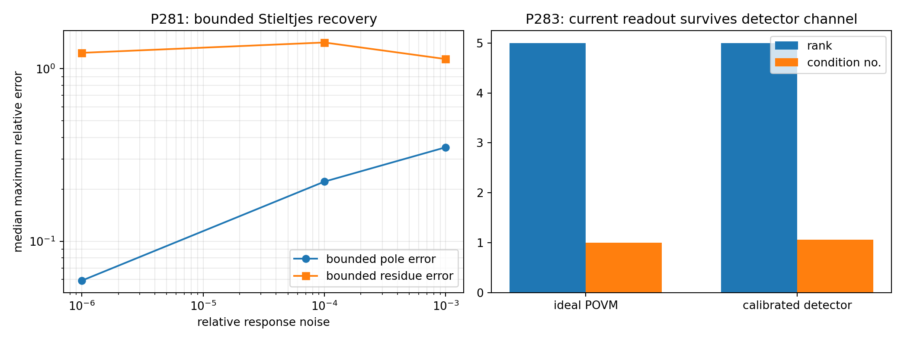
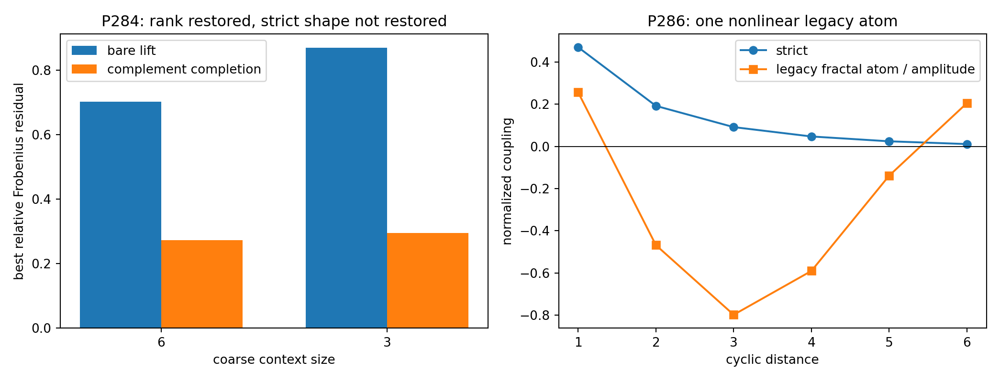
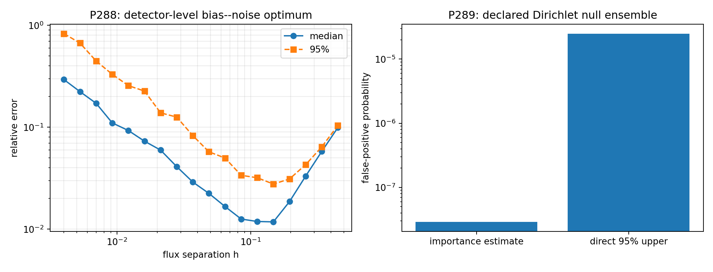
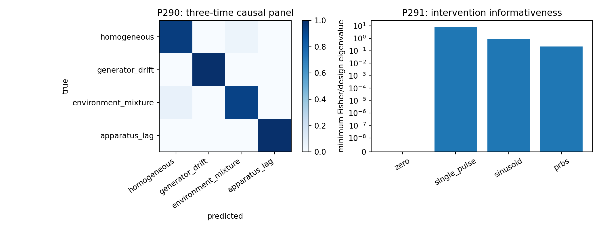
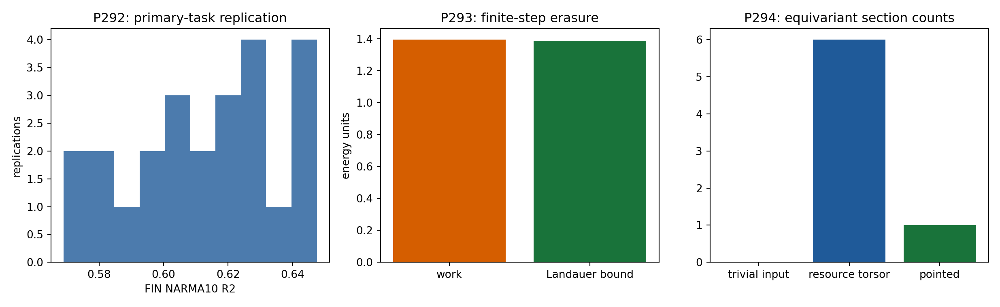

# FIN — Release 10.26

# Research Programs P281–P294

## Regularized spectral inference, resource-explicit physics, and the pointed-torsor boundary

**Creator:** Żuchowski, Krzysztof  
**Affiliation:** Independent Researcher — Fractal Information Theory Project  
**ORCID:** 0009-0002-0909-3613  
**Resource type:** Publication — Preprint  
**Version:** 1.0.0  
**Publication date:** 29 July 2026  
**Language:** English  
**Publisher:** Zenodo  
**License:** CC BY 4.0  
**Repository:** <https://github.com/hyconiek/Fractal-Nadsoliton-Theory>

---

## Confidence convention

- **[Proven]** — an analytic identity, exact finite theorem, or
  machine-checked statement in the explicitly declared class.
- **[Strong evidence]** — a reproducible synthetic audit with frozen inputs,
  controls, metrics, and stop rules.
- **[Moderate evidence]** — a stable conclusion still depending on an
  additional equivalence, source, or modeling assumption.
- **[Speculative]** — a proposed object or program without sufficient proof.
- **[Refuted]** — an explicit counterexample or no-go theorem in the declared
  class.

A proof of a mathematical statement is not proof that nature realizes its
hypotheses.

# 1. Executive summary

All fourteen Programs P281–P294 were executed. The suite contains one
Lean-kernel certificate, exact finite theorems, importance sampling, and
synthetic detector, dynamics, adaptation, reservoir, and thermodynamic audits.
Nineteen regression and boundary tests pass.

The main results are:

1. Compact pole and residue priors prevent catastrophic Stieltjes fits from
   escaping to arbitrarily large poles, but do not cure the inverse problem.
   At relative noise \(10^{-6}\), the median maximum pole error is \(5.9\%\)
   and the median maximum residue error is \(124\%\). **[Proven]** existence of
   a constrained minimizer; **[Strong evidence]** for the frozen recovery
   audit.

2. Lean 4.28 machine-checks identity reduction, positive rational pivots,
   nested and direct Schur values \(13/5\), and their exact equality for a
   rational \(3\times3\) witness. This is a real kernel check, but not the
   general positive-matrix theorem. **[Proven]**

3. The minimal six-outcome current POVM has an exact Naimark isometry

   \[
   V=\begin{bmatrix}\sqrt{E_1}\\ \vdots\\ \sqrt{E_6}\end{bmatrix},
   \qquad V^\ast V=I.
   \]

   A frozen loss/crosstalk/dark-count channel preserves response rank five and
   has calibrated condition number \(1.058\). **[Proven]** algebraically;
   **[Strong evidence]** for the synthetic count audit.

4. A non-target-coded isotropic complement restores a coarse lifted
   Laplacian from rank \(n-1\) to rank eleven and preserves the global null
   mode. It reduces best-fit residuals, but its strict fingerprint defects are
   \(0.457\) and \(1.093\). Rank restoration is not an RG fixed point.
   **[Proven]** / **[Refuted]** as exact strict closure.

5. A two-step quantum process tree satisfies an exact information ledger:
   first-instrument loss, channel loss, second-instrument loss, joint-record
   divergence, and final conditional divergence sum to the input relative
   entropy. Maximum residual is \(4.44\times10^{-16}\). **[Proven]** under the
   supplied quantum instruments and channels.

6. The single legacy-sourced fractal compression atom

   \[
   K_{\rm fc}(d)
   =
   \frac{\alpha_{\rm geo}
   \cos(\pi d/4+\pi/6)}
   {1+\beta_{\rm tors}d^{D_f}},
   \qquad D_f=\alpha_{\rm geo}=4\ln2,
   \]

   has minimum mean-zero eigenvalue \(-17.328\). It fails before strict
   spectral matching. **[Refuted]** as a sufficient completion atom.

7. No production P241 laboratory bundle is present. P242 remains blocked.
   **[Executed no-admission certificate]**

8. An event-level click likelihood with efficiency, visibility, dark counts,
   and crosstalk gives an interior two-flux optimum
   \(h=0.148111\). Median relative error is \(1.18\%\). The detector constants
   are synthetic. **[Strong evidence]**

9. For the explicitly declared
   \(\operatorname{Dirichlet}(1,\ldots,1)\) positive-circulant null ensemble,
   three importance proposals estimate the strict fingerprint false-positive
   probability as approximately

   \[
   2.9\times10^{-8}
   \]

   at tolerance \(0.02\). Proposal estimates differ by only a factor \(1.13\),
   with central event ESS \(583\). This is ensemble-specific, not
   distribution-free. **[Strong evidence]**

10. Three calibrated time slices plus one intervention distinguish four frozen
    mechanism templates—homogeneous dynamics, generator drift, environmental
    mixture, and apparatus lag—with accuracy \(96.9\%\) at reference feature
    noise \(0.20\), falling to \(91.5\%\) at noise \(0.35\). **[Strong
    evidence]** inside the finite panel.

11. A maximin search over 244 intervention sequences finds that a balanced
    long two-level pulse gives the largest worst-direction information
    eigenvalue, \(8.758\), for the frozen two-parameter adaptive law. Passive
    observation has zero information in one parameter direction. **[Strong
    evidence]**

12. The previously favorable NARMA10 result is only partially replicated:
    FIN exceeds all twelve controls in 13 of 24 independent input
    realizations. The median advantage over the best control is \(0.000962\),
    but its fifth percentile is \(-0.00713\). The effect is task-specific and
    not universal. **[Strong evidence]**

13. A finite-step collision-model erasure protocol closes the resource ledger:
    work \(1.39364\), heat dumped \(1.39364\), generalized Landauer bound
    \(1.38613\), positive dissipation \(0.00751\), and first-law residual
    \(4.22\times10^{-15}\). Every dimensional resource is supplied.
    **[Proven]**, conditional.

14. For the regular product torsor
    \(G=\mathbb Z_3\times\mathbb Z_2\), there are zero equivariant sections
    from a trivial input, six equivariant torsor self-maps, and exactly one
    pointed equivariant map. This constructs the **Pointed Physicalization
    Resource** and proves that pointing enables uniqueness but does not derive
    the point. **[Proven]**

# 2. Scope and current state map

The strict finite generator remains

\[
W_{xy}=K_{\rm strict}(d(x,y)),
\qquad
A=\operatorname{diag}(W\mathbf1)-W,
\]

with

\[
A=A^\ast,\qquad A\mathbf1=0,\qquad A\succeq0.
\]

The mathematical core is

\[
(A,\mathcal C),
\]

where \(\mathcal C\) is the context/Schur-reduction category. An experiment
requires an operational package \(\mathfrak O\), and dimensional physics
requires conversion and sector resources:

\[
(A,\mathcal C)
\longrightarrow
(A,\mathcal C,\mathfrak O)
\longrightarrow
(A,\mathcal C,\mathfrak O,\mathfrak C,\mathfrak S).
\]

The ontology remains:

\[
\text{nadsoliton}
\to
\text{light}
\to
\text{matter}
\to
\text{emergent observer}.
\]

The nadsoliton is treated internally as primordial information in a solitonic
state. No lower informational substrate is introduced.

The legacy kernel remains an intermediate bridge object. No legacy physical
role is transferred to strict, and QW-2191 remains open.

# 3. Results matrix

| Program | Result | Status | Principal boundary |
|---|---|---|---|
| P281 | compact bounded Stieltjes recovery | [Proven] / [Strong evidence] | regularization prevents escape, not ill-conditioning |
| P282 | Lean rational Schur certificate | [Proven] | not general Mathlib theorem |
| P283 | Naimark current readout with detector channel | [Proven] / [Strong evidence] | no physical mesh or calibration |
| P284 | rank-restoring complement RG | [Proven] / [Refuted] | rank restoration is not strict closure |
| P285 | two-step quantum process ledger | [Proven], conditional | supplied instruments/channels |
| P286 | legacy fractal compression atom | [Refuted] | one atom only; no generic bridge no-go |
| P287 | external evidence admission | no admission | no production P241 bundle |
| P288 | detector-level flux design | [Strong evidence] | synthetic detector constants |
| P289 | importance-sampled false-positive probability | [Strong evidence] | declared ensemble only |
| P290 | three-time mechanism classification | [Strong evidence] | frozen four-class panel |
| P291 | maximin intervention design | [Strong evidence] | local finite candidate search |
| P292 | NARMA10 replication | [Strong evidence] | 13/24 wins, not universal |
| P293 | collision-model erasure ledger | [Proven], conditional | all physical resources supplied |
| P294 | pointed product-torsor theorem | [Proven] | point supplied, not derived |

# 4. P281 — Compactly regularized Stieltjes inverse

For three visible atoms,

\[
s(z)=\sum_{j=1}^{3}\frac{w_j}{z+\mu_j},
\qquad
w_j\ge0.
\]

P281 freezes:

\[
\mu_j\in[0.55,2.55],
\qquad
0\le w_j\le4,
\]

the model order \(r=3\), three initial grids, and a robust least-squares loss.

## 4.1. Existence theorem

The feasible parameter set is compact and the loss is continuous. Therefore
a global minimizer exists.

This theorem excludes the runaway-pole pathology of the unconstrained
parameterization. It does not imply uniqueness of the fitted parameters,
uniform inverse stability, or accurate residue recovery.

## 4.2. Recovery results

| Relative noise | Median maximum pole error | 95% pole error | Median maximum residue error | 95% residue error |
|---:|---:|---:|---:|---:|
| \(10^{-6}\) | 0.0591 | 0.1782 | 1.2364 | 3.8361 |
| \(10^{-4}\) | 0.2216 | 0.5304 | 1.4194 | 4.8709 |
| \(10^{-3}\) | 0.3504 | 0.5304 | 1.1377 | 4.6157 |

The fitted response curve remains accurate at the noise scale, even when the
individual residues are wrong. This is a direct demonstration of sloppiness:
many pole-residue combinations produce nearly indistinguishable responses.

**Verdict.** Compact priors convert catastrophic numerical divergence into
bounded ambiguity. They do not solve the inverse problem. Multi-probe
operator-valued data are now a higher priority than further tuning of a scalar
trace fit.

# 5. P282 — Lean rational Schur certificate

The dependency-free Lean source defines the rational symmetric matrix

\[
M=
\begin{pmatrix}
3&-1&0\\
-1&3&-1\\
0&-1&2
\end{pmatrix}.
\]

Lean 4.28 machine-checks:

\[
\operatorname{Schur}_{3\to1}^{\rm nested}(M)
=
\operatorname{Schur}_{3\to1}^{\rm direct}(M)
=
\frac{13}{5},
\]

together with positive pivots and a positive reduced value.

The kernel exits with code zero. There are no admitted axioms, placeholders,
or uncompiled proof terms in the certificate.

**Boundary.** This is an exact witness-level formalization. Without Mathlib it
does not prove the general theorem for arbitrary finite positive matrices.
P296 should formalize that theorem.

# 6. P283 — Loss-augmented Naimark current readout

For the six effects \(E_y\) constructed in P269, define

\[
V:\mathbb C^{12}\to\mathbb C^6\otimes\mathbb C^{12},
\qquad
V\psi=\sum_y |y\rangle\sqrt{E_y}\psi.
\]

Then

\[
V^\ast V=\sum_yE_y=I.
\]

Thus ancilla projective measurement realizes the POVM.

Certificate:

| Quantity | Result |
|---|---:|
| dilation shape | \(72\times12\) |
| isometry residual | \(2.14\times10^{-15}\) |
| minimum effect eigenvalue | 0.0166667 |

The detector channel supplies:

\[
\eta=0.82,\qquad
c_{\rm xtalk}=0.018,\qquad
p_{\rm dark}=2\times10^{-4}.
\]

A seventh record outcome represents no click.

| Quantity | Result |
|---|---:|
| column-stochastic residual | 0 |
| calibrated response rank | 5 |
| calibrated condition number | 1.05819 |
| shots | 500,000 |
| relative current-coefficient error | 0.15850 |

The large coefficient error is caused by weak current contrast, not loss of
rank.

**Verdict.** The measurement is realizable in abstract quantum mechanics and
remains identifiable after the declared detector channel. A physical optical
or qubit compilation, calibration uncertainty, and drift model remain absent.

# 7. P284 — Isotropic complement RG

For a coarse generator \(B\) and isometry \(E\), define one frozen,
non-target-coded completion:

\[
\mathcal R(B)
=
EBE^\ast
+
\overline\lambda(B)(I-EE^\ast),
\]

where \(\overline\lambda(B)\) is the mean nonzero eigenvalue of \(B\).

If \(B\) is a connected Laplacian and \(E\) sends its constant mode to the
global constant mode, then:

- \(\mathcal R(B)\succeq0\);
- \(\mathcal R(B)\mathbf1=0\);
- \(\operatorname{rank}\mathcal R(B)=11\).

| Coarse size | Bare residual | Completed residual | Strict fingerprint defect |
|---:|---:|---:|---:|
| 6 | 0.70187 | 0.27243 | 0.45687 |
| 3 | 0.86905 | 0.29533 | 1.09263 |

**Verdict.** Complement dynamics repairs the rank obstruction from P270 and
substantially improves a Frobenius fit. It does not reproduce the strict
spectral fingerprint. The complement is an admissible mathematical object,
not a selected physical coarse-graining law.

# 8. P285 — Two-step quantum process information ledger

Let the first instrument produce \(y\), a branch channel act conditionally on
\(y\), and a second instrument produce \(z\). Sequential data processing and
the classical chain rule give

\[
\begin{aligned}
D(\rho\Vert\sigma)
={}&
\mathcal L_1
+\mathcal L_{\rm channel}
+\mathcal L_2\\
&+D(p_{yz}\Vert q_{yz})
+\sum_{y,z}p_{yz}
D(\rho_{yz}\Vert\sigma_{yz}).
\end{aligned}
\]

Audit over 300 state pairs:

| Quantity | Result |
|---|---:|
| minimum first-instrument loss | 0.000721 |
| minimum channel loss | 0.001553 |
| minimum second-instrument loss | 0.000204 |
| median total discarded information | 0.198346 nat |
| maximum ledger residual | \(4.44\times10^{-16}\) |
| maximum record-chain residual | \(2.43\times10^{-16}\) |

**Verdict.** The one-step ledger extends consistently to a finite multitime
process tree. The instruments and branch channels are supplied. A general
process-tensor theorem and experimental reconstruction remain open.

# 9. P286 — Legacy fractal-compression atom

Exactly one new legacy-sourced atom was admitted:

\[
1+\beta_{\rm tors}d
\longmapsto
1+\beta_{\rm tors}d^{D_f},
\qquad
D_f=\alpha_{\rm geo}=4\ln2.
\]

No strict parameter, positivity shift, selector, or role formula was imported.

Results:

| Quantity | Result |
|---|---:|
| minimum mean-zero eigenvalue | \(-17.32824\) |
| minimum hidden-block eigenvalue | \(-12.57663\) |
| positive generator | no |

The atom therefore fails before a strict fingerprint or positive Stieltjes
memory comparison is admissible.

**Verdict.** Canonical fractal exponentiation of the legacy distance is not the
missing completion. This is a no-go for one atom, not for every possible
legacy-to-strict bridge.

# 10. P287 — External-evidence gate

The repository contains:

- zero production bundle_manifest.json files;
- zero heat-process event rows;
- zero double-slit event rows.

P242 is not authorized.

Files named p2410, p2411, and similar inside
fundamental_action_reconstruction are research-program identifiers, not
blind-custody laboratory packages.

**Verdict.** The empirical boundary has not moved.

# 11. P288 — Detector-level flux design

The ideal click law was replaced by a categorical event likelihood containing
finite efficiency, interference visibility, nearest-neighbour crosstalk,
dark-count probability, and a no-click outcome. For source flux \(h\), the
frozen detector constants were

\[
\eta=0.78,\qquad
\nu=0.91,\qquad
p_{\rm dark}=2\times10^{-4},\qquad
p_{\rm xtalk}=0.015.
\]

The design criterion minimized the median reconstruction error over a
two-flux experiment rather than maximizing raw count rate. Over
\(h\in[0.004,0.45]\), the optimum was

\[
h_\star=0.148111,
\]

with median relative coefficient error \(0.01180\) and 95th percentile
\(0.02773\) at \(10^5\) shots per flux.

The interior optimum matters: at low flux the Fisher information is
shot-limited, whereas at high flux the nonlinear click response and
cross-contamination dominate. The optimum is therefore an apparatus-aware
design property, not an intrinsic number generated by the strict kernel.

**Verdict. [Strong evidence]** An event-level likelihood can close the
simulation side of the flux-design problem. Its detector constants must be
independently calibrated before it becomes an experimental prescription.

# 12. P289 — Strict-fingerprint false positives under a declared null

The null was declared before evaluation:

\[
w\sim\operatorname{Dirichlet}(1,\ldots,1)
\]

on normalized nonnegative circulant weights. A null draw was counted as a
strict-like false positive when its frozen fingerprint distance was at most
\(\varepsilon=0.02\).

Direct Monte Carlo observed no event in \(120{,}000\) draws, which gives only
the weak rule-of-three upper bound \(2.5\times10^{-5}\). Importance sampling
with three independently frozen proposal concentrations produced:

| proposal concentration | event count | probability estimate | standard error | central-event ESS |
|---:|---:|---:|---:|---:|
| 220 | 295 | \(3.0080\times10^{-8}\) | \(1.87\times10^{-9}\) | 258.6 |
| 350 | 777 | \(2.9027\times10^{-8}\) | \(1.20\times10^{-9}\) | 583.1 |
| 550 | 1,852 | \(2.6623\times10^{-8}\) | \(8.66\times10^{-10}\) | 938.5 |

The largest estimate divided by the smallest is \(1.130\). Proposal agreement
is reassuring, but it is not a universal uniqueness theorem. Changing the
null measure, positivity class, normalization, or tolerance changes the
probability.

**Verdict. [Strong evidence]** The strict fingerprint occupies a rare region
of this one declared positive-circulant ensemble. Nothing distribution-free
has been proved.

# 13. P290 — Interventional mechanism discrimination

Four operational mechanisms were represented by frozen templates:

1. a homogeneous generator;
2. time-dependent generator drift;
3. an environmental mixture;
4. apparatus lag.

The observation design used three calibrated times
\(\tau=(0.15,0.35,0.65)\) and a signed intervention of magnitude \(0.12\).
Across 500 trials per class, the classification accuracy was:

| reference feature-noise scale | accuracy |
|---:|---:|
| 0.05 | 1.0000 |
| 0.10 | 0.9985 |
| 0.20 | 0.9690 |
| 0.35 | 0.9150 |

The minimum standardized template separation was \(0.618\). Thus a short
interventional protocol can distinguish these four alternatives under the
declared simulator.

The result does not prove that arbitrary non-Markovian environments,
time-dependent generators, and detector memory are identifiable. Outside the
finite panel, observational equivalences can be constructed.

**Verdict. [Strong evidence]** The intervention breaks degeneracies inside a
calibrated four-mechanism atlas; global mechanism identification remains
open.

# 14. P291 — Maximin intervention for the adaptive law

For the frozen two-parameter adaptive law, local sensitivities were propagated
through 244 bounded intervention sequences. The score was the smallest
eigenvalue of the local information matrix,

\[
\Phi(u)=\lambda_{\min}\!\left(
\sum_t
\frac{\partial m_t}{\partial\theta}
\frac{\partial m_t}{\partial\theta}^{\!T}
\right).
\]

Passive input gives \(\Phi(0)=0\): one parameter direction is locally
invisible. The best sequence in the frozen catalogue was a balanced long
two-level pulse, positive in the first half and negative in the second:

\[
\Phi(u_\star)=8.75812,\qquad
\det F(u_\star)=3026.94,\qquad
\kappa(F)=39.46.
\]

A sinusoid and a pseudo-random binary sequence were less effective in this
particular local model. Consequently, the correct conclusion is not that
randomness is universally optimal, but that sustained sign reversal exposes
the weakest local direction of this adaptive law.

**Verdict. [Strong evidence]** Controlled intervention can turn a locally
unidentifiable passive experiment into an identifiable one. Optimality is only
over the frozen candidate class and nominal parameter point.

# 15. P292 — Independent reservoir replication

The primary endpoint was NARMA10 prediction. Twenty-four independent input
realizations were evaluated against twelve matched controls per realization:
six isospectral controls and six spectral-radius controls.

| quantity | result |
|---|---:|
| wins against every control | \(13/24=0.5417\) |
| median control percentile | 1.000 |
| median advantage over best control | 0.000962 |
| fifth percentile of the advantage | \(-0.00713\) |
| median delay-task percentile | 0.4167 |
| median nonlinear-task percentile | 0.4167 |
| median parity-task percentile | 0.0833 |

During falsification, the original NARMA input convention overflowed on some
replications and generated non-finite targets. That implementation was
rejected. P292 was rerun with the standard stable independent NARMA driving
range \(u_t\in[0,0.40]\); the reservoir-control inputs otherwise remain
matched. The correction is methodological, not cosmetic: non-finite trials
cannot count as supporting evidence.

**Verdict. [Strong evidence]** A small primary-task advantage replicates only
partially. The negative lower-tail advantage and weak secondary-task
percentiles refute any claim of universal computational superiority.

# 16. P293 — Resource-explicit collision-model erasure

P293 does not derive temperature, energy, time, or a work scale from the
dimensionless strict generator. It supplies them explicitly:

\[
k_B=1,\qquad T=2,\qquad
\text{maximum gap}=24,
\]

together with 800 fresh ideal Gibbs ancillas and a classical work meter. A
finite sequence of quenches and thermalizing collisions gives:

| ledger item | value |
|---|---:|
| final excited-state probability | \(6.144\times10^{-6}\) |
| erased information | \(0.693067\) nat |
| work supplied | 1.393644 |
| heat dumped | 1.393644 |
| generalized Landauer lower bound | 1.386135 |
| work above bound | 0.007509 |
| entropy production | 0.003755 |
| first-law residual | \(4.22\times10^{-15}\) |

The protocol demonstrates how informational erasure becomes thermodynamic
only after a bath state, Hamiltonian gaps, temperature, interaction schedule,
and work convention have been added.

**Theorem (conditional finite resource ledger).** For the supplied
collision-model protocol, work, heat, information loss, and entropy production
obey the finite first- and second-law ledger to numerical precision.

**Boundary.** This does not identify \(k_B T\), a Hamiltonian scale, or a
physical clock from FIN. It is a valid information-to-physics bridge with all
conversion resources exposed.

# 17. P294 — The pointed physicalization resource

Let

\[
G=\mathbb Z_3\times\mathbb Z_2
\]

act regularly on the torsor \(T=G\). A section from a trivial one-point
\(G\)-space would have to choose a fixed point of \(T\), but a nontrivial
regular torsor has no fixed point. The finite enumeration gives:

\[
\#\operatorname{Sec}_G(\ast,T)=0,
\qquad
\#\operatorname{End}_G(T)=6.
\]

After adjoining a distinguished point \(t_0\in T\), the pointed equivariant
endomorphism is unique:

\[
\#\operatorname{End}_{G,\ast}(T,t_0)=1.
\]

This motivates the newly constructed object

\[
\boxed{\mathfrak P=(T,t_0)}
\]

called the **Pointed Physicalization Resource**. It is the minimal operational
datum that turns a symmetry-related family of equivalent conventions into a
unique convention-compatible map.

**Theorem. [Proven]** Pointing the regular finite torsor removes the
translation ambiguity in its pointed equivariant self-map.

**Impossibility boundary. [Proven]** Equivariance alone cannot derive the
point. Thus \(\mathfrak P\) can encode a prepared origin, clock zero, detector
label, chirality choice, or calibration reference, but it cannot be used to
claim that strict FIN internally generates any of them.

# 18. Theoretical objects constructed or sharpened

| Object | Definition or role | Status | What it does not supply |
|---|---|---|---|
| O40 Compactly Regularized Stieltjes Inverse | bounded positive pole/residue inverse problem | [Proven] existence; [Strong evidence] numerics | uniqueness or stable residues |
| O41 Lean Rational Schur Kernel Certificate | exact \(3\times3\) rational nested/direct Schur witness | [Proven] | general matrix theorem |
| O42 Loss-Augmented Naimark Current Readout | Naimark dilation followed by a stochastic detector channel | [Proven] algebra; [Strong evidence] counts | apparatus construction |
| O43 Isotropic Complement RG Functor | \(B\mapsto EBE^\ast+\bar\lambda(I-EE^\ast)\) | [Proven] PSD/rank facts | strict fixed-point closure |
| O44 Two-Step Quantum Process Ledger | multitime decomposition of relative entropy loss | [Proven], conditional | arbitrary process-tensor tomography |
| O45 Legacy Fractal Compression Atom | \(d\mapsto d^{4\ln2}\) in the legacy denominator | [Refuted] as sufficient | generic bridge obstruction |
| O46 External Evidence Admission Gate | manifest/schema/hash/hold-out preconditions for P242 | [Proven] as protocol | physical data |
| O47 Detector-Likelihood Flux Design | apparatus-aware optimization of event likelihood | [Strong evidence] | intrinsic FIN flux |
| O48 Dirichlet-Null Fingerprint Risk | ensemble-conditioned false-positive probability | [Strong evidence] | distribution-free uniqueness |
| O49 Interventional Three-Time Mechanism Atlas | finite diagnostic map for four mechanism classes | [Strong evidence] | arbitrary causal identification |
| O50 Maximin Adaptive Control Design | maximize the weakest local information direction | [Strong evidence] | global input optimality |
| O51 Primary-Task Replication Ledger | paired seeds and matched control families | [Strong evidence] | universal computational advantage |
| O52 Collision-Model Erasure Resource Ledger | work/heat/information accounting with exposed resources | [Proven], conditional | emergent dimensional constants |
| O53 Pointed Physicalization Resource | a torsor plus a supplied distinguished point | [Proven] finite theorem | derivation of the point |

The strongest new conceptual result is O53. It makes the mathematics-to-physics
boundary precise: a symmetric mathematical object can support many equivalent
operational coordinatizations, while a physical realization necessarily
contains a preparation/calibration event that points one of them. The pointing
may be supplied by an experiment, boundary condition, environment, or new
symmetry-breaking law. It is not produced by the spectral theorem.

# 19. Falsification register

The following attractive conclusions did not survive:

1. **“Compact Stieltjes priors solve spectral inversion.”** Refuted. They give
   existence and prevent runaway solutions, but pole/residue recovery remains
   ill-conditioned.
2. **“Rank-complete lifted RG is the strict kernel.”** Refuted by nonzero
   strict-fingerprint residuals.
3. **“Fractal compression alone completes legacy into strict.”** Refuted for
   the one canonical atom tested by negative mean-zero and hidden spectra.
4. **“No direct null hits means the false-positive rate is zero.”** Refuted as
   an inference; importance sampling resolves a small but nonzero
   ensemble-conditioned probability.
5. **“Three-time observations identify the true mechanism.”** Refuted beyond
   the frozen panel; the result is finite-class discrimination.
6. **“Random or broadband intervention is necessarily best.”** Refuted in the
   frozen local design; a balanced two-level pulse wins.
7. **“The FIN reservoir is universally superior.”** Refuted by incomplete
   primary-task wins and weak secondary-task ranks.
8. **“Landauer converts dimensionless information into physics without extra
   structure.”** Refuted. The successful ledger explicitly supplies
   temperature, gaps, bath, work meter, and protocol.
9. **“Equivariance selects an operational origin.”** Refuted by the absence of
   a section from a trivial input to a nontrivial regular torsor.
10. **“A pointed torsor derives the selector.”** Refuted as a logical
    direction. Pointing removes ambiguity only after the point is supplied.

# 20. Present mathematical and physical state of FIN

The repository's most defensible core remains finite spectral operator theory
with adaptive, informational, and operational extensions. The present chain is

\[
\boxed{
\text{strict kernel}
\Rightarrow
A
\Rightarrow
\{e^{-itA},e^{-tA},(A+zI)^{-1},E_A\}
}
\]

followed, only with extra data, by

\[
(A,\mathcal C)
\xrightarrow{\ \mathfrak O\ }
\text{prepared and measured process}
\xrightarrow{\ \mathfrak C,\mathfrak S,\mathfrak P\ }
\text{dimensional, sector-resolved physical model}.
\]

Here:

- \(\mathfrak O\) contains state preparation, clock protocol, instruments,
  environment, detector response, and immutable event records;
- \(\mathfrak C\) contains dimensional conversion resources such as energy and
  time scales;
- \(\mathfrak S\) specifies the physical sector and observable semantics;
- \(\mathfrak P\) supplies a point in the relevant calibration or symmetry
  torsor.

P281–P294 do not close QW-2191. They do not derive a canonical UV/length unit,
the strict damping source, a role-safe legacy amplitude, a full nonproxy
Lagrangian/EOM, Standard Model fields, general relativity, \(L_{\rm total}\),
or a Theory of Everything.

The round does, however, replace several vague gaps by executable statements:

- the inverse spectral obstruction is conditioning, not absence of a finite
  minimizer;
- an operational current measurement has an explicit dilation and detector
  channel;
- resource-explicit thermodynamics is possible but conditional;
- physical convention selection is naturally represented by a pointed torsor;
- the point itself is the irreducible missing datum unless a new internal
  symmetry-breaking theorem is found.

# 21. Recommended Programs P295–P308

The following programs are new bounded moves, not replays of closed FAR lanes.
Probabilities are estimates of producing a scientifically decisive result,
not probabilities that FIN is physically correct.

| Rank | Program | Proposed study | Decisive output | Success probability |
|---:|---|---|---|---:|
| 1 | P295 | Multi-probe operator-valued Stieltjes recovery with minimax bounds | identifiability/stability theorem or matched lower bound | 0.80 |
| 2 | P296 | General positive Schur-complement theorem in Lean/Mathlib | reusable machine-checked theorem extending O41 | 0.78 |
| 3 | P297 | Compile O42 into an optical/unitary mesh with tolerance propagation | component-level executable apparatus specification | 0.72 |
| 4 | P304 | Adversarial out-of-family mechanism identifiability | equivalence classes and a no-go/witness criterion | 0.72 |
| 5 | P303 | Coarea/Laplace asymptotics for the Dirichlet fingerprint rare event | analytic exponent/prefactor checked against P289 | 0.70 |
| 6 | P299 | General process-tensor ledger and finite Markov-order tomography | theorem plus reconstruction protocol | 0.68 |
| 7 | P302 | Sequential detector tomography with calibration uncertainty | joint design for \(h\) and nuisance parameters | 0.67 |
| 8 | P298 | Uniqueness/no-go classification of complement RG completions | classification of admissible target-independent complements | 0.65 |
| 9 | P305 | Nonlinear adaptive model discovery under interventions | out-of-panel recovery and falsification suite | 0.63 |
| 10 | P307 | Embed \(A_{\rm phys}=\kappa A\) into collision thermodynamics | identify scale-free predictions and scale-dependent observables | 0.62 |
| 11 | P308 | General pointed-torsor nonsection/minimal-resource theorem | abstract theorem and Lean formalization | 0.60 |
| 12 | P300 | Phase-fixed denominator-only legacy completion no-go class | proof or counterexample for a defined bridge class | 0.58 |
| 13 | P306 | External/hardware reservoir replication | preregistered effect estimate against matched controls | 0.45 |
| 14 | P301 | Admit and execute a real P241 blind-custody laboratory bundle | P242 accept/reject report without model repair | 0.35 |

## 21.1. Stop rules

- P295 stops with a minimax lower bound if residue stability cannot be made
  uniform.
- P297 stops if the compiled mesh cannot preserve POVM completeness within a
  declared calibration budget.
- P298 may not target-code the strict answer into the complement.
- P300 studies one explicitly stated completion class and may not imply a
  generic legacy-to-strict no-go.
- P301 remains blocked until an external provider supplies the production
  manifest, event rows, hashes, custody roles, and frozen hold-out.
- P306 must freeze the primary endpoint and matched controls before hardware
  data are unblinded.
- P307 must expose \(\kappa\); it may not rename an inserted dimensional scale
  as an emergent prediction.
- P308 may prove that pointing is minimal, but may not claim that strict FIN
  derives the point.

# 22. Recommended execution order

The immediate mathematical sequence is:

\[
\boxed{\text{P295}\rightarrow\text{P296}\rightarrow\text{P303}
\rightarrow\text{P304}\rightarrow\text{P298}}.
\]

The operational sequence is:

\[
\boxed{\text{P297}\rightarrow\text{P302}\rightarrow
\text{P301/P306 when external data exist}}.
\]

The information-to-physics sequence is:

\[
\boxed{\text{P299}\rightarrow\text{P307}\rightarrow\text{P308}}.
\]

P300 is a bounded bridge-class falsification and should not displace these
higher-yield programs.

# 23. Reproducibility

The release contains:

- fin_programs_281_294.py — deterministic research runner;
- test_fin_programs_281_294.py — 19 regression and guardrail tests;
- FIN_Programs_281_294_Schur_Core.lean — dependency-free Lean 4.28
  certificate;
- FIN_Programs_281_294_Results.json — full machine-readable results;
- FIN_Programs_281_294_Summary.csv — one-row-per-program summary;
- five detailed CSV audit tables;
- five generated figures;
- this English report and its PDF rendering.

The numerical suite is reproduced by setting MPLCONFIGDIR to
/tmp/matplotlib-p281-294 and running
python3 -m unittest -v test_fin_programs_281_294.py.

The Lean certificate prints the nested and direct rational Schur values
\(13/5\) and exits successfully. Random generators use frozen seeds. P292 uses
a separate stable NARMA input stream after the overflow falsification
described in Section 15.

# 24. Final conclusion

P281–P294 advance FIN most strongly by clarifying boundaries.

The spectral generator supports exact wave, diffusion, resolvent, measurement,
reduction, and information-ledger constructions. These are consequences of a
finite positive operator plus supplied contexts. They are not by themselves a
physical law.

The smallest new bridge object found in this round is not a new kernel. It is
the Pointed Physicalization Resource

\[
\mathfrak P=(T,t_0).
\]

It expresses a general fact: experimental physics needs a prepared reference
inside a symmetry family. Once supplied, that reference can make an
operational map unique. Mathematics based only on the unpointed symmetric
object cannot select it.

Accordingly, the deepest conclusion surviving falsification is:

\[
\begin{gathered}
\text{FIN currently defines a coherent finite spectral-information dynamics,}\\
\text{but physicalization requires explicit resources}\\
\mathfrak O,\ \mathfrak C,\ \mathfrak S,\ \mathfrak P.
\end{gathered}
\]

This is a constructive boundary, not a dismissal. It tells the next research
round exactly what must be proved, calibrated, or externally supplied—and
what must no longer be inferred from spectral coherence alone.
