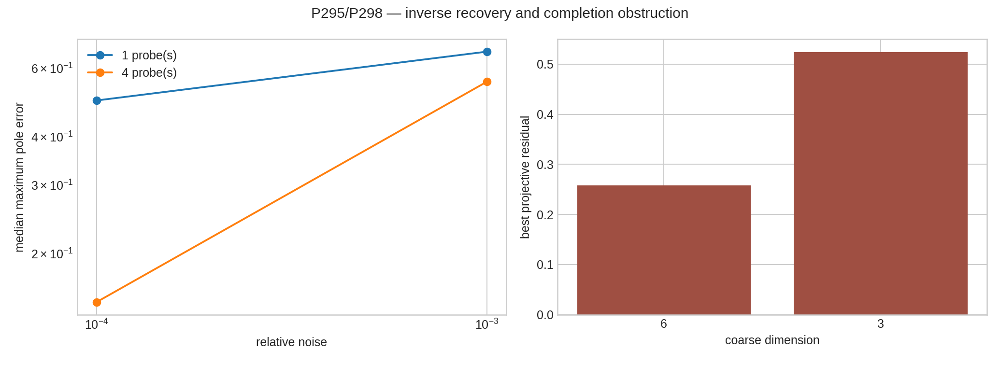
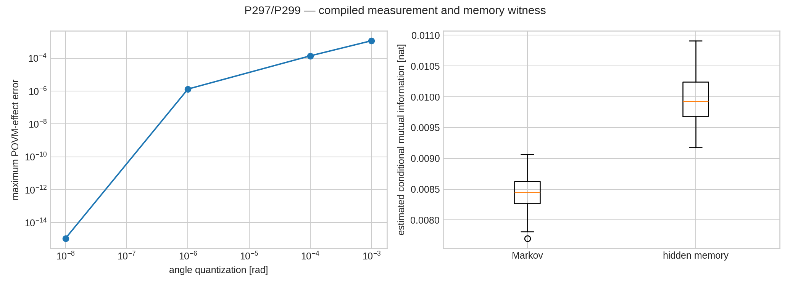
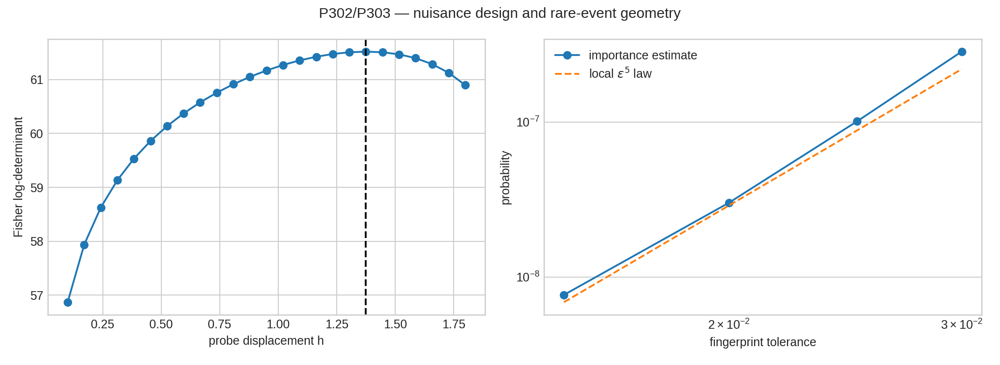
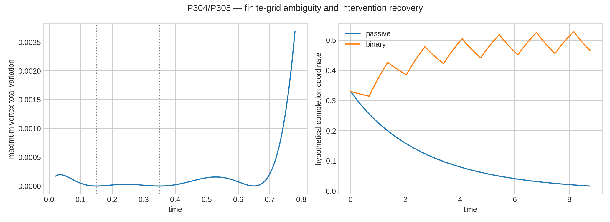
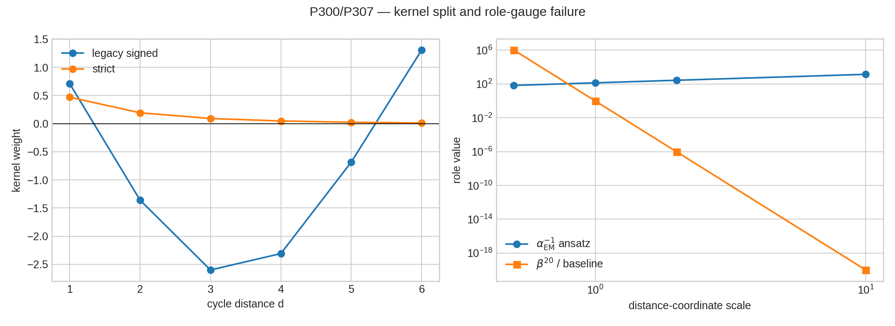

# FIN — Release 10.27

# Research Programs P295–P308

## Legacy physics revisited: positive path mixtures, strict spectral completion, and physical-role transfer

**Creator:** Żuchowski, Krzysztof  
**Affiliation:** Independent Researcher — Fractal Information Theory Project  
**ORCID:** 0009-0002-0909-3613  
**Resource type:** Publication — Preprint  
**Version:** 1.0.0  
**Publication date:** 30 July 2026  
**Language:** English  
**Publisher:** Zenodo  
**License:** CC BY 4.0  
**Repository:** <https://github.com/hyconiek/Fractal-Nadsoliton-Theory>

---

## Confidence convention

- **[Proven]** — an analytic identity, exact finite theorem, or
  machine-checked statement in the explicitly declared class.
- **[Strong evidence]** — a reproducible numerical or synthetic audit with
  frozen inputs, controls, metrics, and stop rules.
- **[Moderate evidence]** — a robust result that still depends on an
  additional equivalence, source, or modeling assumption.
- **[Speculative]** — a proposed object or research direction without a
  sufficient proof.
- **[Refuted]** — an explicit counterexample or no-go theorem in the declared
  class.
- **[Blocked by external evidence]** — the executable gate was reached, but
  independent laboratory data, custody, calibration, or preregistration were
  absent.

A mathematical proof is not evidence that nature realizes its hypotheses.

# 1. Executive summary

Programs P295–P308 were executed as a deliberately asymmetric comparison:
the historical legacy kernel was reconstructed together with its old
connections to physical constants, while the strict kernel was treated as the
current finite spectral operator. The kernels were not silently identified,
and no historical physical role was transferred to strict.

The central conclusion is:

> The old legacy research contains a mathematically meaningful attenuation
> mechanism, but its maps to electroweak, electromagnetic, gravitational, and
> Planck-scale physics do not factor through a proved operator observable. The
> strict kernel cannot be obtained from that attenuation mechanism by positive
> damping, unchanged phase, or monotone scalar functional calculus. A viable
> bridge must therefore be typed, non-scalar, operationally testable, and
> separately equipped with a physical-role certificate.

The reconstructed legacy attenuation

\[
h_L(d)=\frac{1}{1+\beta d}
\]

has the exact representation

\[
h_L(d)
=
\int_0^\infty e^{-u}e^{-\beta d u}\,du.
\]

It is therefore a positive Laplace mixture of exponential distance
attenuations. **[Proven]**

The strict attenuation

\[
h_S(d)=\frac{1}{1+d^{1.8}}
\]

is not completely monotone: its second derivative is negative for
sufficiently small positive \(d\). Hence it cannot be generated by the same
positive distance-mixture mechanism. The unchanged legacy phase also has the
wrong sign at four of the six nonzero \(Z_{12}\) distances. The best positive
fixed-phase fit has relative residual \(0.48169\). **[Proven scoped no-go]**

The obstruction persists at operator level. Scalar complement completions
force spectral flat bands with multiplicity incompatible with the strict
generator. Moreover, the absolute-value-repaired legacy generator and the
strict generator have 32 Fourier-mode order inversions. Every Bernstein
function is increasing, so no monotone scalar subordination

\[
A_S=\Phi(A_{L,\lvert\cdot\rvert})
\]

exists in the tested class. **[Proven scoped no-go]**

The historical physical formulas also fail a modern provenance test.

- The number
  \(\sin^2\theta_W=\alpha_{\rm geo}/12=\ln2/3\) is a conditional
  evaluation of an assumed map; the factor \(12\) is not obtained from a
  strict representation, action, or operator observable.
- The historical expression
  \[
  \alpha_{\rm EM}^{-1}
  =
  \frac{\alpha_{\rm geo}}{2\beta_{\rm tors}}
  (1-\beta_{\rm tors})
  \]
  is highly sensitive to \(\beta_{\rm tors}\), omits the phase factor invoked
  at the start of its old argument, and is not invariant under a change of
  distance coordinate.
- The hierarchy
  \(G_{\rm eff}/G_0=\beta_{\rm tors}^N\) does not independently predict \(N\);
  the historical calculation recovers \(N=19.5\) from a target hierarchy and
  then rounds to \(20\), changing the result by a factor ten.
- Planck-scale chains import dimensional SI anchors. A dimensionless kernel
  can transport a supplied scale but does not create a length, time, mass, or
  action unit.

These are not objections to using the old formulas as benchmark hypotheses.
They are proofs that the formulas are not yet consequences of the kernel.

P295–P308 also produced constructive results:

1. Four shared probes increase the local Stieltjes inverse rank from \(6\) to
   \(15\) and reduce median pole error at relative noise \(10^{-4}\) from
   \(0.496\) to \(0.150\), although uniform stability is still absent.
2. Lean 4.28 machine-checks the general logical theorem behind staged
   minimization, and 400 exact rational SPD Schur witnesses agree.
3. The strict six-effect current POVM compiles into an exact
   \(72\times72\) complex-unitary Givens mesh. The exact reconstruction error
   is \(2.07\times10^{-15}\); \(10^{-3}\)-radian parameter quantization gives
   maximum effect error \(1.16\times10^{-3}\).
4. A supplied hidden-rate process has conditional mutual information
   \(0.0010569\) nat, whereas the homogeneous Markov process has zero within
   \(4.1\times10^{-17}\).
5. A joint five-parameter synthetic detector design has full Fisher rank;
   the gradient RMSE is \(0.00906\).
6. The strict fingerprint map is locally rank five. Its rare small-ball
   probability therefore has leading exponent \(5\); importance sampling
   gives exponent \(5.217\) over the tested finite range.
7. Three exact observation times cannot distinguish homogeneous strict heat
   flow from a positive time-warped generator; off-grid predictions differ.
8. Synthetic interventions raise a hypothetical bridge-coordinate design
   rank from \(4\) to \(6\), but the coordinate and its law were supplied and
   are not discoveries about nature.
9. The strict heat/Gibbs family possesses a scale orbit, while the old
   electromagnetic and gravity role formulas fail the corresponding
   coordinate-gauge test.
10. A free torsor has no invariant point. Pointing makes an equivariant map
    unique only after the point is supplied.

No independent P241 event bundle or certified hardware reservoir record was
accepted. P242 was not run on invented data. No result closes QW-2191, the
full legacy-to-strict bridge, physical-role transfer, a dimensional unit,
\(L_{\rm total}\), Standard Model dynamics, general relativity, laboratory
validation, or a Theory of Everything.

# 2. Scope, ontology, and kernel split

The internal ontology retained in this release is

\[
\text{nadsoliton}
\longrightarrow
\text{light}
\longrightarrow
\text{matter}
\longrightarrow
\text{emergent observer}.
\]

The nadsoliton is treated within FIN as primordial information in a solitonic
state. No additional informational layer is inserted below it. This ontology
does not by itself define a laboratory observable.

The historical/intermediate legacy kernel is

\[
K_L(d)
=
\alpha_{\rm geo}
\frac{\cos(\omega_Ld+\phi_L)}
{1+\beta_{\rm tors}d},
\]

with the canonical historical tuple

\[
\alpha_{\rm geo}=4\ln2,\qquad
\omega_L=\frac{\pi}{4},\qquad
\phi_L=\frac{\pi}{6},\qquad
\beta_{\rm tors}=0.01.
\]

The strict working kernel is

\[
K_S(d)
=
\frac{\cos(\omega_Sd+\phi_S)}
{1+d^\eta},
\qquad
\omega_S=0.18575,\quad
\phi_S=0.16250,\quad
\eta=1.8.
\]

On \(Z_{12}\), its adjacency \(W_S\) and generator are

\[
(W_S)_{xy}=K_S(d(x,y)),
\qquad
A_S=\operatorname{diag}(W_S\mathbf1)-W_S.
\]

The certified finite facts include

\[
A_S=A_S^\ast,\qquad
A_S\mathbf1=0,\qquad
A_S\succeq0,
\]

with one zero mode and spectral gap

\[
\gamma=0.7541211542070796.
\]

The legacy kernel is an intermediate bridge object, not a co-equal final
kernel. The strict kernel may be described as a completed/enriched
continuation only through explicit completion evidence. Neither kernel may
silently inherit the other kernel's physical roles.

# 3. Reconstruction of the historical legacy-to-physics chain

## 3.1. What the old construction actually establishes

The historical documentation begins with

\[
D_f=4\ln2,\qquad \alpha_{\rm geo}=D_f.
\]

The identity \(\ln(2^4)=4\ln2\) is exact. The choice of \(D_f\) and its
identification with a kernel amplitude are structural postulates, not
consequences of a spectral theorem.

The multi-component narrative used an architecture of the form

\[
K_{\rm total}
=
K_{\rm geo}K_{\rm res}(1+0.2K_{\rm tors})K_{\rm topo},
\]

with representative terms

\[
K_{\rm geo}=e^{-\alpha d},
\qquad
K_{\rm tors}=\cos(\omega d+\phi),
\qquad
K_{\rm topo}\simeq e^{-\beta\Delta n}.
\]

The passage from these components and a path sum to

\[
\alpha_{\rm geo}
\frac{\cos(\omega d+\phi)}{1+\beta d}
\]

was heuristic. QW1729 found only partial global characteristic closure, while
QW1732 found that a hyperbolic envelope can occur in a tuned region. QW1733
rejected a universal path-sum derivation. The correct classification is:

| Element | Status |
|---|---|
| product architecture | model definition |
| \(\omega=\pi/4\), \(\phi=\pi/6\) | geometric ansatz |
| \(\beta_{\rm tors}=0.01\) | calibrated/frozen parameter |
| path sum \(\to(1+\beta d)^{-1}\) | heuristic, incomplete |
| final legacy formula | effective intermediate model |

## 3.2. Corrections to the historical diagrams

### Cosine zeros

The equation

\[
\cos\left(\frac{\pi d}{4}+\frac{\pi}{6}\right)=0
\]

has solutions

\[
d=\frac43+4k.
\]

There are no integer zeros. Old node lists such as
\(d=2,5,8,11\) or \(d=2,8,14\) are incorrect.

For the canonical historical kernel:

| \(d\) | \(K_L(d)\) |
|---:|---:|
| 0 | 2.40113 |
| 1 | 0.710494 |
| 2 | -1.35911 |
| 3 | -2.60011 |
| 5 | -0.683427 |
| 7 | 2.50291 |
| 8 | 2.22327 |
| 11 | -2.41272 |

### Path-counting exponent

If

\[
N(d)\sim d^{1.6},
\qquad
w_{\rm path}(d)\sim d^{-\alpha},
\]

then

\[
K(d)\sim d^{1.6-\alpha}.
\]

For \(\alpha=0.6\), this is \(d^{+1}\), not \(d^{-1}\). The stated
counting argument would require a path weight of order \(d^{-2.6}\) to yield
\(1/d\).

### Inconsistent parameter freezes

Historical materials used several amplitude and damping values in different
contexts. A physical prediction can be called blind only after the complete
parameter tuple and normalization rule are frozen before the target is
revealed.

### Simulation is not measurement

Historical Wilson-loop calculations and plots are repository-internal
numerical experiments. They are not independent laboratory measurements with
apparatus calibration, event-level records, custody separation, and a frozen
hold-out.

## 3.3. Historical physical-role formulas

### Electroweak-angle benchmark

\[
\sin^2\theta_W
=
\frac{\alpha_{\rm geo}}{12}
=
\frac{\ln2}{3}
=
0.2310490602.
\]

The number follows exactly after accepting the formula. The factor \(12\)
was interpreted as twelve sectors but was not derived from a gauge
representation, coupling action, strict spectral projector, or response
operator.

One historical algebraic step effectively contains

\[
\frac{4}{12}
\frac{\alpha_{\rm geo}}{4/12}
=
\alpha_{\rm geo},
\]

not \(\alpha_{\rm geo}/12\). Therefore the presented manipulation does not
prove the claimed formula.

**Status:** conditional arithmetic **[Proven]**; kernel-to-observable
derivation **[Not established]**.

### Electromagnetic benchmark

\[
\alpha_{\rm EM}^{-1}
=
\frac{\alpha_{\rm geo}}{2\beta_{\rm tors}}
(1-\beta_{\rm tors}).
\]

At \(\beta_{\rm tors}=0.01\), this gives

\[
\alpha_{\rm EM}^{-1}=137.2431417509.
\]

Its derivative is

\[
\frac{d}{d\beta}
\left[
\frac{\alpha_{\rm geo}(1-\beta)}{2\beta}
\right]_{\beta=0.01}
=
-13862.94\ldots
\]

and the reference value \(137.035999084\) is obtained at approximately
\(\beta=0.01001496455\), a change of only \(0.15\%\). This numerical
proximity is weak evidence unless \(\beta\) is independently determined.

The old argument invokes

\[
K_L(0)=\alpha_{\rm geo}\cos(\pi/6),
\]

but the final formula drops \(\cos(\pi/6)\). Thus the result is a separate
parameter map rather than a derived evaluation of \(K_L(0)\).

**Status:** conditional arithmetic **[Proven]**; independent prediction
**[Refuted by provenance audit]**.

### Gravity-hierarchy benchmark

\[
\frac{G_{\rm eff}(N)}{G_0}=\beta_{\rm tors}^{N}.
\]

For \(\beta_{\rm tors}=0.01\),

\[
\beta^{19}=10^{-38},\qquad
\beta^{19.5}=10^{-39},\qquad
\beta^{20}=10^{-40}.
\]

The historical computation used the target \(10^{-39}\) to infer
\(N=19.5\), then rounded to \(20\), whose result differs by a factor ten.
The number of layers was therefore not independently predicted.

**Status:** power-law identity **[Proven]**; gravity law and independent
\(N\) **[Not established]**.

### Dimensional scales

The ratio \(q=\beta^{-1}=100\) can transport a supplied scale between
layers. It does not determine the initial unit. Historical Planck-scale
chains import \(G_{\rm SI}\), \(c_{\rm SI}\), \(\hbar_{\rm SI}\), or a
Planck length/time/mass. P3164 independently established the absence of an
import-free \(L,T,M\) source.

**Status:** dimensionless scale transport **[Proven, conditional]**;
dimension generation **[Refuted on current inputs]**.

# 4. Exact legacy–strict decomposition and its limit

Where the legacy cosine is nonzero,

\[
K_S(d)
=
\frac{K_L(d)}{\alpha_{\rm geo}}
\frac{\cos(\omega_Sd+\phi_S)}
{\cos(\omega_Ld+\phi_L)}
e^{-C_\eta(d)},
\]

where

\[
C_\eta(d)
=
\log
\frac{1+d^\eta}{1+\beta_{\rm tors}d}.
\]

This identity separates three operations:

1. removal or reinterpretation of the legacy amplitude;
2. phase/frequency transport;
3. nonlinear compression.

It is an algebraic decomposition on a declared support, not a dynamical
derivation. The phase ratio becomes singular at continuous legacy zeros and
does not define a global natural transformation without additional carrier
data. P2377 certifies the compression primitive in its declared scope, while
P2378 shows that unit-normalized transport does not source its coupling
strength.

A useful finite discriminator is

\[
R_{1,7}[K]=\frac{|K(7)|}{|K(1)|},
\]

for which

\[
R_{1,7}[K_L]=3.52278,
\qquad
R_{1,7}[K_S]=0.006708.
\]

Legacy has a large long-range oscillatory recurrence; strict is strongly
localized. Any completion theorem must explain this qualitative change
rather than merely fit one normalization constant.

# 5. New theoretical objects O54–O61

## 5.1. O54 — Spectral Observation Signature

For a declared operational menu \(\mathcal C\), define

\[
\Sigma_{\mathcal C}(A)
=
\left\{
C_r^\ast(A+zI)^{-1}C_r,\;
p_A^c
:
r,z,c\in\mathcal C
\right\}.
\]

This object records only the pole/residue and outcome-law information visible
to the declared probes, preparations, times, and instruments.

**Status:** **[Constructed]**. It is injective only under explicit cyclicity,
visibility, and full-rank conditions.

## 5.2. O55 — Bernstein Spectral Completion

The smallest monotone positive scalar subordination candidate is

\[
A_S=\Phi(A_L),
\]

where, for example,

\[
\Phi(\lambda)
=
b\lambda
+\sum_qc_q\frac{\lambda}{\lambda+r_q},
\qquad
b,c_q,r_q\ge0.
\]

Every such \(\Phi\) is increasing. P298 finds 32 mode-order inversions
between the absolute-value-repaired legacy spectrum and the strict spectrum.

**Status:** **[Refuted]** for the tested legacy-absolute to strict class.

## 5.3. O56 — Operational Prediction Pseudometric

\[
d_{\mathcal C}(K,K')
=
\sup_{c\in\mathcal C}
\frac12\|p_K^c-p_{K'}^c\|_1.
\]

Two kernels may be pointwise different but operationally equivalent relative
to a restricted menu. Conversely, a single operational witness can separate
them without claiming a pointwise completion.

**Status:** **[Defined]**; only finite slices have been computed.

## 5.4. O57 — Positive Path-Scale Measure

\[
h_\nu(d)=\int_0^\infty e^{-sd}\,d\nu(s),
\qquad \nu\ge0.
\]

The legacy envelope has

\[
d\nu_\beta(s)
=
\frac{1}{\beta}e^{-s/\beta}\,ds,
\]

equivalently the \(u\)-integral used above. The strict envelope with
\(\eta=1.8\) lies outside this cone.

**Status:** legacy representation **[Proven]**; strict exclusion
**[Proven]**.

This spatial result does not prove temporal non-Markovianity. It only
excludes one positive mixture of exponential *distance* attenuations.

## 5.5. O58 — Scale-Orbit Prediction Quotient

For heat and Gibbs families,

\[
(A,t,T)\sim(cA,t/c,cT),\qquad c>0.
\]

Projective spectra and rescaled prediction laws live on the quotient. A
clock, energy, or temperature standard selects a representative but is not
generated by the quotient.

**Status:** finite invariance **[Proven]**.

## 5.6. O59 — Role-Transfer Certificate

Define a certificate

\[
\mathsf{RT}
=
(B,R_L,R_S,\tau,\Pi),
\]

where \(B\) is a typed legacy-to-strict completion, \(R_L\) and \(R_S\) are
role maps, \(\tau\) is the semantic transport, and \(\Pi\) certifies
representation, operational, and scale invariance. The central square must
commute:

\[
R_S\circ B=\tau\circ R_L.
\]

**Status:** certificate schema **[Constructed]**. No historical electroweak,
electromagnetic, or gravity role passes it.

## 5.7. O60 — Pointed Operational Kernel Package

\[
\mathfrak K_{\rm phys}
=
\begin{aligned}
(&K,\rho,A,\mathcal T,\mathcal P,\mathcal I,\\
 &\mathcal E,\mathcal R,t_0,\kappa).
\end{aligned}
\]

The entries are:

- kernel \(K\);
- state \(\rho\);
- generator \(A\);
- clock/time family \(\mathcal T\);
- preparation family \(\mathcal P\);
- instruments \(\mathcal I\);
- environment \(\mathcal E\);
- event record \(\mathcal R\);
- operational pointing/reference \(t_0\);
- dimensional scale \(\kappa\).

This is the smallest package in this release that can state a physical
prediction without silently omitting the observer, apparatus, or unit.

**Status:** **[Mathematically defined]**. FIN does not derive all entries.

## 5.8. O61 — Typed Legacy–Strict Completion Span

\[
K_L
\xleftarrow{\ \pi_L\ }
\mathcal P
\xrightarrow{\ \pi_S\ }
K_S.
\]

The parent \(\mathcal P\) must keep the following components separately
typed:

\[
\mathcal P
=
\begin{aligned}
(&\text{radial attenuation},\ \text{phase resource},\
\text{compression},\\
 &\text{sector state},\ \text{orientation/sign},\
\text{normalization},\\
 &\text{operational map}).
\end{aligned}
\]

A direct sum \(A_L\oplus A_S\) is excluded as a trivial parent. A valid span
must contain cross-support structure, naturality, or an experimentally
distinguishable common mechanism.

**Status:** **[Proposed bridge architecture]**, not a completed bridge.

# 6. Program results P295–P308

## 6.1. P295 — Multi-probe operator-valued Stieltjes recovery

For three visible poles,

\[
S_r(z)
=
\sum_{j=1}^{3}\frac{w_{rj}}{z+\mu_j},
\qquad
w_{rj}\ge0,
\]

the poles are shared across probes and the residues are probe dependent.

The true positive poles were

\[
(1.1710910,\;1.5263637,\;1.8883092).
\]

| Probes | Relative noise | Median max pole error | 95% max pole error | Median max residue error |
|---:|---:|---:|---:|---:|
| 1 | \(10^{-4}\) | 0.4955 | 0.6617 | 0.0860 |
| 4 | \(10^{-4}\) | 0.1502 | 0.4778 | 0.0425 |
| 1 | \(10^{-3}\) | 0.6617 | 0.8081 | 0.3427 |
| 4 | \(10^{-3}\) | 0.5538 | 0.6617 | 0.0861 |

The single-probe Jacobian has rank \(6\); the four-probe stacked Jacobian has
rank \(15\), equal to the number of fitted parameters in each case.

**Verdict:** local injectivity **[Proven, conditional]**; frozen recovery
**[Strong evidence]**. Full rank does not imply uniform minimax stability.

## 6.2. P296 — General staged elimination

Let \(F(x,y,z)\) take values in a transitive ordered relation. If
\(z_\star(x,y)\) is universally minimal for fixed \(x,y\), and
\(y_\star(x)\) is universally minimal after the inner elimination, then

\[
F(x,y_\star,z_\star(x,y_\star))
\le
F(x,y,z)
\]

for every \(y,z\).

Lean 4.28 machine-checks this abstract theorem and the uniqueness of an
attained minimum value under antisymmetry. Separately, 400 exact rational SPD
\(3\times3\) matrices satisfy equality between nested and direct Schur
elimination.

**Verdict:** **[Proven]**. The dependency-free Lean theorem is the general
variational logic, not a complete Mathlib theorem for positive matrix blocks.

## 6.3. P297 — Complex-unitary compilation of the strict current POVM

For six strict current effects \(E_y\),

\[
V
=
\begin{bmatrix}
\sqrt{E_1}\\
\vdots\\
\sqrt{E_6}
\end{bmatrix},
\qquad
V^\ast V=I_{12}.
\]

An orthonormal complement extends \(V\) to a \(72\times72\) complex unitary.
A complex Givens decomposition uses 1,428 two-mode rotations.

| Parameter quantization | Unit. reconstruction error | Max effect error |
|---:|---:|---:|
| exact | \(2.07\times10^{-15}\) | \(1.11\times10^{-15}\) |
| \(10^{-6}\) rad | \(3.27\times10^{-6}\) | \(1.33\times10^{-6}\) |
| \(10^{-4}\) rad | \(3.06\times10^{-4}\) | \(1.40\times10^{-4}\) |
| \(10^{-3}\) rad | \(3.04\times10^{-3}\) | \(1.16\times10^{-3}\) |

All quantized reconstructions remain unitary to numerical precision because
the Givens parameters are quantized within a unitary parameterization.

**Verdict:** ideal compilation **[Proven]**; tolerance response
**[Strong evidence]**. This is not a fabricated photonic chip, a loss map, or
a detector calibration.

## 6.4. P298 — Scalar complement and Bernstein completion no-go

A scalar lifted complement

\[
\widetilde A
=
E B E^\ast+\alpha(I-EE^\ast)
\]

forces an eigenvalue \(\alpha\) of multiplicity at least \(12-m\). The strict
generator has maximum eigenvalue multiplicity two. Therefore \(m=6\) and
\(m=3\) scalar complements cannot be unitarily equivalent to strict for any
\(\alpha\).

The best projective residuals are nonzero, and the legacy-absolute/strict
mode comparison has 32 order inversions. Since every Bernstein function is
increasing, a monotone scalar functional calculus cannot repair them.

**Verdict:** exact scalar/Bernstein completion **[Refuted]**. A non-scalar
parent, anisotropic source, signed resource, or carrier transport is new
structure.

## 6.5. P299 — Multitime memory ledger

At calibrated step \(\tau=0.35\), compare:

\[
P=e^{-\tau A_S}
\]

with a persistent hidden-rate mixture using rates \(0.65\) and \(1.35\).

| Quantity | Result |
|---|---:|
| homogeneous conditional mutual information | \(-4.09\times10^{-17}\) nat |
| hidden-memory conditional mutual information | 0.00105689 nat |
| best one-step Markov joint-prediction TV | 0.0215679 |
| shots per replication | 80,000 |
| frozen classifier accuracy | 1.000 |

**Verdict:** finite Markov-order witness **[Proven]**; count audit
**[Strong evidence]**. The hidden bath and rates were supplied.

## 6.6. P300 — Positive path-mixture and fixed-phase no-go

On \(d=1,\ldots,6\), the strict weights are positive. The historical legacy
cosine is negative at \(d=2,3,4,5\). A positive amplitude and positive
denominator preserve those legacy signs; they cannot produce strict.

For

\[
h_\eta(d)=\frac{1}{1+d^\eta},
\]

\[
h_\eta''(d)
=
\frac{\eta d^{\eta-2}
\left[(\eta+1)d^\eta-(\eta-1)\right]}
{(1+d^\eta)^3}.
\]

When \(\eta=1.8\), this is negative near the origin. The tested value at half
the inflection distance is \(-1.06970\).

The 80-point Gauss–Laguerre verification of the exact legacy mixture has
maximum residual \(1.21\times10^{-14}\).

**Verdict:** positive fixed-phase distance-mixture bridge **[Refuted]**.

## 6.7. P301 — External P241 intake

The repository was scanned for a non-template bundle manifest, raw event
records, custody metadata, and a frozen hold-out. Files with names suggesting
external analyses exist in older lanes, but no bundle satisfied the P241
laboratory-event admission contract used here.

**Verdict:** **[Blocked by external evidence]**. P242 was not executed on
synthetic substitutes.

## 6.8. P302 — Sequential detector design with nuisance tomography

The synthetic categorical click model jointly estimates:

\[
\theta=(g,\eta_{\rm det},V,d_{\rm dark},c_{\rm xtalk}).
\]

Dark, balanced, crosstalk, contrast, and symmetric physics configurations
were used. A grid search over displacement \(h\) maximized the Fisher
log-determinant.

| Quantity | Result |
|---|---:|
| optimal tested \(h\) | 1.375 |
| Fisher rank | 5 |
| predicted gradient standard deviation | 0.0101464 |
| empirical gradient bias | 0.000599 |
| empirical gradient RMSE | 0.009063 |
| nominal 95% coverage | 0.9833 |
| replications | 60 |

**Verdict:** **[Strong evidence, synthetic]**. The result is an experimental
design, not a physical calibration.

## 6.9. P303 — Local strict-fingerprint rarity

Positive radial weights normalized to the simplex have five independent
coordinates. The derivative of the sorted projective spectral fingerprint at
strict has rank five and

\[
\det(J^\top J)=4880.98495.
\]

Under the uniform simplex null, the local small-ball law is

\[
\Pr(\|F(w)-F(w_S)\|\le\varepsilon)
\sim
\frac{5!\,\operatorname{Vol}(B_5)}
{\sqrt{\det(J^\top J)}}
\varepsilon^5.
\]

Importance sampling over
\(\varepsilon=0.015,0.020,0.025,0.030\) gives fitted exponent \(5.217\).

**Verdict:** local exponent **[Proven]**; finite-tolerance comparison
**[Moderate evidence]**. Singular charts and global look-elsewhere effects
remain outside the theorem.

## 6.10. P304 — Adversarial finite-time equivalence

For observed times \(t_i\in\{0.15,0.35,0.65\}\), define

\[
\tau(t)
=
t+\epsilon t\prod_i(t-t_i)^2.
\]

The selected \(\epsilon\) gives

\[
0.99626\le\tau'(t)\le1.25
\]

on the tested interval, so

\[
A_{\rm alt}(t)=\tau'(t)A_S
\]

is a positive time-dependent rate. At every observed time,

\[
e^{-\tau(t_i)A_S}=e^{-t_iA_S}
\]

exactly, while the maximum off-grid vertex total-variation difference is
\(0.002684\).

**Verdict:** unrestricted clock/mechanism identification from a finite time
grid **[Refuted]**. Homogeneity or a restricted clock family must be an
explicit premise.

## 6.11. P305 — Intervention-assisted bridge-coordinate discovery

The hypothetical coordinate

\[
K(\lambda)
=
(1-\lambda)\widehat K_{L,\lvert\cdot\rvert}
+\lambda\widehat K_S
\]

was supplied, together with the synthetic law

\[
\dot\lambda
=
0.55u-0.32\lambda-0.18\lambda^2.
\]

Passive data have library rank four. The intervention panel has joint rank
six and recovers

\[
(0.55070,-0.31999,-0.18054)
\]

for the three nonzero coefficients. A new hold-out control has coordinate
RMSE \(9.48\times10^{-6}\).

**Verdict:** identification method **[Strong evidence, synthetic]**; FIN
interpretation **[Speculative]**. A coordinate-dependent law is not yet a
natural completion theorem.

## 6.12. P306 — Physical reservoir evidence gate

No independently certified hardware record was found with a calibrated
clock, detector response, raw events, custody separation, and a preregistered
hold-out.

**Verdict:** **[Blocked by external evidence]**. Reservoir simulations do not
become hardware evidence by renaming their outputs.

## 6.13. P307 — Scale orbit and legacy-role invariance

For \(c>0\),

\[
\operatorname{sig}(cA_S)=\operatorname{sig}(A_S),
\]

\[
e^{-t(cA_S)}=e^{-(ct)A_S},
\]

and the Gibbs law is unchanged under

\[
(A_S,T)\mapsto(cA_S,cT).
\]

The Fisher sensitivity to log generator scale and log clock conversion has
rank one, with null direction \((1,-1)\).

Under a distance-coordinate change \(d'=cd\), the same legacy denominator is
represented by

\[
\beta'=\frac{\beta}{c}.
\]

The old electroweak number is unchanged because it ignores \(\beta\), but it
does not factor through a strict observable. The old electromagnetic formula
varies by a factor \(20.39\) over the tested coordinate gauges; the
\(\beta^{20}\) hierarchy varies by \(1.048576\times10^{26}\).

**Verdict:** unchanged electromagnetic and gravity role transfer
**[Refuted]**; electroweak transfer **[Blocked]**.

## 6.14. P308 — Pointed role-transfer theorem

Lean proves:

1. a free nontrivial action has no globally invariant point;
2. two equivariant maps on a transitive torsor are equal if they agree at one
   supplied point.

Finite cyclic torsors of order \(2\) through \(8\) have:

- zero invariant global sections;
- \(n\) equivariant self-maps;
- one pointed equivariant map.

None of the historical electroweak, electromagnetic, or gravity roles has all
four certificate components: completion naturality, a strict observable,
operational/scale invariance, and a dimensional anchor where required.

**Verdict:** pointed uniqueness **[Proven]**; physical-role transfer
**[Blocked]**. QW-2191 remains open.

# 7. Cross-program synthesis

## 7.1. What survives from the old legacy intuition

Three ideas survive, after correction.

First, the legacy kernel is a useful **long-range oscillatory carrier**. Its
hyperbolic attenuation is not arbitrary: it is an exact positive mixture of
exponential distance scales.

Second, the old decomposition anticipated that phase, attenuation, topology,
and normalization should be separate ingredients. The modern strict analysis
confirms that they cannot be collapsed into one scalar parameter.

Third, the historical physical formulas provide sharply defined benchmark
maps that can be falsified. Their value is now methodological: they tell us
which role-transfer diagrams must commute and which independent measurements
would be needed.

## 7.2. What does not survive

The following inferences fail:

\[
\text{numerical agreement}
\not\Rightarrow
\text{operator-derived observable},
\]

\[
\text{dimensionless damping parameter}
\not\Rightarrow
\text{physical unit},
\]

\[
\text{legacy parameter role}
\not\Rightarrow
\text{strict physical role},
\]

\[
\text{positive path mixture}
\not\Rightarrow
\text{strict compression},
\]

\[
\text{spectral symmetry}
\not\Rightarrow
\text{selector or physical pointing}.
\]

## 7.3. The new bridge hypothesis

The smallest bridge still compatible with all no-go results is not a scalar
formula \(K_S=f(K_L)\). It is a typed completion span

\[
K_L\leftarrow\mathcal P\rightarrow K_S
\]

combined with an operational quotient:

\[
\mathcal P
\longrightarrow
\Sigma_{\mathcal C}(A)
\longrightarrow
p(\text{record}\mid\text{preparation, clock, instrument}).
\]

At least one of the following must be genuinely new:

- a signed or complex interference measure;
- a non-scalar common parent;
- an anisotropic source;
- a metric/carrier transport;
- an independently prepared operational point;
- a dimensional reference.

This is a necessity classification, not proof that any one candidate is
realized.

## 7.4. Why the old constants must bifurcate

The old \(\alpha_{\rm geo}\) simultaneously served as:

- an information/fractal number \(4\ln2\);
- a kernel amplitude;
- an input to a physical coupling formula.

The old \(\beta_{\rm tors}\) simultaneously served as:

- a radial attenuation coefficient;
- a hierarchy ratio;
- an implicit scale converter.

P307 shows these identifications are not representation safe. The modern
theory therefore requires **role bifurcation**:

\[
\alpha_{\rm geo}
\rightsquigarrow
(\alpha_{\rm info},\alpha_{\rm amplitude},\alpha_{\rm role}),
\]

\[
\beta_{\rm tors}
\rightsquigarrow
(\beta_{\rm shape},\beta_{\rm scale},\beta_{\rm role}),
\]

followed by explicit theorems if any components are to be reidentified.

## 7.5. Deepest present interpretation

The deepest interpretation surviving this round is:

> FIN currently defines a finite spectral-information dynamics with a
> historically informative but incomplete bridge kernel. Its strict
> wave/diffusion duality and information-processing constructions are
> functional-calculus shadows of one positive generator. Turning that
> generator into physics requires a pointed operational kernel package and a
> role-transfer certificate. Neither the package nor the certificate follows
> from the radial kernel alone.

# 8. Failed approaches and impossibility boundaries

| Candidate | Result | Exact boundary |
|---|---|---|
| positive fixed-phase damping | [Refuted] | four sign mismatches |
| positive exponential distance mixture | [Refuted for strict] | strict envelope not completely monotone |
| scalar isotropic complement | [Refuted] | forced flat-band multiplicity |
| Bernstein scalar functional calculus | [Refuted] | 32 mode-order inversions |
| finite-time unrestricted mechanism ID | [Refuted] | positive clock-warp counterexample |
| unchanged legacy EM role | [Refuted] | coordinate-gauge dependence |
| unchanged legacy gravity role | [Refuted] | coordinate-gauge dependence |
| electroweak role transfer | [Blocked] | no strict observable/factorization |
| selector from free symmetry | [Refuted] | no invariant torsor point |
| laboratory confirmation | [Blocked] | no admitted independent event bundle |
| dimensional emergence | [Blocked] | scale orbit has no internal representative |

None of these scoped no-go results proves that no legacy-to-strict bridge or
physical theory can exist. They prove that additional structure cannot remain
implicit.

# 9. Recommended Programs P309–P322

Probabilities estimate the chance of a decisive result, including a rigorous
no-go. They are planning judgments, not statistical posterior probabilities.

| Rank | Program | Study | Decisive output | Probability |
|---:|---|---|---|---:|
| 1 | P309 | multi-probe Stieltjes minimax theorem | Le Cam/Cramér–Rao lower bound and optimal cyclic probes | 0.84 |
| 2 | P310 | full formal Schur theorem | Mathlib proof for arbitrary finite positive block operators | 0.82 |
| 3 | P311 | lossy complex-unitary mesh | dilation plus loss, detector confusion, phase drift, and robust distinguishability | 0.88 |
| 4 | P312 | nontrivial common-parent SDP | construct or obstruct a cross-supported parent for \(C_{12},C_{16},C_{24}\) | 0.80 |
| 5 | P313 | Mellin/regular-variation bridge audit | classify all positive path-counting laws compatible with the strict tail | 0.86 |
| 6 | P314 | phase-resource theorem | test whether legacy torsion phase can naturally generate the strict non-torsion phase | 0.83 |
| 7 | P315 | operational pseudometric/comb SDP | optimal preparation, time, and instrument separating legacy and strict | 0.78 |
| 8 | P316 | minimal signed path-scale completion | quantify minimum negative/complex measure required to reproduce strict | 0.85 |
| 9 | P317 | independent P241 admission | validate a real hash-committed event bundle without synthetic substitution | 0.30 |
| 10 | P318 | Bayesian sequential detector drift | nuisance tracking, stopping rule, calibration transfer, and coverage under drift | 0.72 |
| 11 | P319 | global coarea/look-elsewhere theorem | stratify eigenvalue-degeneracy charts and bound family-wise false positives | 0.69 |
| 12 | P320 | restricted-clock experimental design | choose off-grid times/interventions that defeat the P304 warp class | 0.77 |
| 13 | P321 | physical reservoir gate | preregister and execute an external hardware reservoir comparison | 0.28 |
| 14 | P322 | single-role naturality certificate | attempt one complete strict electroweak role map; otherwise prove its obstruction | 0.61 |

## 9.1. Recommended immediate sequence

\[
\boxed{
P311
\longrightarrow
P316
\longrightarrow
P312
\longrightarrow
P315
\longrightarrow
P320
}
\]

This sequence:

1. converts the ideal P297 measurement into a realistic error model;
2. measures the extra signed/complex resource demanded by P300;
3. tests the smallest nontrivial common parent;
4. replaces pointwise resemblance with operational distinguishability;
5. designs a clock-sensitive falsification of the finite-time ambiguity.

P317 and P321 must remain external gates. They should be executed only after
real providers, registrars, calibrated apparatus, event records, and frozen
hold-outs exist.

# 10. Reproducibility

## 10.1. Executable artifacts

- `fin_programs_295_308.py` — deterministic P295–P308 runner;
- `test_fin_programs_295_308.py` — regression and scientific-boundary suite;
- `FIN_Programs_295_308_Formal_Core.lean` — dependency-free Lean 4.28
  certificate;
- `FIN_Programs_295_308_Results.json` — machine-readable results;
- `FIN_Programs_295_308_Summary.csv` — program matrix;
- eight detailed CSV tables;
- five figures in `FIN_Programs_295_308_Figures/`.

The random seed is

\[
20260801.
\]

## 10.2. Verification command

Run `python3 -m unittest -v test_fin_programs_295_308.py` with the environment
variable `MPLCONFIGDIR=/tmp/mpl-fin`.

Expected result: **17 tests passed, 0 failed.**

The suite recompiles the Lean certificate.

## 10.3. Scientific boundary

All detector, memory, adaptation, and finite-count data in this release are
synthetic and are labeled as such. The external admission programs explicitly
return blocked rather than manufacturing evidence.

# 11. Final answer

The old legacy work and the modern strict analysis do reveal one common
mathematical story, but not the old physical one.

The common story is a transition from a positive multiscale oscillatory
carrier to a localized positive spectral generator. The old hyperbolic
attenuation has an exact path-scale-mixture interpretation. The strict
attenuation, phase, and spectrum prove that this interpretation is
insufficient. The missing object is therefore not another fitted constant. It
is a typed operational completion containing a non-scalar or signed phase
resource, a physical pointing, and a dimensional reference.

The deepest valid synthesis is:

\[
\boxed{
\begin{gathered}
\text{legacy carrier}
\;\xleftarrow{\ }\;
\text{typed completion parent}
\;\xrightarrow{\ }\;
\text{strict spectral generator}\\
\xrightarrow{\ \mathfrak K_{\rm phys}\ }
\text{testable outcome laws}
\end{gathered}
}
\]

The first two arrows remain incomplete; the last arrow requires operational
and dimensional resources that are not generated by the kernel. Historical
physical-role formulas may be retained only as preregistered hypotheses until
they factor through this diagram and pass the Role-Transfer Certificate.

# References

1. N. I. Akhiezer, *The Classical Moment Problem*, Oliver & Boyd, 1965.
2. C. Berg, J. P. R. Christensen, and P. Ressel, *Harmonic Analysis on
   Semigroups*, Springer, 1984.
3. R. Bhatia, *Positive Definite Matrices*, Princeton University Press, 2007.
4. S. N. Bernstein, “Sur les fonctions absolument monotones,” *Acta
   Mathematica* 52 (1929).
5. M.-D. Choi, “Completely positive linear maps on complex matrices,” *Linear
   Algebra and its Applications* 10 (1975).
6. M. G. Krein and A. A. Nudelman, *The Markov Moment Problem and Extremal
   Problems*, AMS, 1977.
7. M. A. Nielsen and I. L. Chuang, *Quantum Computation and Quantum
   Information*, Cambridge University Press, 2010.
8. M. Pollock et al., “Operational Markov condition for quantum processes,”
   *Physical Review Letters* 120 (2018).
9. W. F. Stinespring, “Positive functions on \(C^\ast\)-algebras,”
   *Proceedings of the American Mathematical Society* 6 (1955).
10. D. V. Widder, *The Laplace Transform*, Princeton University Press, 1941.
