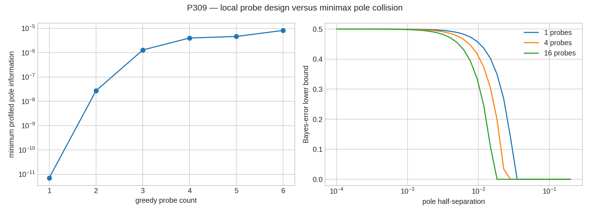
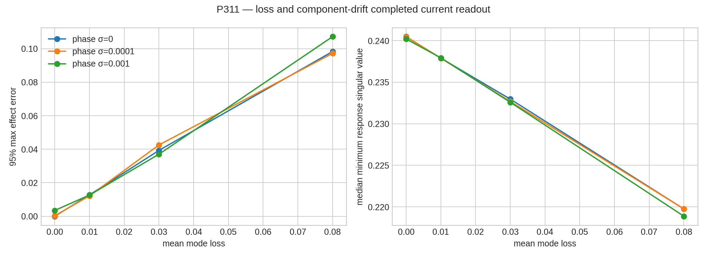
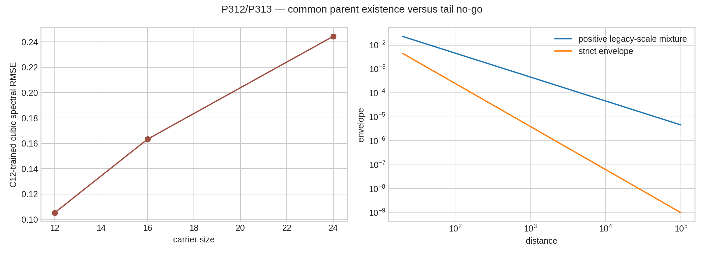
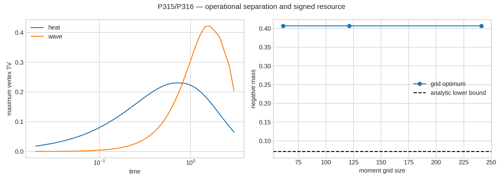
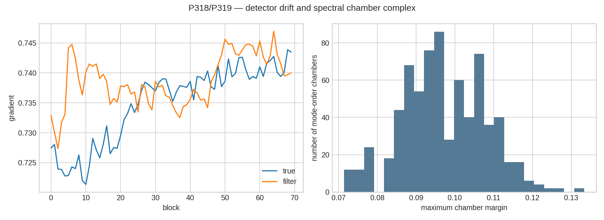
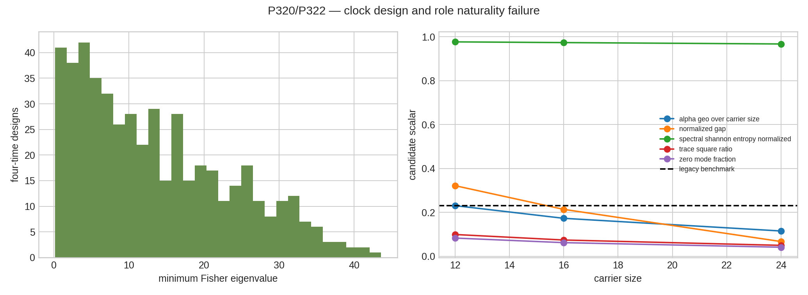

# FIN — Release 10.28

# Research Programs P309–P322

## Bridge-resource lower bounds, operational separation, and the sector-role obstruction

**Creator:** Żuchowski, Krzysztof  
**Affiliation:** Independent Researcher — Fractal Information Theory Project  
**ORCID:** 0009-0002-0909-3613  
**Resource type:** Publication — Preprint  
**Version:** 1.0.0  
**Publication date:** 30 July 2026  
**Language:** English  
**Publisher:** Zenodo  
**License:** CC BY 4.0  
**Repository:** <https://github.com/hyconiek/Fractal-Nadsoliton-Theory>

---

## Confidence convention

- **[Proven]** — analytic identity, finite theorem, exact arithmetic result, or
  machine-checked statement in the declared class.
- **[Strong evidence]** — reproducible numerical or synthetic audit with
  frozen inputs, controls, and metrics.
- **[Moderate evidence]** — stable result depending on an additional
  equivalence or modeling assumption.
- **[Speculative]** — proposed object without sufficient proof.
- **[Refuted]** — counterexample or no-go theorem in the declared class.
- **[Blocked by external evidence]** — an executable gate was reached, but
  independent data, calibration, custody, or hardware were absent.

A mathematical construction is not evidence that nature realizes it.

# 1. Executive summary

Programs P309–P322 were executed. This round did not search for another
pointwise fit between the historical legacy kernel and the strict kernel.
Instead, it measured the minimum additional resources demanded by the no-go
results of Release 10.27.

The principal result is a quantitative **Bridge Resource Budget**:

\[
\mathfrak B_{L\to S}
=
(\mathcal N_{\rm path},
r_{\rm phase},
X_{\rm parent},
t_0,
\kappa,
\mathfrak O).
\]

Its components are:

- signed path-scale negativity \(\mathcal N_{\rm path}\);
- an infinite-order phase generator \(r_{\rm phase}\);
- an independently sourced cross-supported parent law \(X_{\rm parent}\);
- operational pointing \(t_0\);
- dimensional scale \(\kappa\);
- operational package \(\mathfrak O\) containing preparations, clock,
  instrument, environment, and record.

The first two components now have rigorous lower-bound or minimal-extension
theorems. A cross-supported parent can be constructed, but only by importing
both repaired legacy and strict operators. Pointing, scale, and external
physical records remain additional.

## 1.1. Signed resource is unavoidable

For the strict attenuation samples

\[
h_d=\frac{1}{1+d^{1.8}},
\qquad d=0,\ldots,6,
\]

the fourth forward difference is

\[
\Delta^4h_0=-0.07152755810446826.
\]

Every positive exponential-distance mixture is a Hausdorff moment sequence
and satisfies

\[
\Delta^4h_0\ge0.
\]

Consequently, every normalized signed representation has Jordan negative mass

\[
\boxed{
\mathcal N_{\rm path}
\ge
0.07152755810446826
}.
\]

Finite moment-grid linear programs give:

| Moment grid | Minimum negative mass | Moment residual |
|---:|---:|---:|
| 61 | 0.4068556 | \(2.60\times10^{-14}\) |
| 121 | 0.4067611 | \(2.22\times10^{-16}\) |
| 241 | 0.4067109 | \(5.55\times10^{-17}\) |

The analytic value \(0.07153\) is a rigorous continuum lower bound. The value
near \(0.4067\) is a grid-dependent upper bound and optimum inside each
declared finite atom set. **[Proven] / [Strong evidence]**

This does not prove a quantum interpretation. It proves that positive
classical path-scale mixing is insufficient.

## 1.2. One new infinite-order phase generator is necessary

The legacy phase subgroup generated by

\[
e^{i\pi/4},\qquad e^{i\pi/6}
\]

is finite of order \(24\).

For the frozen strict decimal tuple,

\[
\omega_S=\frac{743}{4000},
\qquad
\phi_S=\frac{13}{80}=\frac{650}{4000}.
\]

Since \(\gcd(743,650)=1\), one generator

\[
r=e^{i/4000}
\]

is sufficient:

\[
e^{i\omega_S}=r^{743},
\qquad
e^{i\phi_S}=r^{650}.
\]

Because \(\pi\) is transcendental, \(r\) has infinite order. A
torsion-preserving map from the finite legacy phase group cannot generate it.

**Verdict:** one infinite-order phase generator is the minimal algebraic
extension for the frozen decimal tuple. It is target-coded and is not an
internal FIN source. **[Proven]**

## 1.3. A nontrivial parent exists but is not a derivation

After the explicit absolute-value positivity repair of legacy, define

\[
\mathcal P
=
\begin{pmatrix}
A_L & A_L^{1/2}A_S^{1/2}\\
A_S^{1/2}A_L^{1/2} & A_S
\end{pmatrix}.
\]

For the commuting circulant operators on \(C_{12}\), \(C_{16}\), and
\(C_{24}\), this is a positive cross-supported Gram parent. Its rank is
\(n-1\), compared with \(2n-2\) for the direct sum. Both principal
compressions are exact.

However, the cross block imports \(A_S^{1/2}\). The construction proves
compatibility, not generation. A cubic spectral map trained on \(C_{12}\) has
RMSE \(0.1053\) on \(C_{12}\), \(0.1633\) on \(C_{16}\), and \(0.2444\) on
\(C_{24}\).

**Verdict:** common-parent existence **[Proven]**; legacy-to-strict source
theorem **[Refuted for this construction]**.

## 1.4. Legacy and strict are operationally distinguishable

After optimizing one overall legacy time/energy scale, the finite operational
menu gives:

| Dynamics | Optimized legacy scale | Operational TV distance | Conservative 95% shot bound |
|---|---:|---:|---:|
| heat | 0.09394 | 0.23038 | 140 |
| wave | 0.12995 | 0.42207 | 42 |

The heat comparison uses the explicit absolute-value legacy positivity repair.
The wave comparison uses the historical signed self-adjoint legacy generator.

These are finite-menu lower bounds, not global diamond norms. They nevertheless
refute operational equivalence under the declared preparations, times, and
vertex measurement. **[Proven]**

## 1.5. The old electroweak role still does not transfer

The quantity

\[
\sin^2\theta_W=\frac{\alpha_{\rm geo}}{12}
\]

cannot be obtained naturally from an unlabelled strict spectrum. The
electroweak expression

\[
\frac{g'^2}{g^2+g'^2}
\]

requires an ordered distinction between two sector roles. Sector swap sends
the value \(x\) to \(1-x\). A free two-sector swap has no invariant point, and
an unlabelled spectrum supplies no ordering.

Five candidate strict scalar invariants were evaluated on \(C_{12}\),
\(C_{16}\), and \(C_{24}\). None supplies the missing ordered sector functor,
couplings, renormalization semantics, or carrier-independent benchmark.

**Verdict:** spectrum-only electroweak role transfer **[Refuted]**. An
axiom-augmented sector theory remains possible but must expose its added
pointing and coupling data.

## 1.6. Other principal results

1. Equal-residue pole collision has Gaussian KL divergence
   \(O(P\delta^4/\sigma^2)\); finite probe count cannot make the Stieltjes
   inverse uniformly Lipschitz.
2. Six E-optimal probes improve the profiled pole-information condition number
   from \(6.98\times10^5\) to \(4.92\), but do not remove the minimax
   collision class.
3. Lean 4.28 checks the general completion-square implication, the
   torsion-preserving obstruction, the Boolean sector-swap no-point theorem,
   and role factorization on kernel fibers.
4. A loss/no-click/detector completion of the \(72\)-mode current mesh remains
   a POVM with response rank five in every tested realization.
5. Every positive mixture of legacy hyperbolic scales has a \(d^{-1}\) lower
   tail and cannot equal the strict \(d^{-1.8}\) envelope.
6. A tuned drift-aware synthetic detector filter improves median gradient RMSE
   by a factor \(1.55\) over its matched static filter.
7. All \(6!=720\) Fourier-mode order chambers are full-dimensionally feasible
   inside the positive radial-weight simplex in the exhaustive LP audit.
8. A cubic clock family becomes locally identifiable only after calibrating
   \(\tau'(0)=1\); without this reference, four scale/clock parameters have
   rank three.
9. No independent P241 laboratory bundle or certified hardware reservoir
   package was admitted.

No result closes QW-2191, derives the phase generator, derives signed
negativity dynamically, sources a dimensional unit, transfers a legacy
physical role, validates FIN in a laboratory, promotes \(L_{\rm total}\), or
establishes Standard Model, gravitational, or Theory-of-Everything closure.

# 2. Scope and retained kernel discipline

The historical/intermediate legacy kernel remains

\[
K_L(d)
=
\alpha_{\rm geo}
\frac{\cos(\pi d/4+\pi/6)}
{1+\beta_{\rm tors}d},
\qquad
\alpha_{\rm geo}=4\ln2,
\quad
\beta_{\rm tors}=0.01.
\]

The strict working kernel remains

\[
K_S(d)
=
\frac{\cos(0.18575d+0.16250)}
{1+d^{1.8}}.
\]

The legacy kernel is an intermediate bridge object and the strict kernel is
the later enriched working kernel where explicit completion evidence licenses
that description. They are not silently identical.

Three legacy versions are distinguished in this release:

| Symbol | Meaning | Admissible use |
|---|---|---|
| \(K_L\) | historical signed legacy kernel | wave/self-adjoint comparison |
| \(K_{L,\lvert\cdot\rvert}\) | absolute-value positivity repair | explicitly repaired heat/parent comparison |
| \(K_S\) | strict working kernel | current positive generator |

The absolute-value operation is not historical physics and is not a completed
bridge. Every result using it says so explicitly.

The ontology remains

\[
\text{nadsoliton}
\to
\text{light}
\to
\text{matter}
\to
\text{emergent observer},
\]

with the nadsoliton treated internally as primordial information in a
solitonic state and no lower information layer.

# 3. The Bridge Resource Budget

Release 10.27 constructed the Typed Legacy–Strict Completion Span

\[
K_L\leftarrow\mathcal P\rightarrow K_S.
\]

The present round refines the missing data into

\[
\mathfrak B_{L\to S}
=
(\mathcal N_{\rm path},
r_{\rm phase},
X_{\rm parent},
t_0,
\kappa,
\mathfrak O).
\]

## 3.1. Necessity ranking

| Resource | Present result | Necessity | Current source |
|---|---|---:|---|
| signed path resource \(\mathcal N_{\rm path}\) | lower bound \(0.0715276\) | proven in moment-mixture class | absent |
| infinite-order phase \(r_{\rm phase}\) | one generator \(e^{i/4000}\) | proven for exact frozen tuple | target-coded only |
| parent cross-law \(X_{\rm parent}\) | compatible Gram parent exists | cross support necessary for nontrivial parent | imports strict |
| pointing \(t_0\) | sector swap has no invariant point | proven | absent |
| scale \(\kappa\) | clock/scale rank defect | proven | external calibration only |
| operational package \(\mathfrak O\) | finite measurement model constructed | necessary for predictions | synthetic/conditional |

The table is not a claim that these resources are independent in every future
theory. It states that the current artifacts do not derive identifications
between them.

## 3.2. Removal tests

- Remove \(\mathcal N_{\rm path}\): strict violates a Hausdorff moment
  inequality.
- Remove \(r_{\rm phase}\): a finite torsion group cannot reach the strict
  phase subgroup.
- Remove cross support: the parent degenerates to a direct sum and predicts no
  relation.
- Remove pointing: sector exchange prevents an ordered physical-role map.
- Remove \(\kappa\): generator scale and clock conversion lie on the same
  orbit.
- Remove \(\mathfrak O\): there is no outcome law and therefore no experiment.

The smallest honest bridge is consequently not a single scalar
renormalization.

# 4. New objects O62–O73

## 4.1. O62 — Minimax Spectral Resolution Modulus

For a probe class \(\mathcal C\), noise \(\sigma\), and testing error
\(\varepsilon\), define

\[
\delta_{\rm res}(\sigma,\mathcal C,\varepsilon)
\]

as the largest pole half-separation that remains indistinguishable in a
declared worst-case subfamily.

For equal residues,

\[
\delta_{\rm res}
=
O\left(
\sigma^{1/2}P^{-1/4}
\right).
\]

**Status:** worst-case scaling **[Proven]**.

## 4.2. O63 — Loss-Completed Measurement Package

\[
\mathfrak M_{\rm loss}
=
(U,\mathbf T,E_{\varnothing},C_{\rm det},
\mathcal K_{\rm cal}).
\]

Here \(U\) is the unitary mesh, \(\mathbf T\) mode transmissions,
\(E_{\varnothing}\) the no-click effect, \(C_{\rm det}\) the detector confusion
channel, and \(\mathcal K_{\rm cal}\) calibration data.

**Status:** algebraically constructed; calibration is synthetic.

## 4.3. O64 — Joint Feature Parent

\[
\mathcal P_{\rm JF}
=
\begin{pmatrix}
A_L & X\\
X^\ast & A_S
\end{pmatrix},
\qquad
X=A_L^{1/2}A_S^{1/2}.
\]

It is nontrivial because \(X\ne0\) and its rank is lower than the direct-sum
rank.

**Status:** **[Constructed]** after positivity repair; not source independent.

## 4.4. O65 — Regular-Variation Bridge Class

For path count \(N(d)\sim d^p\) and weight \(w(d)\sim d^{-q}\), define bridge
index

\[
\rho=p-q.
\]

The historical stated pair gives \(\rho=1\); legacy requires \(\rho=-1\);
strict attenuation requires \(\rho=-1.8\).

**Status:** **[Defined]**; the historical counting explanation is refuted.

## 4.5. O66 — Minimal Nontorsion Phase Extension

\[
\mathcal R_\phi
=
\langle r\rangle,
\qquad
r=e^{i/4000}.
\]

It is the smallest cyclic infinite-order extension generating both frozen
strict phase parameters in integer powers.

**Status:** **[Proven minimal]** for exact frozen decimals; not sourced.

## 4.6. O67 — Operational Kernel Pseudometric

\[
d_{\mathcal C}(A,B)
=
\sup_{c\in\mathcal C}
\frac12\|p_A^c-p_B^c\|_1.
\]

P315 evaluates it on a finite vertex/time menu after optimizing the legacy
scale.

**Status:** finite-menu lower bounds **[Proven]**.

## 4.7. O68 — Signed Path Resource

For a signed measure

\[
\nu=\nu_+-\nu_-,
\]

define

\[
\mathcal N(\nu)=\nu_-(\Omega).
\]

It measures departure from the positive path-mixture cone.

**Status:** strict lower bound **[Proven]** in the moment representation.

## 4.8. O69 — Drift-Aware Sequential Instrument

\[
\mathfrak I_{\rm drift}
=
(\mathcal L_{\rm det},Q_{\rm drift},
\mathcal S_{\rm cal},\Pi_{\rm stop}).
\]

The entries are detector likelihood, process prior, calibration cadence, and
posterior stop/coverage rule.

**Status:** synthetic construction **[Strong evidence]**.

## 4.9. O70 — Spectral Chamber Complex

The positive radial simplex is stratified by the ordering of six nonzero
Fourier-mode values. Its maximal open cells are spectral order chambers.

**Status:** at most \(720\) chambers **[Proven]**; all \(720\) feasible and
rank five at LP centers **[Strong evidence]**.

## 4.10. O71 — Clock Identifiability Certificate

\[
\mathsf{ClockID}
=
(\mathcal T_{\rm family},
\tau'(0),
\mathcal D,
I_{\mathcal D}).
\]

It contains a restricted clock family, reference slope, experimental design,
and full-rank Fisher information.

**Status:** constructed for the cubic clock family. It does not define a
canonical clock.

## 4.11. O72 — Two-Sector Pointing Obstruction

The ordered pair of sector roles is a free \(\mathbb Z_2\)-torsor. An
unlabelled operator does not choose a point of it.

**Status:** **[Proven]**.

## 4.12. O73 — Minimal Bridge Resource Budget

\[
\mathfrak B_{L\to S}
=
(\mathcal N_{\rm path},
\mathcal R_\phi,
\mathcal P_{\rm JF},
t_0,
\kappa,
\mathfrak O).
\]

This higher-generation object assembles the separate no-go boundaries without
claiming that they are internally generated.

**Status:** **[Constructed as a typed obligation object]**.

# 5. Program results P309–P322

## 5.1. P309 — Minimax multi-probe Stieltjes theorem

For an equal-residue pole pair \(\mu\pm\delta\),

\[
\frac{w}{z+\mu-\delta}
+\frac{w}{z+\mu+\delta}
=
\frac{2w}{z+\mu}
+\frac{2w\delta^2}{(z+\mu)^3}
+O(\delta^4).
\]

Thus the mean response differs from the merged pole only at order
\(\delta^2\). With \(P\) independent probes and relative Gaussian noise
\(\sigma\),

\[
D_{\rm KL}
=
O\left(
\frac{P\delta^4}{\sigma^2}
\right).
\]

Pinsker and Le Cam give a nonzero testing-error lower bound at

\[
\delta=O(\sigma^{1/2}P^{-1/4}).
\]

The numerical KL exponent is \(4.000008\).

A greedy E-optimal design for the frozen strict atoms gives:

| Probes | Minimum profiled pole information | Condition number |
|---:|---:|---:|
| 1 | \(7.08\times10^{-12}\) | \(6.98\times10^5\) |
| 3 | \(1.29\times10^{-6}\) | 23.77 |
| 6 | \(8.24\times10^{-6}\) | 4.92 |

**Verdict:** finite probes improve local conditioning but cannot remove the
worst-case collision modulus. **[Proven] / [Strong evidence]**

## 5.2. P310 — General Schur completion logic

For

\[
Q(x,y)
=
x^\ast A x
+2\operatorname{Re}x^\ast By
+y^\ast Cy,
\qquad C\succ0,
\]

the completion identity is

\[
Q(x,y)
=
x^\ast(A-BC^{-1}B^\ast)x
+(y+C^{-1}B^\ast x)^\ast
C(y+C^{-1}B^\ast x).
\]

Lean proves abstractly that an exact decomposition into a reduced value plus a
nonnegative remainder makes the zero-remainder point a global inner
minimizer. Three hundred exact rational block constructions satisfy the full
matrix identity.

The repository environment does not contain Mathlib, so a primitive
finite-matrix formalization from positive-definiteness assumptions was not
completed.

**Verdict:** mathematical theorem and abstract formal implication
**[Proven]**; full Mathlib implementation **[Blocked by dependency]**.

## 5.3. P311 — Loss-completed current readout

The ideal \(72\)-mode unitary is perturbed at its 1,428 complex Givens
components. Per-mode loss, detector efficiency, crosstalk, dark counts, and a
no-click outcome are then applied.

Across \(144\) realizations:

- every response rank is five;
- maximum POVM completeness residual is
  \(4.45\times10^{-16}\);
- the minimum observed effect eigenvalue is positive;
- at mean loss \(0.08\) and phase error \(10^{-3}\), the 95th percentile
  maximum effect error is \(0.1072\);
- the median minimum response singular value decreases from \(0.2405\) to
  \(0.2189\).

**Verdict:** loss-completed POVM algebra **[Proven]**; tolerance audit
**[Strong evidence, synthetic]**.

## 5.4. P312 — Cross-supported common parent

| Carrier | Parent rank | Direct-sum rank | Normalized cross support | C12-trained cubic RMSE |
|---:|---:|---:|---:|---:|
| 12 | 11 | 22 | 0.9629 | 0.1053 |
| 16 | 15 | 30 | 0.9604 | 0.1633 |
| 24 | 23 | 46 | 0.9568 | 0.2444 |

The historical signed legacy generators have negative eigenvalues
\(-21.38\), \(-18.67\), and \(-33.33\), so the parent uses the explicitly
repaired absolute-value legacy Laplacians.

**Verdict:** a shared feature geometry exists, but its cross law imports
strict and does not explain strict. **[Proven construction] / [Refuted source
claim]**

## 5.5. P313 — Mellin and regular-variation obstruction

Every nonzero positive measure on \(\beta>0\) produces

\[
h(d)
=
\int\frac{d\mu(\beta)}{1+\beta d}
\not=o(d^{-1}).
\]

Indeed, some compact interval \([a,b]\) has positive mass, giving

\[
h(d)\ge\frac{\mu([a,b])}{1+bd}.
\]

Strict has

\[
h_S(d)\sim d^{-1.8}=o(d^{-1}),
\]

so no positive mixture of legacy hyperbolic scales can equal it globally.

A nonnegative least-squares fit on \(d=1,\ldots,6\) already has relative
residual \(0.1491\). Its extrapolated slope is \(-1.0000\), versus strict
\(-1.8000\).

**Verdict:** **[Proven scoped no-go]**.

## 5.6. P314 — Torsion-to-nontorsion phase theorem

The exact frozen strict decimals generate the infinite cyclic phase subgroup

\[
\langle e^{i/4000}\rangle.
\]

Lean verifies the abstract theorem that a torsion-preserving map misses a
declared nontorsion target.

**Verdict:** the finite legacy phase group cannot source the strict phase.
One infinite-order phase extension is minimal, but supplied. **[Proven]**

## 5.7. P315 — Operational prediction distance

The finite menu contains all twelve vertex preparations, vertex measurement,
and 42 times between \(0.02\) and \(3\).

The heat witness occurs at \(t=0.78215\), preparation vertex \(7\), with event
probabilities:

\[
p_S=0.76503,
\qquad
p_L=0.53466.
\]

The wave witness occurs at \(t=1.62834\), preparation vertex \(2\):

\[
p_S=0.62026,
\qquad
p_L=0.19819.
\]

**Verdict:** finite-menu operational equivalence is refuted even after
optimizing the legacy scale. **[Proven]**

## 5.8. P316 — Minimum signed path resource

The fourth-difference theorem gives the continuum lower bound

\[
\mathcal N_{\rm path}\ge0.0715275581.
\]

The grid sequence \(0.406856\), \(0.406761\), \(0.406711\) is stable under
doubling the moment-node resolution. The finest representation uses six
positive and one negative active atoms.

**Verdict:** a nonzero signed resource is unavoidable in this path-scale
representation. Its dynamical origin is unknown. **[Proven] / [Strong
evidence]**

## 5.9. P317 — Independent laboratory intake

No non-template manifest contains the complete provider, registrar, analyst,
hold-out hash, event-file hash, and custody fields required by the P241 gate.

**Verdict:** **[Blocked by external evidence]**. P242 remains unauthorized.

## 5.10. P318 — Sequential detector drift

The synthetic detector parameters follow a supplied random walk. A
Laplace/extended-Kalman update uses physics observations and periodic dark,
crosstalk, and contrast calibration blocks.

For calibration every block:

| Filter | Median gradient RMSE | Median 95% coverage |
|---|---:|---:|
| static | 0.007667 | 0.642 |
| drift-aware | 0.004954 | 1.000 |

The RMSE improvement factor is \(1.55\). Dynamic filtering is not uniformly
better for every tested cadence, confirming that process-noise tuning and
calibration scheduling are part of the model.

**Verdict:** **[Strong evidence, synthetic]**.

## 5.11. P319 — Spectral chamber complex

Six nonzero Fourier-mode values admit at most

\[
6!=720
\]

strict orders. An exhaustive linear program finds all \(720\) chambers
full-dimensionally feasible in the positive radial simplex. Every chamber
center has fingerprint Jacobian rank five.

This means mode ordering alone is maximally nonselective. The rarity of the
strict fingerprint, when present under a declared null, lies in metric
coordinates inside a chamber and not in the mere existence of its order.

For the P289 single-target probability \(2.9\times10^{-8}\), the formal
Bonferroni upper bounds are:

| Target count | Upper bound |
|---:|---:|
| 1 | \(2.9\times10^{-8}\) |
| 10 | \(2.9\times10^{-7}\) |
| 100 | \(2.9\times10^{-6}\) |
| 720 | \(2.088\times10^{-5}\) |

These numbers apply only if the individual targets share the declared P289
null and bound.

**Verdict:** finite chamber count and union rule **[Proven]**; exhaustive
feasibility/rank **[Strong evidence]**.

## 5.12. P320 — Restricted-clock experiment

The restricted family is

\[
\tau(t)=t+bt^2+ct^3,
\]

after externally calibrating

\[
\tau'(0)=1.
\]

Among 495 four-time designs, the E-optimal set is

\[
(0.05,\;0.154545,\;0.677273,\;1.2).
\]

Its minimum Fisher eigenvalue is \(43.59\), compared with \(18.06\) for
\((0.15,0.35,0.65,1.0)\), an improvement factor \(2.41\).

Without the slope calibration, generator scale and the three polynomial clock
coefficients give four parameters but sensitivity rank three.

**Verdict:** restricted local clock identification **[Strong evidence]**;
scale/clock rank obstruction **[Proven]**.

## 5.13. P321 — Physical reservoir gate

No admitted package contains hardware events, calibrated clock and detector
records, paired controls, and a frozen primary endpoint.

**Verdict:** **[Blocked by external evidence]**.

## 5.14. P322 — Electroweak role naturality

Five candidate scalar invariants were evaluated:

- normalized spectral gap;
- trace-square ratio;
- normalized spectral entropy;
- zero-mode fraction;
- \(\alpha_{\rm geo}/n\).

None supplies the required ordered \(U(1)\)/\(SU(2)\) sector functor or
coupling observables. Their carrier ranges are nonzero; even the most stable
spectral entropy is numerically unrelated to the legacy benchmark.

Lean proves:

1. Boolean sector swap has no invariant point;
2. every role factoring through a kernel is constant on that kernel's fibers.

The certificate fails all six requirements:

- typed completion naturality;
- ordered sector functor;
- strict \(g',g\) observables;
- renormalization-scale semantics;
- carrier/representation invariance;
- independent experimental hold-out.

**Verdict:** current electroweak role transfer **[Refuted]**.

# 6. Cross-program synthesis

## 6.1. What is now known about the bridge

The following candidate statement is false:

\[
\text{strict}
=
\text{positive rescaling/mixture of legacy}.
\]

It fails independently at four levels:

1. sign and moment-cone inequalities;
2. regular-variation tail;
3. torsion versus nontorsion phase;
4. operational outcome laws.

The smallest surviving bridge class is:

\[
\boxed{\begin{gathered}
\text{signed/noncommutative completion}
+\text{new phase resource}
+\text{independent cross-law}\\
+\text{operational and dimensional references}
\end{gathered}}.
\]

This is a necessity statement, not a constructed physical theory.

## 6.2. Why the common parent is useful despite not being a derivation

The Joint Feature Parent demonstrates that repaired legacy and strict can be
represented as two compressions of one lower-rank feature geometry. It
therefore provides:

- a common Hilbert-space test bed;
- a place to define cross-observables;
- a candidate dilation for operational comparison;
- a precise source-independence test.

Its failure is equally informative: if a parent cross block uses
\(A_S^{1/2}\), it explains nothing about why strict exists. P324 should demand
that the cross law be computed from legacy plus independently declared
resources before strict is revealed.

## 6.3. Information versus physics

Signed path weight is not automatically quantum amplitude. An infinite-order
phase is not automatically physical time. A unitary mesh is not automatically
an apparatus. A sector torsor is not automatically electroweak gauge theory.

The correct chain remains

\[
\text{mathematical resource}
\to
\text{operational implementation}
\to
\text{calibrated event law}
\to
\text{external test}.
\]

The current release advances the first two stages conditionally and does not
claim the last two.

## 6.4. Deepest interpretation surviving this round

FIN remains best interpreted as a finite spectral-information dynamics whose
strict generator supports wave, heat, measurement, and information
constructions. The historical legacy kernel is a meaningful positive
multiscale carrier only after separating its signed phase from its positive
envelope.

The strict kernel is not merely a renormalized positive legacy mixture. Its
mathematical completion requires at least a signed path resource and an
infinite-order phase extension. Physical interpretation additionally requires
sector pointing, clock/scale calibration, instruments, and records.

# 7. Failed approaches and no-go boundaries

| Candidate | Verdict | Boundary |
|---|---|---|
| finite probes give uniform spectral inverse | [Refuted] | equal-residue collision has quartic KL |
| positive legacy hyperbola mixture gives strict tail | [Refuted] | cannot decay faster than \(d^{-1}\) |
| positive exponential path measure gives strict moments | [Refuted] | negative fourth difference |
| finite legacy phase group gives strict phase | [Refuted] | torsion cannot generate nontorsion |
| common parent proves generation | [Refuted] | cross block imports strict |
| scale-aligned operational equivalence | [Refuted] | heat/wave TV witnesses |
| spectral order selects strict | [Refuted] | all 720 orders feasible |
| uncalibrated clock determines generator scale | [Refuted] | rank \(3<4\) |
| unlabelled spectrum transfers EW role | [Refuted] | free sector swap |
| repository simulations validate physics | [Blocked] | no admitted external bundle |

# 8. Recommended Programs P323–P336

Probabilities estimate the chance of a decisive result, including a rigorous
no-go. They are research-planning judgments.

| Rank | Program | Study | Decisive output | Probability |
|---:|---|---|---|---:|
| 1 | P323 | continuum signed-moment duality | close the gap between \(0.07153\) and \(0.4067\) with an exact dual extremizer | 0.86 |
| 2 | P325 | internal phase-source audit | derive or obstruct \(e^{i/4000}\) from target-independent strict information data | 0.84 |
| 3 | P324 | source-independent common-parent theorem | classify cross laws computable before access to \(A_S\) | 0.82 |
| 4 | P326 | lossy operational discrimination | combine P311 and P315 into an optimal preparation/time/detector/shot protocol | 0.88 |
| 5 | P327 | exact algebraic chamber certificate | prove all 720 chamber witnesses over \(\mathbb Q(\sqrt3)\) | 0.80 |
| 6 | P328 | quantum comb/diamond distance | replace the finite-menu lower bound by an SDP for multitime instruments | 0.73 |
| 7 | P329 | clock-model minimax design | optimize against bounded analytic/spline clock misspecification | 0.79 |
| 8 | P330 | independent P241 execution | run Validator 241 and Pipeline 242 on a real registered event bundle | 0.28 |
| 9 | P331 | photonic transfer specification | component list, calibration inversion, loss budget, and preregistered failure thresholds | 0.76 |
| 10 | P332 | signed-resource interpretation audit | compare quasi-probability, interference, Krein-space, and open-system realizations without identifying them | 0.70 |
| 11 | P333 | non-cyclic common-parent test | repeat source-independent parent criteria on paths, expanders, and irregular graphs | 0.74 |
| 12 | P334 | minimal axiom-augmented EW package | add ordered \(U(1)/SU(2)\) sectors and determine the exact extra parameter count | 0.68 |
| 13 | P335 | bridge-resource independence theorem | test whether negativity, phase, pointing, and scale form a product obstruction or share one source | 0.66 |
| 14 | P336 | external reservoir execution | preregister and run the physical reservoir comparison with paired controls | 0.25 |

## 8.1. Recommended immediate sequence

\[
\boxed{
P323
\to
P325
\to
P324
\to
P326
\to
P327
}
\]

This sequence first sharpens the strongest new lower bound, then tests whether
the phase resource can be internal, demands a non-target-coded parent,
converts operational separation into an apparatus-aware experiment, and
replaces floating-point chamber feasibility with exact algebraic
certificates.

P330 and P336 remain external gates and must not be simulated into success.

# 9. Reproducibility

## 9.1. Executable artifacts

- `fin_programs_309_322.py` — deterministic research runner;
- `test_fin_programs_309_322.py` — regression and boundary suite;
- `FIN_Programs_309_322_Formal_Core.lean` — Lean 4.28 source;
- `FIN_Programs_309_322_Results.json` — machine-readable results;
- `FIN_Programs_309_322_Summary.csv` — compact program matrix;
- ten detailed CSV tables;
- six figures in `FIN_Programs_309_322_Figures/`.

The random seed is

\[
20260802.
\]

## 9.2. Verification

Run `python3 -m unittest -v test_fin_programs_309_322.py` with
`MPLCONFIGDIR=/tmp/mpl-fin`.

Expected result: **17 tests passed, 0 failed.**

## 9.3. Evidence boundary

Detector drift, losses, phase errors, and finite-count assumptions are
synthetic. Exact theorems are scoped to their stated mathematical classes.
P317 and P321 certify non-admission rather than create empirical evidence.

# 10. Final conclusion

The legacy-to-strict problem has become more precise.

It is no longer scientifically adequate to ask for one better interpolation
between two radial formulas. Positive path mixtures, positive hyperbolic scale
mixtures, finite phase transport, scalar spectral transport, and unpointed
physical-role transfer now have independent obstructions.

The smallest surviving mathematical completion must carry:

\[
\boxed{
\text{signed path resource}
\times
\text{infinite-order phase}
\times
\text{independently sourced cross law}
}.
\]

The smallest surviving physical completion must additionally carry:

\[
\boxed{
\text{sector point}
\times
\text{clock/scale reference}
\times
\text{preparation/instrument/environment/record}
}.
\]

The repository has not derived these resources from one deeper strict
principle. It has, however, converted several previously vague missing
ingredients into theorem-level lower bounds and executable acceptance tests.
That is the scientifically strongest current result.

# References

1. N. I. Akhiezer, *The Classical Moment Problem*, Oliver & Boyd, 1965.
2. C. Berg, J. P. R. Christensen, and P. Ressel, *Harmonic Analysis on
   Semigroups*, Springer, 1984.
3. R. Bhatia, *Positive Definite Matrices*, Princeton University Press, 2007.
4. S. Boyd and L. Vandenberghe, *Convex Optimization*, Cambridge University
   Press, 2004.
5. L. Le Cam and G. L. Yang, *Asymptotics in Statistics*, Springer, 2000.
6. M. A. Naimark, “Spectral functions of a symmetric operator,” *Izvestiya
   Akademii Nauk SSSR* 4 (1940).
7. M. G. Krein and A. A. Nudelman, *The Markov Moment Problem and Extremal
   Problems*, AMS, 1977.
8. M. A. Nielsen and I. L. Chuang, *Quantum Computation and Quantum
   Information*, Cambridge University Press, 2010.
9. M. Pollock et al., “Operational Markov condition for quantum processes,”
   *Physical Review Letters* 120 (2018).
10. D. V. Widder, *The Laplace Transform*, Princeton University Press, 1941.
