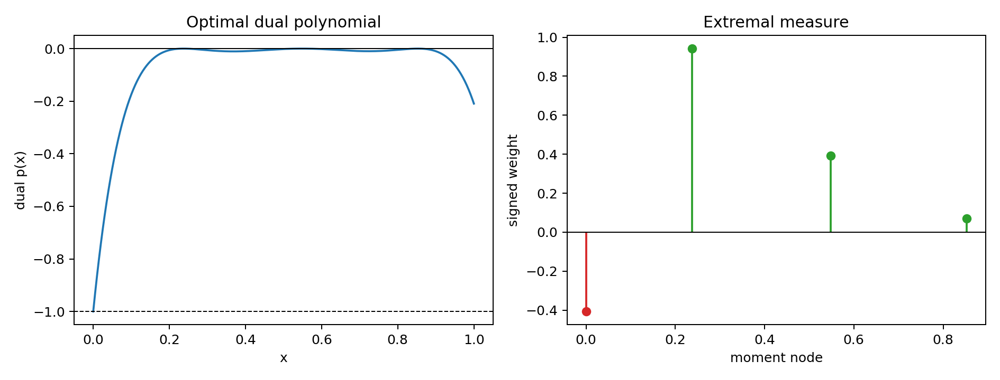
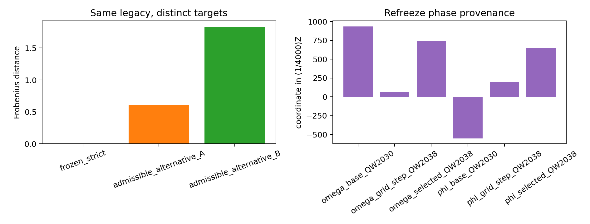
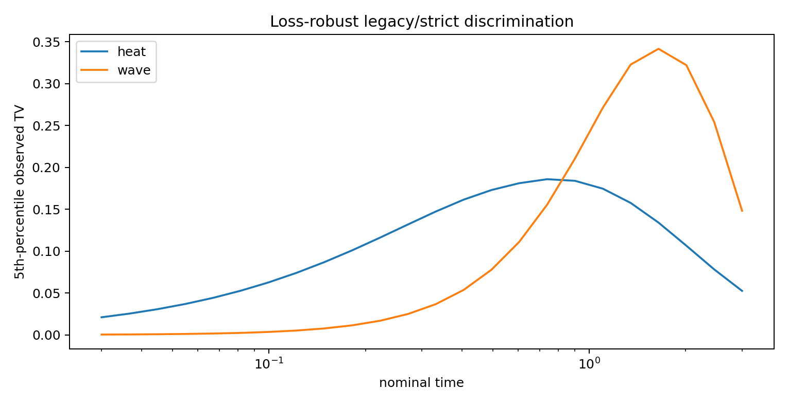
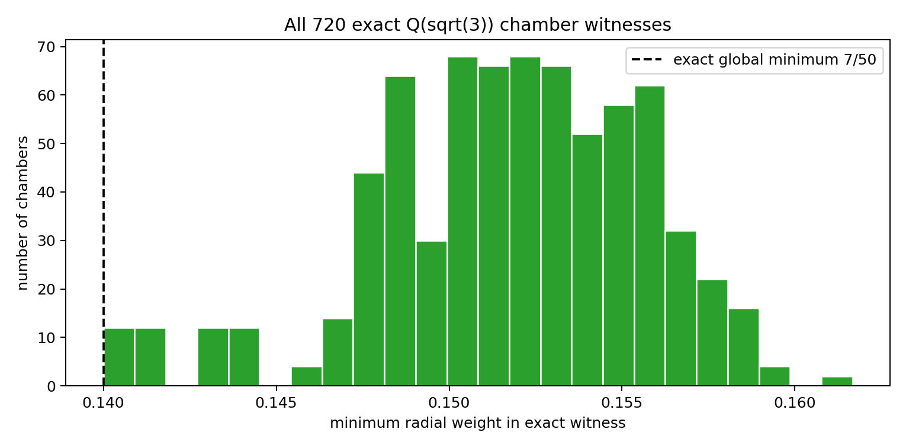
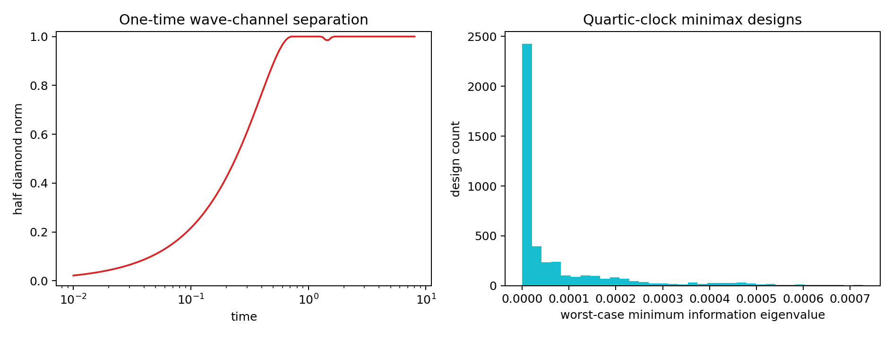
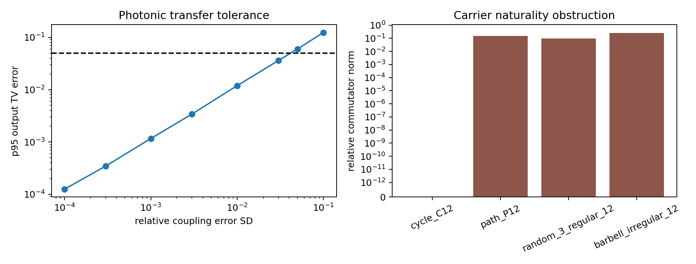
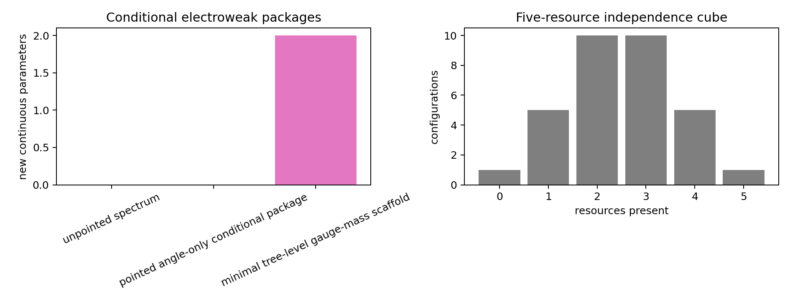

# FIN — Release 10.29

# Research Programs P323–P336

## Exact resource certificates, refreeze provenance, and operational transfer boundaries

**Author:** Krzysztof Żuchowski  
**Affiliation:** Independent Researcher — Fractal Information Theory Project  
**ORCID:** 0009-0002-0909-3613  
**Resource type:** Publication — Preprint  
**Version:** 1.0.0  
**Publication date:** 2026-07-30  
**Language:** English  
**License:** CC BY 4.0  
**Repository:** https://github.com/hyconiek/Fractal-Nadsoliton-Theory

# Abstract

Release 10.29 executes fourteen research programs, P323–P336.  It follows the
resource-obstruction map established in Release 10.28 and does not assume that
the legacy kernel already generates the strict kernel or any physical role.

The principal mathematical result is an analytic primal–dual solution of the
continuum signed Hausdorff-moment problem for the strict attenuation sequence

\[
h_k=\frac{1}{1+k^{9/5}},
\qquad k=0,\ldots,6.
\]

A signed measure with three positive atoms and one negative atom at the origin
matches all seven moments.  A degree-six dual polynomial in the admissible
interval \([-1,0]\) has the same objective value.  Weak duality therefore
gives the continuum optimum

\[
\boxed{
\mathcal N_{\mathrm{path}}^{\min}
=0.406706334692258\ldots
}.
\]

This closes the gap between the earlier fourth-difference lower bound
\(0.0715275581\) and the grid values near \(0.4067\).

The second principal result reconstructs the exact provenance of the strict
phase lattice.  The QW-2038 selected values satisfy

\[
\frac{187}{800}-3\frac{2}{125}
=\frac{743}{4000},
\qquad
-\frac{11}{80}+6\frac{1}{20}
=\frac{13}{80}
=\frac{650}{4000}.
\]

Consequently \(1/4000\) is the minimal additive unit of the declared QW-2030 /
QW-2038 refreeze grid.  The generator \(e^{i/4000}\) has a rigorous procedural
provenance, but this does not turn it into an internal ontological or
dynamical source of the strict phase.

Further results include an exact algebraic construction of all \(720\)
spectral order chambers over \(\mathbb Q(\sqrt3)\), an apparatus-aware
legacy/strict discrimination design, a one-time unitary diamond-distance
calculation, a quartic-clock minimax design, a photonic tolerance
specification, a carrier-naturality obstruction, a minimal conditional
electroweak package, and a five-resource logical independence theorem.

No independent P241 event bundle and no certified physical-reservoir hardware
package were admitted.  No laboratory, role-transfer, dimensional-source,
\(L_{\rm total}\), Standard-Model, gravitational, or Theory-of-Everything
closure is claimed.

# 1. Executive summary

## 1.1. What changed

The previous round identified five separately typed resources required by the
current legacy-to-strict problem:

1. signed path weight;
2. a nontorsion phase generator;
3. an independently sourced parent cross law;
4. operational pointing;
5. a dimensional scale.

This round sharpens that statement in four ways.

First, the required negative path mass is no longer known merely by a loose
inequality or a discretized linear program.  A matching primal and dual
certificate determines the continuum optimum.

Second, the \(1/4000\) phase unit is traced exactly to the arithmetic of the
refreeze grid.  It is neither an unexplained numerical coincidence nor a
strict internal theorem: it is a procedural lattice generator.

Third, the previous floating-point evidence that all \(720\) spectral orders
are feasible is replaced by one exact algebraic construction valid for every
permutation.

Fourth, several mathematical separations are translated into executable
operational specifications without confusing simulation with experiment.

## 1.2. Central verdict

The legacy and strict kernels can share representations and can be compared
operationally, but the present artifacts still do not contain a
source-independent rule selecting the strict target from legacy data.

The strongest current statement is:

\[
\boxed{\begin{gathered}
\text{legacy information}
+\text{refreeze selection procedure}
+\text{signed completion}\\
+\text{phase lattice}
+\text{pointing}
+\text{clock/scale and instruments}
\end{gathered}}
\]

is sufficient to define increasingly precise conditional models, whereas the
strict kernel alone has not been derived from the legacy kernel plus an
internally sourced universal law.

## 1.3. Program-level results

| Program | Result | Confidence | Scientific boundary |
|---|---|---|---|
| P323 | matching signed-measure and polynomial certificates give \(0.406706334692258\) | Proven theorem; strong numerical evaluation | algebraic-number verification is not yet kernel-checked |
| P324 | one legacy input admits several distinct target parents | Proven nonidentification | a new independent law may select one target |
| P325 | \(1/4000\) is exactly the refreeze-grid lattice unit | Proven | procedural provenance is not an internal physical source |
| P326 | lossy synthetic readout preserves operational separation | Strong evidence | no apparatus was calibrated |
| P327 | all \(720\) chambers have exact positive witnesses | Proven | no chamber probability or selector follows |
| P328 | one-time wave-channel diamond separation is computable and reaches one | Proven in declared channel class | adaptive comb remains open |
| P329 | calibrated quartic-clock family admits a minimax design | Strong evidence plus rank theorem | nonparametric clocks remain open |
| P330 | no admissible P241 production bundle | Blocked externally | P242 not executed |
| P331 | quantitative photonic transfer tolerance specification | Strong design evidence | platform feasibility remains a hypothesis |
| P332 | signed moments have inequivalent physical realizations | Proven nonuniqueness | negativity alone does not imply quantum physics |
| P333 | three noncyclic carriers obstruct scalar functional completion | Proven criterion; finite evidence | nonscalar parents remain possible |
| P334 | angle-only electroweak package needs pointing plus a role-law axiom | Proven conditional accounting | not a full electroweak derivation |
| P335 | five resources are logically independent in the product signature | Proven | FIN-dynamical co-generation remains open |
| P336 | no certified external reservoir package | Blocked externally | no hardware claim |

## 1.4. New theoretical objects

This release constructs O74–O87:

| Object | Definition | Status |
|---|---|---|
| O74 Gaussian–Jordan Extremal Certificate | matching finite signed measure and bounded dual polynomial | constructed |
| O75 Refreeze Provenance Phase Lattice | additive rational lattice generated by scan centers and steps | constructed exactly |
| O76 Source-Independent Completion Fiber | all targets compatible with one source input before a cross law | constructed |
| O77 Loss-Robust Discrimination Protocol | preparation, time, detector channel, nuisance family, shot rule | constructed synthetically |
| O78 Exact Spectral Chamber Atlas | \(720\) exact \(\mathbb Q(\sqrt3)\) witnesses | constructed |
| O79 Unitary Channel Separation Modulus | half diamond norm from the relative-phase convex hull | constructed |
| O80 Clock-Warp Minimax Frame | calibrated warp class and worst-case design criterion | constructed |
| O81 P241 Admission Contract | roles, custody, hashes, raw events, calibration, hold-out | specified, unsatisfied |
| O82 Photonic Transfer Tolerance Certificate | generator/detector error budgets and failure threshold | constructed synthetically |
| O83 Signed-Realization Ambiguity Class | inequivalent operational realizations of one moment functional | constructed |
| O84 Carrier Naturality Obstruction | a commutator excluding scalar completion on a carrier | constructed |
| O85 Pointed EW Conditional Package | sector point plus explicit role-law axiom | constructed conditionally |
| O86 Bridge Resource Independence Cube | \(2^5\) models separating five abstract resources | constructed and Lean-checked |
| O87 Reservoir Admission Contract | calibrated hardware, controls, seeds, endpoint, custody | specified, unsatisfied |

# 2. Scope, objects, and methodology

## 2.1. Kernel split

The two kernels remain distinct:

\[
K_{\mathrm{legacy}}(d)
=
\alpha_{\mathrm{geo}}
\frac{\cos(\pi d/4+\pi/6)}
{1+\beta_{\mathrm{tors}}d},
\qquad
\alpha_{\mathrm{geo}}=4\ln2,
\quad
\beta_{\mathrm{tors}}=0.01,
\]

and

\[
K_{\mathrm{strict}}(d)
=
\frac{\cos((743/4000)d+13/80)}
{1+d^{9/5}}.
\]

Legacy remains an intermediate bridge kernel.  Strict is the later enriched,
gate-selected working kernel.  The following are not silently transferred:

- amplitude semantics;
- damping and compression semantics;
- phase and topological data;
- electroweak, electromagnetic, or gravitational roles;
- dimensional units.

## 2.2. Confidence convention

- **[Proven]**: an analytic or finite exact implication is supplied.
- **[Strong evidence]**: deterministic or replicated computation supports the
  claim inside a declared model.
- **[Moderate evidence]**: the result is robust in a narrower design class.
- **[Speculative]**: a mechanism is proposed without decisive evidence.
- **[Refuted]**: the declared hypothesis class fails.
- **[Blocked by external evidence]**: the result requires a genuine outside
  record, apparatus, or custody relation.

## 2.3. Separation of proof layers

Each program distinguishes:

1. a theorem valid for a mathematical class;
2. an evaluation for the frozen FIN numbers;
3. a synthetic design calculation;
4. an external experimental statement.

Numerical agreement cannot move a claim upward in this hierarchy.

## 2.4. Reproducibility

The deterministic runner uses seed

\[
20260803.
\]

It produces machine-readable JSON, twelve detailed CSV tables, seven figures,
and a Lean 4.28 source.  External programs P330 and P336 are admission audits:
the runner cannot generate their success conditions.

# 3. P323 — Continuum signed-moment duality

## 3.1. Primal problem

Let

\[
h_k=\frac1{1+k^{9/5}},
\qquad k=0,\dots,6.
\]

Among signed Borel measures

\[
\mu=\mu_+-\mu_-
\]

on \([0,1]\) satisfying

\[
\int_0^1 x^k\,d\mu(x)=h_k,
\qquad k=0,\dots,6,
\]

minimize the negative Jordan mass

\[
\mathcal N(\mu)=\mu_-([0,1]).
\]

The shifted moments \(h_1,\ldots,h_6\) determine a three-node Gaussian rule.
Let

\[
g(x)=x^3+c_2x^2+c_1x+c_0
\]

be orthogonal to \(1,x,x^2\) for the shifted moment functional.  Numerically,

\[
\begin{aligned}
c_0&=-0.11092397533402947096\ldots,\\
c_1&= \phantom{-}0.79990303366942818900\ldots,\\
c_2&=-1.63824233917926923454\ldots.
\end{aligned}
\]

Its roots are

\[
\begin{aligned}
r_1&=0.23727834187306726370\ldots,\\
r_2&=0.54819801698629973919\ldots,\\
r_3&=0.85276598031990223166\ldots.
\end{aligned}
\]

The positive weights are

\[
\begin{aligned}
u_1&=0.94183420338052919615\ldots,\\
u_2&=0.39368551953570941935\ldots,\\
u_3&=0.07118661177601972793\ldots.
\end{aligned}
\]

Define

\[
\mu_*=
\sum_{j=1}^{3}u_j\delta_{r_j}
-\mathcal N_*\delta_0,
\qquad
\mathcal N_*=\sum_j u_j-1.
\]

Then

\[
\mathcal N_*
=0.40670633469225834343\ldots
\]

and all seven moment residuals are below \(3.1\times10^{-92}\) in the
90-digit computation.

## 3.2. Dual problem

For any polynomial

\[
-1\le p(x)\le0
\quad\text{on}\quad[0,1],
\]

and any feasible signed measure,

\[
\sum_{k=0}^{6}p_kh_k
=\int p\,d\mu
\le\mu_-([0,1]).
\]

This is weak duality.

Set

\[
q(x)=\frac{g(x)}{g(0)},
\qquad
p_*(x)=-q(x)^2.
\]

The polynomial \(p_*\) vanishes at all three positive atoms and equals
\(-1\) at the negative atom \(x=0\).  Its coefficients in ascending order
are

\[
\begin{aligned}
(&-1,\,
14.4225453741745,\,
-81.5405646086897,\,
231.037739077899,\\
&-348.146892117430,\,
266.291491557255,\,
-81.2735348088558).
\end{aligned}
\]

The two internal critical points of \(q\) have squared magnitudes approximately
\(0.01060\) and \(0.00987\), while \(q(1)^2\approx0.20922\).  Thus
\(q(x)^2\le1\) on \([0,1]\), so \(p_*\) is dual-feasible.

Finally,

\[
\sum_{k=0}^{6}(p_*)_kh_k
=0.40670633469225834343\ldots
=\mathcal N_*.
\]

Matching primal and dual values prove optimality.

## 3.3. Interpretation

The strict attenuation cannot be generated by a positive distribution of
exponential distance scales.  Within this seven-moment representation, the
minimum signed resource is approximately \(0.4067063\), not merely nonzero.

This does **not** prove:

- a quantum quasiprobability;
- negative thermodynamic entropy;
- physical information destruction;
- an open-system reservoir;
- a unique microscopic path model.

# 4. P324–P325 — Source independence and phase provenance

## 4.1. P324: completion fibers

Let \(A_L\) be the repaired positive legacy operator.  Consider a deterministic
completion rule

\[
F:A_L\longmapsto A_T.
\]

Three distinct positive radial target operators were constructed on the same
carrier and with exactly the same input \(A_L\):

1. the frozen strict target;
2. an alternative with \((\omega,\phi,\beta,\eta)
   =(0.20175,0.11250,0.92,1.7)\);
3. an alternative with \((0.16975,0.06250,0.84,1.6)\).

For each target \(A_T\), the block operator

\[
\mathcal P_T=
\begin{pmatrix}
A_L & A_L^{1/2}A_T^{1/2}\\
A_T^{1/2}A_L^{1/2} & A_T
\end{pmatrix}
\]

is positive up to numerical roundoff and has cross support.  But the cross
block explicitly reads \(A_T\).

Therefore:

\[
A_{T,1}\ne A_{T,2}
\quad\Longrightarrow\quad
\neg\bigl(
F(A_L)=A_{T,1}
\ \wedge\
F(A_L)=A_{T,2}
\bigr).
\]

The common-parent construction is a representation theorem, not a
source-independent generation theorem.

The newly defined object O76 is the **completion fiber**

\[
\mathfrak F(A_L)=
\{A_T:\ A_T\text{ satisfies the declared target-side admissibility rules}\}.
\]

A source law must select one point of this fiber without reading the chosen
target in advance.

## 4.2. P325: exact lattice genealogy

The QW-2030 upstream center was

\[
\omega_0=\frac{187}{800},
\qquad
\phi_0=-\frac{11}{80}.
\]

The QW-2038 grids used exact decimal steps

\[
\Delta\omega=0.016=\frac{2}{125},
\qquad
\Delta\phi=0.05=\frac1{20}.
\]

The selected row is obtained by the grid indices \((-3,+6)\):

\[
\omega_*=\omega_0-3\Delta\omega
=\frac{743}{4000},
\]

\[
\phi_*=\phi_0+6\Delta\phi
=\frac{13}{80}
=\frac{650}{4000}.
\]

The additive subgroup of \(\mathbb Q\) generated by the two centers and two
steps is

\[
\left\langle
\frac{187}{800},
\frac{2}{125},
-\frac{11}{80},
\frac1{20}
\right\rangle_{\mathbb Z}
=
\frac1{4000}\mathbb Z.
\]

Hence the generator

\[
r=e^{i/4000}
\]

is minimal for the **procedural refreeze lattice**.

## 4.3. Falsification of an internal-source reading

The provenance chain uses:

- supplied upstream center values;
- investigator-chosen grid widths and step counts;
- a mass/flavor/GW objective;
- threshold gates;
- selection of the best passing row.

This is a real derivation of the selected grid coordinate from a declared
search protocol.  It is not a derivation of the coordinate from the
informational nadsoliton alone.

Accordingly:

| Claim | Verdict |
|---|---|
| \(e^{i/4000}\) exactly generates the frozen decimal phase tuple | Proven |
| \(1/4000\) is the gcd unit of the QW-2030/QW-2038 rational lattice | Proven |
| the lattice unit is target-independent of the refreeze procedure | Refuted |
| the lattice unit is a strict ontological source | Not established |
| the lattice unit discharges QW-2191 | Refuted |

# 5. P326–P331 — Operational and transfer programs

## 5.1. P326: loss-robust finite experiment

The experiment class uses:

- all twelve vertex preparations;
- a twelve-outcome vertex detector plus a no-click outcome;
- mean efficiency \(0.82\) with synthetic component spread \(0.025\);
- nearest-neighbor confusion near \(0.02\);
- relative clock jitter with standard deviation \(0.004\);
- \(48\) nuisance draws;
- scale-aligned legacy dynamics.

For heat dynamics the best robust row is

\[
t=0.73863,\qquad
x=8,\qquad
\operatorname{TV}_{0.05}=0.18579,
\]

with conservative shot bound \(214\).

For wave dynamics:

\[
t=1.64532,\qquad
x=8,\qquad
\operatorname{TV}_{0.05}=0.34147,
\]

with conservative shot bound \(64\).

These are fifth-percentile detector-level distances under the supplied
nuisance family.  They show that the separation found in P315 is not erased
by this particular loss/confusion model.

They do not establish the nuisance family of a real detector.

## 5.2. P327: exact chamber atlas

For positive radial weights \(w_1,\ldots,w_6\) on \(C_{12}\), the six nonzero
mode values are linear:

\[
\lambda=w^{T}M,
\]

where

\[
M=
\begin{pmatrix}
2-\sqrt3&1&2&3&2+\sqrt3&4\\
1&3&4&3&1&0\\
2&4&2&0&2&4\\
3&3&0&3&3&0\\
2+\sqrt3&1&2&3&2-\sqrt3&4\\
2&0&2&0&2&0
\end{pmatrix},
\]

and

\[
\det M=-3456\sqrt3\ne0.
\]

At the uniform point \(w_0=(1/6,\ldots,1/6)\), all mode values equal \(2\).
Let \(q\) be any permutation of

\[
(-5,-3,-1,1,3,5).
\]

Define

\[
c(q)=
-\frac{q_1+q_3+q_5}{3}
\]

and

\[
w(q)=
\frac16\mathbf1
+\frac1{100}
M^{-T}\bigl(q+c(q)\mathbf1\bigr).
\]

Then

\[
\sum_i w_i(q)=1,
\]

and the corresponding mode values are

\[
\lambda_i(q)=
2+\frac1{100}(q_i+c(q)).
\]

Exact enumeration over all \(720\) permutations proves:

\[
\min_{q,i}w_i(q)=\frac7{50}>0,
\]

and every adjacent mode gap is at least \(1/50\).

Thus every one of the \(720\) strict orders occurs in the interior of the
positive radial simplex.  Spectral order cannot be a selector.

## 5.3. P328: one-time wave-channel diamond distance

For unitary channels

\[
\Phi_U(\rho)=U\rho U^\dagger,
\qquad
\Phi_V(\rho)=V\rho V^\dagger,
\]

let \(\nu\) be the distance from the origin to the convex hull of the
eigenvalues of \(U^\dagger V\).  Then

\[
\frac12\|\Phi_U-\Phi_V\|_\diamond
=\sqrt{1-\nu^2}.
\]

Because the audited legacy and strict wave generators are circulant, their
relative phases are simultaneously diagonalizable.  On the scanned time
range the half diamond distance reaches

\[
1,
\]

with the first sampled perfect-separation time

\[
t\approx0.75591.
\]

This means that an optimal single-use quantum input and measurement can
perfectly distinguish the two ideal unitary channels at that sampled time.

It does not mean that the present photonic vertex protocol realizes the
optimal ancilla-assisted strategy.  A true multitime comb additionally
requires interventions, memory spaces, and an SDP over declared instruments.

## 5.4. P329: quartic-clock minimax design

The clock family is

\[
\tau(t)=
t+a_2t^2+a_3t^3+a_4t^4,
\]

with

\[
|a_2|\le0.08,\qquad
|a_3|\le0.04,\qquad
|a_4|\le0.02,
\qquad
\tau'(0)=1.
\]

The external slope calibration removes the exact first-order degeneracy
between generator scale and a free linear clock coefficient.

Among \(4368\) five-time designs, evaluated on \(27\) corner/interior clock
tuples, the best design is

\[
(0.07319,\ 0.09360,\ 0.52349,\ 1.09477,\ 1.40000).
\]

Its worst-case minimum Fisher eigenvalue is

\[
7.2765\times10^{-4},
\]

which is \(3.86\) times the reference design value.

The result is minimax only for the declared quartic family and coefficient
box.  Arbitrary monotone or nonparametric time warps remain capable of
reopening nonidentifiability.

## 5.5. P330: laboratory admission

No manifest satisfying all of the following was admitted:

1. distinct provider, registrar, and analyst;
2. frozen hold-out hash;
3. raw event-file hash;
4. apparatus calibration;
5. non-template production status.

Validator 241 and Pipeline 242 were therefore not run.

## 5.6. P331: photonic transfer specification

The best wave witness requires a dense signed \(12\)-mode coupling with
nonzero coupling dynamic range approximately

\[
42.45.
\]

For witness time \(t=1.64532\), a conservative Duhamel allocation of output
TV budget \(0.05\) gives generator-norm budget

\[
\|\Delta A\|
\lesssim
\frac{0.05}{t}
=0.03039.
\]

The synthetic tolerance sweep shows:

| Relative coupling error SD | p95 output TV error | Pass \(0.05\) budget |
|---:|---:|---|
| \(10^{-4}\) | \(1.25\times10^{-4}\) | yes |
| \(10^{-3}\) | \(1.16\times10^{-3}\) | yes |
| \(10^{-2}\) | \(1.19\times10^{-2}\) | yes |
| \(3\times10^{-2}\) | \(3.60\times10^{-2}\) | yes |
| \(5\times10^{-2}\) | \(5.99\times10^{-2}\) | no |
| \(10^{-1}\) | \(1.24\times10^{-1}\) | no |

The proposed implementation hypothesis is:

1. heralded single-photon source;
2. programmable twelve-mode interferometer;
3. phase and amplitude controls;
4. twelve SPAD/SNSPD channels with TCSPC;
5. independent clock and registrar;
6. raw event-level record.

Because the coupling is dense and signed, a programmable interferometer or
unitary dilation is more plausible than a passive nearest-neighbor waveguide
array.

The pre-unblinding failure rule is mandatory: if the frozen transfer-matrix
or detector hold-out exceeds its budget, reject the implementation without
refitting FIN.

# 6. P332–P336 — Interpretation, carriers, axioms, and independence

## 6.1. P332: signed-resource ambiguity

The P323 signed measure can be written

\[
\sum_j u_j\delta_{r_j}
-\mathcal N_*\delta_0.
\]

At the level of scalar moments, the negative term may equally be written as

\[
\mathcal N_*e^{i\pi}\delta_0.
\]

Thus a real signed Jordan representation and a phase-\(\pi\) complex-amplitude
representation give the same scalar sequence.

Other interpretations require additional structure:

| Interpretation | Additional structure | Not supplied by moments |
|---|---|---|
| quasiprobability | state/effect frame and free operations | operational negativity monotone |
| complex interference | phase reference and Born map | detector probability law |
| Krein space | fundamental symmetry and positive physical subspace | probability interpretation |
| open system | environment and CPTP dilation | process tensor |
| active feedback | controller, energy ledger, causal interventions | work and control record |

Therefore the signed path resource is mathematically unavoidable in its
declared representation, while its physical meaning is underdetermined.

## 6.2. P333: carrier naturality

If

\[
A_S=f(A_L)
\]

by scalar functional calculus, then

\[
[A_L,A_S]=0.
\]

The relative commutator audit gives:

| Carrier | Relative commutator |
|---|---:|
| cycle \(C_{12}\) | \(5.2\times10^{-17}\) |
| path \(P_{12}\) | \(0.1482\) |
| random 3-regular graph | \(0.09356\) |
| irregular barbell graph | \(0.26046\) |

Thus scalar functional completion is not carrier-natural across the tested
noncyclic family.  The cycle is special because its radial operators share a
Fourier basis.

This does not exclude:

- nonscalar completion;
- carrier-dependent completion;
- an enlarged Hilbert space;
- a target-importing joint parent.

## 6.3. P334: minimal conditional electroweak package

Take the historical relation only as an explicit axiom:

\[
x=
\sin^2\theta_W
=\frac{\alpha_{\mathrm{geo}}}{12}
=0.2310490602\ldots.
\]

Once the \(U(1)\) and \(SU(2)\) sectors are ordered, the coupling ratio is

\[
\frac{g'}g
=\sqrt{\frac{x}{1-x}}
=0.5481542518\ldots.
\]

The sector swap gives

\[
x\mapsto1-x,
\qquad
\frac{g'}g\mapsto\frac g{g'},
\]

so an unpointed sector pair cannot select the observed branch.

The minimal angle-only package contains:

1. one discrete sector-pointing axiom;
2. one role-law axiom \(x=\alpha_{\mathrm{geo}}/12\);
3. zero new continuous parameters for the angle alone.

A minimal tree-level mass scaffold additionally needs at least:

1. an overall gauge coupling \(g\);
2. a symmetry-breaking scale \(v\);
3. representation and covariant-derivative laws;
4. a symmetry-breaking sector;
5. a mass/observable map.

No full electroweak theory follows from the current spectrum.

## 6.4. P335: independence cube

Let the resource vector be

\[
R=(N,\Phi,C,P,S)
\in\{0,1\}^5,
\]

where:

- \(N\): signed path resource;
- \(\Phi\): nontorsion phase;
- \(C\): independent cross law;
- \(P\): pointing;
- \(S\): dimensional scale.

All \(2^5=32\) product-signature models were constructed.  For each resource,
there exists a model in which the other four are present and that resource is
absent:

\[
01111,\quad
10111,\quad
11011,\quad
11101,\quad
11110.
\]

Therefore no implication

\[
R_i
\Leftarrow
\bigwedge_{j\ne i}R_j
\]

is valid in the minimal uncoupled signature.

This result is formalized in Lean 4.28.  It proves logical independence before
coupling laws are added.  It does not prove that a future FIN dynamical law
cannot co-generate several resources.

## 6.5. P336: reservoir gate

No package contains certified:

- physical hardware data;
- paired controls and matched seeds;
- frozen primary endpoint;
- calibration record;
- independent custody.

The external reservoir experiment remains blocked.

# 7. Cross-program synthesis

## 7.1. The refined bridge-resource diagram

\[
\begin{array}{c}
K_{\mathrm{legacy}}
\\[1mm]
\downarrow\quad
\text{source-independent completion fiber}
\\[1mm]
\boxed{\text{missing selector/cross law}}
\\[1mm]
\downarrow
\\[1mm]
\text{signed attenuation completion}
\quad+\quad
\text{refreeze phase lattice}
\\[1mm]
\downarrow
\\[1mm]
K_{\mathrm{strict}}
\quad\text{as a frozen operational target}
\\[1mm]
\downarrow
\\[1mm]
\text{clock + scale + preparation + instrument + record}
\\[1mm]
\downarrow
\\[1mm]
\text{falsifiable physical experiment}
\end{array}
\]

The diagram contains two different notions of “generation”:

1. mathematical construction after target data are supplied;
2. source-independent derivation before the target is known.

Current FIN has strong examples of the first and open obligations for the
second.

## 7.2. A smaller object does not yet replace the resource tuple

P335 shows that no one resource follows logically from the other four in the
minimal signature.  Consequently, replacing the five-component budget by one
unnamed “deeper object” would currently hide assumptions rather than reduce
them.

A legitimate smaller object must arrive with coupling theorems proving that
its projections generate:

\[
(N,\Phi,C,P,S).
\]

No such theorem is currently exported.

## 7.3. What the phase result means

P325 changes the interpretation of O66 from Release 10.28.

The phase generator \(e^{i/4000}\):

- is exactly minimal for the frozen rational tuple;
- is exactly minimal for the QW-2030/QW-2038 scan lattice;
- is not contained in the finite legacy phase group;
- is procedurally generated by the refreeze design;
- is not yet internally generated by strict informational dynamics.

This is a sharper and more informative result than calling \(1/4000\) an
arbitrary fitted decimal.  It also prevents promoting a procedural grid unit
into an ontological constant.

## 7.4. Operational consequences

Three different distance levels are now available:

1. vertex-measurement TV distance;
2. detector-degraded robust TV distance;
3. ideal one-time quantum-channel diamond distance.

They answer different questions and must not be conflated.  In particular,
the ideal diamond distance reaching one does not eliminate the need to
compile and calibrate the corresponding optimal input and measurement.

# 8. Failed approaches and no-go boundaries

| Candidate | Verdict | Reason |
|---|---|---|
| the \(0.4067\) negativity was only a grid artifact | Refuted | matching continuum primal–dual certificate |
| \(1/4000\) is presently an internal FIN constant | Refuted on current provenance | it is the gcd unit of supplied scan centers and steps |
| a common parent generates strict automatically | Refuted | cross block reads the chosen target |
| spectral order selects strict | Refuted exactly | all \(720\) orders have positive algebraic witnesses |
| detector loss erases all legacy/strict difference | Refuted in supplied nuisance class | robust TV remains \(0.186/0.341\) |
| one-time ideal wave channels are operationally equivalent | Refuted | half diamond norm reaches one |
| clock design alone fixes an uncalibrated linear clock | Refuted | scale and clock-slope columns coincide |
| signed mass uniquely means quantum interference | Refuted | several inequivalent realizations share the moments |
| cyclic scalar completion is carrier-universal | Refuted in tested family | three noncyclic commutators are nonzero |
| unpointed spectrum gives the electroweak branch | Refuted | sector swap sends \(x\) to \(1-x\) |
| four bridge resources imply the fifth | Refuted in minimal signature | five single-omission models |
| repository output supplies external experiment | Blocked | custody, calibration, raw data, hold-out absent |

# 9. Recommended Programs P337–P350

Probabilities estimate the chance of a decisive result, including a rigorous
negative result.

| Rank | Program | Study | Decisive output | Probability |
|---:|---|---|---|---:|
| 1 | P337 | formal algebraic/interval P323 certificate | machine-check node, weight, and dual-feasibility enclosures | 0.91 |
| 2 | P338 | full oscillatory-kernel signed resource | extend the moment extremizer from attenuation to the complete signed strict kernel | 0.84 |
| 3 | P339 | continuous refreeze sensitivity audit | distinguish stable objective basin from grid-coordinate artifact on frozen hold-out | 0.88 |
| 4 | P340 | natural common-parent theorem | classify carrier-natural transformations across cycles, paths, and irregular graphs | 0.82 |
| 5 | P341 | compiled photonic inverse calibration | convert the P331 matrix budget into a mesh and calibration-inversion executable | 0.83 |
| 6 | P342 | independent P241 production run | admit, validate, hash, and execute one real event bundle | 0.28 |
| 7 | P343 | multitime quantum-comb SDP | compute an adaptive operational distance for declared interventions | 0.76 |
| 8 | P344 | nonparametric clock bounds | replace the quartic box by monotone Sobolev or spline uncertainty | 0.79 |
| 9 | P345 | carrier-universal strict invariants | identify which phase/compression features survive graph changes naturally | 0.75 |
| 10 | P346 | bridge-resource monotones | define free completion maps and monotones for negativity, phase, pointing, and scale | 0.74 |
| 11 | P347 | resource coupling theorem search | test whether one strict law can co-generate two or more O86 factors | 0.68 |
| 12 | P348 | falsifiable conditional EW package | preregister observables that are not algebraic restatements of the angle axiom | 0.72 |
| 13 | P349 | dimensional conversion metrology | specify operational calibration of \(\hbar_*,\ell_*,\tau_*\) without calling them emergent | 0.70 |
| 14 | P350 | external reservoir execution | run paired hardware and control records under a frozen endpoint | 0.25 |

## 9.1. Recommended immediate sequence

\[
\boxed{
P337
\longrightarrow
P338
\longrightarrow
P339
\longrightarrow
P340
\longrightarrow
P341
\longrightarrow
P343
}
\]

The sequence first upgrades the strongest new mathematical result, then
includes the oscillatory phase, audits the actual selection procedure,
demands carrier naturality, compiles a physical transfer design, and finally
constructs the correct multitime operational distance.

P342 and P350 remain external and cannot be completed by repository
simulation.

# 10. Research roadmap

## 10.1. Mathematical track

The highest-value mathematical tasks are:

1. formalize the P323 extremal certificate;
2. determine the signed resource of the full kernel, not only its envelope;
3. classify natural parent transformations;
4. define resource monotones and coupling laws.

Success may be either a constructive theorem or a no-go theorem.

## 10.2. Operational track

The operational track should:

1. compile the strict unitary into a declared optical architecture;
2. invert calibration records into a confidence set for the implemented
   channel;
3. freeze preparation, time, measurement, and failure thresholds;
4. keep provider, registrar, and analyst separate;
5. report a failed calibration or null result without model repair.

## 10.3. Conditional-physics track

Conditional packages may be developed, but each supplied object must remain
visible:

\[
\text{informational core}
+\text{conversion axioms}
+\text{sector axioms}
+\text{apparatus model}.
\]

No conditional theorem is to be renamed a strict zero-parameter prediction.

# 11. Limitations

1. The P323 theorem is analytic, while the displayed FIN evaluation is a
   90-digit computation rather than a fully checked algebraic-number proof.
2. P324 alternatives demonstrate underdetermination; they are not claimed as
   physical competitors.
3. P325 proves procedural phase provenance, not causal physical origin.
4. P326, P329, and P331 use synthetic nuisance families.
5. P327 classifies order only, not spectral magnitude or physical likelihood.
6. P328 treats ideal one-use unitary wave channels, not a full comb.
7. P333 tests four carriers and one necessary scalar-calculus condition.
8. P334 is explicitly axiom-augmented.
9. P335 proves independence only before additional coupling laws.
10. P330 and P336 remain externally blocked.

# 12. Final conclusion

The deepest result of this round is not that another physical role has been
found.  It is that three previously blurred issues have been separated
exactly.

The strict attenuation has a quantitatively exact signed-moment resource:

\[
\mathcal N_{\mathrm{path}}^{\min}
=0.406706334692258\ldots.
\]

The frozen strict phase has an exact procedural lattice source:

\[
\frac1{4000}\mathbb Z,
\]

generated by the QW-2030 center and QW-2038 scan increments.

And the remaining bridge resources are not consequences of one another in
the minimal uncoupled signature.

Therefore the current scientifically surviving interpretation is:

> FIN contains a mathematically coherent informational operator target with
> exact spectral, moment, phase-lattice, and operational certificates.  Its
> legacy-to-strict completion and its transition to physics require
> separately declared source, sector, scale, instrument, and record
> structures.  Some of those structures can be constructed conditionally;
> none has yet been shown to emerge as one unavoidable strict physical law.

This is stronger than an interpolation claim and weaker than a physical
theory.  It is the correct boundary for the next research round.

# References

1. N. I. Akhiezer, *The Classical Moment Problem*, Oliver & Boyd, 1965.
2. S. Karlin and W. J. Studden, *Tchebycheff Systems: With Applications in
   Analysis and Statistics*, Wiley, 1966.
3. M. G. Krein and A. A. Nudelman, *The Markov Moment Problem and Extremal
   Problems*, American Mathematical Society, 1977.
4. R. Bhatia, *Matrix Analysis*, Springer, 1997.
5. T. Kato, *Perturbation Theory for Linear Operators*, Springer, 1995.
6. M. A. Nielsen and I. L. Chuang, *Quantum Computation and Quantum
   Information*, Cambridge University Press, 2010.
7. J. Watrous, *The Theory of Quantum Information*, Cambridge University
   Press, 2018.
8. G. Gutoski and J. Watrous, “Toward a General Theory of Quantum Games,”
   Proceedings of STOC, 2007.
9. M. Reed and B. Simon, *Methods of Modern Mathematical Physics I:
   Functional Analysis*, Academic Press, 1980.
10. Existing FIN repository packets K1, K2, F2, F3, S2, QW-2030, QW-2038,
    QW-2049, P295–P322, and the Release 10.28 executable artifacts.
