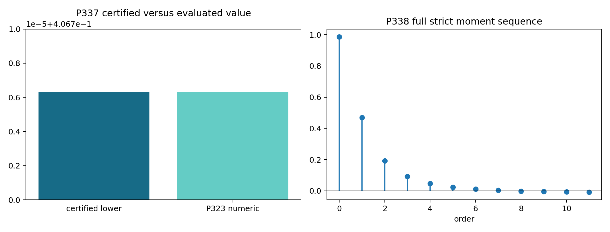
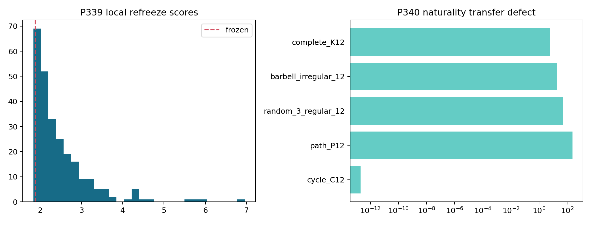
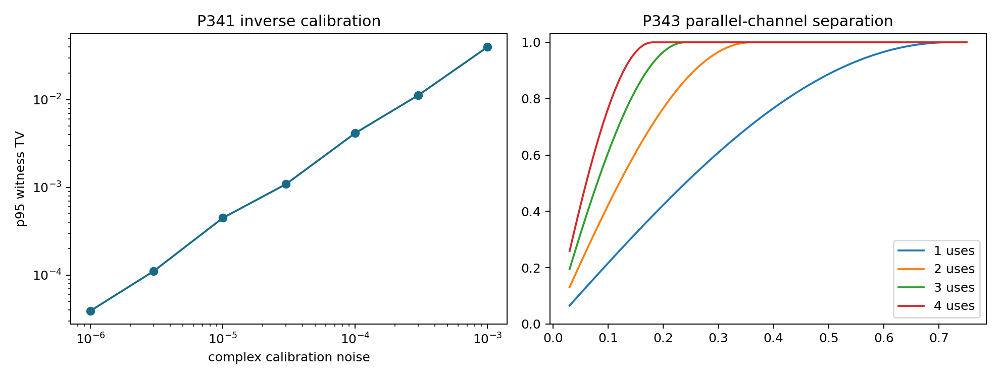
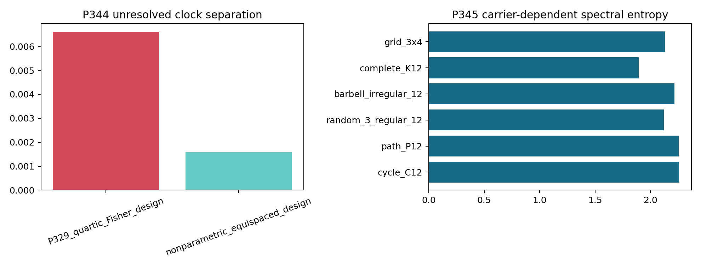
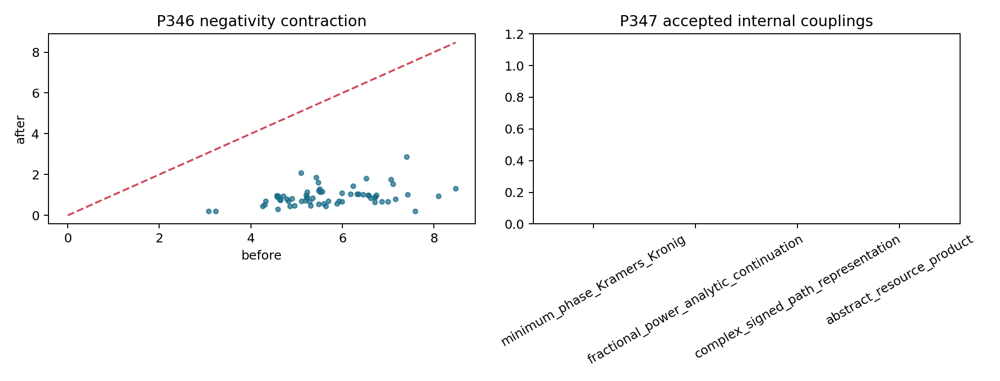
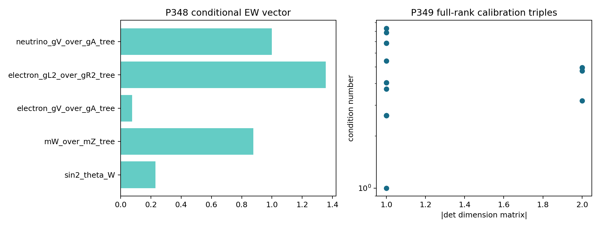

# FIN — Release 10.30

# Research Programs P337–P350

## Certified signed resources, carrier naturality, operational compilation, and conditional physics interfaces

**Author:** Krzysztof Żuchowski  
**Affiliation:** Independent Researcher — Fractal Information Theory Project  
**ORCID:** 0009-0002-0909-3613  
**Publication type:** Preprint  
**Version:** 1.0.0  
**Date:** 30 July 2026  
**Language:** English  
**License:** CC BY 4.0  
**Repository:** <https://github.com/hyconiek/Fractal-Nadsoliton-Theory>

---

# Abstract

This monograph executes FIN Research Programs P337–P350. It continues the
resource analysis of Releases 10.28–10.29 without reopening already refuted
positive-mixture, finite-torsion, scalar-parent, selector-replay, or silent
legacy-role-transfer routes.

Four results dominate the round.

First, P337 converts the high-precision P323 signed-moment solution into an
exact rational dual certificate. A rational polynomial

\[
p_r(x)=-q_r(x)^2,\qquad -1\leq p_r(x)\leq 0,\qquad 0\leq x\leq 1,
\]

is certified by exact Bernstein bounds on 512 rational subintervals. Exact
rational fifth-root brackets enclose the strict attenuation moments. Weak
duality then proves

\[
\mathcal N_{\rm env}\geq 0.4067063265581317,
\]

only \(8.14\times 10^{-9}\) below the P323 100-digit primal evaluation
\(0.4067063346922584\). The lower certificate is theorem-grade; full formal
simultaneous certification of the primal atoms remains open.

Second, P338 separates the positive attenuation envelope from the complete
oscillatory strict moment sequence

\[
k_n=\frac{\cos((743/4000)n+13/80)}{1+n^{9/5}},\qquad n=0,\ldots,11.
\]

The last four moments are negative. A continuum-dual/fixed-support-primal
calculation gives the strong numerical enclosure

\[
0.7072784747\lesssim \mathcal N_{\rm osc}
\lesssim 0.7073599749.
\]

Thus the full oscillatory object requires at least about \(0.30057\) more
classical signed path mass than the seven-moment attenuation envelope. This
does not identify quantum quasiprobability, information loss, feedback, or
negative information.

Third, P339 re-executes the QW-2038 objective continuously. The best bounded
candidate found improves the old grid score from \(1.88037\) to \(1.83313\)
and shifts \(\omega\) from \(0.18575\) to approximately \(0.184253\), while
still passing the original gates. However, the optimizer did not establish a
global optimum, and the audit proves that QW-2038 had no independent frozen
hold-out: search and evaluation reuse the same mass, flavor, and
gravitational-wave inputs. Refreeze stability is therefore procedural,
in-sample evidence, not predictive physics or an internal source theorem.

Fourth, P340–P349 turn several previously vague missing structures into typed
objects. The C12 scalar spectral interpolant fails on every tested noncycle
carrier. An ideal 12-mode unitary admits a 66-rotation Givens compilation, but
one-time inverse calibration is provably branch-nonunique. Parallel channel
uses reduce the first sampled perfect-discrimination time from \(0.72\) to
\(0.18\), while the unrestricted adaptive comb remains open. Finite sampling
cannot identify a nonparametric monotone clock. Five bridge resources admit
typed free-operation monotones, but four proposed co-generation laws fail.
Finally, the electroweak vector and the \((\ell_*,\tau_*,\hbar_*)\)
metrology frame are constructed only as explicit conditional interfaces.

P342 and P350 remain closed external-evidence gates. No selector, dimensional
source, legacy-role transfer theorem, laboratory realization,
\(L_{\rm total}\), Standard Model, gravity theory, or Theory of Everything is
claimed.

## Confidence convention

Every substantive claim uses one of the following labels.

| Label | Meaning in this report |
|---|---|
| **[Proven]** | Exact mathematical argument, exact finite calculation, or compiled formal structural theorem |
| **[Strong evidence]** | Stable high-precision or exhaustive finite computation with explicit numerical boundary |
| **[Moderate evidence]** | Reproducible calculation whose interpretation depends materially on modelling choices |
| **[Speculative]** | A research proposal without a completed certificate |
| **[Refuted]** | The declared claim or construction fails in its stated scope |
| **[Blocked by external evidence]** | Completion requires independent data, custody, calibration, hardware, or unblinding |
| **[Conditional]** | The conclusion follows only after named additional axioms or calibration standards are supplied |

# 1. Scope and non-negotiable boundaries

## 1.1 Kernel split

The two kernels remain distinct typed objects:

\[
K_{\rm legacy,ont}(d)=
\alpha_{\rm geo}
\frac{\cos(\pi d/4+\pi/6)}{1+0.01d},
\qquad
\alpha_{\rm geo}=4\ln2,
\]

and

\[
K_{\rm strict,gate}(d)=
\frac{\cos((743/4000)d+13/80)}{1+d^{9/5}}.
\]

The legacy object is retained as an intermediate bridge kernel. The strict
object is the later enriched gate-selected working kernel. This report does
not silently identify them and does not transfer the historical
electroweak, electromagnetic, or gravity roles.

## 1.2 Ontology

The repository ontology is preserved:

\[
\text{informational nadsoliton}
\longrightarrow \text{light}
\longrightarrow \text{matter}
\longrightarrow \text{emergent observer}.
\]

The nadsoliton itself is the primordial information in a solitonic state.
There is no separate information layer below it. The mathematical results
below neither prove nor disprove that ontology; they classify what the
current operator data can generate.

## 1.3 Frozen open boundaries

The following remain open:

- the non-premise selector and QW-2191;
- an internal dimensional source;
- a source-independent legacy-to-strict completion law;
- a legacy-role transfer theorem;
- independent laboratory validation;
- a unit-bearing, nonproxy \(L_{\rm total}\);
- Standard Model or gravity generation;
- Theory-of-Everything closure.

# 2. Executive scientific findings

| Program | Main result | Status |
|---|---|---|
| P337 | Exact rational dual lower certificate \(0.4067063265581317\) | [Proven] lower bound |
| P338 | Full oscillatory resource in \([0.7072784747,0.7073599749]\) numerically | [Strong evidence] |
| P339 | Continuous best candidate improves score, but no hold-out exists | [Strong evidence] / [Refuted] hold-out |
| P340 | C12-trained scalar map fails all four tested noncycle carriers | [Proven] necessary theorem / [Strong evidence] matrix |
| P341 | 66-rotation ideal mesh; single-time generator inversion is nonunique | [Strong evidence] / [Proven] |
| P342 | No independent frozen-holdout manifest admitted | [Blocked] |
| P343 | Parallel \(n\)-use discrimination ladder computed for \(n=1,\ldots,4\) | [Proven] subclass |
| P344 | Finite times do not identify bounded-curvature monotone clocks | [Proven] |
| P345 | Formula coefficients are carrier-independent inputs; spectra are not | [Proven] distinction |
| P346 | Five typed resource monotones/free-operation classes | [Proven] |
| P347 | Four candidate resource-coupling laws fail | [Refuted] in declared classes |
| P348 | Five-component electroweak vector, conditional on sector physics | [Conditional] |
| P349 | Rank-three \((\ell_*,\tau_*,\hbar_*)\) conversion frame | [Proven] algebra / [Conditional] standards |
| P350 | No certified physical-reservoir package admitted | [Blocked] |

# 3. P337 — exact rational certification of the P323 dual

## 3.1 Problem

P323 found a matching high-precision primal/dual solution for

\[
h_n=\frac{1}{1+n^{9/5}},\qquad n=0,\ldots,6.
\]

The structural theorem was exact, but the displayed FIN values were evaluated
numerically. P337 does not rerun a moment grid. It certifies a nearby rational
dual polynomial.

## 3.2 Rational witness

Let \(q_*(x)\) denote the cubic P323 extremal polynomial normalized by
\(q_*(0)=1\). P337 rounds its coefficients rationally and contracts the
result by

\[
\rho=\frac{99\,999\,999}{100\,000\,000}.
\]

Define

\[
q_r(x)=\rho\,\widetilde q(x),
\qquad
p_r(x)=-q_r(x)^2.
\]

Nonpositivity is exact because \(p_r\) is minus a rational square. P337
subdivides \([0,1]\) into 512 rational intervals, converts \(q_r^2\) on each
interval to the Bernstein basis, and obtains the exact global upper bound

\[
q_r(x)^2\leq
\frac{9999999800000001}{10000000000000000}
=0.9999999800000001<1.
\]

Therefore

\[
-1<p_r(x)\leq 0
\]

on the complete continuum.

## 3.3 Algebraic input intervals

For every integer \(n=1,\ldots,6\), P337 brackets \(n^{1/5}\) between
rationals \(a_n,b_n\) and verifies

\[
a_n^5\leq n\leq b_n^5
\]

by exact integer arithmetic. Monotonicity gives rational enclosures for
\(n^{9/5}\) and \(h_n\). Propagating coefficient signs through these intervals
produces the exact weak-dual lower bound

\[
\boxed{\mathcal N_{\rm env}\geq 0.4067063265581317.}
\]

The input-interval contribution has width below \(5.94\times10^{-22}\).

## 3.4 What is and is not closed

The distance to the P323 100-digit primal evaluation is

\[
8.1341\times10^{-9}.
\]

Thus the value is essentially fixed for practical work. Nevertheless:

- the dual lower certificate is **[Proven]**;
- the matching primal value is **[Strong evidence]**;
- a formal interval-Newton proof of the three nodes, their weights, and all
  moment equalities remains P351.



# 4. P338 — the full oscillatory signed path resource

## 4.1 Why the envelope is not the kernel

The P323 object used only the positive attenuation profile. The complete
strict sequence contains the frozen phase:

\[
k_n=
\frac{\cos(\omega n+\phi)}{1+n^\eta},
\quad
\omega=\frac{743}{4000},
\quad
\phi=\frac{13}{80},
\quad
\eta=\frac95.
\]

For \(n=0,\ldots,11\), the moments \(k_8,k_9,k_{10},k_{11}\) are negative.
Therefore a signed representation of the full kernel is a genuinely different
problem.

## 4.2 Continuum dual

For a signed measure \(\mu=\mu_+-\mu_-\) on \([0,1]\), define

\[
\mathcal N(\mu)=\mu_-([0,1])
\]

and impose

\[
\int_0^1 x^n\,d\mu(x)=k_n,\qquad n=0,\ldots,11.
\]

The dual searches degree-11 polynomials satisfying

\[
-1\leq p(x)\leq0
\]

and maximizes \(\sum_n p_nk_n\). A cutting-plane calculation followed by
global critical-point normalization yields

\[
\mathcal N_{\rm osc}\gtrsim0.7072784746728757.
\]

The reported polynomial range is

\[
-0.9999999988\leq p(x)\leq-9.97\times10^{-10}
\]

under the numerical critical-point calculation.

## 4.3 Fixed-support primal

The raw monomial LP objective \(0.7072626661\) is **not** treated as an upper
certificate: its tiny high-order equality residual is amplified by the
ill-conditioned monomial basis. The LP is used only to select 12 rational
support points. P338 then resolves all 12 moment equations at 100 digits on
that fixed support. The residual is \(1.43\times10^{-101}\), and the resulting
negative mass is

\[
\mathcal N_{\rm osc}\lesssim0.7073599748862595.
\]

Consequently,

\[
\boxed{
0.7072784747\lesssim\mathcal N_{\rm osc}
\lesssim0.7073599749
}
\]

with width \(8.15\times10^{-5}\). This is **[Strong evidence]**, not yet an
interval theorem.

## 4.4 Interpretation boundary

The difference

\[
\mathcal N_{\rm osc}-\mathcal N_{\rm env}\gtrsim0.30057214
\]

is a classical signed Hausdorff-moment resource. It proves that the phase
cannot be ignored when path representations are discussed. It does not select
among:

- classical signed measures;
- quasiprobability;
- coherent interference;
- active feedback;
- an open-system memory kernel;
- information loss;
- negative information.

# 5. P339 — continuous refreeze sensitivity

## 5.1 Exact reproduction of the old objective

P339 reuses the QW-2038 definitions of:

- the mass metric and its upstream fitted coefficients;
- CKM and PMNS reference matrices and flavor Hamiltonians;
- the GW feature table, score, \(\kappa\), and thresholds;
- the original bounded parameter box.

At the frozen tuple

\[
(\omega,\phi,\beta,\eta)
=(0.18575,0.16250,1,1.8),
\]

the reproduced score is \(1.8803719645\), and all eight original gates pass.

## 5.2 Continuous bounded search

The best candidate found is

\[
(\omega,\phi,\beta,\eta)
\approx
(0.18425313,\;0.16250,\;0.99999977,\;1.79984890),
\]

with score \(1.8331321240\). It also passes all eight original gates.

This is not called a global optimum: differential evolution reached its
iteration cap. It is sufficient to prove that the selected grid point was not
the best point found in the continuous box.

A 256-point local perturbation audit gives:

- pass fraction: \(0.6836\);
- score \(5\%\) quantile: \(1.8728\);
- median: \(2.2319\);
- score \(95\%\) quantile: \(3.7398\).

The frozen point lies in a nontrivial pass region, but it is neither isolated
nor uniquely selected by the continuous objective.

## 5.3 Hold-out obstruction

No independent hold-out exists in the QW-2038 execution. Search and scoring
reuse:

- the same particle masses;
- the same CKM and PMNS references;
- the same GW feature table;
- the same upstream fitted coefficients;
- the same thresholds.

There is no independent provider/registrar/analyst split, frozen hash,
unblinding record, or hold-out manifest. Therefore:

> Continuous stability of QW-2038 is in-sample procedural evidence. It is not
> an internal physical source, an ontology theorem, a selector, or a
> prediction validated out of sample.



# 6. P340 and P345 — carrier naturality

## 6.1 Scalar completion theorem

If

\[
K_{\rm strict}=f(K_{\rm legacy})
\]

by scalar functional calculus, then

\[
[K_{\rm legacy},K_{\rm strict}]=0.
\]

Commutation is necessary, not sufficient.

## 6.2 C12 interpolation

On C12 the two radial operators share the Fourier basis. Their seven distinct
spectral classes define a degree-six polynomial \(f_{C12}\) with training
residual \(1.91\times10^{-13}\). This polynomial explicitly reads the strict
C12 spectrum; it is a representation/interpolant, not a source theorem.

The identical polynomial is then transported without refitting:

| Carrier | Relative transfer error | Relative commutator |
|---|---:|---:|
| C12 | \(2.08\times10^{-13}\) | \(5.20\times10^{-17}\) |
| P12 | \(232.61\) | \(0.1482\) |
| random 3-regular, 12 vertices | \(51.19\) | \(0.0919\) |
| irregular barbell | \(17.83\) | \(0.2605\) |
| K12 | \(5.80\) | \(0\) |

K12 is especially informative: it commutes, but the transfer still fails.
Thus commutation cannot be promoted to completion.

## 6.3 Formula-level versus operator-level invariance

P345 repeats the strict radial formula on six carriers. The written constants

\[
\omega=\frac{743}{4000},\quad
\phi=\frac{13}{80},\quad
\beta=1,\quad
\eta=\frac95
\]

are carrier-independent only because they are supplied to every carrier.
Tested operator invariants vary:

| Invariant | Coefficient of variation |
|---|---:|
| normalized spectral entropy | \(0.0584\) |
| spectral radius per vertex | \(0.4652\) |
| Frobenius norm per \(\sqrt{|E|}\) | \(0.0402\) |

The natural object suggested by P340/P345 is not a universal scalar
polynomial. It is a yet-unconstructed functorial completion law whose graph
morphisms, carrier transport, and source data must be declared.

# 7. P341 — compiled photonic frame and inverse calibration

## 7.1 Ideal compilation

At the P326 wave witness time

\[
t_*=1.645324972836305,
\]

P341 compiles

\[
U_*=\exp(-it_*A_{\rm strict})
\]

into:

- 66 complex two-mode Givens rotations;
- 12 terminal phases.

The ideal reconstruction residual is \(1.07\times10^{-15}\).

## 7.2 Short-time inverse calibration

The generator is estimated at the calibrated short time \(t_c=0.08\):

\[
\widehat A=\frac{i}{t_c}\log\widehat U(t_c),
\]

after polar projection of the noisy matrix estimate. Under the synthetic
complex matrix-noise model, the \(95\%\) witness-distribution TV errors are:

| Complex noise SD | \(95\%\) TV error at \(t_*\) |
|---:|---:|
| \(10^{-6}\) | \(3.90\times10^{-5}\) |
| \(10^{-5}\) | \(4.47\times10^{-4}\) |
| \(10^{-4}\) | \(4.15\times10^{-3}\) |
| \(10^{-3}\) | \(3.98\times10^{-2}\) |

These are digital-transfer tolerances, not a hardware calibration.

## 7.3 Exact branch nonuniqueness

Let \(P\) be a spectral projector of \(A\). Then

\[
A'=A+\frac{2\pi}{t_*}P
\]

satisfies

\[
\exp(-it_*A')=\exp(-it_*A).
\]

The constructed branch generator differs by operator norm
\(2\pi/t_*=3.8188111\), while its unitary residual is
\(2.99\times10^{-15}\).

Therefore one-time generator tomography is mathematically nonidentifying.
Short-time principal-log recovery is valid only after supplying a spectral
bound and calibrated time.

# 8. P343 — parallel channel-comb subclass

P343 declares:

- single-use space \(\mathcal H=\mathbb C^{12}\);
- channels \(\mathcal B(\mathcal H)\to\mathcal B(\mathcal H)\);
- \(n\)-use parallel input \(\mathcal H^{\otimes n}\);
- no intermediate memory;
- identity/no-intervention slots;
- an unrestricted final joint POVM.

For relative one-use phases \(z_j\), the \(n\)-use relative spectrum contains
all products

\[
z_{j_1}\cdots z_{j_n}.
\]

The distance of their convex hull from zero gives the ideal \(n\)-use unitary
channel distance.

| Parallel uses | First sampled perfect-discrimination time per use |
|---:|---:|
| 1 | \(0.72\) |
| 2 | \(0.36\) |
| 3 | \(0.24\) |
| 4 | \(0.18\) |

The inverse-\(n\) pattern follows because repeated equal-time uses accumulate
the same relative phase spread.

This is an exact parallel-unitary subclass. It is not an adaptive comb SDP:
there is no memory system, causal instrument optimization, loss channel, or
process tensor.



# 9. P344 — nonparametric clock equivalence

Consider the declared class

\[
\tau(0)=0,\qquad
|\tau''|\leq0.2,\qquad
\tau'\geq0.8.
\]

For any largest unsampled interval \([a,b]\), define

\[
\tau_\pm(t)=t\pm A
\sin^2\!\left(\frac{\pi(t-a)}{b-a}\right),
\qquad
A=\frac{M(b-a)^2}{2\pi^2},
\]

inside the interval and use the identity clock outside it. The clocks and
their first derivatives agree at the interval boundaries, belong to
\(W^{2,\infty}\), agree at every sampled time, remain monotone under the
declared margin, and differ in the interior.

This proves finite-design nonidentification for the declared nonparametric
clock class.

The P329 quartic Fisher design and the equispaced design give:

| Design | Maximum gap | \(M h^2/8\) error bound | Two-clock midpoint separation |
|---|---:|---:|---:|
| P329 quartic-Fisher design | \(0.57128\) | \(0.008159\) | \(0.006613\) |
| equispaced nonparametric design | \(0.28\) | \(0.001960\) | \(0.001589\) |

The P329 design is good for its finite polynomial Fisher criterion. It is not
minimax for a bounded-curvature nonparametric clock. Different uncertainty
classes imply different optimal experiments.



# 10. P346 — typed bridge-resource theory

## 10.1 Why one scalar resource is not justified

P335 showed logical independence among:

1. signed path weight;
2. nontorsion phase;
3. an independent cross law;
4. pointing/orientation;
5. dimensional scale.

P346 defines a separate free-operation class and monotone for each resource.
This is the smallest honest resource-theoretic object presently available:

\[
\mathbf M=
\big(
\mathcal N_{\rm path},
\mathsf{Phase}_\infty,
\mathsf{Cross},
\mathsf{Point},
\mathsf{Scale}
\big).
\]

It is a typed vector, not a physically preferred scalar.

## 10.2 Signed path monotone

For a signed measure of fixed total mass,

\[
\mathcal N(\mu)=
\frac{\|\mu\|_{\rm TV}-\mu(X)}{2}.
\]

A positive mass-preserving Markov map \(T\) contracts total variation and
preserves total mass. Therefore

\[
\mathcal N(T\mu)\leq\mathcal N(\mu).
\]

All 512 random finite tests satisfy the inequality. The median contraction
ratio is \(0.1492\).

## 10.3 Other typed monotones

| Resource | Free operation | Non-generation statement |
|---|---|---|
| nontorsion phase | group homomorphism from torsion input | torsion cannot map to infinite order |
| pointing | equivariant map without a section | a free transitive torsor does not create a point |
| positive scale | scale-free \(\mathbb R_+\)-equivariant map | no invariant positive unit exists |
| cross law | deterministic legacy-input-only map | identical inputs cannot identify two distinct targets |

The free-operation classes are mathematical choices. The report does not
claim that FIN dynamics already realizes them.

# 11. P347 — attempted resource co-generation

Four candidate laws were tested.

## 11.1 Minimum-phase/Kramers–Kronig candidate

If a modulus is the boundary value of a causal, analytic, zero-free transfer
function, its phase can be reconstructed up to a constant and delay. Applying
this counterfactually to the strict attenuation envelope requires adding:

- a causal frequency coordinate;
- analyticity;
- zero-freeness;
- boundary conditions.

Distance \(d\) is not a frequency variable in the current kernel. Even after
granting these axioms, the discrete minimum-phase reconstruction has central
phase RMSE \(0.6727\) after constant/delay freedom, far from the frozen linear
phase. **[Refuted in the declared discretization]**

## 11.2 Fractional-power continuation

Analytic continuation of \(z^{9/5}\) introduces branch phases, but they are
branch-constant structures. They do not generate
\(\omega d+\phi\). **[Refuted structurally]**

## 11.3 Complex signed path representation

A complex measure can represent the full oscillatory moments, but only by
reading those target moments. It is a representation, not a
source-independent completion. **[Representation only]**

## 11.4 Abstract resource product

P335 single-omission models refute any logical implication among the five
resources in the bare product signature. A coupling requires a new axiom or
theorem. **[Refuted without a coupling law]**



# 12. P348 — conditional electroweak falsification vector

Let the historical role law be added explicitly:

\[
x=\sin^2\theta_W=\frac{\alpha_{\rm geo}}{12}
=\frac{\ln2}{3}
\approx0.2310490602.
\]

After separately supplying the Standard Model gauge representations and
one-Higgs-doublet tree relations, one obtains:

| Observable | Conditional value |
|---|---:|
| \(\sin^2\theta_W\) | \(0.2310490602\) |
| \(m_W/m_Z\) | \(0.8768984775\) |
| electron \(g_V/g_A\) | \(0.0758037593\) |
| electron \(g_L^2/g_R^2\) | \(1.3549950846\) |
| neutrino \(g_V/g_A\) | \(1\) |

The Jacobian of this vector with respect to \(x\) has rank one. Thus these are
not five independent FIN derivations. They are a one-parameter, jointly
falsifiable consequence of a supplied physical sector.

A valid future test must freeze:

- the sector point;
- the role law;
- representations and charges;
- tree/radiative order;
- renormalization scheme and scale;
- the complete covariance-aware observable vector;
- one unblinding.

This report uses no current experimental values. No strict role transfer is
claimed.

# 13. P349 — conversion metrology

Introduce an explicit conversion frame

\[
\mathrm{CA}=(\ell_*,\tau_*,\hbar_*).
\]

Then

\[
t_{\rm phys}=\tau_*t,\qquad
x_{\rm phys}=\ell_*d,\qquad
S_{\rm phys}=\hbar_*S,
\]

\[
E_*=\frac{\hbar_*}{\tau_*},\qquad
H_{\rm phys}=\frac{\hbar_*}{\tau_*}A,\qquad
m_*=\frac{\hbar_*\tau_*}{\ell_*^2},\qquad
c_*=\frac{\ell_*}{\tau_*}.
\]

For any calibration observable, the logarithmic dependence on CA is its
dimension-exponent row. A collection identifies CA exactly when its exponent
matrix has rank three.

P349 tests 20 calibration triples; 17 have rank three. The direct
length/time/action standards form the identity matrix and have condition
number one. Every dimensionless FIN observable has a zero log-unit Jacobian
and therefore cannot identify CA.

This is the smallest clean operational bridge between a dimensionless
generator and dimensional laboratory quantities. It is also an impossibility
statement:

> No collection of purely dimensionless FIN observables can determine
> \(\ell_*,\tau_*,\hbar_*\).

The standards remain external. Setting \(c_*=c\) or
\(\hbar_*=\hbar\) is calibration, not emergence.



# 14. P342 and P350 — external admission gates

## 14.1 P342 hold-out

No manifest satisfies all of:

- independent provider, registrar, and analyst;
- frozen dataset hash;
- freeze timestamp;
- unblinding authorization.

Therefore an external refreeze validation is not authorized.

## 14.2 P350 hardware/reservoir

No admitted package supplies:

- a calibrated physical device or reservoir;
- raw event hashes;
- paired controls and seeds;
- frozen primary endpoint;
- distinct custody roles;
- one-shot execution authorization.

No hardware execution was performed.

# 15. New theoretical objects O88–O100

| Object | Definition | What it resolves | What it does not resolve |
|---|---|---|---|
| O88 Rational Bernstein Moment Certificate | exact \(p_r=-q_r^2\) plus rational algebraic input bounds | theorem-grade P323 lower bound | primal interval proof |
| O89 Oscillatory Signed Path Norm | minimum negative mass for the full phase-bearing sequence | envelope/kernel distinction | physical meaning of negativity |
| O90 Refreeze Stability Fiber | continuous pass/score set around QW-2038 | grid nonuniqueness | out-of-sample prediction |
| O91 Carrier-Natural Completion Defect | transfer error of one declared map across carriers | scalar C12 overfitting | general nonscalar parent no-go |
| O92 Compiled Inverse Photonic Frame | mesh + short-time tomography + branch class | executable ideal transfer design | hardware realization |
| O93 Parallel Comb Separation Ladder | \(n\)-fold phase-product convex hull | ideal parallel discrimination | adaptive process tensor |
| O94 Nonparametric Clock Equivalence Tube | bounded-curvature clocks with one finite record | finite-time identifiability obstruction | external time standard |
| O95 Carrier Naturality Profile | formula versus operator invariants | prevents silent carrier transfer | categorical naturality source |
| O96 Typed Bridge Resource Preorder | five resource-specific free-operation pairs | formal bridge resource accounting | physical conversion laws |
| O97 Resource Coupling Acceptance Matrix | explicit coupling candidates and tests | blocks four shortcuts | universal coupling no-go |
| O98 Conditional EW Falsification Vector | frozen sector assumptions plus observable vector | makes historical role law testable | strict role transfer |
| O99 Conversion Metrology Frame | rank-three \((\ell,\tau,\hbar)\) standards | mathematics-to-units interface | emergent units |
| O100 External Evidence Admission Pair | hold-out and hardware contracts | prevents synthetic validation | supplies no data itself |

# 16. Cross-program synthesis

## 16.1 The most important positive result

The strict kernel is not well summarized by a single positive attenuation
profile. Its phase increases the signed path resource from approximately
\(0.4067\) to at least \(0.70728\). This is the clearest quantitative evidence
in the round that amplitude/compression and phase/orientation are distinct
mathematical resources.

## 16.2 The most important negative result

There is still no unique natural map

\[
K_{\rm legacy}\longmapsto K_{\rm strict}.
\]

The C12 interpolant is exact on its training carrier and catastrophically
nonportable. Minimum-phase reconstruction does not recover the strict phase.
The continuous refreeze point is not unique and was not hold-out validated.
These facts jointly block the interpretation of the frozen strict tuple as an
inevitable consequence of the legacy kernel.

## 16.3 The most useful missing-object construction

The most useful construction is the typed operational package

\[
\begin{aligned}
&\mathfrak F=
\big(
\text{dimensionless operator},\text{ preparation},\text{ clock},\text{ instrument},
\\
&\text{environment},\text{ record},\text{ CA},\text{ sector assumptions}
\big).
\end{aligned}
\]

This is not an underlying strict object. It is the minimum explicit package
needed to turn the mathematical operator into a reproducible conditional
physical model. P341, P344, P348, and P349 fill parts of this package while
showing exactly which inputs remain external.

# 17. Recommended Research Programs P351–P364

The following order is ranked by mathematical leverage and falsifiability.

| Priority | Program | Research task | Success criterion | Expected status |
|---:|---|---|---|---|
| 1 | **P351** | Full interval-Newton primal certification of P323/P337 | certified node/weight boxes, positive signs, all seven moments, matching dual value | proof-grade |
| 2 | **P352** | Interval certificate for the degree-11 P338 problem | global extrema of \(p\), fixed-support weight signs, positive certified enclosure | proof-grade |
| 3 | **P353** | Independent QW-2038 refreeze replication | provider/registrar/analyst split, frozen hash, one unblinding, no retuning | external |
| 4 | **P354** | Categorical carrier-naturality theorem | graph category, morphisms, operator functor, and natural transformation or a no-go theorem | proof-grade |
| 5 | **P355** | Loss-aware compiled mesh digital twin | compile P341 with phase noise, insertion loss, detector POVM, and calibration inversion | strong computational |
| 6 | **P356** | Calibrated 12-mode photonic execution | hardware transfer matrix, raw events, controls, blinded primary endpoint | external |
| 7 | **P357** | Full adaptive comb SDP | common spaces, memory, instruments, causal constraints, primal/dual SDP certificate | proof/computational |
| 8 | **P358** | Clock design with certified nonparametric class | minimax design for \(W^{2,\infty}\) or spline ball plus external clock anchor | proof/design |
| 9 | **P359** | Completeness of typed bridge monotones | characterize convertibility or exhibit missing monotones/catalysis | proof-grade |
| 10 | **P360** | Causal analytic extension theorem/no-go | prove whether any admissible analytic transfer can jointly recover strict amplitude and phase | proof-grade |
| 11 | **P361** | One-shot conditional electroweak blind test | preregister O98 vector, scheme, covariance, and failure rule; no post-unblinding fit | external |
| 12 | **P362** | Conversion-Axiom metrology package | independently calibrate \(\ell_*,\tau_*,\hbar_*\) and propagate uncertainty to \(A\) | external/design |
| 13 | **P363** | Axiomatic FIN bridge-resource category | objects, free morphisms, tensor product, monotones, operational semantics, independence models | foundational |
| 14 | **P364** | Certified physical-reservoir execution | admit the P350 package and run one frozen endpoint | external |

## 17.1 Recommended immediate sequence

\[
\boxed{
P351\rightarrow P352\rightarrow P354\rightarrow P355\rightarrow P357
}
\]

This sequence first closes the two most valuable mathematical certificates,
then tests whether completion can be natural, and only then deepens the
operational experiment.

P353, P356, P361, P362, and P364 cannot be completed by repository code alone.

# 18. Reproduction

Run:

```text
MPLCONFIGDIR=/tmp/mpl-fin python3 fin_programs_337_350.py
MPLCONFIGDIR=/tmp/mpl-fin python3 -m unittest -v test_fin_programs_337_350.py
```

Expected result:

```text
Ran 18 tests
OK
```

The suite recompiles the dependency-free Lean 4.28 structural core and checks:

- the exact P337 rational feasibility margin;
- the positive P338 numerical enclosure;
- the P339 hold-out boundary;
- naturality transfer failures;
- the P341 logarithm branch theorem;
- the P343 use ladder;
- the nonparametric clock witness;
- all resource and conditional boundaries;
- all external gates;
- output-table cardinalities;
- six figures;
- JSON numerical validity.

# 19. Final verdict

The present mathematical state of FIN is best described as:

> a dimensionless, phase-bearing spectral graph operator with two dual
> dynamical semigroups, a quantitatively irreducible signed path resource, and
> a growing operational resource theory — but without a natural
> legacy-to-strict source map, a non-premise selector, an internal unit system,
> or independent physical validation.

The deepest advance of P337–P350 is not a new physical claim. It is a sharper
factorization of what a physical claim would require:

\[
\begin{aligned}
\text{operator shape}
&+\text{signed/phase resources}
+\text{carrier-natural source law}
\\
&+\text{clock/instrument/record}
+\text{conversion standards}
\\
&+\text{sector assumptions}
+\text{independent evidence}.
\end{aligned}
\]

No current theorem compresses these components into one unavoidable strict
object. P346 shows how to organize them; P347 shows that four tempting
shortcuts fail; P348–P349 show how to proceed honestly on a conditional
physics branch. This is a scientifically useful result because it converts
ambiguous “missing physics” into a finite, typed, falsifiable program.

# References and repository sources

1. FIN repository guardrails: AGENTS.md.
2. Kernel split and provenance packets: K1, K2, F2, F3, and S2.
3. SUMMARY_GROK.md.
4. QW-2038 derivation-compatible refreeze source and JSON report.
5. FIN Releases 10.27–10.29 and Programs P295–P336.
6. Generated numerical files and the formal source accompanying this report.
