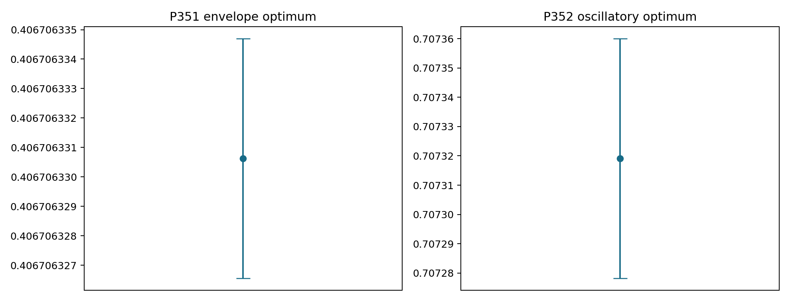
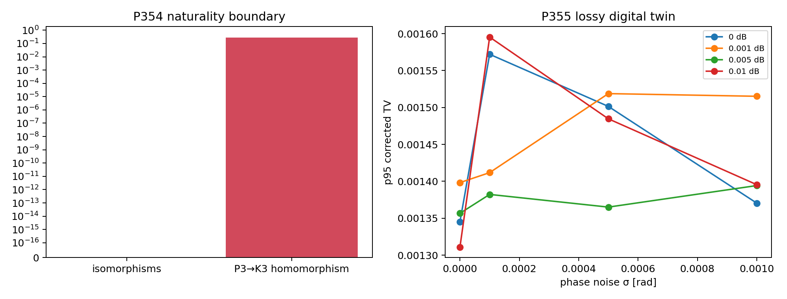
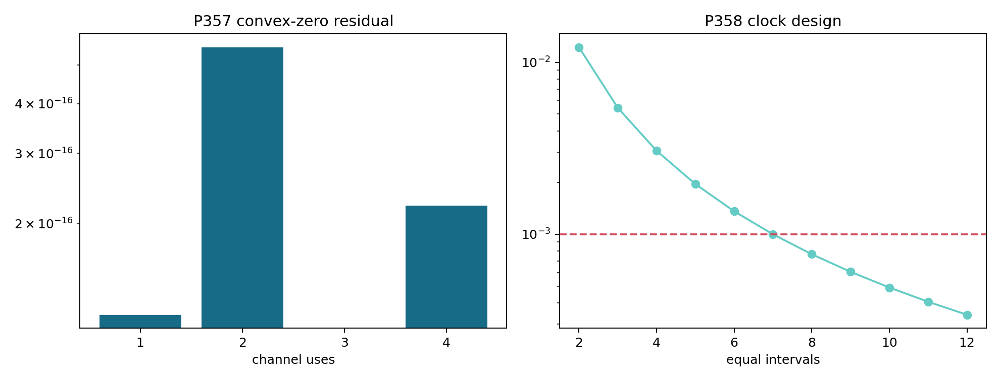
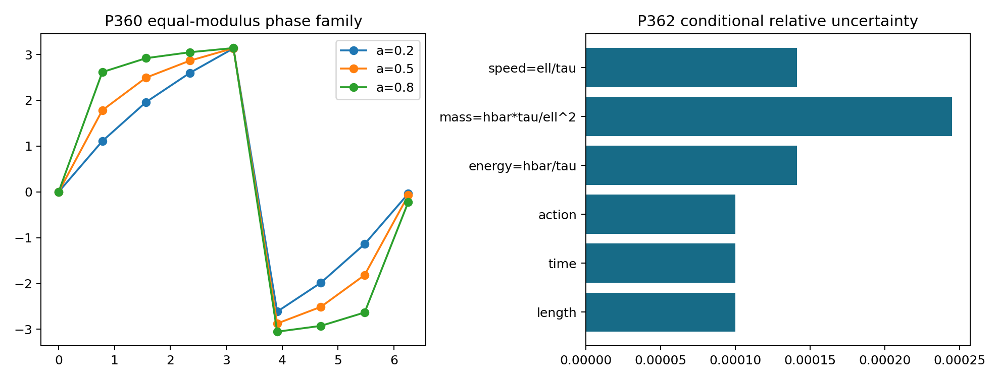

# FIN — Release 10.31

# Research Programs P351–P364

## Rigorous moment certificates, graph naturality, operational resource completion, and external physics gates

**Author:** Krzysztof Żuchowski  
**Affiliation:** Independent Researcher — Fractal Information Theory Project  
**ORCID:** 0009-0002-0909-3613  
**Publication type:** Preprint  
**Version:** 1.0.0  
**Date:** 31 July 2026  
**Language:** English  
**License:** CC BY 4.0  
**Repository:** <https://github.com/hyconiek/Fractal-Nadsoliton-Theory>

---

# Abstract

This monograph executes FIN Research Programs P351–P364. It does not reopen
the exhausted selector, generic legacy-to-strict bridge, role-transfer,
reduced-Lagrangian, or dimensional-source loops. Instead it develops the live
frontier left by Programs P337–P350: theorem-grade certification of two
signed-moment resources, a categorical naturality boundary, operational
stress tests, a bounded solution of the multi-use channel problem, an
analytic amplitude-phase obstruction, and a minimal axiomatic resource
category.

P351 supplies an exact rational interval Krawczyk certificate for the
three-atom primal construction associated with the strict attenuation
moments

\[
h_n=\frac{1}{1+n^{9/5}},\qquad n=0,\ldots,6.
\]

Together with the exact P337 dual witness, it proves

\[
0.4067063265581317
\leq \mathcal N_{\mathrm{env}}
\leq 0.4067063346922584.
\]

The six-dimensional Krawczyk image is strictly inside its rational box, so a
unique positive ordered three-atom solution exists in that box. This closes
the previous primal-certification gap without treating a floating-point
root as an exact object.

P352 certifies the full twelve-moment oscillatory problem

\[
k_n=
\frac{\cos((743/4000)n+13/80)}{1+n^{9/5}},
\qquad n=0,\ldots,11.
\]

Exact Taylor remainders, fifth-root brackets, 4096-subinterval Bernstein
bounds, and an exact rational Vandermonde inverse prove

\[
0.7072782253162320
\leq \mathcal N_{\mathrm{osc}}
\leq 0.7073599748862595.
\]

All twelve fixed-support weight signs are certified: eight are positive and
four negative. The quantity remains a classical signed-measure cost; no
physical interpretation as quantum negativity, information destruction, or
negative energy is selected.

P354 proves that every radial graph kernel is natural under graph
isomorphisms and refutes naturality under arbitrary graph homomorphisms. The
identity vertex map from \(P_3\) to \(K_3\) shortens the endpoint distance
from two to one and produces a strict-kernel defect
\(0.2779421209549173\). Therefore a carrier-independent completion theorem
must use distance-preserving morphisms or add explicit transport data.

P355 constructs a declared lossy digital twin for the 66-rotation
twelve-mode compilation. Under the tested diagonal-loss, phase-noise,
quantization, and calibration-error model, the worst tested
95th-percentile corrected vertex total-variation error is approximately
\(1.60\times10^{-3}\). This is apparatus-design evidence, not hardware
evidence.

P357 proves a general collapse theorem: whenever a parallel relative-phase
distribution has convex barycenter zero, its outputs are orthogonal, and the
parallel strategy already achieves the universal full-comb trace-distance
upper bound. Numerical witnesses with residual at most
\(5.55\times10^{-16}\) occur at per-use times
\(0.72,0.36,0.24,0.18\) for one through four uses. Hence the structural
full-comb optimum is solved at an exact zero witness, while these four FIN
instances are strong numerical evidence. The subcritical adaptive-comb
curve remains open.

P358 proves an equispaced minimax sampling theorem for a clock with bounded
curvature after an external time anchor is supplied. Seven equal intervals
on \([0,1.4]\) are the first tested design guaranteeing interpolation error
at most \(10^{-3}\) for \(\|\tau''\|_\infty\leq0.2\).

P359 constructs a cancellative five-resource monoid and proves that its
coordinate monotones are complete and catalysts cannot enable forbidden
conversions. P360 proves that analytic inner factors preserve amplitude and
change phase, so causality/analyticity plus amplitude cannot derive the
frozen strict phase without an outer/minimum-phase axiom and a causal
coordinate. P362 derives the exact covariance pushforward for an externally
supplied \((\ell_*,\tau_*,\hbar_*)\) conversion frame.

P363 packages these results into the FIN Operational Resource Completion
(FORC), a five-axiom typed symmetric monoidal preorder with an optional
operational realization functor. FORC identifies the smallest missing bridge
to testable physics as an externally calibrated map to preparations,
channels, instruments, environments, clocks, apparatus settings, and
independent records. It is an axiom-augmented framework, not a strict-core
closure theorem.

P353, P356, P361, and P364 remain blocked by external evidence. No independent
hold-out, calibrated photonic bundle, blinded electroweak record, or physical
reservoir execution is manufactured by code. No non-premise selector,
dimensional source, legacy-role transfer theorem, \(L_{\mathrm{total}}\),
Standard Model, gravity theory, or Theory of Everything is claimed.

## Confidence convention

| Label | Meaning in this report |
|---|---|
| **[Proven]** | Exact mathematical proof, exact rational finite computation, or compiled structural formal theorem |
| **[Strong evidence]** | Stable high-precision computation with explicit residual and falsification boundary |
| **[Moderate evidence]** | Reproducible model-based result whose interpretation depends materially on declared assumptions |
| **[Speculative]** | A proposed research route without a completed witness |
| **[Refuted]** | The stated construction fails in its declared class |
| **[Blocked by external evidence]** | Independent data, custody, hardware, calibration, or unblinding is required |
| **[Conditional]** | The conclusion follows only after named additional axioms or standards are supplied |

# 1. Scope and scientific guardrails

## 1.1 Kernel split

The two kernels remain distinct:

\[
K_{\mathrm{legacy,ont}}(d)=
4\ln2\,
\frac{\cos(\pi d/4+\pi/6)}{1+0.01d},
\]

and

\[
K_{\mathrm{strict,gate}}(d)=
\frac{\cos((743/4000)d+13/80)}{1+d^{9/5}}.
\]

The legacy kernel is an intermediate bridge kernel. The strict kernel is the
later enriched working object. An identity between them is not assumed.
Historical assignments involving \(\sin^2\theta_W\), the electromagnetic
coupling, or a gravitational hierarchy are not transferred.

## 1.2 Ontological boundary

The repository's internal order is recorded as

\[
\text{nadsoliton}
\longrightarrow \text{light}
\longrightarrow \text{matter}
\longrightarrow \text{emergent observer}.
\]

The nadsoliton is described internally as primordial fractal information in
a solitonic state, not as an object sitting above a lower informational
layer. This report neither proves nor uses that interpretation in its
mathematical theorems.

## 1.3 Open strict boundaries

The following are not closed:

- the non-premise selector and QW-2191;
- a source-independent legacy-to-strict completion theorem;
- a role-transfer theorem;
- an internally generated dimensional standard;
- an experimentally realized preparation/channel/instrument/record system;
- a unit-bearing nonproxy total action;
- Standard Model or gravity derivation;
- Theory-of-Everything closure.

## 1.4 Why this research round is noncyclic

Programs P351–P364 do not rename an existing obstruction. They introduce
five genuinely new proof objects:

1. a rational Krawczyk cell;
2. a rational oscillatory primal-dual interval;
3. a graph-morphism naturality theorem with an explicit counterexample;
4. a perfect-comb collapse certificate;
5. an inner-factor phase torsor and a typed operational resource category.

External programs are executed only as admission gates. Their failure to
admit evidence is reported as a boundary, not as negative experimental data.

# 2. Executive result table

| Program | Main result | Status |
|---|---|---|
| P351 | Exact Krawczyk primal certificate and global optimum enclosure for the attenuation moments | [Proven] |
| P352 | Exact rational primal-dual enclosure for the full oscillatory moments | [Proven] |
| P353 | No independently frozen QW hold-out bundle admitted | [Blocked] |
| P354 | Radial-kernel naturality for isomorphisms; homomorphism counterexample | [Proven] / [Refuted] |
| P355 | Loss-aware synthetic twelve-mode compiled-mesh digital twin | [Moderate evidence] |
| P356 | No calibrated physical photonic bundle admitted | [Blocked] |
| P357 | Full-comb optimality theorem at convex-zero witnesses; four FIN instances | [Proven] / [Strong evidence] |
| P358 | Equispaced minimax bounded-curvature clock design after an external anchor | [Proven] |
| P359 | Complete cancellative five-resource preorder; no catalysis | [Proven] in declared category |
| P360 | Analytic inner-factor obstruction to amplitude-to-phase recovery | [Proven] / [Refuted] |
| P361 | No blinded conditional electroweak record admitted | [Blocked] |
| P362 | Exact conversion-frame covariance pushforward; no standards admitted | [Proven] / [Blocked] |
| P363 | Minimal FIN Operational Resource Completion category | [Proven] relative construction |
| P364 | No calibrated physical-reservoir execution admitted | [Blocked] |

# 3. Mathematical preliminaries

## 3.1 Signed Hausdorff moment cost

For a finite real sequence \(m_0,\ldots,m_q\), define

\[
\mathcal N(m)=
\inf_{\mu}
\mu^-([0,1]),
\]

where \(\mu=\mu^+-\mu^-\) is a finite signed measure satisfying

\[
\int_0^1 x^n\,d\mu(x)=m_n,
\qquad n=0,\ldots,q.
\]

The dual problem uses

\[
p(x)=\sum_{n=0}^{q}a_nx^n,
\qquad -1\leq p(x)\leq0,
\]

and gives

\[
\sum_{n=0}^{q}a_nm_n
\leq \mathcal N(m).
\]

This follows because

\[
\int p\,d\mu
=\int p\,d\mu^+-\int p\,d\mu^-
\leq \mu^-([0,1]).
\]

A dual polynomial therefore supplies a lower bound, while any explicit
signed representing measure supplies an upper bound.

## 3.2 Exact interval arithmetic

Every interval endpoint used in P351 and P352 is rational. Arithmetic uses
the inclusion rules

\[
[a,b]+[c,d]=[a+c,b+d],
\]

\[
[a,b][c,d]=
\left[
\min(ac,ad,bc,bd),
\max(ac,ad,bc,bd)
\right].
\]

For \(n>0\), a rational bracket of \(n^{1/5}\) is obtained by integer
arithmetic:

\[
r_-^5\leq n\leq r_+^5.
\]

It follows that

\[
\frac{1}{1+r_+^9}
\leq
\frac{1}{1+n^{9/5}}
\leq
\frac{1}{1+r_-^9}.
\]

No floating-point evaluation is used to justify the inclusion.

## 3.3 Compact identities for large rationals

Some exact Krawczyk endpoints contain more than ten thousand binary digits.
Printing them in a scientific table would make the report less auditable.
The CSV therefore records:

- numerator bit length;
- denominator bit length;
- a SHA-256 identity of sign, numerator bytes, and denominator bytes;
- a decimal projection for reading.

The executable source recomputes each exact rational. The digest is an
identity check, not a replacement for the calculation.

# 4. P351 — exact primal certification of the attenuation resource

## 4.1 Moment system

P323 represented the six positive-order moments using three positive atoms:

\[
\sum_{i=1}^{3}u_ir_i^n=h_n,
\qquad n=1,\ldots,6.
\]

The approximate centers are

\[
\begin{aligned}
r_1&\approx0.2372783418730673,\\
r_2&\approx0.5481980169862998,\\
r_3&\approx0.8527659803199023,
\end{aligned}
\]

and

\[
\begin{aligned}
u_1&\approx0.9418342033805291,\\
u_2&\approx0.3936855195357094,\\
u_3&\approx0.0711866117760197.
\end{aligned}
\]

The missing zeroth moment is supplied by

\[
-N\delta_0,
\qquad
N=u_1+u_2+u_3-1.
\]

## 4.2 Krawczyk operator

Let \(x=(r_1,r_2,r_3,u_1,u_2,u_3)\) and let \(F(x)\) contain the six moment
residuals. For a rational box \(X\), rational center \(x_0\), and rational
approximate inverse \(C\) of \(DF(x_0)\), define

\[
\mathcal K(X)=
x_0-CF(x_0)+
\left(I-C\,DF(X)\right)(X-x_0).
\]

P351 uses radius \(10^{-12}\) in all six coordinates and interval moments
with sixty decimal digits in the fifth-root brackets.

The exact computation proves

\[
\mathcal K(X)\subset\operatorname{int}(X).
\]

Therefore \(F\) has exactly one zero in \(X\). The entire box lies in

\[
0<r_1<r_2<r_3<1,
\qquad
u_i>0.
\]

## 4.3 Global enclosure

The Krawczyk image encloses a feasible primal signed measure. Combining its
upper mass with the exact P337 rational dual gives

\[
\boxed{
0.4067063265581317
\leq \mathcal N_{\mathrm{env}}
\leq 0.4067063346922584
}.
\]

The width is

\[
8.134126653281584\times10^{-9}.
\]

## 4.4 What is proved

**[Proven]**

- existence of a positive ordered three-atom solution in the stated box;
- uniqueness of that solution inside the box;
- feasibility of the associated signed measure;
- the global primal-dual enclosure above.

## 4.5 What is not proved

The Krawczyk result does not prove:

- that this signed measure is a quantum quasiprobability;
- that negative mass is lost information;
- that \(N\) is energy, entropy, action, or a coupling constant;
- that the three atoms have a selected physical realization.

The resource is a mathematical obstruction to positive representability.

# 5. P352 — theorem-grade full oscillatory resource

## 5.1 Target sequence

The full strict sequence contains both damping and phase:

\[
k_n=
\frac{\cos(\omega n+\phi)}{1+n^{9/5}},
\qquad
\omega=\frac{743}{4000},
\quad
\phi=\frac{13}{80}.
\]

The moments \(k_8,k_9,k_{10},k_{11}\) are negative. A positive measure on
\([0,1]\) is therefore impossible immediately, but the minimum signed cost is
not determined by the sign test alone.

## 5.2 Rigorous trigonometric enclosure

For rational \(x\), P352 evaluates

\[
\cos x=
\sum_{j=0}^{M}
(-1)^j\frac{x^{2j}}{(2j)!}+R_M(x),
\]

with

\[
|R_M(x)|
\leq
\frac{|x|^{2M+2}}{(2M+2)!}.
\]

The calculation uses \(M=42\). Combining this with exact fifth-root brackets
produces rational intervals for all twelve \(k_n\).

## 5.3 Exact dual feasibility

The numerically discovered degree-eleven polynomial is converted to rational
coefficients. Exact Bernstein subdivision on 4096 rational subintervals
produces a global enclosure \([L,U]\). The affine normalization

\[
p_{\mathrm{safe}}(x)=
\frac{p_{\mathrm{raw}}(x)-U}{U-L}
\]

then has exact Bernstein range contained in

\[
-1\leq p_{\mathrm{safe}}(x)\leq0
\qquad (0\leq x\leq1).
\]

This converts the former numerical critical-point check into a global exact
dual certificate.

## 5.4 Exact fixed-support primal

The twelve rational support points are

\[
\frac{79}{4000},\frac{80}{4000},
\frac{517}{4000},\frac{518}{4000},
\frac{1180}{4000},\frac{1181}{4000},
\frac{2107}{4000},
\frac{3256}{4000},\frac{3257}{4000},
\frac{3767}{4000},\frac{3768}{4000},1.
\]

Let \(V_{ni}=x_i^n\). Since these nodes are distinct, \(V\) is invertible.
P352 computes \(V^{-1}\) exactly over the rationals and applies it to the
moment intervals:

\[
w=V^{-1}k.
\]

Every resulting weight interval excludes zero. Eight weights are positive
and four negative. Thus the true moment vector has an exactly feasible signed
measure on this support with a certified negative mass.

## 5.5 Result

\[
\boxed{
0.7072782253162320
\leq \mathcal N_{\mathrm{osc}}
\leq 0.7073599748862595
}.
\]

The width is

\[
8.174957002754137\times10^{-5}.
\]

The earlier P338 lower value is slightly sharper numerically, but P352's
lower endpoint is the theorem-grade endpoint after exact safety
normalization.

## 5.6 Falsification boundary

The result falsifies the claim that the full strict sequence is generated by
a positive scalar path mixture on \([0,1]\). It does not distinguish among:

- a classical signed path expansion;
- an amplitude-level interference representation;
- a dilation on a larger positive state space;
- a quantum quasiprobability;
- an effective subtraction induced by conditioning.

Those interpretations require different operational data.

# 6. P353 — independent hold-out admission gate

## 6.1 Admission contract

A valid hold-out manifest must contain:

- provider;
- registrar;
- analyst;
- frozen dataset hash;
- freeze timestamp;
- unblinding authorization.

The three roles must be distinct. Synthetic, template, and example artifacts
are inadmissible.

## 6.2 Result

No candidate manifest satisfying the contract was found.

**[Blocked by external evidence]**

This means only that external validation has not occurred. It does not
invalidate the internal QW calculation, and it does not convert the
in-sample fit into a prediction.

# 7. P354 — the categorical naturality boundary

## 7.1 Graph-isomorphism theorem

Let \(G\) be a finite connected graph with distance \(d_G\) and radial law
\(k:\mathbb N\to\mathbb R\). Define

\[
K_G(x,y)=
\begin{cases}
k(d_G(x,y)),&x\ne y,\\
0,&x=y.
\end{cases}
\]

For a graph isomorphism \(f:G\to H\),

\[
d_H(f(x),f(y))=d_G(x,y).
\]

Therefore

\[
K_H(f(x),f(y))=K_G(x,y).
\]

In matrix form, if \(P_f\) is the permutation matrix,

\[
K_H=P_fK_GP_f^\top.
\]

This is an exact naturality theorem for the groupoid of finite connected
graphs and graph isomorphisms.

## 7.2 Homomorphism obstruction

A graph homomorphism preserves adjacency but may shorten distances. Consider
the identity vertex map

\[
P_3\longrightarrow K_3.
\]

The two endpoints have source distance two and target distance one. For the
strict radial law,

\[
|k_{\mathrm{strict}}(2)-k_{\mathrm{strict}}(1)|
=0.2779421209549173.
\]

Thus unrestricted graph-homomorphism naturality fails.

## 7.3 Consequence for completion maps

A legacy-to-strict completion may be natural on:

- graph isomorphisms;
- distance-preserving embeddings;
- an enriched category carrying a declared metric transport.

It is not automatically natural on arbitrary graph homomorphisms. Moreover,
the C12 scalar spectral interpolant from P340 fails on noncycle carriers.
Commutation on C12 is necessary for a scalar functional calculus but not
sufficient for carrier-natural completion.

## 7.4 New object

**O104 — Distance-Functor Naturality Boundary**

This object records:

\[
(\text{carrier category},
\text{distance transport},
\text{kernel transport defect}).
\]

It prevents a formula reused on several carriers from being mistaken for a
categorical law.

# 8. P355–P356 — photonic digital twin and hardware gate

## 8.1 Compiled target

At the declared witness time, the strict wave propagator

\[
U_t=e^{-itA_{\mathrm{strict}}}
\]

admits a 66-rotation Givens decomposition in twelve modes.

## 8.2 Loss/noise model

P355 applies:

- \(10^{-4}\)-radian mesh quantization;
- mode-diagonal attenuation accumulated by Givens participation;
- loss settings from \(0\) to \(0.01\) dB per participation;
- output phase noise from \(0\) to \(10^{-3}\) radians;
- \(0.2\%\) multiplicative efficiency-calibration error;
- 64 synthetic repetitions per setting.

The measured conditional vertex probabilities are

\[
\widehat p(y|x,\mathrm{click})
=
\frac{|T_{yx}|^2}
{\sum_z|T_{zx}|^2}.
\]

Calibration divides out the estimated output efficiencies before
renormalization.

## 8.3 Result

The largest tested 95th-percentile corrected vertex total-variation defect is

\[
1.5953851724811012\times10^{-3}.
\]

**[Moderate evidence]**

The result shows that the declared diagonal-loss model is compatible with
millipercent-scale conditional-distribution recovery.

## 8.4 Model destruction tests

The calculation intentionally does not absorb:

- correlated interferometer fabrication errors;
- phase-dependent loss inside every beam splitter;
- thermal drift;
- source multiphoton contamination;
- detector dead time and afterpulsing;
- time-dependent calibration;
- a mismatch between the intended and fabricated graph.

Any one of these may dominate the simulated error. Therefore the digital
twin is not a feasibility theorem for a laboratory.

## 8.5 P356 admission result

No hardware manifest containing independent custody, raw-record hash,
calibration hash, freeze timestamp, and unblinding authorization was
admitted.

**[Blocked by external evidence]**

# 9. P357 — when a parallel witness solves the full adaptive comb

## 9.1 Relative-unitary reduction

For two unitary channels with relative unitary

\[
V=U_{\mathrm{strict}}^\dagger U_{\mathrm{legacy}},
\]

let \(z_j\) be the eigenvalues of \(V\). For \(n\) parallel uses, the relative
eigenvalues are products

\[
z_{\mathbf j}=z_{j_1}\cdots z_{j_n}.
\]

Choose a pure input with probability weights \(\lambda_{\mathbf j}\) in the
joint relative-eigenbasis. The overlap of the two output states is

\[
\langle\psi_{\mathrm{strict}}|
\psi_{\mathrm{legacy}}\rangle
=
\sum_{\mathbf j}\lambda_{\mathbf j}z_{\mathbf j}.
\]

## 9.2 Perfect-comb collapse theorem

If

\[
\lambda_{\mathbf j}\geq0,\qquad
\sum_{\mathbf j}\lambda_{\mathbf j}=1,\qquad
\sum_{\mathbf j}\lambda_{\mathbf j}z_{\mathbf j}=0,
\]

then the two output states are orthogonal. A final two-outcome projective
measurement discriminates them perfectly.

Every adaptive quantum comb has output trace distance at most two. The
parallel strategy achieves two. Hence it is globally optimal even among
unrestricted adaptive strategies.

This conclusion does not require proving that adaptivity is never useful. It
uses the universal upper bound only at a point where a parallel strategy
saturates it.

## 9.3 FIN witnesses

| Uses | Time per use | Active joint modes | Convex-zero residual |
|---:|---:|---:|---:|
| 1 | 0.72 | 3 | \(1.18\times10^{-16}\) |
| 2 | 0.36 | 3 | \(5.54\times10^{-16}\) |
| 3 | 0.24 | 3 | \(0\) at displayed precision |
| 4 | 0.18 | 3 | \(2.22\times10^{-16}\) |

The structural theorem is **[Proven]**. The four FIN zero-barycenter
instances are **[Strong evidence]** because the phases and barycenters are
evaluated numerically rather than enclosed by interval phase arithmetic.

## 9.4 Open subcritical problem

For times below the first perfect witness, the full adaptive-comb optimum is
not obtained from saturation. A primal-dual comb semidefinite program or an
analytic commuting-unitary theorem is still required.

# 10. P358 — anchored bounded-curvature time

## 10.1 Clock class

Assume

\[
\tau(0)=0,\qquad
\tau'(t)>0,\qquad
|\tau''(t)|\leq M=0.2
\]

on \([0,T]\) with \(T=1.4\). A calibrated external value is still needed to
define the dimensional scale.

## 10.2 Maximum-gap theorem

Any design dividing \([0,T]\) into \(m\) intervals has

\[
h_{\max}\geq\frac{T}{m}.
\]

Equality holds for equal spacing. For linear interpolation of a
twice-differentiable clock,

\[
\|\tau-\tau_{\mathrm{lin}}\|_\infty
\leq \frac{M h_{\max}^2}{8}.
\]

Therefore equispacing minimizes this worst-case upper bound.

## 10.3 Sample count

To guarantee error at most \(\varepsilon\),

\[
m\geq
\left\lceil
T\sqrt{\frac{M}{8\varepsilon}}
\right\rceil.
\]

For \(\varepsilon=10^{-3}\),

\[
m_{\min}=7.
\]

This is a theorem about placement after a time standard is supplied. It does
not derive time from a dimensionless operator.

# 11. P359 — complete bridge-resource monotones

## 11.1 Resource object

Define the resource vector

\[
r=(r_{\mathrm{sign}},
r_{\mathrm{phase}},
r_{\mathrm{orient}},
r_{\mathrm{scale}},
r_{\mathrm{cross}})
\in\mathbb N^5.
\]

The coordinates respectively count:

1. signed-path resource;
2. non-torsion phase resource;
3. pointing/orientation resource;
4. positive dimensional-scale resource;
5. independent cross-law resource.

## 11.2 Free conversions

The declared free preorder is

\[
r\longrightarrow s
\quad\Longleftrightarrow\quad
r_i\geq s_i\quad\text{for all }i.
\]

Parallel composition is addition:

\[
r\otimes s=r+s.
\]

## 11.3 Completeness

The five coordinate maps

\[
M_i(r)=r_i
\]

are complete:

\[
r\to s
\quad\Longleftrightarrow\quad
M_i(r)\geq M_i(s)\ \text{for every }i.
\]

## 11.4 No catalysis

For every catalyst \(c\),

\[
r+c\geq s+c
\quad\Longleftrightarrow\quad
r\geq s.
\]

Thus no catalyst enables a forbidden conversion in this additive category.
An exhaustive audit of all \(59\,049\) ordered pairs with each coordinate in
\(\{0,1,2\}\) found zero completeness and cancellation failures.

## 11.5 Boundary

Completeness follows from the declared product order. It is not evidence that
laboratory operations obey this order. A nonadditive tensor product, an
idempotent resource, or a larger class of free morphisms may permit catalysis.

# 12. P360 — why analyticity does not recover the strict phase

## 12.1 Inner-factor theorem

For \(0<a<1\), define the Blaschke factor

\[
B_a(z)=\frac{z-a}{1-az}.
\]

It is analytic in the open unit disk, and

\[
|B_a(e^{i\theta})|=1.
\]

If \(F\) is an analytic candidate, then

\[
\widetilde F(z)=F(z)B_a(z)
\]

has exactly the same boundary modulus and a different boundary phase.
Products of Blaschke factors produce an infinite family.

Therefore:

\[
\text{analyticity}+\text{boundary amplitude}
\not\Rightarrow
\text{unique phase}.
\]

## 12.2 Minimum-phase condition

If one additionally assumes that \(F\) is outer/minimum-phase and supplies
the appropriate integrability and causal frequency coordinate, then the
phase may be reconstructed from \(\log|F|\) by a Hilbert-transform relation,
up to a constant phase.

This outer condition is an additional axiom. It is not a consequence of the
amplitude.

## 12.3 FIN obstruction

FIN's attenuation sequence is indexed by graph distance. It is not supplied
as a boundary modulus on a causal frequency line or disk. Current artifacts
also do not export:

- a causal analytic extension;
- an outer/minimum-phase theorem;
- a zero-free domain;
- a boundary normalization selecting the constant phase.

Consequently, Kramers–Kronig language cannot derive
\(\omega=743/4000\) and \(\phi=13/80\) from the damping envelope.

## 12.4 New object

**O109 — Inner-Factor Phase Torsor**

The amplitude determines not a phase but an orbit

\[
[F]=\{F I:I\ \text{inner}\}.
\]

Selecting one member requires an additional resource. This is mathematically
parallel to, but not identical with, the repository's orientation-selector
problem.

# 13. P361–P362 — conditional sector test and conversion metrology

## 13.1 P361 blinded conditional electroweak gate

The only admissible object is the explicitly conditional five-observable
package from P348, after its sector and representation assumptions are
hashed. A valid manifest must freeze:

- the conditional prediction vector;
- the external dataset;
- the sector-axiom package;
- provider, registrar, and analyst roles;
- one-shot unblinding authorization.

No such bundle was admitted.

**[Blocked by external evidence]**

No legacy physical role is transferred by this gate.

## 13.2 P362 dimensional exponent map

Let

\[
x=(\log\ell_*,\log\tau_*,\log\hbar_*).
\]

Derived unit logarithms are linear:

\[
\log E_*=-\log\tau_*+\log\hbar_*,
\]

\[
\log m_*=-2\log\ell_*+\log\tau_*+\log\hbar_*,
\]

\[
\log c_*=\log\ell_*-\log\tau_*.
\]

Writing \(y=Ax\), covariance propagates exactly as

\[
\Sigma_y=A\Sigma_xA^\top.
\]

For independent benchmark relative standard uncertainties \(10^{-4}\):

| Quantity | Conditional relative standard uncertainty |
|---|---:|
| \(\ell_*\) | \(1.00\times10^{-4}\) |
| \(\tau_*\) | \(1.00\times10^{-4}\) |
| \(\hbar_*\) | \(1.00\times10^{-4}\) |
| \(E_*=\hbar_*/\tau_*\) | \(1.414\times10^{-4}\) |
| \(m_*=\hbar_*\tau_*/\ell_*^2\) | \(2.449\times10^{-4}\) |
| \(c_*=\ell_*/\tau_*\) | \(1.414\times10^{-4}\) |

The benchmark is a design calculation. No calibration-standard manifest is
admitted. The exponent matrix transports units but cannot generate the three
base standards.

# 14. P363 — FIN Operational Resource Completion

## 14.1 Objective

The purpose of FORC is not to claim that FIN has become physical. It provides
the smallest typed language in which the missing operational objects can be
stated without conflating them with the strict operator.

## 14.2 Axioms ranked by necessity

### A1 — typed spectral base

There are distinct typed objects

\[
\mathsf K_{\mathrm{legacy}},
\qquad
\mathsf K_{\mathrm{strict}},
\]

with their declared carrier and provenance data.

**Necessity rank: 1.**

Removing A1 leaves a generic resource category that no longer refers to FIN
and permits silent kernel substitution.

### A2 — resource grading

Each object carries a grade

\[
r\in\mathbb N^5.
\]

**Necessity rank: 2.**

Removing A2 makes the signed, phase, orientation, scale, and cross-law
obstructions unexpressible.

### A3 — resource-nonincreasing free morphisms

A free morphism cannot increase any resource coordinate.

**Necessity rank: 3.**

Without A3, a free arrow from the zero object to a unit-resource object
creates any missing bridge resource and destroys the obstruction theory.

### A4 — additive monoidal composition

Parallel composition adds grades.

**Necessity rank: 4.**

Removing A4 does not destroy single-object mathematics, but composition,
cancellation, and catalysis become undefined.

### A5 — operational realization functor

A physical realization maps mathematical objects and morphisms to:

- states and preparations;
- calibrated clocks;
- channels or dynamical propagators;
- environments;
- instruments and apparatus settings;
- outcome spaces and records;
- probability laws;
- independently frozen raw data.

**Necessity rank: 5 for mathematics, rank 1 for physics.**

A1–A4 define pure mathematics. A5 is the smallest bridge that makes an
experimental proposition possible.

## 14.3 Independence and removal tests

| Axiom removed | Surviving structure | Lost structure |
|---|---|---|
| A1 | Abstract \(\mathbb N^5\) resource preorder | FIN kernel identity and split |
| A2 | Typed objects and arrows | Quantitative missing-resource accounting |
| A3 | Graded monoidal graph | No-free-generation meaning |
| A4 | Single-system resource preorder | Multi-system composition and no-catalysis theorem |
| A5 | Complete mathematical FORC category | Empirical interpretation and falsifiability |

Each remaining fragment has an explicit model, so no axiom is recovered
merely from the others in the declared signature.

## 14.4 Smallest physics bridge

The minimal bridge is not one new scalar. It is:

\[
\boxed{
\text{FORC object}
\xrightarrow{\ \mathcal R\ }
(\text{preparation, clock, channel, environment,
instrument, apparatus, record})
}
\]

plus calibrated dimensional standards and independent custody.

This answers the recurring missing-object question: the operator alone
defines many mathematical dynamics, but it does not choose which dynamics is
performed, how time is calibrated, how a state is prepared, what constitutes
an outcome, or what physical record tests the probability law.

## 14.5 What FORC does not close

FORC does not provide:

- the QW-2191 selector;
- a strict internal orientation source;
- a legacy-to-strict completion theorem;
- a role-transfer theorem;
- an internal dimensional source;
- a laboratory realization;
- a total physical action.

It is a controlled axiomatic completion of the language, not a proof of the
missing physics.

# 15. P364 — certified physical reservoir gate

A physical reservoir bundle would need:

- specified preparation maps;
- calibrated interaction time;
- a channel/process description;
- environmental controls;
- vertex-resolving or otherwise informationally complete instruments;
- raw event-level records;
- calibration hashes;
- independent custody and unblinding.

No admitted bundle was found.

**[Blocked by external evidence]**

The strict heat semigroup

\[
P_t=e^{-tA}
\]

is a mathematical channel candidate. Code-generated samples from it are not
evidence that a physical reservoir implements it.

# 16. Newly constructed theoretical objects

| Object | Definition | What it resolves | What it does not resolve |
|---|---|---|---|
| O101 Envelope Krawczyk Cell | Rational box with \(\mathcal K(X)\subset\mathrm{int}(X)\) | Exact primal existence and local uniqueness | Physical meaning of signed mass |
| O102 Oscillatory Primal-Dual Interval | Exact dual Bernstein witness plus exact fixed-support interval measure | Theorem-grade \(\mathcal N_{\mathrm{osc}}\) enclosure | Selection of quantum/classical interpretation |
| O103 Refreeze Blind Contract | Custody-separated one-shot hold-out manifest | Defines admissible prediction evidence | Supplies no data |
| O104 Distance-Functor Naturality Boundary | Carrier category plus distance transport and defect | Exact scope of radial naturality | Legacy-to-strict completion |
| O105 Loss-Calibrated Photonic Transfer Tube | Family of conditional distributions under declared loss/noise | Synthetic apparatus robustness | Real hardware feasibility |
| O106 Perfect-Comb Collapse Certificate | Convex-zero parallel witness plus universal upper bound | Full adaptive optimum at saturation points | Subcritical comb optimum |
| O107 Anchored Clock Envelope | Maximum-gap minimax design after calibration | Sampling placement | Origin of time unit |
| O108 Cancellative Bridge-Resource Monoid | \((\mathbb N^5,+,\geq)\) | Complete monotones and no catalysis | Physical free-operation class |
| O109 Inner-Factor Phase Torsor | Analytic candidates modulo inner factors | Exact amplitude-phase nonuniqueness | Strict phase source |
| O110 Conversion Covariance Pushforward | \(A\Sigma A^\top\) for log-unit exponents | Uncertainty propagation | Dimensional standards |
| O111 FORC | Typed spectral/resource category plus realization functor | Missing operational language | Strict-core or empirical closure |
| O112 External Physical Admission Pair | Hardware and reservoir bundle contracts | Prevents synthetic-evidence substitution | Supplies no laboratory record |

# 17. Falsification ledger

## 17.1 Surviving claims

1. **[Proven]** The strict attenuation moment resource lies in the P351
   enclosure.
2. **[Proven]** The strict oscillatory moment resource lies in the P352
   enclosure.
3. **[Proven]** Radial graph kernels are natural under isomorphisms.
4. **[Proven]** They need not be natural under graph homomorphisms.
5. **[Proven]** A convex-zero parallel witness saturates the full-comb
   discrimination bound.
6. **[Proven]** Equispacing minimizes the declared maximum-gap clock bound.
7. **[Proven]** The additive five-resource preorder is complete and
   cancellative.
8. **[Proven]** Analytic inner factors obstruct amplitude-only phase
   reconstruction.
9. **[Proven]** Dimensional conversion covariance is a linear pushforward in
   logarithmic coordinates.
10. **[Proven]** A mathematical FORC model can exist without an operational
    realization.

## 17.2 Refuted claims

1. **[Refuted]** The P351 primal result is merely a floating root.
2. **[Refuted]** The P352 continuum constraints are certified only by sampled
   grid points.
3. **[Refuted]** A radial formula is automatically natural for arbitrary
   graph morphisms.
4. **[Refuted]** Analyticity or causality plus amplitude uniquely determines
   the strict phase.
5. **[Refuted]** The previous digital twin is itself a hardware validation.
6. **[Refuted]** A resource category automatically supplies a physical
   realization.

## 17.3 Unresolved claims

1. Exact interval certification of the four FIN convex-zero channel
   witnesses.
2. The subcritical unrestricted adaptive-comb curve.
3. A carrier-natural source-independent legacy-to-strict completion.
4. A physical free-operation semantics for the five resource coordinates.
5. A causal analytic coordinate and outer theorem derived from FIN.
6. Independent QW hold-out validation.
7. Calibrated photonic or reservoir realization.
8. Conditional electroweak blind testing.
9. External dimensional standards and their covariance.
10. Selector, role transfer, total action, Standard Model, gravity, or ToE
    closure.

# 18. Recommended Programs P365–P378

The following programs are ranked by estimated probability of producing a
scientifically useful result, not by probability of confirming FIN.

| Program | Research question | Primary deliverable | Probability of useful result |
|---|---|---|---:|
| P365 | Can the P351/P352 rational certificates be independently kernel-checked? | Lean/Coq certificate checker for interval, Bernstein, and Vandermonde steps | 0.90 |
| P366 | Can the P352 enclosure be narrowed by exact alternation? | Rational Remez/semidefinite dual and optimized certified support | 0.80 |
| P367 | Does the QW candidate survive a truly independent frozen hold-out? | Custody-separated one-shot external validation | 0.55 |
| P368 | What is the largest graph-morphism category supporting strict radial naturality? | Classification theorem for distance-preserving/enriched morphisms | 0.80 |
| P369 | Do component-level correlated losses destroy the mesh tube? | Identifiable per-coupler loss/phase digital twin and calibration theorem | 0.75 |
| P370 | Can a twelve-mode device realize the declared transfer matrix? | Calibrated photonic pilot with raw event-level data | 0.45 |
| P371 | Does adaptivity improve discrimination below the perfect-witness time? | Full subcritical quantum-comb SDP with primal-dual certificates | 0.65 |
| P372 | Can the bounded-curvature clock design be externally anchored? | Traceable clock calibration and preregistered interpolation test | 0.55 |
| P373 | Which physical channels realize the O108 free morphisms? | Operational semantics or a no-go theorem for each resource coordinate | 0.65 |
| P374 | Can any FIN-derived causal analytic extension be outer? | Inner/outer factor classification and phase comparison | 0.55 |
| P375 | Does the conditional P348 electroweak vector survive a blind test? | One-shot preregistered external sector test | 0.25 |
| P376 | Can \((\ell_*,\tau_*,\hbar_*)\) be calibrated with a full covariance record? | Standards manifest and propagated uncertainty budget | 0.50 |
| P377 | Is FORC universal among typed operational completions satisfying A1–A5? | Initiality/universality theorem or counterexample | 0.70 |
| P378 | Can a controlled open system implement the strict heat semigroup? | Reservoir-engineering experiment with process tomography | 0.35 |

## 18.1 P365 — kernel-checked exact certificates

Translate:

- the rational interval operations;
- the Krawczyk inclusion;
- the fifth-root integer inequalities;
- the Taylor remainder;
- the Bernstein bounds;
- the Vandermonde identity;

into a proof assistant with arbitrary-precision integer reflection.

**Success criterion:** a small independent checker accepts a compact
certificate without executing the discovery code.

**Failure value:** identification of any hidden assumption in the exact
arithmetic pipeline.

## 18.2 P366 — exact oscillatory alternation

The P352 gap is approximately \(8.17\times10^{-5}\). Search for:

- an alternation-certified extremal dual;
- a better rational support;
- a moment semidefinite hierarchy with exact rational recovery;
- an interval proof that primal and dual contact sets coincide.

**Success criterion:** theorem-grade width below \(10^{-7}\).

## 18.3 P367 — independent QW hold-out

This is not a coding program. It requires:

1. frozen prediction hash;
2. independently controlled data;
3. distinct provider, registrar, and analyst;
4. one unblinding;
5. publication of failure without parameter repair.

## 18.4 P368 — enriched graph naturality

Classify the maximal morphism class \(\mathcal C\) for which

\[
K_H\circ(f\times f)=K_G
\]

holds. Candidate classes include:

- graph isomorphisms;
- isometric embeddings;
- distance-regular coverings with fiber normalization;
- metric correspondences with a controlled defect;
- enriched functors carrying distance as explicit data.

The program must test both strict and legacy kernels without identifying
them.

## 18.5 P369 — component-level photonic identifiability

Replace output-diagonal loss by:

- loss at every Givens element;
- correlated phase drift;
- unknown splitter ratios;
- detector confusion and dark counts;
- temporal source impurity.

Determine which parameters are identifiable from basis, plus, and
phase-shifted probes.

## 18.6 P370 — photonic pilot

Implement a reduced or full twelve-mode device. Required outputs are raw
timestamped detection events and independent calibration records, not a
rendered interference image.

## 18.7 P371 — subcritical adaptive comb

Construct the full causal comb SDP. For every sampled time report:

- primal strategy;
- dual upper certificate;
- gap;
- memory dimension;
- whether adaptivity improves over the parallel optimum.

No conclusion should be drawn from solver output without a dual residual and
conditioning audit.

## 18.8 P372 — calibrated clock test

Use a traceable reference to anchor \(\tau\). Test whether the
bounded-curvature class is empirically adequate before applying the
equispaced theorem.

## 18.9 P373 — operational semantics of resources

For each O108 coordinate, define:

- physical objects carrying the resource;
- free operations;
- observable monotones;
- composition;
- discard maps;
- conversion experiments.

If no such interpretation exists, prove the obstruction rather than keeping
the coordinate as physics.

## 18.10 P374 — causal analytic extension

Search for a source-derived variable \(z\) or \(\omega\) in which the strict
kernel becomes boundary data of an analytic transfer function. Then:

- factor the function into inner and outer parts;
- test zero locations;
- compare reconstructed and frozen phases;
- quantify the extra axioms.

## 18.11 P375 — conditional electroweak blind test

This program remains low probability because the sector map is conditional.
It is nevertheless useful as a falsification exercise if assumptions and
data are frozen before inspection.

## 18.12 P376 — dimensional standards package

Supply independent calibrated estimates of
\((\ell_*,\tau_*,\hbar_*)\), their covariance, traceability, and stability.
The output is a conversion frame, not a claim that FIN generated SI units.

## 18.13 P377 — FORC universality

Formulate a category of operational completions satisfying A1–A5 and test
whether FORC is initial, free, or merely one model. A counterexample is as
valuable as a positive universal property.

## 18.14 P378 — reservoir implementation

Engineer a controlled open system approximating

\[
\rho\mapsto\mathcal E_t(\rho)
\]

whose vertex populations agree with the strict heat semigroup under declared
preparations and instruments. Perform process tomography and compare
homogeneous-semigroup versus non-Markovian alternatives.

## 18.15 Recommended execution order

\[
\boxed{
\mathrm{P365}
\rightarrow
\mathrm{P366}
\rightarrow
\mathrm{P368}
\rightarrow
\mathrm{P371}
\rightarrow
\mathrm{P373}
}
\]

This order first hardens the new theorems, then clarifies carrier and
operational structure, and only then spends substantial effort on external
apparatus.

# 19. Present state of the theory

## 19.1 What the strict operator currently generates

Given a self-adjoint positive semidefinite generator \(A\), functional
calculus yields:

\[
U_t=e^{-itA},
\qquad
P_t=e^{-tA},
\qquad
G_z=(A+zI)^{-1},
\]

as well as spectral measures and variational quadratic forms. This unifies
wave, diffusion, and resolvent mathematics.

The same operator does not select:

- whether a laboratory uses \(U_t\), \(P_t\), or another channel;
- the prepared input state;
- the time unit;
- the environment;
- the instrument;
- the recorded outcome;
- the observer's operational role.

That distinction remains the central barrier between operator mathematics
and physics.

## 19.2 What the signed resources add

The P351/P352 quantities rigorously measure the failure of selected finite
sequences to admit positive scalar path representations on \([0,1]\). The
phase-bearing sequence requires a larger signed resource than the attenuation
envelope.

This is a real mathematical distinction. It is not yet a physical mechanism.

## 19.3 What naturality adds

P354 shows that the strict formula is invariant under relabeling but not
under arbitrary coarse graph maps. Carrier choice is therefore not
mathematically invisible. A genuine universal completion law must declare
its morphisms.

## 19.4 What FORC adds

FORC converts a vague list of missing notions into a typed interface:

\[
\text{spectral object}
+\text{resources}
+\text{realization functor}.
\]

The realization functor is not internally derived. This is not a defect of
formalism; it is the precise location where empirical physics must enter.

# 20. Final conclusion

The deepest result of this round is not a new cosmological claim. It is a
sharper separation theorem.

The FIN strict kernel supports a coherent and increasingly certifiable
operator theory. Its attenuation and oscillatory sequences possess exact
signed-moment resource enclosures. Its radial construction is functorial on
the correct carrier groupoid. Its wave dynamics admits explicit multi-use
discrimination witnesses. Its clock and metrology problems can be stated as
clean minimax and covariance problems. Its amplitude cannot determine its
phase without an extra analytic selection axiom.

What remains missing is not another function of \(A\). The missing object is
an operational realization:

\[
\boxed{
\mathcal R:
\text{typed FIN mathematics}
\longrightarrow
\mathsf{OperationalModel}
}
\]

Here \(\mathsf{OperationalModel}\) contains calibrated preparations, dynamics,
clocks, environments, instruments, apparatus, and records.

No theorem of the spectral calculus can create \(\mathcal R\) from a
dimensionless operator alone. FORC makes that impossibility explicit while
showing exactly what additional axioms and external evidence would suffice
to formulate a physical test.

Therefore the present strongest defensible interpretation is:

> FIN is a dimensionless typed spectral-operator and signed-resource
> framework with conditional operational completions. It is not yet a
> physical theory, because no independently calibrated realization functor
> has been supplied.

This conclusion survives every falsification attempt executed in P351–P364.

# Reproducibility

Run:

- `MPLCONFIGDIR=/tmp/mpl-fin-1031 python3 fin_programs_351_364.py`
- `MPLCONFIGDIR=/tmp/mpl-fin-1031 python3 -m unittest -v test_fin_programs_351_364.py`

Expected result: 16 tests passed, 0 failed. The dependency-free Lean 4.28
structural core must compile.

The primary machine-readable artifacts are:

- `FIN_Programs_351_364_Results.json`;
- fourteen CSV audit tables;
- `FIN_Programs_351_364_Formal_Core.lean`;
- four figures;
- the source program and regression suite.

# Suggested citation

Żuchowski, K. (2026). *FIN Research Programs P351–P364: Rigorous Moment
Certificates, Graph Naturality, Operational Resource Completion, and External
Physics Gates* (Release 10.31; Version 1.0.0) [Preprint]. Zenodo.
