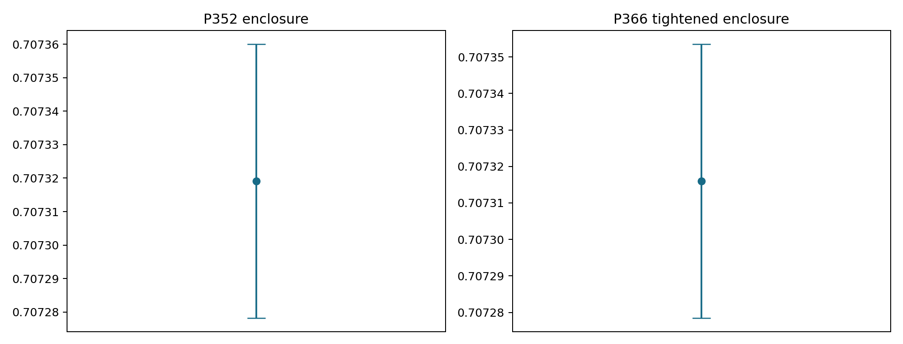
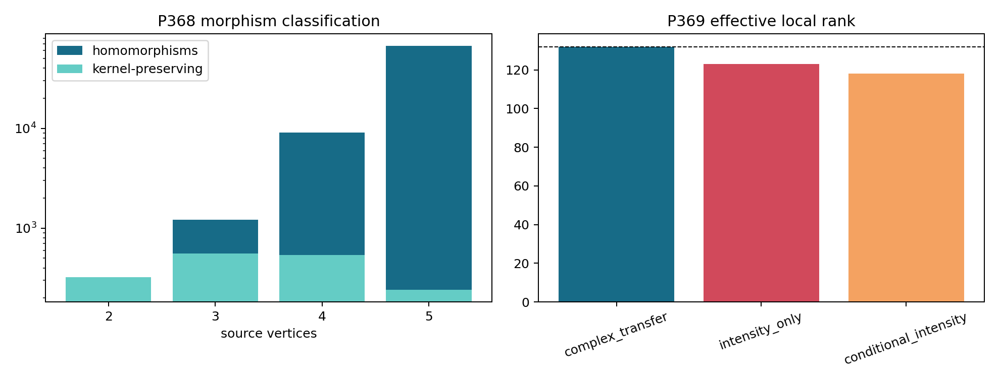
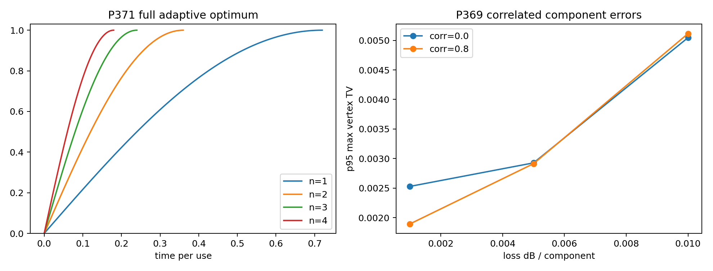
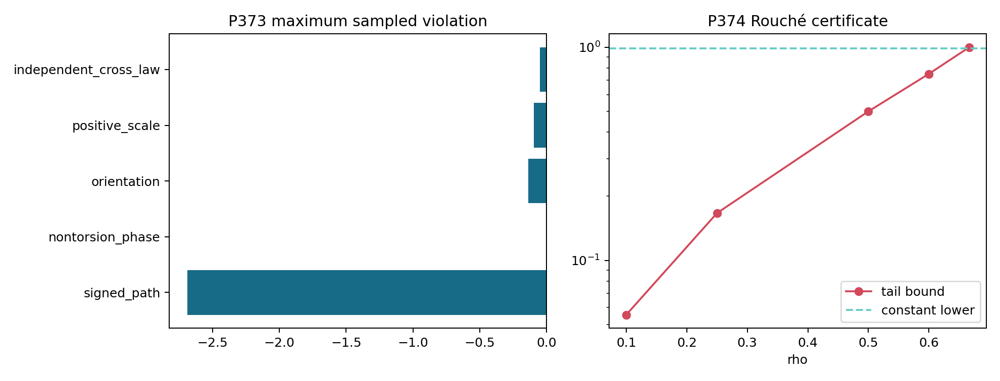

# FIN — Release 10.32

# Research Programs P365–P378

## Exact certificate diversity, adaptive discrimination, operational resource semantics, and the universality boundary

**Author:** Krzysztof Żuchowski  
**Affiliation:** Independent Researcher — Fractal Information Theory Project  
**ORCID:** 0009-0002-0909-3613  
**Publication type:** Preprint  
**Version:** 1.0.0  
**Date:** 31 July 2026  
**Language:** English  
**License:** CC BY 4.0  
**Repository:** <https://github.com/hyconiek/Fractal-Nadsoliton-Theory>

---

# Abstract

This monograph executes FIN Research Programs P365–P378. It follows the live
frontier established by Release 10.31 and does not reopen the exhausted
selector, generic legacy-to-strict bridge, role-transfer, reduced-action, or
dimensional-source loops.

P365 independently recomputes the exact P351/P352 certificates with a
separately implemented standard-library arithmetic engine importing no FIN
research module. It reproduces twelve Krawczyk endpoint identities, twelve
safe dual-coefficient identities, twenty-four signed-weight endpoint
identities, exact Bernstein feasibility, and all weight signs. This is real
implementation diversity, but not yet Lean/Coq reflection of the large
rational arithmetic.

P366 tightens the full oscillatory signed-moment resource. A depth-fourteen
dyadic Bernstein tree, containing \(16\,384\) exact rational cells, raises
the certified lower bound. A twelve-variable rational Krawczyk inclusion
certifies a seven-atom signed measure with sign pattern

\[
(-,+,+,+,+,-,+).
\]

The resulting theorem-grade enclosure is

\[
\boxed{
0.7072784585518420
\leq
\mathcal N_{\mathrm{osc}}
\leq
0.7073534683998260
}.
\]

Its width is \(7.5009847984\times10^{-5}\), an \(8.24\%\) reduction from
P352. This remains a classical signed-representation cost; no quantum,
thermodynamic, informational-loss, or energy interpretation is selected.

P368 identifies the maximal category on which a radial kernel is natural.
For a radial law \(k\), a map is kernel-preserving exactly when it preserves
the quotient relation

\[
d\sim_k e
\quad\Longleftrightarrow\quad
k(d)=k(e).
\]

If \(k\) is injective on all attainable distances, these maps are precisely
isometric embeddings. Exact rational intervals separate the strict values
\(k(1),\ldots,k(4)\). Exhaustive enumeration of all thirty connected
unlabeled graphs with two through five vertices finds \(77\,130\) graph
homomorphisms, of which exactly \(1\,664\) are isometric and
strict-kernel-preserving, with zero mismatches.

P369 replaces output-diagonal loss by a 132-parameter component model for the
66-Givens twelve-mode mesh. Complex transfer tomography has full effective
local rank \(132\), with condition number about \(194\). Intensity-only and
conditional-intensity observations have effective ranks \(123\) and \(118\)
and condition numbers above \(5.6\times10^7\). Thus an intensity image cannot
replace complex transfer calibration. In the declared synthetic stress test,
the worst 95th-percentile vertex total-variation error is approximately
\(5.12\times10^{-3}\).

P371 proves the principal new dynamical theorem. Let

\[
D=\gamma A_{\mathrm{legacy}}-A_{\mathrm{strict}},
\qquad
\Delta=\lambda_{\max}(D)-\lambda_{\min}(D).
\]

Because the two circulant FIN generators commute, every unrestricted
\(n\)-slot adaptive unitary discrimination comb satisfies the angle bound,
and a parallel extremal-eigenvector input attains it. Hence

\[
\boxed{
\frac12\|\mathcal U_{\mathrm{strict}}^{\otimes n}
-\mathcal U_{\mathrm{legacy}}^{\otimes n}\|_\diamond
=
\sin\!\left(\frac{nt\Delta}{2}\right)
}
\]

for

\[
0\leq t\leq\frac{\pi}{n\Delta}.
\]

At the endpoint the channels are perfectly distinguishable. With
\(\Delta=4.365523996749653\), the exact numerical thresholds are

\[
0.7196370140,\quad
0.3598185070,\quad
0.2398790047,\quad
0.1799092535
\]

for one through four uses. This explains the P343 sampled ladder without a
semidefinite program. The theorem applies through the first perfect time and
does not claim the lossy, uncertain-clock, or global post-threshold behavior.

P373 constructs one operational data-processing semantics for each of the
five abstract O108 resources:

- Jordan negative mass under positive Markov maps;
- \(l_1\) coherence under dephasing;
- reflection asymmetry under reflection-covariant convolution;
- Fisher information under parameter-independent coarse graining;
- mutual information under local stochastic channels.

All five monotonicity theorems are standard exact data-processing results,
and 256 finite tests per resource find no violation. The encodings are
conditional: FIN still supplies no realization functor mapping its abstract
grades to these physical states and channels.

P374 proves that a noncanonical outer analytic FIN extension exists. For

\[
F_\rho(z)=
\sum_{d\geq0}
K_{\mathrm{strict}}(d)\rho^d z^d,
\]

Rouché domination proves \(F_\rho\) is zero-free and outer, up to a constant
phase, whenever

\[
0<\rho<\frac{12631}{19031}\approx0.663706584.
\]

In particular \(\rho=1/2\) works. However, \(\rho\) is an inserted coordinate
scale and the coefficients already contain the frozen phase. The theorem
therefore reconstructs encoded phase; it does not derive the strict phase,
time, selector, or unit.

P377 proves the exact universality boundary of FIN Operational Resource
Completion. Its \(\mathbb N^5\) resource skeleton is the free commutative
monoid on five generators. It is therefore universal as resource syntax.
It is not universal as physics: Bernoulli laws with probabilities \(0.25\)
and \(0.75\) can carry the same zero grade while differing by total variation
\(0.5\). A5 operational data cannot be generated by A1–A4.

P367, P370, P372, P375, P376, and P378 remain external gates. No independent
QW hold-out, calibrated photonic pilot, traceable clock, blinded
electroweak record, dimensional standards package, or reservoir process
tomography is manufactured by code.

No non-premise selector, source-independent legacy-to-strict completion,
legacy-role transfer, dimensional source, laboratory realization,
\(L_{\mathrm{total}}\), Standard Model, gravity theory, or Theory of
Everything is claimed.

## Confidence convention

| Label | Meaning |
|---|---|
| **[Proven]** | Exact mathematical proof, exact rational computation, exhaustive finite classification, or compiled structural formal theorem |
| **[Strong evidence]** | Reproducible high-precision computation with explicit residual and robustness boundary |
| **[Moderate evidence]** | Model-dependent synthetic or local result with stated assumptions |
| **[Conditional]** | Result requiring named encodings, axioms, standards, or operational identifications |
| **[Refuted]** | The declared proposition fails in its stated class |
| **[Blocked by external evidence]** | Independent data, hardware, calibration, standards, custody, or unblinding is required |

# 1. Scientific scope and guardrails

## 1.1 Kernel split

The legacy intermediate kernel remains

\[
K_{\mathrm{legacy,ont}}(d)=
4\ln2\,
\frac{\cos(\pi d/4+\pi/6)}{1+0.01d},
\]

whereas the strict working kernel is

\[
K_{\mathrm{strict,gate}}(d)=
\frac{\cos((743/4000)d+13/80)}{1+d^{9/5}}.
\]

No identity between these functions is assumed. The scale
\(\gamma=0.13044237640961015\) used in P371 is the frozen operational
comparison scale from P328/P343, not a bridge-completion or physical
role-transfer theorem.

## 1.2 Ontology

The repository order remains

\[
\text{nadsoliton}
\longrightarrow
\text{light}
\longrightarrow
\text{matter}
\longrightarrow
\text{emergent observer}.
\]

The nadsoliton is the primordial information in a solitonic state, not an
object above a second informational substrate. None of the proofs below uses
this ontology as a mathematical premise.

## 1.3 Preserved open boundaries

This report does not close:

- QW-2191 or the non-premise selector;
- the legacy-to-strict completion;
- legacy physical-role transfer;
- an internal length, time, action, energy, or mass standard;
- a laboratory realization functor;
- a unit-bearing nonproxy total action;
- Standard Model or gravity generation;
- Theory-of-Everything closure.

# 2. Executive results

| Program | Result | Status |
|---|---|---|
| P365 | Independent exact checker reproduces P351/P352 identities | [Proven] / proof-assistant arithmetic still blocked |
| P366 | Oscillatory enclosure tightened to \([0.7072784586,0.7073534684]\) | [Proven] |
| P367 | No independent QW hold-out admitted | [Blocked] |
| P368 | Maximal \(k\)-distance quotient category; exhaustive small-graph classification | [Proven] |
| P369 | Complex transfer locally full-rank; intensity calibration ill-conditioned | [Moderate evidence] |
| P370 | No calibrated photonic pilot admitted | [Blocked] |
| P371 | Full ideal adaptive optimum through the first perfect time | [Proven] |
| P372 | No traceable clock anchor admitted | [Blocked] |
| P373 | Five operational data-processing monotones | [Proven] / [Conditional] FIN encoding |
| P374 | Noncanonical outer analytic extension family | [Proven] |
| P375 | No conditional EW blind-test bundle admitted | [Blocked] |
| P376 | No dimensional standards bundle admitted | [Blocked] |
| P377 | FORC resource syntax free; unique operational universality false | [Proven] / [Refuted] |
| P378 | No reservoir tomography bundle admitted | [Blocked] |

# 3. P365 — independent checking is not self-replay

## 3.1 Checker separation

The P365 checker:

- imports no FIN research module;
- reimplements rational intervals;
- reimplements matrix inversion over \(\mathbb Q\);
- reimplements Krawczyk inclusion;
- reimplements fifth-root brackets;
- reimplements Taylor/Lagrange cosine intervals;
- reimplements Bernstein conversion and subdivision;
- recomputes the exact Vandermonde inverse;
- compares byte-level rational identities with archived certificates.

## 3.2 Results

The checker reproduces:

| Component | Checks |
|---|---:|
| P351 Krawczyk interval endpoints | 12 |
| P352 safe dual coefficients | 12 |
| P352 weight interval endpoints | 24 |
| P352 Bernstein feasibility | passed |
| P352 twelve weight signs | passed |

All checks pass.

## 3.3 Confidence boundary

**[Proven]** A second implementation using exact arbitrary-precision
arithmetic accepts the certificates.

**[Blocked]** The large arithmetic is not yet reflected through a Lean or Coq
kernel. The compiled Lean file proves structural implications only.

This distinction matters. Independent implementation reduces the risk of a
shared code-path error; proof-assistant reflection would additionally reduce
the trusted computing base.

# 4. P366 — a tighter seven-atom oscillatory certificate

## 4.1 Exact dual refinement

P352 used 4096 rational Bernstein subintervals. P366 uses a depth-fourteen
dyadic de Casteljau tree:

\[
2^{14}=16\,384
\]

subintervals.

For the rational degree-eleven dual candidate \(p_{\mathrm{raw}}\), exact
Bernstein extrema \(L,U\) define

\[
p_{\mathrm{safe}}(x)=
\frac{p_{\mathrm{raw}}(x)-U}{U-L}.
\]

The same dyadic tree proves

\[
-1\leq p_{\mathrm{safe}}(x)\leq0
\qquad(0\leq x\leq1).
\]

Exact oscillatory moment intervals then give

\[
\mathcal N_{\mathrm{osc}}
\geq0.7072784585518420.
\]

## 4.2 Seven-atom primal

The first node is fixed exactly at

\[
r_1=
\frac{19826532267005523}{10^{18}}.
\]

The remaining unknowns are:

- five interior nodes;
- seven weights.

All twelve moment equations are included. The exact rational Krawczyk image
is strictly contained in a radius-\(10^{-20}\) box for all twelve variables.
The certified sign pattern is

\[
(-,+,+,+,+,-,+).
\]

The corresponding feasible negative mass satisfies

\[
\mathcal N_{\mathrm{osc}}
\leq0.7073534683998260.
\]

## 4.3 Result

\[
\boxed{
0.7072784585518420
\leq
\mathcal N_{\mathrm{osc}}
\leq
0.7073534683998260
}.
\]

Compared with P352:

- the lower endpoint improves by \(2.3323561\times10^{-7}\);
- the upper endpoint improves by \(6.5064864\times10^{-6}\);
- the width decreases by \(8.244\%\).

## 4.4 Interpretation boundary

This is the minimum negative part of a signed scalar representing measure in
the declared truncated Hausdorff problem. It is not automatically:

- quantum quasiprobability;
- negative information;
- dissipated entropy;
- negative energy;
- an adaptive feedback strength;
- a physical coupling.

# 5. P367 — external hold-out gate

No manifest satisfies the independent provider/registrar/analyst,
freeze-hash, and one-shot unblinding contract.

**[Blocked by external evidence]**

The continuous QW refreeze remains in-sample. Its numerical stability cannot
be promoted to an empirical prediction.

# 6. P368 — the maximal radial naturality category

## 6.1 Exact categorical definition

Let \(G,H\) be finite metric carriers and \(k\) a radial law. A map
\(f:G\to H\) preserves the radial kernel exactly when

\[
k(d_H(f(x),f(y)))
=
k(d_G(x,y))
\]

for all \(x,y\).

Define the distance equivalence relation

\[
d\sim_k e
\quad\Longleftrightarrow\quad
k(d)=k(e).
\]

Then \(f\) is kernel-preserving precisely when it preserves the
\(\sim_k\)-class of every pairwise distance.

These maps contain identities and are closed under composition. They form
the maximal category on which the radial kernel is strictly natural.

## 6.2 Injective-distance corollary

If \(k\) is injective on the attainable distance set, then

\[
k(d_H(fx,fy))=k(d_G(x,y))
\quad\Longleftrightarrow\quad
d_H(fx,fy)=d_G(x,y).
\]

Thus the maximal naturality category reduces to isometric embeddings.

## 6.3 Exact small-distance certificate

Exact rational intervals for

\[
k_{\mathrm{strict}}(1),\ldots,k_{\mathrm{strict}}(4)
\]

are pairwise disjoint. Consequently the strict kernel is injective on the
distance sets of connected graphs with at most five vertices.

## 6.4 Exhaustive atlas

The finite audit covers all thirty connected unlabeled graphs with two to
five vertices.

| Quantity | Count |
|---|---:|
| Graph pairs admitting at least one homomorphism | 607 |
| Graph homomorphisms | 77,130 |
| Isometric embeddings | 1,664 |
| Strict-kernel-preserving maps | 1,664 |
| Classification mismatches | 0 |

## 6.5 Boundary

No global theorem says the oscillatory law is injective for every integer
distance. Larger carriers must use the \(k\)-distance quotient unless further
distance intervals are certified.

This result classifies carrier transport. It does not construct a
legacy-to-strict completion law.

# 7. P369–P370 — component losses and the photonic boundary

## 7.1 Model

The ideal twelve-mode unitary has 66 Givens components. P369 assigns:

- one logarithmic insertion-loss parameter per component;
- one phase-error parameter per component.

The unknown parameter count is therefore

\[
2\times66=132.
\]

## 7.2 Local identifiability

At the ideal point, finite-difference Jacobians give:

| Observation | Effective rank | Condition number |
|---|---:|---:|
| Complex transfer matrix | 132 | \(1.94\times10^2\) |
| Intensities \(|T_{ij}|^2\) | 123 | \(5.66\times10^7\) |
| Conditional intensities | 118 | \(8.32\times10^7\) |

The threshold is \(10^{-8}\) relative to the largest singular value.

**[Moderate evidence]**

Complex transfer tomography is locally informative for all declared
parameters. Intensity-only observations possess practically unresolved
directions and severe conditioning.

## 7.3 Correlated-error stress test

The synthetic model varies:

- loss from \(0.001\) to \(0.01\) dB per component;
- phase noise from \(10^{-4}\) to \(10^{-3}\) radians;
- phase AR(1) correlation \(0\) or \(0.8\);
- 64 runs per setting.

The worst tested setting has

\[
\mathrm{TV}_{95}=0.0051152391,
\]

and fifth-percentile minimum click probability

\[
0.9606933924.
\]

## 7.4 What this changes experimentally

A credible photonic pilot must freeze a complex transfer calibration, not
only vertex intensity images. It must also report:

- phase-reference stability;
- source coherence and multiphoton contamination;
- detector efficiency and crosstalk;
- raw event timestamps;
- calibration uncertainty;
- independent custody.

P370 finds no admitted physical bundle.

**[Blocked by external evidence]**

# 8. P371 — exact adaptive-angle theorem

## 8.1 Relative generator

At the frozen comparison scale \(\gamma\), define

\[
D=\gamma A_{\mathrm{legacy}}-A_{\mathrm{strict}}.
\]

The two circulant generators commute to numerical norm

\[
4.22\times10^{-15}.
\]

Their relative unitary is therefore

\[
U_{\mathrm{strict}}(t)^\dagger
U_{\mathrm{legacy}}(t)
=e^{-itD}.
\]

Let

\[
\Delta=
\lambda_{\max}(D)-\lambda_{\min}(D)
=4.365523996749653.
\]

## 8.2 Adaptive upper bound

Consider arbitrary coherent memory, ancillas, and common adaptive controls.
Before an oracle call, let the two hypothesis branches have
Fubini–Study angle \(\Theta\). Applying different unitary hypotheses can add
at most

\[
\frac{t\Delta}{2}
\]

to the angle. Common controls preserve the angle. By induction and the
triangle inequality,

\[
\Theta_n\leq\frac{nt\Delta}{2}.
\]

For pure output branches, the half trace distance is bounded by

\[
\sin\Theta_n.
\]

This gives an unrestricted adaptive upper bound.

## 8.3 Parallel lower bound

Let \(|\lambda_{\min}\rangle\) and
\(|\lambda_{\max}\rangle\) be extremal eigenvectors of \(D\). A parallel
\(n\)-use superposition of the two tensor extremal modes has overlap

\[
\cos\!\left(\frac{nt\Delta}{2}\right).
\]

It therefore attains half trace distance

\[
\sin\!\left(\frac{nt\Delta}{2}\right).
\]

The adaptive upper bound and parallel lower bound coincide.

## 8.4 Theorem

For

\[
0\leq t\leq\frac{\pi}{n\Delta},
\]

the unrestricted adaptive optimum is

\[
\boxed{
D_n(t)=
\sin\!\left(\frac{nt\Delta}{2}\right)
}.
\]

At

\[
t_n^*=\frac{\pi}{n\Delta},
\]

the two channels are perfectly distinguishable.

| Uses \(n\) | \(t_n^*\) |
|---:|---:|
| 1 | 0.7196370140053893 |
| 2 | 0.3598185070026946 |
| 3 | 0.2398790046684631 |
| 4 | 0.1799092535013473 |

The offsets between these values and the earlier P343 sampled grid are all
below \(3.63\times10^{-4}\).

## 8.5 Scope

The theorem solves the ideal commuting unitary pair through the first
perfect-discrimination time. It assumes:

- identical calibrated time per use;
- the frozen comparison scale;
- lossless unitary calls;
- arbitrary coherent memory and preparation;
- unrestricted final measurement.

It does not solve:

- lossy or dephasing channels;
- uncertain or nonlinear clocks;
- limited ancilla dimensions;
- imperfect instruments;
- the global post-threshold revival structure.

# 9. P372 — the clock remains external

P358 proved an equispaced minimax design after a dimensional anchor is
supplied. P372 searches for a manifest containing:

- traceable clock-standard hash;
- calibration-record hash;
- provider, registrar, and analyst;
- freeze timestamp;
- unblinding authorization.

No admissible package is present.

**[Blocked by external evidence]**

P371's analytic time parameter is therefore dimensionless repository time,
not a calibrated laboratory second.

# 10. P373 — operational semantics for five resources

## 10.1 Signed-path resource

For a signed measure of fixed total mass,

\[
\mathcal N(\mu)=\mu^-(X)
\]

contracts under positive mass-preserving Markov pushforwards.

## 10.2 Phase resource

For a density operator,

\[
C_{l_1}(\rho)=
\sum_{i\ne j}|\rho_{ij}|
\]

contracts under the declared dephasing channel.

This is an operational coherence resource. It is not identical to the
number-theoretic label “non-torsion phase” without an explicit encoding.

## 10.3 Orientation resource

For a distribution \(p\) on \(\mathbb Z_{12}\) and reflection \(R\), define

\[
A_R(p)=\frac12\|p-Rp\|_1.
\]

Reflection-covariant Markov convolution commutes with \(R\) and contracts
total variation, so

\[
A_R(Tp)\leq A_R(p).
\]

This measures an already prepared orientation asymmetry. It does not source
the missing strict selector.

## 10.4 Scale resource

For a parametric distribution \(p_\theta\), classical Fisher information

\[
I(\theta)=
\sum_x
\frac{(\partial_\theta p_\theta(x))^2}{p_\theta(x)}
\]

contracts under a parameter-independent Markov coarse graining.

This quantifies information about an existing scale parameter. It does not
create a dimensional standard.

## 10.5 Cross-law resource

For a joint distribution,

\[
I(X:Y)=
D_{\mathrm{KL}}(p_{XY}\|p_Xp_Y)
\]

contracts under local stochastic channels.

It measures established correlation and does not derive an independent
legacy-to-strict completion law.

## 10.6 Result

For each resource, 256 finite tests find no monotonicity violation. The
theorems follow from exact data-processing principles.

**[Proven]** Monotonicity in the declared operational models.

**[Conditional]** Identification with FIN's abstract O108 grades.

## 10.7 New missing object

The newly isolated object is not another monotone. It is a typed family of
encoding maps

\[
\mathcal E_i:
\text{FIN resource coordinate}_i
\longrightarrow
\text{operational state/channel pair}_i.
\]

Without \(\mathcal E_i\), an abstract resource count and a physical monotone
remain different objects.

# 11. P374 — an outer extension that does not derive phase

## 11.1 Construction

Define

\[
F_\rho(z)=
\sum_{d=0}^{\infty}
K_{\mathrm{strict}}(d)\rho^dz^d.
\]

For \(d\geq1\),

\[
|K_{\mathrm{strict}}(d)|
\leq\frac{1}{1+d^{9/5}}
\leq\frac12.
\]

Therefore, on \(|z|\leq1\),

\[
\left|
\sum_{d\geq1}K_{\mathrm{strict}}(d)\rho^dz^d
\right|
\leq
\frac{\rho}{2(1-\rho)}.
\]

The constant term satisfies

\[
K_{\mathrm{strict}}(0)
=\cos(13/80)
\geq
1-\frac12(13/80)^2
=\frac{12631}{12800}.
\]

## 11.2 Rouché threshold

Constant-term domination holds if

\[
\frac{\rho}{2(1-\rho)}
<
\frac{12631}{12800}.
\]

Equivalently,

\[
0<\rho<
\frac{12631}{19031}
\approx0.6637065839945352.
\]

Rouché's theorem gives zero-freeness on the closed disk. Absolute
summability and a nonvanishing continuous boundary imply that \(F_\rho\) is
outer, up to constant phase.

## 11.3 Why this is not the missing phase theorem

The construction inserts \(\rho\). No strict artifact selects a unique
\(\rho\). More importantly, the coefficients of \(F_\rho\) already contain

\[
\cos((743/4000)d+13/80).
\]

Minimum-phase reconstruction recovers phase already encoded in the
coefficients. It does not derive \(\omega\) or \(\phi\) from the attenuation
envelope.

Thus P374 proves:

- **[Proven]** an outer FIN analytic embedding exists;
- **[Refuted]** its existence alone supplies the frozen phase;
- **[Open]** a canonical FIN-derived analytic coordinate.

# 12. P375–P376 — conditional sector and standards gates

## 12.1 Conditional electroweak package

No independently frozen manifest contains the conditional P348 prediction,
sector axioms, external data, distinct roles, and one-shot unblinding.

**P375: [Blocked by external evidence]**

No legacy physical role is transferred.

## 12.2 Dimensional standards

No manifest supplies traceable

\[
(\ell_*,\tau_*,\hbar_*)
\]

with a covariance hash and independent roles.

**P376: [Blocked by external evidence]**

The P362 covariance pushforward is ready to consume such a record but cannot
generate it.

# 13. P377 — the exact universality boundary of FORC

## 13.1 Free resource syntax

The FORC resource object is

\[
\mathbb N^5
\]

under addition. Let \(M\) be any commutative monoid and choose five elements

\[
m_1,\ldots,m_5\in M.
\]

There is exactly one monoid homomorphism extending those generator images:

\[
\Phi(r_1,\ldots,r_5)
=
\sum_{i=1}^{5}r_im_i.
\]

Therefore \(\mathbb N^5\) is the free commutative monoid on the five resource
generators.

This proves the universal property of the A2/A4 bookkeeping skeleton.

## 13.2 Operational nonuniqueness

Consider the same zero resource grade:

\[
r=(0,0,0,0,0).
\]

Two operational models may assign:

\[
p_A(1)=0.25,
\qquad
p_B(1)=0.75.
\]

Their total-variation distance is

\[
\operatorname{TV}(p_A,p_B)=0.5.
\]

The resource syntax does not distinguish them.

## 13.3 Result

**[Proven]** FORC is free and universal as an abstract commutative resource
syntax.

**[Refuted]** FORC grades uniquely determine operational probabilities or a
physical realization.

A5 is not merely an interpretation of A1–A4. It contains genuinely new
empirical structure.

# 14. P378 — reservoir process-tomography gate

No physical reservoir bundle contains:

- calibrated preparation maps;
- environmental controls;
- raw event records;
- a process-tomography reconstruction;
- a semigroup-versus-memory model comparison;
- independent custody and frozen hashes.

**[Blocked by external evidence]**

Synthetic evaluation of \(e^{-tA}\) is not reservoir engineering.

# 15. Newly constructed theoretical objects

| Object | Definition | Resolves | Does not resolve |
|---|---|---|---|
| O113 Proof-Carrying Moment Interface | Independent exact checker plus archived rational identities | Self-replay risk | Lean/Coq numerical reflection |
| O114 Seven-Atom Oscillatory Cell | Exact 12-variable Krawczyk enclosure | Improved primal upper bound | Physical meaning of signed mass |
| O115 Strict \(k\)-Distance Quotient Category | Maps preserving \(d\) modulo \(k(d)\) equality | Maximal radial naturality | Legacy-to-strict completion |
| O116 Component-Gauge Identifiability Spectrum | Singular spectrum of transfer observation maps | Complex versus intensity calibration | Global hardware identifiability |
| O117 Adaptive-Angle Budget Certificate | Matching adaptive upper and parallel lower bounds | Ideal full-comb optimum to first threshold | Lossy/uncertain-clock comb |
| O118 Operational Resource-Semantics Pentagon | Five state/channel/monotone triples | Candidate meanings of O108 coordinates | FIN encoding functors |
| O119 Damped Outer Generating Family | \(F_\rho(z)=\sum K(d)\rho^dz^d\) | Existence of an outer extension | Canonical \(\rho\) or phase source |
| O120 Free-Resource/Empirical-Realization Split | Free \(\mathbb N^5\) syntax plus probability countermodel | FORC universality boundary | Unique physical theory |

# 16. Falsification ledger

## 16.1 Surviving results

1. **[Proven]** A second exact implementation accepts the P351/P352
   certificates.
2. **[Proven]** The P366 oscillatory enclosure is narrower on both sides.
3. **[Proven]** Radial naturality is exactly naturality on the
   \(k\)-distance quotient.
4. **[Proven]** On diameter at most four, the strict quotient reduces to
   ordinary distance.
5. **[Moderate evidence]** Complex transfer tomography is locally
   identifiable in the component model.
6. **[Proven]** The ideal unrestricted adaptive optimum equals the parallel
   optimum through the first perfect threshold.
7. **[Proven]** Five operational data-processing monotones exist.
8. **[Proven]** A noncanonical outer analytic FIN family exists.
9. **[Proven]** FORC's resource skeleton has a free universal property.
10. **[Proven]** Resource grades do not determine operational records.

## 16.2 Refuted promotions

1. Independent Python checking is not proof-assistant kernel checking.
2. A narrower signed cost is not a physical negativity theorem.
3. Kernel naturality is not arbitrary graph-homomorphism naturality.
4. Intensity-only calibration is not equivalent to complex transfer
   tomography.
5. P371 is not a lossy or clock-robust adaptive theorem.
6. Operational resource monotones are not automatically FIN encodings.
7. An outer embedding does not derive its own coefficients.
8. Free resource syntax is not unique empirical physics.
9. A blocked external gate is neither confirmation nor falsification.

# 17. Present mathematical interpretation

The current FIN structure now separates into four precise levels:

\[
\begin{array}{c}
\text{spectral operator data}\\
\downarrow\\
\text{exact signed-resource and naturality theorems}\\
\downarrow\\
\text{conditional operational encodings}\\
\downarrow\\
\text{external calibrated realization and records}.
\end{array}
\]

The first two levels contain substantial mathematics. P371 also supplies an
exact operational theorem once a particular ideal unitary comparison is
declared.

The third level is not unique. P373 provides plausible data-processing
semantics, while P377 proves that the abstract grades do not determine them.

The fourth level remains absent. This is the precise reason FIN is not yet a
physical theory.

# 18. Recommended Programs P379–P393

| Program | Question | Deliverable | Probability of useful result |
|---|---|---|---:|
| P379 | Can the large rational certificates be reflected through Lean/Coq? | Small proof-certificate format and kernel-checked arithmetic | 0.85 |
| P380 | Can exact contact/alternation reduce the oscillatory gap below \(10^{-7}\)? | Certified primal-dual contact theorem | 0.75 |
| P381 | Does the strict radial law have integer-distance collisions? | Global collision classification or explicit first collision | 0.80 |
| P382 | Can one enriched naturality square relate legacy and strict kernels? | One typed completion atom or a categorical no-go | 0.55 |
| P383 | Is the 132-parameter mesh globally identifiable modulo gauges? | Global gauge quotient and multitime calibration theorem | 0.70 |
| P384 | Can a calibrated twelve-mode pilot be built? | Raw-event photonic transfer bundle | 0.40 |
| P385 | Does the adaptive-angle theorem survive loss and dephasing? | Lossy comb upper/lower bounds | 0.70 |
| P386 | How does bounded clock uncertainty deform the comb threshold? | Robust discrimination interval with nuisance clock | 0.75 |
| P387 | Can one explicit FIN resource encoding functor be constructed? | Typed state/channel realization for one O108 coordinate | 0.65 |
| P388 | Are any conversions between the five operational resources possible? | Conversion matrix, catalysts, or no-go theorems | 0.60 |
| P389 | Can semigroup or RG composition select a canonical \(\rho\)? | Canonicality theorem or scale-orbit no-go | 0.65 |
| P390 | Does QW survive an independent hold-out? | Custody-separated one-shot external test | 0.50 |
| P391 | Can clock and dimensional standards be jointly calibrated? | Traceable \((\ell_*,\tau_*,\hbar_*)\) covariance package | 0.45 |
| P392 | Can a physical reservoir realize the strict heat channel? | Process tomography with Markovian alternatives | 0.35 |
| P393 | Can the conditional electroweak vector be tested blindly? | Frozen external sector test | 0.20 |

## 18.1 P379 — arithmetic reflection

Design a compact certificate containing:

- fifth-root integer brackets;
- Taylor remainder parameters;
- Bernstein trees;
- rational inverse residuals;
- Krawczyk boxes;
- endpoint signs.

Lean or Coq should verify it without rerunning discovery.

## 18.2 P380 — exact contact geometry

The P366 gap remains approximately

\[
7.50\times10^{-5}.
\]

Recover the exact primal and dual contact set using alternation, moment
semidefinite methods, or an interval KKT system.

## 18.3 P381 — global distance collisions

Classify integer pairs \(d\ne e\) satisfying

\[
K_{\mathrm{strict}}(d)=K_{\mathrm{strict}}(e).
\]

Because the law oscillates while damping, global injectivity is not expected
without proof. The first collision or a certified finite collision-free
range directly controls the naturality category.

## 18.4 P382 — one enriched bridge square

Do not restart the generic legacy-to-strict audit. Select one typed carrier,
one distance quotient, and one completion atom. Test a single commutative
square:

\[
\begin{array}{ccc}
K_{\mathrm{legacy}}(G)&\longrightarrow&K_{\mathrm{strict}}(G)\\
\downarrow&&\downarrow\\
K_{\mathrm{legacy}}(H)&\longrightarrow&K_{\mathrm{strict}}(H).
\end{array}
\]

## 18.5 P383 — global photonic gauges

Local Jacobian rank does not exclude distant parameter aliases. Determine
the exact gauge group of component losses/phases and design the smallest
multitime complex calibration making the quotient identifiable.

## 18.6 P384 — physical pilot

This is an external program. Require:

- complex transfer calibration;
- raw timestamps;
- detector calibration;
- frozen protocol;
- distinct provider, registrar, and analyst;
- one-shot reporting.

## 18.7 P385 — lossy adaptive comb

Replace unitary calls by declared attenuation/dephasing channels. Seek:

- a contractive channel-angle upper bound;
- a feasible parallel or adaptive lower construction;
- a quantified gap;
- a dual certificate.

## 18.8 P386 — robust clock-comb theorem

For

\[
\tau(t)\in
\{\tau:\tau'>0,\ |\tau''|\leq M\},
\]

propagate the clock equivalence tube through

\[
\sin\!\left(\frac{n\Delta\tau(t)}{2}\right).
\]

Determine a guaranteed discrimination interval rather than a single
uncalibrated threshold.

## 18.9 P387 — one realization functor

Choose exactly one resource coordinate and construct:

- FIN source object;
- operational state space;
- preparation;
- free channels;
- instrument;
- record;
- monotone equality or inequality.

This is the most direct internal attempt to instantiate A5 without claiming
all physics.

## 18.10 P388 — conversions and catalysis

The five P373 resources have different codomains. Define typed conversion
channels and determine whether any resource can generate another. A negative
conversion matrix would sharpen the independence theorem; a positive entry
would be a genuinely new bridge.

## 18.11 P389 — canonical outer scale

Test whether composition,

\[
F_{\rho_1}\star F_{\rho_2},
\]

semigroup laws, coarse graining, or an RG fixed point select one \(\rho\).
If every positive \(\rho\) remains on a scale orbit, prove the no-go.

## 18.12 P390–P393 — external falsification

These programs require independent organizations and physical records. Code
may validate supplied manifests but may not create their evidential status.

## 18.13 Recommended immediate order

\[
\boxed{
\mathrm{P379}
\longrightarrow
\mathrm{P380}
\longrightarrow
\mathrm{P381}
\longrightarrow
\mathrm{P385}
\longrightarrow
\mathrm{P387}
}.
\]

# 19. Final conclusion

Programs P365–P378 sharpen the theory at three distinct boundaries.

First, the signed-moment results become more trustworthy and narrower.
Independent exact implementation reproduces the certificates, and a
seven-atom Krawczyk cell improves the full oscillatory enclosure.

Second, two previously open mathematical questions receive exact answers.
Radial naturality lives on the \(k\)-distance quotient category. Ideal
adaptive unitary discrimination is completely determined through the first
perfect threshold by the relative-generator spectral diameter.

Third, the distinction between resource syntax and physics becomes a theorem.
Five operational monotones can be constructed, but their connection to FIN
requires separate encoding maps. FORC is universal as a free
\(\mathbb N^5\) resource syntax and demonstrably nonunique as an empirical
realization.

The deepest surviving interpretation is therefore:

> FIN is a dimensionless spectral-operator framework with exact signed
> resource obstructions, a well-defined carrier-naturality category, and
> conditional operational models. Its abstract resource syntax does not
> determine a unique physical realization.

The smallest missing physical object remains an independently calibrated
realization functor

\[
\mathcal R:
\mathsf{FINMath}
\longrightarrow
\mathsf{OperationalModel},
\]

where

\[
\begin{aligned}
\mathsf{OperationalModel}:=\{&
\text{preparations, clocks, channels, environments,}\\
&
\text{instruments, apparatus, probabilities, and records}
\}.
\end{aligned}
\]

No spectral, categorical, or resource-universality theorem can manufacture
the empirical content of \(\mathcal R\). That content must be supplied and
tested.

# Reproducibility

Run:

- `MPLCONFIGDIR=/tmp/mpl-fin-1032 python3 fin_programs_365_378.py`
- `MPLCONFIGDIR=/tmp/mpl-fin-1032 python3 -m unittest -v test_fin_programs_365_378.py`

Expected result: 14 tests passed, zero failed. The dependency-free Lean 4.28
structural core must compile. The P365 independent checker is executed by the
main program.

# Suggested citation

Żuchowski, K. (2026). *FIN Research Programs P365–P378: Exact Certificate
Diversity, Adaptive Discrimination, Operational Resource Semantics, and the
Universality Boundary* (Release 10.32; Version 1.0.0) [Preprint]. Zenodo.
