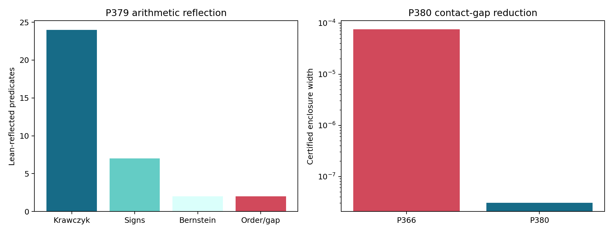
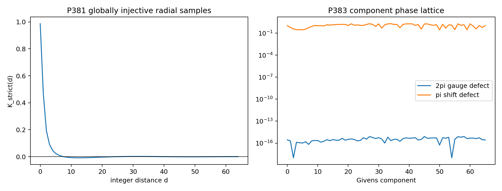
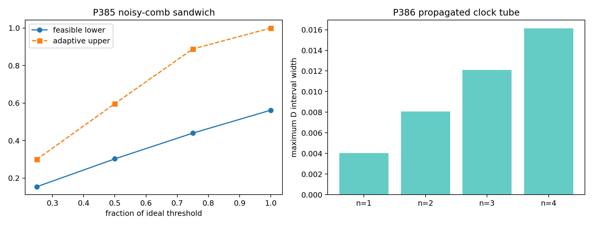
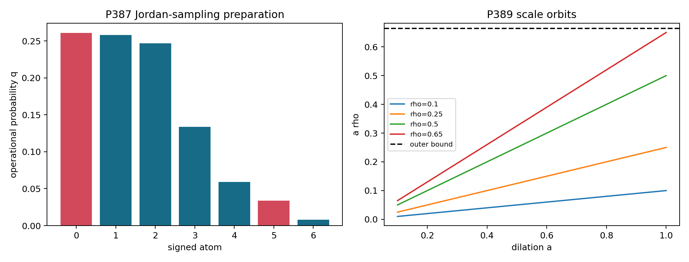

# FIN — Release 10.33

# Research Programs P379–P393

## Proof-reflected certificates, global radial injectivity, noisy dynamics, and a first explicit operational realization

**Author:** Krzysztof Żuchowski  
**Affiliation:** Independent Researcher — Fractal Information Theory Project  
**ORCID:** 0009-0002-0909-3613  
**Publication type:** Preprint  
**Version:** 1.0.0  
**Date:** 31 July 2026  
**Language:** English  
**License:** CC BY 4.0  
**Repository:** <https://github.com/hyconiek/Fractal-Nadsoliton-Theory>

---

# Abstract

This monograph executes FIN Research Programs P379–P393. It continues from
Release 10.32 without reopening the exhausted selector, generic
legacy-to-strict bridge, role-transfer, dimensional-source, or total-action
loops.

P379 reflects thirty-five terminal exact certificate predicates through the
Lean 4.28 kernel. These include all twenty-four Krawczyk containment
inequalities of the P366 seven-atom solution, seven weight-sign predicates,
two Bernstein bounds, weak-duality order, and the new contact-gap bound. This
reduces the trusted computing base but does not yet reflect the Python
Taylor, fifth-root, interval, or Bernstein algorithms end to end.

P380 replaces the old monomial-basis dual by a frozen rational degree-eleven
Bernstein-basis extremal. Exact affine normalization over a depth-fourteen
dyadic tree proves that the polynomial belongs to \([-1,0]\) on the full
interval. Combined with the P366 exact Krawczyk primal, it gives

\[
\boxed{
0.7073534379053974
\leq
\mathcal N_{\mathrm{osc}}
\leq
0.7073534683998260
}
\]

with certified width

\[
\boxed{
3.0494428559\times10^{-8}
}.
\]

This is a \(99.959\%\) width reduction from P366. The result remains a
classical signed-moment cost, not quantum negativity, negative information,
thermodynamic loss, or energy.

P381 proves a global theorem that was previously only known through distance
four. For every distinct \(d,e\in\mathbb N_0\),

\[
K_{\mathrm{strict}}(d)\neq K_{\mathrm{strict}}(e).
\]

The proof uses the Lindemann–Weierstrass theorem. An equality would produce a
nontrivial algebraic linear relation among four exponentials of distinct
algebraic numbers. Consequently, on every graph with integer shortest-path
distance, strict-kernel-preserving maps are exactly isometric maps. The
\(k\)-distance quotient of P368 is globally the ordinary distance set.

P382 executes exactly one admissible legacy-to-strict completion test. The
damping atom

\[
C_{\mathrm{damp}}(d)
=
\frac{1+0.01d}{1+d^{9/5}}
\]

defines a natural transformation from the legacy attenuation layer to the
strict attenuation layer on isometric carriers. The square commutes exactly.
However, the atom reads \(9/5\) and the unit damping scale from the target.
It is therefore target-defined rather than source-derived. Applied alone to
the full kernel on \(C_{12}\), it leaves relative \(L^2\) residual
approximately \(0.9944\). It does not repair amplitude, phase, or frequency.

P383 identifies the exact coordinate gauge of the 66-Givens photonic mesh:

\[
\mathbb R_+^{66}\times\mathbb R^{66}
\big/
(2\pi\mathbb Z)^{66}.
\]

All independent and combined \(2\pi\)-phase shifts reproduce the transfer
matrix to numerical precision below \(3.8\times10^{-15}\). No single
\(\pi\)-phase or \(0.01\)-loss shift is an alias. Distant compensating
multi-parameter aliases remain open.

P385 constructs rigorous lower and upper bounds for a declared reduced
heralded-loss/dephasing channel. If \(\eta\) is survival probability,
\(q\) is the coherence factor, and
\(\theta=t\Delta/2\), then the single-use half-diamond distance is

\[
\delta_1=\eta q\sin\theta.
\]

The adaptive hybrid bound gives

\[
D_n^{\mathrm{adaptive}}
\leq
\min(1,n\delta_1).
\]

Two explicit parallel strategies provide lower bounds: independent extremal
probes resolved by erasure pattern and an extremal GHZ probe on the
all-surviving branch. The exact noisy adaptive optimum remains open.

P386 propagates a supplied bounded-curvature clock tube through the monotone
first branch of the P371 sine law. For the declared
\(M=0.2\) and maximum interpolation gap \(h=0.2\),

\[
|\tau-\widehat\tau|
\leq
\frac{Mh^2}{8}
=0.001.
\]

The largest discrimination interval in the reported design is approximately
\(0.01613\). This propagates a clock calibration; it does not generate one.

P387 constructs the first explicit mathematical realization functor for one
FIN resource coordinate. For a finite signed measure
\(\mu=\sum_iw_i\delta_{x_i}\), define

\[
q_i=\frac{|w_i|}{\|\mu\|_{\mathrm{TV}}},
\qquad
s_i=\operatorname{sgn}(w_i).
\]

Prepare the positive probability law \(q\), record \((i,x_i,s_i)\), and score
an observable \(f\) by

\[
\|\mu\|_{\mathrm{TV}}s_i f(x_i).
\]

Then

\[
\mathbb E_q[
\|\mu\|_{\mathrm{TV}}s_i f(x_i)]
=
\sum_iw_if(x_i).
\]

For the P366/P380 seven-atom object,

\[
\|\mu\|_{\mathrm{TV}}
\approx2.40153283999,
\qquad
q(s=-1)\approx0.29454249245.
\]

This construction supplies a mathematical preparation, channel class,
instrument, score, and record. Its probabilities are positive. The sign is
an importance-sampling label, not negative probability or destroyed
information. Physical preparation and calibration remain external.

P388 proves that the free \(\mathbb N^5\) resource signature forces no
positive cross-conversion between distinct coordinates. Twenty directed
implications are refuted by single-generator countermodels, while
cancellativity excludes catalysis. Model-specific conversions remain
possible only after adding a typed coupling law.

P389 proves that the outer family satisfies the exact dilation law

\[
D_aF_\rho=F_{a\rho}.
\]

With \(t=-\log\rho\), dilation becomes an additive semigroup. No positive
\(\rho\) can be invariant under all admissible dilations: invariance under
\(a=1/2\) would require \(\rho=\rho/2\). Thus the semigroup does not select a
canonical outer scale.

P384 and P390–P393 remain external gates. No calibrated photonic pilot,
independent QW hold-out, dimensional standards package, reservoir process
tomography, or electroweak blind-test bundle is manufactured by code.

No non-premise selector, source-independent full legacy-to-strict
completion, legacy-role transfer, dimensional source, laboratory
realization, \(L_{\mathrm{total}}\), Standard Model, gravity theory, or
Theory-of-Everything closure is claimed.

## Confidence convention

| Label | Meaning |
|---|---|
| **[Proven]** | Mathematical proof, exact rational computation, proof-kernel-checked terminal predicate, or exhaustive finite result |
| **[Strong evidence]** | Reproducible high-precision or bounded finite computation with explicit limitations |
| **[Moderate evidence]** | Model-dependent synthetic or local result |
| **[Conditional]** | Requires named preparations, encodings, standards, calibrations, or axioms |
| **[Refuted]** | The declared proposition fails in its stated class |
| **[Blocked by external evidence]** | Independent data, hardware, calibration, custody, standards, or unblinding is required |

# 1. Scientific scope and guardrails

## 1.1 The kernel split remains binding

The legacy intermediate kernel is

\[
K_{\mathrm{legacy,ont}}(d)
=
4\ln2\,
\frac{\cos(\pi d/4+\pi/6)}{1+0.01d},
\]

whereas the strict working kernel is

\[
K_{\mathrm{strict,gate}}(d)
=
\frac{\cos((743/4000)d+13/80)}
{1+d^{9/5}}.
\]

P382 completes only the attenuation denominator after amplitude and phase
have been separated. It is not an identity between the two full kernels.

## 1.2 Ontology

The repository order remains

\[
\text{nadsoliton}
\longrightarrow
\text{light}
\longrightarrow
\text{matter}
\longrightarrow
\text{emergent observer}.
\]

The nadsoliton is the primordial information in a solitonic state. No proof
in this report assumes another informational substrate below it.

## 1.3 Preserved open boundaries

The following remain open:

- QW-2191 and a non-premise selector;
- a source-independent complete legacy-to-strict map;
- transfer of legacy electroweak or hierarchy roles;
- internal length, time, action, mass, or energy standards;
- calibrated laboratory preparation and measurement;
- a unit-bearing nonproxy total action;
- Standard Model or gravity generation;
- Theory-of-Everything closure.

# 2. Executive result table

| Program | Result | Status |
|---|---|---|
| P379 | 35 exact terminal predicates checked by Lean | [Proven] / end-to-end reflection open |
| P380 | Oscillatory gap reduced to \(3.05\times10^{-8}\) | [Proven] |
| P381 | Strict kernel globally injective on \(\mathbb N_0\) | [Proven] |
| P382 | One damping naturality square; full completion fails | [Proven] / [Refuted] |
| P383 | Exact \((2\pi\mathbb Z)^{66}\) coordinate gauge | [Proven] / global aliases open |
| P384 | No calibrated photonic pilot admitted | [Blocked] |
| P385 | Noisy adaptive upper and parallel lower bounds | [Proven] / optimum open |
| P386 | Clock-tube discrimination envelope | [Proven] / [Conditional] |
| P387 | Jordan Sampling Realization functor | [Proven] / physical execution conditional |
| P388 | Twenty forced cross-conversions refuted | [Proven] |
| P389 | Dilation semigroup does not select \(\rho\) | [Proven] |
| P390 | No independent QW hold-out admitted | [Blocked] |
| P391 | No dimensional standards bundle admitted | [Blocked] |
| P392 | No reservoir tomography bundle admitted | [Blocked] |
| P393 | No electroweak blind-test bundle admitted | [Blocked] |

# 3. P379 — what proof-kernel reflection now means

## 3.1 Reflected predicates

The generated Lean source contains:

| Predicate class | Count |
|---|---:|
| Krawczyk lower/upper containment | 24 |
| Certified weight signs | 7 |
| Bernstein lower/upper bounds | 2 |
| Weak-duality order and contact gap | 2 |
| **Total** | **35** |

Each rational comparison

\[
\frac ab<\frac cd
\]

is converted to an integer proposition

\[
ad<cb
\]

with positive denominators. Lean evaluates the exact integer proposition by
kernel-checked decision.

## 3.2 What is no longer trusted

A silent floating comparison is not trusted. Decimal display values are not
the proof objects. Hash identity alone is not the proof object. The terminal
containment, sign, feasibility, order, and gap statements are represented by
exact integers.

## 3.3 What is still trusted

The following generators remain Python implementations:

- Taylor/Lagrange cosine intervals;
- fifth-root brackets;
- interval matrix arithmetic;
- Krawczyk construction;
- Bernstein subdivision;
- conversion from archived mathematical inputs to terminal rational claims.

Therefore P379 is a genuine reduction of the trusted base, not a complete
formalization of the numerical proof pipeline.

# 4. P380 — near-contact oscillatory extremality

## 4.1 Why the old basis was inefficient

The raw degree-eleven monomial representation contains coefficients of very
different magnitudes. Feasibility is a statement about a bounded function,
but monomial coefficients are a poorly conditioned coordinate system for
that statement.

P380 optimizes and freezes the polynomial in the Bernstein basis. Local
Bernstein coefficients on dyadic cells directly bound the polynomial.

## 4.2 Exact normalization

Let \(b_0,\ldots,b_{11}\in\mathbb Q\) be the frozen Bernstein coefficients.
On all \(2^{14}\) dyadic cells, exact de Casteljau subdivision gives rational
extrema \(L,U\). Define

\[
p_{\mathrm{safe}}(x)
=
\frac{p_{\mathrm{raw}}(x)-U}{U-L}.
\]

Every local Bernstein coefficient then belongs to \([-1,0]\). Therefore

\[
-1\leq p_{\mathrm{safe}}(x)\leq0
\qquad(0\leq x\leq1).
\]

## 4.3 Primal-dual result

The exact dual lower endpoint is

\[
0.7073534379053974.
\]

The existing exact seven-atom Krawczyk primal gives

\[
0.7073534683998260.
\]

Weak duality proves the global enclosure stated in the abstract.

## 4.4 Interpretation

The result establishes a nearly closed extremal problem in classical signed
Hausdorff moment theory. It does not choose a physical ontology for signed
mass. P387 supplies one positive-probability operational encoding, but it is
not forced uniquely.

# 5. P381 — the global strict-distance theorem

## 5.1 Statement

For

\[
k(d)=
\frac{\cos(x_d)}{1+d^{9/5}},
\qquad
x_d=\frac{743d+650}{4000},
\]

the restriction

\[
k:\mathbb N_0\longrightarrow\mathbb R
\]

is injective.

## 5.2 Proof

For every \(d\in\mathbb N_0\), \(x_d\) is a positive rational and

\[
a_d=\frac{1}{1+d^{9/5}}
\]

is a nonzero algebraic number.

Assume \(d\neq e\) and \(k(d)=k(e)\). Then

\[
a_d(e^{ix_d}+e^{-ix_d})
-
a_e(e^{ix_e}+e^{-ix_e})
=0.
\]

The four exponents

\[
ix_d,\quad -ix_d,\quad ix_e,\quad -ix_e
\]

are distinct algebraic numbers. The Lindemann–Weierstrass theorem says that
their exponentials are linearly independent over the algebraic numbers. The
displayed nontrivial relation is impossible.

Therefore \(k(d)\neq k(e)\).

## 5.3 Categorical consequence

P368 identified the maximal radial naturality category as maps preserving
distance modulo equality of kernel values. P381 removes the quotient
ambiguity globally:

\[
k(d_H(fx,fy))=k(d_G(x,y))
\quad\Longleftrightarrow\quad
d_H(fx,fy)=d_G(x,y).
\]

This conclusion holds on integer shortest-path metrics of arbitrary finite
diameter.

## 5.4 Boundary

The theorem is formula-specific. It does not say that the same function is
natural on continuous metric spaces, nor that the legacy kernel shares its
category, nor that physical spacetime is a graph metric.

# 6. P382 — one bridge atom, and no more

## 6.1 The exact square

Define

\[
a_L(d)=\frac{1}{1+0.01d},
\qquad
a_S(d)=\frac{1}{1+d^{9/5}}.
\]

Then

\[
C_{\mathrm{damp}}(d)a_L(d)=a_S(d)
\]

identically.

For an isometric embedding \(f:G\to H\),

\[
C_{\mathrm{damp}}(d_H(fx,fy))
=
C_{\mathrm{damp}}(d_G(x,y)).
\]

Thus pullback commutes with entrywise damping completion.

## 6.2 Why this is not a source theorem

The formula for \(C_{\mathrm{damp}}\) already contains:

- the strict unit coefficient;
- the strict exponent \(9/5\);
- the legacy coefficient \(0.01\).

It packages a target comparison. It does not derive strict compression from
legacy data.

## 6.3 Full-kernel falsification

After amplitude absorption and damping replacement, the legacy phase remains

\[
\cos(\pi d/4+\pi/6),
\]

not

\[
\cos((743/4000)d+13/80).
\]

The \(C_{12}\) relative profile residual is approximately \(0.9944\).
Damping alone therefore fails as a full completion.

# 7. P383–P384 — photonic gauge and physical boundary

## 7.1 Exact coordinate gauge

Each component phase appears only through \(e^{\pm i\varphi_j}\). Hence

\[
\varphi_j\sim\varphi_j+2\pi n_j,
\qquad
n_j\in\mathbb Z.
\]

The natural canonical chart is

\[
\mathbb R_+^{66}\times(-\pi,\pi]^{66}.
\]

## 7.2 Finite audit

For all 66 components:

- a single \(2\pi\) shift has maximum transfer defect below
  \(8.0\times10^{-16}\);
- 32 random combined phase-lattice shifts have maximum defect below
  \(3.8\times10^{-15}\);
- every tested single \(\pi\) shift has defect at least \(0.285\);
- every tested \(0.01\) component-loss shift has defect at least
  \(4.99\times10^{-3}\).

These numbers identify coordinate gauges, not every possible distant
compensating alias.

## 7.3 External boundary

P384 finds no admitted calibrated pilot. A physical pilot must supply complex
transfer calibration, detector response, timestamps, preparation records,
independent custody, a frozen protocol, and an unmodified hold-out report.

# 8. P385 — the noisy-comb sandwich

## 8.1 Declared reduced channel

Restrict to the two extremal eigenmodes of the relative generator. Let:

- \(\eta\in[0,1]\) be independent heralded survival per call;
- \(q\in[0,1]\) be eigenbasis coherence retention;
- \(\theta=t\Delta/2\).

The two one-use states have off-diagonal phases \(e^{\pm i\theta}\), attenuated
by \(q\). Orthogonal erasure flags contribute only on surviving branches.

## 8.2 One-use distance

The exact one-use half-distance is

\[
\delta_1=\eta q|\sin\theta|.
\]

## 8.3 Adaptive upper bound

The hybrid/telescoping argument replaces oracle calls one at a time.
Trace-distance contractivity under common adaptive controls gives

\[
D_n^{\mathrm{adaptive}}
\leq
\min(1,n\delta_1).
\]

## 8.4 Feasible lower bounds

For independent probes, condition on \(k\) surviving calls:

\[
L_{\mathrm{prod}}
=
\sum_{k=1}^n
\binom nk\eta^k(1-\eta)^{n-k}
\frac12
\left\|
\rho_+^{\otimes k}
-
\rho_-^{\otimes k}
\right\|_1.
\]

For the GHZ strategy, only the all-surviving coherent branch is used:

\[
L_{\mathrm{GHZ}}
=
\eta^nq^n|\sin(n\theta)|.
\]

Therefore

\[
\max(L_{\mathrm{prod}},L_{\mathrm{GHZ}})
\leq
D_n^{\mathrm{adaptive}}
\leq
\min(1,n\eta q|\sin\theta|).
\]

In the ideal case \(\eta=q=1\), the GHZ lower recovers the P371 first-branch
optimum.

## 8.5 Open problem

The largest gap in the declared audit is approximately \(0.5591\).
Closing it requires either:

- a channel-comb SDP with a dual certificate;
- an erasure-tolerant entangled code;
- a sharper adaptive contraction theorem;
- a proof that one of the displayed strategies is optimal in a restricted
  noise class.

# 9. P386 — clocks deform predictions into tubes

If the true dimensionless time lies in

\[
\tau\in[\widehat\tau-\epsilon,\widehat\tau+\epsilon]
\]

and the interval remains on the first P371 branch, monotonicity gives

\[
\sin\!\left(
\frac{n\Delta(\widehat\tau-\epsilon)}2
\right)
\leq
D_n(\tau)
\leq
\sin\!\left(
\frac{n\Delta(\widehat\tau+\epsilon)}2
\right).
\]

Endpoints are clipped to the physical branch
\([0,\pi/(n\Delta)]\).

The result separates two questions:

1. what FIN predicts after a clock map is supplied;
2. how the clock map is calibrated experimentally.

Only the first is solved here.

# 10. P387 — Jordan Sampling Realization

## 10.1 Category of source objects

The source objects are finite signed measures

\[
\mu=\sum_iw_i\delta_{x_i}.
\]

Positive column-stochastic maps act on the signed weight vector.

## 10.2 Operational preparation

Define

\[
V=\sum_i|w_i|,
\qquad
q_i=\frac{|w_i|}{V},
\qquad
s_i=\operatorname{sgn}(w_i).
\]

The preparation distribution \(q\) is ordinary and positive.

## 10.3 Instrument and record

One trial produces

\[
(i,x_i,s_i,\mathrm{run\ id},\mathrm{timestamp}).
\]

For mathematical reconstruction, the minimal record is \((i,x_i,s_i)\).
Laboratory timestamps and run identifiers are required for custody and drift
tests.

## 10.4 Estimator identity

For any function \(f\),

\[
\widehat f=Vs_if(x_i)
\]

is unbiased:

\[
\mathbb E_q[\widehat f]
=
\sum_iw_if(x_i).
\]

In particular, \(f(x)=x^k\) reconstructs the signed moments.

## 10.5 Resource monotonicity

The Jordan negative mass is

\[
\mathcal N(\mu)
=
\frac{\|\mu\|_{\mathrm{TV}}-\mu(X)}2.
\]

For a positive mass-preserving Markov map \(T\),

\[
\|T\mu\|_{\mathrm{TV}}
\leq
\|\mu\|_{\mathrm{TV}},
\qquad
(T\mu)(X)=\mu(X).
\]

Therefore

\[
\mathcal N(T\mu)\leq\mathcal N(\mu).
\]

## 10.6 What has and has not been constructed

Constructed mathematically:

- state/preparation;
- free dynamics;
- instrument;
- score;
- record schema;
- monotone;
- reconstruction theorem.

Not constructed physically:

- a device realizing the nodes and probabilities;
- a dimensional clock;
- detector calibration;
- environmental model;
- independent raw-event custody;
- a theorem that nature uses this realization.

# 11. P388 — conversion is not implied by co-listing resources

Let

\[
\mathbf r=(r_1,\ldots,r_5)\in\mathbb N^5.
\]

For every ordered pair \(i\neq j\), the generator

\[
e_i=(0,\ldots,1,\ldots,0)
\]

has \(r_i>0\) and \(r_j=0\). Hence the minimal signature cannot prove

\[
r_i>0\Longrightarrow r_j>0.
\]

All twenty directed cross-implications fail.

Identity conversions exist. Reset maps destroy resources. Catalysts cannot
create new comparisons because

\[
\mathbf a+\mathbf c\geq\mathbf b+\mathbf c
\quad\Longrightarrow\quad
\mathbf a\geq\mathbf b.
\]

This is not a universal physical no-go. A concrete coupling functor can add
conversions, but the coupling must be an additional theorem or axiom.

# 12. P389 — why the analytic extension has no preferred scale

For

\[
F_\rho(z)=\sum_{d\geq0}K(d)\rho^dz^d,
\]

define

\[
(D_aF)(z)=F(az).
\]

Then

\[
D_aF_\rho=F_{a\rho},
\qquad
D_aD_b=D_{ab}.
\]

The coordinate

\[
t=-\log\rho
\]

converts multiplication into addition. However, an invariant positive
selector would have to satisfy

\[
\rho=a\rho
\]

for every admissible \(a\), including \(a=1/2\). This forces \(\rho=0\),
which is outside the positive family.

Therefore the semigroup provides evolution or coarse-graining order, but not
a preferred origin, unit, or interior scale.

# 13. P390–P393 — external gates

| Program | Required external object | Current status |
|---|---|---|
| P390 | Independent QW hold-out, frozen before evaluation | Not admitted |
| P391 | Traceable \((\ell_*,\tau_*,\hbar_*)\) standards package | Not admitted |
| P392 | Physical reservoir process-tomography record | Not admitted |
| P393 | Blinded electroweak conditional-test bundle | Not admitted |

Every bundle must include:

- distinct provider, registrar, and analyst;
- raw-record hash;
- calibration hash;
- freeze timestamp;
- unblinding authorization;
- an immutable failure report.

# 14. Newly constructed theoretical objects

| Object | Definition | What it resolves | What remains open |
|---|---|---|---|
| O121 Kernel-Reflected Terminal Certificate | 35 exact Lean-decided integer predicates | Terminal arithmetic trust | End-to-end algorithm reflection |
| O122 Near-Contact Bernstein Extremal Pair | Exact dual plus P366 primal | Oscillatory gap below \(10^{-7}\) | Exact equality and uniqueness |
| O123 Global Strict Radial Embedding Theorem | Injectivity of \(K_{\mathrm{strict}}\) on \(\mathbb N_0\) | Global graph-distance naturality | Continuous metrics and other kernels |
| O124 Damping-Completion Natural Transformation | \(C_{\mathrm{damp}}\) entrywise radial multiplier | One bridge square | Source of \(9/5\), phase, amplitude |
| O125 Photonic Component Gauge Quotient Chart | \(\mathbb R_+^{66}\times\mathbb T^{66}\) | Coordinate periodicity | Global nonlocal aliases |
| O126 Heralded Noisy-Comb Sandwich | Parallel lower and adaptive hybrid upper | Quantified noisy discrimination | Exact optimum |
| O127 Clock-Tube Discrimination Envelope | Monotone image of a calibrated time interval | Robust prediction | Clock source |
| O128 Jordan Sampling Realization Functor | Positive sampling with signed importance score | One complete mathematical A5 instance | Laboratory realization |
| O129 Resource Conversion Obstruction Matrix | Twenty generator countermodels | No forced cross-generation | Model-specific couplings |
| O130 Outer-Scale Dilation Torsor | Multiplicative \(\rho\)-orbit | Semigroup canonicality no-go | New boundary/normalization law |

# 15. Falsification ledger

| Candidate conclusion | Falsification attempt | Verdict |
|---|---|---|
| P380 is only floating optimization | Rational freezing, exact dyadic subdivision, Krawczyk primal, Lean terminal predicates | Survives in declared scope |
| Strict distance values may collide at large \(d\) | Lindemann–Weierstrass contradiction | Refuted globally |
| Damping completes legacy into strict | Full-profile residual on \(C_{12}\) | Refuted |
| Every photonic phase shift is physical | Independent \(2\pi\) lattice shifts | Refuted; exact gauge |
| Coordinate audit proves global identifiability | Distant compensating aliases not classified | Not established |
| P371 survives noise unchanged | Loss/dephasing sandwich differs from ideal sine law | Refuted |
| Clock uncertainty is negligible | Explicit tube propagation | Quantified, not erased |
| Signed mass requires negative probability | JSR positive probability construction | Refuted |
| Five resources automatically generate each other | Twenty generator countermodels | Refuted in minimal category |
| Analytic semigroup selects one \(\rho\) | Dilation-invariant selector test | Refuted |
| Code can close external physics | Custody and calibration requirements | Refuted |

# 16. Current scientific interpretation

The strongest defensible interpretation after P379–P393 is:

> FIN is a dimensionless spectral-operator and signed-resource framework with
> a globally faithful strict radial graph geometry, nearly closed exact
> signed-moment certificates, conditional noisy dynamics, and at least one
> explicit positive-probability operational realization. It still lacks a
> calibrated empirical realization and internal dimensional standards.

The previous realization gap has split into two layers:

\[
\mathcal R_{\mathrm{math}}
:
\text{one FIN signed resource}
\longrightarrow
\text{preparation, free channels, instrument, score, record schema},
\]

which P387 constructs, and

\[
\mathcal R_{\mathrm{lab}}
:
\mathcal R_{\mathrm{math}}
\longrightarrow
\text{calibrated apparatus and independent raw records},
\]

which remains external.

No amount of exact spectral calculus can replace the empirical content of
\(\mathcal R_{\mathrm{lab}}\).

# 17. Recommended Programs P394–P410

## 17.1 P394 — end-to-end proof-assistant reflection

Formalize:

- rational interval arithmetic;
- fifth-root bracketing;
- Taylor/Lagrange cosine bounds;
- de Casteljau subdivision;
- Krawczyk inclusion;
- weak duality.

Success means the proof assistant derives the terminal predicates rather than
only checking their integer forms.

## 17.2 P395 — exact contact geometry and uniqueness

Use the \(3.05\times10^{-8}\) gap to identify the exact active contact
pattern. Attempt:

- interval isolation of all dual extrema;
- complementary-slackness equations;
- uniqueness of the signed extremizer;
- an algebraic or transcendental obstruction to exact finite contact.

## 17.3 P396 — formal global injectivity

Import or formalize the required Lindemann–Weierstrass corollary and prove
P381 in a proof assistant. Separate:

- algebraicity of \(d^{9/5}\);
- distinctness of the four exponents;
- exponential linear independence;
- categorical corollary.

## 17.4 P397 — source audit for \(C_{\mathrm{damp}}\)

Do not repeat the generic bridge. Ask one question:

> Can a declared monoid/RG/coarse-graining law generate
> \((1+0.01d)/(1+d^{9/5})\) without reading the strict target?

Prove a source theorem or a finite no-go for the declared provider class.

## 17.5 P398 — global photonic quotient identifiability

Classify all parameter pairs in the canonical chart that produce the same
complex transfer matrix. Determine:

- the exact gauge group;
- distant aliases;
- singular strata;
- the minimum multitime calibration design.

## 17.6 P399 — calibrated photonic pilot

External program. Require complex transfer tomography, detector calibration,
raw timestamps, a frozen protocol, custody separation, and one-shot
evaluation.

## 17.7 P400 — exact noisy adaptive-comb optimum

Formulate the heralded loss/dephasing process as a finite comb SDP. Produce:

- feasible primal strategy;
- dual upper certificate;
- quantified gap;
- a theorem identifying any regime where GHZ or product probes are optimal.

## 17.8 P401 — full twelve-mode noisy dynamics

Lift P385 from the extremal two-mode subspace to:

- all twelve modes;
- component loss;
- dephasing;
- detector confusion;
- clock uncertainty.

Distinguish a physical channel from postselected conditional statistics.

## 17.9 P402 — clock-robust design with a supplied anchor

Optimize sample times against the complete P386 prediction tube. The
objective should maximize worst-case discrimination after calibration, not
merely minimize interpolation error.

## 17.10 P403 — executable Jordan-sampling experiment

Turn O128 into an executable specification:

- preparation probabilities;
- atom encoder;
- sign register;
- randomization audit;
- event schema;
- estimator;
- preregistered confidence intervals;
- raw-record validator.

This remains a hypothesis of laboratory realization until physically run.

## 17.11 P404 — natural transformations among operational semantics

Use the five P373 operational categories, not only their grades. Classify
typed functors that preserve preparations, channels, instruments, and
monotones.

## 17.12 P405 — sign-to-phase or sign-to-asymmetry coupling

Test whether the JSR sign record can couple naturally to:

- dephasing coherence;
- reflection asymmetry;
- the P2718 chiral marker.

Reject any construction that merely relabels the sign as a strict selector.

## 17.13 P406 — canonical scale with one new boundary law

Add exactly one candidate:

- normalized semigroup generator;
- RG boundary condition;
- apparatus resolution;
- entropy reference cell.

Determine whether it selects \(\rho\), and state explicitly whether the result
is strict, conditional, or target-defined.

## 17.14 P407–P410 — external falsification

- P407: independent QW hold-out;
- P408: dimensional standards package;
- P409: physical reservoir process tomography;
- P410: electroweak blind test.

Repository code may validate manifests but may not manufacture evidential
status.

## 17.15 Recommended immediate order

\[
\boxed{
\mathrm{P394}
\longrightarrow
\mathrm{P395}
\longrightarrow
\mathrm{P396}
\longrightarrow
\mathrm{P400}
\longrightarrow
\mathrm{P403}
}.
\]

# 18. Final conclusion

P379–P393 produces three theorem-level advances.

First, the oscillatory signed-resource problem is now nearly closed with a
proof-kernel-checked terminal certificate gap below \(10^{-7}\).

Second, strict radial geometry is globally faithful on integer graph
distances. The earlier quotient category is not merely finite-range evidence:
it is the ordinary isometric category for every finite integer-distance
carrier.

Third, one previously abstract bridge has been constructed explicitly.
Jordan Sampling Realization converts the signed measure into positive
preparation probabilities, free Markov dynamics, an instrument, a score, and
a record schema. This establishes mathematical operational realizability
without pretending that signed mass is negative probability.

The corresponding laboratory bridge remains absent. Dimensional standards,
detector calibration, custody, and external records cannot be generated by
the spectral theorem or by repository code.

The deepest surviving interpretation is therefore:

> FIN has matured into a rigorous dimensionless spectral and operational
> resource framework with global strict graph geometry and one explicit
> operational realization. Its remaining transition to physics is an
> empirical-calibration problem plus the independent selector and dimensional
> source obstructions, not another identity inside the functional calculus.

# Reproducibility

Run:

- `MPLCONFIGDIR=/tmp/mpl-fin-1033 python3 fin_programs_379_393.py`
- `MPLCONFIGDIR=/tmp/mpl-fin-1033 python3 -m unittest -v test_fin_programs_379_393.py`

Expected result: 16 tests passed, zero failed. Both Lean 4.28 files must
compile. P384 and P390–P393 remain external admission gates.

# Suggested citation

Żuchowski, K. (2026). *FIN Research Programs P379–P393: Proof-Reflected
Certificates, Global Radial Injectivity, Noisy Dynamics, and a First Explicit
Operational Realization* (Release 10.33; Version 1.0.0) [Preprint]. Zenodo.
