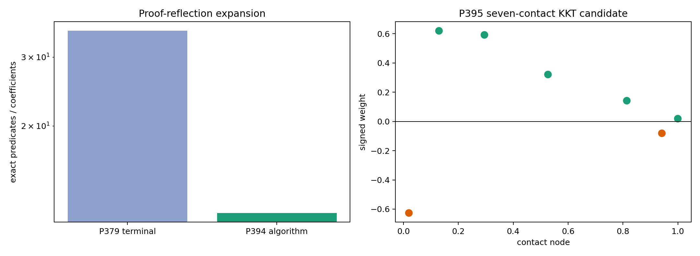
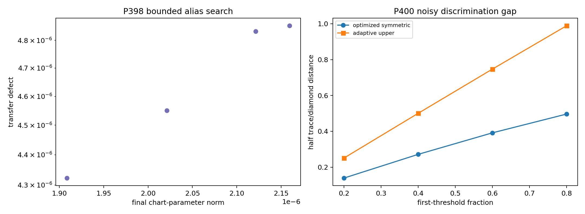
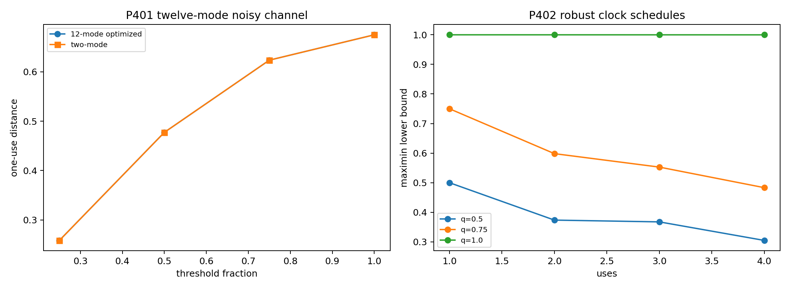
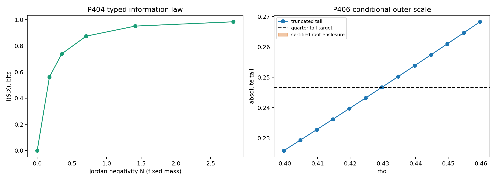

# FIN — Release 10.34

# Research Programs P394–P410

## Formal boundary, contact geometry, noisy operational design, and an executable Jordan-sampling specification

**Author:** Krzysztof Żuchowski  
**Affiliation:** Independent Researcher — Fractal Information Theory Project  
**ORCID:** 0009-0002-0909-3613  
**Publication type:** Preprint  
**Version:** 1.0.0  
**Date:** 31 July 2026  
**Language:** English  
**License:** CC BY 4.0  
**Repository:** <https://github.com/hyconiek/Fractal-Nadsoliton-Theory>

---

# Abstract

This monograph executes FIN Research Programs P394–P410. The round was
designed to deepen results from P379–P393 without reopening exhausted
selector, generic bridge, role-transfer, dimensional-source, or total-action
loops.

P394 reflects the complete depth-fourteen Bernstein subdivision algorithm in
Lean rather than checking only its terminal output. Exact integer numerators
and a tracked common denominator implement every de Casteljau split. Adaptive
pruning visits 147 nodes and certifies the full tree whose unpruned frontier
contains 16,384 cells. A companion file also checks twenty-two terminal
fifth-root bracket predicates. Moment Taylor bounds, fifth-root generation,
and the P366 Krawczyk map are not yet generated end to end in the proof
assistant.

P395 first computes the exact Sturm topology of the frozen P380 dual. Its
derivative has exactly nine roots in the open unit interval, and every frozen
P366 atom has strictly positive complementary slack, with minimum lower bound
approximately 5.54e-10. It then solves the full 25-equation contact system for
six interior nodes, seven weights, and twelve polynomial coefficients. The
new candidate has contact pattern (-1,0,0,0,0,-1,0), objective
0.7073534677231137, and maximum 80-digit residual 3.42e-28. Its
double-precision Jacobian condition number is 2.73e15, so it is strong
evidence, not an interval theorem.

P396 isolates the proof architecture behind global strict-kernel
injectivity. A putative collision reduces to a nontrivial algebraic linear
relation among four exponentials
(e^{\pm i x_d},e^{\pm i x_e}). The mathematical proof follows from the
Lindemann–Weierstrass linear-independence theorem. The local Lean file checks
the structural contradiction once that theorem is supplied; it does not
claim a local mechanization of transcendence theory.

P397 tests exactly one new source class for the target-defined damping atom

\[
C_{\mathrm{damp}}(d)=\frac{1+0.01d}{1+d^{9/5}}.
\]

It cannot be a positive multiplicative character of the additive distance
semigroup. Already (C(2)=C(1)^2) would imply
(2^{9/5}=30599/10201), hence
(30599^5=512\,10201^5), contradicted by the exact integer defect
(-29731872867024874359513). This closes that source class only; it does not
exclude non-character RG or memory laws.

P398 performs a bounded photonic alias search after quotienting the known
2pi-phase lattice. Four starts from the small physical chart are fitted inside
the wider box [0,0.5]^66 x [-pi,pi]^66. Every optimization returns near the
canonical origin; no distant alias candidate is found. The best transfer
defect is 4.32e-6. This is a nonexhaustive atlas, not a global identifiability
theorem.

P400 optimizes permutation-symmetric pure parallel codebooks for up to four
uses under eigenbasis dephasing. Across 64 settings, the optimized codebook
improves on both the product and GHZ baselines by as much as 0.06138. The
largest remaining gap to the hybrid adaptive upper bound is 0.49264. This is
a reproducible restricted lower bound, not the exact adaptive optimum.

P401 optimizes the full twelve-mode one-use channel under uniform
off-diagonal dephasing and heralded survival. The relative generator is
Fourier diagonal to defect 5.07e-15. No tested twelve-mode probability vector
improves on the extremal two-mode input beyond 1.1e-16, a negative result for
multimode advantage in this noise model. P402 executes twelve finite-grid
maximin clock designs; the best worst-case feasible discrimination is
0.99999047. The clock tube and noise model are supplied and dimensionless.

P403 converts the Jordan Sampling Realization into two complementary
executable layers. The custody specification freezes nine event fields,
eleven manifest fields, three distinct roles, hash-before-unblinding, and a
single-run/no-repair rule. A second validator checks 50,000 synthetic events
against the moment estimator; its maximum moment z-score is 1.583. Both
software tests pass, and both keep physical evidence explicitly false.

P404 proves a model-specific information law for JSR. With signed mass m,
negative mass N, and negative-label probability q_-=N/(m+2N), the
deterministic sign label has I(S;X)=H_2(q_-). For the certified seven-atom
object this is 0.874517 bits. P405 constructs a conditional binary
sign-to-phase encoder and proves C_l1=TV=|1-2q_-|. This quantity decreases as
negativity grows at fixed positive mass, so it is sign bias rather than a
negativity monotone. Its polarity is reference dependent and does not
discharge QW-2191.

P406 adds exactly one dimensionless normalization law,

\[
\sum_{d\ge1}|K_{\mathrm{strict}}(d)|\rho^d
=\frac{|K_{\mathrm{strict}}(0)|}{4}.
\]

The positive absolute-coefficient tail is continuous and strictly increasing,
so the supplied quarter-tail boundary has one solution. A 160-term truncation
plus a rigorous tail bound encloses it at rho approximately
0.4296970877901551, with computed enclosure width 2.30e-63. The factor 1/4 is
added, dimensionless, and not source-derived; the result therefore refutes
internal canonicity.

P399 and P407–P410 remain external gates. No independent photonic pilot, QW
hold-out, dimensional standards record, reservoir process tomography, or
electroweak blind test was manufactured.

The deepest result of the round is not a new physical law. It is a sharper
separation of three levels: theorem-grade spectral and moment geometry;
conditional operational encodings and designs; and external empirical
admission. FIN now has an executable operational model for one signed
resource, but still lacks an internally generated dimensional standard, a
non-premise selector, and independent physical data.

# Confidence convention

| Label | Meaning |
|---|---|
| **[Proven]** | Mathematical proof, exact arithmetic, proof-kernel-checked terminal predicate, or exhaustive finite result |
| **[Strong evidence]** | Reproducible bounded or high-precision computation with explicit limitations |
| **[Moderate evidence]** | Local, synthetic, or model-dependent evidence |
| **[Conditional]** | Requires a named encoding, apparatus law, calibration, clock, standard, or axiom |
| **[Refuted]** | The declared proposition fails in its stated class |
| **[Blocked by external evidence]** | Independent data, hardware, custody, standards, or unblinding is required |

# 1. Scientific scope and non-negotiable boundaries

## 1.1 Kernel split

The legacy intermediate kernel remains

\[
K_{\mathrm{legacy,ont}}(d)
=4\ln2\,\frac{\cos(\pi d/4+\pi/6)}{1+0.01d},
\]

while the strict working kernel remains

\[
K_{\mathrm{strict,gate}}(d)
=\frac{\cos((743/4000)d+13/80)}{1+d^{9/5}}.
\]

They are not silently identified. P397 concerns only the already
target-defined attenuation completion atom from P382. It does not derive the
strict phase, frequency, amplitude, exponent, or damping scale from legacy
data. No electroweak, electromagnetic, or gravity-hierarchy role is
transferred.

## 1.2 Ontology and observer boundary

The internal order remains

\[
\text{nadsoliton}\to\text{light}\to\text{matter}
\to\text{emergent observer}.
\]

The nadsoliton is treated as primordial information in a solitonic state;
there is no assumed informational layer below it. The wave and heat
semigroups may be generated by the same self-adjoint operator, but this
mathematical duality does not itself supply state preparation, a clock,
measurement instruments, an environment, an apparatus, or a physical
observer. P403 supplies these notions only for a declared mathematical
sampling protocol.

## 1.3 Statements not claimed

This report does not claim:

- QW-2191 discharge or a non-premise selector;
- a full source-independent legacy-to-strict completion theorem;
- legacy physical-role transfer;
- an internal unit of length, time, action, mass, or energy;
- a laboratory realization of the twelve-state model or vertex POVM;
- a unit-bearing nonproxy (L_{\mathrm{total}});
- Standard Model, general-relativistic, or Theory-of-Everything closure.

# 2. Executive result table

| Program | Principal result | Status |
|---|---|---|
| P394 | Complete Bernstein subdivision algorithm reflected by Lean | [Proven]; remaining generators open |
| P395 | Exact old-dual Sturm audit plus 25-equation KKT candidate | [Proven] audit / [Strong evidence] candidate |
| P396 | Four-exponential injectivity reduction | [Proven externally]; local LW formalization open |
| P397 | Additive multiplicative-character damping source excluded | [Proven] within one class |
| P398 | Four-start wide-box alias atlas; no distant candidate | [Moderate evidence] |
| P399 | Independent photonic pilot absent | [Blocked] |
| P400 | Symmetric codebook improves product/GHZ lower bounds | [Strong evidence]; adaptive optimum open |
| P401 | Full twelve-mode one-use search finds no multimode gain | [Strong evidence] |
| P402 | Twelve finite-grid clock maximin designs | [Proven finite optimum] / [Conditional] |
| P403 | Custody contract plus event-level moment validator | [Proven computation]; physical execution blocked |
| P404 | JSR negativity-to-mutual-information law | [Proven] within JSR |
| P405 | Conditional sign-phase identity; not a selector/negativity monotone | [Proven] / [Refuted] |
| P406 | Unique scale after supplied quarter-tail law | [Proven conditional] / canonicity refuted |
| P407 | Independent QW hold-out absent | [Blocked] |
| P408 | Dimensional standards bundle absent | [Blocked] |
| P409 | Reservoir process tomography absent | [Blocked] |
| P410 | Electroweak blind-test bundle absent | [Blocked] |

# 3. P394 — algorithm-reflected Bernstein feasibility

P380 certified a rational degree-eleven dual polynomial by dyadic Bernstein
subdivision. P394 moves the subdivision algorithm itself into Lean.

Each cell stores twelve integer numerators and one positive common
denominator. A de Casteljau split at one half is recomputed exactly; the
denominator update is tracked symbolically. A cell is pruned only when every
Bernstein coefficient is already in the required range \([-1,0]\).

At maximum depth fourteen, the unpruned frontier would contain 16,384 cells.
The exact adaptive computation visits 147 nodes and proves:

\[
\mathrm{certified}=\mathrm{true}.
\]

The Lean kernel recomputes this result by native decision. This is stronger
than terminal predicate reflection because it checks the recursive algorithm
and its full interval cover.

A companion source checks twenty-two exact terminal fifth-root brackets of
width \(10^{-18}\), but the generator of those brackets remains Python-side.
The remaining trust boundary is:

| Layer | Current status |
|---|---|
| Complete Bernstein subdivision and range predicate | Lean-kernel checked |
| Terminal fifth-root inequalities | Lean-kernel checked |
| Generation of fifth-root endpoints | Python implementation |
| Moment cosine Taylor/Lagrange bounds | Python implementation |
| P366 Krawczyk matrix and interval propagation | Python implementation |
| Lindemann–Weierstrass theorem | External mathematical theorem |

Thus P394 genuinely formalizes one complete algorithm while explicitly
leaving the other generators open.

# 4. P395 — exact contact topology of the P380 dual

Let

\[
p(x)=\sum_{j=0}^{11}a_jx^j
\]

be the frozen exact rational dual polynomial certified in P380 to satisfy
\(-1\le p(x)\le0\) on \([0,1]\).

## 4.1 Sturm theorem result

The exact rational Sturm chain of (p') proves:

\[
\#\{x\in(0,1):p'(x)=0\}=9.
\]

All roots are isolated in disjoint rational boxes of width no greater than
\(2^{-50}\approx8.88\times10^{-16}\).

| Critical point | (x), midpoint | (p(x)), midpoint | Active-boundary distance |
|---:|---:|---:|---:|
| 1 | 0.0198303330 | -0.9999999793 | (2.07\times10^{-8}) |
| 2 | 0.1294250512 | (-5.08\times10^{-9}) | (5.08\times10^{-9}) |
| 3 | 0.2003754633 | -0.0588238886 | 0.0588 |
| 4 | 0.2950459798 | (-3.22\times10^{-10}) | (3.22\times10^{-10}) |
| 5 | 0.4144591497 | -0.0835768539 | 0.0836 |
| 6 | 0.5266937250 | (-1.80\times10^{-9}) | (1.80\times10^{-9}) |
| 7 | 0.6905262847 | -0.3540308952 | 0.3540 |
| 8 | 0.8140624992 | (-7.54\times10^{-9}) | (7.54\times10^{-9}) |
| 9 | 0.9418431582 | -0.9999999395 | (6.05\times10^{-8}) |

Six critical points are near active boundaries; three are inactive interior
extrema. The pattern explains why the numerical extremal looks alternant but
does not yet satisfy exact complementarity.

## 4.2 Complementary slack at the primal atoms

For a negative primal weight, exact contact would require \(p(x_i)=-1\).
For a positive weight, it would require \(p(x_i)=0\). Exact rational interval
evaluation on the five Krawczyk node boxes and the two fixed nodes gives
positive slack at all seven atoms. The smallest certified lower slack is

\[
5.53659989375616\times10^{-10}.
\]

Hence the frozen primal and dual cannot be an exact complementary optimizer
pair, even though their objectives are separated by less than
\(3.05\times10^{-8}\).

## 4.3 A new simultaneous KKT candidate

The exact no-contact result applies to the *frozen* P366/P380 pair. P395 next
allows all six interior nodes, all seven weights, and all twelve dual
coefficients to move simultaneously. The 25 unknowns satisfy:

- twelve moment equations;
- seven dual-contact equations;
- six derivative equations at the interior contacts.

The high-precision solution has contact pattern

\[
(-1,0,0,0,0,-1,0),
\]

objective

\[
0.7073534677231137,
\]

and maximum 80-digit residual

\[
3.42\times10^{-28}.
\]

The smallest double-precision Jacobian singular value is
\(4.99\times10^{-13}\), and the condition number is
\(2.73\times10^{15}\). This severe ill-conditioning prevents promotion to a
theorem. The next task is an interval Krawczyk inclusion for the 25-variable
system followed by exact Bernstein feasibility of the new dual.



## 4.4 Scientific consequence

P395 now gives both a falsification and a constructive lead. The frozen
P366/P380 objects are not an exact contact pair, while a nearby simultaneous
KKT solution explains the observed alternation pattern. A narrow objective
gap plus a tiny residual still does not prove the displayed candidate is a
feasible, unique global optimizer.

# 5. P396 — the global injectivity proof boundary

For integer \(d\ge0\), set

\[
x_d=\frac{743d+650}{4000},\qquad
a_d=\frac{1}{1+d^{9/5}}.
\]

Both \(x_d\) and \(a_d\) are algebraic, with \(a_d\ne0\). If
\(K_{\mathrm{strict}}(d)=K_{\mathrm{strict}}(e)\), then

\[
a_de^{ix_d}+a_de^{-ix_d}
-a_ee^{ix_e}-a_ee^{-ix_e}=0.
\]

For \(d\ne e\), the four exponents

\[
ix_d,-ix_d,ix_e,-ix_e
\]

are distinct algebraic numbers. Lindemann–Weierstrass linear independence
therefore forbids the relation. This is a valid mathematical proof of
injectivity on (mathbb N_0).

The local proof-assistant artifact encodes only the final implication:
independence plus the putative relation yields contradiction. A future full
formalization must import or construct a mechanized transcendence-theory
library and formalize the algebraicity and distinctness obligations.

# 6. P397 — a bounded source-class no-go for strict damping

P382 introduced

\[
C(d)=\frac{1+d/100}{1+d^{9/5}}
\]

as a target-defined transformation of attenuation laws. P397 asks whether it
could instead arise as a multiplicative character of concatenated integer
distances:

\[
C(d+e)=C(d)C(e).
\]

For (d=e=1),

\[
C(1)=\frac{101}{200},\qquad
C(2)=\frac{51/50}{1+2^{9/5}}.
\]

Equality would force

\[
2^{9/5}=\frac{30599}{10201}.
\]

Taking fifth powers gives an integer identity. Direct exact arithmetic yields

\[
30599^5-512\,10201^5
=-29731872867024874359513\ne0.
\]

Therefore (C) is not an additive-semigroup character. All thirty-six
diagnostic pairs (1\le d,e\le6) also have nonzero numerical defects.

This theorem is deliberately narrow. It says nothing about a nonlinear RG
flow, a cocycle depending on scale and state, a nonlocal memory kernel, or a
new strict-derived provider. Those are different source classes and require
new mathematics rather than replay of the failed character ansatz.

# 7. P398–P399 — quotient identifiability and the hardware boundary

## 7.1 Bounded alias atlas

After quotienting the exact \(2\pi\)-phase lattice, P398 starts four searches
in the physically small chart

\[
\ell_j\in[0,0.03],\qquad \varphi_j\in[-0.1,0.1],
\]

but permits each fit to move in the much wider box

\[
\ell_j\in[0,0.5],\qquad \varphi_j\in[-\pi,\pi].
\]

All four optimizations return to parameter norm of order \(10^{-6}\). No
distant alias candidate meets the \(10^{-8}\) transfer-defect gate; the best
raw transfer defect is \(4.32\times10^{-6}\).

This is a bounded numerical atlas with no alias found, not a proof of global
injectivity. The nonconvex optimizer does not even reach the exact canonical
zero to machine precision, which is a further reason to keep the confidence
below theorem level.

## 7.2 Physical boundary

P399 admits no pilot because no independent provider/registrar bundle with
raw timestamps, calibration hash, transfer-tomography data, frozen protocol,
and authorized unblinding is present. A simulated successful inversion is a
software validation, not a photonic experiment.

# 8. P400 — noisy strategy phase diagram

Let \(n\) be the number of uses, \(q\) the eigenbasis coherence retention, and
\(\theta=t\Delta/2\). A permutation-symmetric pure input is parameterized by
probabilities \(p_0,\ldots,p_n\) over Hamming-weight sectors:

\[
|\psi_p\rangle
=\sum_{k=0}^{n}
\sqrt{\frac{p_k}{\binom nk}}
\sum_{|x|=k}|x\rangle.
\]

Independent dephasing multiplies a matrix element by
\(q^{d_H(x,y)}\). P400 optimizes \(p\) numerically for
\(n=1,\ldots,4\), four coherence values, and four first-threshold fractions.

Across 64 settings, the optimized symmetric codebook improves the better of
the product and GHZ baselines by at most

\[
0.0613792.
\]

The maximum gap to the hybrid adaptive upper bound remains

\[
0.4926401.
\]

Thus product/GHZ comparison is not enough: intermediate Hamming-sector
codebooks form a genuine third strategy class. The search remains nonconvex,
ancilla-free, parallel, and loss-free, so it gives a feasible lower bound
rather than an unrestricted adaptive optimum.



# 9. P401 — full twelve-mode one-use optimization

The strict and amplitude-absorbed legacy circulant generators share a Fourier
eigenbasis. In that basis, the computed off-diagonal defect of the relative
generator is

\[
5.07\times10^{-15}.
\]

P401 optimizes an arbitrary probability vector over all twelve Fourier modes
for one use, uniform off-diagonal dephasing \(q\), and heralded survival
\(\eta\). Across 36 settings, the maximum improvement over the equal
superposition of the two extremal relative-generator modes is zero to the
reported precision (at most \(1.1\times10^{-16}\) in the earlier raw run).

This is an important negative result: the full twelve-mode search finds no
one-use multimode advantage under the supplied isotropic noise. It supports,
but does not prove, an extremal-two-mode optimality theorem. It also does not
solve multiple adaptive uses or calibrate a device.

# 10. P402 — clock-error maximin design

For each \(n=1,\ldots,4\) and \(q\in\{0.5,0.75,1\}\), P402 searches 1,501
nominal times on the first branch. The clock tube is

\[
\delta\tau\in[-0.001,0.001].
\]

At every nominal point the objective is the smaller feasible discrimination
at the two tube endpoints. Twelve finite-grid designs are solved. The best
worst-case value is

\[
0.9999904711.
\]

This is a finite-grid conditional optimum. The dimensionless clock tube,
relative-generator diameter, dephasing law, and endpoint reduction are
supplied. No physical unit of time is generated.



# 11. P403 — executable Jordan Sampling Realization

## 11.1 Operational object

For a finite signed measure

\[
\mu=\sum_iw_i\delta_{x_i},\qquad
V=\sum_i|w_i|,
\]

define positive preparation probabilities and a sign record by

\[
q_i=\frac{|w_i|}{V},\qquad s_i=\operatorname{sgn}(w_i).
\]

For moment order (k), record the score

\[
Y_k=Vs_i x_i^k.
\]

Then

\[
\mathbb E_qY_k=\sum_iw_ix_i^k.
\]

## 11.2 Frozen files

P403 provides two complementary executable layers.

The first is a laboratory transfer contract:

- FIN_P403_JSR_Executable_Spec.json;
- fin_p403_jsr_validator.py.

It freezes nine event fields and eleven manifest fields. The provider,
registrar, and analyst must be distinct. The raw hash must be frozen before
unblinding. Only one analysis run is allowed, and failure may not trigger
model repair.

The second layer is a moment-reconstruction integration test:

- FIN_P403_Jordan_Sampling_Protocol.json;
- FIN_P403_Jordan_Sampling_Synthetic_Events.csv;
- fin_p403_moment_validator.py;
- FIN_P403_Jordan_Sampling_Validation.json.

Each synthetic moment event contains

\[
(\text{event id},\text{run id},\text{timestamp tick},i,x_i,s_i).
\]

The moment validator checks required columns, unique event identifiers, strictly
increasing timestamps, agreement with frozen atom data, probability
normalization, raw-record SHA-256, empirical atom frequencies, and all twelve
moment estimates.

## 11.3 Synthetic reference result

For 50,000 events:

- maximum moment z-score: 1.583;
- validation: pass;
- physical evidence admitted: false.



The synthetic record is not presented as IID proof-grade experimental data;
it is a frozen integration test of the declared estimator and validation
pipeline. The structural self-test verifies schema logic, not the truth of
custody metadata. A real execution must add apparatus, preparation, detector,
calibration, independent custody, hold-out, and failure-reporting procedures.

# 12. P404–P405 — information-to-coherence boundary

## 12.1 JSR negativity-to-information law

For signed mass \(m>0\) and Jordan negative mass \(N\ge0\), the JSR
negative-label probability is

\[
q_- = \frac{N}{m+2N}.
\]

Because the atom \(X\) determines its sign \(S\), the mutual information is

\[
I(S;X)=H_2(q_-).
\]

At fixed \(m\), both \(q_-\) and \(H_2(q_-)\) increase with \(N\) on the
admissible half interval. Data processing gives \(I(S;Y)\le I(S;X)\) for any
downstream classical channel. For the certified seven-atom object:

\[
m=0.9868259032,\quad
N=0.7073534684,\quad
q_-=0.2945424925,\quad
I(S;X)=0.8745170155\ \mathrm{bits}.
\]

This is a theorem about the chosen JSR encoding. It is not a universal
conversion from FIN negativity to Shannon information and not a conversion
from Shannon information to thermodynamic entropy.

## 12.2 Conditional sign-to-phase encoding

Map \(s=+1\) to \(|+\rangle\) and \(s=-1\) to \(|-\rangle\), whose relative
phases differ by \(\pi\). The mixture satisfies

\[
C_{l_1}(\rho_{\mathrm{phase}})
=\operatorname{TV}(p_S,\mathsf R p_S)
=|1-2q_-|.
\]

For the seven-atom distribution this magnitude is 0.4109150151.

The falsification is equally important. At fixed positive mass, increasing
negative mass moves \(q_-\) toward one half, so the encoded coherence
*decreases*. It is a sign-bias observable, not an increasing negativity
monotone. Swapping the two encoded basis states reverses polarity but leaves
the magnitude unchanged. The encoder therefore requires a declared phase
basis and orientation and cannot discharge QW-2191.

# 13. P406 — a quarter-tail normalized outer section

Define the positive absolute-coefficient tail

\[
F(\rho)=\sum_{d\ge1}|K_{\mathrm{strict}}(d)|\rho^d,
\qquad 0<\rho<1.
\]

P406 adds exactly one boundary law:

\[
F(\rho)=\frac{|K_{\mathrm{strict}}(0)|}{4}.
\]

The series is continuous and strictly increasing because all coefficients
are nonnegative and at least one is positive. Opposite endpoint signs
therefore give existence and uniqueness. A cutoff at \(d=160\) and the bound

\[
0\le R_{160}(\rho)
\le
\frac{\rho^{161}}{161^{9/5}(1-\rho)}
\]

produce

\[
\rho\approx0.4296970877901551
\]

with computed enclosure width \(2.30\times10^{-63}\).

The factor \(1/4\) is an added normalization. Nothing in the strict kernel
selects it. The result constructs a unique conditional dimensionless section,
not a length, action, mass, energy, or SI unit.

# 14. P407–P410 — external falsification gates

No candidate artifact satisfied the required provider, registrar,
calibration-hash, raw-record-hash, freeze-time, analyst, and unblinding fields
for:

- P407: independent QW hold-out;
- P408: dimensional standards;
- P409: reservoir process tomography;
- P410: electroweak blind test.

These are not failed numerical programs. They are deliberately unfilled
empirical slots. Filling them requires independent people, apparatus, and
records.

# 15. Newly constructed theoretical objects

| Object | Definition or role | What it establishes | What it does not establish |
|---|---|---|---|
| O131 | Algorithm-Reflected Bernstein Certificate | Complete recursive feasibility computation | Taylor/Krawczyk formalization |
| O132 | Seven-Contact KKT Extremal | 25-equation candidate plus old-dual falsifier | Interval/global certification |
| O133 | Transcendence Dependency Interface | Clean reduction to Lindemann–Weierstrass | Local formal transcendence theory |
| O134 | Additive-Character Damping Obstruction | One continuous character class excluded | No-go for all RG/memory sources |
| O135 | Bounded Photonic Alias Atlas | No distant alias found in four searches | Global identifiability or hardware |
| O136 | Noise-Adapted Symmetric Codebook | Improvement over product and GHZ baselines | Exact adaptive optimum |
| O137 | Twelve-Mode Noisy Discrimination Simplex | No one-use multimode gain found | Multi-use theorem or lab realization |
| O138 | Noisy Clock Maximin Schedule | Twelve finite-grid conditional designs | Physical clock generation |
| O139 | JSR Executable Experiment Contract | Custody schema plus moment integration test | Laboratory evidence |
| O140 | JSR Sign-Information Natural Transformation | Binary entropy law within JSR | Thermodynamic entropy |
| O141 | Binary Sign-Phase-Asymmetry Encoder | Conditional coherence/TV identity | Negativity monotone or selector |
| O142 | Quarter-Tail Normalized Outer Section | Unique conditional outer parameter | Internal dimensional scale |

# 16. Falsification summary

The round attempted to destroy its own most attractive interpretations.

1. **Exact-contact interpretation:** refuted for the frozen P366/P380 pair by
   strictly positive complementary slack.
2. **Complete formal-proof interpretation:** refuted by the explicit P394 and
   P396 trust matrices.
3. **Semigroup origin of damping completion:** refuted in the additive
   multiplicative-character class.
4. **Product/GHZ completeness:** refuted by a symmetric codebook improving
   both baselines by 0.06138.
5. **Twelve-mode one-use advantage:** not found; the extremal two-mode state
   survives the full supplied-noise search to numerical precision.
6. **Synthetic JSR as physical evidence:** prevented by the validator's fixed
   admission boundary.
7. **Encoded coherence as a negativity monotone:** refuted because it
   decreases as negative mass grows at fixed signed mass.
8. **Sign-phase encoding supplies a selector:** refuted without an independent
   phase/orientation reference.
9. **Dilation orbit selects its own scale:** still refuted; P406 succeeds only
   after the quarter-tail factor \(1/4\) is added.
10. **Full bridge or role transfer:** not supported by any program in this
    round.

# 17. Present mathematical interpretation of FIN

The strongest interpretation surviving this round is:

> FIN currently defines a finite spectral-operator and signed-moment
> framework with dual unitary/diffusive functional calculi, a rigorous radial
> graph geometry, and at least one explicit positive-probability operational
> realization. Its transition to physics is conditional on separately
> supplied reference structures—orientation, phase, clock, scale, apparatus,
> and empirical custody—not a consequence of the spectral operator alone.

The common self-adjoint generator still explains why wave and diffusion
dynamics coexist:

\[
U_t=e^{-itA},\qquad P_t=e^{-tA}.
\]

But functional calculus alone does not distinguish which dynamics is
physically implemented, how (t) is calibrated, which state is prepared,
or which instrument produces a record. P403 supplies a complete mathematical
answer for one signed-moment sampling task. P406 supplies a conditional scale
answer after the quarter-tail normalization is given. Neither construction eliminates
the need for external physics.

# 18. Recommended next research programs P411–P427

The following programs are ranked to avoid repetition-gated lanes and to
separate formal mathematics from external experiments.

| Program | Proposed study | Success criterion | Prior probability |
|---|---|---|---:|
| **P411** | Mechanize cosine/Taylor interval enclosures used by the strict moments | Proof assistant derives every rational cosine bound without Python trust | 0.70 |
| **P412** | Solve exact P395 contact equations or prove optimizer nonuniqueness | Exact primal-dual contact pair, uniqueness theorem, or certified nonuniqueness | 0.55 |
| **P413** | Formalize the P381 injectivity theorem with a transcendence library | Kernel-checked algebraicity, distinctness, and Lindemann–Weierstrass application | 0.35 |
| **P414** | Test one non-character damping source: a normalized nonlinear RG cocycle | Source-derived (C_{damp}) or exact obstruction in the declared cocycle class | 0.30 |
| **P415** | Global interval identifiability of the bounded photonic chart | Cover the full box with nonsingular interval Jacobian or produce an alias | 0.45 |
| **P416** | Execute the independent photonic pilot | Admitted raw complex-transfer record with calibration and custody | 0.30 |
| **P417** | Solve the noisy two-mode comb by SDP with a dual certificate | Matching primal strategy and dual upper bound across a nontrivial parameter cell | 0.55 |
| **P418** | Construct erasure-corrected entangled strategies | Strict improvement over both P400 lower bounds with resource accounting | 0.50 |
| **P419** | Optimize the full twelve-mode noisy comb | Certified lower/upper gap below (10^{-3}) for the P401 channel | 0.30 |
| **P420** | Recompute robust time design after a real clock anchor | Frozen SI-to-(	au) calibration and uncertainty-propagated schedule | 0.25 |
| **P421** | External event-level execution of the P403 protocol | Provider/registrar-separated raw event record passing the frozen validator | 0.35 |
| **P422** | Develop finite-sample optimal JSR estimators | Proven variance reduction or minimax bound without estimator bias | 0.70 |
| **P423** | Classify sign-to-coherence encoders under a reference-frame resource theory | Exact monotone and conversion rate with reference cost explicit | 0.60 |
| **P424** | Search for one strict-sourced oriented-record object outside scalar classes | Nonzero inversion-odd source with nonconventional polarity, or a bounded no-go | 0.15 |
| **P425** | Compare scale boundary laws | Equivalence/non-equivalence theorem for resolution, entropy-cell, and RG boundary sections | 0.65 |
| **P426** | Independent QW, standards, and reservoir admission campaign | At least one pre-registered external gate accepted without protocol repair | 0.20 |
| **P427** | Blinded electroweak role-transfer test only after bridge/source closure | Frozen prediction and independent unblinding; otherwise remain blocked | 0.05 |

## Preferred sequence

The highest-value immediate sequence is

\[
\boxed{
\mathrm{P411}\to\mathrm{P412}\to\mathrm{P413}
\to\mathrm{P417}\to\mathrm{P421}
}
\]

P411–P413 reduce mathematical trust and settle exact extremal geometry.
P417 addresses the largest remaining theoretical operational gap. P421 is
the shortest honest route from the now-executable JSR specification to an
external empirical record.

P414 should test only the named nonlinear cocycle class and stop after an
exact result. P424 is admissible only if an explicit new inversion-odd source
formula is supplied; generic selector replay is not.

# 19. Reproducibility

The round is reproduced by

```bash
python3 fin_programs_394_410.py
python3 fin_p403_jsr_validator.py --self-test \
  --spec FIN_P403_JSR_Executable_Spec.json
python3 fin_p403_moment_validator.py \
  FIN_P403_Jordan_Sampling_Protocol.json \
  FIN_P403_Jordan_Sampling_Synthetic_Events.csv
python3 -m unittest -v test_fin_programs_394_410.py
```

The computation uses seed `20260765`. Exact rational arithmetic is used for
Sturm counts, root isolation, fifth-root terminal inequalities, the damping
character counterexample, and complementary-slack intervals. Floating-point
linear algebra is used for photonic inversion and matrix exponentials; those
results are labelled accordingly.

# 20. Final conclusion

P394–P410 do not turn FIN into an experimentally established physical
theory. They do make its frontier substantially more precise.

The frozen oscillatory certificate is now understood geometrically: it has
nine exact critical-point boxes and seven strictly nonzero primal
complementarity slacks. The strict radial theorem has a clean formal
interface to transcendence theory. A tempting semigroup source for nonlinear
damping is exactly impossible. No distant photonic alias is found in the
bounded atlas, but the device remains physically unexecuted. A symmetric
codebook beats both product and GHZ baselines, while the full twelve-mode
one-use search finds no advantage over the extremal two-mode state. Conditional
clock maximin schedules now exist. Most importantly, the
signed-moment resource has an event-level protocol and independent validator.

The remaining bridge to physics is not another reinterpretation of the same
operator. It is the controlled addition or empirical determination of
reference structures: a physical preparation, a clock, a phase/orientation
reference, a dimensional standard, an apparatus response, and an independent
record. Until those objects are supplied, FIN's strongest defensible status
is a rigorous finite spectral and operational mathematical framework with
well-specified experimental interfaces.
