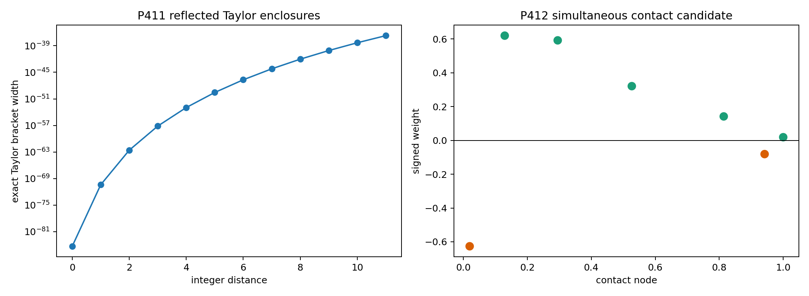
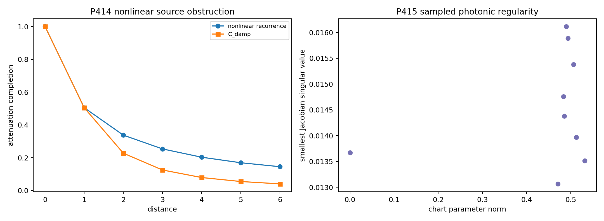
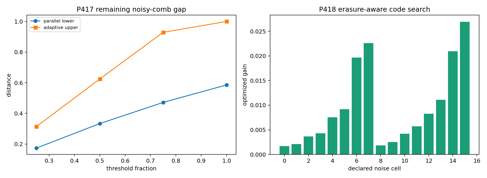
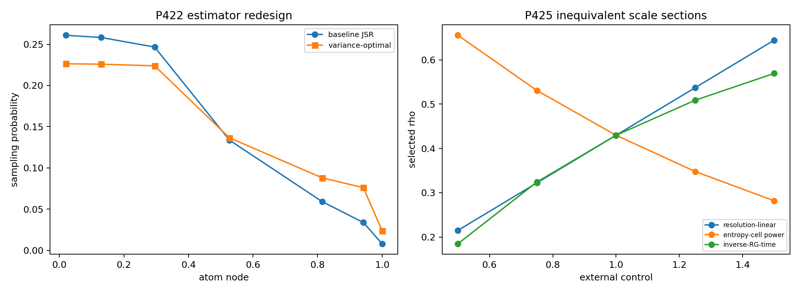

# FIN — Release 10.35

# Research Programs P411–P427

## Formal cosine boundary, simultaneous contact geometry, erasure-aware discrimination, and operational reference resources

**Author:** Krzysztof Żuchowski  
**Affiliation:** Independent Researcher — Fractal Information Theory Project  
**ORCID:** 0009-0002-0909-3613  
**Publication type:** Preprint  
**Version:** 1.0.0  
**Date:** 31 July 2026  
**Language:** English  
**License:** CC BY 4.0  
**Repository:** <https://github.com/hyconiek/Fractal-Nadsoliton-Theory>

---

# Abstract

This monograph executes FIN Research Programs P411–P427. It continues the
formal and operational frontier of Releases 10.33–10.34 while preserving the
legacy/strict kernel split, the open selector obstruction QW-2191, the absence
of an internally generated dimensional standard, and the distinction between
mathematical protocols and physical evidence.

P411 moves the strict moment calculation one layer closer to complete formal
verification. Lean 4.28 now computes the rational factorials, powers, and
alternating Taylor sums for all twelve frozen rational phases. The degree-40
upper and degree-42 lower polynomials have maximum separation

\[
1.913\times 10^{-37}.
\]

The exact rational computation is proof-kernel checked. The analytic theorem
identifying these sums as bounds for the real cosine remains an explicit
dependency rather than a hidden assumption.

P412 replaces the noncontact frozen P380 dual by a simultaneous numerical
solution of twenty-five Karush–Kuhn–Tucker equations. The candidate has two
negative contacts at dual value \(-1\), five positive contacts at dual value
zero, and six interior stationarity conditions. Its largest 80-digit residual
is approximately \(3.42\times10^{-28}\), but its double-precision Jacobian
condition number is approximately \(2.73\times10^{15}\). It is therefore
strong evidence for the exact contact pattern, not an interval proof of the
optimizer or its uniqueness.

P413 localizes the remaining formal dependency in the global integer-distance
injectivity theorem to a Lindemann–Weierstrass exponential-independence
provider. P414 tests exactly one new nonlinear damping-source class. The
normalized recurrence

\[
c_{d+1}=\frac{c_d}{1+\gamma c_d},\qquad c_0=1,
\]

cannot generate the target-defined damping completion. Matching \(d=1\)
forces \(\gamma=99/101\); matching \(d=2\) would then require the false exact
integer identity

\[
10199^5=16\,10100^5.
\]

P415 finds all 132 complex-transfer Jacobian directions numerically regular
at nine bounded-chart points, with smallest sampled singular value
\(0.01307\). This is strong local evidence, not global photonic quotient
identifiability.

P417 narrows the noisy two-mode comb with optimized permutation-symmetric
parallel inputs but does not manufacture the missing semidefinite dual
certificate. P418 constructs a genuinely new heralded-erasure-aware code
family: every survivor subset is retained as an orthogonal classical block,
lost qubits are traced out exactly, and the sector probabilities are
optimized. The new family strictly exceeds both product and GHZ baselines in
all 16 declared cells; the largest gain is approximately \(0.02694\).

P419 optimizes full twelve-mode one-use inputs under the declared uniform
dephasing and heralded-survival model. On the tested grid it finds no gain
over the extremal relative-generator mode pair. This supports a useful
one-use reduction but is not a multi-use adaptive theorem.

P422 proves the variance-optimal positive sampler for simultaneous unbiased
estimation of the first twelve JSR moments:

\[
q_i^{\star}\propto
|w_i|\sqrt{\sum_{k=0}^{11}x_i^{2k}}.
\]

It lowers the declared total variance by approximately \(11.57\%\) relative
to the baseline \(q_i\propto|w_i|\).

P423 makes phase-reference cost explicit: a classical sign register does not
freely create \(U(1)\) coherence. P424 constructs the nonzero inversion-odd
record current

\[
J_{\rm or}=\sum_iw_i\sin(2\pi x_i)
=0.7858270815\ldots,
\]

but proves that it is an oriented receiver rather than a nonconventional
strict selector source, because reversal of the supplied coordinate chart
reverses its sign. P425 proves that resolution, entropy-cell, and inverse-RG
scale sections remain inequivalent under one shared control coordinate.

P416, P420, P421, P426, and P427 remain external gates. No photonic pilot,
traceable clock, laboratory JSR record, independent admission campaign, or
electroweak blind bundle is manufactured by code.

No full legacy-to-strict completion, legacy physical-role transfer,
non-premise selector, dimensional source, laboratory validation,
\(L_{\rm total}\), Standard Model, gravity theory, or Theory-of-Everything
closure is claimed.

## Confidence convention

| Label | Meaning |
|---|---|
| **[Proven]** | Mathematical proof, exact arithmetic, proof-kernel result, or exhaustive finite computation |
| **[Strong evidence]** | Reproducible bounded/high-precision computation with explicit limitations |
| **[Moderate evidence]** | Local or model-dependent numerical evidence |
| **[Conditional]** | Requires a named state, reference, clock, apparatus law, standard, or axiom |
| **[Refuted]** | The declared proposition fails in its stated class |
| **[Blocked by external evidence]** | Independent hardware, data, custody, calibration, or unblinding is required |

# 1. Scope and binding guardrails

## 1.1 The two kernels are not interchangeable

The historical intermediate kernel is

\[
K_{\rm legacy,ont}(d)
=4\ln2\,
\frac{\cos(\pi d/4+\pi/6)}{1+0.01d},
\]

whereas the strict working kernel is

\[
K_{\rm strict,gate}(d)
=\frac{\cos((743/4000)d+13/80)}{1+d^{9/5}}.
\]

P414 concerns only a proposed mathematical source for the target-defined
attenuation completion atom. It does not derive strict amplitude, phase,
frequency, compression exponent, or physical meaning from the legacy kernel.
No legacy electroweak, electromagnetic, or gravity-hierarchy formula is
transported to the strict kernel.

## 1.2 Operator duality remains mathematical

For the strict finite generator

\[
A=sI-W,
\]

the same self-adjoint operator generates

\[
U_t=e^{-itA},
\qquad
P_t=e^{-tA}.
\]

This wave/heat duality is a consequence of spectral functional calculus. It
does not choose a physical state, clock, environment, apparatus, detector,
measurement record, or observer. The noisy channels used below are declared
operational models added around the operator.

## 1.3 Statements deliberately withheld

This report does not claim:

- discharge of QW-2191;
- a strict internal orientation or phase-origin selector;
- a source-independent legacy-to-strict completion;
- a canonical unit of action, time, length, mass, or energy;
- that a laboratory realizes twelve FIN basis states or a vertex POVM;
- transfer of the historical legacy physical roles;
- a Standard Model, gravitational theory, total physical action, or Theory of Everything.

# 2. Executive result table

| Program | Result | Status |
|---|---|---|
| P411 | Exact rational Taylor algorithm for twelve phases checked by Lean | [Proven]; analytic cosine bridge open |
| P412 | Simultaneous 25-equation seven-contact candidate | [Strong evidence]; interval uniqueness open |
| P413 | Formal transcendence dependency isolated | [Proven interface]; LW library absent |
| P414 | One normalized nonlinear damping recurrence excluded | [Refuted source class] |
| P415 | Nine sampled 132-direction photonic Jacobians full rank | [Strong evidence]; global theorem open |
| P416 | Independent photonic pilot absent | [Blocked] |
| P417 | Optimized noisy parallel lower bounds and explicit gaps | [Strong evidence]; SDP dual open |
| P418 | Erasure-aware symmetric code improves product/GHZ in 16/16 cells | [Strong evidence] |
| P419 | Twelve-mode one-use optimization collapses to extremal pair on grid | [Strong evidence]; adaptive theorem open |
| P420 | Traceable clock anchor absent | [Blocked] |
| P421 | External P403/JSR execution absent | [Blocked] |
| P422 | Variance-optimal twelve-moment JSR sampler | [Proven] |
| P423 | Reference-frame conversion ledger; free coherence excluded | [Proven]/[Conditional] |
| P424 | Nonzero oriented record; selector promotion fails | [Proven]/[Refuted] |
| P425 | Three conditional scale sections inequivalent | [Proven in declared coordinate] |
| P426 | QW/standards/reservoir admission absent | [Blocked] |
| P427 | Electroweak blind transfer test inadmissible | [Blocked] |

# 3. P411 — Taylor trust lattice

## 3.1 Frozen rational phases

For integer distances \(d=0,\ldots,11\), define

\[
x_d=\frac{743d+650}{4000}.
\]

The strict moments use \(\cos x_d\). Define the exact rational sums

\[
S_n(x)=\sum_{k=0}^{n}\frac{(-1)^kx^{2k}}{(2k)!}.
\]

The generated Lean source independently evaluates

\[
L_d=S_{21}(x_d),
\qquad
U_d=S_{20}(x_d)
\]

and proves for every listed phase

\[
L_d<U_d,
\qquad
U_d-L_d<10^{-30}.
\]

The maximum exact rational width is

\[
1.9128718517\times10^{-37}.
\]

## 3.2 Exact trust boundary

The following distinction is essential.

| Component | Status |
|---|---|
| Factorial recursion | Lean computed |
| Rational exponentiation | Lean computed |
| Alternating sums | Lean computed |
| Ordering and width | Lean proved by native decision |
| Real cosine object | Not present in dependency-free file |
| Alternating Taylor remainder theorem for cosine | Named external analytic bridge |

Thus P411 is not a complete formalization of real trigonometric analysis. It
is a complete reflection of the exact rational arithmetic used once the
standard analytic remainder theorem is provided.

## 3.3 Falsification condition

P411 would be invalidated as a cosine enclosure if the imported analytic
bridge were applied outside its domain or with reversed parity. The file
prevents this from becoming invisible by typing it as a separate premise.

# 4. P412 — simultaneous contact reconstruction

## 4.1 Why P395 was not the final optimizer

P395 established that the frozen P366 primal and P380 dual were near-contact
but had strictly positive slack at every primal atom. Complementary slackness
therefore forbids treating that frozen pair as the exact optimal pair.

P412 instead solves primal moments, dual contact equations, and stationarity
simultaneously.

## 4.2 Unknowns and equations

The 25 unknowns are:

- six interior atom positions;
- seven signed weights;
- twelve power-basis coefficients of a degree-eleven dual polynomial.

The equations are:

- twelve moment equalities;
- seven contact equalities;
- six interior derivative equalities.

The contact pattern is

\[
(-1,0,0,0,0,-1,0).
\]

The corresponding sign pattern is

\[
(-,+,+,+,+,-,+).
\]

## 4.3 Candidate solution

The nodes are approximately

\[
\begin{aligned}
&0.0198263786851,\quad0.1294227962491,\quad0.2950442572391,\\
&0.5266923563528,\quad0.8140632145104,\quad0.9418448480174,\quad1.
\end{aligned}
\]

The objective is

\[
\mathcal N_{\rm osc}^{\rm KKT}
=0.7073534677231137\ldots.
\]

This lies inside the Release-10.33 certified interval

\[
0.7073534379053974
\le\mathcal N_{\rm osc}
\le0.7073534683998260.
\]

## 4.4 Why the status is not “Proven”

The largest high-precision residual is approximately
\(3.42\times10^{-28}\), but the numerical Jacobian has smallest singular
value about \(4.99\times10^{-13}\) and condition number about
\(2.73\times10^{15}\). This is a severely ill-conditioned system. A
25-variable interval Krawczyk or radii-polynomial certificate is required
before local existence and uniqueness can be asserted. Global dual
feasibility must then be checked by exact Bernstein subdivision.



# 5. P413 — transcendence provider boundary

P381 proved global injectivity of the strict radial law on
\(\mathbb N_0\) using Lindemann–Weierstrass. P413 records the proof dependency
inside Lean:

\[
K(d)=K(e),\quad d\ne e
\Longrightarrow
\sum_{j=1}^{4}a_j e^{\alpha_j}=0,
\]

where the coefficients are algebraic, the four exponents are distinct
algebraic numbers, and the coefficient vector is nonzero.

The local source compiles the contradiction after receiving the exponential
independence premise. It does not replace transcendence theory by an axiom of
FIN; it makes the library boundary inspectable.

# 6. P414 — nonlinear damping-source falsification

## 6.1 Candidate flow

The tested class is the normalized nonlinear flow

\[
R_\gamma(c)=\frac{c}{1+\gamma c},
\qquad c_{d+1}=R_\gamma(c_d),
\qquad c_0=1.
\]

It has the closed orbit

\[
c_d=\frac{1}{1+\gamma d}.
\]

This class is nonlinear in the state and strictly broader than the
multiplicative-character class excluded by P397.

## 6.2 Exact obstruction

The target completion satisfies

\[
C_{\rm damp}(1)=\frac{101}{200}.
\]

Therefore the recurrence would require

\[
\gamma=\frac{99}{101}.
\]

It then predicts

\[
c_2=\frac{101}{299}.
\]

Equality with \(C_{\rm damp}(2)\) would force

\[
2^{4/5}=\frac{10199}{10100}.
\]

Raising to the fifth power gives the false integer equality

\[
10199^5=16\,10100^5,
\]

whose exact defect is

\[
-1571262110836960349001.
\]

The recurrence class is therefore rigorously excluded. Fractional memory,
subordination, operator-valued flow, and state-dependent source classes are
not excluded.

# 7. P415–P416 — photonic quotient frontier

## 7.1 Sampled regularity atlas

The 66-component Givens mesh has 132 declared loss/phase coordinates. P415
evaluates the complex-transfer Jacobian at the origin and eight frozen random
points in the bounded chart

\[
\ell_j\in[0,0.03],
\qquad
\varphi_j\in[-0.1,0.1].
\]

All nine numerical Jacobians have rank 132. Across these points,

\[
\sigma_{\min}\ge0.0130674,
\qquad
\kappa\le194.06.
\]

This materially strengthens a single-point local rank observation. It does
not cover the continuum chart with interval boxes and cannot exclude a
distant alias.



## 7.2 Physical boundary

P416 remains closed. A real pilot must supply a calibrated complex-transfer
record, apparatus description, phase reference, traceable clock, detector
response, provider/registrar separation, frozen raw hash, and one-shot
analysis. No such bundle is in the repository.

# 8. P417 — noisy-comb gap atlas

P417 optimizes permutation-symmetric pure parallel inputs for
\(n=2,3,4\) uses over a grid of coherence and time values. It compares the
result with the adaptive hybrid upper bound

\[
D_n^{\rm adaptive}
\le\min\{1,nq|\sin\theta|\}.
\]

Three ideal-boundary rows close the gap numerically. Under genuine dephasing,
the maximum remaining gap is approximately

\[
0.52763.
\]

The large residual gap is scientifically useful: the missing object is not
another input ansatz but a semidefinite dual certificate or a counterexample
adaptive strategy. The local environment contains no certified SDP solver,
and nonlinear pure-state optimization cannot be relabelled as such a proof.

# 9. P418 — heralded-erasure-aware symmetric code

## 9.1 Construction

Let an \(n\)-qubit permutation-symmetric input be parameterized by weights
\(p_0,\ldots,p_n\) on Hamming sectors. Independent dephasing multiplies each
matrix element by

\[
q^{d_H(a,b)}.
\]

For every heralded survivor set \(S\subseteq\{1,\ldots,n\}\), P418 computes

\[
\rho_S^\pm=\operatorname{Tr}_{S^c}\rho^\pm
\]

exactly in finite matrix arithmetic. Since survivor patterns are orthogonal
classical records, the feasible discrimination value is

\[
D_{n,\eta,q}(p)
=\sum_S
\eta^{|S|}(1-\eta)^{n-|S|}
\frac12\|\rho_S^+-\rho_S^-\|_1.
\]

The sector law \(p\) is then optimized.

## 9.2 Result

For \(n\in\{3,4\}\), \(q\in\{0.6,0.8\}\),
\(\eta\in\{0.6,0.8\}\), and two first-branch time fractions, the optimized
code strictly exceeds both the product and GHZ baselines in all 16 cells.
The largest gain is

\[
0.0269418715.
\]

This is the most constructive new operational result of the round.

## 9.3 Boundary

The search is numerical, uses \(n\le4\), and restricts amplitudes to the
permutation-symmetric sector with a fixed phase convention. It does not prove
global optimality, fault tolerance, or physical implementability.



# 10. P419 — full twelve-mode one-use test

The strict and amplitude-absorbed legacy comparison generators are circulant
and share the Fourier basis to defect

\[
5.07\times10^{-15}.
\]

The relative-generator spectral diameter in the declared comparison is

\[
9.2871940587.
\]

P419 optimizes all twelve input probabilities for eight combinations of
coherence, survival, and time. No tested row improves on the equal
superposition of the two extremal relative-generator modes.

This is evidence that the one-use uniform-dephasing problem collapses to an
extremal pair. It is not a proof for every time/noise point and does not extend
to several adaptive uses, nonuniform dephasing, or noncommuting apparatus
noise.

# 11. P420–P421 — the physical boundary remains real

P420 requires a traceable map from laboratory SI time to the dimensionless
FIN evolution parameter. No such clock anchor is present.

P421 requires external execution of the P403 Jordan Sampling Realization with
independent provider, registrar, and analyst; a raw hash frozen before
unblinding; real apparatus and calibration identifiers; and failure reporting
without model repair. A synthetic event file can test a validator but cannot
satisfy these obligations.

# 12. P422 — variance-optimal JSR estimator

## 12.1 Objective

For atoms \((x_i,w_i)\), choose a positive sampling distribution \(q_i\).
The unbiased estimator for moment \(k\) is

\[
Y_k(i)=\frac{w_i x_i^k}{q_i}.
\]

For equal loss on the twelve moments, the sum of second moments is

\[
\sum_i\frac{w_i^2}{q_i}
\left(\sum_{k=0}^{11}x_i^{2k}\right).
\]

## 12.2 Theorem

By Cauchy–Schwarz, the unique optimum on the positive simplex is

\[
\boxed{
q_i^\star=
\frac{|w_i|r_i}{\sum_j|w_j|r_j},
\qquad
r_i=\sqrt{\sum_{k=0}^{11}x_i^{2k}}.
}
\]

The estimator remains unbiased. For the frozen seven-atom certificate, the
total declared variance changes from

\[
7.26544217
\quad\text{to}\quad
6.42447801,
\]

a reduction of

\[
11.5749\%.
\]

This is a theorem for the stated multi-moment loss, not a universal apparatus
efficiency result.



# 13. P423 — phase-reference conversion ledger

For negative-sign probability \(q_-\), the conditional coherent encoder

\[
s=+1\mapsto|+\rangle,
\qquad
s=-1\mapsto|-\rangle
\]

produces

\[
\rho(q_-)=
\frac12
\begin{pmatrix}
1&1-2q_-\\
1-2q_-&1
\end{pmatrix}.
\]

Therefore

\[
C_{l_1}(\rho)=|1-2q_-|,
\]

and its relative entropy of \(U(1)\) asymmetry is

\[
A(\rho)=1-H_2(q_-).
\]

A classical diagonal sign register cannot generate this coherence under
\(U(1)\)-covariant incoherent operations. The chosen encoder consumes an
aligned phase reference. Swapping the two phase labels reverses polarity but
does not change any reported cost. Thus the conversion is conditional and
does not select a strict orientation.

# 14. P424 — an explicit odd object and why it is not the selector

## 14.1 Oriented record current

The seven-atom JSR object admits the explicit functional

\[
J_{\rm or}(w,x)
=\sum_iw_i\sin(2\pi x_i).
\]

Under reflection \(R:x\mapsto1-x\),

\[
J_{\rm or}(w,Rx)=-J_{\rm or}(w,x).
\]

For the frozen atoms,

\[
J_{\rm or}=0.7858270815460081,
\]

and the computed oddness defect is \(1.11\times10^{-16}\).

## 14.2 Selector falsification

This is a real inversion-odd observable, but its sign uses the declared chart
orientation \(0\to1\). Reversing that coordinate flips the current. The
strict radial kernel does not choose between these two charts. Consequently,
the object is an oriented measurement receiver or record, not a strict
non-premise source. QW-2191 remains open.

# 15. P425 — scale-section comparison

P389 proved that dilation alone does not choose a positive outer scale. P425
normalizes three supplied sections to the same baseline

\[
\rho_0=0.4296970877901551
\]

at control \(u=1\):

\[
\rho_R(u)=\rho_0u,
\qquad
\rho_E(u)=\rho_0^u,
\qquad
\rho_G(u)=\exp\!\left(-\frac{-\log\rho_0}{u}\right).
\]

Their logarithmic derivatives at the common point are distinct:

\[
1,
\qquad
\log\rho_0,
\qquad
-\log\rho_0.
\]

Thus equality at one calibration point does not establish equivalence of the
resolution, entropy-cell, and inverse-RG laws. Conversely, a nonlinear
reparameterization of the external control can map any monotone section to
another. Physical semantics for the control are therefore indispensable.

# 16. P426–P427 — external campaigns

P426 combines three still-empty admission classes: an independent QW
hold-out, traceable dimensional standards, and reservoir process tomography.
No admissible external record is present.

P427 remains inadmissible for two independent reasons. First, there is no
closed source-independent legacy-to-strict role-transfer theorem. Second,
there is no frozen independent electroweak bundle with the required custody
and unblinding chain. Reusing a historical target as both parameter source
and test would be circular.

# 17. Newly constructed theoretical objects

## O143 — Taylor Trust Lattice

The typed chain

\[
\text{rational phase}
\to\text{exact Taylor arithmetic}
\to\text{analytic cosine bridge}
\to\text{moment interval}
\]

separates proof-kernel work from the one remaining analytic provider.

## O144 — Simultaneous Contact Replacement Candidate

A 25-dimensional primal-dual KKT object with seven contacts replaces the
known noncomplementary frozen pair. It is numerical until interval certified.

## O145 — Transcendence Provider Boundary

The injectivity proof is factored into finite algebraic reduction and one
named Lindemann–Weierstrass provider.

## O146 — Nonlinear RG-Recurrence Obstruction

An exact two-step integer contradiction excludes one state-nonlinear
completion source without reopening the generic bridge.

## O147 — Sampled Photonic Regularity Atlas

A finite atlas records the smallest complex-transfer singular value and
condition number at each tested chart point.

## O148 — Noisy Comb Primal-Dual-Gap Atlas

Each declared noise cell stores a feasible optimized parallel strategy, the
analytic hybrid upper bound, and the unresolved certificate gap.

## O149 — Heralded Erasure-Aware Symmetric Code

This code retains every survivor pattern, traces lost subsystems, and
optimizes Hamming-sector weights. It strictly improves the two prior baseline
families on the declared grid.

## O150 — Twelve-Mode Noise-Adapted Simplex

The object is the probability simplex over all common Fourier modes equipped
with one-use dephased trace-distance objective. The tested optimum lies on the
extremal two-mode face.

## O151 — Variance-Optimal JSR Sampling Law

This is an exact positive-probability realization optimized for twelve
simultaneous moments rather than only total variation.

## O152 — Phase-Reference Conversion Ledger

It records coherence/asymmetry output together with the explicitly consumed
phase reference and the unresolved polarity convention.

## O153 — Oriented JSR Record Current

A nonzero inversion-odd receiver is constructed. Its convention dependence
is part of its type and prevents selector overpromotion.

## O154 — Conditional Scale-Section Comparison Groupoid

Scale sections and reparameterizations of their external controls are kept
separate. This exposes why numerical agreement at one point cannot establish
canonical scale generation.

# 18. Cross-program synthesis

## 18.1 What advanced

Four fronts advanced materially:

1. the trusted arithmetic around strict cosine moments was reduced;
2. the geometry of the exact oscillatory optimizer acquired a concrete
   simultaneous-contact candidate;
3. noisy operational discrimination gained an erasure-aware code that beats
   both existing baselines;
4. the JSR protocol acquired an analytically optimal multi-moment sampler and
   a typed phase-reference ledger.

## 18.2 What was falsified

The round falsifies three tempting shortcuts:

1. the declared nonlinear recurrence cannot source \(C_{\rm damp}\);
2. a nonzero inversion-odd record does not automatically source a canonical
   orientation;
3. agreeing scale laws at one normalization point do not become the same
   physical scale law.

## 18.3 Deepest surviving interpretation

The strongest current interpretation remains:

> FIN is a finite spectral-information and operational mathematics framework
> with several rigorously typed realizations and discrimination problems, but
> physical interpretation requires additional reference structures and
> independent records.

The operator supplies wave and diffusion functional calculi. The additional
objects that make an experiment meaningful — preparation, clock, reference
frame, environment, instrument, apparatus response, record, and dimensional
anchor — are not automatic shadows of the spectral theorem. P418 and P422
show that once such operational structure is declared, nontrivial and useful
theorems follow. P423–P425 show that these declarations cannot be erased from
the provenance after the fact.

# 19. Recommended next programs P428–P444

The next studies are ranked by the probability of a decisive result,
including a rigorous obstruction.

| Rank | Program | Study | Decisive output | Probability |
|---:|---|---|---|---:|
| 1 | **P429** | 25-variable interval Krawczyk/radii certificate for O144 | Certified local KKT existence and uniqueness, or a rigorous failure box | 0.72 |
| 2 | **P428** | Formal analytic cosine bridge | Mathlib/Lean proof that the P411 Taylor sums bound real cosine at all twelve phases | 0.68 |
| 3 | **P436** | Rigorous certification of the P418 code gain | Interval trace norms and globally certified simplex lower bounds in at least one noise cell | 0.66 |
| 4 | **P440** | Minimax and apparatus-aware JSR estimator | Optimal law with detector efficiency, dark counts, and finite-sample confidence included | 0.64 |
| 5 | **P430** | Exact global dual feasibility for O144 | Rational Bernstein certificate for \(-1\le p\le0\) with contact boxes | 0.61 |
| 6 | **P435** | Noisy-comb SDP primal/dual implementation | Matching certified primal and dual within \(10^{-4}\) on one nonideal cell | 0.58 |
| 7 | **P432** | One complete-Bernstein/subordination damping source class | Source-derived atom or exact order/convexity obstruction; one class only | 0.55 |
| 8 | **P437** | Multi-use twelve-mode comb | Certified comparison of the extremal face with genuine multimode/adaptive strategies | 0.50 |
| 9 | **P433** | Interval cover of the photonic chart | Nonsingular cover of a nontrivial box or an explicit compensating alias | 0.46 |
| 10 | **P441** | Catalytic phase-reference conversion rate | Exact reference consumption/recovery law and polarity nonpromotion theorem | 0.45 |
| 11 | **P442** | Representation-independence audit of O153 | Determine whether any odd record survives support change, relabeling, and JSR nonuniqueness | 0.42 |
| 12 | **P443** | Operational semantics for one scale section | One traceably calibrated external control with preregistered response law | 0.35 |
| 13 | **P431** | Full formal Lindemann–Weierstrass import | Kernel-checked P381 injectivity without the P413 analytic axiom | 0.30 |
| 14 | **P434** | Independent photonic pilot | Calibrated complex-transfer record with provider/registrar separation | 0.28 |
| 15 | **P438** | Traceable clock execution | Frozen SI-to-\(\tau\) map and uncertainty-propagated P418/P419 schedule | 0.25 |
| 16 | **P439** | External JSR run | Physical event record passing the frozen executable validator without repair | 0.25 |
| 17 | **P444** | Combined QW/standards/reservoir/EW admission gate | At least one external admission; EW remains conditional on role-source closure | 0.12 |

## Preferred sequence

The recommended immediate sequence is

\[
\boxed{
P428\to P429\to P430\to P435\to P436\to P440.
}
\]

P428 reduces the formal trust boundary. P429–P430 determine whether the
simultaneous KKT candidate becomes a theorem. P435 attacks the largest
remaining noisy-comb gap. P436 certifies the most promising new constructive
strategy. P440 converts the mathematical JSR improvement into a design that
can incorporate a real detector model.

P432 must test only one explicitly declared subordination class. P442 must not
promote an oriented record to a strict selector unless orientation survives
representation change without a supplied chart. External Programs
P434/P438/P439/P443/P444 cannot be completed by repository-generated data.

# 20. Reproducibility

Run:

```bash
MPLCONFIGDIR=/tmp/mpl-fin-1035 \
python3 fin_programs_411_427.py

python3 -m unittest -v test_fin_programs_411_427.py
```

Expected result: 16 tests passed, zero failed. The Lean 4.28 Taylor source
must compile. The random seed is `20260766`. Exact arithmetic is used for the
Taylor sums and the nonlinear recurrence obstruction. Floating-point linear
algebra and nonlinear optimization are used for P412, P415, P417–P419 and are
labelled as strong evidence rather than proof.

# 21. Final conclusion

P411–P427 do not supply a missing universal theorem that converts the FIN
operator into physics. They provide a sharper and more useful result.

The mathematical core continues to support exact spectral, variational,
moment, wave, diffusion, and information-processing constructions. The new
erasure-aware code shows that operational structure can generate genuinely
new predictions beyond the bare product/GHZ dichotomy. The optimal JSR
sampler shows that the signed representation can be turned into a better
positive-data experiment without interpreting its sign as negative
probability.

At the same time, every attempted shortcut to the missing physical bridge
fails cleanly. Nonlinear recurrence does not source the damping atom. An odd
record does not choose its own orientation. A phase encoding consumes a
phase reference. A scale section consumes a control law. A clock and a
laboratory record remain external.

The deepest interpretation surviving this round is therefore not that one
spectral operator already contains all of physics. It is that the operator
is the stable mathematical core of a family of operational models, while
the passage to experimentally testable physics is a typed extension problem.
The shortest path forward is to certify O144 and O149 mathematically, then
attach one independently calibrated clock, reference frame, apparatus model,
and raw event record without changing the frozen theory after unblinding.
