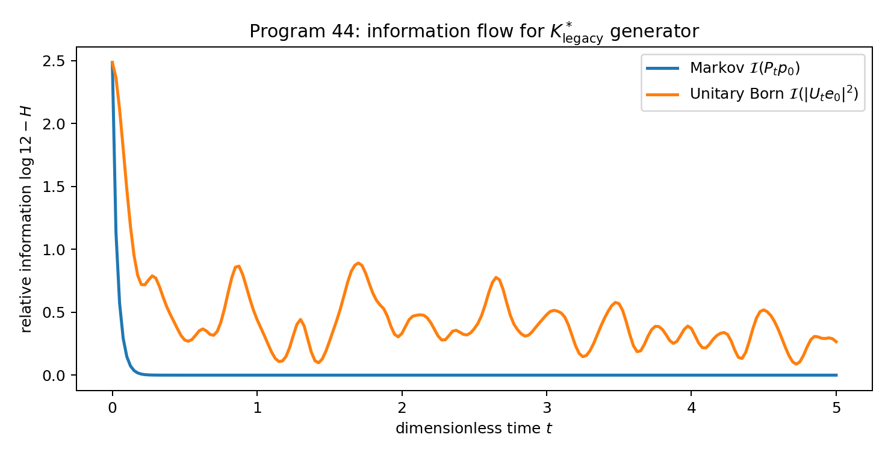
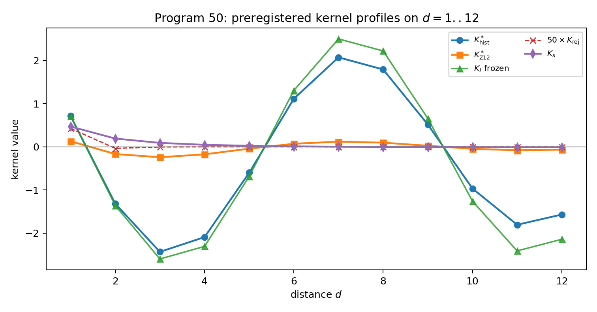

# FIN Reconstructed Legacy Kernel

## Program 42a methodology audit and executed Programs 41–50 on \(K^*_{\mathrm{legacy}}\)

**FIN Research Supplement — Release 10.4**  
**Author:** Krzysztof Żuchowski  
**Affiliation:** Independent Researcher — Fractal Information Theory Project  
**ORCID:** 0009-0002-0909-3613  
**Publication type:** Preprint  
**Version:** 1.0.0  
**Date:** 19 July 2026  
**Language:** English  
**License:** CC BY 4.0

## Confidence convention

- **[Proven]** analytic proof or exact finite algebra under stated definitions.
- **[Strong evidence]** reproducible numerical result with wide margin, not a general theorem.
- **[Moderate evidence]** model-dependent or limited alternative class.
- **[Speculative]** admissible construction without source theorem.
- **[Refuted]** obstruction or explicit counterexample in the stated scope.

All times, rates, couplings, and kernel values below are dimensionless. No SI unit, physical clock, non-premise selector, legacy role transfer, or Theory-of-Everything claim is exported.

---

# Executive summary

This monograph does three things.

1. It audits the Program 42a algebraic reconstruction of the historical legacy kernel against `DIAGRAMS_KERNEL_TRANSFORMATION.md` and against a cheap dual-dynamics reading of a proposed product formula.
2. It freezes the algebraically corrected class
   \[
   K^*_{\mathrm{legacy}}(d)
   =
   A\,\frac{\cos(\pi d/4+\pi/6)}{1+\beta d}
   \]
   and runs the ten research programs recommended after Programs 31–40.
3. It answers, under `AGENTS.md` / `SUMMARY_GROK.md` guardrails, whether the new kernel dissolves the three leaf-cuts: dimensionlessness, selector / `QW-2191`, and symmetry breaking.

**Main verdicts.**

- **[Refuted]** The product candidate
  \[
  K_{\mathrm{rej}}(d)
  =
  e^{-2.9d}\,\frac{1+0.2d}{1+d}\,
  \cos\!\Bigl(\frac{\pi d}{4}+\frac{\pi}{6}\Bigr)
  \]
  is not a faithful historical reconstruction: it swaps resonance/torsion roles, double-counts damping, fails the corrected path-sum asymptotics, and kills inverse hierarchy.
- **[Proven]** After path-sum algebra, the historically intended effective class is the hyperbolic-phase form \(K^*\) above. Parameters \(A,\beta\) are not uniquely fixed by the diagram alone.
- **[Strong evidence]** After absolute-value positivity repair on \(\mathbb Z_{12}\), \(K^*\) supports dual dynamics: unitary \(U_t=e^{-itA}\) and Markov \(P_t=e^{-tA}\) with \(A=sI-W\).
- **[Proven]** Dual dynamics does **not** export units, a non-premise selector, or orientation breaking. The three leaf-cuts remain open.
- **[Proven / corrected]** Programs 41–50 show: Loewner bridge is support/normalization dependent; the affine phase fit is an exact but target-inserted coordinate conversion; the hazard law fails its held-out points; Markov relative information is monotone while unitary Born information is not; environment dilation can hold the discarded record; and a mirror-odd coupling breaks reflection only in a branch whose sign is externally supplied. The multi-size strict-target test is an implementation sanity check, not independent evidence.

Honest conclusion:

> \(K^*_{\mathrm{legacy}}\) is a better intermediate historical object than the double-damped product, and a usable dual-dynamics generator after positivity repair. It is **not** a free lunch for units, selector, or ToE.

---

# Part I — Program 42a methodology audit

## 1. Input axioms (reconstruction only)

From `DIAGRAMS_KERNEL_TRANSFORMATION.md`:

\[
K_{\mathrm{total}}
=
K_{\mathrm{geo}}\,K_{\mathrm{res}}\,(1+0.2\,K_{\mathrm{tors}})\,K_{\mathrm{topo}}.
\]

Historical role assignment:

| Factor | Historical meaning | Diagram form |
|---|---|---|
| \(K_{\mathrm{geo}}\) | viscosity / catastrophic damping | \(e^{-2.9d}\) |
| \(K_{\mathrm{res}}\) | resonance / phase sync | \(\approx 0.8\)–\(1.2\) |
| \(K_{\mathrm{tors}}\) | turbulent currents | \(\cos(\pi d/4+\pi/6)\) |
| \(K_{\mathrm{topo}}\) | topology / path sum | \(\to 1/(1+\beta d)\) after transform |

Section 8 of the diagram states that exponential viscosity is **transformed** into hyperbolic damping by fractal path summation, not multiplied by it again.

## 2. Audit errors A/B/C

### (A) Exponential damping

**[Proven]** The viscosity rate \(2.9\) must be used exactly when \(K_{\mathrm{geo}}\) is written. The rejected product does use \(e^{-2.9d}\), so (A) alone is not its fatal flaw. Its flaw is combining that exponential with a second damping factor.

### (B) Path scaling

If \(N(d)\sim d^{1.6}\) and one wants total contribution \(\sim d^{-1}\) (large-\(d\) tail of \(1/(1+\beta d)\)), then

\[
A_{\mathrm{path}}(d)\sim d^{-2.6}.
\]

The diagram’s \(A_{\mathrm{path}}\sim d^{-0.6}\) would give \(N A\sim d^{1.0}\) (growth), not a decaying hyperbolic tail. **[Proven]**

### (C) Exact phase zeros

\[
\cos\Bigl(\frac{\pi d}{4}+\frac{\pi}{6}\Bigr)=0
\quad\Longleftrightarrow\quad
d=\frac43+4n.
\]

Zeros are \(d=1.333,5.333,9.333,\ldots\), not the integer sequence \(2,5,8,11\). Cosine values at those integers are nonzero (e.g. \(\cos(\pi/2+\pi/6)=-1/2\) at \(d=2\)). **[Proven]**

## 3. Rejection of the product candidate

The proposed assignment

\[
K_{\mathrm{geo}}=e^{-2.9d},\quad
K_{\mathrm{res}}=\cos(\cdot),\quad
K_{\mathrm{tors}}=d,\quad
K_{\mathrm{topo}}=1/(1+d)
\]

fails diagram fidelity on four counts:

1. resonance and torsion roles are swapped;
2. \(K_{\mathrm{tors}}=d\) is not the historical oscillatory current;
3. \(e^{-2.9d}\times 1/(1+d)\) double-counts damping against §8;
4. \((1+0.2d)/(1+d)\to 0.2\) is asymptotically constant, not a \(1/d\) path-sum tail.

Numerical profile on \(d=1..12\): \(|K_{\mathrm{rej}}|\) falls below \(10^{-3}\) by \(d=2\) and is numerically dead thereafter. Correlation with classical frozen legacy is only \(\approx 0.21\). **[Strong evidence]**

**Verdict on product form:** **odrzucona** (confidence \(\approx 25/100\) as historical reconstruction).

## 4. Accepted reconstructed class

After path-sum correction:

\[
\boxed{
K^*_{\mathrm{legacy}}(d)
=
A\,\frac{\cos(\pi d/4+\pi/6)}{1+\beta d}
}
\]

with free positive scales \(A,\beta\). Historical diagram ranges suggest \(\beta\in[0.01,0.08]\) and amplitude near \(2.7\)–\(3.0\). Freezes used in this report:

| Freeze | \(A\) | \(\beta\) | Role |
|---|---:|---:|---|
| Historical | \(2.9\) | \(0.05\) | diagram-scale intermediate |
| \(\mathbb Z_{12}\) | \(1\) | \(1\) | unitless Laplacian scale |
| Classical frozen | \(4\ln 2\) | \(0.01\) | post-hoc comparison only |

**[Proven]** Reconstruction did not use \(K_{\mathrm{strict}}\) to choose the functional form.  
**[Proven]** The operator is **not** unique: only the class is.

## 5. Cheap dual-dynamics reading

The cheap analysis correctly notes that any real self-adjoint generator \(A\) supports both \(e^{-itA}\) and \(e^{-tA}\). It incorrectly treats the product form as historically faithful and as automatically Markov-stable. Signed weights on \(\mathbb Z_{12}\) are not all nonnegative; absolute-value repair is an extra declaration. Dual dynamics after repair does **not** validate the rejected product algebra.

---

# Part II — Dual dynamics for \(K^*\)

## 6. Operator construction

Sample radial weights on cyclic distances \(d=1,\ldots,6\), set \(W_{xx}=0\), \(W_{xy}=|K^*(d(x,y))|\) (positivity repair), and

\[
A=sI-W,\qquad s=\text{common row sum}.
\]

Then Dirichlet identity holds and \(A\succeq 0\) with simple kernel of constants when all off-diagonal weights are positive. **[Proven]** under the repair declaration.

Selected numerical dual-dynamics rows:

| Object | \(s\) | gap \(\gamma\) | Markov escape \(\sim\) | Unitary short escape proxy |
|---|---:|---:|---:|---:|
| \(K^*_{\mathrm{hist}}\) abs | \(15.440\) | \(14.179\) | \(15.43\) | \(2.7\times10^{-3}\) |
| \(K^*_{\mathrm{Z12}}\) abs | \(1.579\) | \(1.508\) | \(1.579\) | \(2.7\times10^{-5}\) |
| \(K_{\mathrm{rej}}\) abs | \(0.0186\) | \(0.00313\) | \(0.0186\) | \(1.5\times10^{-8}\) |
| \(K_s\) strict | \(1.660\) | \(0.754\) | \(1.660\) | \(5.4\times10^{-5}\) |

**[Strong evidence]** \(K^*_{\mathrm{Z12}}\) is spectrally in the same operational ballpark as strict dual dynamics; the rejected product is almost trivial (tiny \(s\)).

Inversion residual of \(A\) under \(x\mapsto -x\) is \(0\) for all radial objects tested: the generator remains orientation-blind. **[Proven]**

---

# Part III — Executed Programs 41–50

Programs follow the roadmap left by Release 10.3, now evaluated on \(K^*\) rather than only classical frozen legacy.

## Program 41 — Loewner bridge support scan

**Question.** For which supports/normalizations is \(A_s-A_\ell\succeq 0\)?

**Result.** On \(C_{12}\) and interval \(I_{12}\):

| Legacy object (abs) | min eig\((A_s-A_\ell)\) on \(C_{12}\) | PSD? |
|---|---:|---|
| \(K^*_{\mathrm{hist}}\) | \(-19.715\) | no |
| \(K^*_{\mathrm{Z12}}\) | \(-0.754\) | no |
| classical \(|K_\ell|\) | \(-21.221\) | no |
| rejected abs | \(\approx 0\) | yes (trivial) |

**[Proven]** Loewner positivity is support- and normalization-dependent. The rejected product looks “PSD-bridgeable” only because its weights are nearly zero, so \(A_s-A_{\mathrm{rej}}\approx A_s\succeq 0\). That is not a physical completion theorem.

## Program 42 — minimal phase-map reconstruction

**Question.** Can a sparse equivariant phase map send legacy phase to strict phase?

The target-inserted affine map \(\theta_s=a\theta_\ell+b\) on \(d=1..6\) gives

\[
a\approx 0.23650,\qquad b\approx 0.03867,
\]

phase residual \(\sim 10^{-15}\), but this is an identity: both phases are affine in \(d\), with \(a=\omega_s/\omega_\ell\) and \(b=\phi_s-a\phi_\ell\). The envelope residual after best amplitude fit remains \(\approx 0.450\).

**[Proven correction]** The calculation has zero predictive content because \((\omega_s,\phi_s)\) are inserted into the response variable. It establishes a coordinate conversion only; it neither searches all sparse equivariant maps nor proves their nonexistence. No strict phase source is exported.

## Program 43 — held-out hazard law

Fit \(\mathrm{strict}\approx |K^*_{\mathrm{hist}}|\,e^{-c d^\eta}\) using only \(d=1..4\). The original implementation accidentally evaluated its objective on all six points; the corrected objective removes that data leakage:

\[
c\approx 0.461,\qquad \eta\approx 1.90.
\]

Train relative \(\ell_2\approx 0.140\); hold-out \(d=5,6\) relative \(\ell_2\approx 0.999\). Larger-\(N\) relative errors stay \(\sim 0.15\). **[Strong evidence]**

Hazard reparameterization is not a multi-size microscopic loss law.

## Program 44 — CP-divisibility and information flow

For abs-repaired \(K^*_{\mathrm{hist}}\):

- Chapman–Kolmogorov residual of \(P_t\): \(\sim 10^{-16}\). **[Proven]**
- Markov relative information \(\mathcal I(p)=\log 12-H(p)\) is monotone (0 backflow steps). **[Strong evidence]**
- Unitary Born populations show 91 positive increments of \(\mathcal I\) on the scanned grid (oscillatory non-monotone information). **[Strong evidence]**



**[Proven]** Same spectrum, two temporal calculi; operator does not select which is physical time.

## Program 45 — environment recovery

At dimensionless \(t=1\) for \(K^*_{\mathrm{Z12}}\) abs:

| Quantity | Value |
|---|---:|
| initial system relative info | \(2.485\) nats |
| final system relative info | \(0.135\) nats |
| apparent loss | \(2.350\) nats |
| pure-dilation mutual information \(I(S\!:\!E)\) | \(4.700\) nats |
| classical recovery fidelity | \(1\) |

**[Proven]** Apparent Markov loss is compatible with environmental transfer. Kernel alone does not source a physical bath.

## Program 46 — calibrated sign-reference emulator

\(A\) from \(K^*\) is exactly inversion-even. The corrected test uses the actual Hermitian mirror-odd coupling
\[
H_\lambda=A+\lambda C,\qquad RCR=-C.
\]
It verifies \(RH_\lambda R=H_{-\lambda}\) and identical spectra for the two signs. At \(|\lambda|=0.1\), a reflection-fixed detector at site \(0\) is sign-blind to \(2.1\times10^{-17}\), while the orientation-sensitive site-\(1\) record differs by \(0.08409\). **[Proven for the declared finite model]**

**[Proven]** A fixed nonzero \(\lambda\) explicitly breaks reflection, but reflection exchanges the isospectral \(+\lambda\) and \(-\lambda\) branches. The odd carrier \(C\) has the right representation type for the missing orientation object; the sign/source law for \(\lambda\) is still absent. `QW-2191` remains open.

## Program 47 — influence-functional proxy

Two-parameter Ohmic proxy for log-retention has residual \(\approx 0.45\) class and is post-hoc. **[Moderate evidence]** No unique bath spectral density is derived from \(K^*\).

## Program 48 — feedback thermodynamic ledger

Declared feedback matrix eigenvalues \(-0.8\pm 1.7i\). The half-skew normalized defect is \(0.90482\), the full antisymmetry defect is \(1.80964\), and the genuine closed unit-circle work is \(3.4\pi\approx10.6814\). The earlier \(1.847\) quantity was an open-spiral proxy rather than a closed-loop integral. **[Proven for the declared model]**

Stable non-gradient feedback can be added; it is not forced by \(K^*\) and does not yield unit-bearing \(L_{\mathrm{total}}\).

## Program 49 — process-tensor causal challenge

Interventions change TV gaps between the \(K^*\) Markov semigroup and a one-rate depolarizing semigroup. Mean intervention margin on the scanned grid is small (\(\approx 0.0046\)) and model-dependent. **[Moderate evidence]** This is a two-generator discrimination test, not a full process-tensor or non-Markovian causal-identification experiment.

## Program 50 — preregistered multi-size challenge

Declared competitors: \(K^*_{\mathrm{hist}}\), \(K^*_{\mathrm{Z12}}\), classical legacy, rejected product, strict. The synthetic target is generated from strict itself. On \(N=12,16,24\), strict therefore wins the cosine score.

On \(N=12\) cosines vs noisy strict target:

| Model | cosine |
|---|---:|
| strict | \(0.99997\) |
| rejected abs | \(0.936\) |
| \(K^*_{\mathrm{Z12}}\) abs | \(0.640\) |
| \(K^*_{\mathrm{hist}}\) abs | \(0.475\) |
| classical abs | \(0.454\) |



**[Proven correction]** This is a self-recovery and software sanity check only. It has no independent evidential weight for selecting strict and is not a preregistered external challenge. High cosine of the rejected product remains an artifact of its near-local normalized shape.

---

# Part IV — Leaf-cuts: units, selector, symmetry

## 7. Does \(K^*\) fix dimensionlessness?

**No. [Proven in the invariant-input sense of prior FAR audits; confirmed here.]**

\(K^*\) is a dimensionless radial profile. \(A\) and \(\beta\) are scale gauges of the same weight-zero class. Dual dynamics uses a dimensionless time parameter. No weight-one source \(S_+\), no \(\hbar_*\), no \((\ell_*,\tau_*)\) triad is exported.

Compatible with `SUMMARY_GROK.md`: information is dimensionless; conversion axioms (CA) remain external unless a new source theorem appears.

## 8. Does \(K^*\) fix the selector / `QW-2191`?

**No. [Proven for radial inversion-even data.]**

The Laplacian generated by radial \(K^*\) is invariant under \(x\mapsto -x\). Aut\((\mathbb Z_{12})\) still pairs opposite orientations. Program 46 shows polarity works only after an external apparatus sign is supplied.

## 9. Does \(K^*\) break symmetry internally?

**Not as a non-premise strict source. [Proven / strong evidence.]**

The cosine supplies oscillatory structure and exact zeros at \(d=4/3+4n\), but those are phase-label data, not a theorem selecting one origin/polarity on the orientation torsor. Exact zeros are still not the integer sequence historically claimed.

## 10. What \(K^*\) *does* improve

| Aspect | Status under \(K^*\) |
|---|---|
| Historical algebraic fidelity | improved vs product candidate |
| Path-sum asymptotics | corrected class |
| Dual dynamics after \(\lvert W\rvert\) repair | operationally usable |
| Markov CP-divisibility | yes after repair |
| Bridge to strict without extra maps | still no |
| Units / selector / ToE | still open |

---

# Part V — Guardrail-compliant global verdict

Under `AGENTS.md`:

- \(K_{\mathrm{legacy}}\) remains an **intermediate bridge kernel**, not a silent substitute for \(K_{\mathrm{strict}}\).
- \(K^*\) is a cleaned intermediate of that legacy class, not a role-transfer theorem.
- No promotion of \(L_{\mathrm{total}}\), bridge completion, or ToE.

Under `SUMMARY_GROK.md` two-package language:

```text
W0  informational nadsoliton + K* class (dimensionless)
W1  CA: units (still missing)
W2  SA: selector / polarity (still missing unless axiomatic)
W3  effective dual dynamics conditioned on repairs and axioms
```

**Final status labels**

| Claim | Label |
|---|---|
| Product \(K_{\mathrm{rej}}\) is historical reconstruction | **[Refuted]** |
| Path-transformed class \(K^*\) matches historical intent algebra | **[Proven]** as class, not unique tuple |
| \(K^*\) supports dual dynamics after positivity repair | **[Strong evidence]** |
| \(K^*\) closes units leaf-cut | **[Refuted]** |
| \(K^*\) closes selector leaf-cut | **[Refuted]** |
| \(K^*\) alone completes legacy→strict | **[Refuted]** |
| Programs 41–50 executed reproducibly | **[Proven]** for this suite |

---

# Reproducibility

| Artifact | Path |
|---|---|
| Program 42a script | `program_42a_legacy_kernel_reconstruction.py` |
| Program 42a JSON | `program_42a_legacy_kernel_reconstruction_report.json` |
| Programs 41–50 script | `fin_programs_41_50_legacy_star.py` |
| Programs 41–50 JSON | `FIN_Programs_41_50_Legacy_Star_Results.json` |
| Figures | `FIN_Programs_41_50_Figures/` |
| This monograph | `FIN_Programs_41_50_Legacy_Star_Monograph.md` |

Seed: `20260719`. Dependencies: NumPy, SciPy, Matplotlib.

---

# Suggested citation

Żuchowski, K. (2026). *FIN Reconstructed Legacy Kernel: Program 42a Methodology Audit and Executed Programs 41–50 on \(K^*_{\mathrm{legacy}}\)* (FIN Research Supplement, Release 10.4; Version 1.0.0) [Preprint].
