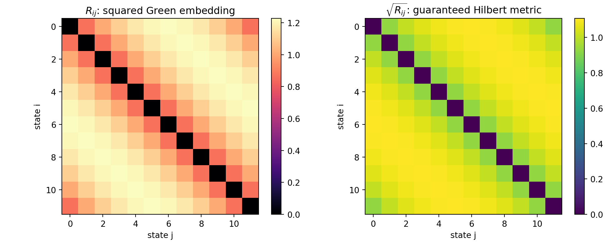
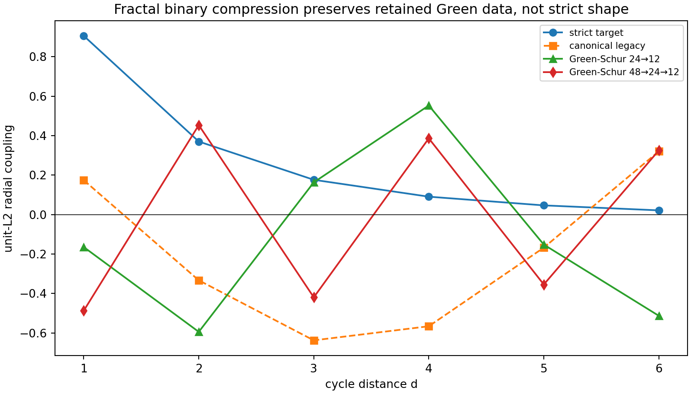
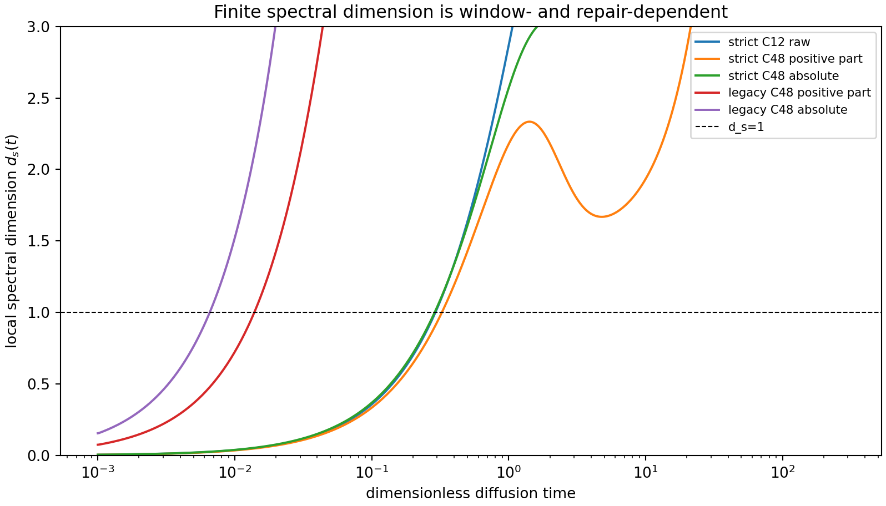
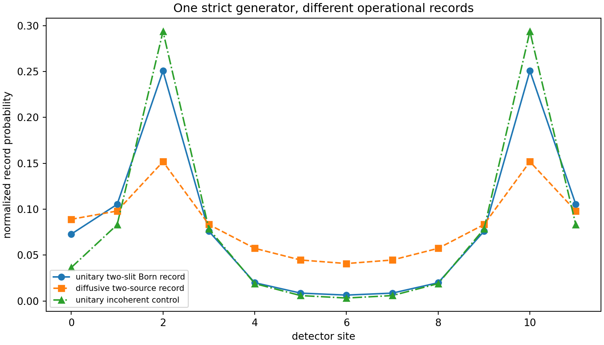

# FIN Programs 51–60

## Green Response, Fractal Information Compression, and the Minimal Bridge to Physics

**FIN Research Monograph — Release 10.6**  
**Author:** Krzysztof Żuchowski  
**Affiliation:** Independent Researcher — Fractal Information Theory Project  
**ORCID:** 0009-0002-0909-3613  
**Publication type:** Preprint  
**Version:** 1.0.0  
**Date:** 27 July 2026  
**Language:** English  
**License:** CC BY 4.0

## Confidence convention

- **[Proven]** analytic theorem or exact finite algebra under the declared definitions.
- **[Strong evidence]** reproducible finite computation with a clear numerical margin.
- **[Moderate evidence]** robust only inside the explicitly tested finite class.
- **[Conditional]** depends on a declared regularizer, conversion scale, state, instrument, or sector axiom.
- **[Refuted]** contradicted by a proof, counterexample, or failed transfer test.

All core calculations in this monograph are dimensionless. The ontology that the nadsoliton is primordial information in a solitonic state is treated as the FIN starting premise, not as an experimentally established conclusion. No lower informational substrate is introduced.

This work exports no strict physical unit, no strict selector, no discharge of `QW-2191`, no completed legacy-to-strict bridge, no legacy-role transfer, no unit-bearing \(L_{\mathrm{total}}\), and no Theory-of-Everything closure.

---

# Executive summary

Programs 51–60 were designed after auditing:

- *Funkcja Greena w kontekście FIN — brakujące ogniwo*;
- *geometria przestrzeni stanow*;
- the current strict/legacy kernel split and provenance packets;
- the post-Programs-41–50 corrections.

The two source notes identify a valuable research direction: the Green resolvent can organize response, dual functional calculus, geometry, coarse graining, and adaptive information flow. Their central intuition survives, but several theorem claims do not.

The strongest corrected conclusion is:

\[
\boxed{
\text{The Green resolvent is a unifying response object, but it is not the missing physical principle.}
}
\]

It unifies finite mathematical descriptions. It does not determine an absolute unit, a preparation, an instrument, a physical clock, an environment, a detector, or the sign of an orientation sector.

The principal results are:

1. **The fixed value \(s=1.660307278766099\) belongs to strict, not legacy. [Proven]**
   It equals the strict \(C_{12}\) row sum to \(4.4\times10^{-16}\). The canonical legacy row sum is \(-11.17405196\). Reusing strict \(s\) for legacy gives a minimum eigenvalue \(-8.54270057\), not a positive generator.

2. **Resolvent existence was stated too narrowly. [Proven correction]**
   \[
   G(z)=(zI-A)^{-1}
   \]
   exists exactly for \(z\notin\sigma(A)\). Positivity is neither necessary for a nonreal resolvent nor sufficient for an unregularized graph-Laplacian inverse at \(z=0\), because a Laplacian has a zero mode.

3. **The proposed Green “resistance metric” theorem was overgeneralized. [Refuted]**
   For arbitrary positive-definite \(A\),
   \[
   R_{ij}=G_{ii}+G_{jj}-2\operatorname{Re}G_{ij}
   \]
   is a squared Hilbert distance. The guaranteed metric is \(\sqrt{R_{ij}}\). An explicit three-state positive-definite counterexample gives a triangle excess \(1.98\) for \(R\). Effective resistance \(R\) itself is a metric only because a connected graph Laplacian supplies additional structure.

4. **The same Green resolvent reconstructs both dynamics. [Proven finite verification]**
   Numerical Cauchy functional calculus reconstructs \(e^{-itA}\), \(e^{-tA}\), and \(A^{-1}\) with relative errors below \(4\times10^{-10}\). This is a genuine unification of operator calculus, not a physical rule selecting an experimental record.

5. **A finite functional legacy-to-strict map exists on \(C_{12}\) but catastrophically fails transfer. [Proven finite result]**
   A degree-six map gives relative residual \(9.25\times10^{-14}\) on \(C_{12}\). Applying the same map on \(C_{16}\) gives relative error \(916.795\). The \(C_{12}\) identity is finite spectral interpolation, not a continuum bridge or universality theorem.

6. **Exact fractal Green-Schur compression was constructed. [Proven]**
   Eliminating alternating states by a Schur complement preserves the Green response on retained states with residual \(1.44\times10^{-14}\). This gives a rigorous information-compression map.

7. **That compression does not generate strict. [Strong finite falsification]**
   The canonical legacy-to-strict amplitude error is \(0.99148\). After one binary compression it is \(0.95117\), and after two it is \(0.94673\). Strict-phase tail fits have error approximately one; their fitted exponents are therefore non-identifiable and must not be interpreted as a derivation of \(\eta=1.8\).

8. **Fractal compression generates relative scale, not physical length. [Proven obstruction]**
   Binary elimination produces ratios \(2^k\) and a dimensionless flow. It cannot choose \(\ell_*\), \(\tau_*\), or \(\hbar_*\).

9. **Information loss under compression has a rigorous meaning. [Proven conditional model]**
   In the regularized Gaussian information model, Green-Schur compression reduces the legacy-versus-strict divergence from \(23.63624\) to \(11.60157\), consistent with data processing. This is dimensionless information loss, not automatically thermodynamic entropy or dissipated energy.

10. **The chiral receiver survives fractal compression but its sign remains unsourced. [Proven]**
    The compressed inversion-odd response has Frobenius norm \(1.93502\), while mirror covariance and oddness residuals are below \(1.2\times10^{-14}\). The \(+\lambda\) and \(-\lambda\) branches remain isospectral. Compression transports chirality but does not select it.

11. **The shortest honest path to experimental physics has three layers.**
    \[
    \boxed{
    W_0\;+\;\mathrm{CA}\;+\;\mathrm{OA}
    \quad
    \text{and, only for oriented sectors, }\mathrm{SA}.
    }
    \]
    Here \(W_0\) is the informational nadsoliton core, CA is dimensional calibration, OA is the operational map, and SA supplies a signed sector/origin when the observable requires it.

---

# Audit of the two source notes

## What survives

The source notes correctly identify that a Green object:

- carries the complete spectral response of a finite self-adjoint generator;
- reconstructs unitary and diffusive functional calculi;
- supports perturbative resolvent identities;
- provides embeddings and graph-resistance geometries;
- is naturally compatible with state-dependent and adaptive operators;
- is the correct object for exact elimination by Schur complements.

This is a substantial mathematical unification.

## Required corrections

| Source claim | Corrected status |
|---|---|
| \(A=sI-W\) is positive for strict and legacy because of a \(\beta\) threshold | **Refuted.** The quoted \(s\) is the strict row sum; canonical legacy gives an indefinite fixed-\(s\) operator |
| \(G(z)\) exists only in a positive gapped phase | **Refuted.** It exists whenever \(z\notin\sigma(A)\) |
| \(G(0)=A^{-1}\) for a graph Laplacian | **False without regularization or restriction.** A connected Laplacian has one zero mode |
| \(R_{ij}=G_{ii}+G_{jj}-2G_{ij}\) is a metric for every \(A>0\) | **Refuted.** \(\sqrt R\) is the general Hilbert metric; \(R\) needs additional structure |
| The proof follows because \(R\) is a squared norm | **Invalid.** Squared norms do not generally satisfy the triangle inequality |
| A Dyson series is a renormalization theorem | **Refuted.** It is a resolvent identity; RG additionally requires a coarse-graining and normalization map |
| Same finite polynomial carrier implies the same universality class | **Refuted.** Universality is an asymptotic scaling statement, not finite interpolation |
| \(\det G(z)\) is a topological invariant | **Refuted as stated.** It is a spectral invariant; topological meaning requires extra index/bundle structure |
| JSD between records measures only different contours | **Refuted.** It depends on preparation, dynamics, instrument, and record map |
| \(K(t)=e^{-tA}K(0)e^{-tA}\) is the Heisenberg picture | **Refuted.** Unitary Heisenberg evolution is \(U_t^\dagger K U_t\); dissipative evolution requires a declared channel |
| A fitted \(d^\eta\) after repeated composition would prove a bridge | **Insufficient.** One needs a transferable coarse-graining law and a sourced fixed point |

## Corrected conceptual position

The Green resolvent is best understood as:

\[
\text{informational response}
\;+\;
\text{spectral memory}
\;+\;
\text{exact marginalization interface}.
\]

Calling it a propagator is mathematically natural only after specifying the operator, source, boundary conditions, and time/energy convention. Calling it a physical propagator requires additional CA and OA data.

---

# Minimal mathematical setup

On a finite cycle \(C_N\), let

\[
W_{ij}=K(d(i,j)),\qquad
L=\operatorname{diag}(W\mathbf 1)-W.
\]

For positive weights, \(L\) is a graph Laplacian. Canonical legacy is signed, so its raw \(L\) is not automatically positive. When an inverse is required, this work declares a dimensionless regularized precision

\[
A=L+\delta I,
\qquad
\delta>-\lambda_{\min}(L).
\]

The regularizer is a mathematical infrared control. It is not a physical mass.

The standard resolvent convention is

\[
G(z)=(zI-A)^{-1}.
\]

For functions analytic around the spectrum,

\[
f(A)=\frac{1}{2\pi i}\oint_\Gamma f(z)(zI-A)^{-1}\,dz.
\]

For a retained state set \(E\) and eliminated set \(O\), write

\[
A=
\begin{pmatrix}
A_{EE}&A_{EO}\\
A_{OE}&A_{OO}
\end{pmatrix}.
\]

The exact Green-Schur compressed operator is

\[
A_{\mathrm{eff}}
=
A_{EE}-A_{EO}A_{OO}^{-1}A_{OE},
\]

and satisfies

\[
A_{\mathrm{eff}}^{-1}=(A^{-1})_{EE}.
\]

This identity is the rigorous core of “fractal information compression” used in Programs 55, 57, and 58.

---

# Program 51 — Resolvent-domain and positivity audit

## Question

Can the Green construction in the source note be applied unchanged to strict and canonical legacy?

## Result

| Quantity | Value |
|---|---:|
| strict \(C_{12}\) row sum | \(1.6603072787660986\) |
| quoted \(s\) | \(1.660307278766099\) |
| canonical legacy row sum | \(-11.174051961650372\) |
| \(\lambda_{\min}(sI-W_{\rm strict})\) | \(1.18\times10^{-15}\) |
| \(\lambda_{\min}(sI-W_{\rm legacy})\) | \(-8.5427005700\) |
| \(\lambda_{\min}(L_{\rm legacy,signed})\) | \(-21.3770598104\) |

The strict operator is a Laplacian to floating-point precision and therefore semidefinite, not positive definite. Canonical legacy requires a declared shift \(21.6270598104\) to place its signed Laplacian above the dimensionless floor \(0.25\).

## Verdict

**[Proven]** The fixed-\(s\) formula is kernel-specific. The legacy Green inverse cannot inherit the strict shift. The Gram-PSD threshold of a different kernel matrix does not prove positivity of this generator.

---

# Program 52 — Corrected Green geometry

## Question

Does the Green function automatically produce a metric information geometry?

## Theorem

For \(A>0\), define \(G=A^{-1}\) and

\[
R_{ij}
=
G_{ii}+G_{jj}-2\operatorname{Re}G_{ij}.
\]

There are vectors \(v_i=G^{1/2}e_i\) such that

\[
R_{ij}=\|v_i-v_j\|^2.
\]

Therefore

\[
d_G(i,j)=\sqrt{R_{ij}}
\]

is a metric whenever distinct states have distinct embedded vectors.

The unsquared \(R\) is not a metric in general.

## Explicit counterexample

The tested positive-definite Green matrix gives

\[
R=
\begin{pmatrix}
0&1.02&4.01\\
1.02&0&1.01\\
4.01&1.01&0
\end{pmatrix},
\]

so

\[
R_{13}-R_{12}-R_{23}=1.98>0.
\]

## FIN finite results

- Strict shifted Green \(R\) happens to pass all triangles on \(C_{12}\), but this is a finite property, not the general theorem.
- \(\sqrt R\) passes by the Hilbert-embedding theorem.
- Effective resistance from the strict graph Laplacian is a metric.
- Both positive-part and absolute-value legacy repairs produce resistance metrics, but they produce different geometries.

## Verdict

**[Proven correction]** The Green construction repairs the earlier \(-\log|K|\) proposal only after choosing the correct distance and operator class. It does not define a unique physical spacetime metric.

---

# Program 53 — Resolvent reconstruction of dual dynamics

## Question

Can one resolvent reconstruct both unitary and diffusive evolutions quantitatively?

## Test

Using 1024 points on a Cauchy contour around the spectrum:

\[
e^{-itA}
=
\frac{1}{2\pi i}\oint e^{-itz}(zI-A)^{-1}\,dz,
\]

\[
e^{-tA}
=
\frac{1}{2\pi i}\oint e^{-tz}(zI-A)^{-1}\,dz.
\]

## Results

| Reconstruction | Relative Frobenius error |
|---|---:|
| unitary \(e^{-itA}\) | \(1.65\times10^{-10}\) |
| diffusive \(e^{-tA}\) | \(2.74\times10^{-10}\) |
| static \(A^{-1}\) | \(3.65\times10^{-10}\) |
| direct unitarity residual | \(9.66\times10^{-16}\) |

## Verdict

**[Proven finite verification]** One spectral response object generates both calculi. However, an observed JSD or detector difference is not merely a contour difference. It depends on the full operational tuple:

\[
(\text{state},\text{preparation},\text{clock},\text{dynamics},
\text{instrument},\text{environment},\text{apparatus},\text{record}).
\]

---

# Program 54 — Functional Green bridge and transfer falsification

## Question

Is the finite relation between legacy and strict a transferable Green-function bridge?

Because both \(C_{12}\) kernels are radial circulants, they share Fourier eigenspaces. A scalar functional relation exists exactly when every degeneracy class of \(W_{\rm legacy}\) carries a single strict eigenvalue.

## Results

| Test | Value |
|---|---:|
| distinct legacy eigenvalues on \(C_{12}\) | 7 |
| strict spread inside legacy degeneracy classes | \(1.11\times10^{-16}\) |
| interpolating polynomial degree | 6 |
| \(C_{12}\) relative residual | \(9.25\times10^{-14}\) |
| transfer error on \(C_{16}\) | \(916.795186\) |

## Interpretation

On \(C_{12}\),

\[
W_{\rm strict}=q_{12}(W_{\rm legacy})
\]

to numerical precision. Consequently their resolvents can also be related on this one finite spectrum.

But \(q_{12}\) is an interpolation through seven finite spectral points. Its failure on \(C_{16}\) shows that it is not support-independent.

## Verdict

**[Refuted as a general bridge]** The finite functional identity does not establish:

- a continuum map;
- a renormalization fixed point;
- a universality class;
- a source for strict phase, damping, or \(\eta=1.8\);
- physical-role transfer.

---

# Program 55 — Green-Schur fractal compression

## Question

Can an explicit, information-preserving fractal compression convert canonical legacy into strict?

## New typed compression object

The tested map retains every second cycle state and exactly eliminates the remainder:

\[
\mathcal C_2(A)
=
A_{EE}-A_{EO}A_{OO}^{-1}A_{OE}.
\]

Repeated compression gives

\[
\mathcal C_4=\mathcal C_2\circ\mathcal C_2.
\]

Unlike an unspecified “coarse grain,” this map has an exact Green identity.

## Results

| Quantity | Value |
|---|---:|
| \(24\to12\) retained-Green identity residual | \(1.44\times10^{-14}\) |
| raw legacy→strict amplitude error | \(0.991483\) |
| one-step compressed error | \(0.951170\) |
| two-step compressed error | \(0.946726\) |
| one-step strict-phase tail-fit error | \(1.000000003\) |
| two-step strict-phase tail-fit error | \(1.000000000\) |

The tail optimizations return extreme, incompatible exponents because the objective is essentially unable to fit the compressed profile. Those exponent values are not scientific estimates.

## Verdict

**[Proven]** The map is an exact marginalization of information response.

**[Strong finite falsification]** It does not generate the strict profile or \(\eta=1.8\).

**[Proven obstruction]** It supplies the relative scale ratios \(2\) and \(4\), but no absolute length.

This distinguishes three ideas often conflated under “fractal compression”:

1. exact elimination of hidden informational states — obtained;
2. flow toward the strict kernel — not obtained;
3. generation of physical scale — impossible without a scale-charged datum.

---

# Program 56 — Spectral dimension under repair and scale

## Question

Does the heat trace recover a stable emergent dimension?

For nonzero Laplacian modes,

\[
Z'(t)=\sum_{\lambda_k>0}e^{-t\lambda_k},
\qquad
d_s(t)=-2\frac{d\log Z'(t)}{d\log t}.
\]

## Results

Across raw strict \(C_{12}\), strict \(C_{48}\) positive-part and absolute repairs, and both legacy repairs:

- the interval satisfying \(d_s\in[0.85,1.15]\) is only \(0.120\)–\(0.137\) decades wide;
- the apparent crossing time varies by almost two orders of magnitude;
- beyond the positive \(C_{12}\) strict support, even strict requires a declared repair because its long-distance extrapolation changes sign.

## Verdict

**[Refuted as a dimension export]** There is no robust spectral-dimension plateau in the tested finite family. A curve crossing \(d_s=1\) is not evidence that the theory has generated one-dimensional physical space.

**[Moderate evidence]** Heat-trace diagnostics remain useful for comparing declared operator realizations.

---

# Program 57 — Information action and compression loss

## Question

Can Green compression give a rigorous form of information loss?

Treat a regularized \(A>0\) as a Gaussian precision and \(G=A^{-1}\) as its covariance. The Schur complement is then the exact marginal precision on retained informational states.

## Results

| Quantity | Value |
|---|---:|
| full \(D_{\rm KL}(\text{legacy}\Vert\text{strict})\) | \(23.63624087\) |
| retained-state \(D_{\rm KL}\) | \(11.60157427\) |
| data-processing margin | \(12.03466660\) |
| legacy marginal-precision identity residual | \(2.56\times10^{-13}\) |
| strict identity residual | \(8.95\times10^{-16}\) |

## Verdict

**[Proven within the Gaussian information model]** Eliminating states reduces model distinguishability and transfers their influence into an effective operator.

This is the mathematically correct sense in which fractal compression can create apparent information loss while the larger description retains the full covariance.

It is not yet:

- thermodynamic entropy;
- heat;
- Landauer work;
- physical action;
- an experimentally calibrated energy.

Those identifications require temperature, \(k_B\), an environment protocol, a clock, and a work/heat instrument.

---

# Program 58 — Chiral Green response under fractal compression

## Question

Does an inversion-odd mirror coupling disappear under coarse graining, generate its own sign, or survive as an effective sector?

Let

\[
C=\frac{i}{2}(D-D^T),
\qquad
RCR=-C,
\qquad
A_\lambda=A_0+\lambda C.
\]

## Results

| Test | Value |
|---|---:|
| full odd-carrier residual | 0 |
| full branch covariance residual | \(1.42\times10^{-14}\) |
| compressed branch covariance residual | \(1.14\times10^{-14}\) |
| compressed odd-response residual | \(3.63\times10^{-16}\) |
| compressed chiral response norm | \(1.93501688\) |
| compressed \(+\lambda/-\lambda\) spectral residual | 0 |

## Verdict

**[Proven]** Green-Schur compression transports the correct chiral representation object.

**[Refuted]** It does not select the sign. Reflection still exchanges two isospectral branches:

\[
R A_{+\lambda}R=A_{-\lambda}.
\]

Fractal compression can preserve a sector, amplify or suppress its response, and integrate out hidden states. It cannot source the sector’s orientation from a radial scalar kernel.

---

# Program 59 — Operational records from one generator

## Question

What is the smallest experimentally shaped calculation that can be made without claiming a physical calibration?

A coherent two-source preparation was evolved with the strict \(C_{12}\) generator by:

\[
U_t=e^{-itL},
\qquad
T_t=e^{-tL}.
\]

For the unitary branch the record uses Born populations. For the diffusive branch it uses the stochastic population vector.

## Results

| Quantity | Value |
|---|---:|
| unitary probability sum | \(1-1.1\times10^{-16}\) |
| diffusive probability sum | \(1-2.2\times10^{-16}\) |
| minimum heat-kernel entry | \(0.0256684\) |
| coherent–incoherent \(L^1\) difference | \(0.182669\) |
| wave–diffusion JSD, fine record | \(0.0428693\) |
| wave–diffusion JSD after pair coarse graining | \(0.0352858\) |
| JSD data-processing margin | \(0.00758347\) |

## Verdict

**[Proven finite operational statement]** One generator can support distinct wave and diffusion records once the preparation and instrument are specified. Coarse graining reduces their distinguishability.

The observer paradox is therefore operationally avoidable. The missing objects are not consciousness but:

- state and preparation;
- clock;
- chosen dynamical calculus;
- instrument;
- environment;
- apparatus;
- record map;
- dimensional calibration.

---

# Program 60 — Physical-scale obstruction and minimal conditioned bridge

## Question

Can information, the Green response, or fractal compression determine dimensional physics without imported calibration?

Let the strict dimensionless spectral gap be

\[
\widehat\Delta=0.7541211542070796.
\]

After a conversion triple \((\ell_*,\tau_*,\hbar_*)\),

\[
E_{\rm gap}=\frac{\hbar_*}{\tau_*}\widehat\Delta,
\qquad
c_*=\frac{\ell_*}{\tau_*}.
\]

Three admissible conversion gauges leave every dimensionless FIN computation unchanged but generate energy gaps ranging from

\[
7.54\times10^{-6}
\quad\text{to}\quad
7.54\times10^8
\]

in their declared unit coordinates.

## Impossibility theorem

Suppose all \(W_0\) outputs are dimensionless and invariant under independent rescalings of length, time, and action units. Then no function of \(W_0\) alone can select a unique nonzero value carrying any of those dimensions.

The proof is the positive-torsor argument: an invariant input cannot equivariantly select a representative of a freely rescaled unit torsor.

Fractal compression does not evade the theorem. It gives:

\[
d\mapsto 2^k d,
\]

which is a relative scale transformation. The physical statement

\[
x=2^k\ell_*d
\]

still contains the unsourced \(\ell_*\).

## Minimal conditioned bridge

The shortest honest architecture is:

### \(W_0\): informational core

- informational nadsoliton;
- canonical strict and canonical legacy kernels with their distinct roles;
- Green response;
- spectral calculus;
- exact Schur compression;
- dimensionless information geometry.

### CA: conversion axioms

A basis equivalent to:

\[
(\ell_*,\tau_*,\hbar_*).
\]

Relations such as a calibrated limiting speed may reduce the number of independently reported constants, but the relation itself is additional physical input.

### OA: operational axioms

\[
(\rho_0,\mathcal P,\mathcal T,\mathcal I,\mathcal E,\mathcal A,\mathcal R),
\]

representing state, preparation, clock/dynamics, instrument, environment, apparatus, and record.

### SA: sector axioms, only when required

\[
(r_0,\lambda_0,\text{coupling law})
\]

for origin-, polarity-, or chirality-sensitive records.

### \(W_3\): conditioned physics

Only after CA and OA can a dimensionless spectrum be mapped to measured time, energy, length, and probability records. SA is additionally required only when the experiment distinguishes mirror sectors.

## Verdict

**[Proven obstruction]** Information and fractal ratios do not determine dimensional calibration.

**[Conditional bridge]** \(W_0+\mathrm{CA}+\mathrm{OA}(+\mathrm{SA})\) is sufficient to define an experimentally shaped model, but its predictions are conditioned on those additional axioms until they are independently sourced.

---

# Integrated scientific conclusions

## What the Green function genuinely unifies

\[
\begin{array}{c}
\text{kernel}\\
\downarrow\\
\text{generator}\\
\downarrow\\
\text{resolvent}
\end{array}
\quad\Longrightarrow\quad
\left\{
\begin{array}{l}
\text{unitary functional calculus},\\
\text{diffusive functional calculus},\\
\text{source response},\\
\text{Hilbert embedding},\\
\text{graph resistance},\\
\text{exact Schur marginalization},\\
\text{Gaussian information action},\\
\text{transport of chiral receivers}.
\end{array}
\right.
\]

This is a real mathematical synthesis.

## What it does not unify

The resolvent does not by itself provide:

- a unique legacy-to-strict completion;
- a stable continuum universality class;
- \(\eta=1.8\);
- an absolute length or time;
- \(\hbar\), energy, or mass;
- a physical boundary condition;
- a state preparation;
- Born’s rule;
- an instrument or apparatus;
- an environment;
- a signed selector.

## Status of the “information generates the universe” premise

The premise is mathematically productive when interpreted as:

> physical sectors are emergent operational representations of one informational nadsoliton, not fields placed on a deeper independent informational medium.

Programs 51–60 show how information can generate:

- relations;
- response;
- distinguishability;
- effective geometry;
- relative scale;
- coarse-grained dynamics;
- apparent information loss;
- sector receivers.

They do not show how dimensionless information internally generates the calibration that identifies one such representation with measured metres, seconds, joules, particles, or laboratory apparatus.

The missing bridge is therefore not “more information.” It is a mathematically typed map from informational relations to operationally calibrated records.

---

# Recommended Programs 61–70

The next research stage should avoid repeating finite interpolation or unsourced scalar fitting.

1. **Program 61 — Continuum functor for Green-Schur compression.**  
   Define a projective family \(C_{2^kN}\to C_N\) and test resolvent convergence under one fixed normalization.

2. **Program 62 — Regularizer-independence audit.**  
   Determine which Green, KL, and compression conclusions survive \(\delta\to0^+\), quotienting the zero mode, and pseudoinverse replacement.

3. **Program 63 — Compression semigroup theorem.**  
   Test whether the Schur maps compose associatively up to canonical relabeling and characterize their fixed points.

4. **Program 64 — Signed-kernel Krein-space alternative.**  
   Compare positive regularization against an indefinite inner-product formulation without silently calling either one physical.

5. **Program 65 — Operational tomography of the dual calculus.**  
   Determine the minimum preparations and instruments required to distinguish \(U_t\) from \(T_t\) after coarse graining.

6. **Program 66 — Fractal causal-order candidate.**  
   Add a declared partial order and test whether Green support respects finite propagation or produces unavoidable instantaneous tails.

7. **Program 67 — Physical calibration identifiability.**  
   Given synthetic clock, length, and energy records, determine the minimum number of independent experiments needed to identify CA.

8. **Program 68 — Chiral source-law falsification.**  
   Test one explicit nadsoliton-to-\(\lambda C\) formula, including origin covariance and sign provenance, rather than enumerating receiver classes.

9. **Program 69 — Information-to-thermodynamics protocol.**  
   Add an explicit bath, temperature, erasure channel, and work instrument; test Landauer inequalities without identifying Shannon entropy with heat by definition.

10. **Program 70 — Blinded physical-model challenge.**  
    Generate records from a hidden conditioned model and compare strict, legacy, compressed, and null models without including the exact generator as an announced target.

---

# Final judgment

The most important new object is not merely \(G=A^{-1}\). It is the exact three-part structure:

\[
\boxed{
\text{Green response}
\;+\;
\text{fractal Schur compression}
\;+\;
\text{operational calibration}.
}
\]

The first two are now mathematically executable inside FIN. The third is the minimal missing bridge to our physics.

The corrected deepest conclusion is:

> The informational nadsoliton can consistently generate a dimensionless relational world with response, geometry, dual dynamics, coarse-grained information loss, and chiral sector receivers. Fractal compression organizes relative scale and effective laws, but it cannot generate an absolute physical unit or choose an orientation branch. Experimentally testable physics begins only after a calibrated operational map is supplied.

---

# Reproducibility

- Executable: `fin_programs_51_60_green_fractal_physics.py`
- Regression tests: `test_fin_programs_51_60_green_fractal_physics.py`
- Machine-readable results: `FIN_Programs_51_60_Green_Fractal_Physics_Results.json`
- Figures: `FIN_Programs_51_60_Green_Fractal_Physics_Figures/`

Suggested citation:

Żuchowski, K. (2026). *FIN Programs 51–60: Green Response, Fractal Information Compression, and the Minimal Bridge to Physics* (FIN Research Monograph, Release 10.6; Version 1.0.0) [Preprint].
