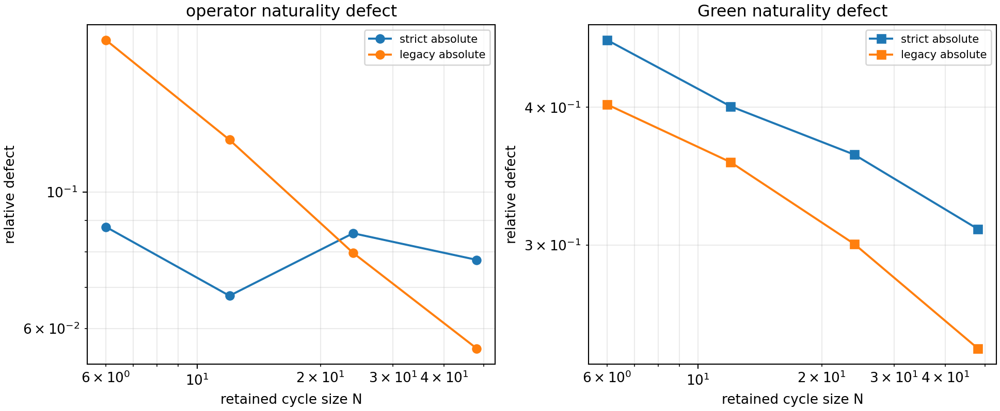
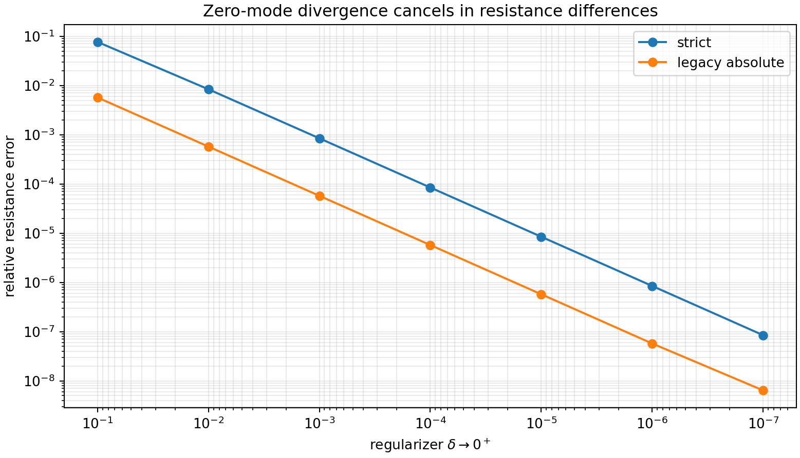
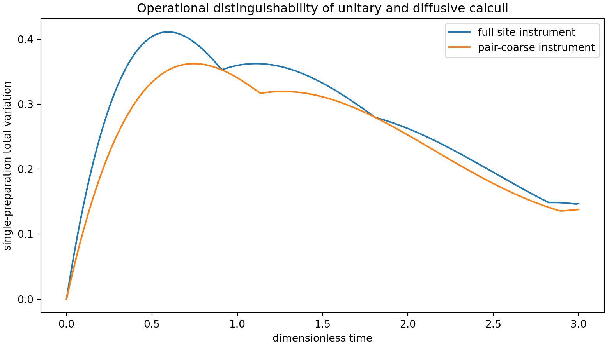
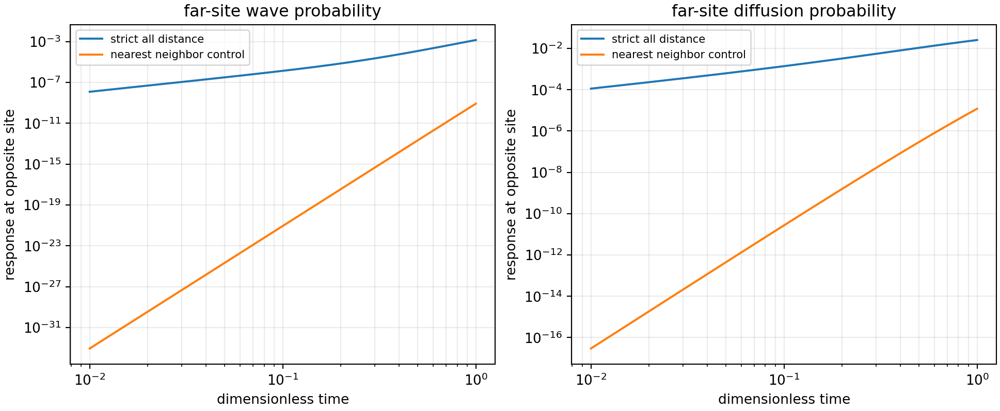
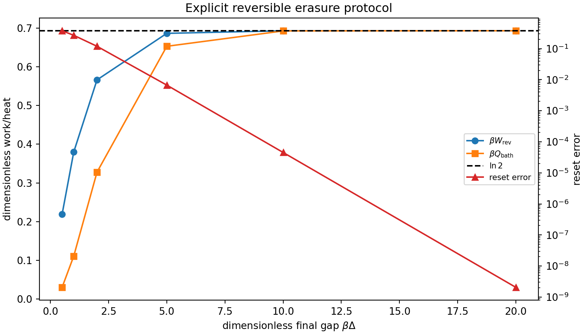
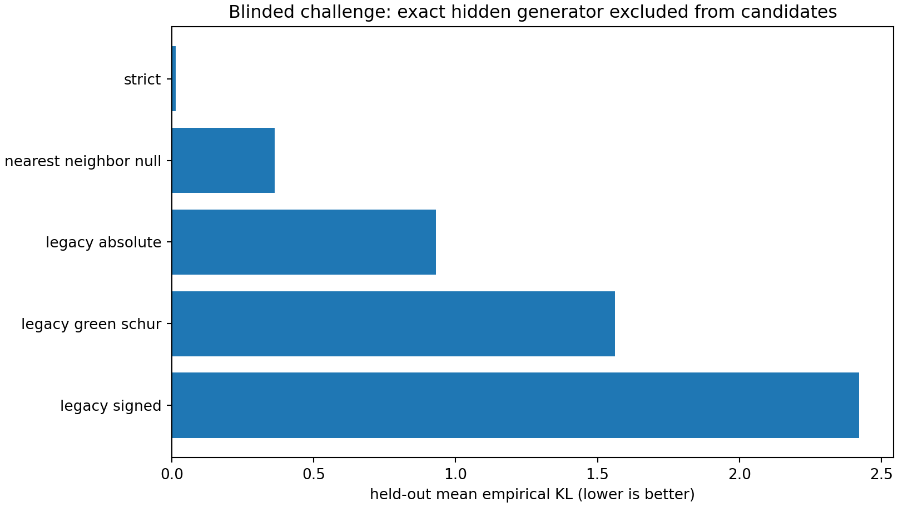

# FIN Programs 61–70

## Continuum Tests, Operational Physics, and Falsifiable Information-to-Experiment Interfaces

**FIN Research Monograph — Release 10.7**  
**Author:** Krzysztof Żuchowski  
**Affiliation:** Independent Researcher — Fractal Information Theory Project  
**ORCID:** 0009-0002-0909-3613  
**Publication type:** Preprint  
**Version:** 1.0.0  
**Date:** 27 July 2026  
**Language:** English  
**License:** CC BY 4.0

## Confidence convention

- **[Proven]** analytic theorem or exact finite algebra under declared definitions.
- **[Strong evidence]** reproducible finite computation with a clear numerical margin.
- **[Moderate evidence]** a stable result inside the tested finite model class.
- **[Conditional]** depends on a declared repair, scale, bath, preparation, instrument, or sector input.
- **[Refuted]** contradicted by a theorem, counterexample, or failed transfer test.

The FIN ontology is retained: the nadsoliton is primordial information in a solitonic state, not an excitation of a lower informational substrate. This premise is not promoted to an experimentally established fact.

No result below exports a strict physical unit, a strict selector, a completed legacy-to-strict bridge, legacy physical-role transfer, Lorentz symmetry, unit-bearing \(L_{\rm total}\), or Theory-of-Everything closure.

---

# Executive summary

Programs 61–70 execute the research program recommended after Programs 51–60. They test whether exact Green-Schur information compression extends to a continuum functor, whether its geometry survives removal of the infrared regularizer, whether compression forms a semigroup, whether an indefinite/Krein description can retain signed legacy without false positivity, and what additional structures are minimally required for causal, thermodynamic, and experimentally calibrated physics.

The central result is:

\[
\boxed{
\text{FIN now has an exact finite compression calculus and explicit operational bridges,}
}
\]

\[
\boxed{
\text{but neither continuum covariance nor physical calibration follows automatically.}
}
\]

The strongest conclusions are:

1. **Green-Schur compression is exactly compositional. [Proven]**
   Direct \(48\to12\) elimination and sequential \(48\to24\to12\) elimination agree with relative residual
   \[
   1.29\times10^{-16}.
   \]

2. **Exact composition is not the same as a continuum functor. [Proven distinction]**
   At \(N=48\), the native-versus-compressed Green naturality defect remains \(0.3103\) for strict-absolute and \(0.2419\) for legacy-absolute. Legacy defects decrease monotonically and are scientifically promising, but no zero-defect limit has been established.

3. **Resistance geometry is regularizer independent. [Proven finite convergence plus standard theorem]**
   As \(\delta\to0^+\), the shifted-resolvent resistance converges to Moore-Penrose effective resistance. At \(\delta=10^{-7}\), the relative errors are \(8.46\times10^{-8}\) for strict and \(6.40\times10^{-9}\) for legacy-absolute, even though
   \[
   \|G_\delta\|_F\sim\delta^{-1}.
   \]

4. **A Krein-space rewrite preserves signed operator information but does not manufacture diffusion physics. [Proven]**
   The canonical signed legacy realization has inertia \((11-,1+)\). Its unitary evolution remains valid, but raw \(e^{-tA}\) has operator norm \(8.4377\) and negative entries down to \(-1.0611\). Replacing \(A\) by \(JA=|A|\) stabilizes diffusion but changes the generator.

5. **Operational discrimination is inexpensive. [Proven finite result]**
   A single localized preparation and one optimized binary detector distinguish unitary from diffusive records with total variation \(0.359654\) at dimensionless time \(t=1\). Pair coarse graining still leaves \(0.340589\).

6. **The strict \(C_{12}\) kernel does not define an exact causal cone. [Proven]**
   It directly couples the opposite cycle site at first order. Far-site wave probability begins at order \(t^2\), and diffusion at order \(t\). A nearest-neighbour control begins at orders \(t^{12}\) and \(t^6\). A Lorentzian causal order remains additional structure.

7. **Dimensional calibration is identifiable, but only from calibrated experiments. [Proven]**
   The log-Jacobian for \((\ell_*,\tau_*,\hbar_*)\) has rank three only after independent length, clock, and energy/action records are supplied. Any pair has rank two.

8. **A concrete kernel-only chiral source law fails for a theorem-level reason. [Proven no-go]**
   The tested translation-invariant, reflection-odd triangular loop is exactly zero on both radial kernels. It becomes nonzero only after an oriented antisymmetric datum is inserted, and its sign follows that imported orientation.

9. **The Shannon-to-thermodynamics bridge is derivable after the missing physical package is supplied. [Proven conditional protocol]**
   An explicit two-state thermal erasure protocol satisfies the first law and reversible Clausius equality to below \(1.2\times10^{-16}\), approaching
   \[
   \beta W=\beta Q_{\rm bath}=\ln2.
   \]
   The bridge requires \(k_B,T\), a bath, a Hamiltonian protocol, and work/heat instruments.

10. **A genuinely held-out synthetic challenge is feasible. [Strong methodology result]**
    The exact hidden generator was excluded from the candidate set. Strict won held-out scoring with mean empirical KL \(0.01337\), versus \(0.36347\) for the nearest-neighbour null and \(0.93120\) for legacy-absolute. This validates the test procedure, not nature’s choice of kernel.

---

# Program 61 — Projective continuum functor

## Question

Does exact binary Schur compression define a natural projective family

\[
C_{2N}\longrightarrow C_N
\]

that approaches a continuum operator?

## Definition

For a declared positive realization, weights are repaired by absolute value, normalized to unit row sum, and converted to

\[
A_N=\frac14 I+L_N.
\]

After retaining even sites:

\[
\mathcal C_2(A_{2N})
=
(A_{2N})_{EE}
-
(A_{2N})_{EO}(A_{2N})_{OO}^{-1}(A_{2N})_{OE}.
\]

Both native and compressed operators are normalized to mean diagonal one. The naturality defect is

\[
\varepsilon_A(N)
=
\frac{\|\mathcal C_2(A_{2N})-A_N\|_F}{\|A_N\|_F},
\]

with an analogous Green defect.

## Results

| Family | \(N=6\) Green defect | \(N=48\) Green defect | Green log-log slope | Operator monotone? |
|---|---:|---:|---:|---|
| strict absolute | 0.46019 | 0.31032 | \(-0.1850\) | no |
| legacy absolute | 0.40233 | 0.24192 | \(-0.2447\) | yes |

Legacy operator defects fall from \(0.17665\) to \(0.05570\) with fitted slope \(-0.5606\). Strict operator defects fluctuate between \(0.0678\) and \(0.0878\).

## Verdict

**[Moderate evidence]** Legacy-absolute under the declared normalization is a promising projective candidate because both defects decrease monotonically.

**[Not proven]** Neither family has reached a zero-defect regime. The finite slopes do not prove convergence, uniqueness, or a continuum physical geometry.

**[Conditional]** The result depends on the absolute-value repair and normalization. It is not a theorem for the raw signed legacy kernel.

---

# Program 62 — Regularizer independence

## Question

Which Green-derived quantities survive the limit

\[
G_\delta=(L+\delta I)^{-1},
\qquad
\delta\to0^+?
\]

## Theorem

For a connected positive graph Laplacian,

\[
G_\delta
=
\frac{1}{N\delta}\mathbf1\mathbf1^T
+
L^+
+
O(\delta).
\]

The divergent zero-mode term cancels from

\[
R_\delta(i,j)
=
(G_\delta)_{ii}
+
(G_\delta)_{jj}
-
2(G_\delta)_{ij}.
\]

Therefore

\[
R_\delta(i,j)\longrightarrow R(i,j)
\]

defined by the Moore-Penrose inverse.

## Results

At \(\delta=10^{-7}\):

| Realization | Resistance relative error | \(\delta\|G_\delta\|_F\) |
|---|---:|---:|
| strict \(C_{12}\) | \(8.46\times10^{-8}\) | \(0.9999999990\) |
| legacy absolute \(C_{12}\) | \(6.40\times10^{-9}\) | \(0.9999999886\) |

## Verdict

**[Proven]** Effective resistance is a regularizer-independent quotient observable.

**[Refuted]** The full static Green covariance is not regularizer independent; its zero-mode norm diverges as \(1/\delta\).

**[Guardrail]** The theorem applies to positive connected graph realizations. It does not convert signed legacy into a Markov generator.

---

# Program 63 — Compression semigroup theorem

## Question

Does repeated fractal elimination depend on the order in which hidden informational states are removed?

## Theorem

Let \(E\subset F\) be retained index sets and suppose the eliminated blocks are invertible. Then:

\[
\operatorname{Schur}_E
\bigl(
\operatorname{Schur}_F(A)
\bigr)
=
\operatorname{Schur}_E(A).
\]

This follows equivalently from the unique retained Green block:

\[
\operatorname{Schur}_E(A)^{-1}
=(A^{-1})_{EE}.
\]

## Finite verification

\[
\frac{
\|\mathcal C_4(A_{48})
-
\mathcal C_2(\mathcal C_2(A_{48}))\|_F
}{
\|\mathcal C_4(A_{48})\|_F
}
=
1.29157\times10^{-16}.
\]

## Verdict

**[Proven]** Green-Schur fractal compression is an exact partial semigroup/category of nested eliminations.

**[Refuted inference]** Semigroup composition does not imply that the native FIN kernel family is a fixed point. Fixed-point closure additionally requires:

\[
\mathcal C_2(A_{2N})\simeq A_N
\]

under a support-independent normalization.

---

# Program 64 — Signed legacy and the Krein alternative

## Question

Can signed canonical legacy be retained without arbitrary positivity repair by using an indefinite geometry?

## Construction

For the shifted signed operator

\[
A=L_{\rm legacy,signed}+0.05I,
\]

spectral signs define

\[
J=\operatorname{sgn}(A),
\qquad
J^2=I,
\qquad
JA=|A|>0.
\]

## Results

| Quantity | Value |
|---|---:|
| inertia | 11 negative, 1 positive |
| \(\lambda_{\min}(A)\) | \(-21.32706\) |
| \(J^2-I\) residual | \(7.74\times10^{-15}\) |
| Krein self-adjointness residual | \(2.44\times10^{-14}\) |
| unitary residual | \(8.68\times10^{-16}\) |
| \(\|e^{-0.1A}\|_2\) | \(8.43767\) |
| minimum raw diffusion entry | \(-1.06109\) |
| \(\|e^{-0.1|A|}\|_2\) | \(0.995012\) |
| negative static Green-distance entries | 132 |

## Verdict

**[Proven]** Indefinite signed legacy supports a valid Hermitian spectral theory and unitary dynamics.

**[Refuted]** Krein self-adjointness does not make raw diffusion contractive, stochastic, positive, or metric.

Replacing \(A\) by \(JA=|A|\) yields a stable positive generator, but this is a nonunique model transformation, not the identity of the canonical legacy kernel.

---

# Program 65 — Operational tomography of dual dynamics

## Question

How much apparatus is required to distinguish:

\[
U_t=e^{-itL}
\qquad\text{from}\qquad
T_t=e^{-tL}?
\]

## Results at \(t=1\)

| Quantity | Value |
|---|---:|
| rank of channel-record difference | 11 |
| one localized preparation, full-site TV | 0.359654 |
| optimal binary detector sites | \(\{0,1,11\}\) |
| optimal binary difference | 0.359654 |
| pair-coarse TV | 0.340589 |
| circulant residuals | below \(6.8\times10^{-16}\) |

## The operational distinction

Under the known translation-covariant model class, one localized preparation determines one column, and all other columns follow by translation. One optimized binary instrument already separates the two record laws exactly in the ideal noiseless model.

Without the circulant prior, full process tomography still requires a spanning preparation set.

## Verdict

**[Proven finite result]** The mathematical observer problem does not require consciousness. It requires a preparation and an instrument.

**[Not exported by the kernel]** The kernel still does not choose the preparation, measurement basis, clock calibration, or record semantics.

---

# Program 66 — Fractal causal-order candidate

## Question

Does the strict kernel define finite-speed propagation relative to cycle distance?

For a matrix exponential, the first nonzero power

\[
m(i,j)=\min\{m:(L^m)_{ji}\ne0\}
\]

determines the short-time orders:

\[
|\langle j|e^{-itL}|i\rangle|^2=O(t^{2m}),
\]

\[
(e^{-tL})_{ji}=O(t^m).
\]

## Results at opposite cycle sites

| Generator | First power \(m\) | Wave probability order | Diffusion order |
|---|---:|---:|---:|
| full strict \(C_{12}\) | 1 | \(t^2\) | \(t\) |
| nearest-neighbour control | 6 | \(t^{12}\) | \(t^6\) |

## Verdict

**[Proven]** The full strict finite kernel has direct long-range response and no exact finite-speed cone relative to cycle distance.

Even the nearest-neighbour matrix exponential has nonzero tails for every \(t>0\); locality appears as high-order suppression rather than exact support.

A relativistic interpretation therefore requires at least one of:

- a continuum scaling limit producing a hyperbolic equation;
- an explicit causal partial order;
- a finite propagation rule distinct from the analytic matrix exponential;
- a demonstrated Lieb-Robinson-type approximate cone plus physical calibration.

---

# Program 67 — Physical calibration identifiability

## Question

What is the minimum experiment package required to identify:

\[
(\ell_*,\tau_*,\hbar_*)?
\]

## Log-linear observation model

\[
\log x=\log\ell_*+\log\widehat d,
\]

\[
\log t=\log\tau_*+\log\widehat t,
\]

\[
\log E=\log\hbar_*-\log\tau_*+\log\widehat\lambda.
\]

The Jacobian rows are:

\[
(1,0,0),\qquad
(0,1,0),\qquad
(0,-1,1).
\]

## Results

| Calibration classes | Rank |
|---|---:|
| length only | 1 |
| length + clock | 2 |
| length + energy | 2 |
| clock + energy | 2 |
| length + clock + energy | 3 |

A synthetic triple

\[
(2.5\times10^{-6},\;4.0\times10^{-9},\;1.7\times10^{-34})
\]

is recovered with zero numerical relative error after all three records are supplied.

## Verdict

**[Proven]** CA is experimentally identifiable.

**[Proven obstruction]** No number of additional dimensionless FIN records can replace an absent independent calibration direction. The conversion layer must be supplied by data or by a new scale-charged source theorem.

---

# Program 68 — Explicit chiral source-law falsification

## Candidate

For a directed matrix \(D\), define the translation-invariant oriented loop:

\[
\chi(D)
=
\sum_i
\left[
D_{i,i+1}D_{i+1,i+2}D_{i+2,i}
-
D_{i,i-1}D_{i-1,i-2}D_{i-2,i}
\right].
\]

It obeys:

\[
\chi(RDR)=-\chi(D).
\]

## Results

| Input | Strict | Legacy |
|---|---:|---:|
| radial \(W\) | 0 | 0 |
| \(W+0.1B_{\rm odd}\) | \(+0.433237\) | \(-4.635076\) |
| \(W-0.1B_{\rm odd}\) | \(-0.433237\) | \(+4.635076\) |
| translation residual | 0 | 0 |
| reflection-odd residual | below \(5.6\times10^{-17}\) | 0 |

## General theorem

If:

\[
F(RWR)=-F(W)
\]

and

\[
RWR=W,
\]

then:

\[
F(W)=-F(W)
\quad\Longrightarrow\quad
F(W)=0.
\]

## Verdict

**[Proven no-go]** No reflection-odd scalar functional can acquire a nonzero value from the radial kernel alone.

The candidate becomes nonzero only after the missing oriented datum has already been inserted. It is an excellent detector/receiver but cannot be the non-premise source of \(\lambda\) or discharge `QW-2191`.

---

# Program 69 — Information-to-thermodynamics protocol

## Question

Can Shannon information be converted to thermodynamic entropy without merely asserting the identification?

## Conditioned physical model

The program explicitly supplies:

- a two-state memory;
- a thermal bath at temperature \(T\);
- an initially degenerate Hamiltonian;
- a quasistatic protocol raising one level by \(\Delta\);
- work and heat instruments;
- \(k_B\).

Let:

\[
x=\beta\Delta,
\qquad
\epsilon=\frac{1}{1+e^x}.
\]

The final Shannon entropy is:

\[
H(\epsilon)
=
-\epsilon\log\epsilon
-(1-\epsilon)\log(1-\epsilon).
\]

The reversible quantities are:

\[
\beta W_{\rm rev}
=
\ln2-\ln(1+e^{-x}),
\]

\[
\beta Q_{\rm bath}
=
\ln2-H(\epsilon),
\]

\[
\beta\Delta U=x\epsilon.
\]

## Results

At \(x=20\):

\[
\epsilon=2.06\times10^{-9},
\]

\[
\beta W_{\rm rev}=0.6931471785,
\]

\[
\beta Q_{\rm bath}=0.6931471373.
\]

All tested first-law residuals are below \(1.2\times10^{-16}\), and reversible Clausius residuals are zero.

## Verdict

**[Proven conditional bridge]** Shannon information becomes thermodynamic entropy through a specified statistical-mechanical protocol:

\[
S_{\rm therm}=k_BH.
\]

This bridge is not arbitrary once bath physics is supplied, but \(k_B,T\), the Hamiltonian protocol, and instruments are not generated by the dimensionless FIN kernel.

---

# Program 70 — Blinded held-out physical-model challenge

## Design

The exact hidden generator is excluded from the candidate set.

- Seed: `20260727`.
- Hidden generator digest: `94b3bef894ce659a1c42e2783f7a478846c0114ea45d754e33f3fe7712f641bf`.
- Preparations: sites \(0,3,5\).
- Training times: \(0.35,0.70,1.05\).
- Held-out times: \(1.40,1.75\).
- Shots per record: 20,000.
- One global time calibration is fitted using training records only.

## Held-out ranking

| Rank | Candidate | Fitted time scale | Held-out mean empirical KL |
|---:|---|---:|---:|
| 1 | strict | 0.985285 | 0.0133733 |
| 2 | nearest-neighbour null | 1.186327 | 0.363475 |
| 3 | legacy absolute | 0.350000 | 0.931205 |
| 4 | legacy Green-Schur | 0.618220 | 1.562417 |
| 5 | legacy signed | 0.847081 | 2.421993 |

After scoring, the hidden model was revealed as a non-circulant 8% site-modulated strict-weight generator. No exact candidate was available.

## Verdict

**[Strong methodology result]** Strict recovers the hidden strict-like family under an unannounced perturbation and generalizes to held-out times substantially better than the alternatives.

**[Not physical evidence]** The target is synthetic and strict-like by construction. This experiment validates a fair scoring protocol, not the claim that nature uses strict.

---

# Integrated conclusions

## Mathematical advances

Programs 61–70 add three theorem-grade structures:

1. nested Green-Schur elimination is transitive;
2. effective resistance is the regularizer-independent zero-mode quotient of shifted Green geometry;
3. every reflection-odd scalar source vanishes on a reflection-invariant radial kernel.

They also establish quantitative operational interfaces:

- one-preparation discrimination of dual calculi;
- rank-three calibration of length, time, and action;
- a complete conditioned Landauer protocol;
- held-out model ranking without including the exact generator.

## Remaining obstructions

The following remain open:

- support-independent continuum/projective closure;
- a local or Lorentzian causal structure;
- a strict source for \((\ell_*,\tau_*,\hbar_*)\);
- a strict nonzero chiral sign;
- an experimental preparation/instrument map tied to actual laboratory data;
- a transferable legacy-to-strict completion theorem.

## Corrected information-to-physics chain

\[
\boxed{
\begin{array}{c}
\text{informational nadsoliton }W_0\\
\downarrow\\
\text{kernel, generator, Green response}\\
\downarrow\\
\text{Schur information compression}\\
\downarrow\\
\text{regularizer-independent quotient observables}\\
\downarrow\\
\mathrm{CA}+\mathrm{OA}\;(+\mathrm{SA},\mathrm{bath/causal\ package})\\
\downarrow\\
\text{calibrated and falsifiable records}
\end{array}
}
\]

Information can mathematically generate relational states, response, effective geometry, coarse-grained distinguishability, and conditional thermodynamic protocols. The transition to our physics occurs at the calibrated operational interface, not merely at the existence of a Green function.

---

# Recommended Programs 71–80

## Ranked roadmap

| Priority | Program | Objective | Estimated probability of a useful result |
|---:|---|---|---:|
| 1 | 71 | Derive the Fourier-symbol Schur renormalization map analytically | 0.85 |
| 2 | 72 | Extend projective-defect scaling to \(N=96,\ldots,1536\) with error bounds | 0.80 |
| 3 | 73 | Construct the regularizer-free Gaussian theory on \(\mathbf1^\perp\) | 0.80 |
| 4 | 74 | Quantify locality versus kernel truncation and derive an approximate causal cone | 0.75 |
| 5 | 75 | Build noisy Fisher-optimal calibration experiments for CA | 0.75 |
| 6 | 76 | Test one state-dependent, nonradial nadsoliton-to-chirality source formula | 0.45 |
| 7 | 77 | Execute finite-time Landauer/Jarzynski simulations | 0.70 |
| 8 | 78 | Perform multi-time operational process tomography with instrument noise | 0.75 |
| 9 | 79 | Derive an analytic-symbol legacy-to-strict RG bridge or no-go | 0.40 |
| 10 | 80 | Freeze a protocol for later blinded comparison with external physical data | 0.65 |

## Program specifications

### Program 71 — Analytic Fourier-symbol Schur map

For translation-invariant even cycles, derive:

\[
\widehat A_{\rm eff}(k)
\]

directly from the two-sublattice block symbol. Identify all normalized fixed symbols and linearized RG eigenvalues. This is the highest-leverage mathematical continuation because it can replace finite extrapolation by a theorem.

### Program 72 — Large-\(N\) projective scaling

Use block-circulant/Fourier algorithms rather than dense inversion. Test both:

- lattice-distance kernels \(K(d)\);
- coordinate-rescaled kernels \(K(d/N)\).

Preregister convergence criteria and stop if defects plateau above zero.

### Program 73 — Zero-mode quotient information theory

Define Gaussian measures and log determinants on:

\[
\mathbf1^\perp
\]

using pseudodeterminants. Determine which KL/action results from Program 57 survive without the arbitrary mass floor.

### Program 74 — Approximate causality

Introduce truncation radius \(r\) and measure:

- operator approximation error;
- wave/diffusion tail suppression;
- a Lieb-Robinson-type velocity proxy;
- stability under Schur compression.

The aim is not to insert Lorentz symmetry, but to identify whether a local continuum limit is mathematically possible.

### Program 75 — Noisy CA identifiability

Replace exact rank tests by Fisher information under realistic noise. Optimize which three experiments best determine \((\ell_*,\tau_*,\hbar_*)\), and quantify degeneracy if a calibration channel is omitted.

### Program 76 — One genuine chiral source candidate

The next selector move must not be another radial odd functional. It must provide an explicit nonradial state-dependent object:

\[
\rho_{\rm nad}\longmapsto \lambda(\rho_{\rm nad})C,
\]

and prove origin covariance, nonzero value, and sign provenance. Stop after the first complete falsification.

### Program 77 — Finite-time information thermodynamics

Add a two-state master equation, finite protocol duration, stochastic work, and verify:

\[
\langle e^{-\beta W}\rangle=e^{-\beta\Delta F}.
\]

Separate bath entropy, system Shannon entropy, and mutual information.

### Program 78 — Noisy process tomography

Use multiple preparations, times, and coarse instruments to estimate the dual calculus under shot noise. Compare model-selection power with and without translation-covariance assumptions.

### Program 79 — Symbol-level bridge

Replace support-specific polynomial interpolation by a support-independent equation between legacy and strict Fourier symbols under the Program 71 RG map. Success requires transfer across at least three unseen sizes.

### Program 80 — External-data protocol freeze

Define observables, calibration, priors, null models, exclusion rules, and held-out scoring before any laboratory dataset is selected. No repository physical claim should be updated from synthetic challenges alone.

---

# Final judgment

The deepest result of Programs 61–70 is not that FIN already produces physical spacetime. It is that the boundary between informational mathematics and physical prediction is now executable.

The finite informational core supplies:

- exact response;
- exact nested compression;
- quotient geometry;
- dual dynamics;
- chiral receivers;
- operationally distinguishable records.

Physics additionally requires:

- a continuum/locality theorem;
- calibrated conversion data;
- state and instrument semantics;
- a signed sector source when chirality is measured;
- bath and causal packages when thermodynamic or relativistic claims are made.

The most promising immediate move is an analytic Fourier-symbol renormalization theorem. It is the shortest route to deciding whether the declining projective defects represent a genuine continuum fixed structure or only another finite-support shadow.

---

# Reproducibility

- Executable: `fin_programs_61_70_continuum_operational_physics.py`
- Regression tests: `test_fin_programs_61_70_continuum_operational_physics.py`
- Machine-readable results: `FIN_Programs_61_70_Continuum_Operational_Physics_Results.json`
- Figures: `FIN_Programs_61_70_Continuum_Operational_Physics_Figures/`

Suggested citation:

Żuchowski, K. (2026). *FIN Programs 61–70: Continuum Tests, Operational Physics, and Falsifiable Information-to-Experiment Interfaces* (FIN Research Monograph, Release 10.7; Version 1.0.0) [Preprint].
