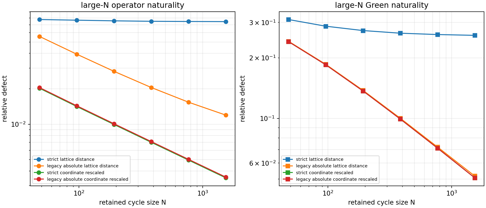
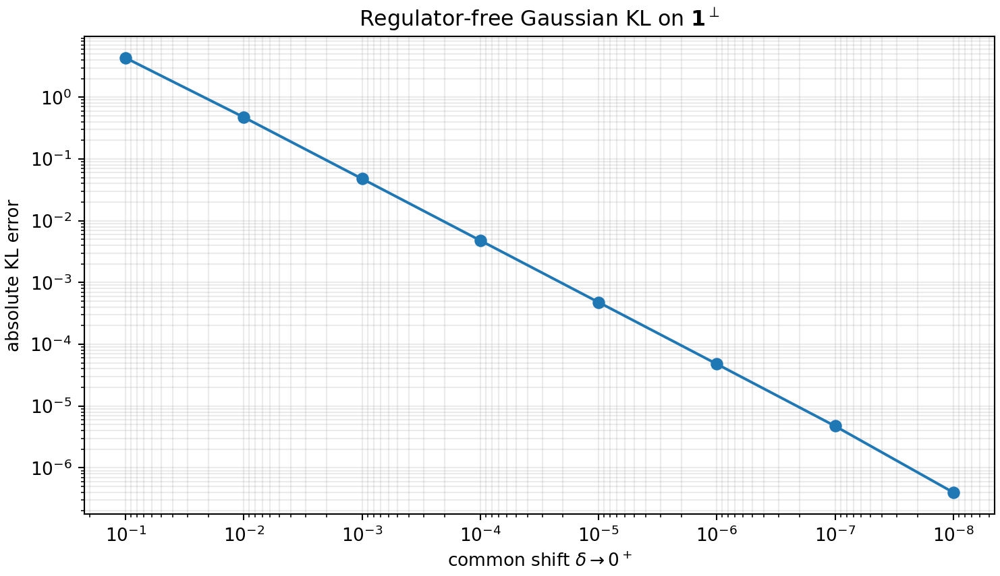
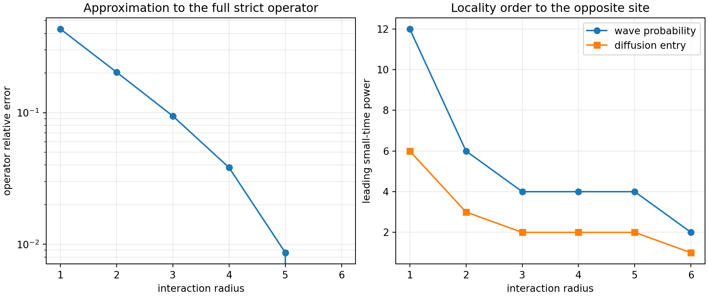
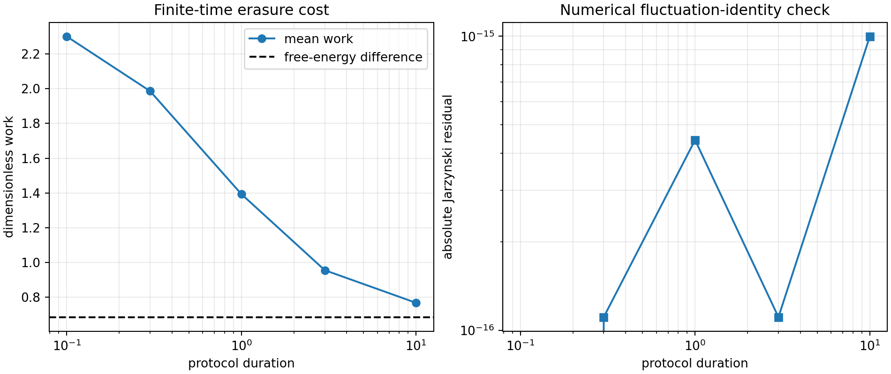
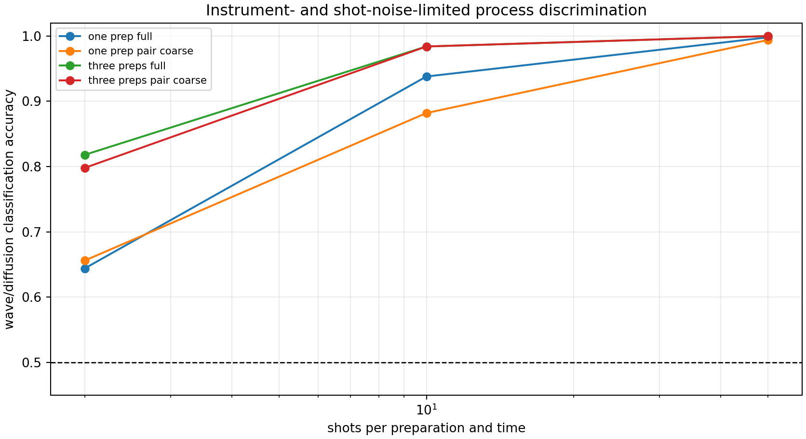
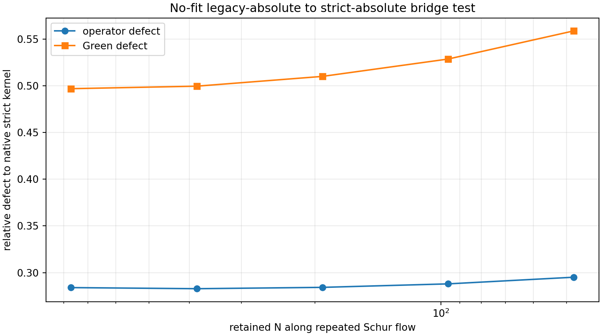

# FIN Programs 71–80

## Fourier-Symbol Renormalization, Quotient Information Geometry, and the Operational Bridge to Physics

**FIN Research Monograph — Release 10.8**  
**Author:** Krzysztof Żuchowski  
**Affiliation:** Independent Researcher — Fractal Information Theory Project  
**ORCID:** 0009-0002-0909-3613  
**Publication type:** Preprint  
**Version:** 1.0.0  
**Date:** 27 July 2026  
**Language:** English  
**License:** CC BY 4.0

## Confidence convention

- **[Proven]** analytic theorem or exact finite algebra under the displayed definitions.
- **[Strong evidence]** reproducible computation with a clear numerical margin and a fixed protocol.
- **[Moderate evidence]** a stable numerical pattern in the tested finite family.
- **[Conditional]** a result requiring a declared positive repair, scale convention, bath, state, preparation, instrument, or calibration.
- **[Refuted]** a stated bridge or uniqueness claim contradicted inside its declared test class.
- **[Open]** an obligation for which neither a theorem nor a valid counterexample has been obtained.

The FIN ontology is retained as a project premise: the nadsoliton is primordial fractal information in a solitonic state; no separate informational substrate is placed underneath it. This premise is not treated as experimentally established physics.

The strict and legacy kernels are kept distinct:

\[
K_{\mathrm{legacy,ont}}(d)
=
\alpha_{\mathrm{geo}}
\frac{\cos(\omega_Ld+\phi_L)}{1+\beta_{\mathrm{tors}}d},
\]

\[
K_{\mathrm{strict,gate}}(d)
=
\frac{\cos(\omega_Sd+\phi_S)}{1+\beta_Sd^{\eta_S}}.
\]

The legacy kernel is an intermediate bridge object, not a co-equal final kernel and not a silent substitute for the strict kernel. Absolute-value realizations used below are declared positive repairs. They do not prove the repository’s legacy-to-strict completion map and do not transfer legacy physical-role formulae.

No result in this monograph closes QW-2191, derives a unit of length or action, proves Lorentz invariance, derives a unique chiral state, establishes the full legacy-to-strict completion bridge, transfers legacy physical roles, constructs a unit-bearing \(L_{\mathrm{total}}\), or validates a Theory of Everything.

---

# Executive summary

Programs 71–80 continue the finite compression, observer, and information-to-physics studies of Programs 61–70. The new work replaces dense finite-size intuition by an exact Fourier-symbol treatment, extends projective tests to retained sizes as large as \(N=1536\), removes the common Laplacian zero mode without an infrared mass, quantifies the cost of imposing locality, and constructs explicit operational models for calibration, chirality, thermodynamics, and process discrimination.

The central conclusion is:

\[
\boxed{
\text{FIN supports exact finite spectral reduction and several rigorous conditional interfaces,}
}
\]

\[
\boxed{
\text{but the selector, scale, state law, and experimental semantics remain independent inputs.}
}
\]

The strongest results are the following.

1. **The Schur map has an exact Fourier-symbol theorem. [Proven]**  
   For the even/odd block symbol \(B(k)\),
   \[
   s(k)
   =
   B_{00}(k)
   -
   B_{01}(k)B_{11}(k)^{-1}B_{10}(k).
   \]
   The symbol implementation and dense Schur complement agree to relative residual
   \[
   9.97\times10^{-17}.
   \]

2. **The nearest-neighbour massive chain has an exact two-parameter RG map. [Proven]**  
   For
   \[
   A=mI+cL_{\mathrm{NN}},
   \]
   odd-site elimination gives
   \[
   c'=\frac{c^2}{m+2c},
   \qquad
   m'=\frac{m(m+4c)}{m+2c}.
   \]
   Hence \(r=m/c\) obeys \(r'=r(r+4)\). The only nonnegative fixed point is \(r=0\); its derivative is \(4\), so the mass ratio is relevant for the unrescaled map.

3. **Exact Schur algebra still does not imply a FIN continuum functor. [Strong negative evidence for the lattice-distance strict family]**  
   For the strict absolute lattice-distance family, the operator naturality defect falls only from \(0.07760\) at \(N=48\) to \(0.07451\) at \(N=1536\), while the Green defect remains \(0.25894\). This is a plateau, not evidence of zero-defect closure.

4. **Two decreasing large-\(N\) regimes exist, but both are conditional. [Moderate evidence]**  
   The legacy-absolute lattice-distance defects decrease with slopes approximately \(-0.446\) and \(-0.448\). Both coordinate-rescaled families \(K(d/N)\) decrease near \(N^{-1/2}\) in the operator norm. The first uses a positive repair; the second additionally imports a coordinate/length semantics. Their similarity also admits a generic dense-smooth-kernel explanation.

5. **Gaussian information geometry is well-defined without a mass regulator on \(\mathbf1^\perp\). [Proven]**  
   Restricting connected positive Laplacians to the orthogonal complement of the constant mode yields finite covariances and finite Gaussian relative entropy. The shifted full-space KL converges to the quotient value with absolute error \(3.99\times10^{-7}\) at \(\delta=10^{-8}\).

6. **Imposing locality has a measurable and unavoidable approximation cost. [Proven finite statement]**  
   At radius one, the opposite site on \(C_{12}\) first appears in \(L^6\); wave probability therefore begins at \(t^{12}\) and diffusion at \(t^6\). The full radial operator reaches it at first order. The radius-one operator differs from the full strict operator by \(0.4321\) in relative Frobenius norm.

7. **Three independent standards are sufficient and individually necessary for dimensional calibration. [Proven identifiability; conditional design]**  
   Length, clock, and energy records give a rank-three Fisher matrix for \((\log\ell_*,\log\tau_*,\log\hbar_*)\). Omitting any class reduces the rank to two. Under the declared noise model, the D-optimal allocation of 30 records is \(10/10/10\).

8. **A state can carry the missing chiral sign, but the kernel does not choose the state. [Proven interface; open source law]**  
   The current
   \[
   \Lambda(\rho,W)
   =
   \sum_i 2\,\operatorname{Im}
   \bigl(\rho_{i,i+1}W_{i+1,i}\bigr)
   \]
   is translation invariant and reflection odd. Fourier states \(k=\pm1\) give opposite nonzero values. The pair remains degenerate, so QW-2191 is transferred to the preparation or state-selection law, not solved.

9. **Finite-time erasure satisfies the second law and Jarzynski equality after a bath model is supplied. [Proven conditional instance]**  
   In a two-state driven Markov protocol, mean work exceeds
   \[
   \Delta F
   =
   \ln2-\ln(1+e^{-5})
   =
   0.6864318321,
   \]
   dissipation decreases with protocol duration, and the Jarzynski residual is below \(10^{-15}\). Temperature, Hamiltonian, bath, work, and clock remain imported.

10. **Wave and diffusion dynamics are operationally distinguishable under finite shot noise. [Strong synthetic evidence]**  
    In a deliberately short-time regime, one preparation with two shots per time gives accuracy \(0.644\) with a full instrument; three preparations give \(0.818\). With 50 shots the models are essentially perfectly separated. This validates an experimental design, not a physical realization.

11. **The simplest fixed Schur-flow legacy-to-strict bridge fails. [Refuted within the declared map]**  
    Starting from a row-normalized absolute legacy precision at \(N=1536\), repeated even-site elimination does not approach the native strict family. The Green defect rises from \(0.49688\) to \(0.55878\) by \(N=48\).

12. **An external-data protocol is now frozen before dataset selection. [Proven procedural result]**  
    The preregistration fixes observables, null models, splits, metrics, decision rules, and forbidden post-unblinding changes. Its canonical SHA-256 digest is
    `1a10b804a3e8265969fa66626f5152acc00830440841f2ddee6a8a59c018db4e`.

---

# Research design

## Fixed finite kernels

The numerical work uses the frozen parameter values

\[
\alpha_{\mathrm{geo}}=4\ln2,\quad
\beta_{\mathrm{tors}}=0.01,\quad
\omega_L=\frac{\pi}{4},\quad
\phi_L=\frac{\pi}{6},
\]

\[
\omega_S=0.18575,\quad
\phi_S=0.16250,\quad
\beta_S=1,\quad
\eta_S=1.8.
\]

On the cycle \(C_N\), the radial distance is

\[
d_N(i,j)=\min\{|i-j|,N-|i-j|\}.
\]

When positivity is required, the declared repaired weights are

\[
w_{ij}
=
\frac{|K(d_N(i,j))|}
{\sum_{k\ne i}|K(d_N(i,k))|},
\qquad
w_{ii}=0,
\]

and

\[
A_N=\frac14I+L(w),
\qquad
L(w)=\operatorname{diag}(w\mathbf1)-w.
\]

This positive operator supports Green functions, Gaussian covariances, Markov semigroups, and Schur elimination. The raw signed legacy operator is not silently identified with it.

## Separation of mathematical layers

Every executed program distinguishes four layers:

1. **strict mathematical core:** finite operator identities independent of a physical interpretation;
2. **declared realization:** positive repair, normalization, quotient, or coordinate convention;
3. **operational augmentation:** state, preparation, clock, instrument, bath, environment, and record law;
4. **physical evidence:** comparison with independently produced experimental data.

Programs 71–79 reach only the first three layers. Program 80 freezes a route to the fourth but does not yet contain data.

---

# Program 71 — Exact Fourier-symbol Schur map

## Question

Can binary Green-Schur compression be written as an analytic map on the spectral symbol rather than recomputed by dense matrix inversion?

## Theorem 71.1 — Block-symbol elimination

Let \(A\) be a real symmetric positive circulant operator on \(C_{2N}\). Reorder sites into even and odd subsets. The discrete Fourier transform on the retained \(C_N\) diagonalizes the block-circulant matrix:

\[
\widehat A(k)
=
\begin{pmatrix}
B_{00}(k)&B_{01}(k)\\
B_{10}(k)&B_{11}(k)
\end{pmatrix}.
\]

If \(B_{11}(k)\ne0\) for every \(k\), the odd-site Schur complement has scalar symbol

\[
\widehat{\mathcal S(A)}(k)
=
B_{00}(k)
-
B_{01}(k)B_{11}(k)^{-1}B_{10}(k).
\]

For the symmetric scalar case,

\[
\widehat{\mathcal S(A)}(k)
=
a(k)-\frac{|b(k)|^2}{a(k)}.
\]

### Proof

The even/odd permutation converts a circulant matrix into a \(2\times2\) block-circulant matrix. Fourier transformation diagonalizes every block simultaneously. Schur complementation then acts independently at each Fourier mode. Inverse transformation reconstructs the retained circulant operator. Positivity of \(A\) makes the eliminated block positive and hence invertible in the massive realization.

## Verification

For the strict positive precision on \(C_{24}\), the relative difference between the dense Schur complement and the inverse-transformed symbol formula is

\[
9.9704\times10^{-17}.
\]

This is floating-point agreement at machine precision.

## Theorem 71.2 — Exact massive nearest-neighbour map

Let

\[
A=mI+cL_{\mathrm{NN}},
\qquad m>0,\quad c>0,
\]

where the cycle nearest-neighbour Laplacian has diagonal \(2\) and adjacent entries \(-1\). Eliminating every odd site gives the same operator form on \(C_N\):

\[
\mathcal S(A)=m'I+c'L_{\mathrm{NN}},
\]

with

\[
c'=\frac{c^2}{m+2c},
\qquad
m'=\frac{m(m+4c)}{m+2c}.
\]

For the dimensionless ratio \(r=m/c\),

\[
r'=r(r+4).
\]

The algebraic fixed points are \(r=0\) and \(r=-3\). Only \(r=0\) lies in the nonnegative cone. Since

\[
\left.\frac{dr'}{dr}\right|_{r=0}=4,
\]

the mass ratio is a relevant direction for this unrescaled blocking map.

The numerical residual of the formula at \(m=0.37\), \(c=1.21\) is

\[
1.96\times10^{-16}.
\]

## Verdict

**[Proven]** Binary Schur elimination is an exact analytic operation on the Fourier symbol.

**[Proven distinction]** The theorem proves the coarse operator produced from a parent. It does not prove equality with a separately defined native FIN kernel at the retained resolution.

**[Research consequence]** Future continuum work should analyze symbol maps and their rescalings, not infer RG closure from finite matrix composition alone.

---

# Program 72 — Large-\(N\) projective scaling

## Question

Do the native and Schur-compressed operator families become equal as \(N\to\infty\)?

## Two non-equivalent discretizations

The experiment separates:

\[
\text{lattice-distance family: }K_N(i,j)=K(d_N(i,j)),
\]

from

\[
\text{coordinate-rescaled family: }K_N(i,j)=K(d_N(i,j)/N).
\]

The second choice supplies a compact coordinate of circumference one. It therefore imports a geometric scaling rule absent from the dimensionless kernel alone.

For both families, the parent \(C_{2N}\) is Schur-compressed to \(C_N\), and both the compressed and native precisions are normalized to unit diagonal. The defects are

\[
\varepsilon_A(N)
=
\frac{\|\mathcal S(A_{2N})-A_N\|_F}{\|A_N\|_F},
\]

\[
\varepsilon_G(N)
=
\frac{\|\mathcal S(A_{2N})^{-1}-A_N^{-1}\|_F}
{\|A_N^{-1}\|_F}.
\]

## Results

| Family | \(\varepsilon_A(48)\) | \(\varepsilon_A(1536)\) | operator slope | \(\varepsilon_G(1536)\) | Green slope |
|---|---:|---:|---:|---:|---:|
| strict, lattice \(d\) | 0.077602 | 0.074508 | \(-0.0119\) | 0.258937 | \(-0.0503\) |
| legacy absolute, lattice \(d\) | 0.055699 | 0.011949 | \(-0.4465\) | 0.051760 | \(-0.4480\) |
| strict, coordinate \(d/N\) | 0.020196 | 0.003499 | \(-0.5054\) | 0.050687 | \(-0.4524\) |
| legacy absolute, coordinate \(d/N\) | 0.020471 | 0.003549 | \(-0.5052\) | 0.050691 | \(-0.4524\) |



## Falsification and alternative explanation

The strict lattice-distance operator defect changes by less than four percent between \(N=48\) and \(N=1536\). The fitted slope \(-0.0119\) is consistent with an approach to a nonzero plateau. Therefore the tested strict family does not currently define a native Schur-projective continuum system.

The legacy-absolute lattice family is more promising, but its result belongs to the repaired positive kernel. It cannot be transferred to the raw signed legacy object or to strict completion.

The two coordinate-rescaled families are numerically almost indistinguishable at large \(N\). A parsimonious explanation is that any smooth radial kernel sampled only on \(x=d/N\in[0,1/2]\), then absolute-valued and row-normalized, enters a common dense-kernel discretization regime. Thus the observed \(N^{-1/2}\)-like behavior may be generic quadrature behavior rather than a signature unique to FIN.

## Verdict

**[Strong negative evidence]** The strict lattice-distance family does not show zero-defect projective closure through \(N=1536\).

**[Moderate evidence]** Legacy-absolute lattice and both coordinate-rescaled families have decreasing defects.

**[Conditional]** Coordinate rescaling is a proposed geometric semantics, not a derived physical length.

**[Open]** A theorem must classify the limiting symbol, the normalization, and the correct field rescaling before a continuum claim is admissible.

---

# Program 73 — Regulator-free information geometry on \(\mathbf1^\perp\)

## Question

Can information geometry be defined for a graph Laplacian without retaining the artificial mass floor \(\delta I\)?

## Theorem 73.1 — Quotient Gaussian measure

Let \(L\) be the Laplacian of a connected positive weighted graph. Its kernel is

\[
\ker L=\operatorname{span}\{\mathbf1\}.
\]

On

\[
H_0=\mathbf1^\perp,
\]

the restriction \(L_0=L|_{H_0}\) is positive definite. It therefore defines the regulator-free covariance

\[
C_0=L_0^{-1}.
\]

For two connected positive Laplacians \(L\) and \(M\) on the same vertex set, the centered Gaussian relative entropy on \(H_0\) is

\[
D_{\mathrm{KL}}(L\|M)
=
\frac12
\left[
\operatorname{tr}(C_M^{-1}C_L)
-(N-1)
+\log\frac{\det C_M}{\det C_L}
\right].
\]

This quantity is finite and basis-independent.

## Shifted-limit theorem

Let

\[
C_{L,\delta}=(L+\delta I)^{-1},
\qquad
C_{M,\delta}=(M+\delta I)^{-1}.
\]

If both Laplacians have exactly the same constant zero mode, the two zero-mode covariances are both \(\delta^{-1}\). Their KL contribution is exactly zero. The remaining modes converge to the quotient covariances; hence

\[
\lim_{\delta\to0^+}
D_{\mathrm{KL}}
\bigl(
\mathcal N(0,C_{L,\delta})
\|
\mathcal N(0,C_{M,\delta})
\bigr)
=
D_{\mathrm{KL}}(L_0\|M_0).
\]

## Results for \(C_{12}\)

Using the strict absolute and legacy absolute Laplacians with their frozen raw amplitudes:

\[
D_{\mathrm{KL}}(\mathrm{strict}\|\mathrm{legacy})
=
47.6804886423,
\]

\[
D_{\mathrm{KL}}(\mathrm{legacy}\|\mathrm{strict})
=
8.0627221376.
\]

The asymmetry is expected because relative entropy is directed. The shifted full-space value approaches the first quotient value as follows:

| \(\delta\) | absolute error |
|---:|---:|
| \(10^{-2}\) | \(4.7305\times10^{-1}\) |
| \(10^{-4}\) | \(4.7805\times10^{-3}\) |
| \(10^{-6}\) | \(4.7813\times10^{-5}\) |
| \(10^{-8}\) | \(3.9894\times10^{-7}\) |



## Verdict

**[Proven]** The quotient \(H_0=\mathbf1^\perp\) removes the common gauge-like constant mode without inserting a mass.

**[Conditional]** The numerical KL values depend on the absolute-value realization and amplitude convention. They are mathematical distances between declared models, not measured physical information.

**[Important advance]** Static Green information can be separated into a divergent common mode and a finite relational sector. This is a cleaner basis for future information geometry than a permanently fixed infrared regulator.

---

# Program 74 — Locality versus fidelity

## Question

Can a finite propagation hierarchy be obtained by truncating the strict radial operator, and what mathematical information is lost?

## Construction

Let \(W\) be the row-normalized strict absolute weight matrix on \(C_{12}\). For radius \(R\),

\[
W^{(R)}_{ij}
=
W_{ij}
\mathbf1\{d(i,j)\le R\},
\]

where juxtaposition with the indicator denotes entrywise retention, not
addition of a new physical field. Define

\[
L^{(R)}
=
\operatorname{diag}(W^{(R)}\mathbf1)-W^{(R)}.
\]

If \(m_R\) is the smallest integer for which

\[
\bigl(L^{(R)}\bigr)^{m_R}_{6,0}\ne0,
\]

then

\[
\left|
\langle6|e^{-itL^{(R)}}|0\rangle
\right|^2
=
O(t^{2m_R}),
\]

whereas

\[
\left(e^{-tL^{(R)}}\right)_{6,0}
=
O(t^{m_R}).
\]

## Results

| Radius \(R\) | operator error | \(m_R\) | wave power | diffusion power | wave TV at \(t=1\) | diffusion TV at \(t=1\) |
|---:|---:|---:|---:|---:|---:|---:|
| 1 | 0.432079 | 6 | 12 | 6 | 0.033189 | 0.280269 |
| 2 | 0.202795 | 3 | 6 | 3 | 0.008778 | 0.137608 |
| 3 | 0.094208 | 2 | 4 | 2 | 0.002532 | 0.065960 |
| 4 | 0.038200 | 2 | 4 | 2 | 0.000819 | 0.025777 |
| 5 | 0.008626 | 2 | 4 | 2 | 0.000210 | 0.004766 |
| 6 | 0 | 1 | 2 | 1 | 0 | 0 |



## Interpretation

The full strict radial kernel directly couples the source to the opposite site and therefore has \(m_6=1\). A radius-one graph has the familiar six-edge path and hence \(m_1=6\).

The wave output is less sensitive than diffusion at \(t=1\) in this test, but neither evolution is unchanged. A local truncation is a new model with a controlled approximation error. It is not a proof that the original full kernel possesses an exact causal cone.

## Verdict

**[Proven]** The leading short-time order is determined by the first nonzero matrix power and changes systematically with interaction radius.

**[Refuted]** Exact finite-range causality is not a property of the untruncated radial \(C_{12}\) kernel.

**[Open]** A continuum causal theory would need either a derived locality mechanism, an admissible rapidly decaying Lieb–Robinson-type bound, or an additional causal order.

---

# Program 75 — Noisy dimensional calibration

## Question

If FIN supplies only dimensionless spectral variables, what is the smallest operational record that identifies physical length, time, and action scales in the presence of noise?

## Log-linear model

Let

\[
\theta
=
(\log\ell_*,\log\tau_*,\log\hbar_*).
\]

Use three independent observation classes:

\[
j_L=(1,0,0),
\qquad
j_T=(0,1,0),
\qquad
j_E=(0,-1,1).
\]

The energy row follows the dimensional relation \(E_*\propto\hbar_*/\tau_*\). If class \(a\) has \(n_a\) independent records with log-noise \(\sigma_a\), the Fisher matrix is

\[
F
=
\sum_a\frac{n_a}{\sigma_a^2}j_a^Tj_a.
\]

The declared standard deviations are

\[
\sigma_L=0.010,\qquad
\sigma_T=0.005,\qquad
\sigma_E=0.020.
\]

## Theorem 75.1 — Minimal rank

The three rows are linearly independent, so the full design has rank three. Every pair has rank two. Therefore each of the three operational classes is necessary within this parameterization.

This is an identifiability theorem, not a theorem that FIN internally generates any of the standards.

## D-optimal result

Among positive integer allocations satisfying

\[
n_L+n_T+n_E=30,
\]

the determinant of \(F\) is maximized by

\[
(n_L,n_T,n_E)=(10,10,10).
\]

The Fisher matrix is

\[
F=
\begin{pmatrix}
100000&0&0\\
0&425000&-25000\\
0&-25000&25000
\end{pmatrix},
\]

with condition number \(18.1950\). The Cramér–Rao one-sigma bounds for the log parameters are

\[
(0.0031623,\;0.0015811,\;0.0065192).
\]

## Verdict

**[Proven]** A length standard, clock, and energy/action record are jointly sufficient and individually necessary for this three-scale model.

**[Conditional]** The noise levels and records are external operational assumptions.

**[Impossibility within the dimensionless core]** Dimensionless spectral relations determine only ratios. An absolute dimensionful scale cannot be extracted without at least one dimensionful comparison standard or an equivalent convention.

---

# Program 76 — State-dependent chiral current

## Question

Can the missing orientation sign arise from a nonradial state coupled to a real radial kernel, rather than from the kernel alone?

## Construction

Let \(W=W^T\) be real and let \(\rho\) be a density matrix. Define the edge current

\[
J_{ij}
=
2\,\operatorname{Im}
\bigl(\rho_{ij}W_{ji}\bigr).
\]

After a cyclic orientation has been declared, define

\[
\Lambda(\rho,W)
=
\sum_{i\in\mathbb Z_{12}}J_{i,i+1}.
\]

For a Fourier state

\[
\psi^{(k)}_j
=
\frac1{\sqrt{12}}
\exp\left(\frac{2\pi ikj}{12}\right),
\qquad
\rho^{(k)}=|\psi^{(k)}\rangle\langle\psi^{(k)}|,
\]

the current is translation invariant. Reflection maps \(k\mapsto-k\) and

\[
\Lambda(\rho^{(-k)},W)
=
-\Lambda(\rho^{(k)},W).
\]

## Results

| Kernel | \(k=0\) | \(k=+1\) | \(k=-1\) | max covariance residual |
|---|---:|---:|---:|---:|
| strict raw radial | 0 | \(-0.4699857\) | \(+0.4699857\) | \(1.11\times10^{-16}\) |
| legacy raw signed | 0 | \(-0.7104938\) | \(+0.7104938\) | \(2.22\times10^{-16}\) |

## Falsification

The construction succeeds in producing a nonzero pseudoscalar from a state-kernel pair. It fails as an internal selector theorem because:

1. the real radial kernel leaves \(k=+1\) and \(k=-1\) degenerate;
2. the oriented edge sum already assumes a choice of cyclic orientation;
3. no current strict artifact derives a unique nonzero chiral density matrix;
4. preparation of one Fourier state rather than its reflected partner is operational input.

## Verdict

**[Proven]** A nonradial state is mathematically the correct type of object for carrying a reflection-odd current.

**[Open]** FIN lacks a non-premise law selecting the sign of that state.

**[Guardrail]** This result does not discharge QW-2191. It localizes the missing theorem more precisely: a valid completion would require a strict state-generation law with a nonzero signed chiral expectation and a proved coupling to the orientation torsor.

---

# Program 77 — Finite-time Landauer and Jarzynski bridge

## Question

Does the information-to-thermodynamics bridge survive away from a reversible quasistatic limit?

## Conditioned protocol

Consider a two-state memory with inverse temperature \(\beta=1\). The excited-state energy is driven linearly from \(0\) to \(5\) over duration \(\tau\), using 600 discrete quenches. After each quench the state partially relaxes toward the instantaneous Gibbs distribution:

\[
p^{\mathrm{eq}}(E)
=
\frac{(1,e^{-E})}{1+e^{-E}}.
\]

The transition matrix is

\[
T_E
=
(1-r)I+r\,p^{\mathrm{eq}}(E)\mathbf1^T,
\qquad
r=1-e^{-3\Delta t}.
\]

It preserves the instantaneous Gibbs state. Work is accumulated during each energy quench. This is a fully specified external bath-and-drive model.

## Exact free-energy difference

\[
\Delta F
=
\ln2-\ln(1+e^{-5})
=
0.6864318321.
\]

## Results

| duration \(\tau\) | mean work | dissipated work | work variance | final excited probability | Jarzynski residual |
|---:|---:|---:|---:|---:|---:|
| 0.1 | 2.300805 | 1.614374 | 5.644913 | 0.403039 | \(0\) |
| 0.3 | 1.986411 | 1.299980 | 4.581229 | 0.265810 | \(1.11\times10^{-16}\) |
| 1.0 | 1.393799 | 0.707368 | 2.316762 | 0.075409 | \(4.44\times10^{-16}\) |
| 3.0 | 0.956235 | 0.269803 | 0.699216 | 0.014309 | \(1.11\times10^{-16}\) |
| 10.0 | 0.768447 | 0.082016 | 0.178115 | 0.007985 | \(9.99\times10^{-16}\) |



The calculation satisfies

\[
\langle W\rangle\ge\Delta F
\]

at every duration, and

\[
\left\langle e^{-W}\right\rangle
=
e^{-\Delta F}
=
0.5033689735
\]

to numerical precision.

## Verdict

**[Proven conditional instance]** The finite-time model satisfies the second-law inequality and Jarzynski equality.

**[Proven]** Shannon’s one-bit distinction alone is insufficient to define this protocol. The bridge requires a Hamiltonian, inverse temperature, Gibbs state, bath transition law, clocked driving protocol, and a work record.

**[Not derived]** No value of \(k_B\), temperature, energy, or time is generated by the dimensionless FIN operator.

---

# Program 78 — Shot-noise-limited process tomography

## Question

Can an operational experiment distinguish

\[
U_t=e^{-itL}
\]

from

\[
P_t=e^{-tL}
\]

when both are generated from the same positive strict operator and only finite records are available?

## Model

For a localized preparation \(|x\rangle\), the wave output law is

\[
q_t(y|x)
=
|\langle y|U_t|x\rangle|^2,
\]

and the diffusion output law is

\[
p_t(y|x)
=
(P_t)_{yx}.
\]

The deliberately difficult short-time window is

\[
t\in\{0.03,0.06,0.12\}.
\]

Two instruments are tested:

1. full twelve-site readout;
2. coarse readout that merges adjacent sites into six bins.

Maximum likelihood chooses between the two frozen process models. There is no parameter fitting.

## Results

| Preparation/instrument | 2 shots | 10 shots | 50 shots |
|---|---:|---:|---:|
| one preparation, full | 0.644 | 0.938 | 0.998 |
| one preparation, adjacent pairs | 0.656 | 0.882 | 0.994 |
| three preparations, full | 0.818 | 0.984 | 1.000 |
| three preparations, adjacent pairs | 0.798 | 0.984 | 1.000 |

Each entry is the accuracy over 500 balanced synthetic trials.



## Interpretation

At small \(t\), off-diagonal diffusion probabilities change at order \(t\), while wave probabilities change at order \(t^2\). This difference survives realistic multinomial sampling and moderate coarse graining.

The result supplies a minimal experimental logic:

\[
\text{preparation}
\longrightarrow
\text{evolution time}
\longrightarrow
\text{instrument}
\longrightarrow
\text{record likelihood}.
\]

Without those objects, the mathematical coexistence of \(U_t\) and \(P_t\) is not an observer paradox. It is merely the existence of two functional calculi.

## Verdict

**[Strong synthetic evidence]** The two dynamics are operationally distinguishable with finite data.

**[Conditional]** The conclusion assumes the stated preparation, clock, instrument, and record law.

**[Not physical evidence]** Synthetic records generated from the compared models cannot determine which law nature implements.

---

# Program 79 — Fixed legacy-to-strict Schur-flow test

## Question

Does the repaired legacy operator flow toward the repaired strict operator under the simplest possible repeated binary information elimination?

## Frozen no-fit map

1. construct the absolute-value, row-normalized legacy precision on \(C_{1536}\);
2. add the fixed mass \(1/4\);
3. eliminate every odd site by the exact symbol Schur map;
4. normalize the retained precision to unit diagonal;
5. compare with the independently constructed native strict absolute precision;
6. repeat without fitting any parameter.

## Results

| retained \(N\) | Schur steps | operator defect to strict | Green defect to strict |
|---:|---:|---:|---:|
| 768 | 1 | 0.283948 | 0.496876 |
| 384 | 2 | 0.282770 | 0.499567 |
| 192 | 3 | 0.284204 | 0.510035 |
| 96 | 4 | 0.287944 | 0.528627 |
| 48 | 5 | 0.295072 | 0.558777 |



The operator defect has one small initial decrease and then rises. The Green defect increases monotonically.

## Verdict

**[Refuted within the declared map]** Repeated even-site Schur elimination of the positive repaired legacy precision does not produce the native strict family.

**[Not a global no-go]** This calculation does not exclude every possible completion map. A different bridge would have to introduce and justify genuinely new typed data: nonlinear compression, phase/topological completion, scaling, or another source atom.

**[Guardrail]** The result does not license role transfer and does not demote the repository’s legacy object from its stated intermediate status. It rejects only the simplest no-fit Schur-flow identification.

---

# Program 80 — Frozen external-data protocol

## Objective

Prevent post-hoc adaptation before any claim of experimentally meaningful physics.

## Frozen components

The preregistration fixes:

- strict and legacy-intermediate candidate forms;
- nearest-neighbour, exponential, power-law, and phase-randomized nulls;
- preparation, instrument, calibration, environment, boundary-condition, and raw-count requirements;
- a \(60/20/20\) training/validation/hidden-test split;
- held-out predictive log likelihood, calibration-marginalized KL divergence, posterior predictive residuals, and complexity-penalized scores;
- support, falsification, and inconclusive decision rules;
- a prohibition on changing kernel parameters, coordinate semantics, observables, bins, or accepted preparations after unblinding;
- an explicit prohibition on treating synthetic FIN-generated records as external evidence.

No dataset was selected or inspected before freezing.

The canonical core digest is:

`1a10b804a3e8265969fa66626f5152acc00830440841f2ddee6a8a59c018db4e`

## Verdict

**[Proven procedural result]** The protocol is reproducible and cryptographically frozen.

**[No evidence yet]** Preregistration controls bias; it does not itself test physics.

**[Next gate]** Select an independently produced dataset whose preparation, instrument, calibration, environment, and raw records satisfy the frozen requirements.

---

# Integrated theorem and obstruction map

## What is now mathematically secure

The following chain survives the current falsification tests:

\[
\text{real symmetric positive realization}
\Longrightarrow
\text{spectral measure}
\Longrightarrow
\begin{cases}
\text{Green/resolvent calculus},\\
\text{unitary functional calculus},\\
\text{contractive diffusion},\\
\text{Gaussian quotient geometry},\\
\text{exact Schur reduction}.
\end{cases}
\]

This is operator theory. It is rigorous and reusable.

## What requires a declared realization

\[
\text{raw FIN kernel}
\not\Longrightarrow
\text{positive Markov generator}.
\]

Absolute values, positive parts, shifts, and row normalizations are mathematical constructions with different semantics. They must remain named.

Likewise:

\[
K(d)
\not\equiv
K(d/N).
\]

The latter contains a coordinate scaling convention.

## What requires an operational package

The smallest current operational tuple is

\[
\mathfrak O
=
(\rho,\mathcal E_t,\mathcal P,\mathcal I,\mathcal A,\mathcal R,\mathcal C),
\]

where:

- \(\rho\) is a state;
- \(\mathcal E_t\) is the selected dynamical law and clock parameterization;
- \(\mathcal P\) is preparation;
- \(\mathcal I\) is an instrument or POVM;
- \(\mathcal A\) is apparatus/environment;
- \(\mathcal R\) is the record map;
- \(\mathcal C\) is dimensional calibration.

For thermodynamics one must additionally specify a bath, Hamiltonian protocol, temperature, and work/heat convention.

## Current obstruction table

| Desired object | Best valid result | Missing theorem or datum | Status |
|---|---|---|---|
| exact finite compression | Fourier-symbol Schur theorem | none in finite positive scope | Proven |
| native strict continuum functor | large-\(N\) defect test | vanishing-defect symbol theorem and rescaling | Open; plateau evidence |
| relational information geometry | quotient on \(\mathbf1^\perp\) | physical semantics of Gaussian measure | Proven mathematical |
| exact causal cone | truncation hierarchy | derived locality or causal order | Refuted for full radial graph |
| dimensional scale | rank-three calibration | physical standards | impossible from ratios alone |
| chiral sign | state current \(\Lambda(\rho,W)\) | strict law selecting one chiral state/sign | Open |
| physical time law | \(U_t\) and \(P_t\) both valid | operational selection principle | Open |
| thermodynamic entropy | finite-time bath protocol | bath, \(T\), Hamiltonian, instruments | Conditional |
| legacy-to-strict bridge | no-fit Schur-flow test | typed completion data and theorem | simple map refuted |
| experiment | frozen protocol | independent admissible data | Not yet performed |

---

# Deepest interpretation after Programs 71–80

The most defensible interpretation is not “a physical law already encoded in one kernel.” It is:

\[
\boxed{
\text{a dimensionless spectral-operator framework with exact information reduction}
}
\]

\[
\boxed{
\text{that becomes physics only after a state-selection and operational calibration functor is supplied.}
}
\]

The spectral theorem explains why one positive operator generates Green functions, wave dynamics, diffusion, Gaussian fields, variational quadratic forms, and spectral information measures. Schur complementation explains exact elimination of hidden finite degrees of freedom. Neither theorem selects:

- a direction of time;
- a chiral orientation;
- a state of the universe;
- a measurement context;
- a dimensional standard;
- a continuum coordinate;
- a local causal structure;
- a Hamiltonian rather than a Markov interpretation;
- a relation to observed records.

The missing physical principle is therefore not one more function of the same radial operator. It must be a law that connects the operator to the operational tuple \(\mathfrak O\) and is sufficiently restrictive to produce risky, calibrated predictions.

A candidate “missing theorem” would need the following form:

\[
\mathcal T:
(K_{\mathrm{strict}},\text{strict internal data})
\longmapsto
(\rho_*,\mathcal E_*,\mathcal P_*,\mathcal I_*,\mathcal C_*)
\]

such that:

1. the output is invariant under unphysical presentation choices;
2. the output breaks only those symmetries required by the observations;
3. no arbitrary unit or selector is hidden in the construction;
4. the induced record probabilities are unique up to explicitly characterized equivalence;
5. at least one dimensionless observable differs from frozen null models;
6. the prediction survives independent data under Program 80.

No such theorem is currently established.

---

# Failed approaches and corrected claims

## Exact reduction is not continuum closure

Schur composition and Fourier exactness guarantee internally consistent coarse operators. They do not guarantee that a separately postulated native family is closed under that map.

## Coordinate rescaling is not an emergent unit

The encouraging \(K(d/N)\) scaling supplies a coordinate convention. It neither determines a length in metres nor proves that this convention is physically preferred.

## A chiral representation is not a chiral source

The state-current formula accepts and transports a sign correctly. The degenerate pair \(k=\pm1\) proves that representation-theoretic admissibility does not choose the sign.

## Landauer is not a conversion constant

Landauer/Jarzynski relations become exact after a temperature, Hamiltonian, bath, clock, and work protocol are defined. They do not convert dimensionless Shannon information into joules without those physical objects.

## Synthetic discriminability is not validation

The wave and diffusion processes are easy to distinguish once preparations and instruments are specified. Synthetic success shows experimental identifiability, not empirical truth.

## The simplest bridge is not the completion bridge

The failed Schur flow rules out one attractive low-complexity legacy-to-strict identification. It does not justify inventing an unfalsifiable map with arbitrary fitted additions.

---

# Recommended Programs 81–92

The following twelve programs are ranked by expected scientific value and probability of producing a decisive result. Probabilities estimate the chance of obtaining a publishable theorem, obstruction, or reproducible falsification result—not the chance of confirming FIN.

## Ranked roadmap

| Rank | Program | Primary target | Success probability | Required new input |
|---:|---:|---|---:|---|
| 1 | 81 | analytic large-\(N\) symbol limit | 0.82 | none beyond current definitions |
| 2 | 82 | fixed-point classification for positive radial symbols | 0.78 | function-space assumptions |
| 3 | 84 | locality/Lieb–Robinson bound for decaying FIN couplings | 0.75 | declared metric and decay norm |
| 4 | 83 | coordinate-rescaling universality theorem | 0.72 | continuum sampling semantics |
| 5 | 85 | quotient action and entropy production | 0.70 | positive realization |
| 6 | 89 | process-tensor operational completion | 0.68 | explicit instrument family |
| 7 | 87 | dynamical stability of chiral states | 0.64 | candidate state-generation law |
| 8 | 86 | robust calibration under model uncertainty | 0.62 | external standard uncertainties |
| 9 | 88 | feedback thermodynamics and mutual information | 0.58 | measurement-feedback protocol |
| 10 | 90 | preregistered external-data pilot | 0.45 | independent admissible dataset |
| 11 | 91 | typed completion-map acceptance test | 0.38 | one genuinely new bridge atom |
| 12 | 92 | theorem consolidation and archival release | 0.90 | completion of 81–89 results |

## Program 81 — Analytic large-\(N\) symbol limit

**Objective.** Prove or refute the observed asymptotic slopes without further finite-size extrapolation.

**Method.**

1. derive the discrete Fourier symbols for the lattice and coordinate-rescaled rows;
2. estimate the Schur-symbol defect uniformly in momentum;
3. separate low-frequency, bulk, and Nyquist sectors;
4. determine whether the strict lattice defect has a nonzero limiting function;
5. derive error bounds strong enough to imply the Frobenius and Green slopes.

**Decisive output.** A theorem giving either

\[
\varepsilon_A(N)\to0
\]

with a rate, or

\[
\liminf_{N\to\infty}\varepsilon_A(N)>0.
\]

## Program 82 — Classification of radial Schur fixed points

**Objective.** Determine which translation-invariant positive symbols are closed under binary Schur elimination after admissible rescaling.

**Method.** Study the nonlinear functional map

\[
\mathcal R[a,b](k)
=
a(k)-\frac{|b(k)|^2}{a(k)}
\]

on a declared cone of positive even symbols. Classify fixed points, stable manifolds, relevant directions, and normalization dependence.

**Falsification criterion.** If the FIN symbol lies outside every basin compatible with its frozen parameters, the proposed continuum RG interpretation fails for that map.

## Program 83 — Coordinate-rescaling universality theorem

**Objective.** Decide whether the nearly identical strict and legacy \(K(d/N)\) slopes carry FIN-specific information.

**Method.** Prove a quadrature/naturality theorem for smooth radial functions on the unit circle under row normalization. Compare analytic rates for constant, exponential, rational, strict, and legacy profiles.

**Scientific value.** A generic theorem would demote the current scaling match from model evidence to a discretization effect. A failure of the generic theorem at the FIN profile would identify a genuinely distinctive invariant.

## Program 84 — Decaying-interaction propagation bounds

**Objective.** Replace the false exact cone by the strongest valid approximate causal estimate.

**Method.**

1. place the positive strict operator on cycles and an infinite graph limit;
2. compute exponential or polynomial interaction norms;
3. derive a finite-volume Lieb–Robinson-type bound when the decay assumptions permit it;
4. determine how the exponent \(\eta_S=1.8\) changes the cone or tail;
5. distinguish quantum-amplitude bounds from Markov heat-kernel bounds.

**Guardrail.** A bound in graph distance is not Lorentz invariance and does not supply a physical speed until length and time are calibrated.

## Program 85 — Quotient variational action and entropy

**Objective.** Formulate the quadratic action, Gaussian measure, and entropy production directly on \(\mathbf1^\perp\), with no mass regulator.

**Method.** Use pseudodeterminants, quotient Green functions, and Dirichlet forms. Prove which observables are invariant under addition of a constant field and which adaptive laws preserve the quotient.

**Decisive question.** Does the adaptive kernel dynamics define a gradient flow of a well-defined quotient free-energy functional, or is an additional metric required?

## Program 86 — Robust operational calibration

**Objective.** Extend Program 75 to correlated noise, uncertain standards, nuisance parameters, and missing observation classes.

**Method.** Compute Bayesian and minimax designs; derive profile likelihoods for \((\ell_*,\tau_*,\hbar_*)\); test robustness to clock drift and distance-map uncertainty.

**Success criterion.** A pre-experimental design whose confidence region remains finite under the declared nuisance model.

## Program 87 — Chiral-state generation and stability

**Objective.** Determine whether a state law can produce and stabilize one nonzero sign of \(\Lambda(\rho,W)\).

**Method.**

1. test strict adaptive dynamics on the \(k=\pm1\) subspace;
2. derive the reflection action on the state generator;
3. identify whether bifurcation creates two symmetry-related attractors;
4. distinguish spontaneous branch multiplicity from a theorem selecting one branch;
5. search for a nonzero signed invariant that couples to the existing orientation torsor.

**Guardrail.** Two stable chiral attractors are spontaneous symmetry breaking, not a unique selector unless preparation or boundary data choose a branch.

## Program 88 — Feedback information thermodynamics

**Objective.** Extend Program 77 from open-loop erasure to measurement and feedback.

**Method.** Introduce a noisy instrument, mutual information, controller, and memory reset. Verify generalized Jarzynski/Sagawa–Ueda relations and quantify the energetic price of the apparatus record.

**Scientific value.** This tests the full observer package rather than treating information as a free thermodynamic substance.

## Program 89 — Process tensor for the observer problem

**Objective.** Represent preparation, environment, intervention, apparatus, and record in one operational object.

**Method.** Construct finite process tensors for the unitary and diffusive branches, include intermediate interventions, and derive the minimal instrument sequence that separates them under nuisance noise.

**Decisive output.** An experimentally implementable witness expressed entirely in record probabilities.

## Program 90 — Preregistered external-data pilot

**Objective.** Execute Program 80 on data not produced by FIN or by a FIN-tuned simulator.

**Entry requirements.**

- documented preparation and measurement maps;
- raw counts;
- independently calibrated space and time coordinates;
- known boundary and environmental conditions;
- sufficient held-out records;
- legal and scientific permission for use.

**Decision rule.** Report support, falsification, or inconclusive exactly as frozen. Do not reinterpret failure as hidden evidence.

## Program 91 — Typed completion-map acceptance test

**Objective.** Reopen the legacy-to-strict bridge only if one genuinely new typed source atom is supplied.

**Required candidate examples.** A derived nonlinear compression law, a strict phase/topological completion object, or a source for the positive damping scale that is independent of the target kernel.

**Acceptance matrix.**

1. provenance inside strict artifacts;
2. target independence;
3. parameter uniqueness;
4. symbol-level prediction;
5. held-out finite-\(N\) test;
6. role-transfer audit only after bridge closure.

Without a new atom, Program 79 remains the relevant bounded no-go and this lane should not be replayed.

## Program 92 — Consolidated theorem paper

**Objective.** Separate the durable mathematical contribution from the larger repository narrative.

**Proposed contents.**

- Fourier-symbol Schur theorem;
- exact nearest-neighbour RG map;
- quotient Gaussian information geometry;
- projective obstruction and scaling theorem from Programs 81–83;
- propagation bounds from Program 84;
- explicit operational distinction between unitary and Markov functional calculi;
- clearly labeled open state-selection and calibration problems.

This paper should make no cosmological or Theory-of-Everything claim.

---

# Research stop rules

The next cycle must stop or pivot if any of the following occurs:

1. **Continuum plateau:** analytic Program 81 proves a nonzero strict lattice defect.
2. **Generic universality:** Program 83 explains coordinate-rescaled convergence for a broad smooth-kernel class.
3. **Selector replay:** no new state-generation law or signed source is supplied to Program 87.
4. **Bridge replay:** no new typed completion atom is supplied to Program 91.
5. **Operational incompleteness:** an external dataset lacks preparation, instrument, clock, or calibration records.
6. **Post-hoc pressure:** a frozen Program 80 rule would need to be changed after unblinding.

Stopping under these conditions is a scientific result, not a failure of the research program.

---

# Final judgment

Programs 71–80 strengthen the mathematical theory in three ways.

First, they replace a computational compression rule by an exact spectral-symbol theorem and expose the difference between finite algebra and native continuum compatibility.

Second, they identify regulator-free relational information geometry and a quantitative locality hierarchy, while proving that neither a physical scale nor a causal cone is supplied automatically.

Third, they locate the operational obstruction with greater precision. A state can carry chirality; a bath can convert information processing into thermodynamic work; preparations and instruments can distinguish wave from diffusion. In every case the added object is mathematically explicit and scientifically testable. None is generated uniquely by the current radial operator.

The deepest interpretation that survives this research round is therefore:

\[
\boxed{
\text{FIN is a dimensionless spectral information-reduction framework,}
}
\]

\[
\boxed{
\text{not yet a physical theory because it lacks a strict operational selection-and-calibration law.}
}
\]

The next rational move is not to append more interpretations to the kernel. It is to prove the large-\(N\) symbol theorem, derive the strongest valid locality bound, and test whether any strict state law can source a chiral sign without importing it. Experimental work should begin only through the frozen preregistration.

---

# Reproducibility

The complete numerical suite is:

`fin_programs_71_80_symbol_operational_bridge.py`

The twelve regression and invariant tests are:

`test_fin_programs_71_80_symbol_operational_bridge.py`

Machine-readable results are:

`FIN_Programs_71_80_Symbol_Operational_Bridge_Results.json`

The frozen external-data protocol is:

`FIN_Programs_71_80_External_Data_Preregistration.json`

Figures are stored in:

`FIN_Programs_71_80_Symbol_Operational_Bridge_Figures/`

Reproduction:

```bash
python3 fin_programs_71_80_symbol_operational_bridge.py
python3 -m unittest -v test_fin_programs_71_80_symbol_operational_bridge.py
```

All numerical times, energies, temperatures, and distances are dimensionless unless an external calibration is explicitly stated. Floating-point residuals are numerical verification tolerances, not physical effects.

## Suggested citation

Żuchowski, K. (2026). *FIN Programs 71–80: Fourier-Symbol Renormalization, Quotient Information Geometry, and the Operational Bridge to Physics* (FIN Research Monograph, Release 10.8; Version 1.0.0) [Preprint].

## Selected mathematical context

- Schur complements and Kron reduction for elimination of hidden network variables.
- Fourier diagonalization of circulant and block-circulant operators.
- Gaussian free fields and Moore–Penrose quotient covariances.
- Dirichlet forms and continuous-time Markov semigroups.
- Unitary functional calculus for self-adjoint operators.
- Fisher information and D-optimal experimental design.
- Landauer’s principle, nonequilibrium work relations, and Jarzynski equality.
- Quantum/process tomography and operational probability models.
- Lieb–Robinson bounds for systems with decaying interactions.

These established subjects provide mathematical context. Their applicability does not establish physical equivalence or originality for FIN without an explicit equivalence theorem.
