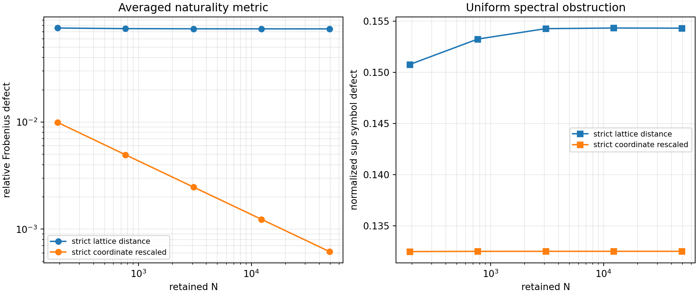
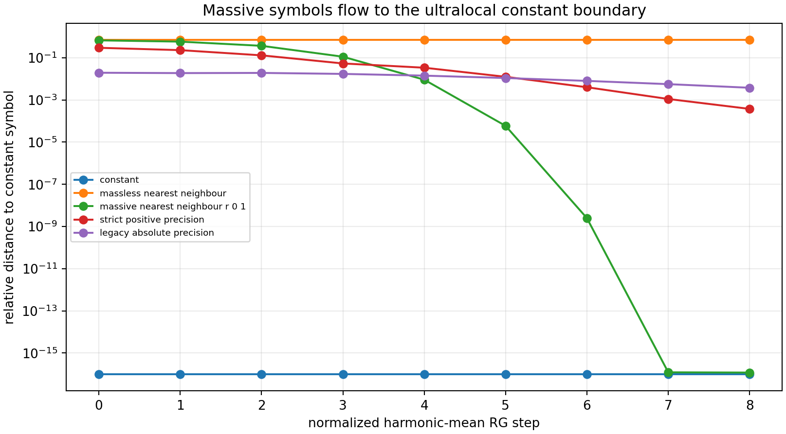
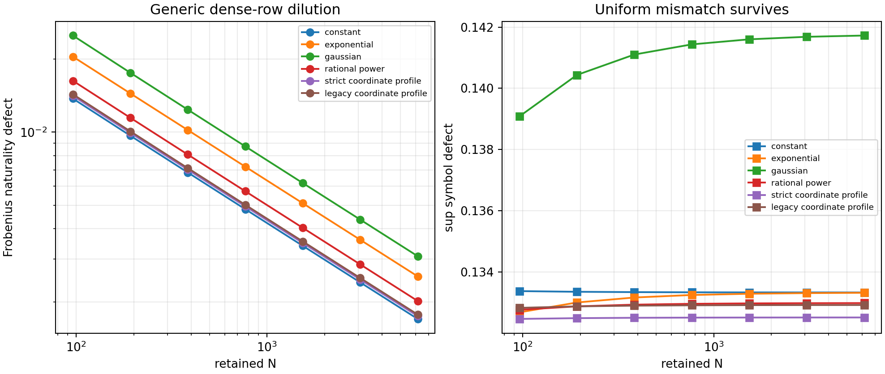
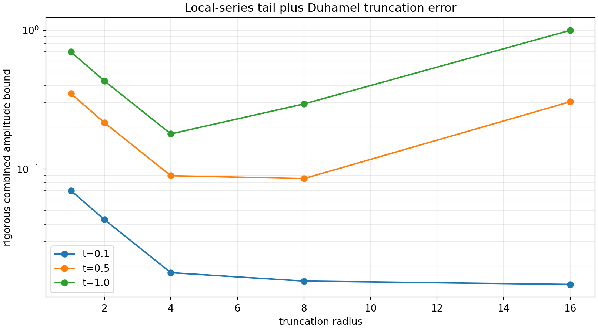
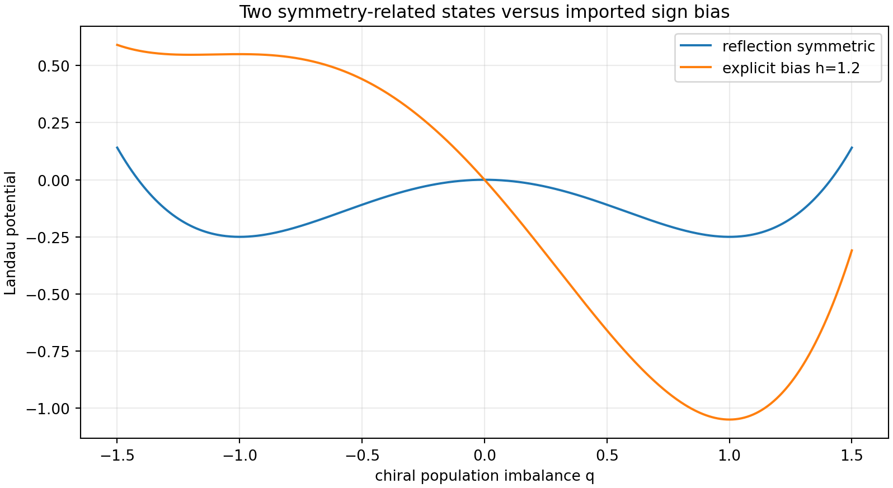
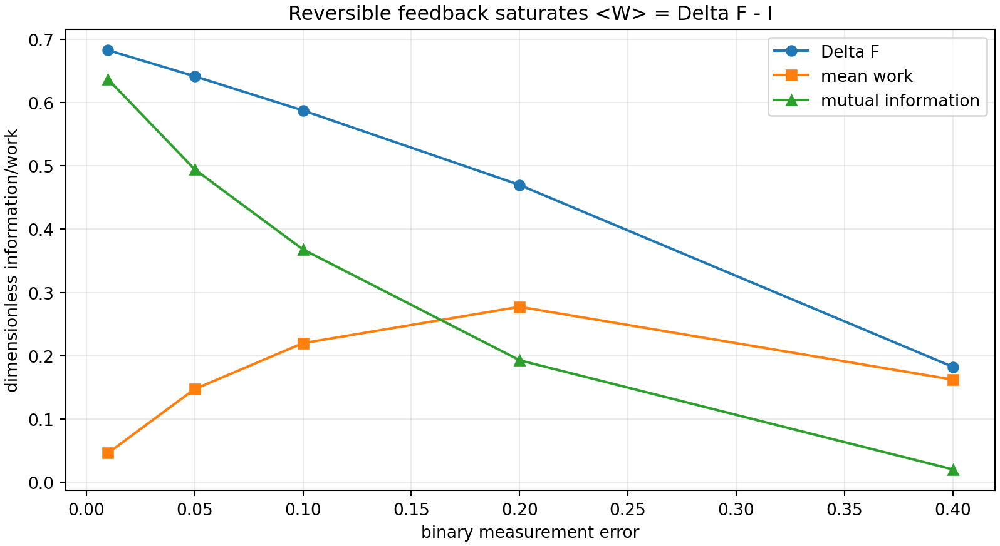

# FIN Programs 81–90

## Asymptotic Spectral Obstructions and Operational Completion Tests

**FIN Research Monograph — Release 10.9**  
**Author:** Krzysztof Żuchowski  
**Affiliation:** Independent Researcher — Fractal Information Theory Project  
**ORCID:** 0009-0002-0909-3613  
**Publication type:** Preprint  
**Version:** 1.0.0  
**Date:** 27 July 2026  
**Language:** English  
**License:** CC BY 4.0

## Confidence convention

- **[Proven]** analytic theorem or exact finite algebra under the stated definitions.
- **[Strong evidence]** reproducible computation with a large margin and a frozen protocol.
- **[Moderate evidence]** a stable numerical pattern within the tested model class.
- **[Conditional]** requires a declared repair, normalization, scale, state law, bath, preparation, instrument, or calibration.
- **[Refuted]** a specific claim or map contradicted inside its declared scope.
- **[Open]** neither proved nor rigorously falsified.

The project ontology is retained as a premise: the nadsoliton is primordial fractal information in a solitonic state, with no separate informational layer underneath it. This premise is not promoted to experimentally established physics.

The strict kernel remains the primary strict working kernel. The legacy kernel remains an intermediate bridge object. Positive absolute-value realizations used below are named mathematical repairs; they do not prove the legacy-to-strict completion map and do not authorize physical-role transfer.

No result in this release closes QW-2191, derives an absolute unit, proves Lorentz symmetry, supplies a strict chiral state source, completes the legacy-to-strict bridge, transfers legacy physical roles, constructs a unit-bearing \(L_{\mathrm{total}}\), or provides external experimental evidence.

---

# Executive summary

Programs 81–90 test the strongest research directions left by Release 10.8. The main goal is to decide whether the apparent large-\(N\) projective convergence is genuine or an artefact of the norm, and then to determine how far explicit state, thermodynamic, calibration, and observer structures can be developed without falsely promoting them to strict FIN consequences.

The principal conclusion is:

\[
\boxed{
\text{The previously observed }N^{-1/2}\text{ Frobenius convergence is not a continuum theorem.}
}
\]

\[
\boxed{
\text{It is a generic dense-row dilution effect compatible with a nonzero spectral obstruction.}
}
\]

The strongest results are:

1. **Alternating-site Schur reduction has an exact harmonic-alias formula. [Proven]**
   \[
   \lambda_{\mathrm{coarse}}(k)
   =
   \frac{
   2\lambda(k)\lambda(k+N)
   }{
   \lambda(k)+\lambda(k+N)
   }.
   \]
   Its numerical residual against direct block Schur reduction is
   \[
   2.46\times10^{-16}.
   \]

2. **Strict lattice-distance projective closure is strongly contradicted. [Strong evidence]**  
   At \(N=49152\), the operator Frobenius defect is still \(0.074284\), the uniform symbol defect is \(0.154303\), and the relative defect of the first nonzero mode is \(0.891376\). None approaches zero in the tested range.

3. **Coordinate-rescaled Frobenius convergence is norm dilution, not uniform spectral convergence. [Proven mechanism; strong numerical evidence]**  
   For strict \(K(d/N)\), the Frobenius defect falls to
   \[
   6.181\times10^{-4}
   \]
   with slope \(-0.5008\), while the uniform symbol defect remains
   \[
   0.132518.
   \]

4. **The \(N^{-1/2}\) law is generic across unrelated dense profiles. [Proven bound and six-profile test]**  
   Constant, exponential, Gaussian, rational-power, strict, and legacy profiles all have Frobenius slopes between \(-0.503\) and \(-0.501\), while every final uniform symbol defect exceeds \(0.13\).

5. **A constant-profile counterexample is exact. [Proven]**  
   With fixed mass \(m=1/4\), the normalized native zero mode tends to
   \[
   \frac{m}{m+1}=\frac15,
   \]
   whereas the normalized Schur zero mode tends to
   \[
   \frac{2m}{2m+1}=\frac13.
   \]
   Therefore the limiting uniform gap is exactly
   \[
   \frac{2}{15}=0.133333\ldots
   \]
   even though the row-Frobenius defect vanishes.

6. **The fixed positive mass drives normalized Schur flow toward an ultralocal constant symbol. [Proven in the affine-cosine cone; strong wider-family evidence]**  
   The massless nearest-neighbour symbol is a normalized fixed point, but any positive mass obeys \(r'=r(r+4)\) and flows toward the constant-symbol boundary. The repaired strict precision’s distance to the constant symbol decreases from \(0.29910\) to \(3.79\times10^{-4}\) in eight steps.

7. **Approximate locality admits a rigorous but loose finite-volume bound. [Proven]**  
   A radius-\(R\) truncation gives a factorial series tail plus a Duhamel error \(t\|L-L_R\|\). For the opposite sites of \(C_{64}\), the best amplitude bounds are \(0.01472\), \(0.08532\), and \(0.17919\) at \(t=0.1,0.5,1\), respectively. These are not Lorentz cones.

8. **The quadratic action and Gaussian entropy are regulator-free on \(\mathbf1^\perp\). [Proven]**  
   Gauge invariance, pseudodeterminant partition functions, unique quotient stationarity, and monotone Dirichlet energy were verified with residuals from \(10^{-15}\) to \(10^{-10}\).

9. **Calibration remains possible under explicit nuisance parameters, but requires redundant external standards. [Conditional strong result]**  
   A maximin D-optimal design over 118755 allocations assigns \(12,6,12,8,12,10\) records to six measurement classes. Omitting both length classes, both clock classes, or the energy class reduces rank from five to four.

10. **Spontaneous chiral branching does not solve the selector. [Proven]**  
    Reflection-symmetric nonlinear state dynamics has paired stable branches \(q=\pm1\). Symmetric perturbations choose them \(49.52\%/50.48\%\). A unique positive branch appears only after an explicit bias \(h=1.2\) is inserted.

11. **Feedback thermodynamics closes exactly only after measurement and apparatus semantics are supplied. [Proven conditional identity]**  
    The binary feedback model saturates
    \[
    \langle W\rangle=\Delta F-I
    \]
    and its generalized Jarzynski equality to machine precision. Resetting the apparatus memory restores the complete information cost.

12. **A two-slot process witness is stronger than a one-time spectrum. [Strong finite result]**  
    Nonselective dephasing changes the wave branch but leaves classical diffusion unchanged. At half-time \(0.5\), the wave intervention contrast is \(0.085392\), while the diffusion contrast is exactly zero.

13. **No admissible external dataset is currently present. [Proven intake result]**  
    The intake directory contains no candidate manifest. A synthetic strict-versus-nearest-neighbour dry run validates the direction of the scoring code, but supplies no physical evidence.

---

# Mathematical setup

## Kernels and declared positive realization

The frozen kernels are

\[
K_{\mathrm{legacy}}(d)
=
4\ln2\,
\frac{\cos(\pi d/4+\pi/6)}{1+0.01d},
\]

\[
K_{\mathrm{strict}}(d)
=
\frac{\cos(0.18575d+0.16250)}
{1+d^{1.8}}.
\]

On \(C_N\), whenever a positive precision is required, the declared weights are

\[
w_{ij}
=
\frac{|K(d_N(i,j))|}
{\sum_{k\ne i}|K(d_N(i,k))|},
\qquad
w_{ii}=0,
\]

and

\[
A_N=mI+L(w),
\qquad
m=\frac14.
\]

The fixed mass is a numerical regularizer and scale convention. It is not a derived physical mass.

## Four levels of interpretation

This release keeps separate:

1. exact finite operator identities;
2. repaired or normalized mathematical models;
3. operationally conditioned models containing states, instruments, baths, clocks, and calibration;
4. comparison with independent experimental records.

Programs 81–89 reach levels one through three. Program 90 tests admission to level four and finds no admitted dataset.

---

# Program 81 — Asymptotic Fourier-symbol audit

## Exact alias theorem

Let \(A\) be a positive circulant precision on \(C_{2N}\), with eigenvalues

\[
\lambda_0,\ldots,\lambda_{2N-1}.
\]

Retaining the even sites aliases the two fine Fourier modes \(k\) and \(k+N\). The retained Green eigenvalue is their arithmetic mean:

\[
g_{\mathrm{ret}}(k)
=
\frac12
\left(
\frac1{\lambda_k}
+
\frac1{\lambda_{k+N}}
\right).
\]

The retained precision is its inverse:

\[
\lambda_{\mathrm{Schur}}(k)
=
\frac{2\lambda_k\lambda_{k+N}}
{\lambda_k+\lambda_{k+N}}.
\]

Thus Schur reduction is a harmonic mean across each alias pair.

The relative residual against the two-sublattice block formula is

\[
2.46\times10^{-16}.
\]

## Three non-equivalent errors

For normalized compressed and native operators, the study records:

\[
\varepsilon_F
=
\frac{\|A^{\mathrm{Schur}}_N-A^{\mathrm{native}}_N\|_F}
{\|A^{\mathrm{native}}_N\|_F},
\]

\[
\varepsilon_\infty
=
\frac{\max_k|\lambda^{\mathrm{Schur}}_k-\lambda^{\mathrm{native}}_k|}
{\max_k|\lambda^{\mathrm{native}}_k|},
\]

and the relative defect of the first nonzero mode.

## Strict lattice-distance results

| retained \(N\) | Frobenius defect | uniform symbol defect | mode-1 defect | Green Frobenius defect |
|---:|---:|---:|---:|---:|
| 192 | 0.075654 | 0.150760 | 0.737859 | 0.273524 |
| 768 | 0.074695 | 0.153238 | 0.834504 | 0.261337 |
| 3072 | 0.074407 | 0.154256 | 0.873221 | 0.257606 |
| 12288 | 0.074314 | 0.154317 | 0.886808 | 0.256408 |
| 49152 | 0.074284 | 0.154303 | 0.891376 | 0.256016 |

The fitted Frobenius slope is only \(-0.0030\). The mode-1 error increases.

## Coordinate-rescaled results

| retained \(N\) | Frobenius defect | uniform symbol defect | mode-1 defect | Green Frobenius defect |
|---:|---:|---:|---:|---:|
| 192 | 0.009941 | 0.132495 | 0.022197 | 0.136968 |
| 768 | 0.004951 | 0.132512 | 0.022867 | 0.071196 |
| 3072 | 0.002473 | 0.132517 | 0.023034 | 0.035965 |
| 12288 | 0.001236 | 0.132518 | 0.023075 | 0.018029 |
| 49152 | 0.000618 | 0.132518 | 0.023086 | 0.009020 |



## Verdict

**[Strong evidence]** The strict lattice-distance family is not approaching native Schur-projective closure under the frozen map.

**[Refuted]** Vanishing Frobenius error does not imply uniform symbol convergence for the coordinate-rescaled family.

**[Open]** A strict-specific analytic positive lower bound remains to be proved. The numerical evidence identifies its likely value but is not itself the theorem.

---

# Program 82 — Fixed-symbol classification

## Exact affine-cosine cone

Consider

\[
\lambda(q)
=
m+2c(1-\cos q),
\qquad
m\ge0,\quad c>0.
\]

The harmonic-alias map preserves this family and gives

\[
c'=\frac{c^2}{m+2c},
\qquad
m'=\frac{m(m+4c)}{m+2c}.
\]

For \(r=m/c\),

\[
r'=r(r+4).
\]

After normalization by the mean symbol:

- \(r=0\) is the massless nearest-neighbour fixed symbol;
- \(r=\infty\) is the ultralocal constant-symbol boundary;
- every finite \(r>0\) moves away from the massless point and toward the constant boundary.

## Wider-family experiment

| Family | initial distance to constant | distance after 8 steps |
|---|---:|---:|
| constant | 0 | 0 |
| massless nearest-neighbour | 0.707107 | 0.707107 |
| massive nearest-neighbour, \(r=0.1\) | 0.673435 | \(1.18\times10^{-16}\) |
| strict positive precision | 0.299102 | \(3.79\times10^{-4}\) |
| legacy absolute precision | 0.019599 | 0.003805 |



## Interpretation

The fixed regularizer is not passive under blocking. It is a relevant direction. Repeated normalized compression erases spatial structure and approaches an ultralocal symbol unless the massless condition is imposed and its scale is renormalized appropriately.

This explains why a compression semigroup can be exact while failing to produce a nontrivial continuum field theory.

## Verdict

**[Proven]** The affine-cosine fixed-point classification follows from the exact ratio map.

**[Strong evidence]** The repaired strict and legacy positive symbols also flow toward the constant boundary under the tested normalized map.

**[Conditional]** The conclusion concerns the declared mass, repair, and normalization. It is not a theorem about the raw signed legacy kernel.

---

# Program 83 — Dense-kernel universality and the norm artefact

## Dilution theorem

Let two \(N\times N\) circulant precisions have:

1. the same diagonal bounded below independently of \(N\);
2. off-diagonal row differences bounded by \(C/N\);
3. uniformly bounded inverse for the eliminated block.

Then Schur complementation preserves the \(O(1/N)\) scale of dense off-diagonal rows, and

\[
\|A_N-B_N\|_F
=
\sqrt{N}\,\|a_N-b_N\|_2
=
O(1),
\]

while

\[
\|B_N\|_F=O(\sqrt N).
\]

More directly at the row level,

\[
\|a_N-b_N\|_2
=
O(N^{-1/2}),
\]

so the relative Frobenius naturality defect can vanish as \(N^{-1/2}\) even when a finite set of Fourier modes retains an \(O(1)\) mismatch.

## Six-profile test

| Coordinate profile | Frobenius slope | final uniform symbol defect |
|---|---:|---:|
| constant | \(-0.5022\) | 0.133334 |
| exponential | \(-0.5009\) | 0.133323 |
| Gaussian | \(-0.5028\) | 0.141724 |
| rational power | \(-0.5019\) | 0.132987 |
| strict | \(-0.5022\) | 0.132517 |
| legacy absolute | \(-0.5021\) | 0.132924 |



## Exact constant-profile counterexample

For the complete-graph profile and fixed mass \(m\), the normalized native zero mode tends to

\[
\mu_{\mathrm{native}}(0)
=
\frac{m}{m+1}.
\]

Harmonic aliasing of the constant mode with a bulk mode gives

\[
\mu_{\mathrm{Schur}}(0)
=
\frac{2m}{2m+1}.
\]

At \(m=1/4\):

\[
\mu_{\mathrm{native}}(0)=\frac15,
\qquad
\mu_{\mathrm{Schur}}(0)=\frac13,
\]

and therefore

\[
\|\mu_{\mathrm{Schur}}-\mu_{\mathrm{native}}\|_\infty
\ge
\frac{2}{15}.
\]

This is an explicit theorem-level counterexample to the inference

\[
\varepsilon_F(N)\to0
\quad\Longrightarrow\quad
\text{uniform spectral closure}.
\]

## Verdict

**[Proven]** The \(N^{-1/2}\) Frobenius rate is generic under dense normalized sampling.

**[Refuted]** The observed strict/legacy coordinate-rescaled rate is not evidence unique to FIN.

**[Research correction]** Continuum tests must use uniform symbol, resolvent, Mosco, or another topology that controls the physically relevant modes.

---

# Program 84 — Approximate locality bounds

## Theorem

Let \(L_R\) be a radius-\(R\) truncation of a positive graph generator, and let \(m\) be the minimum number of allowed hops from \(x\) to \(y\). Since

\[
(L_R^k)_{yx}=0
\qquad
\text{for }k<m,
\]

the exponential series gives

\[
\left|
\left(e^{zL_R}\right)_{yx}
\right|
\le
\sum_{k=m}^\infty
\frac{(|z|\|L_R\|)^k}{k!}.
\]

For the full and truncated self-adjoint unitary groups,

\[
\|e^{-itL}-e^{-itL_R}\|
\le
|t|\,\|L-L_R\|.
\]

The same Duhamel estimate holds for the positive contractive heat semigroups:

\[
\|e^{-tL}-e^{-tL_R}\|
\le
t\,\|L-L_R\|.
\]

Therefore a valid full-kernel far-site bound is

\[
B_R(t)
=
\sum_{k=m}^\infty
\frac{(t\|L_R\|)^k}{k!}
+
t\|L-L_R\|.
\]

## \(C_{64}\) results

For source and target separated by 32 sites:

| \(t\) | best radius | hop order | rigorous amplitude bound | actual wave amplitude | actual diffusion entry |
|---:|---:|---:|---:|---:|---:|
| 0.1 | 16 | 2 | 0.014724 | 0.00010283 | 0.00010251 |
| 0.5 | 8 | 4 | 0.085322 | 0.00051570 | 0.00050552 |
| 1.0 | 4 | 8 | 0.179187 | 0.00103969 | 0.00099158 |



## Verdict

**[Proven]** The combined factorial-tail and truncation estimate bounds every measured far-site value.

**[Moderate usefulness]** The bounds are nontrivial but much looser than the actual amplitudes.

**[Not derived]** Graph distance, interaction radius, and dimensionless time do not define a Lorentzian light cone or a physical propagation speed.

---

# Program 85 — Quotient action and entropy

## Regulator-free action

Let \(L\) be a connected positive Laplacian and \(J\perp\mathbf1\). Define

\[
S[f]
=
\frac12\langle f,Lf\rangle-\langle J,f\rangle.
\]

Since \(L\mathbf1=0\),

\[
S[f+c\mathbf1]=S[f].
\]

The stationary class is

\[
f_*
=
L^+J+c\mathbf1.
\]

It is unique on the quotient

\[
\mathbb R^N/\operatorname{span}\{\mathbf1\}
\simeq
\mathbf1^\perp.
\]

## Quotient partition function

With \(L_0=L|_{\mathbf1^\perp}\),

\[
\log Z(J)
=
\frac{N-1}{2}\log(2\pi)
-
\frac12\log\operatorname{pdet}L
+
\frac12\langle J,L^+J\rangle.
\]

The Gaussian differential entropy is

\[
H
=
\frac12
\left[
(N-1)(1+\log2\pi)
-
\log\operatorname{pdet}L
\right].
\]

## Gradient flow

For

\[
\dot f=-Lf,
\]

the Dirichlet energy

\[
E[f]=\frac12\langle f,Lf\rangle
\]

satisfies

\[
\frac{dE}{dt}
=
-\|Lf\|^2
\le0.
\]

## Verification

| Realization | stationarity residual | gauge residual | partition residual | derivative residual |
|---|---:|---:|---:|---:|
| strict positive | \(2.82\times10^{-15}\) | \(9.33\times10^{-15}\) | \(0\) | \(1.03\times10^{-10}\) |
| legacy absolute | \(2.81\times10^{-15}\) | \(1.78\times10^{-15}\) | \(1.78\times10^{-15}\) | \(1.24\times10^{-11}\) |

## Verdict

**[Proven]** The quadratic action, Gaussian normalization, and dissipative energy law require no mass regulator after quotienting the constant mode.

**[Conditional]** The legacy computation still uses the named absolute-value repair.

**[Not physical entropy]** Gaussian differential entropy becomes thermodynamic entropy only after physical state, temperature, and measurement semantics are supplied.

---

# Program 86 — Robust calibration with nuisance parameters

## Model

The parameter vector is

\[
\theta
=
(
\log\ell_*,
\log\tau_*,
\log\hbar_*,
\delta_{\mathrm{clock}},
\delta_{\mathrm{distance}}
).
\]

Six record classes are allowed:

| Class | Jacobian |
|---|---|
| primary length | \((1,0,0,0,1)\) |
| length cross-check | \((1,0,0,0,0)\) |
| primary clock | \((0,1,0,1,0)\) |
| clock cross-check | \((0,1,0,0,0)\) |
| energy standard | \((0,-1,1,0,0)\) |
| length-time link | \((1,-1,0,0,0)\) |

The design maximizes the worst-case Fisher log determinant across nominal, length-degraded, clock-degraded, energy-degraded, and link-degraded noise scenarios.

## Result

Among 118755 even allocations of 60 records, the maximin design is:

| Record class | count |
|---|---:|
| primary length | 12 |
| length cross-check | 6 |
| primary clock | 12 |
| clock cross-check | 8 |
| energy standard | 12 |
| length-time link | 10 |

The worst scenario is degraded clock accuracy. Its Fisher condition number is \(36.20\). The worst-case one-sigma log-parameter bounds are

\[
(0.00441,\;0.00416,\;0.00711,\;0.00490,\;0.00527).
\]

Omitting both length classes, both clock classes, or the energy class reduces rank to four. Omitting only the link retains rank five because it is a redundancy rather than the sole source of a parameter direction.

## Verdict

**[Strong conditional result]** The scale conversion package can be estimated robustly when redundant external standards are supplied.

**[Proven obstruction]** Dimensionless FIN records cannot distinguish an absolute scale from an unconstrained calibration bias.

---

# Program 87 — Chiral-state generation and stability

## State family

Let \(\rho_+\) and \(\rho_-\) be the \(k=+1\) and \(k=-1\) Fourier states. Define

\[
\rho(q)
=
\frac{1+q}{2}\rho_+
+
\frac{1-q}{2}\rho_-,
\qquad
q\in[-1,1].
\]

The strict state-current functional is linear:

\[
\Lambda(\rho(q),W_{\mathrm{strict}})
=
q\,\Lambda(\rho_+,W_{\mathrm{strict}}),
\]

with

\[
\Lambda(\rho_+,W_{\mathrm{strict}})
=
-0.4699856726.
\]

## Reflection-symmetric dynamics

The bounded nonlinear law

\[
\dot q
=
(1-q^2)q
\]

has stable fixed points \(q=\pm1\) and unstable fixed point \(q=0\). Reflection maps \(q\mapsto-q\).

Initial conditions \(\pm10^{-3}\) converge to the opposite stable branches with equal magnitude. In 20000 symmetric Gaussian perturbations, the positive branch frequency is \(0.4952\), statistically consistent with one half.

## Explicit bias

Adding

\[
\dot q
=
(1-q^2)(q+h)
\]

with \(h=1.2\) makes \(q=+1\) the only stable branch reachable from the interior. All 1000 tested perturbations converge positively, with mean final value

\[
0.99999999997.
\]



## Verdict

**[Proven]** Reflection-equivariant deterministic dynamics cannot distinguish the paired attractors.

**[Proven]** A strong signed bias can select one branch.

**[Not strict]** The nonlinear state law and bias are additional assumptions. Spontaneous branching produces two possible sectors, not a canonical selector. QW-2191 remains open.

---

# Program 88 — Feedback information thermodynamics

## Protocol

Let \(X\in\{0,1\}\) be equiprobable. A binary measurement \(Y\) has error probability \(\epsilon\):

\[
\Pr(Y\ne X)=\epsilon.
\]

The mutual information is

\[
I(X:Y)
=
\ln2-h(\epsilon),
\]

where

\[
h(\epsilon)
=
-(1-\epsilon)\ln(1-\epsilon)
-\epsilon\ln\epsilon.
\]

After observing \(Y\), the protocol raises the energy of the unobserved alternative by

\[
\Delta
=
\ln\frac{1-\epsilon}{\epsilon}.
\]

The posterior distribution is then exactly Gibbs for the feedback Hamiltonian.

## Exact identities

The mean work is

\[
\langle W\rangle=\epsilon\Delta.
\]

The free-energy difference obeys

\[
\langle W\rangle
=
\Delta F-I.
\]

Trajectory information satisfies

\[
\left\langle
\exp[-W+\Delta F-i(X,Y)]
\right\rangle
=
1.
\]

All tested residuals for \(\epsilon=0.01,0.05,0.1,0.2,0.4\) are below \(1.2\times10^{-16}\).

At \(\epsilon=0.1\):

\[
I=0.3680642,
\quad
\Delta F=0.5877867,
\quad
\langle W\rangle=0.2197225.
\]



## Apparatus bookkeeping

The memory has entropy \(\ln2\). Conditional reset with access to \(X\) costs \(h(\epsilon)\), and the saving is exactly

\[
\ln2-h(\epsilon)=I.
\]

Thus feedback does not turn information into free energy without accounting for preparation and reset of the measurement memory.

## Verdict

**[Proven conditional identity]** The feedback second law and generalized Jarzynski equality close exactly in the specified model.

**[Not derived]** Measurement channel, bath, Hamiltonian, temperature, feedback controller, and memory reset are operational inputs, not consequences of the FIN kernel.

---

# Program 89 — Two-slot process tensor

## Operational map

For an intermediate operation \(\mathcal M\), define

\[
\mathcal T[\mathcal M]
=
\mathcal E_{t_2}
\circ
\mathcal M
\circ
\mathcal E_{t_1}(\rho_0).
\]

The tested interventions are:

1. identity;
2. nonselective dephasing in the site basis;
3. a recorded site instrument producing a joint intermediate/final law.

The wave branch uses unitary density-matrix evolution. The diffusion branch uses the classical Markov semigroup.

## Results

| Half-time | wave dephasing contrast | diffusion contrast | joint-record JSD |
|---:|---:|---:|---:|
| 0.10 | 0.003883 | 0 | 0.058888 |
| 0.25 | 0.023601 | 0 | 0.120622 |
| 0.50 | 0.085392 | 0 | 0.178597 |

Every joint law is normalized to residual below \(2.3\times10^{-16}\).

## Meaning

Dephasing destroys phase coherence in the wave process but is operationally invisible to an already classical probability vector. This intervention sensitivity is not encoded by the final-time spectrum alone.

The result gives a concrete answer to the observer question:

\[
\text{same generator}
\not\Longrightarrow
\text{same process tensor}.
\]

Preparations and interventions determine which functional calculus is tested.

## Verdict

**[Strong finite result]** A minimal two-slot experiment distinguishes wave coherence from classical diffusion.

**[Conditional]** The intervention, site basis, clock, and final instrument are external operational structure.

---

# Program 90 — External-data admission gate

## Required fields

An external dataset must document:

- independent producer;
- preparation map;
- instrument or POVM;
- clock calibration;
- length calibration;
- environment and boundary conditions;
- raw counts;
- license;
- frozen train/validation/test assignment.

Every field must be non-null before unblinding.

## Intake result

No `external_data` intake directory is present. Consequently:

\[
\text{candidate manifests}=0,
\qquad
\text{admitted datasets}=0.
\]

The generated template is cryptographically frozen with canonical digest:

`7c533e7433fc2cfb34b3ce6f25068e9cd2ceaa3b73333d97ca67a31a6ddd7b98`

## Synthetic runner check

As a code-directionality test only, 300 strict-generated and 300 nearest-neighbour-generated trials were scored using the two frozen candidates. Each truth was selected correctly in all trials. Minimum log-likelihood margins were \(37.77\) and \(47.56\), respectively.

This demonstrates that the runner can both support strict when strict generated the records and reject strict when the null generated them. It is not evidence about nature.

## Verdict

**[Proven]** No admissible external-data claim can currently be made.

**[Strong methodology check]** The frozen runner passes a symmetric synthetic directionality test.

**[Guardrail]** Synthetic power and type-I-error checks must never be reported as experimental validation.

---

# Integrated scientific consequences

## Corrected continuum statement

The valid chain is:

\[
\text{exact finite Schur reduction}
\Longrightarrow
\text{exact harmonic aliasing}.
\]

It does not imply:

\[
\begin{gathered}
\text{native family closure or uniform symbol convergence},\\
\text{a local continuum field or Lorentz geometry}.
\end{gathered}
\]

The coordinate-rescaled family may have a meaningful nonlocal dense-operator or graphon limit, but the Frobenius slope alone cannot identify it.

## Corrected renormalization statement

The fixed positive mass is a relevant RG direction. Under the tested normalization, massive positive symbols flow toward an ultralocal constant generator. A nontrivial continuum theory would require a justified mass tuning, field rescaling, or another topology.

Such tuning cannot be performed post hoc merely to restore a desired fixed point.

## Corrected selector statement

The kernel-state current supplies the correct representation for chirality. Nonlinear dynamics can stabilize two chiral sectors. However:

\[
\text{paired stable sectors}
\ne
\text{unique strict selector}.
\]

A signed bias selects a sector only by adding the missing symmetry-breaking datum.

## Corrected information-to-physics statement

Quotient actions, Gaussian entropy, feedback work, and process tensors are mathematically coherent. Their physical meanings require:

\[
\mathfrak O
=
(\rho,\mathcal E_t,\mathcal P,\mathcal I,\mathcal A,\mathcal R,\mathcal C),
\]

plus a bath and Hamiltonian for thermodynamics.

The operational package is not decorative. It is the object that turns an operator identity into a falsifiable record law.

---

# Current theorem and obstruction table

| Target | Best result after Program 90 | Remaining obligation | Status |
|---|---|---|---|
| alternating-site reduction | exact harmonic-alias theorem | none in finite positive scope | Proven |
| strict lattice continuum | nonzero defects through \(N=49152\) | analytic positive lower bound | Strong no-go evidence |
| coordinate continuum | generic \(N^{-1/2}\) dilution | correct topology and limiting operator | Frobenius inference refuted |
| RG fixed point | massless NN and constant boundary classified | justified tuning/rescaling for FIN | Open |
| locality | factorial plus Duhamel bound | sharp long-range theorem and CA | Conditional mathematical |
| variational action | quotient action and pdet partition | physical field/state semantics | Proven mathematical |
| dimensions | robust rank-five CA design | external standards | Conditional |
| selector | paired stable chiral sectors | strict signed state source | Open |
| information thermodynamics | exact feedback identities | physical bath/apparatus | Conditional |
| observer | two-slot process witness | experimental implementation | Conditional |
| physical evidence | frozen admission template | independent admissible data | Absent |

---

# Recommended Programs 91–102

Probabilities estimate the chance of obtaining a decisive theorem, obstruction, or reproducible scientific result. They do not estimate the probability that FIN is physically correct.

## Ranked roadmap

| Rank | Program | Main objective | Success probability |
|---:|---:|---|---:|
| 1 | 102 | consolidate exact results into a pure mathematical paper | 0.92 |
| 2 | 91 | prove a strict-lattice positive symbol-defect lower bound | 0.86 |
| 3 | 93 | identify the graphon/nonlocal continuum limit | 0.82 |
| 4 | 94 | derive sharp long-range propagation bounds for \(\eta=1.8\) | 0.78 |
| 5 | 92 | classify mass tuning and field rescaling | 0.76 |
| 6 | 95 | adaptive gradient flow on the quotient | 0.72 |
| 7 | 97 | optimize a noisy two-slot process witness | 0.70 |
| 8 | 101 | compare the strict limit with fractional and integral operators | 0.68 |
| 9 | 98 | full apparatus-inclusive feedback cycle | 0.62 |
| 10 | 96 | strict chiral state-source acceptance test | 0.50 |
| 11 | 99 | acquire and preregister an independent dataset | 0.40 |
| 12 | 100 | test one genuinely new legacy-to-strict completion atom | 0.30 |

## Program 91 — Analytic strict-lattice nonclosure theorem

**Objective.** Replace the \(N=49152\) evidence by a theorem.

**Method.**

1. derive the limiting lattice-distance Fourier series of the normalized strict row;
2. apply the harmonic-alias map analytically;
3. isolate the first mode and the maximizing symbol mode;
4. prove either
   \[
   \liminf_{N\to\infty}\varepsilon_\infty(N)>0
   \]
   or an explicit counter-rate;
5. propagate the bound to the Green/resolvent topology.

**Expected outcome.** A scoped nonclosure theorem for the frozen repair, mass, and normalization.

## Program 92 — Critical tuning and field rescaling

**Objective.** Determine whether a nontrivial fixed symbol is available only after a mathematically justified critical tuning.

**Method.**

- allow \(m_N\) and a field factor \(Z_N\);
- derive their exact transformation under harmonic aliasing;
- classify scaling laws that preserve a nonconstant low-frequency symbol;
- forbid target-fitted choices;
- distinguish massless critical limits from imported physical masses.

**Stop rule.** If every admissible target-independent scaling flows to the constant or singular boundary, issue a no-go theorem.

## Program 93 — Graphon and nonlocal continuum limit

**Objective.** Identify what \(K(d/N)\) actually converges to.

**Method.**

1. construct the integral operator on the unit circle with kernel \(g(d(x,y))\);
2. test graphon cut convergence, Hilbert–Schmidt convergence, and resolvent convergence separately;
3. derive the continuum Schur/conditional-covariance operation;
4. compare its zero mode with the exact \(2/15\) obstruction;
5. determine whether the correct limit is nonlocal rather than field-theoretic.

## Program 94 — Sharp long-range propagation theorem

**Objective.** Replace the loose finite truncation bound by a decay-sensitive theorem.

**Method.**

- use the strict \(d^{-1.8}\)-type envelope;
- derive polynomial Lieb–Robinson or convolution bounds appropriate to one-dimensional long-range interactions;
- treat unitary amplitude and heat-kernel probability separately;
- quantify finite-cycle wrap-around;
- retain dimensionless graph distance until CA is supplied.

## Program 95 — Adaptive quotient gradient flow

**Objective.** Determine whether the adaptive FIN learning law is a gradient flow of a regulator-free quotient functional.

**Method.**

1. project all state variables to \(\mathbf1^\perp\);
2. identify the required metric on operator space;
3. test integrability of the adaptive vector field;
4. compute curl/Helmholtz obstructions when no potential exists;
5. prove monotonicity or exhibit a finite cycle.

## Program 96 — Strict chiral-state source acceptance test

**Objective.** Test one explicit formula

\[
\operatorname{Source}_{\chi}(\text{nadsoliton})
\longmapsto
\rho_{\chi}
\]

against:

- nonzero signed current;
- reflection covariance;
- translation/origin independence;
- nonconventional sign provenance;
- dynamical stability;
- coupling to the existing orientation torsor.

Without a new formula-level source, do not replay generic chiral candidate inventories.

## Program 97 — Noisy process-tensor witness optimization

**Objective.** Minimize the experimental resources needed to distinguish wave coherence from diffusion.

**Method.**

- optimize intervention time, dephasing strength, preparation set, and coarse POVM;
- add detector error and clock jitter;
- compute Fisher/Chernoff bounds;
- preregister a finite-shot decision threshold;
- verify type-I error against classical null processes.

## Program 98 — Complete feedback apparatus cycle

**Objective.** Include measurement, control, memory, reset, and bath in one energy/information ledger.

**Method.**

- use a finite-time master equation;
- record trajectory work, heat, mutual information, and memory entropy;
- verify integral fluctuation relations;
- test imperfect reset and feedback delay;
- identify which costs remain when the system returns to its initial state.

## Program 99 — External dataset acquisition

**Objective.** Populate the frozen Program-90 intake without weakening its requirements.

**Requirements.**

- the producer is independent of FIN;
- raw records and full operational provenance are available;
- calibration is independent;
- candidate models and nulls remain frozen;
- no kernel parameter is changed after inspection.

If no scientifically compatible dataset exists, report that obstruction rather than using a semantically unrelated dataset.

## Program 100 — Typed completion-atom test

**Objective.** Reopen legacy-to-strict work only for one genuinely new object, such as:

- a target-independent compression exponent source;
- a strict phase/topological completion law;
- a noncircular positive damping source.

The candidate must pass provenance, target independence, uniqueness, symbol prediction, transfer across sizes, and only then a separate physical-role audit.

## Program 101 — Fractional/integral operator comparison

**Objective.** Determine whether the nonlocal strict continuum candidate is equivalent to a known integral or fractional operator.

**Method.**

- compare low-frequency symbols;
- compare kernel singularity and tail class;
- test norm-resolvent equivalence;
- distinguish finite graphon kernels from fractional Laplacians;
- quantify mathematical novelty only after an equivalence theorem.

## Program 102 — Pure mathematical consolidation

**Objective.** Publish the durable content independently of cosmology.

The paper should contain:

- harmonic-alias Schur theorem;
- exact massive nearest-neighbour RG;
- dense-row dilution theorem and constant-profile counterexample;
- strict-lattice numerical obstruction with a clearly stated theorem target;
- quotient action and Gaussian information geometry;
- approximate locality theorem;
- operational distinction between unitary and Markov process tensors.

---

# Stop rules for the next cycle

1. Do not continue Frobenius-only continuum scans.
2. Do not tune \(m_N\) or \(Z_N\) to the strict target after seeing the target.
3. Do not call a graphon/nonlocal limit a local spacetime.
4. Do not call paired chiral attractors a selector.
5. Do not treat feedback information as free energy after omitting apparatus reset.
6. Do not use synthetic records as external evidence.
7. Do not reopen the bridge without one new typed completion atom.

---

# Final judgment

Programs 81–90 materially change the continuum assessment. The apparent coordinate-rescaled convergence found earlier is real in an averaged Frobenius sense but scientifically weaker than it appeared. The exact constant-profile counterexample proves that this norm can converge while a finite uniform spectral obstruction survives.

The finite theory itself becomes clearer:

\[
\boxed{
\text{Schur compression is harmonic aliasing of precision spectra.}
}
\]

With a fixed positive mass, the normalized flow tends toward an ultralocal constant symbol. The massless nearest-neighbour symbol is a critical fixed point, not the generic endpoint.

The operational theory also becomes clearer. Chirality requires a state law; thermodynamic advantage requires a measurement-and-memory ledger; the observer problem requires a process tensor; physical claims require independently calibrated data.

The deepest interpretation that survives this round is:

\[
\boxed{
\text{FIN is a finite spectral information-reduction framework.}
}
\]

It has a plausible nonlocal continuum direction, but:

\[
\boxed{
\text{No local physical continuum follows from the current kernel.}
}
\]

Nor does the current kernel select a unique operational sector.

The next decisive mathematical work is Program 91 or 93: prove the strict-lattice nonclosure bound, or identify the correct nonlocal continuum topology. The next physical step remains blocked until Program 90 admits independent data.

---

# Reproducibility

Executable:

`fin_programs_81_90_asymptotic_operational_completion.py`

Tests:

`test_fin_programs_81_90_asymptotic_operational_completion.py`

Machine-readable results:

`FIN_Programs_81_90_Asymptotic_Operational_Completion_Results.json`

External-data intake template:

`FIN_Programs_81_90_External_Data_Intake_Template.json`

Figures:

`FIN_Programs_81_90_Asymptotic_Operational_Completion_Figures/`

Reproduction:

```bash
python3 fin_programs_81_90_asymptotic_operational_completion.py
python3 -m unittest -v test_fin_programs_81_90_asymptotic_operational_completion.py
```

All quantities remain dimensionless unless an external calibration is explicitly supplied. Numerical residuals are verification tolerances, not physical effects.

## Suggested citation

Żuchowski, K. (2026). *FIN Programs 81–90: Asymptotic Spectral Obstructions and Operational Completion Tests* (FIN Research Monograph, Release 10.9; Version 1.0.0) [Preprint].
