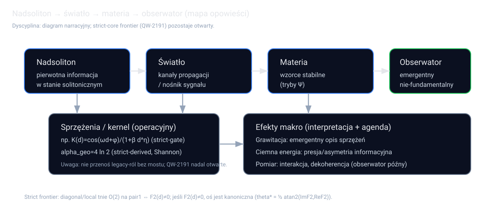
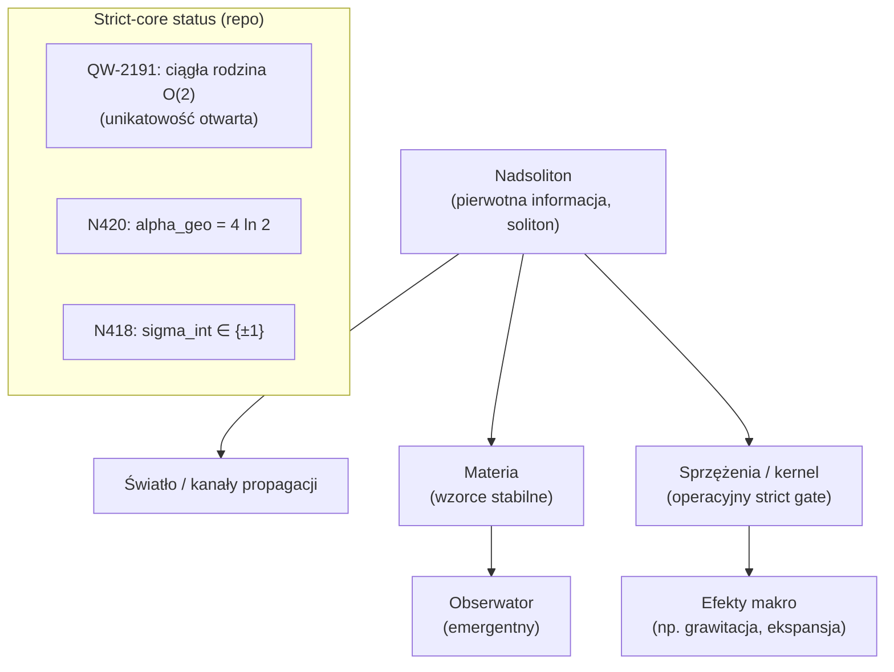

# Nadsoliton i pochodzenie Wszechświata — opowieść + „catchy zagwozdki” (PL)

**Status dyscypliny (no false pass):**
- To jest **opowieść interpretacyjna** (tekst popularno‑naukowy / intuicyjny), nie nowy dowód w strict‑core.
- Gdzie tylko można, rozdzielam: **co jest twardo wyeksportowane w repo** vs **co jest interpretacją**.
- Ten plik **nie** ogłasza: strict‑core selektora, rozładowania `QW-2191`, strict theta‑exportu ani domknięcia ToE.

**Data:** 2026-03-12  
**Repo odniesienia:** `RELEASE_6_4_STRICT_TEXTBOOK_EN_PL.md`

---

## 1) Jednozdaniowy rdzeń ontologii (strict‑side)

**Nadsoliton** to pierwotna informacja Wszechświata w stanie solitonicznym: nie ma „warstwy informacji pod spodem”.  
Porządek emergencji ma być czytany jako:

```text
nadsoliton -> światło -> materia -> emergentny obserwator
```

To jest oś interpretacyjna repo (patrz ontologiczna dyscyplina w `fundamental_action_reconstruction/K1...`, `F2...`).

---

## 2) Początek: „zamiast materii — informacja w ruchu”

### (A) Opowieść (interpretacja)

Wyobraź sobie, że „pustka” nie jest pusta: jest **konkretnym obiektem informacyjnym** (nadsolitonem), który:

1. ma wewnętrzną strukturę (mikro‑stany, topologiczne klasy, sklejone symetrie),
2. potrafi utrzymywać się jako stabilny obiekt (soliton), ale nie jako absolutny ideał „0”,
3. generuje lokalne projekcje tego, co nazywamy polami, cząstkami i oddziaływaniami.

W tej narracji „narodziny Wszechświata” to nie magiczne „powstanie materii”, tylko:

```text
pojawienie się stabilnego nośnika informacji (nadsoliton)
-> pojawienie się kanałów propagacji (światło)
-> pojawienie się trwałych wzorców (materia)
-> dopiero na końcu: obserwator (jako wzorzec w materii)
```

### (B) Co jest twarde w repo (strict)

Repo strict‑side ma dziś m.in.:

- `alpha_geo_strict_derived_v1 := 4 ln 2` jako strict‑derived świadectwo z obiektu `Omega_16` (N420),
- `sigma_int_strict_derived_v1 ∈ {+1,-1}` jako strict‑side źródło/upgrade (N418),
- twarde ostrzeżenie, że **unikatowość bazy / osi** w zdegenerowanych podprzestrzeniach ma realną przeszkodę
  (`QW-2191`) i nie wolno jej „zagadać”.

---

## 3) „Paradosk obserwatora”: dlaczego obserwator nie jest fundamentem

### (A) Opowieść (interpretacja)

Klasyczny paradoks brzmi: „czy Wszechświat potrzebuje obserwatora, żeby zaistnieć?”.  
W nadsolitonowej ontologii odpowiedź jest prosta: **nie**, bo obserwator jest późnym, emergentnym wzorcem w materii.

To odwraca intuicję:

- nie „świadomość wybiera rzeczywistość”,
- tylko „rzeczywistość informacyjna generuje warunki, w których powstają struktury zdolne do obserwacji”.

### (B) Co jest twarde w repo (strict)

Repo ma dziś wyraźny kontrakt „observer‑free”: w ważnych strict‑pakietach nie wolno używać `K_obs` jako źródła
unikatowości (np. `P388` podkreśla to jawnie).

---

## 4) Catchy zagwozdki: jak to „wyjaśnia” Twoje ToE (bez fałszywego PASS)

W tym rozdziale każdą zagwozdkę opisuję w dwóch warstwach:

1. **Interpretacja TOE (opowieść)** — jak to naturalnie czyta się w nadsolitonowej ontologii,
2. **Strict status** — co repo naprawdę eksportuje, a czego nie.

### 4.1 Kot Schrödingera (i Wigner’s friend)

**Interpretacja TOE:** „superpozycja” to nie metafizyka, tylko stan informacyjny nadsolitonowego układu + otoczenia.
„Kolaps” to nie osobny postulat, tylko **stabilizacja wzorca** po sprzężeniu z dużą liczbą stopni swobody
(dekoherencja / coarse‑graining w języku standardowym).

W tej narracji:

- kot nie jest „jednocześnie żywy i martwy” jako dwa fakty,
- tylko system (kot+aparatura+otoczenie) ma opis, w którym **różne kanały informacyjne** są równocześnie aktywne,
  dopóki nie zrobisz z nich trwałej, makroskopowej klasyfikacji.

**Strict status:** repo nie eksportuje jeszcze strict‑core mechanizmu, który **kanonicznie** wybiera jedną oś/bazę
przy degeneracji (`QW-2191` pozostaje otwarte). Dlatego wszelkie „kolaps jest wyprowadzony” musi być dziś oznaczone
co najmniej jako interpretacja / extension, nie strict‑core.

### 4.2 Podróż w czasie

**Interpretacja TOE:** jeśli czas jest emergentny jako kierunek „aktualizacji” informacji (a nie jako pierwotna oś),
to „podróż w czasie” wymagałaby:

1. odwrócenia globalnej organizacji informacji (nie lokalnej sztuczki),
2. albo istnienia cyklicznej pętli generacji stanów bez kosztu informacyjnego.

To jest bardzo mocne żądanie: w praktyce oznacza „złamanie” kierunku aktualizacji całej struktury, nie tylko ruch
w przestrzeni.

**Strict status:** repo nie eksportuje strict‑core „time‑arrow selektora” jako składnika rozładowującego `QW-2191`
(patrz `P399`: slogan „symetria 0 jest zabroniona, więc Wszechświat wybiera” nie jest strict‑ingredientem).

Najuczciwsze stanowisko strict‑side dziś jest więc ostrożne:

- ToE nie daje (jeszcze) strict‑dowodu „podróż w czasie niemożliwa”.
- Ale ToE też nie daje strict‑mechanizmu, który by ją umożliwiał bez wprowadzenia dodatkowych założeń.

### 4.3 Ciemna energia

**Interpretacja TOE:** „ciemna energia” jest czytana jako makroskopowy efekt tego, że nadsoliton ma wbudowaną
asymetrię informacyjną / presję rozwoju stanów (język: „energia informacji”, „napięcie struktury”).

W tym kluczu ekspansja kosmiczna nie musi być „zewnętrznym polem”, tylko projekcją tego, jak informacyjny obiekt
ustawia równowagi w dużej skali.

**Strict status:** repo strict‑side eksportuje `alpha_geo = 4 ln 2` (N420), ale nie eksportuje jeszcze strict‑mostu
do kosmologicznej stałej $\Lambda$ ani pełnej kosmologii. To jest więc interpretacja i agenda badawcza, nie zamknięcie.

### 4.4 Grawitacja

**Interpretacja TOE:** grawitacja pojawia się jako **efekt emergentny**: to, co klasycznie nazywasz krzywizną albo
„siłą”, jest uśrednionym opisem tego, jak nadsolitonowe sprzężenia organizują propagację wzorców (światło) i
stabilność wzorców (materia).

**Strict status:** repo ma strict‑route narzędzia i specyfikacje (np. `A8_*`), ale strict‑core „grawitacja zamknięta”
to nadal osobny frontier. W tej opowieści można to opisać sensownie, ale nie wolno udawać, że jest dowód końcowy.

### 4.5 „Dlaczego obserwacja zmienia wynik?” (paradoks pomiaru)

**Interpretacja TOE:** obserwacja = interakcja. Interakcja zmienia rozkład informacji w układzie, więc zmienia to,
co jest stabilnym wzorcem wyjściowym. Nie ma „magicznego wpływu świadomości”.

**Strict status:** repo ma silny kontrakt observer‑free, ale strict‑core pełny mechanizm selekcji bazy / osi w
degeneracjach (tam, gdzie standardowo wchodzi „measurement basis”) nadal zahacza o `QW-2191`.

---

## 5) Jeden obrazek: mapa opowieści (nadsoliton → światło → materia → obserwator)

Poniżej jest prosty diagram (SVG) do wklejenia w GitHub:



Jeśli wolisz diagram w Markdown (bez pliku), to można go też utrzymać jako Mermaid:



---

## 6) Najuczciwszy następny ruch (strict) po tej opowieści

Ta opowieść jest „warstwą narracyjną”. Żeby **realnie domykać** strict‑core, repo musi dostarczyć brakujące
składniki, a nie lepsze słowa.

Aktualny najostrzejszy strict frontier dla `QW-2191` na `pair1` jest dziś taki:

1. host nie może ciąć `O(2)` na `pair1` (`N465/P424`),
2. diagonal/local tnie `O(2)` na `pair1` **iff** `F2(d)≠0` (`N466`),
3. dla `n=12` ten defekt jest redukowalny do 6 klas (`N467/P426`),
4. jeśli `F2(d)≠0`, to oś/eigenbaza jest kanonicznie rekonstruowalna (`N468/P427`),
5. wciąż brakuje strict‑derived instancji/relacji, które rozstrzygają `F2(d)≠0` dla kanonicznego profilu FIN.

Czyli: **następny krok to wyprowadzić (albo wykluczyć) niezerowość `F2(d)` dla kanonicznego diagonal/local profilu**,
bez wprowadzania ukrytych slotów i bez extension‑promocji.

