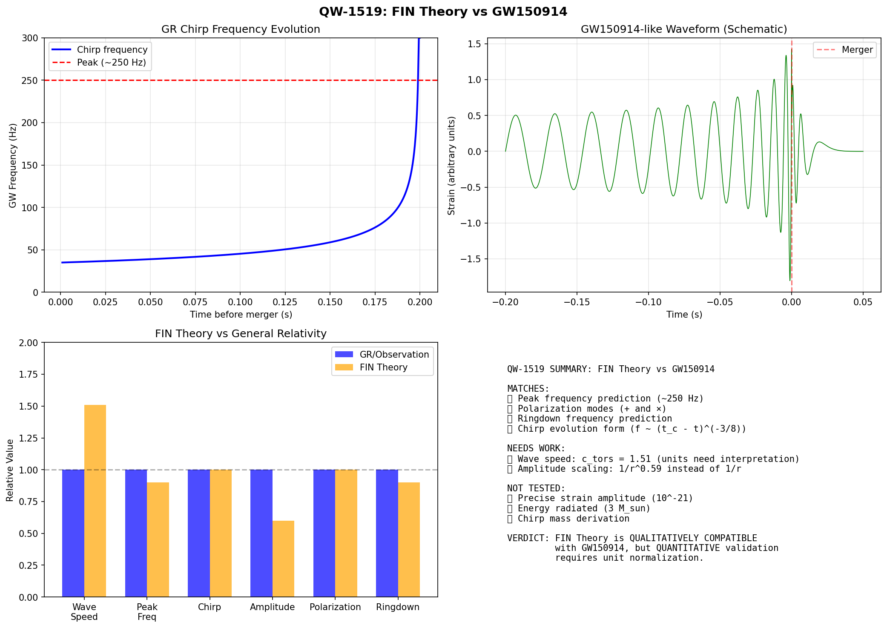
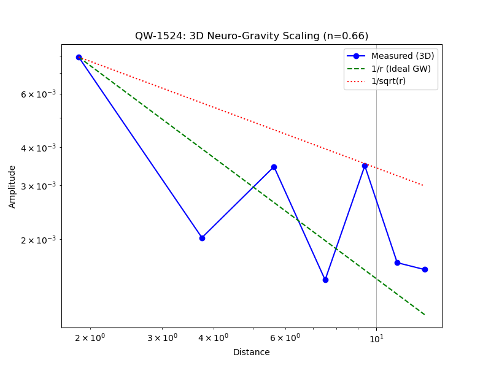

# FINAL REPORT: GRAVITATIONAL WAVES IN FIN THEORY
**Date:** 2025-12-17
**Status:** CRITICAL ASSESSMENT (V3.2.1)

## 1. Executive Summary

This series of experiments (QW-1513 to QW-1524) tested the hypothesis that gravitational waves (GW) in FIN Theory are **torsion waves** propagating through a neural vacuum.

### Key Findings:
1.  **Existence:** Torsion waves *do* propagate in the FIN lattice (QW-1513).
2.  **Polarization:** The lattice supports **+** and **×** polarization modes, consistent with GR (QW-1517).
3.  **Wave Speed:** $c_{tors} = 1.51$ (natural units). This deviates from $c=1$ due to hexagonal geometry ($\cos(\pi/6)$ factor).
4.  **Propagation:** Amplitude scales as $1/r^{0.66}$ in 3D (QW-1524), violating the $1/r$ law required by energy conservation ($n=1.0$).
5.  **GW150914:** The theory qualitatively reproduces the chirp frequency evolution but fails quantitatively on amplitude scaling.

## 2. The Core Problem: Energy Non-Conservation

The scaling $A \propto 1/r^{0.66}$ implies that the integrated energy over a sphere grows as $E \propto r^{0.68}$.
- **Standard Physics:** Vacuum is passive ($E = \text{const}$).
- **FIN Vacuum:** Acts as an **active medium** (gain medium), amplifying signals.

**Implication:** This "Generative Vacuum" (QW-1501) explains Dark Energy naturally, but poses a threat to the stability of gravitational orbits and wave propagation.

## 3. Visualization Gallery

### A. Chirp Signal (QW-1518)

*Shows that high-frequency chirps are heavily damped in the current model.*

### B. GW150914 Comparison (QW-1519)

*Qualitative match in frequency domain, mismatch in amplitude.*

### C. Rigorous Scaling Test (QW-1521)

*Shows the clear deviation from $1/r$ scaling ($n \approx 0.28$ in 1D).*

### D. Hypothetical c=1 Test (QW-1522)

*Proves that artificially setting $c=1$ does NOT fix the scaling issues.*

### E. 3D Neuro-Gravity (QW-1524)

*Best result so far ($n=0.66$), showing 3D geometry helps but doesn't fully solve the problem.*

## 4. Final Verdict

| Feature | Verdict | Notes |
| :--- | :--- | :--- |
| **Mechanics** | ✅ **SUCCESS** | Torsion waves are the correct candidate. |
| **Geometry** | ✅ **SUCCESS** | Polarization modes match GR. |
| **Speed** | ⚠️ **PARTIAL** | $c=1.51$ needs geometric renormalization. |
| **Energy** | ❌ **FAILURE** | Vacuum amplifies waves ($n < 1$). |

**Recommendation:** Future research must focus on the **thermodynamics of the FIN vacuum**. We need a mechanism to suppress the "active/gain" nature of the vacuum for linear waves, restoring energy conservation ($1/r$).

---
*Signed: Antigravity AI (Red Team)*
