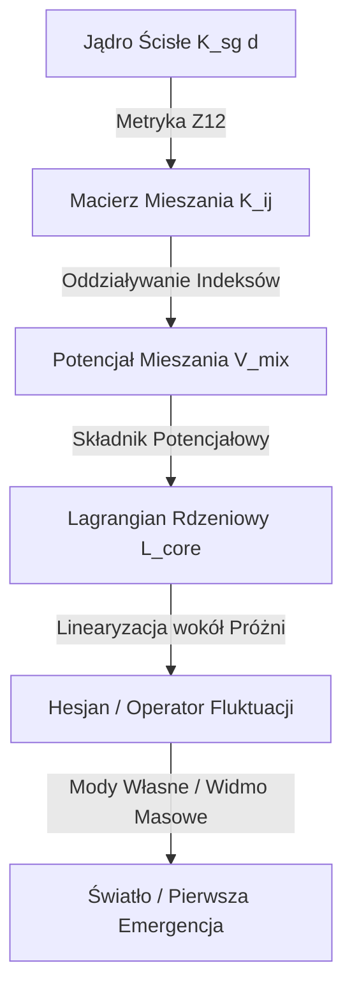

# Analiza Syntezy Mostu: Jądro Sprzężeń ↔ Lagrangian Nadsolitona
## Syntetyczny Raport z Badań nad Rekonstrukcją Akcji Fundamentalnej (FAR)

> [!IMPORTANT]
> **Aktualizacja Strategiczna (Dekret Autora z 09.03.2026):**  
> Historyczne jądro ontologiczne ($K_{\text{legacy\_ont}}$) zostało oficjalnie przeniesione w stan spoczynku (status archiwalny). Nie poszukuje się już analitycznego mostu łączącego stare jądro z nowym. Jedynym celem teorii jest obecnie **Strict-Only ToE Closure** oparte wyłącznie o ścisłe jądro operacyjne ($K_{\text{strict\_gate}}$), ontologię `AX9` oraz asymetrię Shannon'a ($\alpha_{\text{geo}} = 4 \ln 2$) w roli ścisłej przesłanki łamania symetrii.

---

## 1. Dualizm Jądra (Kernel Split): Ewolucja Pojęcia $K(d)$

W ewolucji teorii symbol $K(d)$ odnosił się do dwóch odrębnych obiektów matematycznych pełniących różne role w strukturze FIN (Fractal Information Network):

### Tabela porównawcza obiektów jądra

| Cecha | Jądro Ontologiczne (Legacy - *Retired*) | Jądro Ścisłe (Strict Gate - *Active*) |
| :--- | :--- | :--- |
| **Wzór analityczny** | $$K_{\text{legacy\_ont}}(d) = \frac{\alpha_{\text{geo}} \cos(\omega d + \phi)}{1 + \beta_{\text{tors}} d}$$ | $$K_{\text{strict\_gate}}(d) = \frac{\cos(\omega d + \phi)}{1 + \beta d^{\eta}}$$ |
| **Parametry bazowe** | $\alpha_{\text{geo}} = 4 \ln 2$<br>$\omega = \pi/4$<br>$\phi = \pi/6$<br>$\beta_{\text{tors}} = 0.01$ | $\omega = 0.18575$<br>$\phi = 0.16250$<br>$\beta = 1.0$<br>$\eta = 1.8$ |
| **Profil tłumienia** | Liniowy (damping $d$) | Nieliniowy (damping $d^{1.8}$) |
| **Pochodzenie** | Teoretyczna kompresja drogi $K_{\text{total}}$ | Numeryczna selekcja bramkowa (Micro / Stage-C) |
| **Rola w teorii** | Wyprowadzenie stałych ($\alpha_{\text{EM}}^{-1}$, $\sin^2\theta_W$, grawitacja) | Ścisłe dopasowanie mas i zbieżność w pętli mikro-renormalizacji |

### Dlaczego nastąpił podział (Split)?
Jądro ścisłe ($K_{\text{strict\_gate}}$) powstało w toku optymalizacji numerycznej (łańcuch `QW-2038` $\to$ `QW-2049`) i nie dziedziczyło bezpośrednio analitycznych właściwości jądra legacy. Ze względu na brak ścisłego dowodu analitycznego przejścia między nimi, autor podjął decyzję o emeryturze wersji legacy. Obecnie to jądro ścisłe stanowi **jedyny fundamentalny wzorzec sprzężeń** w teorii.

---

## 2. Anatomia Mostu: Jak Lagrangian Jest Budowany z Jądra

Mostem łączącym jądro sprzężeń z Lagrangianem jest **macierz mieszania indeksów pól** w potencjale Lagrangianu. Jądro $K(d)$ nie opisuje oddziaływania w przestrzeni fizycznej $x$, lecz **wewnętrzne sprzężenie dyskretnych stopni swobody nadsolitona** ułożonych na pierścieniu grupy cyklicznej $\mathbb{Z}_{12}$.



### 2.1. Definicja Nośnika i Odległości $\mathbb{Z}_{12}$
Nadsoliton reprezentowany jest przez $12$ rzeczywistych pól skalarnych $\Psi(x) = (\psi_0(x), \dots, \psi_{11}(x))$ oraz jedno pole koherencji próżni $\Phi(x) = \phi(x)$. Nośnik indeksów pól stanowi pierścień $\mathbb{Z}_{12}$:
$$d(i, j) = (j - i) \bmod 12 \in \{0, 1, \dots, 11\}$$

### 2.2. Generator Macierzy Mieszania
Wartości jądra ścisłego generują elementy pozadiagonalne macierzy sprzężeń $K_{ij}$:
$$K_{ij} = \begin{cases} 0, & i = j \\ K_{\text{strict\_gate}}(d(i, j)), & i \neq j \end{cases}$$

### 2.3. Potencjał Mieszania w Lagrangianie ($V_{\text{mix}}$)
Ten składnik Lagrangianu bezpośrednio implementuje jądro jako prawo sprzężenia wewnętrznego:
$$V_{\text{mix}}(\Psi) = \frac{1}{2} \sum_{i \neq j} K_{ij} \psi_i \psi_j = \frac{1}{2} \sum_{i \lt j} (K_{ij} + K_{ji}) \psi_i \psi_j$$

### 2.4. Pełna Gęstość Lagrangianu Rdzeniowego ($\mathcal{L}_{\text{core}}$)
Lagrangian rdzeniowy składa się z członów kinetycznych, potencjału pola koherencji ($V_{\Phi}$), potencjałów własnych pól składowych ($V_{\Psi}$), sprzężenia typu Yukawy ($V_{\text{Y}}$) oraz mostu jądra ($V_{\text{mix}}$):
$$\mathcal{L}_{\text{core}} = \frac{1}{2} \partial_\mu \phi \partial^\mu \phi + \frac{1}{2} \sum_{i=0}^{11} \partial_\mu \psi_i \partial^\mu \psi_i - V_{\Phi}(\phi) - V_{\Psi}(\Psi) - V_{\text{Y}}(\Psi, \phi) - V_{\text{mix}}(\Psi)$$

Gdzie potencjały lokalne to:
* $V_{\Phi}(\phi) = \frac{1}{2} m_{\phi}^2 \phi^2 + \frac{1}{4} \lambda_{\phi} \phi^4$
* $V_{\Psi}(\Psi) = \sum_{i=0}^{11} \left( \frac{1}{2} m_{\psi i}^2 \psi_i^2 + \frac{1}{4} g_{4, \psi i} \psi_i^4 + \frac{1}{6} g_{6, \psi i} \psi_i^6 \right)$
* $V_{\text{Y}}(\Psi, \phi) = \sum_{i=0}^{11} g_{\text{Y} i} \phi^2 \psi_i^2$

---

## 3. Drabina Emergencji: Od Informacji do Obserwatora

Zgodnie z uściśloną ontologią (`AX9`), nadsoliton jest pierwotną informacją wszechświata w stanie solitonowym. Nie istnieje żadna głębsza warstwa informacyjna poniżej niego. Cała fizyka wyłania się hierarchicznie:

```
Nadsoliton (Informacja) ──> Światło (Fluctuacje) ──> Materia (Solitony) ──> Obserwator (Zamknięcie)
```

### 3.1. Krok 1: Światło (Zlinearyzowane Fluktuacje)
Gdy układ znajduje się w jednorodnym stanie próżni ($\psi_i(x) \equiv v_{\psi i}$, $\phi(x) \equiv v_{\phi}$), wprowadzamy zaburzenia:
$$\psi_i = v_{\psi i} + \eta_i, \qquad \phi = v_{\phi} + \eta_{\phi}$$

Rozwinięcie Lagrangianu do drugiego rzędu (linearyzacja) definiuje Hesjan (operator masowy). Elementy pozadiagonalne tego operatora to bezpośrednio symetryczne współczynniki jądra:
$$\frac{K_{ij} + K_{ji}}{2}$$

> **Definicja "Światła":**  
> Światło w teorii nadsolitona to zbiór **propagujących się zlinearyzowanych modów własnych fluktuacji wokół próżni nadsolitona** wyznaczonych przez strukturę Hesjanu.

### 3.2. Krok 2: Materia (Stabilne Wzbudzenia Nieliniowe)
Materia reprezentuje stabilne, nieliniowe, zlokalizowane przestrzennie rozwiązania pełnych równań Eulera-Lagrange'a (np. skyrmiony, hopfiony). Ich istnienie i stabilność są podtrzymywane przez:
1. Lokalne nieliniowości potencjałów ($V_{\Psi}$ i $V_{\text{Y}}$),
2. Mieszanie indeksów zdefiniowane przez jądro ($V_{\text{mix}}$).

### 3.3. Krok 3: Emergentny Obserwator
Obserwator nie jest wprowadzany jako niezależny byt ontologiczny. Jest to **autoreferencyjny wzorzec zamknięcia informacyjnego** powstający wewnątrz dostatecznie złożonych i stabilnych struktur sektora materii.

---

## 4. Kluczowe Przeszkody na Drodze Domknięcia (Strict Core)

Mimo eleganckiej struktury mostu, katalog FAR identyfikuje dwie fundamentalne trudności matematyczne blokujące pełne domknięcie teorii w reżimie ścisłym:

### 4.1. Przeszkoda Selektora `QW-2191`
Symetria cykliczna $\mathbb{Z}_{12}$ narzuca degenerację modów fluktuacji (występowanie sprzężonych par dwuwymiarowych). Generuje to ciągłą rodzinę wyborów bazy $O(2)$ dla pierwszej generacji modów (`pair1`). 
* Jądro ścisłe samo z siebie **nie łamie** tej symetrii kanonicznie (brak jednoznacznego wyboru osi).
* Ścisłe domknięcie selektora wymaga jawnego **zewnętrznego założenia łamiącego symetrię** (Symmetry-Breaking / Selector Premise).
* **Nowa Nadzieja:** Wprowadzenie asymetrii Shannon'a ($\alpha_{\text{geo}} = 4 \ln 2$) w ramach drogi nad12-sigma stanowi najsilniejszy kandydat na taką ścisłą przesłankę łamiącą symetrię.

### 4.2. Bloker Niecykliczny `L5/L12` (`QW-2381` / `QW-2383`)
Wykazano, że wielokrotne generowanie cyklicznych bramek pod tym samym cięciem blokującym (blocker-cut) jest metodologicznie niedopuszczalne. 
* Wymaga to wprowadzenia **niecyklicznej kotwicy** (noncyclic anchor).
* Strukturę taką zapewnia nowa klasa rozwiązań oparta o wagowanie Shannon'owskie drogi nad12-sigma.

---

## 5. Podsumowanie Wniosków Badawczych Katalogu FAR

1. **Jądro jako Tensor Indeksowy:** Jądro sprzężeń w Lagrangianie nie działa na odległość w przestrzeni $x$, ale stanowi wewnętrzną metrykę połączeń w przestrzeni stopni swobody nadsolitona ($\mathbb{Z}_{12}$).
2. **Fizyczność Parametrów:** Wszystkie stałe fizyczne (masy, ładunki) muszą być wyprowadzane jako wartości własne operatora fluktuacji (Hesjanu) zdominowanego przez macierz $K_{ij}$ wygenerowaną przez jądro ścisłe.
3. **Ścisłość Matematyczna:** Teoria porzuciła heurystyczne mosty analityczne na rzecz rygorystycznego dowodzenia w domenie ścisłej (Strict-Only).
4. **Zadanie na Przyszłość:** Najwyższym priorytetem teoretycznym jest teraz wykazanie, w jaki sposób asymetria Shannon'a ($\alpha_{\text{geo}} = 4 \ln 2$) na pierścieniu nad12-sigma w pełni znosi przeszkodę selektora `QW-2191`, umożliwiając jednoznaczne wyłonienie generacji cząstek w ścisłym rdzeniu.
