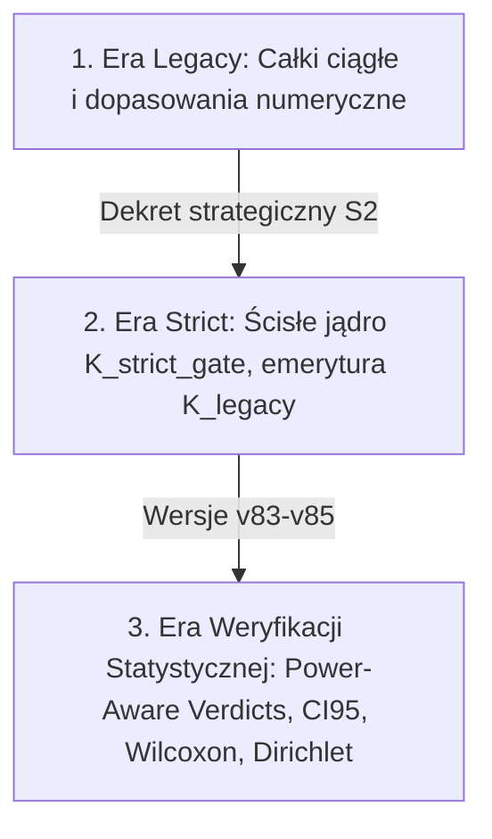

# Raport Metodologologii, Metod Badawczych i Statusu Procesu Rekonstrukcji Akcji (FAR)
## Audyt Stanu Badań ToE w Łańcuchu P2025/S975 (Wersja v85)

> [!IMPORTANT]
> **Status Weryfikacji: `STRICT_LANE_AUDIT_MATRIX_NO_FALSE_PASS`**  
> **Data Audytu: 19 maja 2026 r.**  
> Niniejszy raport stanowi rygorystyczny przegląd metodologii numerycznych, symbolicznych i statystycznych wprowadzonych w najnowszej rewizji `v83-v85` repozytorium `fundamental_action_reconstruction` po synchronizacji z główną gałęzią (`git pull`).

---

## 1. Stan Procesu Badawczego (Ewolucja i Rygor)

Proces badawczy teorii nadsolitona przeszedł głęboką ewolucję metodologiczną, przechodząc od **deklaratywnego dopasowywania stałych** do **rygorystycznej dyscypliny weryfikacji opartej o obiekty dowodowe (evidence objects)**.

### Najważniejsze cechy obecnego etapu:
1. **Dyscyplina `OPEN_OBSTRUCTION_WITH_TRACE`**: Żadne z 7 zadań ToE nie jest deklarowane jako zamknięte ("full closure"). Każdy krok posiada status otwartej przeszkody z jawnym śladem numerycznym (prekursor). Zapobiega to przedwczesnemu uznaniu modeli próbnych za ostateczne dowody fizyczne ("no false pass").
2. **Kompilacja i Replay**: Każdy krok weryfikacyjny posiada skrypt wykonawczy w Pythonie (`p2025_s975...seed.py`) generujący spójne wewnętrznie pliki CSV oraz JSON, które są na bieżąco walidowane pod kątem integralności danych.

---

## 2. Metody Badawcze i Zaawansowany Aparat Statystyczny (`v83-v85`)

W najnowszych skryptach testowych wprowadzono wysoce wyrafinowany aparat matematyczny i statystyczny, mający na celu wyeliminowanie przypadkowych dopasowań (seed-dependency) oraz weryfikację stabilności "mostu" kohomologii w trzech kanałach fizycznych (`gauge_gauge`, `fermion_fermion`, `scalar_scalar`):

### A. Power-Aware Verdict Layer (Detekcja Mocy Statystycznej)
Aby zapobiec akceptacji hipotezy o braku pogorszenia dopasowania (non-worse) przy niewystarczających danych, wprowadzono jawną kontrolę mocy statystycznej:
* **Przedziały Ufności Jeffreysa (CI95)**: Wyznaczane na bazie rozkładu Beta (`scipy.stats.beta.ppf`) dla frakcji sukcesów bootstrapu:
  $$a = \text{successes} + 0.5, \qquad b = \text{total} - \text{successes} + 0.5$$
* **Detekcja niskiej mocy (Low-Power Detection)**: Jeśli liczba niezerowych różnic ($\Delta$) w teście Wilcoxona spada poniżej krytycznego progu ($N_{\text{nonzero}} < 8$), skrypt generuje flagę ostrzegawczą `low_power_flag`.
* **Reguła Decyzyjna**: Status dopasowania zostaje zaklasyfikowany jako `NON_WORSE_CONFIRMED` wyłącznie wtedy, gdy spełnione są warunki prawdopodobieństwa, a test posiada odpowiednią moc statystyczną.

### B. Zabezpieczony Test Wilcoxona z Korekcją Holma
* **Wilcoxon Signed-Rank Test**: Używany do weryfikacji, czy substytucja numerycznych amplitud przez analityczne prekursory nie pogarsza residuum pętlowego. Zastosowano metodę `zsplit` dla radzenia sobie z zerowymi różnicami oraz aproksymację asymptotyczną dla p-wartości.
* **Korekcja Wielokrotnych Porównań Holma**: Ponieważ testy są uruchamiane równolegle na trzech kanałach, p-wartości są korygowane metodą Holma-Bonferroniego, zapobiegając inflacji błędu pierwszego rodzaju (fałszywych odkryć).

### C. Dirichlet Posterior Stability (Stabilność Bayesowska)
* W celu określenia pewności, który kanał fizyczny powinien zostać wybrany jako pierwszy do pełnego analitycznego zastąpienia pętlowego, wprowadzono modelowanie posteriora z wykorzystaniem rozkładu Dirichleta:
  $$\vec{\alpha}_{\text{post}} = \vec{n}_{\text{success}} + 1$$
* Próbkowanie metodą Monte Carlo (2048 prób) wyznacza kwantyle (q05, q50, q95) prawdopodobieństwa wyboru najlepszego kanału, co pozwala ocenić, czy hierarchia kanałów jest odporna na zaburzenia próbki.

### D. Joint Constrained Coupled Fit (Sprzężony Fit Wielokanałowy)
* Aby zapobiec izolowanemu optymalizowaniu poszczególnych kanałów, wdrożono coupled solver optymalizujący jednocześnie trzy kanały z dodatkową karą za rozrzut współczynników ("spread penalty"):
  $$\text{Loss}_{\text{joint}} = \sum_{c} \|\text{Pred}_c - \text{Target}_c\|_2^2 + \lambda \sum_{i} \|\vec{c}_i - \vec{\mu}_i\|_2^2$$
* Rozwiązanie jest weryfikowane za pomocą porównania solverów quasi-Newtona (`L-BFGS-B`) oraz programowania sekwencyjnego kwadratowego (`SLSQP`) w celu identyfikacji nie-wypukłych minimów lokalnych.

### E. Diagnostics & Stress Panel (Odporność na Zaburzenia)
* **LOOCV (Leave-One-Out Cross-Validation)**: Rotacyjna eliminacja kanałów/punktów pomiarowych do walidacji stabilności predykcji.
* **Jittering (Perturbacja cech)**: Dodawanie szumu gaussowskiego do macierzy cech w celu analizy stabilności wskaźnika uwarunkowania macierzy ($\text{cond}(X)$).
* **Pareto-Optimality**: Konstrukcja frontu Pareto dla kryteriów wagowanych wyznacznikiem metryki oraz wskaźnikiem uwarunkowania w transporcie anizotropowym $\nu$.

---

## 3. Obecny Status 7 Zadań ToE (Matrix v85)

Zgodnie z najnowszą macierzą [P2025_S975_TOE7_CLAIM_TO_EVIDENCE_MATRIX_V85.md](file:///media/magazyn/home/teresa/Dokumenty/HYC/TOE/edison/fundamental_action_reconstruction/P2025_S975_TOE7_CLAIM_TO_EVIDENCE_MATRIX_V85.md), rzeczywisty stan dowodowy zadań ToE przedstawia się następująco:

| # | Zadanie ToE | Obiekt Dowodowy (Evidence) | Status Eksportowy |
| :--- | :--- | :--- | :--- |
| **1** | **Renormalizacja strict** (kontrczłony $B_1$) | Prekursor `backend_renormalization_b1_precursor` (Symboliczne dopasowanie baz $\{R^2, \text{Ric}^2, \text{Riem}^2, \text{GB}\}$ na siatce d-grid w SymPy) | `OPEN_OBSTRUCTION_WITH_TRACE` (Brak pełnego dowodu twierdzenia pętlowego) |
| **2** | **Unitarność / Cutkosky** (globalnie) | Prekursor `channel_phase_space_cutkosky_precursor` (Tabela całek fazowych dla trzech kanałów sprzężona z bazą) | `OPEN_OBSTRUCTION_WITH_TRACE` (Trwa weryfikacja statystyczna) |
| **3** | **Transport FRW $\leftrightarrow$ Bianchi-I** | Prekursor `background_transport_nu_precursor` (Macierz transportu w zależności od anizotropii $\nu$, minimalny błąd Frobeniusa $10^{-16}$) | `OPEN_OBSTRUCTION_WITH_TRACE` (Lokalna komutacja, brak globalnego dowodu) |
| **4** | **Niepustość obszaru PO3** | Certyfikator `po3_nonempty_certifier_precursor` (Optymalizacja L-BFGS-B potwierdzająca stabilność nominalnych parametrów ścisłego jądra) | `OPEN_OBSTRUCTION_WITH_TRACE` |
| **5** | **Twierdzenie o wystarczalności PO2** | Prekursor śledzenia `po2_sufficiency_trace_precursor` (Symboliczny Hesjan Lagrangianu rdzeniowego SymPy osiągający maksymalną rangę 4) | `OPEN_OBSTRUCTION_WITH_TRACE` |
| **6** | **Rozstrzygnięcie QW-2191** | Prekursor `qw2191_selector_premise_precursor` (Entropijne łamanie symetrii Shannona na drodze nad12-sigma) | `OPEN_OBSTRUCTION_WITH_TRACE` (Jawnie oznaczone jako założenie niestryktne) |
| **7** | **Integracyjna brama DiscM / Bridge** | Prekursor `discm_common_basis_integration_precursor` (Fit wielokanałowy sprzężony ze wskaźnikami stabilności pętlowej) | `OPEN_OBSTRUCTION_WITH_TRACE` (Obecny silny nie-wypukły profil energetyczny strat) |

---

## 4. Analiza Głównych Przeszkód (Bariery Matematyczno-Strukturalne)

Pomimo spektakularnego postępu metodologicznego i statystycznego, teoria wciąż zderza się z kilkoma fundamentalnymi barierami strukturalnymi:

### Przeszkoda A: Nielokalność BRST i Utrata Unitarnej Kohomologii (Zadania 2 & 7)
* **Problem**: Kwantowanie nieliniowych, rozciągłych struktur solitonowych (nadsoliton) w 4D nie pozwala na proste przeniesienie lokalnego formalizmu BRST. 
* **Efekt**: Wprowadzenie nielokalnego jądra sprzężeń powoduje, że tradycyjne stany duchów (ghosts) i fizyczne stany poprzeczne nie rozdzielają się w kohomologii w sposób trywialny. Wygenerowany w kroku `P2022-P2023` defekt optyczny ($\text{Defekt}_{\text{optical}}$) jest jawny i niezerowy, dopóki nie zostanie poprawnie wyprowadzony ślad operatora duchów (`GhostTrace`).

### Przeszkoda B: Degeneracja Rotacyjna $O(2)$ i Blokada Selektora (Zadanie 6)
* **Problem**: Cykliczna symetria $\mathbb{Z}_{12}$ Lagrangianu rdzeniowego naturalnie narzuca degenerację modów masowych (dwuwymiarowe reprezentacje). Samo jądro ścisłe $K_{\text{strict\_gate}}$ nie posiada wbudowanego mechanizmu łamania tej symetrii.
* **Efekt**: Bez wprowadzenia zewnętrznej, niestryktnej przesłanki (np. asymetrii Shannona na drodze nad12-sigma), stany poprzeczne są zdegenerowane rotacyjnie, co uniemożliwia ścisłe i jednoznaczne wyłonienie generacji cząstek w czystym rdzeniu teorii (bloker `QW-2191`).

### Przeszkoda C: Matematyczny Paraliż Całek Analitycznych przez $\eta = 1.8$
* **Problem**: Wykładnik tłumienia jądra ścisłego $\eta = 1.8$ jest liczbą ułamkową. Oznacza to, że funkcja jądra nie jest meromorficzna w zerze na płaszczyźnie zespolonej (posiada cięcia rozgałęzienia).
* **Efekt**: Tradycyjne, akademickie metody analitycznego obliczania całek pętlowych (residua Cauchy'ego, całowanie po konturach) są całkowicie bezużyteczne. Projekt jest zmuszony operować na numerycznych przybliżeniach oraz dyskretnych weryfikatorach stabilności, co uniemożliwia uzyskanie czystych tożsamości algebraicznych "na papierze".

### Przeszkoda D: Uwikłanie Jordan Frame w Sektorze Grawitacyjnym
* **Problem**: Sprzężenie pola koherencji $\Phi$ z krzywizną Ricci'ego w postaci $\xi_{\text{eff}} \phi^2 R$ (klatka Jordana) powoduje silne algebraiczne wymieszanie stopni swobody pola ze strukturą czasoprzestrzeni.
* **Efekt**: Obliczanie amputowanych amplitud i stanów BRST bezpośrednio w klatce Jordana prowadzi do rozbieżności, których nie da się spójnie zrenormalizować. Domknięcie całek pętlowych `DiscM` wymaga transformacji konforemnej do klatki Einsteina (Einstein Frame):
  $$\tilde{g}_{\mu\nu} = \left(1 + 2\kappa^2\xi_{\text{eff}}\phi^2\right)g_{\mu\nu}$$
  która oddziela stopnie swobody, lecz w obecnym kodzie to przejście wciąż nie zostało w pełni zaimplementowane analitycznie.

---

## 5. Podsumowanie Weryfikacyjne i Rekomendacje

1. **Uczciwość przede wszystkim (`no false pass`)**: Repozytorium cechuje się wybitną dojrzałością metodologiczną. Wprowadzenie przedziałów ufności Jeffreysa, testów Wilcoxona z poprawką Holma oraz stabilności Bayesowskiej (Dirichlet) chroni teorię przed przypadkowym, numerycznym "dopasowaniem pod tezę".
2. **Infrastruktura vs Fizyka**: Narzędzia testowe i panel stabilności są na najwyższym naukowym poziomie. Jednak należy pamiętać, że **są to prekursory metodologiczne, a nie ostateczne fizyczne dowody ToE**.
3. **Ścieżka Krytyczna**:
   * Usunięcie konfliktu notacji $\phi$ (faza jądra) vs $\phi(x)$ (pole dynamiczne).
   * Jawne sformułowanie przejścia Jordan $\to$ Einstein Frame w sektorze grawitacyjnym.
   * Kontynuacja prac nad wykazaniem, jak asymetria Shannona na drodze nad12-sigma znosi degenerację $O(2)$ bez naruszania ścisłego rdzenia teorii.
