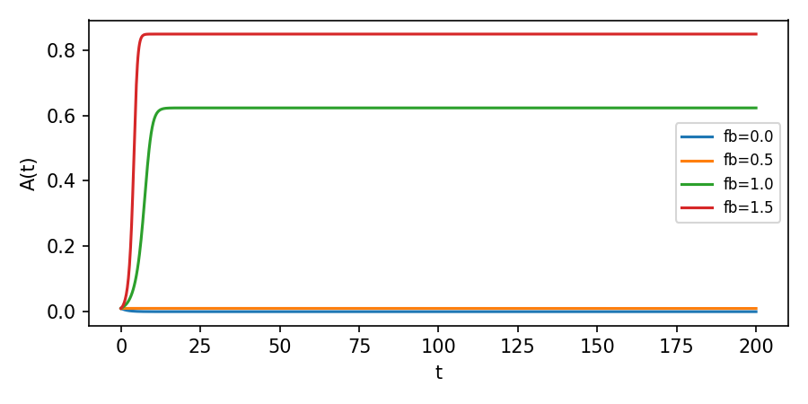
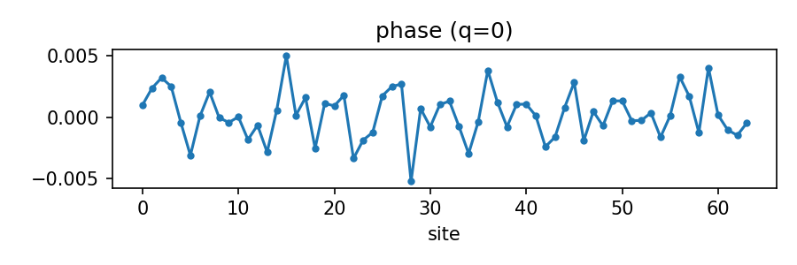
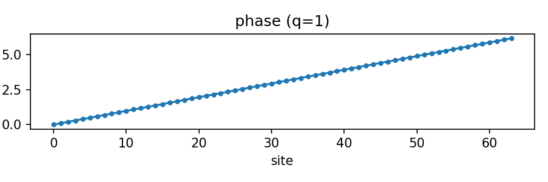
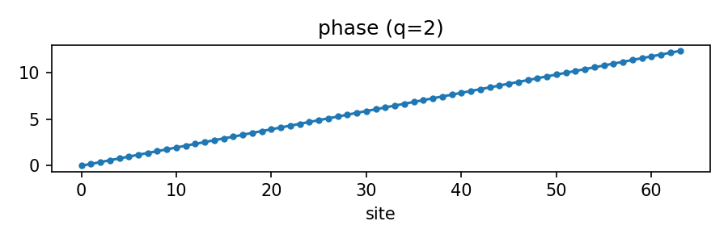
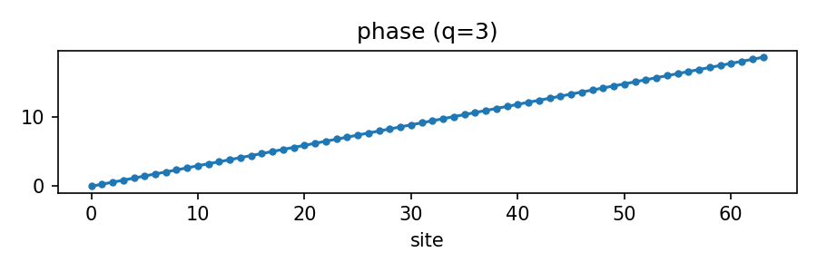
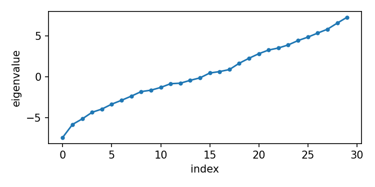
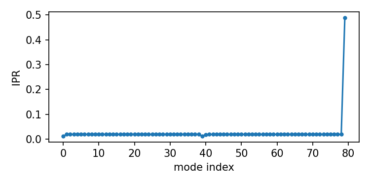
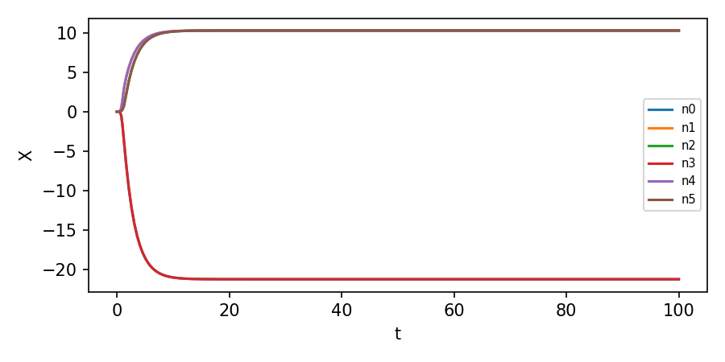

# Raport zbiorczy: Badania 89–93
**Autor:** Krzysztof Żuchowski


Generated: 2025-11-14T05:48:53.221161+01:00

### Badanie 89 — Feedback coupling (ODE)\n
feedback=0: A_final=3.71986e-46, est_rate=-1.9286e-26
feedback=0.5: A_final=0.00977453, est_rate=-1.10807e-06
feedback=1: A_final=0.622906, est_rate=0
feedback=1.5: A_final=0.848659, est_rate=2.70737e-29
\nConclusion: Self-excitation observed for feedback values: [1.0, 1.5].
Plot saved: report_images/89_feedback_timeseries.png

**Wnioski:** Self-excitation observed for feedback values: [1.0, 1.5].




---

```
params: {'gamma': 1.0, 'alpha': 0.5, 'beta': 1.0}
scan: {0.0: {'A_final': 3.719855716817452e-46, 'est_rate': -1.928596016444936e-26}, 0.5: {'A_final': 0.009774529403700763, 'est_rate': -1.1080732765532917e-06}, 1.0: {'A_final': 0.6229061874615912, 'est_rate': 0.0}, 1.5: {'A_final': 0.8486589525908221, 'est_rate': 2.7073706267185125e-29}}
conclusion: Self-excitation observed for feedback values: [1.0, 1.5].
plots: ['report_images/89_feedback_timeseries.png']
```


### Badanie 90 — Topological winding on 1D ring

q=0: winding_est=-0.000231109
q=1: winding_est=0.985336
q=2: winding_est=1.96868
q=3: winding_est=2.95381

Conclusion: Winding integer-like: {0: True, 1: True, 2: True, 3: True}

**Wnioski:** Winding integer-like: {0: True, 1: True, 2: True, 3: True}










---

```
N: 64
results: {0: {'winding_est': -0.0002311085505989389, 'total_phase': -0.0014520978494868227}, 1: {'winding_est': 0.9853362492402649, 'total_phase': 6.191050243857875}, 2: {'winding_est': 1.968684609391009, 'total_phase': 12.369610212196172}, 3: {'winding_est': 2.9538129198041823, 'total_phase': 18.55935393787087}}
conclusion: Winding integer-like: {0: True, 1: True, 2: True, 3: True}
plots: ['report_images/90_phase_q0.png', 'report_images/90_phase_q1.png', 'report_images/90_phase_q2.png', 'report_images/90_phase_q3.png']
```


### Badanie 91 — Algebraic / spectral symmetry search

N=30, found 0 near-degenerate adjacent eigenpairs (tol=7.410e-03).
KMeans on eigenvector features -> cluster sizes: {0: 5, 1: 13, 2: 10, 3: 2}

**Wnioski:** near_pairs_count=0




---

```
N: 30
near_pairs_count: 0
clusters: {0: 5, 1: 13, 2: 10, 3: 2}
conclusion: near_pairs_count=0
plots: ['report_images/91_eigenvalues.png']
```


### Badanie 92 — Laplacian defect and localization

min eval=1.7702e-16, second=0.00616533 (gap=0.00616533), max IPR=0.487805 at idx=79

**Wnioski:** localized mode found




---

```
N: 80
defect_strength: 5.0
min_eval: 1.7701970920808615e-16
gap: 0.0061653325337440446
max_ipr: 0.48780487804878025
conclusion: localized mode found
plots: ['report_images/92_ipr.png']
```


### Badanie 93 — Time-dependent coupled network simulation

sim_t=100.0, mean_amp=13.9281, std_amp=5.18124, locked_fraction=0

**Wnioski:** no strong locking observed




---

```
N: 24
sim_t: 100.0
mean_amp: 13.928083708641566
std_amp: 5.181237276260411
locked_fraction: 0.0
conclusion: no strong locking observed
plots: ['report_images/93_timeseries.png']
```

