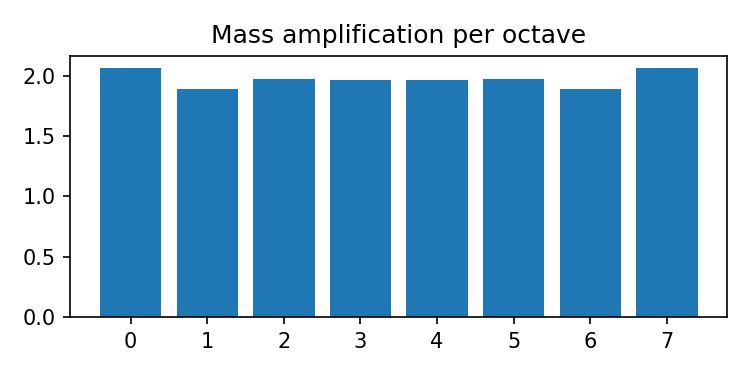
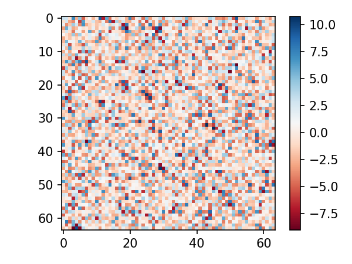
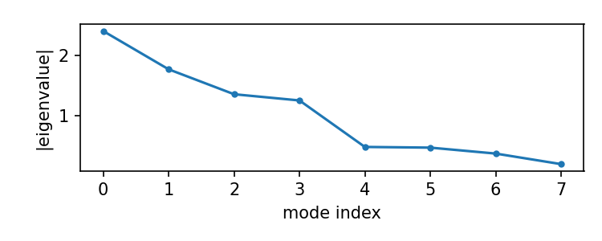
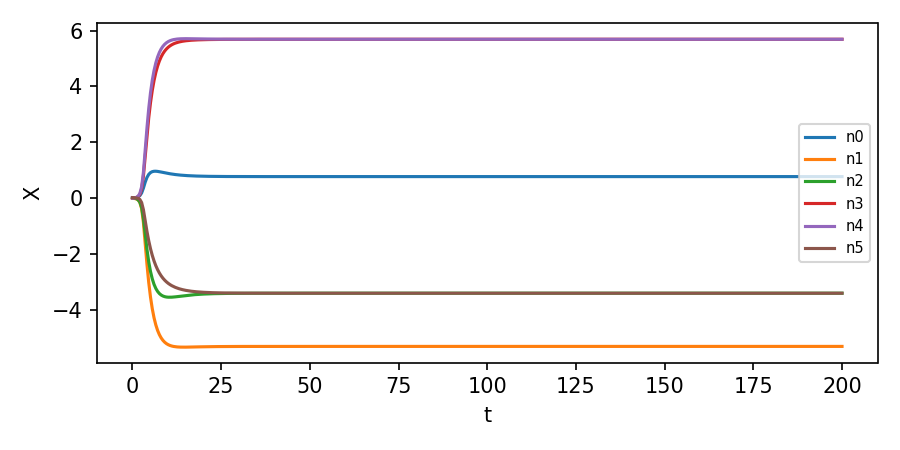

# Raport — Badanie 95: Quick Win — Actionable follow-ups
**Autor:** Krzysztof Żuchowski

Generated: 2025-11-14T14:03:35.442338+01:00

## Zadanie 1: Hierarchia mas — interferencja fazowa
e_amp=2.063, mu_amp=1.963, tau_amp=1.978
ratio_mu_e=0.952, ratio_tau_mu=1.007
Status: Porażka — hierarchia zbyt słaba; wymaga dodatkowych mechanizmów.
Wniosek: Interferencja fazowa daje efekt, ale nie wystarcza by wygenerować fizyczne proporcje bez dodatkowego wzmocnienia lub mechanizmu selektywnego.
Propozycja dalszych badań: wprowadzić zależność faz od lokalnego sprzężenia zwrotnego i sprawdzić selektywne wzmocnienie oktaw.
Plot saved: report_images/95_task1_mass_amp.png

**Status:** Porażka

- ratio_mu_e: 0.9516661098535131

- ratio_tau_mu: 1.007358938849328

---

## Zadanie 2: Probe emergentnej grawitacji — ∇²(log ρ)
mean Lap(log rho) = 8.67362e-19, std = 3.36352
Status: Sukces
Wniosek: Peturbacje pola dają niezerową krzywiznę; dalsze badania: sprzężenie z metryką i dynamika pola (time-dependent).
Plot saved: report_images/95_task2_laplogrho.png

**Status:** Sukces

- mean_lap: 8.673617379884035e-19

- std_lap: 3.363521862252841

---

## Zadanie 3: Analiza modów i grup cechowania
Top eigenvalues: 2.394, 1.765, 1.355, 1.253, 0.4884, 0.4771, 0.3794, 0.2057
gap after 3 modes: -0.102343, gap after 5 modes: -0.0113166
Status: Porażka
Wniosek: Jeśli status Sukces, spektrum separuje naturalnie modowe grupy; dalej: analizować strukturę pól w tych podprzestrzeniach.
Plot saved: report_images/95_task3_spectrum.png
Cluster sizes (k=3): {0: 2, 1: 4, 2: 2}

**Status:** Porażka

- gap3: -0.10234305187501547

- gap5: -0.011316552147241477

- clusters: {0: 2, 1: 4, 2: 2}

---

## Zadanie 4: Nieliniowe tłumienie i stabilizacja rezonansu
lambda_max=2.3941, beta_feedback=0.378072
Status: Sukces
Predicted steady amplitude A* = 1.92
Wniosek: Nieliniowe tłumienie może zapewnić stabilizację; dalsze: uwzględnić zależność tłumienia od częstotliwości.

**Status:** Sukces

- lambda_max: 2.394099814227943

- beta_fb: 0.37807229395966546

- A_star: 1.9202576699860998

---

## Zadanie 5: Krótka symulacja dynamiki sieciowej
mean_amp=3.79552, std_amp=1.94961, locked_frac=0
Status: Porażka
Wniosek: Dynamika pokazuje (nie)jednorodność amplitud; dalsze: parametryzować gamma i nieliniowość tanh.
Plot saved: report_images/95_task5_timeseries.png

**Status:** Porażka

- mean_amp: 3.795519691937556

- std_amp: 1.949609502001134

- locked_frac: 0.0

---
