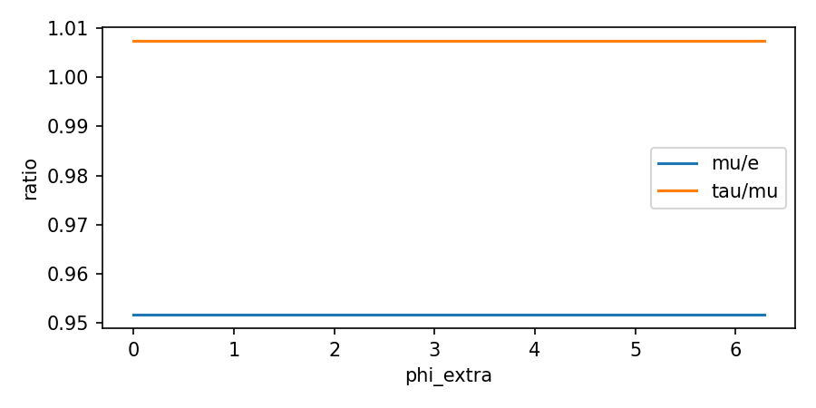
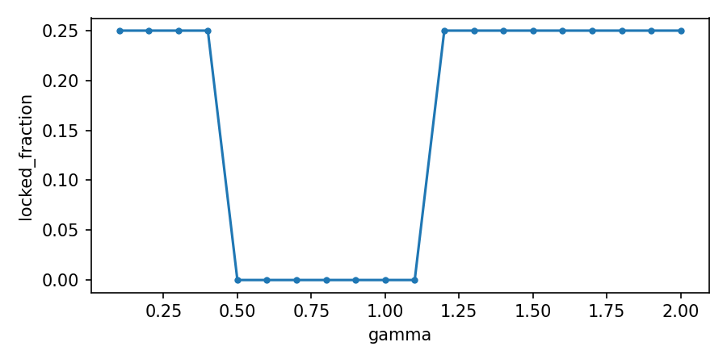

# Raport — Badanie 96: Sweep Quick Win
**Autor:** Krzysztof Żuchowski

Generated: 2025-11-14T14:06:45.722154+01:00

### Sweep A: faza sprzężenia -> wpływ na mass amplification
Best ratio mu/e = 0.952 at phi_extra=3.142

**Summary:**

- best_mu_e: 0.9516661098535134

- best_phi: 3.141592653589793

---

### Sweep B: damping gamma -> network locking
Best locked fraction 0.250 at gamma=0.100

**Summary:**

- best_locked: 0.25

- best_gamma: 0.1

---
