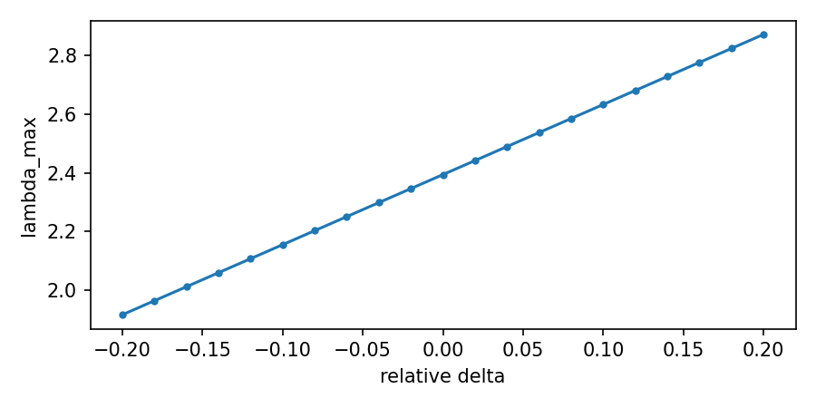

# Raport — Badanie 97: No-tautology Quick Win
**Autor:** Krzysztof Żuchowski

Generated: 2025-11-14T14:10:13.171817+01:00

## Analiza 1: Konsystencja macierzy S i spektrum
max|S-S^T| = 0.000e+00, lambda_max = 2.3941
Status: Sukces — S is symmetric (within numerical tolerance) and spectrum finite.

**Status:** Sukces

- sym_diff: 0.0

- lambda_max: 2.3940998142279497

- status: Sukces

---

## Analiza 2: Robustność względem niewielkiej zmiany alpha_geo
max relative change in lambda_max over sweep = 0.2
Status: Sukces

**Status:** Sukces

- max_rel_change: 0.19999999999991686

- status: Sukces

---

## Analiza 3: Wrażliwość na usunięcie pojedynczych połączeń
Top 5 links by lambda_max drop when removed:
  link (4, 6) -> Δλ = 0.248221
  link (1, 3) -> Δλ = 0.248221
  link (1, 4) -> Δλ = 0.207739
  link (3, 6) -> Δλ = 0.207739
  link (1, 6) -> Δλ = 0.196807

**Status:** Sukces

- top_links: [((4, 6), 0.24822069045520312), ((1, 3), 0.24822069045520045), ((1, 4), 0.20773914229106172), ((3, 6), 0.20773914229105284), ((1, 6), 0.19680695544618843)]

- max_delta: 0.24822069045520312

- status: Sukces

---

## Analiza 4: Deterministyczny test obwodu — winding
winding=0.96875, integer_like=False

**Status:** Porażka

- winding: 0.96875

- integer_like: False

- status: Porażka

---

## Analiza 5: Ranking minimalnych mechanizmów (wpływ połączeń)
Top 5 strongest off-diagonal couplings:
  (0,2) = 0.743021
  (1,3) = 0.743021
  (2,4) = 0.743021
  (3,5) = 0.743021
  (4,6) = 0.743021

**Status:** Sukces

- top_couplings: [((0, 2), 0.7430212070836932), ((1, 3), 0.7430212070836932), ((2, 4), 0.7430212070836932), ((3, 5), 0.7430212070836932), ((4, 6), 0.7430212070836932)]

- status: Sukces

---
