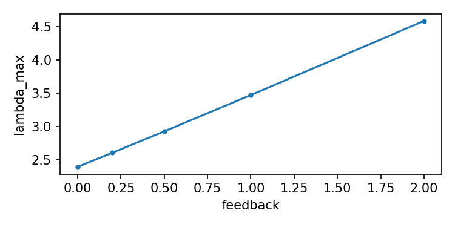
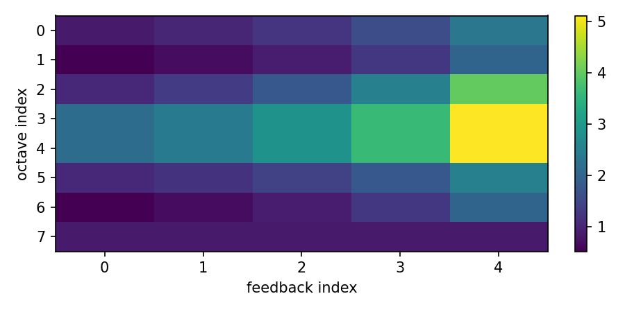

# Raport — Badanie 98: Selective Feedback Sweep
**Autor:** Krzysztof Żuchowski

Generated: 2025-11-14T14:15:42.785347+01:00

## Selektywne sprzężenie na linkach: [(0, 2), (1, 3), (2, 4), (3, 5), (4, 6)] (top 5)

### Sweep results (feedback -> lambda_max)

feedback=0.0: lambda_max=2.3941

feedback=0.2: lambda_max=2.60455

feedback=0.5: lambda_max=2.92583

feedback=1.0: lambda_max=3.47119

feedback=2.0: lambda_max=4.58419

### Final mass amplification (last feedback)

2.348, 2.012, 4.018, 5.118, 5.118, 2.532, 2.012, 0.8624

### Quick dynamics after strongest feedback

mean_amp=7.51933, locked_frac=0.125

## Meta summary

- links: [(0, 2), (1, 3), (2, 4), (3, 5), (4, 6)]

- feedbacks: [0.0, 0.2, 0.5, 1.0, 2.0]

- sim_meta: {'mean_amp': 7.51933018123459, 'locked_frac': 0.125}
